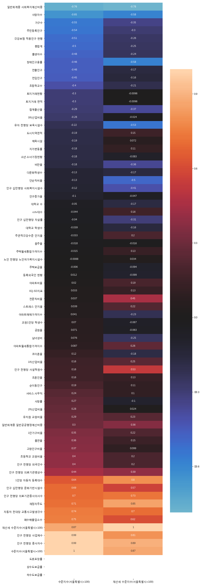

# Economy_지역간 경제 불균형 영향요인 발굴 - 프로젝트 기획 및 방향

## 1. 우리가 예상한 방향

### (1) 데이터 정의 및 검색

- 논문, 기사 등 검색을 통한 데이터 의미, feature값 찾기


### (2) 데이터 수집

- 공공데이터 사이트 등을 통한 데이터 수집


### (3) 데이터 분석


## 2. 강사님이 강조한 방향

### (1) ★★★★★문제정의

#### 1) 기존 우리의 방향

- 과제 개요

| **문제 도출 배경**  | 지역간 물가차이가 심한   것에서 문제점 착안   <br />(ex) 역삼의 김치찌개가 8천원   강남과 강북 재산세 13배 차이 |
| ------------------- | ------------------------------------------------------------ |
| **문제인식**        | 지역간 경제적 불균형의 원인을 발굴하고자 함   <br />-         경제적 불균형이 존재한다는 것은 공공연한 사실이지만 이에 대한 구체적인 지표는 부족함      -         경제적 불균형을 야기하는 원인이 명확하게 정의되어 있지는 않음 |
| **프로젝트 방향성** | -         구체적으로 교육, 교통, 경제 등 다양한 요소들이 경제 불균형에 영향을 미쳤을 것으로 예상하여 각 구별 어떠한 요인이 가장 큰 영향을   미쳐 불균형을 야기하는지에 대해 파악하고자 함  <br /> -         더 나아가 부족한 요인을 파악한다면 차후 정책적 보완 가능 |

- 문제 정의

| **Stakeholders**                    | **Pain point**                                               | **Priority** |
| ----------------------------------- | ------------------------------------------------------------ | ------------ |
| **서울시민**                        | 물가차이로 인해 같은 서울임에도 불구하고 심리적 거리감이   생겨 상대적 박탈감을 느낄 수 있음 | **2**        |
| **서울에 거주를**   **원하는 사람** | 어떠한 지역이 거주에 적합한지 확인 불가능, 지역에 대한   사전 정보없이 진입하게 되는 경우 기대와 다른 물가와 거주 환경에 불편을 겪을 수 있음 | **4**        |
| **정책관계자**                      | 같은 서울시라고 하더라도 구별 격차가 존재하는 원인을 제대로 밝히지 못한다면 마구잡이식 정책으로   인해 궁극적으로 지역 주민들에게 효용을 주는 정책을 집행하기 어려움 | **1**        |
| **지역상인**                        | 물가를 제대로 고려하지 않아 적정 가격을 책정하기 힘들며, 산업군 선택에 있어서도   혼란을 빚을 수 있음 | **3**        |


#### 2) ★★★강사님이 강조한 방향

- 문제 정의시 어**떤 대상으로 해야할 것인지에 대해 Stakeholders를 파악한 후 구체적으로 반드시 선택해야한다.**
  - 정책관계자로 할 것인지, 서울시민으로 할것인지 명확하게 목표를 정하라
- 이해관계자를 정했으면 그 대상을 통해 어떤 유의미한 결과를 낼 것인지에 대해, **결과를 명확히 하라**
  - 정책관계자를 대상으로 했다면, 정책관계자에게 어떤 정책이 더 나은지에 대해 설명할 수 있어야한다.
  - **데이터에 대한 설득력을 반드시 강조해야한다.**
    - 예) 해외의 지역간 경제 불균형이 없는 곳은 어떤 특징이 있고, 우리나라는 어떤 특징에 대해 차이점이 있는지 설명하기
    - 예) 국내 지역 간에 어떤 정책적 차이가 있어서 불균형이 심화되고 있는지 2010~2017년까지의 경제 불균형 지수 및 정책간 비교하기


# Economy_지역간 경제 불균형 영향요인 발굴 - 코드 및 데이터 분석

## 1. 데이터 분석

- 우리 데이터는 '고령인구비율', '남녀성비', '체육시설' 등 총 70개가 넘는 feature값들을 가지고 있고 이를 바탕으로 어떤 feature값을 선택해야하는지에 대해 깊은 고민을 하였다. 이에 대해 유의미한 feature값을 고르는데에 사용한 방법들에 대해 하나씩 소개한다.
- 참고 원본 데이터는 https://github.com/jshjsh06/BigdataAnalysis_Python/ 또는 https://github.com/sodlfma/multicampus_economy/에서 찾을 수 있다.
  - https://github.com/jshjsh06/BigdataAnalysis_Python/ 에서는 아래 디렉토리
    - [BigdataAnalysis_Python](https://github.com/jshjsh06/BigdataAnalysis_Python)/[lecture](https://github.com/jshjsh06/BigdataAnalysis_Python/tree/master/lecture)/**★★★★ 데이터 상관관계 분석, 군집화&tnse, Normalize**/

### (1) 군집화, tnse


### (2) 상관관계 분석 및 시각화

- 강남구, 서초구.. 등등의 sample 값들을 바탕으로 1인가구비율 등의 feature 값 서로서로를 비교하는 것임


```python
dd = pd.read_csv("economy_total_data.csv", index_col="지역")
```

```python
dd.head()
```


<table border="1" class="dataframe">
  <thead>
    <tr style="text-align: right;">
      <th></th>
      <th>Unnamed: 0</th>
      <th>1인가구비율</th>
      <th>1인당 자동차 등록대수</th>
      <th>EQ-5D지표</th>
      <th>가구수</th>
      <th>건강보험 적용인구 현황</th>
      <th>고령인구비율</th>
      <th>교원1인당 학생수</th>
      <th>남녀성비</th>
      <th>노인 천명당 노인여가복지시설수</th>
      <th>...</th>
      <th>서비스.사무직</th>
      <th>1차산업비율</th>
      <th>2차산업비율</th>
      <th>3차산업비율</th>
      <th>체육시설</th>
      <th>강력범죄발생건수</th>
      <th>유치원 교원비율</th>
      <th>초등학교 교원비율</th>
      <th>수준지수(서울특별시=100)</th>
      <th>재산세 수준지수(서울특별시=100)</th>
    </tr>
    <tr>
      <th>지역</th>
      <th></th>
      <th></th>
      <th></th>
      <th></th>
      <th></th>
      <th></th>
      <th></th>
      <th></th>
      <th></th>
      <th></th>
      <th></th>
      <th></th>
      <th></th>
      <th></th>
      <th></th>
      <th></th>
      <th></th>
      <th></th>
      <th></th>
      <th></th>
      <th></th>
    </tr>
  </thead>
  <tbody>
    <tr>
      <th>강남구</th>
      <td>0</td>
      <td>29.3</td>
      <td>0.42</td>
      <td>0.953</td>
      <td>214911</td>
      <td>583900</td>
      <td>10.44</td>
      <td>14.96</td>
      <td>92.12</td>
      <td>2.18</td>
      <td>...</td>
      <td>44.206009</td>
      <td>0.010871</td>
      <td>5.527925</td>
      <td>94.461204</td>
      <td>278</td>
      <td>8,617</td>
      <td>8.141467</td>
      <td>6.481443</td>
      <td>297.90</td>
      <td>344.20</td>
    </tr>
    <tr>
      <th>강동구</th>
      <td>1</td>
      <td>24.3</td>
      <td>0.30</td>
      <td>0.946</td>
      <td>167009</td>
      <td>449179</td>
      <td>11.30</td>
      <td>14.37</td>
      <td>99.46</td>
      <td>1.73</td>
      <td>...</td>
      <td>45.316075</td>
      <td>0.013298</td>
      <td>8.976362</td>
      <td>91.010339</td>
      <td>59</td>
      <td>5,244</td>
      <td>6.449553</td>
      <td>6.586494</td>
      <td>45.08</td>
      <td>75.82</td>
    </tr>
    <tr>
      <th>강북구</th>
      <td>2</td>
      <td>28.5</td>
      <td>0.23</td>
      <td>0.938</td>
      <td>127462</td>
      <td>314857</td>
      <td>15.87</td>
      <td>14.76</td>
      <td>97.06</td>
      <td>1.50</td>
      <td>...</td>
      <td>45.914389</td>
      <td>0.000000</td>
      <td>10.973518</td>
      <td>89.026482</td>
      <td>67</td>
      <td>4,257</td>
      <td>7.370423</td>
      <td>6.692483</td>
      <td>23.41</td>
      <td>37.54</td>
    </tr>
    <tr>
      <th>강서구</th>
      <td>3</td>
      <td>26.2</td>
      <td>0.32</td>
      <td>0.956</td>
      <td>220598</td>
      <td>570722</td>
      <td>11.51</td>
      <td>14.64</td>
      <td>95.62</td>
      <td>2.25</td>
      <td>...</td>
      <td>47.232153</td>
      <td>0.003005</td>
      <td>6.870435</td>
      <td>93.126559</td>
      <td>160</td>
      <td>5,585</td>
      <td>8.098529</td>
      <td>6.359084</td>
      <td>48.32</td>
      <td>69.75</td>
    </tr>
    <tr>
      <th>관악구</th>
      <td>4</td>
      <td>43.9</td>
      <td>0.24</td>
      <td>0.951</td>
      <td>238744</td>
      <td>501170</td>
      <td>12.69</td>
      <td>12.81</td>
      <td>102.11</td>
      <td>1.36</td>
      <td>...</td>
      <td>42.605945</td>
      <td>0.003812</td>
      <td>7.932152</td>
      <td>92.064037</td>
      <td>152</td>
      <td>6,345</td>
      <td>7.342273</td>
      <td>6.913845</td>
      <td>29.36</td>
      <td>42.71</td>
    </tr>
  </tbody>
</table>
<p>5 rows × 76 columns</p>

</div>


```python
del dd["Unnamed: 0"]
```

```python
dd.fillna(0, inplace=True)
```

```python
dd
```


<table border="1" class="dataframe">
  <thead>
    <tr style="text-align: right;">
      <th></th>
      <th>1인가구비율</th>
      <th>1인당 자동차 등록대수</th>
      <th>EQ-5D지표</th>
      <th>가구수</th>
      <th>건강보험 적용인구 현황</th>
      <th>고령인구비율</th>
      <th>교원1인당 학생수</th>
      <th>남녀성비</th>
      <th>노인 천명당 노인여가복지시설수</th>
      <th>대학교 수</th>
      <th>...</th>
      <th>서비스.사무직</th>
      <th>1차산업비율</th>
      <th>2차산업비율</th>
      <th>3차산업비율</th>
      <th>체육시설</th>
      <th>강력범죄발생건수</th>
      <th>유치원 교원비율</th>
      <th>초등학교 교원비율</th>
      <th>수준지수(서울특별시=100)</th>
      <th>재산세 수준지수(서울특별시=100)</th>
    </tr>
    <tr>
      <th>지역</th>
      <th></th>
      <th></th>
      <th></th>
      <th></th>
      <th></th>
      <th></th>
      <th></th>
      <th></th>
      <th></th>
      <th></th>
      <th></th>
      <th></th>
      <th></th>
      <th></th>
      <th></th>
      <th></th>
      <th></th>
      <th></th>
      <th></th>
      <th></th>
      <th></th>
    </tr>
  </thead>
  <tbody>
    <tr>
      <th>강남구</th>
      <td>29.3</td>
      <td>0.42</td>
      <td>0.953</td>
      <td>214911</td>
      <td>583900</td>
      <td>10.44</td>
      <td>14.96</td>
      <td>92.12</td>
      <td>2.18</td>
      <td>0.0</td>
      <td>...</td>
      <td>44.206009</td>
      <td>0.010871</td>
      <td>5.527925</td>
      <td>94.461204</td>
      <td>278</td>
      <td>8,617</td>
      <td>8.141467</td>
      <td>6.481443</td>
      <td>297.90</td>
      <td>344.20</td>
    </tr>
    <tr>
      <th>강동구</th>
      <td>24.3</td>
      <td>0.30</td>
      <td>0.946</td>
      <td>167009</td>
      <td>449179</td>
      <td>11.30</td>
      <td>14.37</td>
      <td>99.46</td>
      <td>1.73</td>
      <td>0.0</td>
      <td>...</td>
      <td>45.316075</td>
      <td>0.013298</td>
      <td>8.976362</td>
      <td>91.010339</td>
      <td>59</td>
      <td>5,244</td>
      <td>6.449553</td>
      <td>6.586494</td>
      <td>45.08</td>
      <td>75.82</td>
    </tr>
    <tr>
      <th>강북구</th>
      <td>28.5</td>
      <td>0.23</td>
      <td>0.938</td>
      <td>127462</td>
      <td>314857</td>
      <td>15.87</td>
      <td>14.76</td>
      <td>97.06</td>
      <td>1.50</td>
      <td>0.0</td>
      <td>...</td>
      <td>45.914389</td>
      <td>0.000000</td>
      <td>10.973518</td>
      <td>89.026482</td>
      <td>67</td>
      <td>4,257</td>
      <td>7.370423</td>
      <td>6.692483</td>
      <td>23.41</td>
      <td>37.54</td>
    </tr>
    <tr>
      <th>강서구</th>
      <td>26.2</td>
      <td>0.32</td>
      <td>0.956</td>
      <td>220598</td>
      <td>570722</td>
      <td>11.51</td>
      <td>14.64</td>
      <td>95.62</td>
      <td>2.25</td>
      <td>1.0</td>
      <td>...</td>
      <td>47.232153</td>
      <td>0.003005</td>
      <td>6.870435</td>
      <td>93.126559</td>
      <td>160</td>
      <td>5,585</td>
      <td>8.098529</td>
      <td>6.359084</td>
      <td>48.32</td>
      <td>69.75</td>
    </tr>
    <tr>
      <th>관악구</th>
      <td>43.9</td>
      <td>0.24</td>
      <td>0.951</td>
      <td>238744</td>
      <td>501170</td>
      <td>12.69</td>
      <td>12.81</td>
      <td>102.11</td>
      <td>1.36</td>
      <td>1.0</td>
      <td>...</td>
      <td>42.605945</td>
      <td>0.003812</td>
      <td>7.932152</td>
      <td>92.064037</td>
      <td>152</td>
      <td>6,345</td>
      <td>7.342273</td>
      <td>6.913845</td>
      <td>29.36</td>
      <td>42.71</td>
    </tr>
    <tr>
      <th>광진구</th>
      <td>36.7</td>
      <td>0.27</td>
      <td>0.949</td>
      <td>155242</td>
      <td>356822</td>
      <td>11.16</td>
      <td>21.01</td>
      <td>96.40</td>
      <td>1.75</td>
      <td>3.0</td>
      <td>...</td>
      <td>44.679338</td>
      <td>0.000000</td>
      <td>11.230688</td>
      <td>88.769312</td>
      <td>235</td>
      <td>5,909</td>
      <td>7.658643</td>
      <td>6.656091</td>
      <td>44.57</td>
      <td>65.98</td>
    </tr>
    <tr>
      <th>구로구</th>
      <td>26.2</td>
      <td>0.33</td>
      <td>0.946</td>
      <td>170651</td>
      <td>427706</td>
      <td>12.59</td>
      <td>17.68</td>
      <td>99.43</td>
      <td>2.65</td>
      <td>3.0</td>
      <td>...</td>
      <td>44.109592</td>
      <td>0.002671</td>
      <td>12.800107</td>
      <td>87.197223</td>
      <td>95</td>
      <td>5,646</td>
      <td>7.511211</td>
      <td>6.703507</td>
      <td>73.41</td>
      <td>54.18</td>
    </tr>
    <tr>
      <th>금천구</th>
      <td>33.4</td>
      <td>0.35</td>
      <td>0.954</td>
      <td>103086</td>
      <td>236612</td>
      <td>13.01</td>
      <td>13.23</td>
      <td>104.26</td>
      <td>1.77</td>
      <td>0.0</td>
      <td>...</td>
      <td>41.019180</td>
      <td>0.006649</td>
      <td>20.884309</td>
      <td>79.109043</td>
      <td>82</td>
      <td>3,781</td>
      <td>7.657402</td>
      <td>7.471384</td>
      <td>160.30</td>
      <td>68.31</td>
    </tr>
    <tr>
      <th>노원구</th>
      <td>22.5</td>
      <td>0.27</td>
      <td>0.967</td>
      <td>206092</td>
      <td>549235</td>
      <td>11.98</td>
      <td>19.28</td>
      <td>95.04</td>
      <td>2.56</td>
      <td>6.0</td>
      <td>...</td>
      <td>47.692198</td>
      <td>0.003872</td>
      <td>5.184497</td>
      <td>94.811631</td>
      <td>229</td>
      <td>5,130</td>
      <td>7.428028</td>
      <td>6.277377</td>
      <td>25.92</td>
      <td>37.41</td>
    </tr>
    <tr>
      <th>도봉구</th>
      <td>21.9</td>
      <td>0.27</td>
      <td>0.957</td>
      <td>125952</td>
      <td>341690</td>
      <td>13.82</td>
      <td>16.03</td>
      <td>97.09</td>
      <td>2.08</td>
      <td>1.0</td>
      <td>...</td>
      <td>47.625857</td>
      <td>0.010837</td>
      <td>8.474668</td>
      <td>91.514495</td>
      <td>77</td>
      <td>2,664</td>
      <td>7.281713</td>
      <td>6.399357</td>
      <td>22.31</td>
      <td>35.53</td>
    </tr>
    <tr>
      <th>동대문구</th>
      <td>36.1</td>
      <td>0.27</td>
      <td>0.957</td>
      <td>153362</td>
      <td>348895</td>
      <td>14.53</td>
      <td>24.52</td>
      <td>100.45</td>
      <td>1.95</td>
      <td>4.0</td>
      <td>...</td>
      <td>48.260314</td>
      <td>0.003031</td>
      <td>12.999333</td>
      <td>86.997636</td>
      <td>52</td>
      <td>4,720</td>
      <td>7.768403</td>
      <td>6.536605</td>
      <td>53.49</td>
      <td>62.89</td>
    </tr>
    <tr>
      <th>동작구</th>
      <td>33.5</td>
      <td>0.25</td>
      <td>0.946</td>
      <td>166706</td>
      <td>395933</td>
      <td>13.33</td>
      <td>20.27</td>
      <td>96.22</td>
      <td>1.96</td>
      <td>3.0</td>
      <td>...</td>
      <td>46.873485</td>
      <td>0.000000</td>
      <td>6.119639</td>
      <td>93.880361</td>
      <td>33</td>
      <td>4,074</td>
      <td>7.690232</td>
      <td>6.380909</td>
      <td>35.44</td>
      <td>57.71</td>
    </tr>
    <tr>
      <th>마포구</th>
      <td>33.8</td>
      <td>0.30</td>
      <td>0.947</td>
      <td>159636</td>
      <td>383687</td>
      <td>12.47</td>
      <td>19.08</td>
      <td>92.72</td>
      <td>2.46</td>
      <td>2.0</td>
      <td>...</td>
      <td>48.277319</td>
      <td>0.000000</td>
      <td>7.163599</td>
      <td>92.836401</td>
      <td>90</td>
      <td>5,854</td>
      <td>7.407407</td>
      <td>6.858679</td>
      <td>118.31</td>
      <td>99.80</td>
    </tr>
    <tr>
      <th>서대문구</th>
      <td>33.2</td>
      <td>0.26</td>
      <td>0.949</td>
      <td>125149</td>
      <td>305516</td>
      <td>14.87</td>
      <td>21.24</td>
      <td>94.93</td>
      <td>1.75</td>
      <td>6.0</td>
      <td>...</td>
      <td>49.717403</td>
      <td>0.000000</td>
      <td>6.439935</td>
      <td>93.560065</td>
      <td>137</td>
      <td>4,029</td>
      <td>7.934656</td>
      <td>6.688938</td>
      <td>66.87</td>
      <td>59.53</td>
    </tr>
    <tr>
      <th>서초구</th>
      <td>24.3</td>
      <td>0.40</td>
      <td>0.961</td>
      <td>156703</td>
      <td>453837</td>
      <td>11.01</td>
      <td>12.79</td>
      <td>92.55</td>
      <td>1.99</td>
      <td>1.0</td>
      <td>...</td>
      <td>43.571272</td>
      <td>0.002125</td>
      <td>6.729564</td>
      <td>93.268311</td>
      <td>200</td>
      <td>5,444</td>
      <td>6.909913</td>
      <td>5.649297</td>
      <td>188.44</td>
      <td>248.60</td>
    </tr>
    <tr>
      <th>성동구</th>
      <td>30.7</td>
      <td>0.32</td>
      <td>0.962</td>
      <td>118900</td>
      <td>292125</td>
      <td>12.80</td>
      <td>17.45</td>
      <td>98.75</td>
      <td>3.07</td>
      <td>2.0</td>
      <td>...</td>
      <td>43.025193</td>
      <td>0.000000</td>
      <td>20.363567</td>
      <td>79.636433</td>
      <td>48</td>
      <td>3,358</td>
      <td>7.299843</td>
      <td>7.428210</td>
      <td>94.81</td>
      <td>87.79</td>
    </tr>
    <tr>
      <th>성북구</th>
      <td>29.8</td>
      <td>0.25</td>
      <td>0.945</td>
      <td>178717</td>
      <td>445974</td>
      <td>13.75</td>
      <td>22.29</td>
      <td>96.02</td>
      <td>1.93</td>
      <td>6.0</td>
      <td>...</td>
      <td>45.846223</td>
      <td>0.000000</td>
      <td>12.616444</td>
      <td>87.383556</td>
      <td>155</td>
      <td>4,154</td>
      <td>7.628676</td>
      <td>6.320261</td>
      <td>31.44</td>
      <td>48.72</td>
    </tr>
    <tr>
      <th>송파구</th>
      <td>23.2</td>
      <td>0.33</td>
      <td>0.953</td>
      <td>235101</td>
      <td>654652</td>
      <td>10.32</td>
      <td>15.08</td>
      <td>95.44</td>
      <td>1.71</td>
      <td>1.0</td>
      <td>...</td>
      <td>45.031622</td>
      <td>0.015427</td>
      <td>7.521763</td>
      <td>92.462810</td>
      <td>142</td>
      <td>6,778</td>
      <td>7.366849</td>
      <td>6.496744</td>
      <td>93.42</td>
      <td>142.23</td>
    </tr>
    <tr>
      <th>양천구</th>
      <td>20.0</td>
      <td>0.31</td>
      <td>0.958</td>
      <td>166139</td>
      <td>476614</td>
      <td>10.38</td>
      <td>15.57</td>
      <td>98.14</td>
      <td>2.49</td>
      <td>0.0</td>
      <td>...</td>
      <td>45.922351</td>
      <td>0.000000</td>
      <td>7.818382</td>
      <td>92.181618</td>
      <td>151</td>
      <td>4,528</td>
      <td>7.914087</td>
      <td>6.046677</td>
      <td>34.83</td>
      <td>60.13</td>
    </tr>
    <tr>
      <th>영등포구</th>
      <td>32.8</td>
      <td>0.39</td>
      <td>0.962</td>
      <td>162570</td>
      <td>390444</td>
      <td>13.43</td>
      <td>13.37</td>
      <td>100.15</td>
      <td>2.72</td>
      <td>0.0</td>
      <td>...</td>
      <td>45.335479</td>
      <td>0.006740</td>
      <td>13.043674</td>
      <td>86.949587</td>
      <td>76</td>
      <td>6,867</td>
      <td>7.874408</td>
      <td>7.408144</td>
      <td>191.56</td>
      <td>111.28</td>
    </tr>
    <tr>
      <th>용산구</th>
      <td>34.4</td>
      <td>0.33</td>
      <td>0.958</td>
      <td>96385</td>
      <td>228126</td>
      <td>15.15</td>
      <td>16.50</td>
      <td>94.18</td>
      <td>2.27</td>
      <td>1.0</td>
      <td>...</td>
      <td>45.677894</td>
      <td>0.000000</td>
      <td>7.285863</td>
      <td>92.714137</td>
      <td>31</td>
      <td>3,820</td>
      <td>7.701084</td>
      <td>7.454324</td>
      <td>119.04</td>
      <td>170.06</td>
    </tr>
    <tr>
      <th>은평구</th>
      <td>24.4</td>
      <td>0.25</td>
      <td>0.951</td>
      <td>181725</td>
      <td>479294</td>
      <td>13.98</td>
      <td>14.76</td>
      <td>95.30</td>
      <td>1.72</td>
      <td>1.0</td>
      <td>...</td>
      <td>48.094126</td>
      <td>0.000000</td>
      <td>6.737251</td>
      <td>93.262749</td>
      <td>44</td>
      <td>4,745</td>
      <td>7.413043</td>
      <td>6.350865</td>
      <td>20.77</td>
      <td>41.53</td>
    </tr>
    <tr>
      <th>종로구</th>
      <td>37.0</td>
      <td>0.32</td>
      <td>0.950</td>
      <td>68429</td>
      <td>155982</td>
      <td>15.97</td>
      <td>18.80</td>
      <td>97.59</td>
      <td>2.04</td>
      <td>3.0</td>
      <td>...</td>
      <td>47.725662</td>
      <td>0.007340</td>
      <td>11.365027</td>
      <td>88.627633</td>
      <td>38</td>
      <td>4,705</td>
      <td>7.350565</td>
      <td>7.807364</td>
      <td>509.69</td>
      <td>250.06</td>
    </tr>
    <tr>
      <th>중구</th>
      <td>37.4</td>
      <td>0.42</td>
      <td>0.952</td>
      <td>55508</td>
      <td>131175</td>
      <td>15.97</td>
      <td>19.23</td>
      <td>99.43</td>
      <td>1.84</td>
      <td>2.0</td>
      <td>...</td>
      <td>49.032851</td>
      <td>0.004532</td>
      <td>16.191268</td>
      <td>83.804200</td>
      <td>40</td>
      <td>4,954</td>
      <td>8.139535</td>
      <td>7.178951</td>
      <td>1065.80</td>
      <td>433.46</td>
    </tr>
    <tr>
      <th>중랑구</th>
      <td>28.7</td>
      <td>0.27</td>
      <td>0.950</td>
      <td>160043</td>
      <td>399838</td>
      <td>13.05</td>
      <td>16.44</td>
      <td>99.57</td>
      <td>1.61</td>
      <td>1.0</td>
      <td>...</td>
      <td>42.501848</td>
      <td>0.007329</td>
      <td>15.937992</td>
      <td>84.054678</td>
      <td>108</td>
      <td>5,193</td>
      <td>7.759398</td>
      <td>6.841914</td>
      <td>26.82</td>
      <td>36.61</td>
    </tr>
  </tbody>
</table>
<p>25 rows × 75 columns</p>

</div>


```python
dc = dd.corr(method='pearson')
dc2 = dc.iloc[:, -2:]


```

```python
dc
```


<div>
<style scoped>
    .dataframe tbody tr th:only-of-type {
        vertical-align: middle;
    }

```
.dataframe tbody tr th {
    vertical-align: top;
}

.dataframe thead th {
    text-align: right;
}

```

</style>

<table border="1" class="dataframe">
  <thead>
    <tr style="text-align: right;">
      <th></th>
      <th>1인가구비율</th>
      <th>1인당 자동차 등록대수</th>
      <th>EQ-5D지표</th>
      <th>가구수</th>
      <th>건강보험 적용인구 현황</th>
      <th>고령인구비율</th>
      <th>교원1인당 학생수</th>
      <th>남녀성비</th>
      <th>노인 천명당 노인여가복지시설수</th>
      <th>대학교 수</th>
      <th>...</th>
      <th>전문직비율</th>
      <th>서비스.사무직</th>
      <th>1차산업비율</th>
      <th>2차산업비율</th>
      <th>3차산업비율</th>
      <th>체육시설</th>
      <th>유치원 교원비율</th>
      <th>초등학교 교원비율</th>
      <th>수준지수(서울특별시=100)</th>
      <th>재산세 수준지수(서울특별시=100)</th>
    </tr>
  </thead>
  <tbody>
    <tr>
      <th>1인가구비율</th>
      <td>1.000000</td>
      <td>-0.023354</td>
      <td>-0.211930</td>
      <td>-0.299514</td>
      <td>-0.517826</td>
      <td>0.465624</td>
      <td>0.289308</td>
      <td>0.318409</td>
      <td>-0.246952</td>
      <td>0.161400</td>
      <td>...</td>
      <td>-0.070904</td>
      <td>-0.031107</td>
      <td>-0.240484</td>
      <td>0.287560</td>
      <td>-0.287308</td>
      <td>-0.209136</td>
      <td>0.257311</td>
      <td>0.611372</td>
      <td>0.348734</td>
      <td>0.217087</td>
    </tr>
    <tr>
      <th>1인당 자동차 등록대수</th>
      <td>-0.023354</td>
      <td>1.000000</td>
      <td>0.396053</td>
      <td>-0.198103</td>
      <td>-0.085428</td>
      <td>-0.208875</td>
      <td>-0.336957</td>
      <td>-0.078884</td>
      <td>0.359054</td>
      <td>-0.378171</td>
      <td>...</td>
      <td>0.519313</td>
      <td>-0.189766</td>
      <td>0.335844</td>
      <td>0.175264</td>
      <td>-0.175615</td>
      <td>0.136316</td>
      <td>0.224541</td>
      <td>0.191329</td>
      <td>0.642508</td>
      <td>0.799239</td>
    </tr>
    <tr>
      <th>EQ-5D지표</th>
      <td>-0.211930</td>
      <td>0.396053</td>
      <td>1.000000</td>
      <td>0.057654</td>
      <td>0.124259</td>
      <td>-0.261232</td>
      <td>-0.160260</td>
      <td>-0.027076</td>
      <td>0.552838</td>
      <td>-0.015065</td>
      <td>...</td>
      <td>0.287185</td>
      <td>-0.060403</td>
      <td>0.086602</td>
      <td>0.000142</td>
      <td>-0.000233</td>
      <td>0.201795</td>
      <td>0.100532</td>
      <td>-0.017419</td>
      <td>0.033322</td>
      <td>0.125961</td>
    </tr>
    <tr>
      <th>가구수</th>
      <td>-0.299514</td>
      <td>-0.198103</td>
      <td>0.057654</td>
      <td>1.000000</td>
      <td>0.962372</td>
      <td>-0.701991</td>
      <td>-0.234332</td>
      <td>-0.204123</td>
      <td>-0.054716</td>
      <td>-0.035535</td>
      <td>...</td>
      <td>0.390141</td>
      <td>-0.201808</td>
      <td>0.187379</td>
      <td>-0.504774</td>
      <td>0.504576</td>
      <td>0.584218</td>
      <td>-0.049699</td>
      <td>-0.570560</td>
      <td>-0.553838</td>
      <td>-0.345018</td>
    </tr>
    <tr>
      <th>건강보험 적용인구 현황</th>
      <td>-0.517826</td>
      <td>-0.085428</td>
      <td>0.124259</td>
      <td>0.962372</td>
      <td>1.000000</td>
      <td>-0.773707</td>
      <td>-0.285306</td>
      <td>-0.324780</td>
      <td>0.010375</td>
      <td>-0.084839</td>
      <td>...</td>
      <td>0.449922</td>
      <td>-0.160143</td>
      <td>0.264045</td>
      <td>-0.550530</td>
      <td>0.550251</td>
      <td>0.616281</td>
      <td>-0.083785</td>
      <td>-0.671339</td>
      <td>-0.512526</td>
      <td>-0.258474</td>
    </tr>
    <tr>
      <th>고령인구비율</th>
      <td>0.465624</td>
      <td>-0.208875</td>
      <td>-0.261232</td>
      <td>-0.701991</td>
      <td>-0.773707</td>
      <td>1.000000</td>
      <td>0.335224</td>
      <td>0.208236</td>
      <td>-0.185215</td>
      <td>0.250769</td>
      <td>...</td>
      <td>-0.576849</td>
      <td>0.425465</td>
      <td>-0.288486</td>
      <td>0.287406</td>
      <td>-0.287103</td>
      <td>-0.672231</td>
      <td>0.149504</td>
      <td>0.526685</td>
      <td>0.370446</td>
      <td>0.099335</td>
    </tr>
    <tr>
      <th>교원1인당 학생수</th>
      <td>0.289308</td>
      <td>-0.336957</td>
      <td>-0.160260</td>
      <td>-0.234332</td>
      <td>-0.285306</td>
      <td>0.335224</td>
      <td>1.000000</td>
      <td>-0.119623</td>
      <td>0.068874</td>
      <td>0.823140</td>
      <td>...</td>
      <td>-0.262258</td>
      <td>0.532906</td>
      <td>-0.368982</td>
      <td>0.062631</td>
      <td>-0.062245</td>
      <td>-0.071870</td>
      <td>0.266460</td>
      <td>-0.005489</td>
      <td>0.070455</td>
      <td>-0.067372</td>
    </tr>
    <tr>
      <th>남녀성비</th>
      <td>0.318409</td>
      <td>-0.078884</td>
      <td>-0.027076</td>
      <td>-0.204123</td>
      <td>-0.324780</td>
      <td>0.208236</td>
      <td>-0.119623</td>
      <td>1.000000</td>
      <td>-0.148124</td>
      <td>-0.183950</td>
      <td>...</td>
      <td>-0.556582</td>
      <td>-0.386932</td>
      <td>0.165044</td>
      <td>0.703606</td>
      <td>-0.703775</td>
      <td>-0.399692</td>
      <td>-0.017568</td>
      <td>0.452540</td>
      <td>0.075887</td>
      <td>-0.246646</td>
    </tr>
    <tr>
      <th>노인 천명당 노인여가복지시설수</th>
      <td>-0.246952</td>
      <td>0.359054</td>
      <td>0.552838</td>
      <td>-0.054716</td>
      <td>0.010375</td>
      <td>-0.185215</td>
      <td>0.068874</td>
      <td>-0.148124</td>
      <td>1.000000</td>
      <td>0.083009</td>
      <td>...</td>
      <td>0.226323</td>
      <td>0.036383</td>
      <td>-0.184694</td>
      <td>0.103948</td>
      <td>-0.103754</td>
      <td>-0.012442</td>
      <td>0.128368</td>
      <td>0.136981</td>
      <td>-0.008830</td>
      <td>0.033850</td>
    </tr>
    <tr>
      <th>대학교 수</th>
      <td>0.161400</td>
      <td>-0.378171</td>
      <td>-0.015065</td>
      <td>-0.035535</td>
      <td>-0.084839</td>
      <td>0.250769</td>
      <td>0.823140</td>
      <td>-0.183950</td>
      <td>0.083009</td>
      <td>1.000000</td>
      <td>...</td>
      <td>-0.163065</td>
      <td>0.453054</td>
      <td>-0.366506</td>
      <td>-0.083042</td>
      <td>0.083425</td>
      <td>0.146566</td>
      <td>0.122763</td>
      <td>-0.113270</td>
      <td>-0.050345</td>
      <td>-0.173642</td>
    </tr>
    <tr>
      <th>대학교 학생수</th>
      <td>0.370252</td>
      <td>-0.419633</td>
      <td>-0.105035</td>
      <td>-0.102912</td>
      <td>-0.196344</td>
      <td>0.331689</td>
      <td>0.890386</td>
      <td>-0.067889</td>
      <td>-0.012305</td>
      <td>0.926908</td>
      <td>...</td>
      <td>-0.179173</td>
      <td>0.407908</td>
      <td>-0.390064</td>
      <td>0.026151</td>
      <td>-0.025743</td>
      <td>0.035285</td>
      <td>0.155828</td>
      <td>-0.014170</td>
      <td>-0.038580</td>
      <td>-0.160722</td>
    </tr>
    <tr>
      <th>도로포장률</th>
      <td>NaN</td>
      <td>NaN</td>
      <td>NaN</td>
      <td>NaN</td>
      <td>NaN</td>
      <td>NaN</td>
      <td>NaN</td>
      <td>NaN</td>
      <td>NaN</td>
      <td>NaN</td>
      <td>...</td>
      <td>NaN</td>
      <td>NaN</td>
      <td>NaN</td>
      <td>NaN</td>
      <td>NaN</td>
      <td>NaN</td>
      <td>NaN</td>
      <td>NaN</td>
      <td>NaN</td>
      <td>NaN</td>
    </tr>
    <tr>
      <th>도시지역면적</th>
      <td>-0.374822</td>
      <td>0.207307</td>
      <td>0.240399</td>
      <td>0.620576</td>
      <td>0.692416</td>
      <td>-0.489283</td>
      <td>-0.457293</td>
      <td>-0.567843</td>
      <td>0.006928</td>
      <td>-0.144609</td>
      <td>...</td>
      <td>0.635399</td>
      <td>-0.100050</td>
      <td>0.228179</td>
      <td>-0.594446</td>
      <td>0.594204</td>
      <td>0.579132</td>
      <td>-0.223188</td>
      <td>-0.479369</td>
      <td>-0.187606</td>
      <td>0.152869</td>
    </tr>
    <tr>
      <th>등록외국인 현황</th>
      <td>0.418908</td>
      <td>0.212814</td>
      <td>0.029925</td>
      <td>-0.009980</td>
      <td>-0.147181</td>
      <td>0.098287</td>
      <td>-0.036972</td>
      <td>0.446262</td>
      <td>0.272139</td>
      <td>-0.001728</td>
      <td>...</td>
      <td>0.014335</td>
      <td>-0.253572</td>
      <td>-0.084268</td>
      <td>0.305609</td>
      <td>-0.305519</td>
      <td>-0.160083</td>
      <td>0.204922</td>
      <td>0.436593</td>
      <td>0.011892</td>
      <td>-0.099253</td>
    </tr>
    <tr>
      <th>비만율</th>
      <td>0.161545</td>
      <td>-0.206943</td>
      <td>-0.286453</td>
      <td>-0.267542</td>
      <td>-0.343454</td>
      <td>0.366672</td>
      <td>-0.161184</td>
      <td>0.438920</td>
      <td>-0.160696</td>
      <td>-0.224048</td>
      <td>...</td>
      <td>-0.531784</td>
      <td>-0.259654</td>
      <td>-0.088605</td>
      <td>0.444339</td>
      <td>-0.444244</td>
      <td>-0.341596</td>
      <td>0.020998</td>
      <td>0.348064</td>
      <td>-0.175937</td>
      <td>-0.361314</td>
    </tr>
    <tr>
      <th>사망률</th>
      <td>0.278474</td>
      <td>-0.317175</td>
      <td>-0.160387</td>
      <td>-0.656168</td>
      <td>-0.707015</td>
      <td>0.877737</td>
      <td>0.353616</td>
      <td>0.341343</td>
      <td>-0.150321</td>
      <td>0.259522</td>
      <td>...</td>
      <td>-0.835703</td>
      <td>0.425972</td>
      <td>-0.229455</td>
      <td>0.372678</td>
      <td>-0.372436</td>
      <td>-0.568577</td>
      <td>0.195033</td>
      <td>0.460253</td>
      <td>0.265787</td>
      <td>-0.099948</td>
    </tr>
    <tr>
      <th>사망자수</th>
      <td>-0.514810</td>
      <td>-0.462595</td>
      <td>0.069266</td>
      <td>0.828339</td>
      <td>0.826882</td>
      <td>-0.432412</td>
      <td>-0.091958</td>
      <td>-0.169262</td>
      <td>-0.040716</td>
      <td>0.123917</td>
      <td>...</td>
      <td>-0.048286</td>
      <td>0.056502</td>
      <td>0.062643</td>
      <td>-0.452263</td>
      <td>0.452196</td>
      <td>0.403748</td>
      <td>-0.046902</td>
      <td>-0.611052</td>
      <td>-0.645432</td>
      <td>-0.583461</td>
    </tr>
    <tr>
      <th>상수도보급률</th>
      <td>NaN</td>
      <td>NaN</td>
      <td>NaN</td>
      <td>NaN</td>
      <td>NaN</td>
      <td>NaN</td>
      <td>NaN</td>
      <td>NaN</td>
      <td>NaN</td>
      <td>NaN</td>
      <td>...</td>
      <td>NaN</td>
      <td>NaN</td>
      <td>NaN</td>
      <td>NaN</td>
      <td>NaN</td>
      <td>NaN</td>
      <td>NaN</td>
      <td>NaN</td>
      <td>NaN</td>
      <td>NaN</td>
    </tr>
    <tr>
      <th>소년·소녀가정현황</th>
      <td>-0.229774</td>
      <td>0.119330</td>
      <td>0.283959</td>
      <td>0.085161</td>
      <td>0.135177</td>
      <td>-0.208209</td>
      <td>-0.255686</td>
      <td>-0.095325</td>
      <td>0.049212</td>
      <td>-0.283654</td>
      <td>...</td>
      <td>0.043439</td>
      <td>-0.110357</td>
      <td>0.080335</td>
      <td>-0.140733</td>
      <td>0.140648</td>
      <td>0.012967</td>
      <td>0.234696</td>
      <td>-0.130243</td>
      <td>-0.183986</td>
      <td>-0.082685</td>
    </tr>
    <tr>
      <th>순이동인구</th>
      <td>0.273594</td>
      <td>0.064515</td>
      <td>0.136303</td>
      <td>-0.337577</td>
      <td>-0.367332</td>
      <td>0.340627</td>
      <td>0.112531</td>
      <td>-0.105502</td>
      <td>0.183720</td>
      <td>0.047065</td>
      <td>...</td>
      <td>-0.152993</td>
      <td>0.234204</td>
      <td>-0.458370</td>
      <td>0.151532</td>
      <td>-0.151052</td>
      <td>-0.084981</td>
      <td>0.547832</td>
      <td>0.270130</td>
      <td>0.194749</td>
      <td>0.107577</td>
    </tr>
    <tr>
      <th>스트레스 인지율</th>
      <td>0.004342</td>
      <td>0.090132</td>
      <td>-0.389560</td>
      <td>0.147948</td>
      <td>0.166277</td>
      <td>-0.110761</td>
      <td>0.115991</td>
      <td>-0.413282</td>
      <td>-0.184112</td>
      <td>0.039562</td>
      <td>...</td>
      <td>0.279018</td>
      <td>-0.023342</td>
      <td>-0.165012</td>
      <td>-0.155043</td>
      <td>0.155215</td>
      <td>0.396096</td>
      <td>0.265197</td>
      <td>-0.393167</td>
      <td>0.038963</td>
      <td>0.221505</td>
    </tr>
    <tr>
      <th>아파트매매가격지수</th>
      <td>0.052387</td>
      <td>-0.405117</td>
      <td>-0.210493</td>
      <td>-0.562128</td>
      <td>-0.567590</td>
      <td>0.628127</td>
      <td>0.367539</td>
      <td>0.258989</td>
      <td>-0.187500</td>
      <td>0.260665</td>
      <td>...</td>
      <td>-0.697717</td>
      <td>0.110838</td>
      <td>-0.258244</td>
      <td>0.490638</td>
      <td>-0.490366</td>
      <td>-0.418798</td>
      <td>-0.103436</td>
      <td>0.178695</td>
      <td>0.040605</td>
      <td>-0.226563</td>
    </tr>
    <tr>
      <th>아파트월세통합가격지수</th>
      <td>-0.266480</td>
      <td>0.154535</td>
      <td>-0.021186</td>
      <td>-0.032663</td>
      <td>0.076776</td>
      <td>-0.156746</td>
      <td>-0.122934</td>
      <td>-0.247288</td>
      <td>-0.124016</td>
      <td>-0.113156</td>
      <td>...</td>
      <td>0.276023</td>
      <td>0.085338</td>
      <td>0.300778</td>
      <td>-0.230452</td>
      <td>0.230137</td>
      <td>0.084337</td>
      <td>-0.525076</td>
      <td>-0.279902</td>
      <td>0.086530</td>
      <td>0.258403</td>
    </tr>
    <tr>
      <th>유아 천명당 보육시설수</th>
      <td>-0.207788</td>
      <td>-0.399570</td>
      <td>0.159451</td>
      <td>-0.053728</td>
      <td>-0.074107</td>
      <td>0.111103</td>
      <td>0.109689</td>
      <td>0.484733</td>
      <td>0.095203</td>
      <td>0.208075</td>
      <td>...</td>
      <td>-0.680389</td>
      <td>0.068769</td>
      <td>0.084544</td>
      <td>0.227426</td>
      <td>-0.227513</td>
      <td>-0.116929</td>
      <td>-0.045089</td>
      <td>0.113819</td>
      <td>-0.222463</td>
      <td>-0.534547</td>
    </tr>
    <tr>
      <th>음주율</th>
      <td>0.227528</td>
      <td>-0.050806</td>
      <td>0.166307</td>
      <td>0.043922</td>
      <td>0.009579</td>
      <td>-0.109250</td>
      <td>0.325612</td>
      <td>0.156724</td>
      <td>-0.225005</td>
      <td>0.220727</td>
      <td>...</td>
      <td>0.065636</td>
      <td>-0.016092</td>
      <td>0.167782</td>
      <td>0.194036</td>
      <td>-0.194210</td>
      <td>0.054691</td>
      <td>0.010797</td>
      <td>-0.057064</td>
      <td>-0.017770</td>
      <td>-0.015717</td>
    </tr>
    <tr>
      <th>흡연율</th>
      <td>0.611769</td>
      <td>-0.098146</td>
      <td>-0.389013</td>
      <td>-0.426485</td>
      <td>-0.552234</td>
      <td>0.666227</td>
      <td>0.011777</td>
      <td>0.257828</td>
      <td>-0.367052</td>
      <td>0.007377</td>
      <td>...</td>
      <td>-0.450149</td>
      <td>0.086204</td>
      <td>-0.223898</td>
      <td>0.269616</td>
      <td>-0.269380</td>
      <td>-0.317007</td>
      <td>0.208882</td>
      <td>0.575612</td>
      <td>0.362506</td>
      <td>0.146551</td>
    </tr>
    <tr>
      <th>인구 십만명당 문화기반시설수</th>
      <td>0.352513</td>
      <td>0.252521</td>
      <td>-0.060720</td>
      <td>-0.585440</td>
      <td>-0.566996</td>
      <td>0.506862</td>
      <td>0.193417</td>
      <td>0.039299</td>
      <td>-0.005567</td>
      <td>0.144158</td>
      <td>...</td>
      <td>-0.078200</td>
      <td>0.301195</td>
      <td>0.116997</td>
      <td>0.161446</td>
      <td>-0.161567</td>
      <td>-0.294410</td>
      <td>0.036833</td>
      <td>0.529618</td>
      <td>0.693930</td>
      <td>0.567297</td>
    </tr>
    <tr>
      <th>인구 십만명당 사회복지시설수</th>
      <td>-0.020727</td>
      <td>-0.435650</td>
      <td>-0.226415</td>
      <td>-0.253873</td>
      <td>-0.291608</td>
      <td>0.418085</td>
      <td>-0.020333</td>
      <td>0.491671</td>
      <td>-0.406318</td>
      <td>-0.010519</td>
      <td>...</td>
      <td>-0.770469</td>
      <td>0.117486</td>
      <td>0.178596</td>
      <td>0.197686</td>
      <td>-0.197872</td>
      <td>-0.238648</td>
      <td>-0.004122</td>
      <td>0.143509</td>
      <td>-0.117329</td>
      <td>-0.413529</td>
    </tr>
    <tr>
      <th>인구 십만명당 자살률</th>
      <td>0.080499</td>
      <td>-0.392301</td>
      <td>-0.077771</td>
      <td>-0.279178</td>
      <td>-0.334487</td>
      <td>0.482472</td>
      <td>0.141749</td>
      <td>0.403513</td>
      <td>0.025399</td>
      <td>-0.063754</td>
      <td>...</td>
      <td>-0.718444</td>
      <td>0.276696</td>
      <td>-0.116899</td>
      <td>0.262750</td>
      <td>-0.262626</td>
      <td>-0.498733</td>
      <td>0.076297</td>
      <td>0.288240</td>
      <td>-0.039848</td>
      <td>-0.305014</td>
    </tr>
    <tr>
      <th>인구 천명당 사설학원수</th>
      <td>-0.290660</td>
      <td>0.553090</td>
      <td>0.201854</td>
      <td>0.295530</td>
      <td>0.429074</td>
      <td>-0.588470</td>
      <td>-0.248719</td>
      <td>-0.496439</td>
      <td>0.144646</td>
      <td>-0.247734</td>
      <td>...</td>
      <td>0.770635</td>
      <td>-0.096318</td>
      <td>0.335209</td>
      <td>-0.415512</td>
      <td>0.415160</td>
      <td>0.596287</td>
      <td>0.008052</td>
      <td>-0.376686</td>
      <td>0.160911</td>
      <td>0.533470</td>
    </tr>
    <tr>
      <th>...</th>
      <td>...</td>
      <td>...</td>
      <td>...</td>
      <td>...</td>
      <td>...</td>
      <td>...</td>
      <td>...</td>
      <td>...</td>
      <td>...</td>
      <td>...</td>
      <td>...</td>
      <td>...</td>
      <td>...</td>
      <td>...</td>
      <td>...</td>
      <td>...</td>
      <td>...</td>
      <td>...</td>
      <td>...</td>
      <td>...</td>
      <td>...</td>
    </tr>
    <tr>
      <th>조이혼율</th>
      <td>0.161269</td>
      <td>-0.156466</td>
      <td>-0.182353</td>
      <td>-0.432344</td>
      <td>-0.487747</td>
      <td>0.517604</td>
      <td>-0.060436</td>
      <td>0.634772</td>
      <td>-0.268071</td>
      <td>-0.197827</td>
      <td>...</td>
      <td>-0.814235</td>
      <td>-0.185870</td>
      <td>0.064418</td>
      <td>0.684702</td>
      <td>-0.684766</td>
      <td>-0.454371</td>
      <td>0.150067</td>
      <td>0.447357</td>
      <td>0.121042</td>
      <td>-0.183832</td>
    </tr>
    <tr>
      <th>조혼인율</th>
      <td>0.431603</td>
      <td>0.296598</td>
      <td>0.054629</td>
      <td>0.160139</td>
      <td>0.035328</td>
      <td>-0.172497</td>
      <td>-0.114342</td>
      <td>0.103174</td>
      <td>0.222115</td>
      <td>-0.193014</td>
      <td>...</td>
      <td>0.234452</td>
      <td>-0.171923</td>
      <td>-0.095351</td>
      <td>0.127472</td>
      <td>-0.127372</td>
      <td>-0.069613</td>
      <td>0.182140</td>
      <td>0.265362</td>
      <td>0.162677</td>
      <td>0.125435</td>
    </tr>
    <tr>
      <th>주관적건강수준 인지율</th>
      <td>-0.130528</td>
      <td>0.111269</td>
      <td>0.270997</td>
      <td>-0.062278</td>
      <td>0.025893</td>
      <td>0.016116</td>
      <td>0.008717</td>
      <td>-0.496326</td>
      <td>0.207681</td>
      <td>0.042085</td>
      <td>...</td>
      <td>0.419331</td>
      <td>0.202740</td>
      <td>-0.068896</td>
      <td>-0.375067</td>
      <td>0.375137</td>
      <td>0.087290</td>
      <td>-0.173168</td>
      <td>0.002125</td>
      <td>-0.033429</td>
      <td>0.204842</td>
    </tr>
    <tr>
      <th>주민등록인구</th>
      <td>-0.527168</td>
      <td>-0.136019</td>
      <td>0.117716</td>
      <td>0.962130</td>
      <td>0.997824</td>
      <td>-0.753502</td>
      <td>-0.266898</td>
      <td>-0.322588</td>
      <td>-0.005768</td>
      <td>-0.063790</td>
      <td>...</td>
      <td>0.406314</td>
      <td>-0.138618</td>
      <td>0.245462</td>
      <td>-0.554920</td>
      <td>0.554661</td>
      <td>0.604170</td>
      <td>-0.090895</td>
      <td>-0.679227</td>
      <td>-0.536634</td>
      <td>-0.295257</td>
    </tr>
    <tr>
      <th>주택월세통합가격지수</th>
      <td>-0.226593</td>
      <td>0.179921</td>
      <td>-0.137007</td>
      <td>0.134553</td>
      <td>0.211264</td>
      <td>-0.370775</td>
      <td>-0.173509</td>
      <td>-0.062059</td>
      <td>0.011458</td>
      <td>-0.225509</td>
      <td>...</td>
      <td>0.339590</td>
      <td>0.012707</td>
      <td>0.342097</td>
      <td>-0.246285</td>
      <td>0.245926</td>
      <td>0.010243</td>
      <td>-0.393530</td>
      <td>-0.188342</td>
      <td>-0.014930</td>
      <td>0.129257</td>
    </tr>
    <tr>
      <th>지가변동률</th>
      <td>-0.246010</td>
      <td>0.263553</td>
      <td>-0.003115</td>
      <td>0.593670</td>
      <td>0.645426</td>
      <td>-0.760614</td>
      <td>-0.207786</td>
      <td>-0.387064</td>
      <td>0.007831</td>
      <td>-0.157281</td>
      <td>...</td>
      <td>0.580944</td>
      <td>-0.210777</td>
      <td>0.345238</td>
      <td>-0.340811</td>
      <td>0.340449</td>
      <td>0.652508</td>
      <td>-0.041621</td>
      <td>-0.437940</td>
      <td>-0.184738</td>
      <td>0.112901</td>
    </tr>
    <tr>
      <th>초등학교수</th>
      <td>-0.628716</td>
      <td>-0.028689</td>
      <td>0.332675</td>
      <td>0.820723</td>
      <td>0.905222</td>
      <td>-0.720914</td>
      <td>-0.141735</td>
      <td>-0.346176</td>
      <td>0.191075</td>
      <td>0.085169</td>
      <td>...</td>
      <td>0.320893</td>
      <td>-0.005106</td>
      <td>0.275366</td>
      <td>-0.476543</td>
      <td>0.476252</td>
      <td>0.609540</td>
      <td>-0.012063</td>
      <td>-0.604410</td>
      <td>-0.397630</td>
      <td>-0.212520</td>
    </tr>
    <tr>
      <th>출생아수</th>
      <td>-0.486807</td>
      <td>0.006220</td>
      <td>0.142592</td>
      <td>0.926536</td>
      <td>0.958137</td>
      <td>-0.779958</td>
      <td>-0.299156</td>
      <td>-0.312109</td>
      <td>0.126339</td>
      <td>-0.109704</td>
      <td>...</td>
      <td>0.469345</td>
      <td>-0.187501</td>
      <td>0.232764</td>
      <td>-0.475514</td>
      <td>0.475269</td>
      <td>0.523391</td>
      <td>-0.081515</td>
      <td>-0.590901</td>
      <td>-0.478482</td>
      <td>-0.241421</td>
    </tr>
    <tr>
      <th>토지거래 면적</th>
      <td>-0.434260</td>
      <td>0.161485</td>
      <td>0.061410</td>
      <td>0.541315</td>
      <td>0.615124</td>
      <td>-0.556967</td>
      <td>-0.424470</td>
      <td>-0.389443</td>
      <td>-0.038959</td>
      <td>-0.230103</td>
      <td>...</td>
      <td>0.552730</td>
      <td>-0.177523</td>
      <td>0.111934</td>
      <td>-0.453907</td>
      <td>0.453788</td>
      <td>0.370006</td>
      <td>-0.322871</td>
      <td>-0.657670</td>
      <td>-0.297994</td>
      <td>-0.009590</td>
    </tr>
    <tr>
      <th>토지거래현황</th>
      <td>-0.434260</td>
      <td>0.161485</td>
      <td>0.061410</td>
      <td>0.541315</td>
      <td>0.615124</td>
      <td>-0.556967</td>
      <td>-0.424470</td>
      <td>-0.389443</td>
      <td>-0.038959</td>
      <td>-0.230103</td>
      <td>...</td>
      <td>0.552730</td>
      <td>-0.177523</td>
      <td>0.111934</td>
      <td>-0.453907</td>
      <td>0.453788</td>
      <td>0.370006</td>
      <td>-0.322871</td>
      <td>-0.657670</td>
      <td>-0.297994</td>
      <td>-0.009590</td>
    </tr>
    <tr>
      <th>폐수배출업소수</th>
      <td>0.076780</td>
      <td>0.687858</td>
      <td>0.298482</td>
      <td>-0.370852</td>
      <td>-0.304967</td>
      <td>0.082507</td>
      <td>-0.159523</td>
      <td>0.281265</td>
      <td>0.248332</td>
      <td>-0.191252</td>
      <td>...</td>
      <td>0.001488</td>
      <td>-0.082514</td>
      <td>0.239114</td>
      <td>0.556200</td>
      <td>-0.556447</td>
      <td>-0.180259</td>
      <td>0.155770</td>
      <td>0.365109</td>
      <td>0.754021</td>
      <td>0.615753</td>
    </tr>
    <tr>
      <th>하수도보급률</th>
      <td>NaN</td>
      <td>NaN</td>
      <td>NaN</td>
      <td>NaN</td>
      <td>NaN</td>
      <td>NaN</td>
      <td>NaN</td>
      <td>NaN</td>
      <td>NaN</td>
      <td>NaN</td>
      <td>...</td>
      <td>NaN</td>
      <td>NaN</td>
      <td>NaN</td>
      <td>NaN</td>
      <td>NaN</td>
      <td>NaN</td>
      <td>NaN</td>
      <td>NaN</td>
      <td>NaN</td>
      <td>NaN</td>
    </tr>
    <tr>
      <th>합계출산율</th>
      <td>-0.547604</td>
      <td>0.119828</td>
      <td>0.345852</td>
      <td>0.134752</td>
      <td>0.211597</td>
      <td>-0.283919</td>
      <td>-0.174352</td>
      <td>0.161000</td>
      <td>0.541234</td>
      <td>-0.067129</td>
      <td>...</td>
      <td>-0.151279</td>
      <td>-0.197005</td>
      <td>-0.028126</td>
      <td>0.235345</td>
      <td>-0.235315</td>
      <td>-0.129273</td>
      <td>-0.050945</td>
      <td>-0.135860</td>
      <td>-0.294570</td>
      <td>-0.367285</td>
    </tr>
    <tr>
      <th>총합계</th>
      <td>-0.459826</td>
      <td>-0.104203</td>
      <td>0.115907</td>
      <td>0.972355</td>
      <td>0.995038</td>
      <td>-0.745518</td>
      <td>-0.220192</td>
      <td>-0.338410</td>
      <td>0.009031</td>
      <td>-0.015120</td>
      <td>...</td>
      <td>0.450597</td>
      <td>-0.119392</td>
      <td>0.233273</td>
      <td>-0.560188</td>
      <td>0.559941</td>
      <td>0.626279</td>
      <td>-0.051325</td>
      <td>-0.661015</td>
      <td>-0.500064</td>
      <td>-0.251576</td>
    </tr>
    <tr>
      <th>공원율</th>
      <td>-0.053805</td>
      <td>-0.413343</td>
      <td>-0.273860</td>
      <td>-0.189276</td>
      <td>-0.184328</td>
      <td>0.459313</td>
      <td>-0.038076</td>
      <td>-0.091760</td>
      <td>-0.375968</td>
      <td>0.141100</td>
      <td>...</td>
      <td>-0.314013</td>
      <td>0.231116</td>
      <td>-0.125606</td>
      <td>-0.123599</td>
      <td>0.123730</td>
      <td>-0.079753</td>
      <td>-0.253342</td>
      <td>-0.105935</td>
      <td>0.071391</td>
      <td>-0.063200</td>
    </tr>
    <tr>
      <th>다문화학생수</th>
      <td>-0.206098</td>
      <td>-0.134791</td>
      <td>-0.021816</td>
      <td>0.115865</td>
      <td>0.132842</td>
      <td>0.090483</td>
      <td>-0.181207</td>
      <td>-0.064413</td>
      <td>-0.022190</td>
      <td>-0.131707</td>
      <td>...</td>
      <td>-0.123750</td>
      <td>0.155776</td>
      <td>-0.207064</td>
      <td>-0.127284</td>
      <td>0.127500</td>
      <td>-0.212424</td>
      <td>-0.029140</td>
      <td>-0.095100</td>
      <td>-0.127570</td>
      <td>-0.168051</td>
    </tr>
    <tr>
      <th>아파트비율</th>
      <td>-0.605081</td>
      <td>0.413111</td>
      <td>0.613812</td>
      <td>0.318579</td>
      <td>0.469361</td>
      <td>-0.476255</td>
      <td>-0.091407</td>
      <td>-0.324035</td>
      <td>0.537408</td>
      <td>0.083264</td>
      <td>...</td>
      <td>0.402865</td>
      <td>0.079055</td>
      <td>0.261731</td>
      <td>-0.265775</td>
      <td>0.265500</td>
      <td>0.406984</td>
      <td>-0.029017</td>
      <td>-0.459250</td>
      <td>0.019544</td>
      <td>0.194644</td>
    </tr>
    <tr>
      <th>주택보급율</th>
      <td>-0.165184</td>
      <td>-0.031952</td>
      <td>0.200441</td>
      <td>-0.293790</td>
      <td>-0.238333</td>
      <td>0.215746</td>
      <td>0.264122</td>
      <td>0.036915</td>
      <td>0.143661</td>
      <td>0.118297</td>
      <td>...</td>
      <td>-0.330736</td>
      <td>0.197840</td>
      <td>-0.380337</td>
      <td>0.284139</td>
      <td>-0.283739</td>
      <td>-0.193372</td>
      <td>0.265910</td>
      <td>-0.156287</td>
      <td>-0.005952</td>
      <td>-0.093937</td>
    </tr>
    <tr>
      <th>cctv대수</th>
      <td>0.024950</td>
      <td>0.183395</td>
      <td>0.197363</td>
      <td>0.416848</td>
      <td>0.381981</td>
      <td>-0.231993</td>
      <td>-0.181528</td>
      <td>-0.130360</td>
      <td>0.106801</td>
      <td>0.095789</td>
      <td>...</td>
      <td>0.378344</td>
      <td>-0.328065</td>
      <td>0.072416</td>
      <td>-0.088741</td>
      <td>0.088665</td>
      <td>0.479473</td>
      <td>-0.040936</td>
      <td>-0.114148</td>
      <td>-0.043765</td>
      <td>0.157924</td>
    </tr>
    <tr>
      <th>단순직비율</th>
      <td>0.083416</td>
      <td>-0.454541</td>
      <td>-0.268048</td>
      <td>-0.319290</td>
      <td>-0.395403</td>
      <td>0.424493</td>
      <td>0.065839</td>
      <td>0.708268</td>
      <td>-0.242698</td>
      <td>-0.004649</td>
      <td>...</td>
      <td>-0.930768</td>
      <td>-0.154662</td>
      <td>-0.049392</td>
      <td>0.632874</td>
      <td>-0.632819</td>
      <td>-0.427170</td>
      <td>0.006835</td>
      <td>0.352635</td>
      <td>-0.126507</td>
      <td>-0.497976</td>
    </tr>
    <tr>
      <th>전문직비율</th>
      <td>-0.070904</td>
      <td>0.519313</td>
      <td>0.287185</td>
      <td>0.390141</td>
      <td>0.449922</td>
      <td>-0.576849</td>
      <td>-0.262258</td>
      <td>-0.556582</td>
      <td>0.226323</td>
      <td>-0.163065</td>
      <td>...</td>
      <td>1.000000</td>
      <td>-0.217257</td>
      <td>0.122285</td>
      <td>-0.465451</td>
      <td>0.465321</td>
      <td>0.502931</td>
      <td>-0.082536</td>
      <td>-0.297040</td>
      <td>0.037144</td>
      <td>0.453720</td>
    </tr>
    <tr>
      <th>서비스.사무직</th>
      <td>-0.031107</td>
      <td>-0.189766</td>
      <td>-0.060403</td>
      <td>-0.201808</td>
      <td>-0.160143</td>
      <td>0.425465</td>
      <td>0.532906</td>
      <td>-0.386932</td>
      <td>0.036383</td>
      <td>0.453054</td>
      <td>...</td>
      <td>-0.217257</td>
      <td>1.000000</td>
      <td>-0.198576</td>
      <td>-0.431898</td>
      <td>0.432104</td>
      <td>-0.218572</td>
      <td>0.204785</td>
      <td>-0.138797</td>
      <td>0.237381</td>
      <td>0.103446</td>
    </tr>
    <tr>
      <th>1차산업비율</th>
      <td>-0.240484</td>
      <td>0.335844</td>
      <td>0.086602</td>
      <td>0.187379</td>
      <td>0.264045</td>
      <td>-0.288486</td>
      <td>-0.368982</td>
      <td>0.165044</td>
      <td>-0.184694</td>
      <td>-0.366506</td>
      <td>...</td>
      <td>0.122285</td>
      <td>-0.198576</td>
      <td>1.000000</td>
      <td>0.004035</td>
      <td>-0.005081</td>
      <td>0.081811</td>
      <td>-0.238282</td>
      <td>0.078385</td>
      <td>0.156393</td>
      <td>0.247123</td>
    </tr>
    <tr>
      <th>2차산업비율</th>
      <td>0.287560</td>
      <td>0.175264</td>
      <td>0.000142</td>
      <td>-0.504774</td>
      <td>-0.550530</td>
      <td>0.287406</td>
      <td>0.062631</td>
      <td>0.703606</td>
      <td>0.103948</td>
      <td>-0.083042</td>
      <td>...</td>
      <td>-0.465451</td>
      <td>-0.431898</td>
      <td>0.004035</td>
      <td>1.000000</td>
      <td>-0.999999</td>
      <td>-0.379907</td>
      <td>0.080486</td>
      <td>0.580726</td>
      <td>0.276399</td>
      <td>0.023715</td>
    </tr>
    <tr>
      <th>3차산업비율</th>
      <td>-0.287308</td>
      <td>-0.175615</td>
      <td>-0.000233</td>
      <td>0.504576</td>
      <td>0.550251</td>
      <td>-0.287103</td>
      <td>-0.062245</td>
      <td>-0.703775</td>
      <td>-0.103754</td>
      <td>0.083425</td>
      <td>...</td>
      <td>0.465321</td>
      <td>0.432104</td>
      <td>-0.005081</td>
      <td>-0.999999</td>
      <td>1.000000</td>
      <td>0.379820</td>
      <td>-0.080237</td>
      <td>-0.580805</td>
      <td>-0.276561</td>
      <td>-0.023974</td>
    </tr>
    <tr>
      <th>체육시설</th>
      <td>-0.209136</td>
      <td>0.136316</td>
      <td>0.201795</td>
      <td>0.584218</td>
      <td>0.616281</td>
      <td>-0.672231</td>
      <td>-0.071870</td>
      <td>-0.399692</td>
      <td>-0.012442</td>
      <td>0.146566</td>
      <td>...</td>
      <td>0.502931</td>
      <td>-0.218572</td>
      <td>0.081811</td>
      <td>-0.379907</td>
      <td>0.379820</td>
      <td>1.000000</td>
      <td>0.165132</td>
      <td>-0.517711</td>
      <td>-0.185632</td>
      <td>0.071949</td>
    </tr>
    <tr>
      <th>유치원 교원비율</th>
      <td>0.257311</td>
      <td>0.224541</td>
      <td>0.100532</td>
      <td>-0.049699</td>
      <td>-0.083785</td>
      <td>0.149504</td>
      <td>0.266460</td>
      <td>-0.017568</td>
      <td>0.128368</td>
      <td>0.122763</td>
      <td>...</td>
      <td>-0.082536</td>
      <td>0.204785</td>
      <td>-0.238282</td>
      <td>0.080486</td>
      <td>-0.080237</td>
      <td>0.165132</td>
      <td>1.000000</td>
      <td>0.130214</td>
      <td>0.291475</td>
      <td>0.233265</td>
    </tr>
    <tr>
      <th>초등학교 교원비율</th>
      <td>0.611372</td>
      <td>0.191329</td>
      <td>-0.017419</td>
      <td>-0.570560</td>
      <td>-0.671339</td>
      <td>0.526685</td>
      <td>-0.005489</td>
      <td>0.452540</td>
      <td>0.136981</td>
      <td>-0.113270</td>
      <td>...</td>
      <td>-0.297040</td>
      <td>-0.138797</td>
      <td>0.078385</td>
      <td>0.580726</td>
      <td>-0.580805</td>
      <td>-0.517711</td>
      <td>0.130214</td>
      <td>1.000000</td>
      <td>0.395851</td>
      <td>0.203389</td>
    </tr>
    <tr>
      <th>수준지수(서울특별시=100)</th>
      <td>0.348734</td>
      <td>0.642508</td>
      <td>0.033322</td>
      <td>-0.553838</td>
      <td>-0.512526</td>
      <td>0.370446</td>
      <td>0.070455</td>
      <td>0.075887</td>
      <td>-0.008830</td>
      <td>-0.050345</td>
      <td>...</td>
      <td>0.037144</td>
      <td>0.237381</td>
      <td>0.156393</td>
      <td>0.276399</td>
      <td>-0.276561</td>
      <td>-0.185632</td>
      <td>0.291475</td>
      <td>0.395851</td>
      <td>1.000000</td>
      <td>0.872001</td>
    </tr>
    <tr>
      <th>재산세 수준지수(서울특별시=100)</th>
      <td>0.217087</td>
      <td>0.799239</td>
      <td>0.125961</td>
      <td>-0.345018</td>
      <td>-0.258474</td>
      <td>0.099335</td>
      <td>-0.067372</td>
      <td>-0.246646</td>
      <td>0.033850</td>
      <td>-0.173642</td>
      <td>...</td>
      <td>0.453720</td>
      <td>0.103446</td>
      <td>0.247123</td>
      <td>0.023715</td>
      <td>-0.023974</td>
      <td>0.071949</td>
      <td>0.233265</td>
      <td>0.203389</td>
      <td>0.872001</td>
      <td>1.000000</td>
    </tr>
  </tbody>
</table>
<p>73 rows × 73 columns</p>

</div>


```python
dc2
```


<div>
<style scoped>
    .dataframe tbody tr th:only-of-type {
        vertical-align: middle;
    }

```
.dataframe tbody tr th {
    vertical-align: top;
}

.dataframe thead th {
    text-align: right;
}

```

</style>

<table border="1" class="dataframe">
  <thead>
    <tr style="text-align: right;">
      <th></th>
      <th>수준지수(서울특별시=100)</th>
      <th>재산세 수준지수(서울특별시=100)</th>
    </tr>
  </thead>
  <tbody>
    <tr>
      <th>1인가구비율</th>
      <td>0.348734</td>
      <td>0.217087</td>
    </tr>
    <tr>
      <th>1인당 자동차 등록대수</th>
      <td>0.642508</td>
      <td>0.799239</td>
    </tr>
    <tr>
      <th>EQ-5D지표</th>
      <td>0.033322</td>
      <td>0.125961</td>
    </tr>
    <tr>
      <th>가구수</th>
      <td>-0.553838</td>
      <td>-0.345018</td>
    </tr>
    <tr>
      <th>건강보험 적용인구 현황</th>
      <td>-0.512526</td>
      <td>-0.258474</td>
    </tr>
    <tr>
      <th>고령인구비율</th>
      <td>0.370446</td>
      <td>0.099335</td>
    </tr>
    <tr>
      <th>교원1인당 학생수</th>
      <td>0.070455</td>
      <td>-0.067372</td>
    </tr>
    <tr>
      <th>남녀성비</th>
      <td>0.075887</td>
      <td>-0.246646</td>
    </tr>
    <tr>
      <th>노인 천명당 노인여가복지시설수</th>
      <td>-0.008830</td>
      <td>0.033850</td>
    </tr>
    <tr>
      <th>대학교 수</th>
      <td>-0.050345</td>
      <td>-0.173642</td>
    </tr>
    <tr>
      <th>대학교 학생수</th>
      <td>-0.038580</td>
      <td>-0.160722</td>
    </tr>
    <tr>
      <th>도로포장률</th>
      <td>NaN</td>
      <td>NaN</td>
    </tr>
    <tr>
      <th>도시지역면적</th>
      <td>-0.187606</td>
      <td>0.152869</td>
    </tr>
    <tr>
      <th>등록외국인 현황</th>
      <td>0.011892</td>
      <td>-0.099253</td>
    </tr>
    <tr>
      <th>비만율</th>
      <td>-0.175937</td>
      <td>-0.361314</td>
    </tr>
    <tr>
      <th>사망률</th>
      <td>0.265787</td>
      <td>-0.099948</td>
    </tr>
    <tr>
      <th>사망자수</th>
      <td>-0.645432</td>
      <td>-0.583461</td>
    </tr>
    <tr>
      <th>상수도보급률</th>
      <td>NaN</td>
      <td>NaN</td>
    </tr>
    <tr>
      <th>소년·소녀가정현황</th>
      <td>-0.183986</td>
      <td>-0.082685</td>
    </tr>
    <tr>
      <th>순이동인구</th>
      <td>0.194749</td>
      <td>0.107577</td>
    </tr>
    <tr>
      <th>스트레스 인지율</th>
      <td>0.038963</td>
      <td>0.221505</td>
    </tr>
    <tr>
      <th>아파트매매가격지수</th>
      <td>0.040605</td>
      <td>-0.226563</td>
    </tr>
    <tr>
      <th>아파트월세통합가격지수</th>
      <td>0.086530</td>
      <td>0.258403</td>
    </tr>
    <tr>
      <th>유아 천명당 보육시설수</th>
      <td>-0.222463</td>
      <td>-0.534547</td>
    </tr>
    <tr>
      <th>음주율</th>
      <td>-0.017770</td>
      <td>-0.015717</td>
    </tr>
    <tr>
      <th>흡연율</th>
      <td>0.362506</td>
      <td>0.146551</td>
    </tr>
    <tr>
      <th>인구 십만명당 문화기반시설수</th>
      <td>0.693930</td>
      <td>0.567297</td>
    </tr>
    <tr>
      <th>인구 십만명당 사회복지시설수</th>
      <td>-0.117329</td>
      <td>-0.413529</td>
    </tr>
    <tr>
      <th>인구 십만명당 자살률</th>
      <td>-0.039848</td>
      <td>-0.305014</td>
    </tr>
    <tr>
      <th>인구 천명당 사설학원수</th>
      <td>0.160911</td>
      <td>0.533470</td>
    </tr>
    <tr>
      <th>...</th>
      <td>...</td>
      <td>...</td>
    </tr>
    <tr>
      <th>조이혼율</th>
      <td>0.121042</td>
      <td>-0.183832</td>
    </tr>
    <tr>
      <th>조혼인율</th>
      <td>0.162677</td>
      <td>0.125435</td>
    </tr>
    <tr>
      <th>주관적건강수준 인지율</th>
      <td>-0.033429</td>
      <td>0.204842</td>
    </tr>
    <tr>
      <th>주민등록인구</th>
      <td>-0.536634</td>
      <td>-0.295257</td>
    </tr>
    <tr>
      <th>주택월세통합가격지수</th>
      <td>-0.014930</td>
      <td>0.129257</td>
    </tr>
    <tr>
      <th>지가변동률</th>
      <td>-0.184738</td>
      <td>0.112901</td>
    </tr>
    <tr>
      <th>초등학교수</th>
      <td>-0.397630</td>
      <td>-0.212520</td>
    </tr>
    <tr>
      <th>출생아수</th>
      <td>-0.478482</td>
      <td>-0.241421</td>
    </tr>
    <tr>
      <th>토지거래 면적</th>
      <td>-0.297994</td>
      <td>-0.009590</td>
    </tr>
    <tr>
      <th>토지거래현황</th>
      <td>-0.297994</td>
      <td>-0.009590</td>
    </tr>
    <tr>
      <th>폐수배출업소수</th>
      <td>0.754021</td>
      <td>0.615753</td>
    </tr>
    <tr>
      <th>하수도보급률</th>
      <td>NaN</td>
      <td>NaN</td>
    </tr>
    <tr>
      <th>합계출산율</th>
      <td>-0.294570</td>
      <td>-0.367285</td>
    </tr>
    <tr>
      <th>총합계</th>
      <td>-0.500064</td>
      <td>-0.251576</td>
    </tr>
    <tr>
      <th>공원율</th>
      <td>0.071391</td>
      <td>-0.063200</td>
    </tr>
    <tr>
      <th>다문화학생수</th>
      <td>-0.127570</td>
      <td>-0.168051</td>
    </tr>
    <tr>
      <th>아파트비율</th>
      <td>0.019544</td>
      <td>0.194644</td>
    </tr>
    <tr>
      <th>주택보급율</th>
      <td>-0.005952</td>
      <td>-0.093937</td>
    </tr>
    <tr>
      <th>cctv대수</th>
      <td>-0.043765</td>
      <td>0.157924</td>
    </tr>
    <tr>
      <th>단순직비율</th>
      <td>-0.126507</td>
      <td>-0.497976</td>
    </tr>
    <tr>
      <th>전문직비율</th>
      <td>0.037144</td>
      <td>0.453720</td>
    </tr>
    <tr>
      <th>서비스.사무직</th>
      <td>0.237381</td>
      <td>0.103446</td>
    </tr>
    <tr>
      <th>1차산업비율</th>
      <td>0.156393</td>
      <td>0.247123</td>
    </tr>
    <tr>
      <th>2차산업비율</th>
      <td>0.276399</td>
      <td>0.023715</td>
    </tr>
    <tr>
      <th>3차산업비율</th>
      <td>-0.276561</td>
      <td>-0.023974</td>
    </tr>
    <tr>
      <th>체육시설</th>
      <td>-0.185632</td>
      <td>0.071949</td>
    </tr>
    <tr>
      <th>유치원 교원비율</th>
      <td>0.291475</td>
      <td>0.233265</td>
    </tr>
    <tr>
      <th>초등학교 교원비율</th>
      <td>0.395851</td>
      <td>0.203389</td>
    </tr>
    <tr>
      <th>수준지수(서울특별시=100)</th>
      <td>1.000000</td>
      <td>0.872001</td>
    </tr>
    <tr>
      <th>재산세 수준지수(서울특별시=100)</th>
      <td>0.872001</td>
      <td>1.000000</td>
    </tr>
  </tbody>
</table>
<p>73 rows × 2 columns</p>

</div>


```python
dc2 = dc2.sort_values("수준지수(서울특별시=100)")
```

```python
import matplotlib.pyplot as plt
import pandas as pd
import numpy as np

from matplotlib import font_manager, rc

# font_name = font_manager.FontProperties(fname="/Library/Fonts/AppleGothic.ttf").get_name()
font_name = font_manager.FontProperties(fname="C:/Windows/Fonts/MALGUN.TTF").get_name()
rc('font', family=font_name)

plt.rcParams['figure.figsize'] = (10,6)

%matplotlib inline
```

```python
import seaborn as sns
```

```python
crfig = plt.figure(figsize=(10, 40))
sns.heatmap(dc2, annot = True, center=0)
```


```
<matplotlib.axes._subplots.AxesSubplot at 0x15884eb8>

```





### (3) Normalize

- 여러가지가 있겠지만, sklearn의 MinMaxScaler를 사용할 것이다.
  - 가장 높은 값을 1, 가장 낮은 값을 0을 기준으로 0~1사이의 값들의 분포로 바꾸는 것임
  - ★★이를 통해 단위가 모두 달라도 하나의 통일된 기준을 만들 수 있다.


```python
#df = pd.read_csv("economy_total_data.csv", index_col="지역")
x_data = df[['1인가구비율', '1인당 자동차 등록대수', 'EQ-5D지표', '가구수', '건강보험 적용인구 현황',
       '고령인구비율', '교원1인당 학생수', '남녀성비', '노인 천명당 노인여가복지시설수', '대학교 수', '대학교 학생수',
       '도시지역면적', '등록외국인 현황', '비만율', '사망률', '사망자수', '소년·소녀가정현황', '순이동인구',
       '스트레스 인지율', '아파트매매가격지수', '아파트월세통합가격지수', '유아 천명당 보육시설수', '음주율', '흡연율',
       '인구 십만명당 문화기반시설수', '인구 십만명당 사회복지시설수', '인구 십만명당 자살률', '인구 천명당 사설학원수',
       '인구 천명당 사업체수', '인구 천명당 외국인수', '인구 천명당 의료기관병상수', '인구 천명당 의료기관종사의사수',
       '인구 천명당 종사자수', '인구증가율', '일반회계중 사회복지예산비중', '일반회계중 일반공공행정예산비중',
       '자동차 천대당 교통사고발생건수', '장애인고용률', '재정자주도', '전입인구', '전출인구', '조이혼율', '조혼인율',
       '주관적건강수준 인지율', '주민등록인구', '주택월세통합가격지수', '지가변동률', '초등학교수', '출생아수',
       '토지거래 면적', '토지거래현황', '폐수배출업소수', '합계출산율', '총합계', '공원율', '다문화학생수',
       '한부모가구수', '아파트비율', '주택보급율', ' cctv대수', '단순직비율', '전문직비율', '서비스.사무직',
       '1차산업비율', '2차산업비율', '3차산업비율', '체육시설', '강력범죄발생건수', '유치원 교원비율',
       '초등학교 교원비율']]
```

```python
from sklearn.preprocessing import MinMaxScaler
scaler = MinMaxScaler()
scaler.fit(x_data)
x_data_scaled = scaler.transform(x_data)    
```

```python
end=pd.DataFrame(x_data_scaled)
end.columns
```


```
RangeIndex(start=0, stop=70, step=1)

```


```python
end.columns =['1인가구비율', '1인당 자동차 등록대수', 'EQ-5D지표', '가구수', '건강보험 적용인구 현황',
       '고령인구비율', '교원1인당 학생수', '남녀성비', '노인 천명당 노인여가복지시설수', '대학교 수', '대학교 학생수',
       '도시지역면적', '등록외국인 현황', '비만율', '사망률', '사망자수', '소년·소녀가정현황', '순이동인구',
       '스트레스 인지율', '아파트매매가격지수', '아파트월세통합가격지수', '유아 천명당 보육시설수', '음주율', '흡연율',
       '인구 십만명당 문화기반시설수', '인구 십만명당 사회복지시설수', '인구 십만명당 자살률', '인구 천명당 사설학원수',
       '인구 천명당 사업체수', '인구 천명당 외국인수', '인구 천명당 의료기관병상수', '인구 천명당 의료기관종사의사수',
       '인구 천명당 종사자수', '인구증가율', '일반회계중 사회복지예산비중', '일반회계중 일반공공행정예산비중',
       '자동차 천대당 교통사고발생건수', '장애인고용률', '재정자주도', '전입인구', '전출인구', '조이혼율', '조혼인율',
       '주관적건강수준 인지율', '주민등록인구', '주택월세통합가격지수', '지가변동률', '초등학교수', '출생아수',
       '토지거래 면적', '토지거래현황', '폐수배출업소수', '합계출산율', '총합계', '공원율', '다문화학생수',
       '한부모가구수', '아파트비율', '주택보급율', ' cctv대수', '단순직비율', '전문직비율', '서비스.사무직',
       '1차산업비율', '2차산업비율', '3차산업비율', '체육시설', '강력범죄발생건수', '유치원 교원비율',
       '초등학교 교원비율']
```

```python
end.index = df["지역"]
end
```


<div>
<style scoped>
    .dataframe tbody tr th:only-of-type {
        vertical-align: middle;
    }

```
.dataframe tbody tr th {
    vertical-align: top;
}

.dataframe thead th {
    text-align: right;
}

```

</style>

<table border="1" class="dataframe">
  <thead>
    <tr style="text-align: right;">
      <th></th>
      <th>1인가구비율</th>
      <th>1인당 자동차 등록대수</th>
      <th>EQ-5D지표</th>
      <th>가구수</th>
      <th>건강보험 적용인구 현황</th>
      <th>고령인구비율</th>
      <th>교원1인당 학생수</th>
      <th>남녀성비</th>
      <th>노인 천명당 노인여가복지시설수</th>
      <th>대학교 수</th>
      <th>...</th>
      <th>단순직비율</th>
      <th>전문직비율</th>
      <th>서비스.사무직</th>
      <th>1차산업비율</th>
      <th>2차산업비율</th>
      <th>3차산업비율</th>
      <th>체육시설</th>
      <th>강력범죄발생건수</th>
      <th>유치원 교원비율</th>
      <th>초등학교 교원비율</th>
    </tr>
    <tr>
      <th>지역</th>
      <th></th>
      <th></th>
      <th></th>
      <th></th>
      <th></th>
      <th></th>
      <th></th>
      <th></th>
      <th></th>
      <th></th>
      <th></th>
      <th></th>
      <th></th>
      <th></th>
      <th></th>
      <th></th>
      <th></th>
      <th></th>
      <th></th>
      <th></th>
      <th></th>
    </tr>
  </thead>
  <tbody>
    <tr>
      <th>강남구</th>
      <td>0.389121</td>
      <td>1.000000</td>
      <td>0.517241</td>
      <td>0.869933</td>
      <td>0.864842</td>
      <td>0.021239</td>
      <td>0.184996</td>
      <td>0.000000</td>
      <td>0.479532</td>
      <td>0.000000</td>
      <td>...</td>
      <td>0.043294</td>
      <td>0.929255</td>
      <td>0.366377</td>
      <td>0.704676</td>
      <td>0.021875</td>
      <td>0.977683</td>
      <td>1.000000</td>
      <td>1.000000</td>
      <td>1.000000</td>
      <td>0.385598</td>
    </tr>
    <tr>
      <th>강동구</th>
      <td>0.179916</td>
      <td>0.368421</td>
      <td>0.275862</td>
      <td>0.608510</td>
      <td>0.607484</td>
      <td>0.173451</td>
      <td>0.134697</td>
      <td>0.604613</td>
      <td>0.216374</td>
      <td>0.000000</td>
      <td>...</td>
      <td>0.587930</td>
      <td>0.313199</td>
      <td>0.493997</td>
      <td>0.862016</td>
      <td>0.241523</td>
      <td>0.757919</td>
      <td>0.113360</td>
      <td>0.433395</td>
      <td>0.000000</td>
      <td>0.434276</td>
    </tr>
    <tr>
      <th>강북구</th>
      <td>0.355649</td>
      <td>0.000000</td>
      <td>0.000000</td>
      <td>0.392685</td>
      <td>0.350888</td>
      <td>0.982301</td>
      <td>0.167945</td>
      <td>0.406919</td>
      <td>0.081871</td>
      <td>0.000000</td>
      <td>...</td>
      <td>0.863530</td>
      <td>0.000000</td>
      <td>0.562783</td>
      <td>0.000000</td>
      <td>0.368732</td>
      <td>0.631580</td>
      <td>0.145749</td>
      <td>0.267596</td>
      <td>0.544277</td>
      <td>0.483389</td>
    </tr>
    <tr>
      <th>강서구</th>
      <td>0.259414</td>
      <td>0.473684</td>
      <td>0.620690</td>
      <td>0.900969</td>
      <td>0.839668</td>
      <td>0.210619</td>
      <td>0.157715</td>
      <td>0.288303</td>
      <td>0.520468</td>
      <td>0.166667</td>
      <td>...</td>
      <td>0.522093</td>
      <td>0.305983</td>
      <td>0.714281</td>
      <td>0.194817</td>
      <td>0.107386</td>
      <td>0.892688</td>
      <td>0.522267</td>
      <td>0.490677</td>
      <td>0.974622</td>
      <td>0.328900</td>
    </tr>
    <tr>
      <th>관악구</th>
      <td>1.000000</td>
      <td>0.052632</td>
      <td>0.448276</td>
      <td>1.000000</td>
      <td>0.706803</td>
      <td>0.419469</td>
      <td>0.001705</td>
      <td>0.822900</td>
      <td>0.000000</td>
      <td>0.166667</td>
      <td>...</td>
      <td>0.545098</td>
      <td>0.466145</td>
      <td>0.182424</td>
      <td>0.247080</td>
      <td>0.175012</td>
      <td>0.825023</td>
      <td>0.489879</td>
      <td>0.618344</td>
      <td>0.527639</td>
      <td>0.585963</td>
    </tr>
    <tr>
      <th>광진구</th>
      <td>0.698745</td>
      <td>0.210526</td>
      <td>0.379310</td>
      <td>0.544293</td>
      <td>0.431054</td>
      <td>0.148673</td>
      <td>0.700767</td>
      <td>0.352554</td>
      <td>0.228070</td>
      <td>0.500000</td>
      <td>...</td>
      <td>0.564153</td>
      <td>0.363532</td>
      <td>0.420794</td>
      <td>0.000000</td>
      <td>0.385112</td>
      <td>0.615202</td>
      <td>0.825911</td>
      <td>0.545103</td>
      <td>0.714629</td>
      <td>0.466526</td>
    </tr>
    <tr>
      <th>구로구</th>
      <td>0.259414</td>
      <td>0.526316</td>
      <td>0.275862</td>
      <td>0.628386</td>
      <td>0.566464</td>
      <td>0.401770</td>
      <td>0.416880</td>
      <td>0.602142</td>
      <td>0.754386</td>
      <td>0.500000</td>
      <td>...</td>
      <td>0.648989</td>
      <td>0.297160</td>
      <td>0.355292</td>
      <td>0.173111</td>
      <td>0.485077</td>
      <td>0.515086</td>
      <td>0.259109</td>
      <td>0.500924</td>
      <td>0.627489</td>
      <td>0.488497</td>
    </tr>
    <tr>
      <th>금천구</th>
      <td>0.560669</td>
      <td>0.631579</td>
      <td>0.551724</td>
      <td>0.259654</td>
      <td>0.201417</td>
      <td>0.476106</td>
      <td>0.037511</td>
      <td>1.000000</td>
      <td>0.239766</td>
      <td>0.000000</td>
      <td>...</td>
      <td>1.000000</td>
      <td>0.051750</td>
      <td>0.000000</td>
      <td>0.430994</td>
      <td>1.000000</td>
      <td>0.000000</td>
      <td>0.206478</td>
      <td>0.187636</td>
      <td>0.713895</td>
      <td>0.844315</td>
    </tr>
    <tr>
      <th>노원구</th>
      <td>0.104603</td>
      <td>0.210526</td>
      <td>1.000000</td>
      <td>0.821804</td>
      <td>0.798622</td>
      <td>0.293805</td>
      <td>0.553282</td>
      <td>0.240527</td>
      <td>0.701754</td>
      <td>1.000000</td>
      <td>...</td>
      <td>0.522324</td>
      <td>0.287411</td>
      <td>0.767170</td>
      <td>0.250983</td>
      <td>0.000000</td>
      <td>1.000000</td>
      <td>0.801619</td>
      <td>0.414245</td>
      <td>0.578324</td>
      <td>0.291038</td>
    </tr>
    <tr>
      <th>도봉구</th>
      <td>0.079498</td>
      <td>0.210526</td>
      <td>0.655172</td>
      <td>0.384444</td>
      <td>0.402148</td>
      <td>0.619469</td>
      <td>0.276215</td>
      <td>0.409390</td>
      <td>0.421053</td>
      <td>0.166667</td>
      <td>...</td>
      <td>0.705029</td>
      <td>0.098227</td>
      <td>0.759543</td>
      <td>0.702481</td>
      <td>0.209568</td>
      <td>0.790026</td>
      <td>0.186235</td>
      <td>0.000000</td>
      <td>0.491846</td>
      <td>0.347561</td>
    </tr>
    <tr>
      <th>동대문구</th>
      <td>0.673640</td>
      <td>0.210526</td>
      <td>0.655172</td>
      <td>0.534033</td>
      <td>0.415911</td>
      <td>0.745133</td>
      <td>1.000000</td>
      <td>0.686161</td>
      <td>0.345029</td>
      <td>0.666667</td>
      <td>...</td>
      <td>0.627759</td>
      <td>0.154077</td>
      <td>0.832484</td>
      <td>0.196464</td>
      <td>0.497766</td>
      <td>0.502375</td>
      <td>0.085020</td>
      <td>0.345372</td>
      <td>0.779502</td>
      <td>0.411159</td>
    </tr>
    <tr>
      <th>동작구</th>
      <td>0.564854</td>
      <td>0.105263</td>
      <td>0.275862</td>
      <td>0.606857</td>
      <td>0.505768</td>
      <td>0.532743</td>
      <td>0.637681</td>
      <td>0.337727</td>
      <td>0.350877</td>
      <td>0.500000</td>
      <td>...</td>
      <td>0.381973</td>
      <td>0.467389</td>
      <td>0.673046</td>
      <td>0.000000</td>
      <td>0.059564</td>
      <td>0.940693</td>
      <td>0.008097</td>
      <td>0.236855</td>
      <td>0.733299</td>
      <td>0.339013</td>
    </tr>
    <tr>
      <th>마포구</th>
      <td>0.577406</td>
      <td>0.368421</td>
      <td>0.310345</td>
      <td>0.568273</td>
      <td>0.482375</td>
      <td>0.380531</td>
      <td>0.536232</td>
      <td>0.049423</td>
      <td>0.643275</td>
      <td>0.333333</td>
      <td>...</td>
      <td>0.329932</td>
      <td>0.466097</td>
      <td>0.834439</td>
      <td>0.000000</td>
      <td>0.126059</td>
      <td>0.874210</td>
      <td>0.238866</td>
      <td>0.535864</td>
      <td>0.566137</td>
      <td>0.560401</td>
    </tr>
    <tr>
      <th>서대문구</th>
      <td>0.552301</td>
      <td>0.157895</td>
      <td>0.379310</td>
      <td>0.380062</td>
      <td>0.333044</td>
      <td>0.805310</td>
      <td>0.720375</td>
      <td>0.231466</td>
      <td>0.228070</td>
      <td>1.000000</td>
      <td>...</td>
      <td>0.475282</td>
      <td>0.256114</td>
      <td>1.000000</td>
      <td>0.000000</td>
      <td>0.079965</td>
      <td>0.920296</td>
      <td>0.429150</td>
      <td>0.229296</td>
      <td>0.877765</td>
      <td>0.481747</td>
    </tr>
    <tr>
      <th>서초구</th>
      <td>0.179916</td>
      <td>0.894737</td>
      <td>0.793103</td>
      <td>0.552266</td>
      <td>0.616382</td>
      <td>0.122124</td>
      <td>0.000000</td>
      <td>0.035420</td>
      <td>0.368421</td>
      <td>0.166667</td>
      <td>...</td>
      <td>0.000000</td>
      <td>1.000000</td>
      <td>0.293404</td>
      <td>0.137739</td>
      <td>0.098413</td>
      <td>0.901716</td>
      <td>0.684211</td>
      <td>0.466991</td>
      <td>0.272094</td>
      <td>0.000000</td>
    </tr>
    <tr>
      <th>성동구</th>
      <td>0.447699</td>
      <td>0.473684</td>
      <td>0.827586</td>
      <td>0.345958</td>
      <td>0.307463</td>
      <td>0.438938</td>
      <td>0.397272</td>
      <td>0.546129</td>
      <td>1.000000</td>
      <td>0.333333</td>
      <td>...</td>
      <td>0.603471</td>
      <td>0.388155</td>
      <td>0.230623</td>
      <td>0.000000</td>
      <td>0.966831</td>
      <td>0.033586</td>
      <td>0.068826</td>
      <td>0.116580</td>
      <td>0.502561</td>
      <td>0.824309</td>
    </tr>
    <tr>
      <th>성북구</th>
      <td>0.410042</td>
      <td>0.105263</td>
      <td>0.241379</td>
      <td>0.672406</td>
      <td>0.601362</td>
      <td>0.607080</td>
      <td>0.809889</td>
      <td>0.321252</td>
      <td>0.333333</td>
      <td>1.000000</td>
      <td>...</td>
      <td>0.598762</td>
      <td>0.280704</td>
      <td>0.554946</td>
      <td>0.000000</td>
      <td>0.473378</td>
      <td>0.526952</td>
      <td>0.502024</td>
      <td>0.250294</td>
      <td>0.696917</td>
      <td>0.310910</td>
    </tr>
    <tr>
      <th>송파구</th>
      <td>0.133891</td>
      <td>0.526316</td>
      <td>0.517241</td>
      <td>0.980119</td>
      <td>1.000000</td>
      <td>0.000000</td>
      <td>0.195226</td>
      <td>0.273476</td>
      <td>0.204678</td>
      <td>0.166667</td>
      <td>...</td>
      <td>0.293479</td>
      <td>0.633685</td>
      <td>0.461294</td>
      <td>1.000000</td>
      <td>0.148872</td>
      <td>0.850418</td>
      <td>0.449393</td>
      <td>0.691080</td>
      <td>0.542165</td>
      <td>0.392688</td>
    </tr>
    <tr>
      <th>양천구</th>
      <td>0.000000</td>
      <td>0.421053</td>
      <td>0.689655</td>
      <td>0.603762</td>
      <td>0.659893</td>
      <td>0.010619</td>
      <td>0.236999</td>
      <td>0.495881</td>
      <td>0.660819</td>
      <td>0.000000</td>
      <td>...</td>
      <td>0.479214</td>
      <td>0.403187</td>
      <td>0.563698</td>
      <td>0.000000</td>
      <td>0.167765</td>
      <td>0.832511</td>
      <td>0.485830</td>
      <td>0.313119</td>
      <td>0.865608</td>
      <td>0.184137</td>
    </tr>
    <tr>
      <th>영등포구</th>
      <td>0.535565</td>
      <td>0.842105</td>
      <td>0.827586</td>
      <td>0.584285</td>
      <td>0.495283</td>
      <td>0.550442</td>
      <td>0.049446</td>
      <td>0.661450</td>
      <td>0.795322</td>
      <td>0.000000</td>
      <td>...</td>
      <td>0.443226</td>
      <td>0.464354</td>
      <td>0.496228</td>
      <td>0.436881</td>
      <td>0.500591</td>
      <td>0.499315</td>
      <td>0.182186</td>
      <td>0.706031</td>
      <td>0.842156</td>
      <td>0.815011</td>
    </tr>
    <tr>
      <th>용산구</th>
      <td>0.602510</td>
      <td>0.526316</td>
      <td>0.689655</td>
      <td>0.223084</td>
      <td>0.185206</td>
      <td>0.854867</td>
      <td>0.316283</td>
      <td>0.169687</td>
      <td>0.532164</td>
      <td>0.166667</td>
      <td>...</td>
      <td>0.413431</td>
      <td>0.481994</td>
      <td>0.535594</td>
      <td>0.000000</td>
      <td>0.133847</td>
      <td>0.866424</td>
      <td>0.000000</td>
      <td>0.194188</td>
      <td>0.739713</td>
      <td>0.836409</td>
    </tr>
    <tr>
      <th>은평구</th>
      <td>0.184100</td>
      <td>0.105263</td>
      <td>0.448276</td>
      <td>0.688822</td>
      <td>0.665013</td>
      <td>0.647788</td>
      <td>0.167945</td>
      <td>0.261944</td>
      <td>0.210526</td>
      <td>0.166667</td>
      <td>...</td>
      <td>0.604043</td>
      <td>0.185598</td>
      <td>0.813378</td>
      <td>0.000000</td>
      <td>0.098903</td>
      <td>0.901361</td>
      <td>0.052632</td>
      <td>0.349572</td>
      <td>0.569468</td>
      <td>0.325091</td>
    </tr>
    <tr>
      <th>종로구</th>
      <td>0.711297</td>
      <td>0.473684</td>
      <td>0.413793</td>
      <td>0.070516</td>
      <td>0.047389</td>
      <td>1.000000</td>
      <td>0.512361</td>
      <td>0.450577</td>
      <td>0.397661</td>
      <td>0.500000</td>
      <td>...</td>
      <td>0.514099</td>
      <td>0.294714</td>
      <td>0.771017</td>
      <td>0.475800</td>
      <td>0.393669</td>
      <td>0.606180</td>
      <td>0.028340</td>
      <td>0.342852</td>
      <td>0.532540</td>
      <td>1.000000</td>
    </tr>
    <tr>
      <th>중구</th>
      <td>0.728033</td>
      <td>1.000000</td>
      <td>0.482759</td>
      <td>0.000000</td>
      <td>0.000000</td>
      <td>1.000000</td>
      <td>0.549020</td>
      <td>0.602142</td>
      <td>0.280702</td>
      <td>0.333333</td>
      <td>...</td>
      <td>0.592735</td>
      <td>0.160070</td>
      <td>0.921300</td>
      <td>0.293797</td>
      <td>0.701077</td>
      <td>0.299005</td>
      <td>0.036437</td>
      <td>0.384680</td>
      <td>0.998858</td>
      <td>0.708808</td>
    </tr>
    <tr>
      <th>중랑구</th>
      <td>0.364017</td>
      <td>0.210526</td>
      <td>0.413793</td>
      <td>0.570494</td>
      <td>0.513228</td>
      <td>0.483186</td>
      <td>0.311168</td>
      <td>0.613674</td>
      <td>0.146199</td>
      <td>0.166667</td>
      <td>...</td>
      <td>0.945731</td>
      <td>0.049657</td>
      <td>0.170456</td>
      <td>0.475109</td>
      <td>0.684944</td>
      <td>0.314957</td>
      <td>0.311741</td>
      <td>0.424828</td>
      <td>0.774180</td>
      <td>0.552632</td>
    </tr>
  </tbody>
</table>
<p>25 rows × 70 columns</p>

</div>


```python
end.to_csv("data/economy_normalize.csv", encoding="UTF-8")
```


### (4) PCA