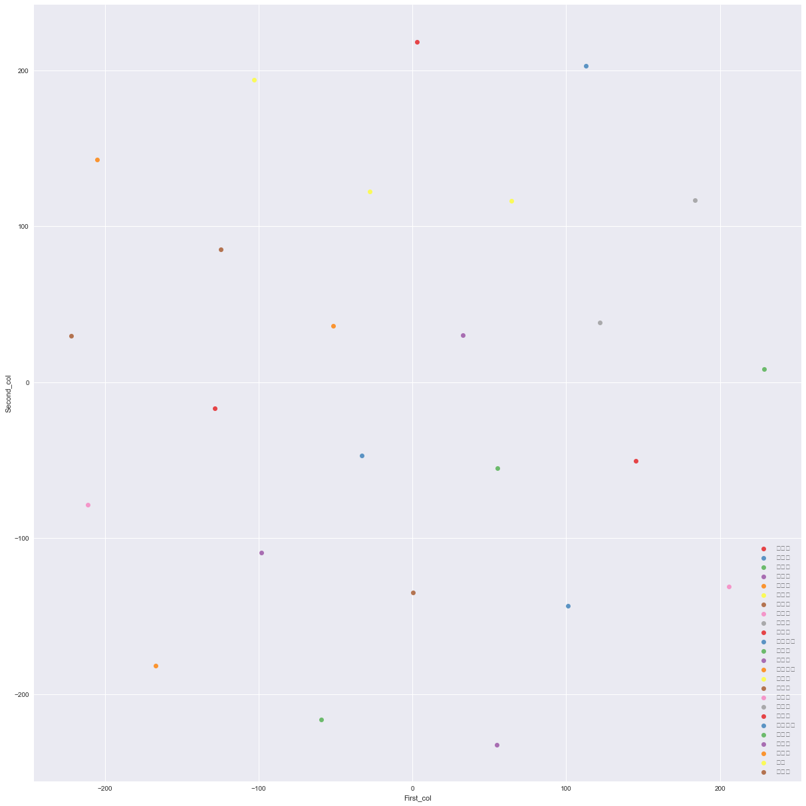

```python
import numpy as np # linear algebra
import pandas as pd # data processing, CSV file I/O (e.g. pd.read_csv)
```


```python
import pandas as pd
import tensorflow as tf
train =pd.read_csv('economy/csv/economy_total_data.csv')

```


```python
train=train.fillna(0)
```


```python
# Nan을 숫자로 바꾸는 작업

train['meaneduc'].fillna(train['meaneduc'].mean(), inplace = True)
train['SQBmeaned'].fillna(train['SQBmeaned'].mean(), inplace = True)
#the same for test
test['meaneduc'].fillna(test['meaneduc'].mean(), inplace = True)
test['SQBmeaned'].fillna(test['SQBmeaned'].mean(), inplace = True)
train['rez_esc'].fillna(0, inplace = True)
train['v18q1'].fillna(0, inplace = True)
train['v2a1'].fillna(0, inplace = True)
```


```python
train_h = train.loc[train["parentesco1"]==1]
```


```python
def drop_feature(df_x1):
    #결과값 y에 해당하는 값 삭제 
    # df_x1 = df_x1.drop(["Target"],1)
    df_x1 = df_x1.fillna(0)
#     #세대주성별 교육년수 
#     df_x1 = df_x1.drop(["edjefa", "edjefe"],1) 
#     #중복정보 제거
#     df_x1 = df_x1.drop(["dependency","female","area2","hacdor","hacapo","bedrooms","r4h3","r4m3"],1) 
#     #수학적으로 의미가 없는 값 제거
#     df_x1 = df_x1.drop(["Id","SQBescolari", "SQBage", "SQBhogar_total", "SQBedjefe", "SQBhogar_nin", "SQBovercrowding","idhogar"],1) 
#     #세대주와의 관계열 제거
#     df_x1 = df_x1.drop(["parentesco1","parentesco2","parentesco3","parentesco4","parentesco5","parentesco6","parentesco7","parentesco8",
#                        "parentesco9","parentesco10","parentesco11","parentesco12"],1)
#     #집을 소유하고 있는 사람들에게 1값부여
#     #df_x1["house"] = df_x1.loc[df_x1["v2a1"] == 0, "v2a1"]
#     #df_x1["house"] = df_x1["house"].fillna(1)
#     # 집세 임시 제거
#     #df_x1['lent'] = (df_x1["v2a1"])
#     df_x1 = df_x1.drop(["v2a1"],1)
#     df_x1['lent'] = df_x1['tamviv']-df_x1['tamhog']
#     df_x1 = df_x1.drop(["r4t1","r4t2","r4t3","tamhog","tamviv"],1) 
#     # 중복 데이터 : 태블릿 수 삭제
#     df_x1 = df_x1.drop(["v18q1"],1) 
#     #벽,지붕, 바닥 좋고 나쁨 정도 중복 
#     df_x1 = df_x1.drop(["epared1","epared2","epared3","etecho1","etecho2","etecho3"],1) 
#     #모든 열이 0인 경우 삭제 
#     df_x1 = df_x1.drop(["elimbasu5", "estadocivil1"],1) 
#     #상관관계가 높은 사항들 제거
#     df_x1 = df_x1.drop(["pisocemento","overcrowding","hhsize"],1)
#     # 개인별 삭제 (실험 해 보아라~~~~): 정배픽
#     #df_x1 = df_x1.drop(["age","lugar1","lugar6","sanitario2","coopele"],1)
#     #정연픽
#     # df_x1 = df_x1.drop(["hogar_nin","hogar_adul","hogar_mayor","hogar_total","paredblolad","meaneduc","qmobilephone"],1)
#     df_x1 = df_x1.drop(["SQBdependency","SQBmeaned","agesq"],1)
#     #진수픽
    
    return df_x1
```


```python
train_h_drop = drop_feature(train_h)
test_drop = drop_feature(test)
train_h_drop.head()
```


<div>
<style scoped>
    .dataframe tbody tr th:only-of-type {
        vertical-align: middle;
    }

    .dataframe tbody tr th {
        vertical-align: top;
    }

    .dataframe thead th {
        text-align: right;
    }
</style>
<table border="1" class="dataframe">
  <thead>
    <tr style="text-align: right;">
      <th></th>
      <th>Id</th>
      <th>v2a1</th>
      <th>hacdor</th>
      <th>rooms</th>
      <th>hacapo</th>
      <th>v14a</th>
      <th>refrig</th>
      <th>v18q</th>
      <th>v18q1</th>
      <th>r4h1</th>
      <th>...</th>
      <th>SQBescolari</th>
      <th>SQBage</th>
      <th>SQBhogar_total</th>
      <th>SQBedjefe</th>
      <th>SQBhogar_nin</th>
      <th>SQBovercrowding</th>
      <th>SQBdependency</th>
      <th>SQBmeaned</th>
      <th>agesq</th>
      <th>Target</th>
    </tr>
  </thead>
  <tbody>
    <tr>
      <th>0</th>
      <td>ID_279628684</td>
      <td>190000.0</td>
      <td>0</td>
      <td>3</td>
      <td>0</td>
      <td>1</td>
      <td>1</td>
      <td>0</td>
      <td>0.0</td>
      <td>0</td>
      <td>...</td>
      <td>100</td>
      <td>1849</td>
      <td>1</td>
      <td>100</td>
      <td>0</td>
      <td>1.000000</td>
      <td>0.0</td>
      <td>100.0</td>
      <td>1849</td>
      <td>4</td>
    </tr>
    <tr>
      <th>1</th>
      <td>ID_f29eb3ddd</td>
      <td>135000.0</td>
      <td>0</td>
      <td>4</td>
      <td>0</td>
      <td>1</td>
      <td>1</td>
      <td>1</td>
      <td>1.0</td>
      <td>0</td>
      <td>...</td>
      <td>144</td>
      <td>4489</td>
      <td>1</td>
      <td>144</td>
      <td>0</td>
      <td>1.000000</td>
      <td>64.0</td>
      <td>144.0</td>
      <td>4489</td>
      <td>4</td>
    </tr>
    <tr>
      <th>2</th>
      <td>ID_68de51c94</td>
      <td>0.0</td>
      <td>0</td>
      <td>8</td>
      <td>0</td>
      <td>1</td>
      <td>1</td>
      <td>0</td>
      <td>0.0</td>
      <td>0</td>
      <td>...</td>
      <td>121</td>
      <td>8464</td>
      <td>1</td>
      <td>0</td>
      <td>0</td>
      <td>0.250000</td>
      <td>64.0</td>
      <td>121.0</td>
      <td>8464</td>
      <td>4</td>
    </tr>
    <tr>
      <th>5</th>
      <td>ID_ec05b1a7b</td>
      <td>180000.0</td>
      <td>0</td>
      <td>5</td>
      <td>0</td>
      <td>1</td>
      <td>1</td>
      <td>1</td>
      <td>1.0</td>
      <td>0</td>
      <td>...</td>
      <td>121</td>
      <td>1444</td>
      <td>16</td>
      <td>121</td>
      <td>4</td>
      <td>1.777778</td>
      <td>1.0</td>
      <td>121.0</td>
      <td>1444</td>
      <td>4</td>
    </tr>
    <tr>
      <th>8</th>
      <td>ID_1284f8aad</td>
      <td>130000.0</td>
      <td>1</td>
      <td>2</td>
      <td>0</td>
      <td>1</td>
      <td>1</td>
      <td>0</td>
      <td>0.0</td>
      <td>0</td>
      <td>...</td>
      <td>81</td>
      <td>900</td>
      <td>16</td>
      <td>81</td>
      <td>4</td>
      <td>16.000000</td>
      <td>1.0</td>
      <td>100.0</td>
      <td>900</td>
      <td>4</td>
    </tr>
  </tbody>
</table>
<p>5 rows × 143 columns</p>
</div>


# 3d 그래프


```python
# 그래프 그리기

import seaborn as sns
import numpy as np # linear algebra
import pandas as pd # data processing, CSV file I/O (e.g. pd.read_csv)
from mpl_toolkits.mplot3d import Axes3D
import matplotlib.pyplot as plt
%matplotlib inline
sns.set(style = 'darkgrid') #

import os
from pylab import rcParams
rcParams['figure.figsize'] = 25, 12.5
```


```python
# 문자 들어있는 열과 숫자만 있는 열 구분

categorical = []
numerical = []
for feature in train.columns:
    if train[feature].dtype == object:
        categorical.append(feature)
    else:
        numerical.append(feature)

#train_h_drop[numerical].head()# => test_drop에서 column 추출했기에 target 값 없음 => 뒤에서 합친다.
```


```python
from sklearn.manifold import TSNE
from sklearn.preprocessing import StandardScaler
scaler1 = StandardScaler()
X_scaled = scaler1.fit_transform(train[numerical]) # <------- 여기에 데이터 프레임 넣음!! (여기에는 target 값 빠져있음, 뒤에서 넣어줌)

# drop_feature 함수에서 변수 바꾸고 
# 전체를 다시 돌리면 
# 다른거 변화 안시키고 그래프 얻을 수 있음
```


```python
len(numerical)
```


    74


```python
%%time
tsne2d = TSNE(random_state=4545)
tsne_representation2d = tsne2d.fit_transform(X_scaled)
```

    Wall time: 428 ms
    


```python
tsne_representation2d = pd.DataFrame(tsne_representation2d, columns = ['First_col', 'Second_col'])
tsne_representation2d['지역'] = train.loc[:,'지역']
#tsne_representation2d['Target'] = train_h_drop.loc[train_h_drop['Target']!= int,'Target']
#train.loc[train['edjefa'] == "no", "edjefa"]
tsne_representation2d['지역']
```


    0      강남구
    1      강동구
    2      강북구
    3      강서구
    4      관악구
    5      광진구
    6      구로구
    7      금천구
    8      노원구
    9      도봉구
    10    동대문구
    11     동작구
    12     마포구
    13    서대문구
    14     서초구
    15     성동구
    16     성북구
    17     송파구
    18     양천구
    19    영등포구
    20     용산구
    21     은평구
    22     종로구
    23      중구
    24     중랑구
    Name: 지역, dtype: object


```python
sns.set(font_scale=1, style="darkgrid")
sns.lmplot( x="First_col", y="Second_col", data=tsne_representation2d, fit_reg=False, hue='지역', legend=False, palette="Set1", size = 17)
plt.legend(loc='lower right')
```


    <matplotlib.legend.Legend at 0x1630e358>





```python
%%time
tsne3d = TSNE(n_components = 3, random_state = 555)
tsne_representation3d = tsne3d.fit_transform(X_scaled)
```

    Wall time: 450 ms
    


```python
tsne_representation3d = pd.DataFrame(tsne_representation3d, columns = ['First_col', 'Second_col', 'Third_col'])
#tsne_representation3d['Target'] =  train_h_drop.loc[:, 'Target']
#k =  train_h_drop.loc[:, 'Target']
#k
```


```python
tsne_representation3d.head()
```


<div>
<style scoped>
    .dataframe tbody tr th:only-of-type {
        vertical-align: middle;
    }

    .dataframe tbody tr th {
        vertical-align: top;
    }

    .dataframe thead th {
        text-align: right;
    }
</style>
<table border="1" class="dataframe">
  <thead>
    <tr style="text-align: right;">
      <th></th>
      <th>First_col</th>
      <th>Second_col</th>
      <th>Third_col</th>
    </tr>
  </thead>
  <tbody>
    <tr>
      <th>0</th>
      <td>159.005707</td>
      <td>-248.448807</td>
      <td>1.642267</td>
    </tr>
    <tr>
      <th>1</th>
      <td>262.857758</td>
      <td>53.266445</td>
      <td>-332.595917</td>
    </tr>
    <tr>
      <th>2</th>
      <td>-69.245979</td>
      <td>-5.803756</td>
      <td>55.098076</td>
    </tr>
    <tr>
      <th>3</th>
      <td>92.883064</td>
      <td>207.218536</td>
      <td>166.724564</td>
    </tr>
    <tr>
      <th>4</th>
      <td>-25.766420</td>
      <td>212.294678</td>
      <td>-16.360573</td>
    </tr>
  </tbody>
</table>
</div>


```python
nodelete = tsne_representation3d.copy()
nodelete.drop(['지역'],1, inplace =True)
nodelete
```


    ---------------------------------------------------------------------------

    KeyError                                  Traceback (most recent call last)

    <ipython-input-33-0dad4eed0c6b> in <module>()
          1 nodelete = tsne_representation3d.copy()
    ----> 2 nodelete.drop(['지역'],1, inplace =True)
          3 nodelete
    

    C:\Python\Anaconda3-52\lib\site-packages\pandas\core\frame.py in drop(self, labels, axis, index, columns, level, inplace, errors)
       3692                                            index=index, columns=columns,
       3693                                            level=level, inplace=inplace,
    -> 3694                                            errors=errors)
       3695 
       3696     @rewrite_axis_style_signature('mapper', [('copy', True),
    

    C:\Python\Anaconda3-52\lib\site-packages\pandas\core\generic.py in drop(self, labels, axis, index, columns, level, inplace, errors)
       3106         for axis, labels in axes.items():
       3107             if labels is not None:
    -> 3108                 obj = obj._drop_axis(labels, axis, level=level, errors=errors)
       3109 
       3110         if inplace:
    

    C:\Python\Anaconda3-52\lib\site-packages\pandas\core\generic.py in _drop_axis(self, labels, axis, level, errors)
       3138                 new_axis = axis.drop(labels, level=level, errors=errors)
       3139             else:
    -> 3140                 new_axis = axis.drop(labels, errors=errors)
       3141             dropped = self.reindex(**{axis_name: new_axis})
       3142             try:
    

    C:\Python\Anaconda3-52\lib\site-packages\pandas\core\indexes\base.py in drop(self, labels, errors)
       4385             if errors != 'ignore':
       4386                 raise KeyError(
    -> 4387                     'labels %s not contained in axis' % labels[mask])
       4388             indexer = indexer[~mask]
       4389         return self.delete(indexer)
    

    KeyError: "labels ['지역'] not contained in axis"


```python
k = tsne_representation3d.loc[:, 'Target']
k =pd.DataFrame(k)
k["Index"] = np.arange(2974)
k.set_index("Index",inplace =True)
k = k[0:-1]
k
```


    ---------------------------------------------------------------------------

    NameError                                 Traceback (most recent call last)

    <ipython-input-34-56a3d4ab7907> in <module>()
    ----> 1 k = train_h_drop.loc[:, 'Target']
          2 k =pd.DataFrame(k)
          3 k["Index"] = np.arange(2974)
          4 k.set_index("Index",inplace =True)
          5 k = k[0:-1]
    

    NameError: name 'train_h_drop' is not defined


```python
kk = pd.concat([tsne_representation3d,k],1)["Target"]
```


```python
# k = train_h_drop.loc[:, 'Target']
# k = pd.Series(k)
# k["Index"] = [range(0:2973)]
# k
# # tsne_representation3d['Target']
```


    0       4
    1       4
    2       4
    5       4
    8       4
    12      4
    13      4
    18      4
    20      4
    21      4
    23      4
    26      4
    27      4
    30      4
    33      4
    39      4
    40      4
    43      4
    45      4
    49      4
    53      2
    56      4
    58      2
    59      4
    61      4
    64      2
    68      4
    72      4
    74      4
    77      4
           ..
    9477    2
    9480    3
    9481    4
    9485    1
    9487    4
    9490    3
    9492    2
    9495    4
    9499    4
    9502    4
    9505    4
    9506    3
    9507    4
    9508    1
    9510    4
    9512    4
    9515    1
    9517    4
    9519    4
    9523    3
    9526    4
    9528    4
    9530    4
    9531    4
    9534    3
    9535    1
    9541    2
    9545    4
    9551    2
    9552    2
    Name: Target, Length: 2973, dtype: int64


```python
from matplotlib import pyplot
from mpl_toolkits.mplot3d import Axes3D
rcParams['figure.figsize'] = 30, 20
fig = pyplot.figure()
ax = Axes3D(fig)

ax.scatter(tsne_representation3d.loc[:, 'First_col'], tsne_representation3d.loc[:, 'Second_col'], tsne_representation3d.loc[:, 'Third_col'], s = 29, 
          edgecolors = 'black',cmap="hsv")
ax.set_title('t-SNE visualization in 3 dimensions', size = 20)


pyplot.show()
```


```python
#print(tsne_representation3d.loc[:, 'First_col'])
```


```python
#! pip install plotly 
```


```python
#! pip install plotly --upgrade
```


```python
# x1 = tsne_representation3d.loc[:, 'First_col'].astype(list)
# y1 = tsne_representation3d.loc[:, 'Second_col'].astype(list)
# z1 = tsne_representation3d.loc[:, 'Third_col'].astype(list)
tsne_representation3d['Target']
```


    0       4.0
    1       4.0
    2       4.0
    3       NaN
    4       NaN
    5       4.0
    6       NaN
    7       NaN
    8       4.0
    9       NaN
    10      NaN
    11      NaN
    12      4.0
    13      4.0
    14      NaN
    15      NaN
    16      NaN
    17      NaN
    18      4.0
    19      NaN
    20      4.0
    21      4.0
    22      NaN
    23      4.0
    24      NaN
    25      NaN
    26      4.0
    27      4.0
    28      NaN
    29      NaN
           ... 
    2943    2.0
    2944    NaN
    2945    4.0
    2946    NaN
    2947    NaN
    2948    NaN
    2949    NaN
    2950    4.0
    2951    NaN
    2952    NaN
    2953    4.0
    2954    NaN
    2955    4.0
    2956    4.0
    2957    NaN
    2958    NaN
    2959    4.0
    2960    NaN
    2961    NaN
    2962    NaN
    2963    2.0
    2964    NaN
    2965    NaN
    2966    NaN
    2967    NaN
    2968    4.0
    2969    NaN
    2970    1.0
    2971    NaN
    2972    4.0
    Name: Target, Length: 2973, dtype: float64


```python
train_h_drop.loc[:, 'Target']
```


    0       4
    1       4
    2       4
    5       4
    8       4
    12      4
    13      4
    18      4
    20      4
    21      4
    23      4
    26      4
    27      4
    30      4
    33      4
    39      4
    40      4
    43      4
    45      4
    49      4
    53      2
    56      4
    58      2
    59      4
    61      4
    64      2
    68      4
    72      4
    74      4
    77      4
           ..
    9477    2
    9480    3
    9481    4
    9485    1
    9487    4
    9490    3
    9492    2
    9495    4
    9499    4
    9502    4
    9505    4
    9506    3
    9507    4
    9508    1
    9510    4
    9512    4
    9515    1
    9517    4
    9519    4
    9523    3
    9526    4
    9528    4
    9530    4
    9531    4
    9534    3
    9535    1
    9541    2
    9545    4
    9551    2
    9552    2
    Name: Target, Length: 2973, dtype: int64


```python
import plotly

from plotly.graph_objs import Scatter3d, Layout

plotly.offline.plot({

    "data": [Scatter3d(x= x1, y=y1, z=z1,  mode='markers',
    marker=dict(
        color='rgb(51, 153, 255)',
        size=1,
        symbol='circle',
        line=dict(
            color='rgb(217, 217, 217)',
            width=1
        ),
        opacity=0.9
    )       )],

    "layout": Layout(margin=dict(
        l=0,
        r=0,
        b=0,
        t=0
    ))

})
```


    'file://C:\\Users\\student\\Google 드라이브\\Anaconda_src\\team_second\\temp-plot.html'


```python
? plotly.offline.plot
```
import plotly

from plotly.graph_objs import Scatter3d, Layout

plotly.offline.plot({

    "data": [Scatter3d(x=[1, 2, 3, 4], y=[4, 3, 2, 1], z=[1, 2, 1, 3])],

    "layout": Layout(title="hello world")

})

```python
target = train_h_drop["Target"]

train_h_drop[numerical]


X = train_h_drop[numerical].values

Target = target


X_std = StandardScaler().fit_transform(X)
```


```python
tsne = TSNE()
tsne_results = tsne.fit_transform(X_std) 
```


    ---------------------------------------------------------------------------

    NameError                                 Traceback (most recent call last)

    <ipython-input-32-44a2481de993> in <module>()
          1 tsne = TSNE()
    ----> 2 tsne_results = tsne.fit_transform(X_std)
    

    NameError: name 'X_std' is not defined


```python
import plotly.graph_objs as go

traceTSNE = go.Scatter(
    x = tsne3d.fit_transform(X_scaled),
    y = kk,
    #name = Target,
#     hoveron = Target,
    mode = 'markers',
#     text = Target.unique(),
    showlegend = True,
    marker = dict(
        size = 8,
        #color = kk,
        colorscale ='Jet',
        showscale = False,
        line = dict(
            width = 2,
            color = 'rgb(255, 255, 255)'
        ),
        opacity = 0.8
    )
)
data = [traceTSNE]

layout = dict(title = 'TSNE (T-Distributed Stochastic Neighbour Embedding)',
              hovermode= 'closest',
              yaxis = dict(zeroline = False),
              xaxis = dict(zeroline = False),
              showlegend= True,

             )

fig = dict(data=data, layout=layout)
py.iplot(fig, filename='styled-scatter')
```


    ---------------------------------------------------------------------------

    NameError                                 Traceback (most recent call last)

    <ipython-input-130-bf58a4c71019> in <module>()
         32 
         33 fig = dict(data=data, layout=layout)
    ---> 34 py.iplot(fig, filename='styled-scatter')
    

    NameError: name 'py' is not defined

