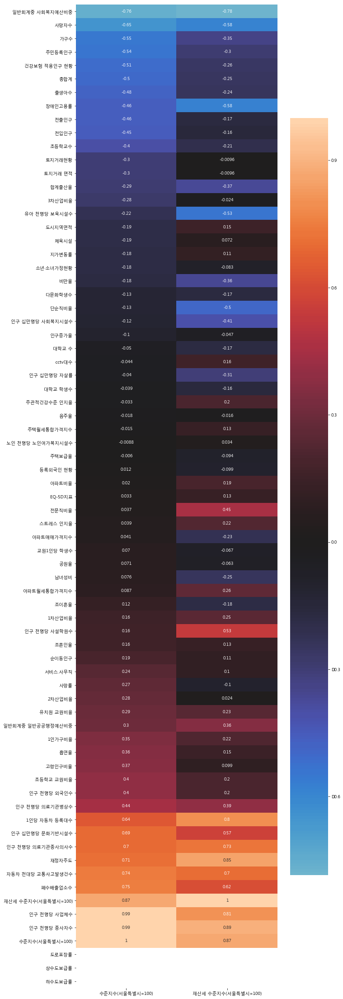

```python
import pandas as pd
```


```python
df = pd.read_csv("./economy/elocal_2.csv", encoding = "CP949")
```


```python
df.head()
```


<div>
<style scoped>
    .dataframe tbody tr th:only-of-type {
        vertical-align: middle;
    }

    .dataframe tbody tr th {
        vertical-align: top;
    }

    .dataframe thead th {
        text-align: right;
    }
</style>
<table border="1" class="dataframe">
  <thead>
    <tr style="text-align: right;">
      <th></th>
      <th>지역</th>
      <th>1인가구비율 (%)</th>
      <th>1인당 자동차 등록대수 (대)</th>
      <th>EQ-5D지표</th>
      <th>가구수 (가구)</th>
      <th>건강보험 적용인구 현황</th>
      <th>고령인구비율 (%)</th>
      <th>교원1인당 학생수 (명)</th>
      <th>남녀성비 (%)</th>
      <th>노인 천명당 노인여가복지시설수 (개)</th>
      <th>...</th>
      <th>친환경인증 축산물 출하량 (톤)</th>
      <th>토지거래 면적 (천㎡)</th>
      <th>토지거래현황 (천m²)</th>
      <th>토지거래현황 (필지)</th>
      <th>폐수배출업소수 (개소)</th>
      <th>하수도보급률 (%)</th>
      <th>합계출산율 (명)</th>
      <th>혼인건수 (건)</th>
      <th>흡연율 (%)</th>
      <th>총합계</th>
    </tr>
  </thead>
  <tbody>
    <tr>
      <th>0</th>
      <td>강남구</td>
      <td>29.3</td>
      <td>0.42</td>
      <td>0.953</td>
      <td>214911</td>
      <td>583900</td>
      <td>10.44</td>
      <td>14.96</td>
      <td>92.12</td>
      <td>2.18</td>
      <td>...</td>
      <td>2621</td>
      <td>1345</td>
      <td>1345</td>
      <td>19783</td>
      <td>131</td>
      <td>100</td>
      <td>0.857</td>
      <td>3380</td>
      <td>19.8</td>
      <td>1916616.320</td>
    </tr>
    <tr>
      <th>1</th>
      <td>강동구</td>
      <td>24.3</td>
      <td>0.30</td>
      <td>0.946</td>
      <td>167009</td>
      <td>449179</td>
      <td>11.30</td>
      <td>14.37</td>
      <td>99.46</td>
      <td>1.73</td>
      <td>...</td>
      <td>0</td>
      <td>1366</td>
      <td>1366</td>
      <td>16501</td>
      <td>130</td>
      <td>100</td>
      <td>1.036</td>
      <td>2753</td>
      <td>20.4</td>
      <td>1435857.252</td>
    </tr>
    <tr>
      <th>2</th>
      <td>강북구</td>
      <td>28.5</td>
      <td>0.23</td>
      <td>0.938</td>
      <td>127462</td>
      <td>314857</td>
      <td>15.87</td>
      <td>14.76</td>
      <td>97.06</td>
      <td>1.50</td>
      <td>...</td>
      <td>0</td>
      <td>787</td>
      <td>787</td>
      <td>9911</td>
      <td>57</td>
      <td>100</td>
      <td>0.922</td>
      <td>1715</td>
      <td>24.1</td>
      <td>1017044.100</td>
    </tr>
    <tr>
      <th>3</th>
      <td>강서구</td>
      <td>26.2</td>
      <td>0.32</td>
      <td>0.956</td>
      <td>220598</td>
      <td>570722</td>
      <td>11.51</td>
      <td>14.64</td>
      <td>95.62</td>
      <td>2.25</td>
      <td>...</td>
      <td>0</td>
      <td>1663</td>
      <td>1663</td>
      <td>28272</td>
      <td>178</td>
      <td>100</td>
      <td>1.129</td>
      <td>4578</td>
      <td>20.9</td>
      <td>1873839.835</td>
    </tr>
    <tr>
      <th>4</th>
      <td>관악구</td>
      <td>43.9</td>
      <td>0.24</td>
      <td>0.951</td>
      <td>238744</td>
      <td>501170</td>
      <td>12.69</td>
      <td>12.81</td>
      <td>102.11</td>
      <td>1.36</td>
      <td>...</td>
      <td>90</td>
      <td>878</td>
      <td>878</td>
      <td>13046</td>
      <td>55</td>
      <td>100</td>
      <td>0.833</td>
      <td>3859</td>
      <td>23.7</td>
      <td>1679683.254</td>
    </tr>
  </tbody>
</table>
<p>5 rows × 79 columns</p>
</div>


```python
df2 = pd.read_excel("./economy/local_gdp_per.xls")
```


```python
df2
```


<div>
<style scoped>
    .dataframe tbody tr th:only-of-type {
        vertical-align: middle;
    }

    .dataframe tbody tr th {
        vertical-align: top;
    }

    .dataframe thead th {
        text-align: right;
    }
</style>
<table border="1" class="dataframe">
  <thead>
    <tr style="text-align: right;">
      <th></th>
      <th>기간</th>
      <th>자치구</th>
      <th>지역내총생산(당해년가격)</th>
      <th>구성비</th>
      <th>연중인구</th>
      <th>1인당 지역내총생산</th>
      <th>수준지수(서울특별시=100)</th>
    </tr>
  </thead>
  <tbody>
    <tr>
      <th>0</th>
      <td>2015</td>
      <td>서울시</td>
      <td>344426006</td>
      <td>100.0</td>
      <td>10297138</td>
      <td>3345</td>
      <td>100.00</td>
    </tr>
    <tr>
      <th>1</th>
      <td>2015</td>
      <td>종로구</td>
      <td>27929070</td>
      <td>8.1</td>
      <td>163822</td>
      <td>17048</td>
      <td>509.69</td>
    </tr>
    <tr>
      <th>2</th>
      <td>2015</td>
      <td>중구</td>
      <td>47887993</td>
      <td>13.9</td>
      <td>134329</td>
      <td>35650</td>
      <td>1065.80</td>
    </tr>
    <tr>
      <th>3</th>
      <td>2015</td>
      <td>용산구</td>
      <td>9871373</td>
      <td>2.9</td>
      <td>247909</td>
      <td>3982</td>
      <td>119.04</td>
    </tr>
    <tr>
      <th>4</th>
      <td>2015</td>
      <td>성동구</td>
      <td>9673958</td>
      <td>2.8</td>
      <td>305065</td>
      <td>3171</td>
      <td>94.81</td>
    </tr>
    <tr>
      <th>5</th>
      <td>2015</td>
      <td>광진구</td>
      <td>5592832</td>
      <td>1.6</td>
      <td>375180</td>
      <td>1491</td>
      <td>44.57</td>
    </tr>
    <tr>
      <th>6</th>
      <td>2015</td>
      <td>동대문구</td>
      <td>6688724</td>
      <td>1.9</td>
      <td>373824</td>
      <td>1789</td>
      <td>53.49</td>
    </tr>
    <tr>
      <th>7</th>
      <td>2015</td>
      <td>중랑구</td>
      <td>3755466</td>
      <td>1.1</td>
      <td>418620</td>
      <td>897</td>
      <td>26.82</td>
    </tr>
    <tr>
      <th>8</th>
      <td>2015</td>
      <td>성북구</td>
      <td>4938574</td>
      <td>1.4</td>
      <td>469560</td>
      <td>1052</td>
      <td>31.44</td>
    </tr>
    <tr>
      <th>9</th>
      <td>2015</td>
      <td>강북구</td>
      <td>2618309</td>
      <td>0.8</td>
      <td>334426</td>
      <td>783</td>
      <td>23.41</td>
    </tr>
    <tr>
      <th>10</th>
      <td>2015</td>
      <td>도봉구</td>
      <td>2636029</td>
      <td>0.8</td>
      <td>353241</td>
      <td>746</td>
      <td>22.31</td>
    </tr>
    <tr>
      <th>11</th>
      <td>2015</td>
      <td>노원구</td>
      <td>5012188</td>
      <td>1.5</td>
      <td>578221</td>
      <td>867</td>
      <td>25.92</td>
    </tr>
    <tr>
      <th>12</th>
      <td>2015</td>
      <td>은평구</td>
      <td>3491843</td>
      <td>1.0</td>
      <td>502578</td>
      <td>695</td>
      <td>20.77</td>
    </tr>
    <tr>
      <th>13</th>
      <td>2015</td>
      <td>서대문구</td>
      <td>7227343</td>
      <td>2.1</td>
      <td>323105</td>
      <td>2237</td>
      <td>66.87</td>
    </tr>
    <tr>
      <th>14</th>
      <td>2015</td>
      <td>마포구</td>
      <td>15763646</td>
      <td>4.6</td>
      <td>398351</td>
      <td>3957</td>
      <td>118.31</td>
    </tr>
    <tr>
      <th>15</th>
      <td>2015</td>
      <td>양천구</td>
      <td>5697533</td>
      <td>1.7</td>
      <td>489010</td>
      <td>1165</td>
      <td>34.83</td>
    </tr>
    <tr>
      <th>16</th>
      <td>2015</td>
      <td>강서구</td>
      <td>9627187</td>
      <td>2.8</td>
      <td>595691</td>
      <td>1616</td>
      <td>48.32</td>
    </tr>
    <tr>
      <th>17</th>
      <td>2015</td>
      <td>구로구</td>
      <td>11163275</td>
      <td>3.2</td>
      <td>454604</td>
      <td>2456</td>
      <td>73.41</td>
    </tr>
    <tr>
      <th>18</th>
      <td>2015</td>
      <td>금천구</td>
      <td>13735602</td>
      <td>4.0</td>
      <td>256167</td>
      <td>5362</td>
      <td>160.30</td>
    </tr>
    <tr>
      <th>19</th>
      <td>2015</td>
      <td>영등포구</td>
      <td>26770448</td>
      <td>7.8</td>
      <td>417811</td>
      <td>6407</td>
      <td>191.56</td>
    </tr>
    <tr>
      <th>20</th>
      <td>2015</td>
      <td>동작구</td>
      <td>4892610</td>
      <td>1.4</td>
      <td>412774</td>
      <td>1185</td>
      <td>35.44</td>
    </tr>
    <tr>
      <th>21</th>
      <td>2015</td>
      <td>관악구</td>
      <td>5196230</td>
      <td>1.5</td>
      <td>529031</td>
      <td>982</td>
      <td>29.36</td>
    </tr>
    <tr>
      <th>22</th>
      <td>2015</td>
      <td>서초구</td>
      <td>28442584</td>
      <td>8.3</td>
      <td>451258</td>
      <td>6303</td>
      <td>188.44</td>
    </tr>
    <tr>
      <th>23</th>
      <td>2015</td>
      <td>강남구</td>
      <td>57968609</td>
      <td>16.8</td>
      <td>581760</td>
      <td>9964</td>
      <td>297.90</td>
    </tr>
    <tr>
      <th>24</th>
      <td>2015</td>
      <td>송파구</td>
      <td>20858285</td>
      <td>6.1</td>
      <td>667480</td>
      <td>3125</td>
      <td>93.42</td>
    </tr>
    <tr>
      <th>25</th>
      <td>2015</td>
      <td>강동구</td>
      <td>6986297</td>
      <td>2.0</td>
      <td>463321</td>
      <td>1508</td>
      <td>45.08</td>
    </tr>
  </tbody>
</table>
</div>


```python
l = []
for i in df["지역"]:
    i = i[3:]
    l.append(i)
```


```python
df["지역"] = l
```


```python
import json
import folium
import warnings
warnings.simplefilter(action = "ignore", category = FutureWarning)

geo_path = 'data/skorea_municipalities_geo_simple.json'
geo_str = json.load(open(geo_path, encoding='utf-8'))
```


```python
map = folium.Map(location=[37.5502, 126.982], zoom_start=11, tiles='Stamen Toner')
map.choropleth(geo_str, data = df2, columns =["자치구", "수준지수(서울특별시=100)"], fill_color='PuRd', #PuRd, YlGnBu
              key_on='feature.id')
map
```


<div style="width:100%;"><div style="position:relative;width:100%;height:0;padding-bottom:60%;"><iframe src="data:text/html;charset=utf-8;base64,PCFET0NUWVBFIGh0bWw+CjxoZWFkPiAgICAKICAgIDxtZXRhIGh0dHAtZXF1aXY9ImNvbnRlbnQtdHlwZSIgY29udGVudD0idGV4dC9odG1sOyBjaGFyc2V0PVVURi04IiAvPgogICAgPHNjcmlwdD5MX1BSRUZFUl9DQU5WQVM9ZmFsc2U7IExfTk9fVE9VQ0g9ZmFsc2U7IExfRElTQUJMRV8zRD1mYWxzZTs8L3NjcmlwdD4KICAgIDxzY3JpcHQgc3JjPSJodHRwczovL2Nkbi5qc2RlbGl2ci5uZXQvbnBtL2xlYWZsZXRAMS4yLjAvZGlzdC9sZWFmbGV0LmpzIj48L3NjcmlwdD4KICAgIDxzY3JpcHQgc3JjPSJodHRwczovL2FqYXguZ29vZ2xlYXBpcy5jb20vYWpheC9saWJzL2pxdWVyeS8xLjExLjEvanF1ZXJ5Lm1pbi5qcyI+PC9zY3JpcHQ+CiAgICA8c2NyaXB0IHNyYz0iaHR0cHM6Ly9tYXhjZG4uYm9vdHN0cmFwY2RuLmNvbS9ib290c3RyYXAvMy4yLjAvanMvYm9vdHN0cmFwLm1pbi5qcyI+PC9zY3JpcHQ+CiAgICA8c2NyaXB0IHNyYz0iaHR0cHM6Ly9jZG5qcy5jbG91ZGZsYXJlLmNvbS9hamF4L2xpYnMvTGVhZmxldC5hd2Vzb21lLW1hcmtlcnMvMi4wLjIvbGVhZmxldC5hd2Vzb21lLW1hcmtlcnMuanMiPjwvc2NyaXB0PgogICAgPGxpbmsgcmVsPSJzdHlsZXNoZWV0IiBocmVmPSJodHRwczovL2Nkbi5qc2RlbGl2ci5uZXQvbnBtL2xlYWZsZXRAMS4yLjAvZGlzdC9sZWFmbGV0LmNzcyIvPgogICAgPGxpbmsgcmVsPSJzdHlsZXNoZWV0IiBocmVmPSJodHRwczovL21heGNkbi5ib290c3RyYXBjZG4uY29tL2Jvb3RzdHJhcC8zLjIuMC9jc3MvYm9vdHN0cmFwLm1pbi5jc3MiLz4KICAgIDxsaW5rIHJlbD0ic3R5bGVzaGVldCIgaHJlZj0iaHR0cHM6Ly9tYXhjZG4uYm9vdHN0cmFwY2RuLmNvbS9ib290c3RyYXAvMy4yLjAvY3NzL2Jvb3RzdHJhcC10aGVtZS5taW4uY3NzIi8+CiAgICA8bGluayByZWw9InN0eWxlc2hlZXQiIGhyZWY9Imh0dHBzOi8vbWF4Y2RuLmJvb3RzdHJhcGNkbi5jb20vZm9udC1hd2Vzb21lLzQuNi4zL2Nzcy9mb250LWF3ZXNvbWUubWluLmNzcyIvPgogICAgPGxpbmsgcmVsPSJzdHlsZXNoZWV0IiBocmVmPSJodHRwczovL2NkbmpzLmNsb3VkZmxhcmUuY29tL2FqYXgvbGlicy9MZWFmbGV0LmF3ZXNvbWUtbWFya2Vycy8yLjAuMi9sZWFmbGV0LmF3ZXNvbWUtbWFya2Vycy5jc3MiLz4KICAgIDxsaW5rIHJlbD0ic3R5bGVzaGVldCIgaHJlZj0iaHR0cHM6Ly9yYXdnaXQuY29tL3B5dGhvbi12aXN1YWxpemF0aW9uL2ZvbGl1bS9tYXN0ZXIvZm9saXVtL3RlbXBsYXRlcy9sZWFmbGV0LmF3ZXNvbWUucm90YXRlLmNzcyIvPgogICAgPHN0eWxlPmh0bWwsIGJvZHkge3dpZHRoOiAxMDAlO2hlaWdodDogMTAwJTttYXJnaW46IDA7cGFkZGluZzogMDt9PC9zdHlsZT4KICAgIDxzdHlsZT4jbWFwIHtwb3NpdGlvbjphYnNvbHV0ZTt0b3A6MDtib3R0b206MDtyaWdodDowO2xlZnQ6MDt9PC9zdHlsZT4KICAgIAogICAgPHN0eWxlPiNtYXBfNTQ5OWI3MGUwYTEwNDEzZTk5ZTIyZjY1MDkwZDE3N2QgewogICAgICAgIHBvc2l0aW9uOiByZWxhdGl2ZTsKICAgICAgICB3aWR0aDogMTAwLjAlOwogICAgICAgIGhlaWdodDogMTAwLjAlOwogICAgICAgIGxlZnQ6IDAuMCU7CiAgICAgICAgdG9wOiAwLjAlOwogICAgICAgIH0KICAgIDwvc3R5bGU+CiAgICA8c2NyaXB0IHNyYz0iaHR0cHM6Ly9jZG5qcy5jbG91ZGZsYXJlLmNvbS9hamF4L2xpYnMvZDMvMy41LjUvZDMubWluLmpzIj48L3NjcmlwdD4KPC9oZWFkPgo8Ym9keT4gICAgCiAgICAKICAgIDxkaXYgY2xhc3M9ImZvbGl1bS1tYXAiIGlkPSJtYXBfNTQ5OWI3MGUwYTEwNDEzZTk5ZTIyZjY1MDkwZDE3N2QiID48L2Rpdj4KPC9ib2R5Pgo8c2NyaXB0PiAgICAKICAgIAogICAgCiAgICAgICAgdmFyIGJvdW5kcyA9IG51bGw7CiAgICAKCiAgICB2YXIgbWFwXzU0OTliNzBlMGExMDQxM2U5OWUyMmY2NTA5MGQxNzdkID0gTC5tYXAoCiAgICAgICAgJ21hcF81NDk5YjcwZTBhMTA0MTNlOTllMjJmNjUwOTBkMTc3ZCcsIHsKICAgICAgICBjZW50ZXI6IFszNy41NTAyLCAxMjYuOTgyXSwKICAgICAgICB6b29tOiAxMSwKICAgICAgICBtYXhCb3VuZHM6IGJvdW5kcywKICAgICAgICBsYXllcnM6IFtdLAogICAgICAgIHdvcmxkQ29weUp1bXA6IGZhbHNlLAogICAgICAgIGNyczogTC5DUlMuRVBTRzM4NTcsCiAgICAgICAgem9vbUNvbnRyb2w6IHRydWUsCiAgICAgICAgfSk7CgogICAgCiAgICAKICAgIHZhciB0aWxlX2xheWVyXzcwNzJlMTYxYzhjYjQwNjJhMmExN2JkN2M0MjBiZmY0ID0gTC50aWxlTGF5ZXIoCiAgICAgICAgJ2h0dHBzOi8vc3RhbWVuLXRpbGVzLXtzfS5hLnNzbC5mYXN0bHkubmV0L3RvbmVyL3t6fS97eH0ve3l9LnBuZycsCiAgICAgICAgewogICAgICAgICJhdHRyaWJ1dGlvbiI6IG51bGwsCiAgICAgICAgImRldGVjdFJldGluYSI6IGZhbHNlLAogICAgICAgICJtYXhOYXRpdmVab29tIjogMTgsCiAgICAgICAgIm1heFpvb20iOiAxOCwKICAgICAgICAibWluWm9vbSI6IDAsCiAgICAgICAgIm5vV3JhcCI6IGZhbHNlLAogICAgICAgICJzdWJkb21haW5zIjogImFiYyIKfSkuYWRkVG8obWFwXzU0OTliNzBlMGExMDQxM2U5OWUyMmY2NTA5MGQxNzdkKTsKICAgIAogICAgICAgIAogICAgICAgIHZhciBnZW9fanNvbl83ODM1M2ZjZGQ0YTA0NGRiOTBkZGYzOGVjM2FkZWFhMyA9IEwuZ2VvSnNvbigKICAgICAgICAgICAgeyJmZWF0dXJlcyI6IFt7Imdlb21ldHJ5IjogeyJjb29yZGluYXRlcyI6IFtbWzEyNy4xMTUxOTU4NDk4MTYwNiwgMzcuNTU3NTMzMTgwNzA0OTE1XSwgWzEyNy4xNjY4MzE4NDM2NjEyOSwgMzcuNTc2NzI0ODczODg2MjddLCBbMTI3LjE4NDA4NzkyMzMwMTUyLCAzNy41NTgxNDI4MDM2OTU3NV0sIFsxMjcuMTY1MzA5ODQzMDc0NDcsIDM3LjU0MjIxODUxMjU4NjkzXSwgWzEyNy4xNDY3MjgwNjgyMzUwMiwgMzcuNTE0MTU2ODA2ODAyOTFdLCBbMTI3LjEyMTIzMTY1NzE5NjE1LCAzNy41MjUyODI3MDA4OV0sIFsxMjcuMTExNjc2NDIwMzYwOCwgMzcuNTQwNjY5OTU1MzI0OTY1XSwgWzEyNy4xMTUxOTU4NDk4MTYwNiwgMzcuNTU3NTMzMTgwNzA0OTE1XV1dLCAidHlwZSI6ICJQb2x5Z29uIn0sICJpZCI6ICJcdWFjMTVcdWIzZDlcdWFkNmMiLCAicHJvcGVydGllcyI6IHsiYmFzZV95ZWFyIjogIjIwMTMiLCAiY29kZSI6ICIxMTI1MCIsICJoaWdobGlnaHQiOiB7fSwgIm5hbWUiOiAiXHVhYzE1XHViM2Q5XHVhZDZjIiwgIm5hbWVfZW5nIjogIkdhbmdkb25nLWd1IiwgInN0eWxlIjogeyJjb2xvciI6ICJibGFjayIsICJmaWxsQ29sb3IiOiAiI2YxZWVmNiIsICJmaWxsT3BhY2l0eSI6IDAuNiwgIm9wYWNpdHkiOiAxLCAid2VpZ2h0IjogMX19LCAidHlwZSI6ICJGZWF0dXJlIn0sIHsiZ2VvbWV0cnkiOiB7ImNvb3JkaW5hdGVzIjogW1tbMTI3LjA2OTA2OTgxMzAzNzIsIDM3LjUyMjI3OTQyMzUwNTAyNl0sIFsxMjcuMTAwODc1MTk3OTE5NjIsIDM3LjUyNDg0MTIyMDE2NzA1NV0sIFsxMjcuMTExNjc2NDIwMzYwOCwgMzcuNTQwNjY5OTU1MzI0OTY1XSwgWzEyNy4xMjEyMzE2NTcxOTYxNSwgMzcuNTI1MjgyNzAwODldLCBbMTI3LjE0NjcyODA2ODIzNTAyLCAzNy41MTQxNTY4MDY4MDI5MV0sIFsxMjcuMTYzNDk0NDIxNTc2NSwgMzcuNDk3NDQ1NDA2MDk3NDg0XSwgWzEyNy4xNDIwNjA1ODQxMzI3NCwgMzcuNDcwODk4MTkwOTg1MDFdLCBbMTI3LjEyNDQwNTcxMDgwODkzLCAzNy40NjI0MDQ0NTU4NzA0OF0sIFsxMjcuMTExMTcwODUyMDEyMzgsIDM3LjQ4NTcwODM4MTUxMjQ0NV0sIFsxMjcuMDcxOTE0NjAwMDcyNCwgMzcuNTAyMjQwMTM1ODc2NjldLCBbMTI3LjA2OTA2OTgxMzAzNzIsIDM3LjUyMjI3OTQyMzUwNTAyNl1dXSwgInR5cGUiOiAiUG9seWdvbiJ9LCAiaWQiOiAiXHVjMWExXHVkMzBjXHVhZDZjIiwgInByb3BlcnRpZXMiOiB7ImJhc2VfeWVhciI6ICIyMDEzIiwgImNvZGUiOiAiMTEyNDAiLCAiaGlnaGxpZ2h0Ijoge30sICJuYW1lIjogIlx1YzFhMVx1ZDMwY1x1YWQ2YyIsICJuYW1lX2VuZyI6ICJTb25ncGEtZ3UiLCAic3R5bGUiOiB7ImNvbG9yIjogImJsYWNrIiwgImZpbGxDb2xvciI6ICIjZjFlZWY2IiwgImZpbGxPcGFjaXR5IjogMC42LCAib3BhY2l0eSI6IDEsICJ3ZWlnaHQiOiAxfX0sICJ0eXBlIjogIkZlYXR1cmUifSwgeyJnZW9tZXRyeSI6IHsiY29vcmRpbmF0ZXMiOiBbW1sxMjcuMDU4NjczNTkyODgzOTgsIDM3LjUyNjI5OTc0OTIyNTY4XSwgWzEyNy4wNjkwNjk4MTMwMzcyLCAzNy41MjIyNzk0MjM1MDUwMjZdLCBbMTI3LjA3MTkxNDYwMDA3MjQsIDM3LjUwMjI0MDEzNTg3NjY5XSwgWzEyNy4xMTExNzA4NTIwMTIzOCwgMzcuNDg1NzA4MzgxNTEyNDQ1XSwgWzEyNy4xMjQ0MDU3MTA4MDg5MywgMzcuNDYyNDA0NDU1ODcwNDhdLCBbMTI3LjA5ODQyNzU5MzE4NzUxLCAzNy40NTg2MjI1Mzg1NzQ2MV0sIFsxMjcuMDg2NDA0NDA1NzgxNTYsIDM3LjQ3MjY5NzkzNTE4NDY1NV0sIFsxMjcuMDU1OTE3MDQ4MTkwNCwgMzcuNDY1OTIyODkxNDA3N10sIFsxMjcuMDM2MjE5MTUwOTg3OTgsIDM3LjQ4MTc1ODAyNDI3NjAzXSwgWzEyNy4wMTM5NzExOTY2NzUxMywgMzcuNTI1MDM5ODgyODk2NjldLCBbMTI3LjAyMzAyODMxODkwNTU5LCAzNy41MzIzMTg5OTU4MjY2M10sIFsxMjcuMDU4NjczNTkyODgzOTgsIDM3LjUyNjI5OTc0OTIyNTY4XV1dLCAidHlwZSI6ICJQb2x5Z29uIn0sICJpZCI6ICJcdWFjMTVcdWIwYThcdWFkNmMiLCAicHJvcGVydGllcyI6IHsiYmFzZV95ZWFyIjogIjIwMTMiLCAiY29kZSI6ICIxMTIzMCIsICJoaWdobGlnaHQiOiB7fSwgIm5hbWUiOiAiXHVhYzE1XHViMGE4XHVhZDZjIiwgIm5hbWVfZW5nIjogIkdhbmduYW0tZ3UiLCAic3R5bGUiOiB7ImNvbG9yIjogImJsYWNrIiwgImZpbGxDb2xvciI6ICIjZDRiOWRhIiwgImZpbGxPcGFjaXR5IjogMC42LCAib3BhY2l0eSI6IDEsICJ3ZWlnaHQiOiAxfX0sICJ0eXBlIjogIkZlYXR1cmUifSwgeyJnZW9tZXRyeSI6IHsiY29vcmRpbmF0ZXMiOiBbW1sxMjcuMDEzOTcxMTk2Njc1MTMsIDM3LjUyNTAzOTg4Mjg5NjY5XSwgWzEyNy4wMzYyMTkxNTA5ODc5OCwgMzcuNDgxNzU4MDI0Mjc2MDNdLCBbMTI3LjA1NTkxNzA0ODE5MDQsIDM3LjQ2NTkyMjg5MTQwNzddLCBbMTI3LjA4NjQwNDQwNTc4MTU2LCAzNy40NzI2OTc5MzUxODQ2NTVdLCBbMTI3LjA5ODQyNzU5MzE4NzUxLCAzNy40NTg2MjI1Mzg1NzQ2MV0sIFsxMjcuMDkwNDY5Mjg1NjU5NTEsIDM3LjQ0Mjk2ODI2MTE0MTg1XSwgWzEyNy4wNjc3ODEwNzYwNTQzMywgMzcuNDI2MTk3NDI0MDU3MzE0XSwgWzEyNy4wNDk1NzIzMjk4NzE0MiwgMzcuNDI4MDU4MzY4NDU2OTRdLCBbMTI3LjAzODgxNzgyNTk3OTIyLCAzNy40NTM4MjAzOTg1MTcxNV0sIFsxMjYuOTkwNzIwNzMxOTU0NjIsIDM3LjQ1NTMyNjE0MzMxMDAyNV0sIFsxMjYuOTgzNjc2NjgyOTE4MDIsIDM3LjQ3Mzg1NjQ5MjY5MjA4Nl0sIFsxMjYuOTgyMjM4MDc5MTYwODEsIDM3LjUwOTMxNDk2Njc3MDMyNl0sIFsxMjcuMDEzOTcxMTk2Njc1MTMsIDM3LjUyNTAzOTg4Mjg5NjY5XV1dLCAidHlwZSI6ICJQb2x5Z29uIn0sICJpZCI6ICJcdWMxMWNcdWNkMDhcdWFkNmMiLCAicHJvcGVydGllcyI6IHsiYmFzZV95ZWFyIjogIjIwMTMiLCAiY29kZSI6ICIxMTIyMCIsICJoaWdobGlnaHQiOiB7fSwgIm5hbWUiOiAiXHVjMTFjXHVjZDA4XHVhZDZjIiwgIm5hbWVfZW5nIjogIlNlb2Noby1ndSIsICJzdHlsZSI6IHsiY29sb3IiOiAiYmxhY2siLCAiZmlsbENvbG9yIjogIiNkNGI5ZGEiLCAiZmlsbE9wYWNpdHkiOiAwLjYsICJvcGFjaXR5IjogMSwgIndlaWdodCI6IDF9fSwgInR5cGUiOiAiRmVhdHVyZSJ9LCB7Imdlb21ldHJ5IjogeyJjb29yZGluYXRlcyI6IFtbWzEyNi45ODM2NzY2ODI5MTgwMiwgMzcuNDczODU2NDkyNjkyMDg2XSwgWzEyNi45OTA3MjA3MzE5NTQ2MiwgMzcuNDU1MzI2MTQzMzEwMDI1XSwgWzEyNi45NjUyMDQzOTA4NTE0MywgMzcuNDM4MjQ5Nzg0MDA2MjQ2XSwgWzEyNi45NTAwMDAwMTAxMDE4MiwgMzcuNDM2MTM0NTExNjU3MTldLCBbMTI2LjkzMDg0NDA4MDU2NTI1LCAzNy40NDczODI5MjgzMzM5OTRdLCBbMTI2LjkxNjc3MjgxNDY2MDEsIDM3LjQ1NDkwNTY2NDIzNzg5XSwgWzEyNi45MDE1NjA5NDEyOTg5NSwgMzcuNDc3NTM4NDI3ODk5MDFdLCBbMTI2LjkwNTMxOTc1ODAxODEyLCAzNy40ODIxODA4NzU3NTQyOV0sIFsxMjYuOTQ5MjI2NjEzODk1MDgsIDM3LjQ5MTI1NDM3NDk1NjQ5XSwgWzEyNi45NzI1ODkxODUwNjYyLCAzNy40NzI1NjEzNjMyNzgxMjVdLCBbMTI2Ljk4MzY3NjY4MjkxODAyLCAzNy40NzM4NTY0OTI2OTIwODZdXV0sICJ0eXBlIjogIlBvbHlnb24ifSwgImlkIjogIlx1YWQwMFx1YzU0NVx1YWQ2YyIsICJwcm9wZXJ0aWVzIjogeyJiYXNlX3llYXIiOiAiMjAxMyIsICJjb2RlIjogIjExMjEwIiwgImhpZ2hsaWdodCI6IHt9LCAibmFtZSI6ICJcdWFkMDBcdWM1NDVcdWFkNmMiLCAibmFtZV9lbmciOiAiR3dhbmFrLWd1IiwgInN0eWxlIjogeyJjb2xvciI6ICJibGFjayIsICJmaWxsQ29sb3IiOiAiI2YxZWVmNiIsICJmaWxsT3BhY2l0eSI6IDAuNiwgIm9wYWNpdHkiOiAxLCAid2VpZ2h0IjogMX19LCAidHlwZSI6ICJGZWF0dXJlIn0sIHsiZ2VvbWV0cnkiOiB7ImNvb3JkaW5hdGVzIjogW1tbMTI2Ljk4MjIzODA3OTE2MDgxLCAzNy41MDkzMTQ5NjY3NzAzMjZdLCBbMTI2Ljk4MzY3NjY4MjkxODAyLCAzNy40NzM4NTY0OTI2OTIwODZdLCBbMTI2Ljk3MjU4OTE4NTA2NjIsIDM3LjQ3MjU2MTM2MzI3ODEyNV0sIFsxMjYuOTQ5MjI2NjEzODk1MDgsIDM3LjQ5MTI1NDM3NDk1NjQ5XSwgWzEyNi45MDUzMTk3NTgwMTgxMiwgMzcuNDgyMTgwODc1NzU0MjldLCBbMTI2LjkyMTc3ODkzMTc0ODI1LCAzNy40OTQ4ODk4Nzc0MTUxNzZdLCBbMTI2LjkyODEwNjI4ODI4Mjc5LCAzNy41MTMyOTU5NTczMjAxNV0sIFsxMjYuOTUyNDk5OTAyOTgxNTksIDM3LjUxNzIyNTAwNzQxODEzXSwgWzEyNi45ODIyMzgwNzkxNjA4MSwgMzcuNTA5MzE0OTY2NzcwMzI2XV1dLCAidHlwZSI6ICJQb2x5Z29uIn0sICJpZCI6ICJcdWIzZDlcdWM3OTFcdWFkNmMiLCAicHJvcGVydGllcyI6IHsiYmFzZV95ZWFyIjogIjIwMTMiLCAiY29kZSI6ICIxMTIwMCIsICJoaWdobGlnaHQiOiB7fSwgIm5hbWUiOiAiXHViM2Q5XHVjNzkxXHVhZDZjIiwgIm5hbWVfZW5nIjogIkRvbmdqYWstZ3UiLCAic3R5bGUiOiB7ImNvbG9yIjogImJsYWNrIiwgImZpbGxDb2xvciI6ICIjZjFlZWY2IiwgImZpbGxPcGFjaXR5IjogMC42LCAib3BhY2l0eSI6IDEsICJ3ZWlnaHQiOiAxfX0sICJ0eXBlIjogIkZlYXR1cmUifSwgeyJnZW9tZXRyeSI6IHsiY29vcmRpbmF0ZXMiOiBbW1sxMjYuODkxODQ2NjM4NjI3NjQsIDM3LjU0NzM3Mzk3NDk5NzExNF0sIFsxMjYuOTQ1NjY3MzMwODMyMTIsIDM3LjUyNjYxNzU0MjQ1MzM2Nl0sIFsxMjYuOTUyNDk5OTAyOTgxNTksIDM3LjUxNzIyNTAwNzQxODEzXSwgWzEyNi45MjgxMDYyODgyODI3OSwgMzcuNTEzMjk1OTU3MzIwMTVdLCBbMTI2LjkyMTc3ODkzMTc0ODI1LCAzNy40OTQ4ODk4Nzc0MTUxNzZdLCBbMTI2LjkwNTMxOTc1ODAxODEyLCAzNy40ODIxODA4NzU3NTQyOV0sIFsxMjYuODk1OTQ3NzY3ODI0ODUsIDM3LjUwNDY3NTI4MTMwOTE3Nl0sIFsxMjYuODgxNTY0MDIzNTM4NjIsIDM3LjUxMzk3MDAzNDc2NTY4NF0sIFsxMjYuODg4MjU3NTc4NjAwOTksIDM3LjU0MDc5NzMzNjMwMjMyXSwgWzEyNi44OTE4NDY2Mzg2Mjc2NCwgMzcuNTQ3MzczOTc0OTk3MTE0XV1dLCAidHlwZSI6ICJQb2x5Z29uIn0sICJpZCI6ICJcdWM2MDFcdWI0ZjFcdWQzZWNcdWFkNmMiLCAicHJvcGVydGllcyI6IHsiYmFzZV95ZWFyIjogIjIwMTMiLCAiY29kZSI6ICIxMTE5MCIsICJoaWdobGlnaHQiOiB7fSwgIm5hbWUiOiAiXHVjNjAxXHViNGYxXHVkM2VjXHVhZDZjIiwgIm5hbWVfZW5nIjogIlllb25nZGV1bmdwby1ndSIsICJzdHlsZSI6IHsiY29sb3IiOiAiYmxhY2siLCAiZmlsbENvbG9yIjogIiNkNGI5ZGEiLCAiZmlsbE9wYWNpdHkiOiAwLjYsICJvcGFjaXR5IjogMSwgIndlaWdodCI6IDF9fSwgInR5cGUiOiAiRmVhdHVyZSJ9LCB7Imdlb21ldHJ5IjogeyJjb29yZGluYXRlcyI6IFtbWzEyNi45MDE1NjA5NDEyOTg5NSwgMzcuNDc3NTM4NDI3ODk5MDFdLCBbMTI2LjkxNjc3MjgxNDY2MDEsIDM3LjQ1NDkwNTY2NDIzNzg5XSwgWzEyNi45MzA4NDQwODA1NjUyNSwgMzcuNDQ3MzgyOTI4MzMzOTk0XSwgWzEyNi45MDI1ODMxNzExNjk3LCAzNy40MzQ1NDkzNjYzNDkxMjRdLCBbMTI2Ljg3NjgzMjcxNTAyNDI4LCAzNy40ODI1NzY1OTE2MDczMDVdLCBbMTI2LjkwMTU2MDk0MTI5ODk1LCAzNy40Nzc1Mzg0Mjc4OTkwMV1dXSwgInR5cGUiOiAiUG9seWdvbiJ9LCAiaWQiOiAiXHVhZTA4XHVjYzljXHVhZDZjIiwgInByb3BlcnRpZXMiOiB7ImJhc2VfeWVhciI6ICIyMDEzIiwgImNvZGUiOiAiMTExODAiLCAiaGlnaGxpZ2h0Ijoge30sICJuYW1lIjogIlx1YWUwOFx1Y2M5Y1x1YWQ2YyIsICJuYW1lX2VuZyI6ICJHZXVtY2hlb24tZ3UiLCAic3R5bGUiOiB7ImNvbG9yIjogImJsYWNrIiwgImZpbGxDb2xvciI6ICIjZjFlZWY2IiwgImZpbGxPcGFjaXR5IjogMC42LCAib3BhY2l0eSI6IDEsICJ3ZWlnaHQiOiAxfX0sICJ0eXBlIjogIkZlYXR1cmUifSwgeyJnZW9tZXRyeSI6IHsiY29vcmRpbmF0ZXMiOiBbW1sxMjYuODI2ODgwODE1MTczMTQsIDM3LjUwNTQ4OTcyMjMyODk2XSwgWzEyNi44ODE1NjQwMjM1Mzg2MiwgMzcuNTEzOTcwMDM0NzY1Njg0XSwgWzEyNi44OTU5NDc3Njc4MjQ4NSwgMzcuNTA0Njc1MjgxMzA5MTc2XSwgWzEyNi45MDUzMTk3NTgwMTgxMiwgMzcuNDgyMTgwODc1NzU0MjldLCBbMTI2LjkwMTU2MDk0MTI5ODk1LCAzNy40Nzc1Mzg0Mjc4OTkwMV0sIFsxMjYuODc2ODMyNzE1MDI0MjgsIDM3LjQ4MjU3NjU5MTYwNzMwNV0sIFsxMjYuODQ3NjI2NzYwNTQ5NTMsIDM3LjQ3MTQ2NzIzOTM2MzIzXSwgWzEyNi44MzU0OTQ4NTA3NjE5NiwgMzcuNDc0MDk4MjM2OTc1MDk1XSwgWzEyNi44MjI2NDc5Njc5MTM0OCwgMzcuNDg3ODQ3NjQ5MjE0N10sIFsxMjYuODI1MDQ3MzYzMzE0MDYsIDM3LjUwMzAyNjEyNjQwNDQzXSwgWzEyNi44MjY4ODA4MTUxNzMxNCwgMzcuNTA1NDg5NzIyMzI4OTZdXV0sICJ0eXBlIjogIlBvbHlnb24ifSwgImlkIjogIlx1YWQ2Y1x1Yjg1Y1x1YWQ2YyIsICJwcm9wZXJ0aWVzIjogeyJiYXNlX3llYXIiOiAiMjAxMyIsICJjb2RlIjogIjExMTcwIiwgImhpZ2hsaWdodCI6IHt9LCAibmFtZSI6ICJcdWFkNmNcdWI4NWNcdWFkNmMiLCAibmFtZV9lbmciOiAiR3Vyby1ndSIsICJzdHlsZSI6IHsiY29sb3IiOiAiYmxhY2siLCAiZmlsbENvbG9yIjogIiNmMWVlZjYiLCAiZmlsbE9wYWNpdHkiOiAwLjYsICJvcGFjaXR5IjogMSwgIndlaWdodCI6IDF9fSwgInR5cGUiOiAiRmVhdHVyZSJ9LCB7Imdlb21ldHJ5IjogeyJjb29yZGluYXRlcyI6IFtbWzEyNi43OTU3NTc2ODU1MjkwNywgMzcuNTc4ODEwODc2MzMyMDJdLCBbMTI2LjgwNzAyMTE1MDIzNTk3LCAzNy42MDEyMzAwMTAxMzIyOF0sIFsxMjYuODIyNTE0Mzg0NzcxMDUsIDM3LjU4ODA0MzA4MTAwODJdLCBbMTI2Ljg1OTg0MTk5Mzk5NjY3LCAzNy41NzE4NDc4NTUyOTI3NDVdLCBbMTI2Ljg5MTg0NjYzODYyNzY0LCAzNy41NDczNzM5NzQ5OTcxMTRdLCBbMTI2Ljg4ODI1NzU3ODYwMDk5LCAzNy41NDA3OTczMzYzMDIzMl0sIFsxMjYuODY2Mzc0NjQzMjEyMzgsIDM3LjU0ODU5MTkxMDk0ODIzXSwgWzEyNi44NjYxMDA3MzQ3NjM5NSwgMzcuNTI2OTk5NjQxNDQ2NjldLCBbMTI2Ljg0MjU3MjkxOTQzMTUzLCAzNy41MjM3MzcwNzgwNTU5Nl0sIFsxMjYuODI0MjMzMTQyNjcyMiwgMzcuNTM3ODgwNzg3NTMyNDhdLCBbMTI2Ljc3MzI0NDE3NzE3NzAzLCAzNy41NDU5MTIzNDUwNTU0XSwgWzEyNi43Njk3OTE4MDU3OTM1MiwgMzcuNTUxMzkxODMwMDg4MDldLCBbMTI2Ljc5NTc1NzY4NTUyOTA3LCAzNy41Nzg4MTA4NzYzMzIwMl1dXSwgInR5cGUiOiAiUG9seWdvbiJ9LCAiaWQiOiAiXHVhYzE1XHVjMTFjXHVhZDZjIiwgInByb3BlcnRpZXMiOiB7ImJhc2VfeWVhciI6ICIyMDEzIiwgImNvZGUiOiAiMTExNjAiLCAiaGlnaGxpZ2h0Ijoge30sICJuYW1lIjogIlx1YWMxNVx1YzExY1x1YWQ2YyIsICJuYW1lX2VuZyI6ICJHYW5nc2VvLWd1IiwgInN0eWxlIjogeyJjb2xvciI6ICJibGFjayIsICJmaWxsQ29sb3IiOiAiI2YxZWVmNiIsICJmaWxsT3BhY2l0eSI6IDAuNiwgIm9wYWNpdHkiOiAxLCAid2VpZ2h0IjogMX19LCAidHlwZSI6ICJGZWF0dXJlIn0sIHsiZ2VvbWV0cnkiOiB7ImNvb3JkaW5hdGVzIjogW1tbMTI2LjgyNDIzMzE0MjY3MjIsIDM3LjUzNzg4MDc4NzUzMjQ4XSwgWzEyNi44NDI1NzI5MTk0MzE1MywgMzcuNTIzNzM3MDc4MDU1OTZdLCBbMTI2Ljg2NjEwMDczNDc2Mzk1LCAzNy41MjY5OTk2NDE0NDY2OV0sIFsxMjYuODY2Mzc0NjQzMjEyMzgsIDM3LjU0ODU5MTkxMDk0ODIzXSwgWzEyNi44ODgyNTc1Nzg2MDA5OSwgMzcuNTQwNzk3MzM2MzAyMzJdLCBbMTI2Ljg4MTU2NDAyMzUzODYyLCAzNy41MTM5NzAwMzQ3NjU2ODRdLCBbMTI2LjgyNjg4MDgxNTE3MzE0LCAzNy41MDU0ODk3MjIzMjg5Nl0sIFsxMjYuODI0MjMzMTQyNjcyMiwgMzcuNTM3ODgwNzg3NTMyNDhdXV0sICJ0eXBlIjogIlBvbHlnb24ifSwgImlkIjogIlx1YzU5MVx1Y2M5Y1x1YWQ2YyIsICJwcm9wZXJ0aWVzIjogeyJiYXNlX3llYXIiOiAiMjAxMyIsICJjb2RlIjogIjExMTUwIiwgImhpZ2hsaWdodCI6IHt9LCAibmFtZSI6ICJcdWM1OTFcdWNjOWNcdWFkNmMiLCAibmFtZV9lbmciOiAiWWFuZ2NoZW9uLWd1IiwgInN0eWxlIjogeyJjb2xvciI6ICJibGFjayIsICJmaWxsQ29sb3IiOiAiI2YxZWVmNiIsICJmaWxsT3BhY2l0eSI6IDAuNiwgIm9wYWNpdHkiOiAxLCAid2VpZ2h0IjogMX19LCAidHlwZSI6ICJGZWF0dXJlIn0sIHsiZ2VvbWV0cnkiOiB7ImNvb3JkaW5hdGVzIjogW1tbMTI2LjkwNTIyMDY1ODMxMDUzLCAzNy41NzQwOTcwMDUyMjU3NF0sIFsxMjYuOTM4OTgxNjE3OTg5NzMsIDM3LjU1MjMxMDAwMzcyODEyNF0sIFsxMjYuOTYzNTgyMjY3MTA4MTIsIDM3LjU1NjA1NjM1NDc1MTU0XSwgWzEyNi45NjQ0ODU3MDU1MzA1NSwgMzcuNTQ4NzA1NjkyMDIxNjM1XSwgWzEyNi45NDU2NjczMzA4MzIxMiwgMzcuNTI2NjE3NTQyNDUzMzY2XSwgWzEyNi44OTE4NDY2Mzg2Mjc2NCwgMzcuNTQ3MzczOTc0OTk3MTE0XSwgWzEyNi44NTk4NDE5OTM5OTY2NywgMzcuNTcxODQ3ODU1MjkyNzQ1XSwgWzEyNi44ODQzMzI4NDc3MzI4OCwgMzcuNTg4MTQzMzIyODgwNTI2XSwgWzEyNi45MDUyMjA2NTgzMTA1MywgMzcuNTc0MDk3MDA1MjI1NzRdXV0sICJ0eXBlIjogIlBvbHlnb24ifSwgImlkIjogIlx1YjljOFx1ZDNlY1x1YWQ2YyIsICJwcm9wZXJ0aWVzIjogeyJiYXNlX3llYXIiOiAiMjAxMyIsICJjb2RlIjogIjExMTQwIiwgImhpZ2hsaWdodCI6IHt9LCAibmFtZSI6ICJcdWI5YzhcdWQzZWNcdWFkNmMiLCAibmFtZV9lbmciOiAiTWFwby1ndSIsICJzdHlsZSI6IHsiY29sb3IiOiAiYmxhY2siLCAiZmlsbENvbG9yIjogIiNmMWVlZjYiLCAiZmlsbE9wYWNpdHkiOiAwLjYsICJvcGFjaXR5IjogMSwgIndlaWdodCI6IDF9fSwgInR5cGUiOiAiRmVhdHVyZSJ9LCB7Imdlb21ldHJ5IjogeyJjb29yZGluYXRlcyI6IFtbWzEyNi45NTI0NzUyMDMwNTcyLCAzNy42MDUwODY5MjczNzA0NV0sIFsxMjYuOTU1NjU0MjU4NDY0NjMsIDM3LjU3NjA4MDc5MDg4MTQ1Nl0sIFsxMjYuOTY4NzM2MzMyNzkwNzUsIDM3LjU2MzEzNjA0NjkwODI3XSwgWzEyNi45NjM1ODIyNjcxMDgxMiwgMzcuNTU2MDU2MzU0NzUxNTRdLCBbMTI2LjkzODk4MTYxNzk4OTczLCAzNy41NTIzMTAwMDM3MjgxMjRdLCBbMTI2LjkwNTIyMDY1ODMxMDUzLCAzNy41NzQwOTcwMDUyMjU3NF0sIFsxMjYuOTUyNDc1MjAzMDU3MiwgMzcuNjA1MDg2OTI3MzcwNDVdXV0sICJ0eXBlIjogIlBvbHlnb24ifSwgImlkIjogIlx1YzExY1x1YjMwMFx1YmIzOFx1YWQ2YyIsICJwcm9wZXJ0aWVzIjogeyJiYXNlX3llYXIiOiAiMjAxMyIsICJjb2RlIjogIjExMTMwIiwgImhpZ2hsaWdodCI6IHt9LCAibmFtZSI6ICJcdWMxMWNcdWIzMDBcdWJiMzhcdWFkNmMiLCAibmFtZV9lbmciOiAiU2VvZGFlbXVuLWd1IiwgInN0eWxlIjogeyJjb2xvciI6ICJibGFjayIsICJmaWxsQ29sb3IiOiAiI2YxZWVmNiIsICJmaWxsT3BhY2l0eSI6IDAuNiwgIm9wYWNpdHkiOiAxLCAid2VpZ2h0IjogMX19LCAidHlwZSI6ICJGZWF0dXJlIn0sIHsiZ2VvbWV0cnkiOiB7ImNvb3JkaW5hdGVzIjogW1tbMTI2Ljk3Mzg4NjQxMjg3MDIsIDM3LjYyOTQ5NjM0Nzg2ODg4XSwgWzEyNi45NTQyNzAxNzAwNjEyOSwgMzcuNjIyMDMzNDMxMzM5NDI1XSwgWzEyNi45NTI0NzUyMDMwNTcyLCAzNy42MDUwODY5MjczNzA0NV0sIFsxMjYuOTA1MjIwNjU4MzEwNTMsIDM3LjU3NDA5NzAwNTIyNTc0XSwgWzEyNi44ODQzMzI4NDc3MzI4OCwgMzcuNTg4MTQzMzIyODgwNTI2XSwgWzEyNi45MDM5NjY4MTAwMzU5NSwgMzcuNTkyMjc0MDM0MTk5NDJdLCBbMTI2LjkwMzAzMDY2MTc3NjY4LCAzNy42MDk5Nzc5MTE0MDEzNDRdLCBbMTI2LjkxNDU1NDgxNDI5NjQ4LCAzNy42NDE1MDA1MDk5NjkzNV0sIFsxMjYuOTU2NDczNzk3Mzg3LCAzNy42NTI0ODA3MzczMzk0NDVdLCBbMTI2Ljk3Mzg4NjQxMjg3MDIsIDM3LjYyOTQ5NjM0Nzg2ODg4XV1dLCAidHlwZSI6ICJQb2x5Z29uIn0sICJpZCI6ICJcdWM3NDBcdWQzYzlcdWFkNmMiLCAicHJvcGVydGllcyI6IHsiYmFzZV95ZWFyIjogIjIwMTMiLCAiY29kZSI6ICIxMTEyMCIsICJoaWdobGlnaHQiOiB7fSwgIm5hbWUiOiAiXHVjNzQwXHVkM2M5XHVhZDZjIiwgIm5hbWVfZW5nIjogIkV1bnB5ZW9uZy1ndSIsICJzdHlsZSI6IHsiY29sb3IiOiAiYmxhY2siLCAiZmlsbENvbG9yIjogIiNmMWVlZjYiLCAiZmlsbE9wYWNpdHkiOiAwLjYsICJvcGFjaXR5IjogMSwgIndlaWdodCI6IDF9fSwgInR5cGUiOiAiRmVhdHVyZSJ9LCB7Imdlb21ldHJ5IjogeyJjb29yZGluYXRlcyI6IFtbWzEyNy4wODM4NzUyNzAzMTk1LCAzNy42OTM1OTUzNDIwMjAzNF0sIFsxMjcuMDk3MDYzOTEzMDk2OTUsIDM3LjY4NjM4MzcxOTM3MjI5NF0sIFsxMjcuMDk0NDA3NjYyOTg3MTcsIDM3LjY0NzEzNDkwNDczMDQ1XSwgWzEyNy4xMTMyNjc5NTg1NTE5OSwgMzcuNjM5NjIyOTA1MzE1OTI1XSwgWzEyNy4xMDc4MjI3NzY4ODEyOSwgMzcuNjE4MDQyNDQyNDEwNjldLCBbMTI3LjA3MzUxMjQzODI1Mjc4LCAzNy42MTI4MzY2MDM0MjMxM10sIFsxMjcuMDUyMDkzNzM1Njg2MTksIDM3LjYyMTY0MDY1NDg3NzgyXSwgWzEyNy4wNDM1ODgwMDg5NTYwOSwgMzcuNjI4NDg5MzEyOTg3MTVdLCBbMTI3LjA1ODAwMDc1MjIwMDkxLCAzNy42NDMxODI2Mzg3ODI3Nl0sIFsxMjcuMDUyODg0Nzk3MTA0ODUsIDM3LjY4NDIzODU3MDg0MzQ3XSwgWzEyNy4wODM4NzUyNzAzMTk1LCAzNy42OTM1OTUzNDIwMjAzNF1dXSwgInR5cGUiOiAiUG9seWdvbiJ9LCAiaWQiOiAiXHViMTc4XHVjNmQwXHVhZDZjIiwgInByb3BlcnRpZXMiOiB7ImJhc2VfeWVhciI6ICIyMDEzIiwgImNvZGUiOiAiMTExMTAiLCAiaGlnaGxpZ2h0Ijoge30sICJuYW1lIjogIlx1YjE3OFx1YzZkMFx1YWQ2YyIsICJuYW1lX2VuZyI6ICJOb3dvbi1ndSIsICJzdHlsZSI6IHsiY29sb3IiOiAiYmxhY2siLCAiZmlsbENvbG9yIjogIiNmMWVlZjYiLCAiZmlsbE9wYWNpdHkiOiAwLjYsICJvcGFjaXR5IjogMSwgIndlaWdodCI6IDF9fSwgInR5cGUiOiAiRmVhdHVyZSJ9LCB7Imdlb21ldHJ5IjogeyJjb29yZGluYXRlcyI6IFtbWzEyNy4wNTI4ODQ3OTcxMDQ4NSwgMzcuNjg0MjM4NTcwODQzNDddLCBbMTI3LjA1ODAwMDc1MjIwMDkxLCAzNy42NDMxODI2Mzg3ODI3Nl0sIFsxMjcuMDQzNTg4MDA4OTU2MDksIDM3LjYyODQ4OTMxMjk4NzE1XSwgWzEyNy4wMTQ2NTkzNTg5MjQ2NiwgMzcuNjQ5NDM2ODc0OTY4MTJdLCBbMTI3LjAyMDYyMTE2MTQxMzg5LCAzNy42NjcxNzM1NzU5NzEyMDVdLCBbMTI3LjAxMDM5NjY2MDQyMDcxLCAzNy42ODE4OTQ1ODk2MDM1OTRdLCBbMTI3LjAxNzk1MDk5MjAzNDMyLCAzNy42OTgyNDQxMjc3NTY2Ml0sIFsxMjcuMDUyODg0Nzk3MTA0ODUsIDM3LjY4NDIzODU3MDg0MzQ3XV1dLCAidHlwZSI6ICJQb2x5Z29uIn0sICJpZCI6ICJcdWIzYzRcdWJkMDlcdWFkNmMiLCAicHJvcGVydGllcyI6IHsiYmFzZV95ZWFyIjogIjIwMTMiLCAiY29kZSI6ICIxMTEwMCIsICJoaWdobGlnaHQiOiB7fSwgIm5hbWUiOiAiXHViM2M0XHViZDA5XHVhZDZjIiwgIm5hbWVfZW5nIjogIkRvYm9uZy1ndSIsICJzdHlsZSI6IHsiY29sb3IiOiAiYmxhY2siLCAiZmlsbENvbG9yIjogIiNmMWVlZjYiLCAiZmlsbE9wYWNpdHkiOiAwLjYsICJvcGFjaXR5IjogMSwgIndlaWdodCI6IDF9fSwgInR5cGUiOiAiRmVhdHVyZSJ9LCB7Imdlb21ldHJ5IjogeyJjb29yZGluYXRlcyI6IFtbWzEyNi45OTM4MzkwMzQyNCwgMzcuNjc2NjgxNzYxMTk5MDg1XSwgWzEyNy4wMTAzOTY2NjA0MjA3MSwgMzcuNjgxODk0NTg5NjAzNTk0XSwgWzEyNy4wMjA2MjExNjE0MTM4OSwgMzcuNjY3MTczNTc1OTcxMjA1XSwgWzEyNy4wMTQ2NTkzNTg5MjQ2NiwgMzcuNjQ5NDM2ODc0OTY4MTJdLCBbMTI3LjA0MzU4ODAwODk1NjA5LCAzNy42Mjg0ODkzMTI5ODcxNV0sIFsxMjcuMDUyMDkzNzM1Njg2MTksIDM3LjYyMTY0MDY1NDg3NzgyXSwgWzEyNy4wMzg5MjQwMDk5MjMwMSwgMzcuNjA5NzE1NjExMDIzODE2XSwgWzEyNy4wMTI4MTU0NzQ5NTIzLCAzNy42MTM2NTIyNDM0NzAyNTZdLCBbMTI2Ljk4NjcyNzA1NTEzODY5LCAzNy42MzM3NzY0MTI4ODE5Nl0sIFsxMjYuOTgxNzQ1MjY3NjU1MSwgMzcuNjUyMDk3NjkzODc3NzZdLCBbMTI2Ljk5MzgzOTAzNDI0LCAzNy42NzY2ODE3NjExOTkwODVdXV0sICJ0eXBlIjogIlBvbHlnb24ifSwgImlkIjogIlx1YWMxNVx1YmQ4MVx1YWQ2YyIsICJwcm9wZXJ0aWVzIjogeyJiYXNlX3llYXIiOiAiMjAxMyIsICJjb2RlIjogIjExMDkwIiwgImhpZ2hsaWdodCI6IHt9LCAibmFtZSI6ICJcdWFjMTVcdWJkODFcdWFkNmMiLCAibmFtZV9lbmciOiAiR2FuZ2J1ay1ndSIsICJzdHlsZSI6IHsiY29sb3IiOiAiYmxhY2siLCAiZmlsbENvbG9yIjogIiNmMWVlZjYiLCAiZmlsbE9wYWNpdHkiOiAwLjYsICJvcGFjaXR5IjogMSwgIndlaWdodCI6IDF9fSwgInR5cGUiOiAiRmVhdHVyZSJ9LCB7Imdlb21ldHJ5IjogeyJjb29yZGluYXRlcyI6IFtbWzEyNi45NzcxNzU0MDY0MTYsIDM3LjYyODU5NzE1NDAwMzg4XSwgWzEyNi45ODY3MjcwNTUxMzg2OSwgMzcuNjMzNzc2NDEyODgxOTZdLCBbMTI3LjAxMjgxNTQ3NDk1MjMsIDM3LjYxMzY1MjI0MzQ3MDI1Nl0sIFsxMjcuMDM4OTI0MDA5OTIzMDEsIDM3LjYwOTcxNTYxMTAyMzgxNl0sIFsxMjcuMDUyMDkzNzM1Njg2MTksIDM3LjYyMTY0MDY1NDg3NzgyXSwgWzEyNy4wNzM1MTI0MzgyNTI3OCwgMzcuNjEyODM2NjAzNDIzMTNdLCBbMTI3LjA3MzgyNzA3MDk5MjI3LCAzNy42MDQwMTkyODk4NjQxOV0sIFsxMjcuMDQyNzA1MjIyMDk0LCAzNy41OTIzOTQzNzU5MzM5MV0sIFsxMjcuMDI1MjcyNTQ1MjgwMDMsIDM3LjU3NTI0NjE2MjQ1MjQ5XSwgWzEyNi45OTM0ODI5MzM1ODMxNCwgMzcuNTg4NTY1NDU3MjE2MTU2XSwgWzEyNi45ODg3OTg2NTk5MjM4NCwgMzcuNjExODkyNzMxOTc1Nl0sIFsxMjYuOTc3MTc1NDA2NDE2LCAzNy42Mjg1OTcxNTQwMDM4OF1dXSwgInR5cGUiOiAiUG9seWdvbiJ9LCAiaWQiOiAiXHVjMTMxXHViZDgxXHVhZDZjIiwgInByb3BlcnRpZXMiOiB7ImJhc2VfeWVhciI6ICIyMDEzIiwgImNvZGUiOiAiMTEwODAiLCAiaGlnaGxpZ2h0Ijoge30sICJuYW1lIjogIlx1YzEzMVx1YmQ4MVx1YWQ2YyIsICJuYW1lX2VuZyI6ICJTZW9uZ2J1ay1ndSIsICJzdHlsZSI6IHsiY29sb3IiOiAiYmxhY2siLCAiZmlsbENvbG9yIjogIiNmMWVlZjYiLCAiZmlsbE9wYWNpdHkiOiAwLjYsICJvcGFjaXR5IjogMSwgIndlaWdodCI6IDF9fSwgInR5cGUiOiAiRmVhdHVyZSJ9LCB7Imdlb21ldHJ5IjogeyJjb29yZGluYXRlcyI6IFtbWzEyNy4wNzM1MTI0MzgyNTI3OCwgMzcuNjEyODM2NjAzNDIzMTNdLCBbMTI3LjEwNzgyMjc3Njg4MTI5LCAzNy42MTgwNDI0NDI0MTA2OV0sIFsxMjcuMTIwMTI0NjAyMDExNCwgMzcuNjAxNzg0NTc1OTgxODhdLCBbMTI3LjEwMzA0MTc0MjQ5MjE0LCAzNy41NzA3NjM0MjI5MDk1NV0sIFsxMjcuMDgwNjg1NDEyODA0MDMsIDM3LjU2OTA2NDI1NTE5MDE3XSwgWzEyNy4wNzM4MjcwNzA5OTIyNywgMzcuNjA0MDE5Mjg5ODY0MTldLCBbMTI3LjA3MzUxMjQzODI1Mjc4LCAzNy42MTI4MzY2MDM0MjMxM11dXSwgInR5cGUiOiAiUG9seWdvbiJ9LCAiaWQiOiAiXHVjOTExXHViNzkxXHVhZDZjIiwgInByb3BlcnRpZXMiOiB7ImJhc2VfeWVhciI6ICIyMDEzIiwgImNvZGUiOiAiMTEwNzAiLCAiaGlnaGxpZ2h0Ijoge30sICJuYW1lIjogIlx1YzkxMVx1Yjc5MVx1YWQ2YyIsICJuYW1lX2VuZyI6ICJKdW5nbmFuZy1ndSIsICJzdHlsZSI6IHsiY29sb3IiOiAiYmxhY2siLCAiZmlsbENvbG9yIjogIiNmMWVlZjYiLCAiZmlsbE9wYWNpdHkiOiAwLjYsICJvcGFjaXR5IjogMSwgIndlaWdodCI6IDF9fSwgInR5cGUiOiAiRmVhdHVyZSJ9LCB7Imdlb21ldHJ5IjogeyJjb29yZGluYXRlcyI6IFtbWzEyNy4wMjUyNzI1NDUyODAwMywgMzcuNTc1MjQ2MTYyNDUyNDldLCBbMTI3LjA0MjcwNTIyMjA5NCwgMzcuNTkyMzk0Mzc1OTMzOTFdLCBbMTI3LjA3MzgyNzA3MDk5MjI3LCAzNy42MDQwMTkyODk4NjQxOV0sIFsxMjcuMDgwNjg1NDEyODA0MDMsIDM3LjU2OTA2NDI1NTE5MDE3XSwgWzEyNy4wNzQyMTA1MzAyNDM2MiwgMzcuNTU3MjQ3Njk3MTIwODVdLCBbMTI3LjA1MDA1NjAxMDgxNTY3LCAzNy41Njc1Nzc2MTI1OTA4NDZdLCBbMTI3LjAyNTQ3MjY2MzQ5OTc2LCAzNy41Njg5NDM1NTIyMzc3MzRdLCBbMTI3LjAyNTI3MjU0NTI4MDAzLCAzNy41NzUyNDYxNjI0NTI0OV1dXSwgInR5cGUiOiAiUG9seWdvbiJ9LCAiaWQiOiAiXHViM2Q5XHViMzAwXHViYjM4XHVhZDZjIiwgInByb3BlcnRpZXMiOiB7ImJhc2VfeWVhciI6ICIyMDEzIiwgImNvZGUiOiAiMTEwNjAiLCAiaGlnaGxpZ2h0Ijoge30sICJuYW1lIjogIlx1YjNkOVx1YjMwMFx1YmIzOFx1YWQ2YyIsICJuYW1lX2VuZyI6ICJEb25nZGFlbXVuLWd1IiwgInN0eWxlIjogeyJjb2xvciI6ICJibGFjayIsICJmaWxsQ29sb3IiOiAiI2YxZWVmNiIsICJmaWxsT3BhY2l0eSI6IDAuNiwgIm9wYWNpdHkiOiAxLCAid2VpZ2h0IjogMX19LCAidHlwZSI6ICJGZWF0dXJlIn0sIHsiZ2VvbWV0cnkiOiB7ImNvb3JkaW5hdGVzIjogW1tbMTI3LjA4MDY4NTQxMjgwNDAzLCAzNy41NjkwNjQyNTUxOTAxN10sIFsxMjcuMTAzMDQxNzQyNDkyMTQsIDM3LjU3MDc2MzQyMjkwOTU1XSwgWzEyNy4xMTUxOTU4NDk4MTYwNiwgMzcuNTU3NTMzMTgwNzA0OTE1XSwgWzEyNy4xMTE2NzY0MjAzNjA4LCAzNy41NDA2Njk5NTUzMjQ5NjVdLCBbMTI3LjEwMDg3NTE5NzkxOTYyLCAzNy41MjQ4NDEyMjAxNjcwNTVdLCBbMTI3LjA2OTA2OTgxMzAzNzIsIDM3LjUyMjI3OTQyMzUwNTAyNl0sIFsxMjcuMDU4NjczNTkyODgzOTgsIDM3LjUyNjI5OTc0OTIyNTY4XSwgWzEyNy4wNzQyMTA1MzAyNDM2MiwgMzcuNTU3MjQ3Njk3MTIwODVdLCBbMTI3LjA4MDY4NTQxMjgwNDAzLCAzNy41NjkwNjQyNTUxOTAxN11dXSwgInR5cGUiOiAiUG9seWdvbiJ9LCAiaWQiOiAiXHVhZDExXHVjOWM0XHVhZDZjIiwgInByb3BlcnRpZXMiOiB7ImJhc2VfeWVhciI6ICIyMDEzIiwgImNvZGUiOiAiMTEwNTAiLCAiaGlnaGxpZ2h0Ijoge30sICJuYW1lIjogIlx1YWQxMVx1YzljNFx1YWQ2YyIsICJuYW1lX2VuZyI6ICJHd2FuZ2ppbi1ndSIsICJzdHlsZSI6IHsiY29sb3IiOiAiYmxhY2siLCAiZmlsbENvbG9yIjogIiNmMWVlZjYiLCAiZmlsbE9wYWNpdHkiOiAwLjYsICJvcGFjaXR5IjogMSwgIndlaWdodCI6IDF9fSwgInR5cGUiOiAiRmVhdHVyZSJ9LCB7Imdlb21ldHJ5IjogeyJjb29yZGluYXRlcyI6IFtbWzEyNy4wMjU0NzI2NjM0OTk3NiwgMzcuNTY4OTQzNTUyMjM3NzM0XSwgWzEyNy4wNTAwNTYwMTA4MTU2NywgMzcuNTY3NTc3NjEyNTkwODQ2XSwgWzEyNy4wNzQyMTA1MzAyNDM2MiwgMzcuNTU3MjQ3Njk3MTIwODVdLCBbMTI3LjA1ODY3MzU5Mjg4Mzk4LCAzNy41MjYyOTk3NDkyMjU2OF0sIFsxMjcuMDIzMDI4MzE4OTA1NTksIDM3LjUzMjMxODk5NTgyNjYzXSwgWzEyNy4wMTA3MDg5NDE3NzQ4MiwgMzcuNTQxMTgwNDg5NjQ3NjJdLCBbMTI3LjAyNTQ3MjY2MzQ5OTc2LCAzNy41Njg5NDM1NTIyMzc3MzRdXV0sICJ0eXBlIjogIlBvbHlnb24ifSwgImlkIjogIlx1YzEzMVx1YjNkOVx1YWQ2YyIsICJwcm9wZXJ0aWVzIjogeyJiYXNlX3llYXIiOiAiMjAxMyIsICJjb2RlIjogIjExMDQwIiwgImhpZ2hsaWdodCI6IHt9LCAibmFtZSI6ICJcdWMxMzFcdWIzZDlcdWFkNmMiLCAibmFtZV9lbmciOiAiU2Vvbmdkb25nLWd1IiwgInN0eWxlIjogeyJjb2xvciI6ICJibGFjayIsICJmaWxsQ29sb3IiOiAiI2YxZWVmNiIsICJmaWxsT3BhY2l0eSI6IDAuNiwgIm9wYWNpdHkiOiAxLCAid2VpZ2h0IjogMX19LCAidHlwZSI6ICJGZWF0dXJlIn0sIHsiZ2VvbWV0cnkiOiB7ImNvb3JkaW5hdGVzIjogW1tbMTI3LjAxMDcwODk0MTc3NDgyLCAzNy41NDExODA0ODk2NDc2Ml0sIFsxMjcuMDIzMDI4MzE4OTA1NTksIDM3LjUzMjMxODk5NTgyNjYzXSwgWzEyNy4wMTM5NzExOTY2NzUxMywgMzcuNTI1MDM5ODgyODk2NjldLCBbMTI2Ljk4MjIzODA3OTE2MDgxLCAzNy41MDkzMTQ5NjY3NzAzMjZdLCBbMTI2Ljk1MjQ5OTkwMjk4MTU5LCAzNy41MTcyMjUwMDc0MTgxM10sIFsxMjYuOTQ1NjY3MzMwODMyMTIsIDM3LjUyNjYxNzU0MjQ1MzM2Nl0sIFsxMjYuOTY0NDg1NzA1NTMwNTUsIDM3LjU0ODcwNTY5MjAyMTYzNV0sIFsxMjYuOTg3NTI5OTY5MDMzMjgsIDM3LjU1MDk0ODE4ODA3MTM5XSwgWzEyNy4wMTA3MDg5NDE3NzQ4MiwgMzcuNTQxMTgwNDg5NjQ3NjJdXV0sICJ0eXBlIjogIlBvbHlnb24ifSwgImlkIjogIlx1YzZhOVx1YzBiMFx1YWQ2YyIsICJwcm9wZXJ0aWVzIjogeyJiYXNlX3llYXIiOiAiMjAxMyIsICJjb2RlIjogIjExMDMwIiwgImhpZ2hsaWdodCI6IHt9LCAibmFtZSI6ICJcdWM2YTlcdWMwYjBcdWFkNmMiLCAibmFtZV9lbmciOiAiWW9uZ3Nhbi1ndSIsICJzdHlsZSI6IHsiY29sb3IiOiAiYmxhY2siLCAiZmlsbENvbG9yIjogIiNmMWVlZjYiLCAiZmlsbE9wYWNpdHkiOiAwLjYsICJvcGFjaXR5IjogMSwgIndlaWdodCI6IDF9fSwgInR5cGUiOiAiRmVhdHVyZSJ9LCB7Imdlb21ldHJ5IjogeyJjb29yZGluYXRlcyI6IFtbWzEyNy4wMjU0NzI2NjM0OTk3NiwgMzcuNTY4OTQzNTUyMjM3NzM0XSwgWzEyNy4wMTA3MDg5NDE3NzQ4MiwgMzcuNTQxMTgwNDg5NjQ3NjJdLCBbMTI2Ljk4NzUyOTk2OTAzMzI4LCAzNy41NTA5NDgxODgwNzEzOV0sIFsxMjYuOTY0NDg1NzA1NTMwNTUsIDM3LjU0ODcwNTY5MjAyMTYzNV0sIFsxMjYuOTYzNTgyMjY3MTA4MTIsIDM3LjU1NjA1NjM1NDc1MTU0XSwgWzEyNi45Njg3MzYzMzI3OTA3NSwgMzcuNTYzMTM2MDQ2OTA4MjddLCBbMTI3LjAyNTQ3MjY2MzQ5OTc2LCAzNy41Njg5NDM1NTIyMzc3MzRdXV0sICJ0eXBlIjogIlBvbHlnb24ifSwgImlkIjogIlx1YzkxMVx1YWQ2YyIsICJwcm9wZXJ0aWVzIjogeyJiYXNlX3llYXIiOiAiMjAxMyIsICJjb2RlIjogIjExMDIwIiwgImhpZ2hsaWdodCI6IHt9LCAibmFtZSI6ICJcdWM5MTFcdWFkNmMiLCAibmFtZV9lbmciOiAiSnVuZy1ndSIsICJzdHlsZSI6IHsiY29sb3IiOiAiYmxhY2siLCAiZmlsbENvbG9yIjogIiNjZTEyNTYiLCAiZmlsbE9wYWNpdHkiOiAwLjYsICJvcGFjaXR5IjogMSwgIndlaWdodCI6IDF9fSwgInR5cGUiOiAiRmVhdHVyZSJ9LCB7Imdlb21ldHJ5IjogeyJjb29yZGluYXRlcyI6IFtbWzEyNi45NzM4ODY0MTI4NzAyLCAzNy42Mjk0OTYzNDc4Njg4OF0sIFsxMjYuOTc3MTc1NDA2NDE2LCAzNy42Mjg1OTcxNTQwMDM4OF0sIFsxMjYuOTg4Nzk4NjU5OTIzODQsIDM3LjYxMTg5MjczMTk3NTZdLCBbMTI2Ljk5MzQ4MjkzMzU4MzE0LCAzNy41ODg1NjU0NTcyMTYxNTZdLCBbMTI3LjAyNTI3MjU0NTI4MDAzLCAzNy41NzUyNDYxNjI0NTI0OV0sIFsxMjcuMDI1NDcyNjYzNDk5NzYsIDM3LjU2ODk0MzU1MjIzNzczNF0sIFsxMjYuOTY4NzM2MzMyNzkwNzUsIDM3LjU2MzEzNjA0NjkwODI3XSwgWzEyNi45NTU2NTQyNTg0NjQ2MywgMzcuNTc2MDgwNzkwODgxNDU2XSwgWzEyNi45NTI0NzUyMDMwNTcyLCAzNy42MDUwODY5MjczNzA0NV0sIFsxMjYuOTU0MjcwMTcwMDYxMjksIDM3LjYyMjAzMzQzMTMzOTQyNV0sIFsxMjYuOTczODg2NDEyODcwMiwgMzcuNjI5NDk2MzQ3ODY4ODhdXV0sICJ0eXBlIjogIlBvbHlnb24ifSwgImlkIjogIlx1Yzg4NVx1Yjg1Y1x1YWQ2YyIsICJwcm9wZXJ0aWVzIjogeyJiYXNlX3llYXIiOiAiMjAxMyIsICJjb2RlIjogIjExMDEwIiwgImhpZ2hsaWdodCI6IHt9LCAibmFtZSI6ICJcdWM4ODVcdWI4NWNcdWFkNmMiLCAibmFtZV9lbmciOiAiSm9uZ25vLWd1IiwgInN0eWxlIjogeyJjb2xvciI6ICJibGFjayIsICJmaWxsQ29sb3IiOiAiI2M5OTRjNyIsICJmaWxsT3BhY2l0eSI6IDAuNiwgIm9wYWNpdHkiOiAxLCAid2VpZ2h0IjogMX19LCAidHlwZSI6ICJGZWF0dXJlIn1dLCAidHlwZSI6ICJGZWF0dXJlQ29sbGVjdGlvbiJ9CiAgICAgICAgICAgIAogICAgICAgICAgICApLmFkZFRvKG1hcF81NDk5YjcwZTBhMTA0MTNlOTllMjJmNjUwOTBkMTc3ZCk7CiAgICAgICAgZ2VvX2pzb25fNzgzNTNmY2RkNGEwNDRkYjkwZGRmMzhlYzNhZGVhYTMuc2V0U3R5bGUoZnVuY3Rpb24oZmVhdHVyZSkge3JldHVybiBmZWF0dXJlLnByb3BlcnRpZXMuc3R5bGU7fSk7CiAgICAgICAgCiAgICAKICAgIHZhciBjb2xvcl9tYXBfNmMxOTZkNmRmMTdlNDJlYWI4ODUxN2RhODBmMzBhYWIgPSB7fTsKCiAgICAKICAgIGNvbG9yX21hcF82YzE5NmQ2ZGYxN2U0MmVhYjg4NTE3ZGE4MGYzMGFhYi5jb2xvciA9IGQzLnNjYWxlLnRocmVzaG9sZCgpCiAgICAgICAgICAgICAgLmRvbWFpbihbMTAuMzE5NywgMTIuNDU1ODMzNDY2OTMzODY4LCAxNC41OTE5NjY5MzM4Njc3MzQsIDE2LjcyODEwMDQwMDgwMTYsIDE4Ljg2NDIzMzg2NzczNTQ3LCAyMS4wMDAzNjczMzQ2NjkzMzUsIDIzLjEzNjUwMDgwMTYwMzIwNSwgMjUuMjcyNjM0MjY4NTM3MDcsIDI3LjQwODc2NzczNTQ3MDk0LCAyOS41NDQ5MDEyMDI0MDQ4MSwgMzEuNjgxMDM0NjY5MzM4NjcyLCAzMy44MTcxNjgxMzYyNzI1NCwgMzUuOTUzMzAxNjAzMjA2NDEsIDM4LjA4OTQzNTA3MDE0MDI3NiwgNDAuMjI1NTY4NTM3MDc0MTQ2LCA0Mi4zNjE3MDIwMDQwMDgwMSwgNDQuNDk3ODM1NDcwOTQxODgsIDQ2LjYzMzk2ODkzNzg3NTc0LCA0OC43NzAxMDI0MDQ4MDk2MSwgNTAuOTA2MjM1ODcxNzQzNDc2LCA1My4wNDIzNjkzMzg2NzczNSwgNTUuMTc4NTAyODA1NjExMjIsIDU3LjMxNDYzNjI3MjU0NTA4LCA1OS40NTA3Njk3Mzk0Nzg5NSwgNjEuNTg2OTAzMjA2NDEyODIsIDYzLjcyMzAzNjY3MzM0NjY5LCA2NS44NTkxNzAxNDAyODA1NSwgNjcuOTk1MzAzNjA3MjE0NDIsIDcwLjEzMTQzNzA3NDE0ODMsIDcyLjI2NzU3MDU0MTA4MjE2LCA3NC40MDM3MDQwMDgwMTYwMiwgNzYuNTM5ODM3NDc0OTQ5ODksIDc4LjY3NTk3MDk0MTg4Mzc2LCA4MC44MTIxMDQ0MDg4MTc2MywgODIuOTQ4MjM3ODc1NzUxNDksIDg1LjA4NDM3MTM0MjY4NTM2LCA4Ny4yMjA1MDQ4MDk2MTkyMywgODkuMzU2NjM4Mjc2NTUzMSwgOTEuNDkyNzcxNzQzNDg2OTUsIDkzLjYyODkwNTIxMDQyMDgzLCA5NS43NjUwMzg2NzczNTQ3LCA5Ny45MDExNzIxNDQyODg1NywgMTAwLjAzNzMwNTYxMTIyMjQ0LCAxMDIuMTczNDM5MDc4MTU2MjksIDEwNC4zMDk1NzI1NDUwOTAxNiwgMTA2LjQ0NTcwNjAxMjAyNDAzLCAxMDguNTgxODM5NDc4OTU3OSwgMTEwLjcxNzk3Mjk0NTg5MTc2LCAxMTIuODU0MTA2NDEyODI1NjQsIDExNC45OTAyMzk4Nzk3NTk1MSwgMTE3LjEyNjM3MzM0NjY5MzM4LCAxMTkuMjYyNTA2ODEzNjI3MjUsIDEyMS4zOTg2NDAyODA1NjExMSwgMTIzLjUzNDc3Mzc0NzQ5NDk4LCAxMjUuNjcwOTA3MjE0NDI4ODUsIDEyNy44MDcwNDA2ODEzNjI3MiwgMTI5Ljk0MzE3NDE0ODI5NjU4LCAxMzIuMDc5MzA3NjE1MjMwNDUsIDEzNC4yMTU0NDEwODIxNjQzMiwgMTM2LjM1MTU3NDU0OTA5ODIsIDEzOC40ODc3MDgwMTYwMzIwNiwgMTQwLjYyMzg0MTQ4Mjk2NTkzLCAxNDIuNzU5OTc0OTQ5ODk5OCwgMTQ0Ljg5NjEwODQxNjgzMzY0LCAxNDcuMDMyMjQxODgzNzY3NTQsIDE0OS4xNjgzNzUzNTA3MDE0LCAxNTEuMzA0NTA4ODE3NjM1MjgsIDE1My40NDA2NDIyODQ1NjkxNSwgMTU1LjU3Njc3NTc1MTUwMywgMTU3LjcxMjkwOTIxODQzNjksIDE1OS44NDkwNDI2ODUzNzA3MywgMTYxLjk4NTE3NjE1MjMwNDYzLCAxNjQuMTIxMzA5NjE5MjM4NDcsIDE2Ni4yNTc0NDMwODYxNzIzNCwgMTY4LjM5MzU3NjU1MzEwNjIxLCAxNzAuNTI5NzEwMDIwMDQwMDgsIDE3Mi42NjU4NDM0ODY5NzM5MywgMTc0LjgwMTk3Njk1MzkwNzgzLCAxNzYuOTM4MTEwNDIwODQxNjcsIDE3OS4wNzQyNDM4ODc3NzU1NywgMTgxLjIxMDM3NzM1NDcwOTQsIDE4My4zNDY1MTA4MjE2NDMyOCwgMTg1LjQ4MjY0NDI4ODU3NzE1LCAxODcuNjE4Nzc3NzU1NTExMDIsIDE4OS43NTQ5MTEyMjI0NDQ5LCAxOTEuODkxMDQ0Njg5Mzc4NzYsIDE5NC4wMjcxNzgxNTYzMTI2LCAxOTYuMTYzMzExNjIzMjQ2NSwgMTk4LjI5OTQ0NTA5MDE4MDM0LCAyMDAuNDM1NTc4NTU3MTE0MjQsIDIwMi41NzE3MTIwMjQwNDgwOCwgMjA0LjcwNzg0NTQ5MDk4MTk1LCAyMDYuODQzOTc4OTU3OTE1ODIsIDIwOC45ODAxMTI0MjQ4NDk3LCAyMTEuMTE2MjQ1ODkxNzgzNTQsIDIxMy4yNTIzNzkzNTg3MTc0MywgMjE1LjM4ODUxMjgyNTY1MTMsIDIxNy41MjQ2NDYyOTI1ODUxNywgMjE5LjY2MDc3OTc1OTUxOTA0LCAyMjEuNzk2OTEzMjI2NDUyOSwgMjIzLjkzMzA0NjY5MzM4Njc5LCAyMjYuMDY5MTgwMTYwMzIwNjMsIDIyOC4yMDUzMTM2MjcyNTQ1MywgMjMwLjM0MTQ0NzA5NDE4ODM3LCAyMzIuNDc3NTgwNTYxMTIyMjQsIDIzNC42MTM3MTQwMjgwNTYxLCAyMzYuNzQ5ODQ3NDk0OTg5OTgsIDIzOC44ODU5ODA5NjE5MjM4NSwgMjQxLjAyMjExNDQyODg1NzcyLCAyNDMuMTU4MjQ3ODk1NzkxNTYsIDI0NS4yOTQzODEzNjI3MjU0NiwgMjQ3LjQzMDUxNDgyOTY1OTMsIDI0OS41NjY2NDgyOTY1OTMxNywgMjUxLjcwMjc4MTc2MzUyNzA0LCAyNTMuODM4OTE1MjMwNDYwOSwgMjU1Ljk3NTA0ODY5NzM5NDc4LCAyNTguMTExMTgyMTY0MzI4NiwgMjYwLjI0NzMxNTYzMTI2MjUsIDI2Mi4zODM0NDkwOTgxOTYzNywgMjY0LjUxOTU4MjU2NTEzMDI0LCAyNjYuNjU1NzE2MDMyMDY0MSwgMjY4Ljc5MTg0OTQ5ODk5OCwgMjcwLjkyNzk4Mjk2NTkzMTg1LCAyNzMuMDY0MTE2NDMyODY1NywgMjc1LjIwMDI0OTg5OTc5OTYsIDI3Ny4zMzYzODMzNjY3MzM0NiwgMjc5LjQ3MjUxNjgzMzY2NzI3LCAyODEuNjA4NjUwMzAwNjAxMiwgMjgzLjc0NDc4Mzc2NzUzNTA3LCAyODUuODgwOTE3MjM0NDY4OTQsIDI4OC4wMTcwNTA3MDE0MDI4LCAyOTAuMTUzMTg0MTY4MzM2NywgMjkyLjI4OTMxNzYzNTI3MDU1LCAyOTQuNDI1NDUxMTAyMjA0MzYsIDI5Ni41NjE1ODQ1NjkxMzgzLCAyOTguNjk3NzE4MDM2MDcyMTYsIDMwMC44MzM4NTE1MDMwMDYsIDMwMi45Njk5ODQ5Njk5Mzk4NCwgMzA1LjEwNjExODQzNjg3Mzc3LCAzMDcuMjQyMjUxOTAzODA3NiwgMzA5LjM3ODM4NTM3MDc0MTQ2LCAzMTEuNTE0NTE4ODM3Njc1MywgMzEzLjY1MDY1MjMwNDYwOTI1LCAzMTUuNzg2Nzg1NzcxNTQzMDcsIDMxNy45MjI5MTkyMzg0NzY5NCwgMzIwLjA1OTA1MjcwNTQxMDgsIDMyMi4xOTUxODYxNzIzNDQ3LCAzMjQuMzMxMzE5NjM5Mjc4NTUsIDMyNi40Njc0NTMxMDYyMTI0LCAzMjguNjAzNTg2NTczMTQ2MjMsIDMzMC43Mzk3MjAwNDAwODAxNiwgMzMyLjg3NTg1MzUwNzAxNCwgMzM1LjAxMTk4Njk3Mzk0Nzg0LCAzMzcuMTQ4MTIwNDQwODgxNywgMzM5LjI4NDI1MzkwNzgxNTY0LCAzNDEuNDIwMzg3Mzc0NzQ5NSwgMzQzLjU1NjUyMDg0MTY4MzMsIDM0NS42OTI2NTQzMDg2MTcyLCAzNDcuODI4Nzg3Nzc1NTUxMSwgMzQ5Ljk2NDkyMTI0MjQ4NDkzLCAzNTIuMTAxMDU0NzA5NDE4OCwgMzU0LjIzNzE4ODE3NjM1MjczLCAzNTYuMzczMzIxNjQzMjg2NTQsIDM1OC41MDk0NTUxMTAyMjA0LCAzNjAuNjQ1NTg4NTc3MTU0MywgMzYyLjc4MTcyMjA0NDA4ODIsIDM2NC45MTc4NTU1MTEwMjIsIDM2Ny4wNTM5ODg5Nzc5NTU5LCAzNjkuMTkwMTIyNDQ0ODg5NzcsIDM3MS4zMjYyNTU5MTE4MjM2NCwgMzczLjQ2MjM4OTM3ODc1NzUsIDM3NS41OTg1MjI4NDU2OTE0LCAzNzcuNzM0NjU2MzEyNjI1MiwgMzc5Ljg3MDc4OTc3OTU1OTEsIDM4Mi4wMDY5MjMyNDY0OTMsIDM4NC4xNDMwNTY3MTM0MjY4LCAzODYuMjc5MTkwMTgwMzYwNywgMzg4LjQxNTMyMzY0NzI5NDYsIDM5MC41NTE0NTcxMTQyMjg0NywgMzkyLjY4NzU5MDU4MTE2MjMsIDM5NC44MjM3MjQwNDgwOTYxNSwgMzk2Ljk1OTg1NzUxNTAzMDEsIDM5OS4wOTU5OTA5ODE5NjM5LCA0MDEuMjMyMTI0NDQ4ODk3NzYsIDQwMy4zNjgyNTc5MTU4MzE2MywgNDA1LjUwNDM5MTM4Mjc2NTUsIDQwNy42NDA1MjQ4NDk2OTk0LCA0MDkuNzc2NjU4MzE2NjMzMjUsIDQxMS45MTI3OTE3ODM1NjcwNiwgNDE0LjA0ODkyNTI1MDUwMSwgNDE2LjE4NTA1ODcxNzQzNDg2LCA0MTguMzIxMTkyMTg0MzY4NywgNDIwLjQ1NzMyNTY1MTMwMjYsIDQyMi41OTM0NTkxMTgyMzY0NywgNDI0LjcyOTU5MjU4NTE3MDM0LCA0MjYuODY1NzI2MDUyMTA0MTUsIDQyOS4wMDE4NTk1MTkwMzgxLCA0MzEuMTM3OTkyOTg1OTcxOTUsIDQzMy4yNzQxMjY0NTI5MDU3NiwgNDM1LjQxMDI1OTkxOTgzOTYzLCA0MzcuNTQ2MzkzMzg2NzczNTYsIDQzOS42ODI1MjY4NTM3MDc0MywgNDQxLjgxODY2MDMyMDY0MTI0LCA0NDMuOTU0NzkzNzg3NTc1MSwgNDQ2LjA5MDkyNzI1NDUwOTA0LCA0NDguMjI3MDYwNzIxNDQyODUsIDQ1MC4zNjMxOTQxODgzNzY3LCA0NTIuNDk5MzI3NjU1MzEwNiwgNDU0LjYzNTQ2MTEyMjI0NDQ2LCA0NTYuNzcxNTk0NTg5MTc4MzMsIDQ1OC45MDc3MjgwNTYxMTIyLCA0NjEuMDQzODYxNTIzMDQ2LCA0NjMuMTc5OTk0OTg5OTc5OTUsIDQ2NS4zMTYxMjg0NTY5MTM4LCA0NjcuNDUyMjYxOTIzODQ3NywgNDY5LjU4ODM5NTM5MDc4MTUsIDQ3MS43MjQ1Mjg4NTc3MTU0LCA0NzMuODYwNjYyMzI0NjQ5MywgNDc1Ljk5Njc5NTc5MTU4MzEsIDQ3OC4xMzI5MjkyNTg1MTcsIDQ4MC4yNjkwNjI3MjU0NTA5LCA0ODIuNDA1MTk2MTkyMzg0NywgNDg0LjU0MTMyOTY1OTMxODYsIDQ4Ni42Nzc0NjMxMjYyNTI0NiwgNDg4LjgxMzU5NjU5MzE4NjMzLCA0OTAuOTQ5NzMwMDYwMTIwMiwgNDkzLjA4NTg2MzUyNzA1NDEsIDQ5NS4yMjE5OTY5OTM5ODgsIDQ5Ny4zNTgxMzA0NjA5MjE4LCA0OTkuNDk0MjYzOTI3ODU1NywgNTAxLjYzMDM5NzM5NDc4OTU1LCA1MDMuNzY2NTMwODYxNzIzNCwgNTA1LjkwMjY2NDMyODY1NzMsIDUwOC4wMzg3OTc3OTU1OTExNywgNTEwLjE3NDkzMTI2MjUyNSwgNTEyLjMxMTA2NDcyOTQ1ODgsIDUxNC40NDcxOTgxOTYzOTI3LCA1MTYuNTgzMzMxNjYzMzI2NiwgNTE4LjcxOTQ2NTEzMDI2MDUsIDUyMC44NTU1OTg1OTcxOTQzLCA1MjIuOTkxNzMyMDY0MTI4MiwgNTI1LjEyNzg2NTUzMTA2MjEsIDUyNy4yNjM5OTg5OTc5OTU5LCA1MjkuNDAwMTMyNDY0OTI5OCwgNTMxLjUzNjI2NTkzMTg2MzcsIDUzMy42NzIzOTkzOTg3OTc2LCA1MzUuODA4NTMyODY1NzMxNCwgNTM3Ljk0NDY2NjMzMjY2NTMsIDU0MC4wODA3OTk3OTk1OTkyLCA1NDIuMjE2OTMzMjY2NTMzLCA1NDQuMzUzMDY2NzMzNDY2OSwgNTQ2LjQ4OTIwMDIwMDQwMDgsIDU0OC42MjUzMzM2NjczMzQ1LCA1NTAuNzYxNDY3MTM0MjY4NSwgNTUyLjg5NzYwMDYwMTIwMjQsIDU1NS4wMzM3MzQwNjgxMzYxLCA1NTcuMTY5ODY3NTM1MDcwMSwgNTU5LjMwNjAwMTAwMjAwNCwgNTYxLjQ0MjEzNDQ2ODkzNzksIDU2My41NzgyNjc5MzU4NzE3LCA1NjUuNzE0NDAxNDAyODA1NiwgNTY3Ljg1MDUzNDg2OTczOTUsIDU2OS45ODY2NjgzMzY2NzMzLCA1NzIuMTIyODAxODAzNjA3MSwgNTc0LjI1ODkzNTI3MDU0MTEsIDU3Ni4zOTUwNjg3Mzc0NzUsIDU3OC41MzEyMDIyMDQ0MDg3LCA1ODAuNjY3MzM1NjcxMzQyNywgNTgyLjgwMzQ2OTEzODI3NjYsIDU4NC45Mzk2MDI2MDUyMTAzLCA1ODcuMDc1NzM2MDcyMTQ0MywgNTg5LjIxMTg2OTUzOTA3ODEsIDU5MS4zNDgwMDMwMDYwMTE5LCA1OTMuNDg0MTM2NDcyOTQ1OSwgNTk1LjYyMDI2OTkzOTg3OTcsIDU5Ny43NTY0MDM0MDY4MTM1LCA1OTkuODkyNTM2ODczNzQ3NSwgNjAyLjAyODY3MDM0MDY4MTMsIDYwNC4xNjQ4MDM4MDc2MTUyLCA2MDYuMzAwOTM3Mjc0NTQ5LCA2MDguNDM3MDcwNzQxNDgyOSwgNjEwLjU3MzIwNDIwODQxNjksIDYxMi43MDkzMzc2NzUzNTA2LCA2MTQuODQ1NDcxMTQyMjg0NSwgNjE2Ljk4MTYwNDYwOTIxODUsIDYxOS4xMTc3MzgwNzYxNTIyLCA2MjEuMjUzODcxNTQzMDg2MSwgNjIzLjM5MDAwNTAxMDAyLCA2MjUuNTI2MTM4NDc2OTUzOSwgNjI3LjY2MjI3MTk0Mzg4NzcsIDYyOS43OTg0MDU0MTA4MjE2LCA2MzEuOTM0NTM4ODc3NzU1NSwgNjM0LjA3MDY3MjM0NDY4OTMsIDYzNi4yMDY4MDU4MTE2MjMyLCA2MzguMzQyOTM5Mjc4NTU3MSwgNjQwLjQ3OTA3Mjc0NTQ5MSwgNjQyLjYxNTIwNjIxMjQyNDgsIDY0NC43NTEzMzk2NzkzNTg3LCA2NDYuODg3NDczMTQ2MjkyNSwgNjQ5LjAyMzYwNjYxMzIyNjQsIDY1MS4xNTk3NDAwODAxNjAzLCA2NTMuMjk1ODczNTQ3MDk0MSwgNjU1LjQzMjAwNzAxNDAyOCwgNjU3LjU2ODE0MDQ4MDk2MTksIDY1OS43MDQyNzM5NDc4OTU3LCA2NjEuODQwNDA3NDE0ODI5NywgNjYzLjk3NjU0MDg4MTc2MzQsIDY2Ni4xMTI2NzQzNDg2OTc0LCA2NjguMjQ4ODA3ODE1NjMxMywgNjcwLjM4NDk0MTI4MjU2NSwgNjcyLjUyMTA3NDc0OTQ5OSwgNjc0LjY1NzIwODIxNjQzMjksIDY3Ni43OTMzNDE2ODMzNjY2LCA2NzguOTI5NDc1MTUwMzAwNiwgNjgxLjA2NTYwODYxNzIzNDQsIDY4My4yMDE3NDIwODQxNjgyLCA2ODUuMzM3ODc1NTUxMTAyMiwgNjg3LjQ3NDAwOTAxODAzNiwgNjg5LjYxMDE0MjQ4NDk2OTksIDY5MS43NDYyNzU5NTE5MDM4LCA2OTMuODgyNDA5NDE4ODM3NiwgNjk2LjAxODU0Mjg4NTc3MTUsIDY5OC4xNTQ2NzYzNTI3MDU1LCA3MDAuMjkwODA5ODE5NjM5MiwgNzAyLjQyNjk0MzI4NjU3MzEsIDcwNC41NjMwNzY3NTM1MDcsIDcwNi42OTkyMTAyMjA0NDA4LCA3MDguODM1MzQzNjg3Mzc0NywgNzEwLjk3MTQ3NzE1NDMwODYsIDcxMy4xMDc2MTA2MjEyNDI0LCA3MTUuMjQzNzQ0MDg4MTc2NCwgNzE3LjM3OTg3NzU1NTExMDIsIDcxOS41MTYwMTEwMjIwNDQsIDcyMS42NTIxNDQ0ODg5Nzc5LCA3MjMuNzg4Mjc3OTU1OTExOCwgNzI1LjkyNDQxMTQyMjg0NTcsIDcyOC4wNjA1NDQ4ODk3Nzk1LCA3MzAuMTk2Njc4MzU2NzEzNCwgNzMyLjMzMjgxMTgyMzY0NzMsIDczNC40Njg5NDUyOTA1ODExLCA3MzYuNjA1MDc4NzU3NTE1LCA3MzguNzQxMjEyMjI0NDQ4OCwgNzQwLjg3NzM0NTY5MTM4MjcsIDc0My4wMTM0NzkxNTgzMTY2LCA3NDUuMTQ5NjEyNjI1MjUwNCwgNzQ3LjI4NTc0NjA5MjE4NDQsIDc0OS40MjE4Nzk1NTkxMTgyLCA3NTEuNTU4MDEzMDI2MDUyLCA3NTMuNjk0MTQ2NDkyOTg2LCA3NTUuODMwMjc5OTU5OTE5NywgNzU3Ljk2NjQxMzQyNjg1MzYsIDc2MC4xMDI1NDY4OTM3ODc2LCA3NjIuMjM4NjgwMzYwNzIxMywgNzY0LjM3NDgxMzgyNzY1NTMsIDc2Ni41MTA5NDcyOTQ1ODkyLCA3NjguNjQ3MDgwNzYxNTIzLCA3NzAuNzgzMjE0MjI4NDU2OSwgNzcyLjkxOTM0NzY5NTM5MDgsIDc3NS4wNTU0ODExNjIzMjQ2LCA3NzcuMTkxNjE0NjI5MjU4NSwgNzc5LjMyNzc0ODA5NjE5MjMsIDc4MS40NjM4ODE1NjMxMjYyLCA3ODMuNjAwMDE1MDMwMDYwMSwgNzg1LjczNjE0ODQ5Njk5MzksIDc4Ny44NzIyODE5NjM5Mjc4LCA3OTAuMDA4NDE1NDMwODYxOCwgNzkyLjE0NDU0ODg5Nzc5NTUsIDc5NC4yODA2ODIzNjQ3Mjk0LCA3OTYuNDE2ODE1ODMxNjYzMywgNzk4LjU1Mjk0OTI5ODU5NzEsIDgwMC42ODkwODI3NjU1MzEsIDgwMi44MjUyMTYyMzI0NjQ5LCA4MDQuOTYxMzQ5Njk5Mzk4NywgODA3LjA5NzQ4MzE2NjMzMjYsIDgwOS4yMzM2MTY2MzMyNjY1LCA4MTEuMzY5NzUwMTAwMjAwMywgODEzLjUwNTg4MzU2NzEzNDEsIDgxNS42NDIwMTcwMzQwNjgxLCA4MTcuNzc4MTUwNTAxMDAyLCA4MTkuOTE0MjgzOTY3OTM1OCwgODIyLjA1MDQxNzQzNDg2OTcsIDgyNC4xODY1NTA5MDE4MDM2LCA4MjYuMzIyNjg0MzY4NzM3NCwgODI4LjQ1ODgxNzgzNTY3MTMsIDgzMC41OTQ5NTEzMDI2MDUyLCA4MzIuNzMxMDg0NzY5NTM5LCA4MzQuODY3MjE4MjM2NDcyOSwgODM3LjAwMzM1MTcwMzQwNjcsIDgzOS4xMzk0ODUxNzAzNDA3LCA4NDEuMjc1NjE4NjM3Mjc0NSwgODQzLjQxMTc1MjEwNDIwODMsIDg0NS41NDc4ODU1NzExNDIzLCA4NDcuNjg0MDE5MDM4MDc2MSwgODQ5LjgyMDE1MjUwNTAwOTksIDg1MS45NTYyODU5NzE5NDM5LCA4NTQuMDkyNDE5NDM4ODc3NiwgODU2LjIyODU1MjkwNTgxMTUsIDg1OC4zNjQ2ODYzNzI3NDU1LCA4NjAuNTAwODE5ODM5Njc5MywgODYyLjYzNjk1MzMwNjYxMzEsIDg2NC43NzMwODY3NzM1NDcxLCA4NjYuOTA5MjIwMjQwNDgwOSwgODY5LjA0NTM1MzcwNzQxNDgsIDg3MS4xODE0ODcxNzQzNDg2LCA4NzMuMzE3NjIwNjQxMjgyNSwgODc1LjQ1Mzc1NDEwODIxNjUsIDg3Ny41ODk4ODc1NzUxNTAyLCA4NzkuNzI2MDIxMDQyMDg0MSwgODgxLjg2MjE1NDUwOTAxODEsIDg4My45OTgyODc5NzU5NTE4LCA4ODYuMTM0NDIxNDQyODg1NywgODg4LjI3MDU1NDkwOTgxOTYsIDg5MC40MDY2ODgzNzY3NTM0LCA4OTIuNTQyODIxODQzNjg3MywgODk0LjY3ODk1NTMxMDYyMTIsIDg5Ni44MTUwODg3Nzc1NTUsIDg5OC45NTEyMjIyNDQ0ODg5LCA5MDEuMDg3MzU1NzExNDIyOCwgOTAzLjIyMzQ4OTE3ODM1NjcsIDkwNS4zNTk2MjI2NDUyOTA1LCA5MDcuNDk1NzU2MTEyMjI0NCwgOTA5LjYzMTg4OTU3OTE1ODMsIDkxMS43NjgwMjMwNDYwOTIsIDkxMy45MDQxNTY1MTMwMjYsIDkxNi4wNDAyODk5Nzk5NTk5LCA5MTguMTc2NDIzNDQ2ODkzNiwgOTIwLjMxMjU1NjkxMzgyNzYsIDkyMi40NDg2OTAzODA3NjE1LCA5MjQuNTg0ODIzODQ3Njk1NCwgOTI2LjcyMDk1NzMxNDYyOTIsIDkyOC44NTcwOTA3ODE1NjMsIDkzMC45OTMyMjQyNDg0OTcsIDkzMy4xMjkzNTc3MTU0MzA4LCA5MzUuMjY1NDkxMTgyMzY0NiwgOTM3LjQwMTYyNDY0OTI5ODYsIDkzOS41Mzc3NTgxMTYyMzI1LCA5NDEuNjczODkxNTgzMTY2MiwgOTQzLjgxMDAyNTA1MDEwMDIsIDk0NS45NDYxNTg1MTcwMzQsIDk0OC4wODIyOTE5ODM5Njc4LCA5NTAuMjE4NDI1NDUwOTAxOCwgOTUyLjM1NDU1ODkxNzgzNTYsIDk1NC40OTA2OTIzODQ3Njk0LCA5NTYuNjI2ODI1ODUxNzAzNCwgOTU4Ljc2Mjk1OTMxODYzNzIsIDk2MC44OTkwOTI3ODU1NzEsIDk2My4wMzUyMjYyNTI1MDQ5LCA5NjUuMTcxMzU5NzE5NDM4OCwgOTY3LjMwNzQ5MzE4NjM3MjcsIDk2OS40NDM2MjY2NTMzMDY1LCA5NzEuNTc5NzYwMTIwMjQwNCwgOTczLjcxNTg5MzU4NzE3NDQsIDk3NS44NTIwMjcwNTQxMDgxLCA5NzcuOTg4MTYwNTIxMDQyLCA5ODAuMTI0MjkzOTg3OTc2LCA5ODIuMjYwNDI3NDU0OTA5NywgOTg0LjM5NjU2MDkyMTg0MzYsIDk4Ni41MzI2OTQzODg3Nzc1LCA5ODguNjY4ODI3ODU1NzExNCwgOTkwLjgwNDk2MTMyMjY0NTIsIDk5Mi45NDEwOTQ3ODk1NzkxLCA5OTUuMDc3MjI4MjU2NTEzLCA5OTcuMjEzMzYxNzIzNDQ2OCwgOTk5LjM0OTQ5NTE5MDM4MDcsIDEwMDEuNDg1NjI4NjU3MzE0NiwgMTAwMy42MjE3NjIxMjQyNDgzLCAxMDA1Ljc1Nzg5NTU5MTE4MjMsIDEwMDcuODk0MDI5MDU4MTE2MiwgMTAxMC4wMzAxNjI1MjUwNSwgMTAxMi4xNjYyOTU5OTE5ODM5LCAxMDE0LjMwMjQyOTQ1ODkxNzgsIDEwMTYuNDM4NTYyOTI1ODUxNiwgMTAxOC41NzQ2OTYzOTI3ODU1LCAxMDIwLjcxMDgyOTg1OTcxOTMsIDEwMjIuODQ2OTYzMzI2NjUzMiwgMTAyNC45ODMwOTY3OTM1ODcsIDEwMjcuMTE5MjMwMjYwNTIxLCAxMDI5LjI1NTM2MzcyNzQ1NDgsIDEwMzEuMzkxNDk3MTk0Mzg4NiwgMTAzMy41Mjc2MzA2NjEzMjI1LCAxMDM1LjY2Mzc2NDEyODI1NjQsIDEwMzcuNzk5ODk3NTk1MTkwMywgMTAzOS45MzYwMzEwNjIxMjQxLCAxMDQyLjA3MjE2NDUyOTA1OCwgMTA0NC4yMDgyOTc5OTU5OTE5LCAxMDQ2LjM0NDQzMTQ2MjkyNTcsIDEwNDguNDgwNTY0OTI5ODU5NiwgMTA1MC42MTY2OTgzOTY3OTM1LCAxMDUyLjc1MjgzMTg2MzcyNzQsIDEwNTQuODg4OTY1MzMwNjYxMiwgMTA1Ny4wMjUwOTg3OTc1OTUsIDEwNTkuMTYxMjMyMjY0NTI5LCAxMDYxLjI5NzM2NTczMTQ2MjgsIDEwNjMuNDMzNDk5MTk4Mzk2NywgMTA2NS41Njk2MzI2NjUzMzA2LCAxMDY3LjcwNTc2NjEzMjI2NDQsIDEwNjkuODQxODk5NTk5MTk4MywgMTA3MS45NzgwMzMwNjYxMzIyLCAxMDc0LjExNDE2NjUzMzA2NiwgMTA3Ni4yNTAzXSkKICAgICAgICAgICAgICAucmFuZ2UoWycjZDRiOWRhJywgJyNkNGI5ZGEnLCAnI2Q0YjlkYScsICcjZDRiOWRhJywgJyNkNGI5ZGEnLCAnI2Q0YjlkYScsICcjZDRiOWRhJywgJyNkNGI5ZGEnLCAnI2Q0YjlkYScsICcjZDRiOWRhJywgJyNkNGI5ZGEnLCAnI2Q0YjlkYScsICcjZDRiOWRhJywgJyNkNGI5ZGEnLCAnI2Q0YjlkYScsICcjZDRiOWRhJywgJyNkNGI5ZGEnLCAnI2Q0YjlkYScsICcjZDRiOWRhJywgJyNkNGI5ZGEnLCAnI2Q0YjlkYScsICcjZDRiOWRhJywgJyNkNGI5ZGEnLCAnI2Q0YjlkYScsICcjZDRiOWRhJywgJyNkNGI5ZGEnLCAnI2Q0YjlkYScsICcjZDRiOWRhJywgJyNkNGI5ZGEnLCAnI2Q0YjlkYScsICcjZDRiOWRhJywgJyNkNGI5ZGEnLCAnI2Q0YjlkYScsICcjZDRiOWRhJywgJyNkNGI5ZGEnLCAnI2Q0YjlkYScsICcjZDRiOWRhJywgJyNkNGI5ZGEnLCAnI2Q0YjlkYScsICcjZDRiOWRhJywgJyNkNGI5ZGEnLCAnI2Q0YjlkYScsICcjZDRiOWRhJywgJyNkNGI5ZGEnLCAnI2Q0YjlkYScsICcjZDRiOWRhJywgJyNkNGI5ZGEnLCAnI2Q0YjlkYScsICcjZDRiOWRhJywgJyNkNGI5ZGEnLCAnI2Q0YjlkYScsICcjZDRiOWRhJywgJyNkNGI5ZGEnLCAnI2Q0YjlkYScsICcjZDRiOWRhJywgJyNkNGI5ZGEnLCAnI2Q0YjlkYScsICcjZDRiOWRhJywgJyNkNGI5ZGEnLCAnI2Q0YjlkYScsICcjZDRiOWRhJywgJyNkNGI5ZGEnLCAnI2Q0YjlkYScsICcjZDRiOWRhJywgJyNkNGI5ZGEnLCAnI2Q0YjlkYScsICcjZDRiOWRhJywgJyNkNGI5ZGEnLCAnI2Q0YjlkYScsICcjZDRiOWRhJywgJyNkNGI5ZGEnLCAnI2Q0YjlkYScsICcjZDRiOWRhJywgJyNkNGI5ZGEnLCAnI2Q0YjlkYScsICcjZDRiOWRhJywgJyNkNGI5ZGEnLCAnI2Q0YjlkYScsICcjZDRiOWRhJywgJyNkNGI5ZGEnLCAnI2Q0YjlkYScsICcjZDRiOWRhJywgJyNkNGI5ZGEnLCAnI2Q0YjlkYScsICcjYzk5NGM3JywgJyNjOTk0YzcnLCAnI2M5OTRjNycsICcjYzk5NGM3JywgJyNjOTk0YzcnLCAnI2M5OTRjNycsICcjYzk5NGM3JywgJyNjOTk0YzcnLCAnI2M5OTRjNycsICcjYzk5NGM3JywgJyNjOTk0YzcnLCAnI2M5OTRjNycsICcjYzk5NGM3JywgJyNjOTk0YzcnLCAnI2M5OTRjNycsICcjYzk5NGM3JywgJyNjOTk0YzcnLCAnI2M5OTRjNycsICcjYzk5NGM3JywgJyNjOTk0YzcnLCAnI2M5OTRjNycsICcjYzk5NGM3JywgJyNjOTk0YzcnLCAnI2M5OTRjNycsICcjYzk5NGM3JywgJyNjOTk0YzcnLCAnI2M5OTRjNycsICcjYzk5NGM3JywgJyNjOTk0YzcnLCAnI2M5OTRjNycsICcjYzk5NGM3JywgJyNjOTk0YzcnLCAnI2M5OTRjNycsICcjYzk5NGM3JywgJyNjOTk0YzcnLCAnI2M5OTRjNycsICcjYzk5NGM3JywgJyNjOTk0YzcnLCAnI2M5OTRjNycsICcjYzk5NGM3JywgJyNjOTk0YzcnLCAnI2M5OTRjNycsICcjYzk5NGM3JywgJyNjOTk0YzcnLCAnI2M5OTRjNycsICcjYzk5NGM3JywgJyNjOTk0YzcnLCAnI2M5OTRjNycsICcjYzk5NGM3JywgJyNjOTk0YzcnLCAnI2M5OTRjNycsICcjYzk5NGM3JywgJyNjOTk0YzcnLCAnI2M5OTRjNycsICcjYzk5NGM3JywgJyNjOTk0YzcnLCAnI2M5OTRjNycsICcjYzk5NGM3JywgJyNjOTk0YzcnLCAnI2M5OTRjNycsICcjYzk5NGM3JywgJyNjOTk0YzcnLCAnI2M5OTRjNycsICcjYzk5NGM3JywgJyNjOTk0YzcnLCAnI2M5OTRjNycsICcjYzk5NGM3JywgJyNjOTk0YzcnLCAnI2M5OTRjNycsICcjYzk5NGM3JywgJyNjOTk0YzcnLCAnI2M5OTRjNycsICcjYzk5NGM3JywgJyNjOTk0YzcnLCAnI2M5OTRjNycsICcjYzk5NGM3JywgJyNjOTk0YzcnLCAnI2M5OTRjNycsICcjYzk5NGM3JywgJyNjOTk0YzcnLCAnI2M5OTRjNycsICcjYzk5NGM3JywgJyNjOTk0YzcnLCAnI2RmNjViMCcsICcjZGY2NWIwJywgJyNkZjY1YjAnLCAnI2RmNjViMCcsICcjZGY2NWIwJywgJyNkZjY1YjAnLCAnI2RmNjViMCcsICcjZGY2NWIwJywgJyNkZjY1YjAnLCAnI2RmNjViMCcsICcjZGY2NWIwJywgJyNkZjY1YjAnLCAnI2RmNjViMCcsICcjZGY2NWIwJywgJyNkZjY1YjAnLCAnI2RmNjViMCcsICcjZGY2NWIwJywgJyNkZjY1YjAnLCAnI2RmNjViMCcsICcjZGY2NWIwJywgJyNkZjY1YjAnLCAnI2RmNjViMCcsICcjZGY2NWIwJywgJyNkZjY1YjAnLCAnI2RmNjViMCcsICcjZGY2NWIwJywgJyNkZjY1YjAnLCAnI2RmNjViMCcsICcjZGY2NWIwJywgJyNkZjY1YjAnLCAnI2RmNjViMCcsICcjZGY2NWIwJywgJyNkZjY1YjAnLCAnI2RmNjViMCcsICcjZGY2NWIwJywgJyNkZjY1YjAnLCAnI2RmNjViMCcsICcjZGY2NWIwJywgJyNkZjY1YjAnLCAnI2RmNjViMCcsICcjZGY2NWIwJywgJyNkZjY1YjAnLCAnI2RmNjViMCcsICcjZGY2NWIwJywgJyNkZjY1YjAnLCAnI2RmNjViMCcsICcjZGY2NWIwJywgJyNkZjY1YjAnLCAnI2RmNjViMCcsICcjZGY2NWIwJywgJyNkZjY1YjAnLCAnI2RmNjViMCcsICcjZGY2NWIwJywgJyNkZjY1YjAnLCAnI2RmNjViMCcsICcjZGY2NWIwJywgJyNkZjY1YjAnLCAnI2RmNjViMCcsICcjZGY2NWIwJywgJyNkZjY1YjAnLCAnI2RmNjViMCcsICcjZGY2NWIwJywgJyNkZjY1YjAnLCAnI2RmNjViMCcsICcjZGY2NWIwJywgJyNkZjY1YjAnLCAnI2RmNjViMCcsICcjZGY2NWIwJywgJyNkZjY1YjAnLCAnI2RmNjViMCcsICcjZGY2NWIwJywgJyNkZjY1YjAnLCAnI2RmNjViMCcsICcjZGY2NWIwJywgJyNkZjY1YjAnLCAnI2RmNjViMCcsICcjZGY2NWIwJywgJyNkZjY1YjAnLCAnI2RmNjViMCcsICcjZGY2NWIwJywgJyNkZjY1YjAnLCAnI2RmNjViMCcsICcjZGY2NWIwJywgJyNlNzI5OGEnLCAnI2U3Mjk4YScsICcjZTcyOThhJywgJyNlNzI5OGEnLCAnI2U3Mjk4YScsICcjZTcyOThhJywgJyNlNzI5OGEnLCAnI2U3Mjk4YScsICcjZTcyOThhJywgJyNlNzI5OGEnLCAnI2U3Mjk4YScsICcjZTcyOThhJywgJyNlNzI5OGEnLCAnI2U3Mjk4YScsICcjZTcyOThhJywgJyNlNzI5OGEnLCAnI2U3Mjk4YScsICcjZTcyOThhJywgJyNlNzI5OGEnLCAnI2U3Mjk4YScsICcjZTcyOThhJywgJyNlNzI5OGEnLCAnI2U3Mjk4YScsICcjZTcyOThhJywgJyNlNzI5OGEnLCAnI2U3Mjk4YScsICcjZTcyOThhJywgJyNlNzI5OGEnLCAnI2U3Mjk4YScsICcjZTcyOThhJywgJyNlNzI5OGEnLCAnI2U3Mjk4YScsICcjZTcyOThhJywgJyNlNzI5OGEnLCAnI2U3Mjk4YScsICcjZTcyOThhJywgJyNlNzI5OGEnLCAnI2U3Mjk4YScsICcjZTcyOThhJywgJyNlNzI5OGEnLCAnI2U3Mjk4YScsICcjZTcyOThhJywgJyNlNzI5OGEnLCAnI2U3Mjk4YScsICcjZTcyOThhJywgJyNlNzI5OGEnLCAnI2U3Mjk4YScsICcjZTcyOThhJywgJyNlNzI5OGEnLCAnI2U3Mjk4YScsICcjZTcyOThhJywgJyNlNzI5OGEnLCAnI2U3Mjk4YScsICcjZTcyOThhJywgJyNlNzI5OGEnLCAnI2U3Mjk4YScsICcjZTcyOThhJywgJyNlNzI5OGEnLCAnI2U3Mjk4YScsICcjZTcyOThhJywgJyNlNzI5OGEnLCAnI2U3Mjk4YScsICcjZTcyOThhJywgJyNlNzI5OGEnLCAnI2U3Mjk4YScsICcjZTcyOThhJywgJyNlNzI5OGEnLCAnI2U3Mjk4YScsICcjZTcyOThhJywgJyNlNzI5OGEnLCAnI2U3Mjk4YScsICcjZTcyOThhJywgJyNlNzI5OGEnLCAnI2U3Mjk4YScsICcjZTcyOThhJywgJyNlNzI5OGEnLCAnI2U3Mjk4YScsICcjZTcyOThhJywgJyNlNzI5OGEnLCAnI2U3Mjk4YScsICcjZTcyOThhJywgJyNlNzI5OGEnLCAnI2U3Mjk4YScsICcjY2UxMjU2JywgJyNjZTEyNTYnLCAnI2NlMTI1NicsICcjY2UxMjU2JywgJyNjZTEyNTYnLCAnI2NlMTI1NicsICcjY2UxMjU2JywgJyNjZTEyNTYnLCAnI2NlMTI1NicsICcjY2UxMjU2JywgJyNjZTEyNTYnLCAnI2NlMTI1NicsICcjY2UxMjU2JywgJyNjZTEyNTYnLCAnI2NlMTI1NicsICcjY2UxMjU2JywgJyNjZTEyNTYnLCAnI2NlMTI1NicsICcjY2UxMjU2JywgJyNjZTEyNTYnLCAnI2NlMTI1NicsICcjY2UxMjU2JywgJyNjZTEyNTYnLCAnI2NlMTI1NicsICcjY2UxMjU2JywgJyNjZTEyNTYnLCAnI2NlMTI1NicsICcjY2UxMjU2JywgJyNjZTEyNTYnLCAnI2NlMTI1NicsICcjY2UxMjU2JywgJyNjZTEyNTYnLCAnI2NlMTI1NicsICcjY2UxMjU2JywgJyNjZTEyNTYnLCAnI2NlMTI1NicsICcjY2UxMjU2JywgJyNjZTEyNTYnLCAnI2NlMTI1NicsICcjY2UxMjU2JywgJyNjZTEyNTYnLCAnI2NlMTI1NicsICcjY2UxMjU2JywgJyNjZTEyNTYnLCAnI2NlMTI1NicsICcjY2UxMjU2JywgJyNjZTEyNTYnLCAnI2NlMTI1NicsICcjY2UxMjU2JywgJyNjZTEyNTYnLCAnI2NlMTI1NicsICcjY2UxMjU2JywgJyNjZTEyNTYnLCAnI2NlMTI1NicsICcjY2UxMjU2JywgJyNjZTEyNTYnLCAnI2NlMTI1NicsICcjY2UxMjU2JywgJyNjZTEyNTYnLCAnI2NlMTI1NicsICcjY2UxMjU2JywgJyNjZTEyNTYnLCAnI2NlMTI1NicsICcjY2UxMjU2JywgJyNjZTEyNTYnLCAnI2NlMTI1NicsICcjY2UxMjU2JywgJyNjZTEyNTYnLCAnI2NlMTI1NicsICcjY2UxMjU2JywgJyNjZTEyNTYnLCAnI2NlMTI1NicsICcjY2UxMjU2JywgJyNjZTEyNTYnLCAnI2NlMTI1NicsICcjY2UxMjU2JywgJyNjZTEyNTYnLCAnI2NlMTI1NicsICcjY2UxMjU2JywgJyNjZTEyNTYnLCAnI2NlMTI1NicsICcjY2UxMjU2JywgJyNjZTEyNTYnLCAnIzkxMDAzZicsICcjOTEwMDNmJywgJyM5MTAwM2YnLCAnIzkxMDAzZicsICcjOTEwMDNmJywgJyM5MTAwM2YnLCAnIzkxMDAzZicsICcjOTEwMDNmJywgJyM5MTAwM2YnLCAnIzkxMDAzZicsICcjOTEwMDNmJywgJyM5MTAwM2YnLCAnIzkxMDAzZicsICcjOTEwMDNmJywgJyM5MTAwM2YnLCAnIzkxMDAzZicsICcjOTEwMDNmJywgJyM5MTAwM2YnLCAnIzkxMDAzZicsICcjOTEwMDNmJywgJyM5MTAwM2YnLCAnIzkxMDAzZicsICcjOTEwMDNmJywgJyM5MTAwM2YnLCAnIzkxMDAzZicsICcjOTEwMDNmJywgJyM5MTAwM2YnLCAnIzkxMDAzZicsICcjOTEwMDNmJywgJyM5MTAwM2YnLCAnIzkxMDAzZicsICcjOTEwMDNmJywgJyM5MTAwM2YnLCAnIzkxMDAzZicsICcjOTEwMDNmJywgJyM5MTAwM2YnLCAnIzkxMDAzZicsICcjOTEwMDNmJywgJyM5MTAwM2YnLCAnIzkxMDAzZicsICcjOTEwMDNmJywgJyM5MTAwM2YnLCAnIzkxMDAzZicsICcjOTEwMDNmJywgJyM5MTAwM2YnLCAnIzkxMDAzZicsICcjOTEwMDNmJywgJyM5MTAwM2YnLCAnIzkxMDAzZicsICcjOTEwMDNmJywgJyM5MTAwM2YnLCAnIzkxMDAzZicsICcjOTEwMDNmJywgJyM5MTAwM2YnLCAnIzkxMDAzZicsICcjOTEwMDNmJywgJyM5MTAwM2YnLCAnIzkxMDAzZicsICcjOTEwMDNmJywgJyM5MTAwM2YnLCAnIzkxMDAzZicsICcjOTEwMDNmJywgJyM5MTAwM2YnLCAnIzkxMDAzZicsICcjOTEwMDNmJywgJyM5MTAwM2YnLCAnIzkxMDAzZicsICcjOTEwMDNmJywgJyM5MTAwM2YnLCAnIzkxMDAzZicsICcjOTEwMDNmJywgJyM5MTAwM2YnLCAnIzkxMDAzZicsICcjOTEwMDNmJywgJyM5MTAwM2YnLCAnIzkxMDAzZicsICcjOTEwMDNmJywgJyM5MTAwM2YnLCAnIzkxMDAzZicsICcjOTEwMDNmJywgJyM5MTAwM2YnLCAnIzkxMDAzZicsICcjOTEwMDNmJywgJyM5MTAwM2YnXSk7CiAgICAKCiAgICBjb2xvcl9tYXBfNmMxOTZkNmRmMTdlNDJlYWI4ODUxN2RhODBmMzBhYWIueCA9IGQzLnNjYWxlLmxpbmVhcigpCiAgICAgICAgICAgICAgLmRvbWFpbihbMTAuMzE5NywgMTA3Ni4yNTAzXSkKICAgICAgICAgICAgICAucmFuZ2UoWzAsIDQwMF0pOwoKICAgIGNvbG9yX21hcF82YzE5NmQ2ZGYxN2U0MmVhYjg4NTE3ZGE4MGYzMGFhYi5sZWdlbmQgPSBMLmNvbnRyb2woe3Bvc2l0aW9uOiAndG9wcmlnaHQnfSk7CiAgICBjb2xvcl9tYXBfNmMxOTZkNmRmMTdlNDJlYWI4ODUxN2RhODBmMzBhYWIubGVnZW5kLm9uQWRkID0gZnVuY3Rpb24gKG1hcCkge3ZhciBkaXYgPSBMLkRvbVV0aWwuY3JlYXRlKCdkaXYnLCAnbGVnZW5kJyk7IHJldHVybiBkaXZ9OwogICAgY29sb3JfbWFwXzZjMTk2ZDZkZjE3ZTQyZWFiODg1MTdkYTgwZjMwYWFiLmxlZ2VuZC5hZGRUbyhtYXBfNTQ5OWI3MGUwYTEwNDEzZTk5ZTIyZjY1MDkwZDE3N2QpOwoKICAgIGNvbG9yX21hcF82YzE5NmQ2ZGYxN2U0MmVhYjg4NTE3ZGE4MGYzMGFhYi54QXhpcyA9IGQzLnN2Zy5heGlzKCkKICAgICAgICAuc2NhbGUoY29sb3JfbWFwXzZjMTk2ZDZkZjE3ZTQyZWFiODg1MTdkYTgwZjMwYWFiLngpCiAgICAgICAgLm9yaWVudCgidG9wIikKICAgICAgICAudGlja1NpemUoMSkKICAgICAgICAudGlja1ZhbHVlcyhbMTAuMzE5NywgMTg3Ljk3NDgsIDM2NS42Mjk4OTk5OTk5OTk5NiwgNTQzLjI4NSwgNzIwLjk0MDA5OTk5OTk5OTksIDg5OC41OTUxOTk5OTk5OTk5LCAxMDc2LjI1MDNdKTsKCiAgICBjb2xvcl9tYXBfNmMxOTZkNmRmMTdlNDJlYWI4ODUxN2RhODBmMzBhYWIuc3ZnID0gZDMuc2VsZWN0KCIubGVnZW5kLmxlYWZsZXQtY29udHJvbCIpLmFwcGVuZCgic3ZnIikKICAgICAgICAuYXR0cigiaWQiLCAnbGVnZW5kJykKICAgICAgICAuYXR0cigid2lkdGgiLCA0NTApCiAgICAgICAgLmF0dHIoImhlaWdodCIsIDQwKTsKCiAgICBjb2xvcl9tYXBfNmMxOTZkNmRmMTdlNDJlYWI4ODUxN2RhODBmMzBhYWIuZyA9IGNvbG9yX21hcF82YzE5NmQ2ZGYxN2U0MmVhYjg4NTE3ZGE4MGYzMGFhYi5zdmcuYXBwZW5kKCJnIikKICAgICAgICAuYXR0cigiY2xhc3MiLCAia2V5IikKICAgICAgICAuYXR0cigidHJhbnNmb3JtIiwgInRyYW5zbGF0ZSgyNSwxNikiKTsKCiAgICBjb2xvcl9tYXBfNmMxOTZkNmRmMTdlNDJlYWI4ODUxN2RhODBmMzBhYWIuZy5zZWxlY3RBbGwoInJlY3QiKQogICAgICAgIC5kYXRhKGNvbG9yX21hcF82YzE5NmQ2ZGYxN2U0MmVhYjg4NTE3ZGE4MGYzMGFhYi5jb2xvci5yYW5nZSgpLm1hcChmdW5jdGlvbihkLCBpKSB7CiAgICAgICAgICByZXR1cm4gewogICAgICAgICAgICB4MDogaSA/IGNvbG9yX21hcF82YzE5NmQ2ZGYxN2U0MmVhYjg4NTE3ZGE4MGYzMGFhYi54KGNvbG9yX21hcF82YzE5NmQ2ZGYxN2U0MmVhYjg4NTE3ZGE4MGYzMGFhYi5jb2xvci5kb21haW4oKVtpIC0gMV0pIDogY29sb3JfbWFwXzZjMTk2ZDZkZjE3ZTQyZWFiODg1MTdkYTgwZjMwYWFiLngucmFuZ2UoKVswXSwKICAgICAgICAgICAgeDE6IGkgPCBjb2xvcl9tYXBfNmMxOTZkNmRmMTdlNDJlYWI4ODUxN2RhODBmMzBhYWIuY29sb3IuZG9tYWluKCkubGVuZ3RoID8gY29sb3JfbWFwXzZjMTk2ZDZkZjE3ZTQyZWFiODg1MTdkYTgwZjMwYWFiLngoY29sb3JfbWFwXzZjMTk2ZDZkZjE3ZTQyZWFiODg1MTdkYTgwZjMwYWFiLmNvbG9yLmRvbWFpbigpW2ldKSA6IGNvbG9yX21hcF82YzE5NmQ2ZGYxN2U0MmVhYjg4NTE3ZGE4MGYzMGFhYi54LnJhbmdlKClbMV0sCiAgICAgICAgICAgIHo6IGQKICAgICAgICAgIH07CiAgICAgICAgfSkpCiAgICAgIC5lbnRlcigpLmFwcGVuZCgicmVjdCIpCiAgICAgICAgLmF0dHIoImhlaWdodCIsIDEwKQogICAgICAgIC5hdHRyKCJ4IiwgZnVuY3Rpb24oZCkgeyByZXR1cm4gZC54MDsgfSkKICAgICAgICAuYXR0cigid2lkdGgiLCBmdW5jdGlvbihkKSB7IHJldHVybiBkLngxIC0gZC54MDsgfSkKICAgICAgICAuc3R5bGUoImZpbGwiLCBmdW5jdGlvbihkKSB7IHJldHVybiBkLno7IH0pOwoKICAgIGNvbG9yX21hcF82YzE5NmQ2ZGYxN2U0MmVhYjg4NTE3ZGE4MGYzMGFhYi5nLmNhbGwoY29sb3JfbWFwXzZjMTk2ZDZkZjE3ZTQyZWFiODg1MTdkYTgwZjMwYWFiLnhBeGlzKS5hcHBlbmQoInRleHQiKQogICAgICAgIC5hdHRyKCJjbGFzcyIsICJjYXB0aW9uIikKICAgICAgICAuYXR0cigieSIsIDIxKQogICAgICAgIC50ZXh0KCcnKTsKPC9zY3JpcHQ+" style="position:absolute;width:100%;height:100%;left:0;top:0;border:none !important;" allowfullscreen webkitallowfullscreen mozallowfullscreen></iframe></div></div>


```python
import numpy as np
```


```python
df3 = df2[df2["수준지수(서울특별시=100)"]<150]
```


```python
map = folium.Map(location=[37.5502, 126.982], zoom_start=11, tiles='Stamen Toner')
map.choropleth(geo_str, data = df3, columns =["자치구", "수준지수(서울특별시=100)"], fill_color='PuRd', #PuRd, YlGnBu
              key_on='feature.id')
map
```


<div style="width:100%;"><div style="position:relative;width:100%;height:0;padding-bottom:60%;"><iframe src="data:text/html;charset=utf-8;base64,PCFET0NUWVBFIGh0bWw+CjxoZWFkPiAgICAKICAgIDxtZXRhIGh0dHAtZXF1aXY9ImNvbnRlbnQtdHlwZSIgY29udGVudD0idGV4dC9odG1sOyBjaGFyc2V0PVVURi04IiAvPgogICAgPHNjcmlwdD5MX1BSRUZFUl9DQU5WQVM9ZmFsc2U7IExfTk9fVE9VQ0g9ZmFsc2U7IExfRElTQUJMRV8zRD1mYWxzZTs8L3NjcmlwdD4KICAgIDxzY3JpcHQgc3JjPSJodHRwczovL2Nkbi5qc2RlbGl2ci5uZXQvbnBtL2xlYWZsZXRAMS4yLjAvZGlzdC9sZWFmbGV0LmpzIj48L3NjcmlwdD4KICAgIDxzY3JpcHQgc3JjPSJodHRwczovL2FqYXguZ29vZ2xlYXBpcy5jb20vYWpheC9saWJzL2pxdWVyeS8xLjExLjEvanF1ZXJ5Lm1pbi5qcyI+PC9zY3JpcHQ+CiAgICA8c2NyaXB0IHNyYz0iaHR0cHM6Ly9tYXhjZG4uYm9vdHN0cmFwY2RuLmNvbS9ib290c3RyYXAvMy4yLjAvanMvYm9vdHN0cmFwLm1pbi5qcyI+PC9zY3JpcHQ+CiAgICA8c2NyaXB0IHNyYz0iaHR0cHM6Ly9jZG5qcy5jbG91ZGZsYXJlLmNvbS9hamF4L2xpYnMvTGVhZmxldC5hd2Vzb21lLW1hcmtlcnMvMi4wLjIvbGVhZmxldC5hd2Vzb21lLW1hcmtlcnMuanMiPjwvc2NyaXB0PgogICAgPGxpbmsgcmVsPSJzdHlsZXNoZWV0IiBocmVmPSJodHRwczovL2Nkbi5qc2RlbGl2ci5uZXQvbnBtL2xlYWZsZXRAMS4yLjAvZGlzdC9sZWFmbGV0LmNzcyIvPgogICAgPGxpbmsgcmVsPSJzdHlsZXNoZWV0IiBocmVmPSJodHRwczovL21heGNkbi5ib290c3RyYXBjZG4uY29tL2Jvb3RzdHJhcC8zLjIuMC9jc3MvYm9vdHN0cmFwLm1pbi5jc3MiLz4KICAgIDxsaW5rIHJlbD0ic3R5bGVzaGVldCIgaHJlZj0iaHR0cHM6Ly9tYXhjZG4uYm9vdHN0cmFwY2RuLmNvbS9ib290c3RyYXAvMy4yLjAvY3NzL2Jvb3RzdHJhcC10aGVtZS5taW4uY3NzIi8+CiAgICA8bGluayByZWw9InN0eWxlc2hlZXQiIGhyZWY9Imh0dHBzOi8vbWF4Y2RuLmJvb3RzdHJhcGNkbi5jb20vZm9udC1hd2Vzb21lLzQuNi4zL2Nzcy9mb250LWF3ZXNvbWUubWluLmNzcyIvPgogICAgPGxpbmsgcmVsPSJzdHlsZXNoZWV0IiBocmVmPSJodHRwczovL2NkbmpzLmNsb3VkZmxhcmUuY29tL2FqYXgvbGlicy9MZWFmbGV0LmF3ZXNvbWUtbWFya2Vycy8yLjAuMi9sZWFmbGV0LmF3ZXNvbWUtbWFya2Vycy5jc3MiLz4KICAgIDxsaW5rIHJlbD0ic3R5bGVzaGVldCIgaHJlZj0iaHR0cHM6Ly9yYXdnaXQuY29tL3B5dGhvbi12aXN1YWxpemF0aW9uL2ZvbGl1bS9tYXN0ZXIvZm9saXVtL3RlbXBsYXRlcy9sZWFmbGV0LmF3ZXNvbWUucm90YXRlLmNzcyIvPgogICAgPHN0eWxlPmh0bWwsIGJvZHkge3dpZHRoOiAxMDAlO2hlaWdodDogMTAwJTttYXJnaW46IDA7cGFkZGluZzogMDt9PC9zdHlsZT4KICAgIDxzdHlsZT4jbWFwIHtwb3NpdGlvbjphYnNvbHV0ZTt0b3A6MDtib3R0b206MDtyaWdodDowO2xlZnQ6MDt9PC9zdHlsZT4KICAgIAogICAgPHN0eWxlPiNtYXBfODlhZjdjMmE3ZmUxNGY0Y2FhZGMxMTI4NWNjZTgyZTQgewogICAgICAgIHBvc2l0aW9uOiByZWxhdGl2ZTsKICAgICAgICB3aWR0aDogMTAwLjAlOwogICAgICAgIGhlaWdodDogMTAwLjAlOwogICAgICAgIGxlZnQ6IDAuMCU7CiAgICAgICAgdG9wOiAwLjAlOwogICAgICAgIH0KICAgIDwvc3R5bGU+CiAgICA8c2NyaXB0IHNyYz0iaHR0cHM6Ly9jZG5qcy5jbG91ZGZsYXJlLmNvbS9hamF4L2xpYnMvZDMvMy41LjUvZDMubWluLmpzIj48L3NjcmlwdD4KPC9oZWFkPgo8Ym9keT4gICAgCiAgICAKICAgIDxkaXYgY2xhc3M9ImZvbGl1bS1tYXAiIGlkPSJtYXBfODlhZjdjMmE3ZmUxNGY0Y2FhZGMxMTI4NWNjZTgyZTQiID48L2Rpdj4KPC9ib2R5Pgo8c2NyaXB0PiAgICAKICAgIAogICAgCiAgICAgICAgdmFyIGJvdW5kcyA9IG51bGw7CiAgICAKCiAgICB2YXIgbWFwXzg5YWY3YzJhN2ZlMTRmNGNhYWRjMTEyODVjY2U4MmU0ID0gTC5tYXAoCiAgICAgICAgJ21hcF84OWFmN2MyYTdmZTE0ZjRjYWFkYzExMjg1Y2NlODJlNCcsIHsKICAgICAgICBjZW50ZXI6IFszNy41NTAyLCAxMjYuOTgyXSwKICAgICAgICB6b29tOiAxMSwKICAgICAgICBtYXhCb3VuZHM6IGJvdW5kcywKICAgICAgICBsYXllcnM6IFtdLAogICAgICAgIHdvcmxkQ29weUp1bXA6IGZhbHNlLAogICAgICAgIGNyczogTC5DUlMuRVBTRzM4NTcsCiAgICAgICAgem9vbUNvbnRyb2w6IHRydWUsCiAgICAgICAgfSk7CgogICAgCiAgICAKICAgIHZhciB0aWxlX2xheWVyXzMxMmNiNWYxZDllMjQ2NWE5MTI3MDgyYTQ5ZWM3ZDMzID0gTC50aWxlTGF5ZXIoCiAgICAgICAgJ2h0dHBzOi8vc3RhbWVuLXRpbGVzLXtzfS5hLnNzbC5mYXN0bHkubmV0L3RvbmVyL3t6fS97eH0ve3l9LnBuZycsCiAgICAgICAgewogICAgICAgICJhdHRyaWJ1dGlvbiI6IG51bGwsCiAgICAgICAgImRldGVjdFJldGluYSI6IGZhbHNlLAogICAgICAgICJtYXhOYXRpdmVab29tIjogMTgsCiAgICAgICAgIm1heFpvb20iOiAxOCwKICAgICAgICAibWluWm9vbSI6IDAsCiAgICAgICAgIm5vV3JhcCI6IGZhbHNlLAogICAgICAgICJzdWJkb21haW5zIjogImFiYyIKfSkuYWRkVG8obWFwXzg5YWY3YzJhN2ZlMTRmNGNhYWRjMTEyODVjY2U4MmU0KTsKICAgIAogICAgICAgIAogICAgICAgIHZhciBnZW9fanNvbl80YTE5ZDkyNWU1MjM0MGI0OTM1YjQwNWY2YzBmOTRmZiA9IEwuZ2VvSnNvbigKICAgICAgICAgICAgeyJmZWF0dXJlcyI6IFt7Imdlb21ldHJ5IjogeyJjb29yZGluYXRlcyI6IFtbWzEyNy4xMTUxOTU4NDk4MTYwNiwgMzcuNTU3NTMzMTgwNzA0OTE1XSwgWzEyNy4xNjY4MzE4NDM2NjEyOSwgMzcuNTc2NzI0ODczODg2MjddLCBbMTI3LjE4NDA4NzkyMzMwMTUyLCAzNy41NTgxNDI4MDM2OTU3NV0sIFsxMjcuMTY1MzA5ODQzMDc0NDcsIDM3LjU0MjIxODUxMjU4NjkzXSwgWzEyNy4xNDY3MjgwNjgyMzUwMiwgMzcuNTE0MTU2ODA2ODAyOTFdLCBbMTI3LjEyMTIzMTY1NzE5NjE1LCAzNy41MjUyODI3MDA4OV0sIFsxMjcuMTExNjc2NDIwMzYwOCwgMzcuNTQwNjY5OTU1MzI0OTY1XSwgWzEyNy4xMTUxOTU4NDk4MTYwNiwgMzcuNTU3NTMzMTgwNzA0OTE1XV1dLCAidHlwZSI6ICJQb2x5Z29uIn0sICJpZCI6ICJcdWFjMTVcdWIzZDlcdWFkNmMiLCAicHJvcGVydGllcyI6IHsiYmFzZV95ZWFyIjogIjIwMTMiLCAiY29kZSI6ICIxMTI1MCIsICJoaWdobGlnaHQiOiB7fSwgIm5hbWUiOiAiXHVhYzE1XHViM2Q5XHVhZDZjIiwgIm5hbWVfZW5nIjogIkdhbmdkb25nLWd1IiwgInN0eWxlIjogeyJjb2xvciI6ICJibGFjayIsICJmaWxsQ29sb3IiOiAiI2Q0YjlkYSIsICJmaWxsT3BhY2l0eSI6IDAuNiwgIm9wYWNpdHkiOiAxLCAid2VpZ2h0IjogMX19LCAidHlwZSI6ICJGZWF0dXJlIn0sIHsiZ2VvbWV0cnkiOiB7ImNvb3JkaW5hdGVzIjogW1tbMTI3LjA2OTA2OTgxMzAzNzIsIDM3LjUyMjI3OTQyMzUwNTAyNl0sIFsxMjcuMTAwODc1MTk3OTE5NjIsIDM3LjUyNDg0MTIyMDE2NzA1NV0sIFsxMjcuMTExNjc2NDIwMzYwOCwgMzcuNTQwNjY5OTU1MzI0OTY1XSwgWzEyNy4xMjEyMzE2NTcxOTYxNSwgMzcuNTI1MjgyNzAwODldLCBbMTI3LjE0NjcyODA2ODIzNTAyLCAzNy41MTQxNTY4MDY4MDI5MV0sIFsxMjcuMTYzNDk0NDIxNTc2NSwgMzcuNDk3NDQ1NDA2MDk3NDg0XSwgWzEyNy4xNDIwNjA1ODQxMzI3NCwgMzcuNDcwODk4MTkwOTg1MDFdLCBbMTI3LjEyNDQwNTcxMDgwODkzLCAzNy40NjI0MDQ0NTU4NzA0OF0sIFsxMjcuMTExMTcwODUyMDEyMzgsIDM3LjQ4NTcwODM4MTUxMjQ0NV0sIFsxMjcuMDcxOTE0NjAwMDcyNCwgMzcuNTAyMjQwMTM1ODc2NjldLCBbMTI3LjA2OTA2OTgxMzAzNzIsIDM3LjUyMjI3OTQyMzUwNTAyNl1dXSwgInR5cGUiOiAiUG9seWdvbiJ9LCAiaWQiOiAiXHVjMWExXHVkMzBjXHVhZDZjIiwgInByb3BlcnRpZXMiOiB7ImJhc2VfeWVhciI6ICIyMDEzIiwgImNvZGUiOiAiMTEyNDAiLCAiaGlnaGxpZ2h0Ijoge30sICJuYW1lIjogIlx1YzFhMVx1ZDMwY1x1YWQ2YyIsICJuYW1lX2VuZyI6ICJTb25ncGEtZ3UiLCAic3R5bGUiOiB7ImNvbG9yIjogImJsYWNrIiwgImZpbGxDb2xvciI6ICIjZTcyOThhIiwgImZpbGxPcGFjaXR5IjogMC42LCAib3BhY2l0eSI6IDEsICJ3ZWlnaHQiOiAxfX0sICJ0eXBlIjogIkZlYXR1cmUifSwgeyJnZW9tZXRyeSI6IHsiY29vcmRpbmF0ZXMiOiBbW1sxMjcuMDU4NjczNTkyODgzOTgsIDM3LjUyNjI5OTc0OTIyNTY4XSwgWzEyNy4wNjkwNjk4MTMwMzcyLCAzNy41MjIyNzk0MjM1MDUwMjZdLCBbMTI3LjA3MTkxNDYwMDA3MjQsIDM3LjUwMjI0MDEzNTg3NjY5XSwgWzEyNy4xMTExNzA4NTIwMTIzOCwgMzcuNDg1NzA4MzgxNTEyNDQ1XSwgWzEyNy4xMjQ0MDU3MTA4MDg5MywgMzcuNDYyNDA0NDU1ODcwNDhdLCBbMTI3LjA5ODQyNzU5MzE4NzUxLCAzNy40NTg2MjI1Mzg1NzQ2MV0sIFsxMjcuMDg2NDA0NDA1NzgxNTYsIDM3LjQ3MjY5NzkzNTE4NDY1NV0sIFsxMjcuMDU1OTE3MDQ4MTkwNCwgMzcuNDY1OTIyODkxNDA3N10sIFsxMjcuMDM2MjE5MTUwOTg3OTgsIDM3LjQ4MTc1ODAyNDI3NjAzXSwgWzEyNy4wMTM5NzExOTY2NzUxMywgMzcuNTI1MDM5ODgyODk2NjldLCBbMTI3LjAyMzAyODMxODkwNTU5LCAzNy41MzIzMTg5OTU4MjY2M10sIFsxMjcuMDU4NjczNTkyODgzOTgsIDM3LjUyNjI5OTc0OTIyNTY4XV1dLCAidHlwZSI6ICJQb2x5Z29uIn0sICJpZCI6ICJcdWFjMTVcdWIwYThcdWFkNmMiLCAicHJvcGVydGllcyI6IHsiYmFzZV95ZWFyIjogIjIwMTMiLCAiY29kZSI6ICIxMTIzMCIsICJoaWdobGlnaHQiOiB7fSwgIm5hbWUiOiAiXHVhYzE1XHViMGE4XHVhZDZjIiwgIm5hbWVfZW5nIjogIkdhbmduYW0tZ3UiLCAic3R5bGUiOiB7ImNvbG9yIjogImJsYWNrIiwgImZpbGxDb2xvciI6ICIjOTEwMDNmIiwgImZpbGxPcGFjaXR5IjogMC42LCAib3BhY2l0eSI6IDEsICJ3ZWlnaHQiOiAxfX0sICJ0eXBlIjogIkZlYXR1cmUifSwgeyJnZW9tZXRyeSI6IHsiY29vcmRpbmF0ZXMiOiBbW1sxMjcuMDEzOTcxMTk2Njc1MTMsIDM3LjUyNTAzOTg4Mjg5NjY5XSwgWzEyNy4wMzYyMTkxNTA5ODc5OCwgMzcuNDgxNzU4MDI0Mjc2MDNdLCBbMTI3LjA1NTkxNzA0ODE5MDQsIDM3LjQ2NTkyMjg5MTQwNzddLCBbMTI3LjA4NjQwNDQwNTc4MTU2LCAzNy40NzI2OTc5MzUxODQ2NTVdLCBbMTI3LjA5ODQyNzU5MzE4NzUxLCAzNy40NTg2MjI1Mzg1NzQ2MV0sIFsxMjcuMDkwNDY5Mjg1NjU5NTEsIDM3LjQ0Mjk2ODI2MTE0MTg1XSwgWzEyNy4wNjc3ODEwNzYwNTQzMywgMzcuNDI2MTk3NDI0MDU3MzE0XSwgWzEyNy4wNDk1NzIzMjk4NzE0MiwgMzcuNDI4MDU4MzY4NDU2OTRdLCBbMTI3LjAzODgxNzgyNTk3OTIyLCAzNy40NTM4MjAzOTg1MTcxNV0sIFsxMjYuOTkwNzIwNzMxOTU0NjIsIDM3LjQ1NTMyNjE0MzMxMDAyNV0sIFsxMjYuOTgzNjc2NjgyOTE4MDIsIDM3LjQ3Mzg1NjQ5MjY5MjA4Nl0sIFsxMjYuOTgyMjM4MDc5MTYwODEsIDM3LjUwOTMxNDk2Njc3MDMyNl0sIFsxMjcuMDEzOTcxMTk2Njc1MTMsIDM3LjUyNTAzOTg4Mjg5NjY5XV1dLCAidHlwZSI6ICJQb2x5Z29uIn0sICJpZCI6ICJcdWMxMWNcdWNkMDhcdWFkNmMiLCAicHJvcGVydGllcyI6IHsiYmFzZV95ZWFyIjogIjIwMTMiLCAiY29kZSI6ICIxMTIyMCIsICJoaWdobGlnaHQiOiB7fSwgIm5hbWUiOiAiXHVjMTFjXHVjZDA4XHVhZDZjIiwgIm5hbWVfZW5nIjogIlNlb2Noby1ndSIsICJzdHlsZSI6IHsiY29sb3IiOiAiYmxhY2siLCAiZmlsbENvbG9yIjogIiM5MTAwM2YiLCAiZmlsbE9wYWNpdHkiOiAwLjYsICJvcGFjaXR5IjogMSwgIndlaWdodCI6IDF9fSwgInR5cGUiOiAiRmVhdHVyZSJ9LCB7Imdlb21ldHJ5IjogeyJjb29yZGluYXRlcyI6IFtbWzEyNi45ODM2NzY2ODI5MTgwMiwgMzcuNDczODU2NDkyNjkyMDg2XSwgWzEyNi45OTA3MjA3MzE5NTQ2MiwgMzcuNDU1MzI2MTQzMzEwMDI1XSwgWzEyNi45NjUyMDQzOTA4NTE0MywgMzcuNDM4MjQ5Nzg0MDA2MjQ2XSwgWzEyNi45NTAwMDAwMTAxMDE4MiwgMzcuNDM2MTM0NTExNjU3MTldLCBbMTI2LjkzMDg0NDA4MDU2NTI1LCAzNy40NDczODI5MjgzMzM5OTRdLCBbMTI2LjkxNjc3MjgxNDY2MDEsIDM3LjQ1NDkwNTY2NDIzNzg5XSwgWzEyNi45MDE1NjA5NDEyOTg5NSwgMzcuNDc3NTM4NDI3ODk5MDFdLCBbMTI2LjkwNTMxOTc1ODAxODEyLCAzNy40ODIxODA4NzU3NTQyOV0sIFsxMjYuOTQ5MjI2NjEzODk1MDgsIDM3LjQ5MTI1NDM3NDk1NjQ5XSwgWzEyNi45NzI1ODkxODUwNjYyLCAzNy40NzI1NjEzNjMyNzgxMjVdLCBbMTI2Ljk4MzY3NjY4MjkxODAyLCAzNy40NzM4NTY0OTI2OTIwODZdXV0sICJ0eXBlIjogIlBvbHlnb24ifSwgImlkIjogIlx1YWQwMFx1YzU0NVx1YWQ2YyIsICJwcm9wZXJ0aWVzIjogeyJiYXNlX3llYXIiOiAiMjAxMyIsICJjb2RlIjogIjExMjEwIiwgImhpZ2hsaWdodCI6IHt9LCAibmFtZSI6ICJcdWFkMDBcdWM1NDVcdWFkNmMiLCAibmFtZV9lbmciOiAiR3dhbmFrLWd1IiwgInN0eWxlIjogeyJjb2xvciI6ICJibGFjayIsICJmaWxsQ29sb3IiOiAiI2YxZWVmNiIsICJmaWxsT3BhY2l0eSI6IDAuNiwgIm9wYWNpdHkiOiAxLCAid2VpZ2h0IjogMX19LCAidHlwZSI6ICJGZWF0dXJlIn0sIHsiZ2VvbWV0cnkiOiB7ImNvb3JkaW5hdGVzIjogW1tbMTI2Ljk4MjIzODA3OTE2MDgxLCAzNy41MDkzMTQ5NjY3NzAzMjZdLCBbMTI2Ljk4MzY3NjY4MjkxODAyLCAzNy40NzM4NTY0OTI2OTIwODZdLCBbMTI2Ljk3MjU4OTE4NTA2NjIsIDM3LjQ3MjU2MTM2MzI3ODEyNV0sIFsxMjYuOTQ5MjI2NjEzODk1MDgsIDM3LjQ5MTI1NDM3NDk1NjQ5XSwgWzEyNi45MDUzMTk3NTgwMTgxMiwgMzcuNDgyMTgwODc1NzU0MjldLCBbMTI2LjkyMTc3ODkzMTc0ODI1LCAzNy40OTQ4ODk4Nzc0MTUxNzZdLCBbMTI2LjkyODEwNjI4ODI4Mjc5LCAzNy41MTMyOTU5NTczMjAxNV0sIFsxMjYuOTUyNDk5OTAyOTgxNTksIDM3LjUxNzIyNTAwNzQxODEzXSwgWzEyNi45ODIyMzgwNzkxNjA4MSwgMzcuNTA5MzE0OTY2NzcwMzI2XV1dLCAidHlwZSI6ICJQb2x5Z29uIn0sICJpZCI6ICJcdWIzZDlcdWM3OTFcdWFkNmMiLCAicHJvcGVydGllcyI6IHsiYmFzZV95ZWFyIjogIjIwMTMiLCAiY29kZSI6ICIxMTIwMCIsICJoaWdobGlnaHQiOiB7fSwgIm5hbWUiOiAiXHViM2Q5XHVjNzkxXHVhZDZjIiwgIm5hbWVfZW5nIjogIkRvbmdqYWstZ3UiLCAic3R5bGUiOiB7ImNvbG9yIjogImJsYWNrIiwgImZpbGxDb2xvciI6ICIjZjFlZWY2IiwgImZpbGxPcGFjaXR5IjogMC42LCAib3BhY2l0eSI6IDEsICJ3ZWlnaHQiOiAxfX0sICJ0eXBlIjogIkZlYXR1cmUifSwgeyJnZW9tZXRyeSI6IHsiY29vcmRpbmF0ZXMiOiBbW1sxMjYuODkxODQ2NjM4NjI3NjQsIDM3LjU0NzM3Mzk3NDk5NzExNF0sIFsxMjYuOTQ1NjY3MzMwODMyMTIsIDM3LjUyNjYxNzU0MjQ1MzM2Nl0sIFsxMjYuOTUyNDk5OTAyOTgxNTksIDM3LjUxNzIyNTAwNzQxODEzXSwgWzEyNi45MjgxMDYyODgyODI3OSwgMzcuNTEzMjk1OTU3MzIwMTVdLCBbMTI2LjkyMTc3ODkzMTc0ODI1LCAzNy40OTQ4ODk4Nzc0MTUxNzZdLCBbMTI2LjkwNTMxOTc1ODAxODEyLCAzNy40ODIxODA4NzU3NTQyOV0sIFsxMjYuODk1OTQ3NzY3ODI0ODUsIDM3LjUwNDY3NTI4MTMwOTE3Nl0sIFsxMjYuODgxNTY0MDIzNTM4NjIsIDM3LjUxMzk3MDAzNDc2NTY4NF0sIFsxMjYuODg4MjU3NTc4NjAwOTksIDM3LjU0MDc5NzMzNjMwMjMyXSwgWzEyNi44OTE4NDY2Mzg2Mjc2NCwgMzcuNTQ3MzczOTc0OTk3MTE0XV1dLCAidHlwZSI6ICJQb2x5Z29uIn0sICJpZCI6ICJcdWM2MDFcdWI0ZjFcdWQzZWNcdWFkNmMiLCAicHJvcGVydGllcyI6IHsiYmFzZV95ZWFyIjogIjIwMTMiLCAiY29kZSI6ICIxMTE5MCIsICJoaWdobGlnaHQiOiB7fSwgIm5hbWUiOiAiXHVjNjAxXHViNGYxXHVkM2VjXHVhZDZjIiwgIm5hbWVfZW5nIjogIlllb25nZGV1bmdwby1ndSIsICJzdHlsZSI6IHsiY29sb3IiOiAiYmxhY2siLCAiZmlsbENvbG9yIjogIiM5MTAwM2YiLCAiZmlsbE9wYWNpdHkiOiAwLjYsICJvcGFjaXR5IjogMSwgIndlaWdodCI6IDF9fSwgInR5cGUiOiAiRmVhdHVyZSJ9LCB7Imdlb21ldHJ5IjogeyJjb29yZGluYXRlcyI6IFtbWzEyNi45MDE1NjA5NDEyOTg5NSwgMzcuNDc3NTM4NDI3ODk5MDFdLCBbMTI2LjkxNjc3MjgxNDY2MDEsIDM3LjQ1NDkwNTY2NDIzNzg5XSwgWzEyNi45MzA4NDQwODA1NjUyNSwgMzcuNDQ3MzgyOTI4MzMzOTk0XSwgWzEyNi45MDI1ODMxNzExNjk3LCAzNy40MzQ1NDkzNjYzNDkxMjRdLCBbMTI2Ljg3NjgzMjcxNTAyNDI4LCAzNy40ODI1NzY1OTE2MDczMDVdLCBbMTI2LjkwMTU2MDk0MTI5ODk1LCAzNy40Nzc1Mzg0Mjc4OTkwMV1dXSwgInR5cGUiOiAiUG9seWdvbiJ9LCAiaWQiOiAiXHVhZTA4XHVjYzljXHVhZDZjIiwgInByb3BlcnRpZXMiOiB7ImJhc2VfeWVhciI6ICIyMDEzIiwgImNvZGUiOiAiMTExODAiLCAiaGlnaGxpZ2h0Ijoge30sICJuYW1lIjogIlx1YWUwOFx1Y2M5Y1x1YWQ2YyIsICJuYW1lX2VuZyI6ICJHZXVtY2hlb24tZ3UiLCAic3R5bGUiOiB7ImNvbG9yIjogImJsYWNrIiwgImZpbGxDb2xvciI6ICIjOTEwMDNmIiwgImZpbGxPcGFjaXR5IjogMC42LCAib3BhY2l0eSI6IDEsICJ3ZWlnaHQiOiAxfX0sICJ0eXBlIjogIkZlYXR1cmUifSwgeyJnZW9tZXRyeSI6IHsiY29vcmRpbmF0ZXMiOiBbW1sxMjYuODI2ODgwODE1MTczMTQsIDM3LjUwNTQ4OTcyMjMyODk2XSwgWzEyNi44ODE1NjQwMjM1Mzg2MiwgMzcuNTEzOTcwMDM0NzY1Njg0XSwgWzEyNi44OTU5NDc3Njc4MjQ4NSwgMzcuNTA0Njc1MjgxMzA5MTc2XSwgWzEyNi45MDUzMTk3NTgwMTgxMiwgMzcuNDgyMTgwODc1NzU0MjldLCBbMTI2LjkwMTU2MDk0MTI5ODk1LCAzNy40Nzc1Mzg0Mjc4OTkwMV0sIFsxMjYuODc2ODMyNzE1MDI0MjgsIDM3LjQ4MjU3NjU5MTYwNzMwNV0sIFsxMjYuODQ3NjI2NzYwNTQ5NTMsIDM3LjQ3MTQ2NzIzOTM2MzIzXSwgWzEyNi44MzU0OTQ4NTA3NjE5NiwgMzcuNDc0MDk4MjM2OTc1MDk1XSwgWzEyNi44MjI2NDc5Njc5MTM0OCwgMzcuNDg3ODQ3NjQ5MjE0N10sIFsxMjYuODI1MDQ3MzYzMzE0MDYsIDM3LjUwMzAyNjEyNjQwNDQzXSwgWzEyNi44MjY4ODA4MTUxNzMxNCwgMzcuNTA1NDg5NzIyMzI4OTZdXV0sICJ0eXBlIjogIlBvbHlnb24ifSwgImlkIjogIlx1YWQ2Y1x1Yjg1Y1x1YWQ2YyIsICJwcm9wZXJ0aWVzIjogeyJiYXNlX3llYXIiOiAiMjAxMyIsICJjb2RlIjogIjExMTcwIiwgImhpZ2hsaWdodCI6IHt9LCAibmFtZSI6ICJcdWFkNmNcdWI4NWNcdWFkNmMiLCAibmFtZV9lbmciOiAiR3Vyby1ndSIsICJzdHlsZSI6IHsiY29sb3IiOiAiYmxhY2siLCAiZmlsbENvbG9yIjogIiNkZjY1YjAiLCAiZmlsbE9wYWNpdHkiOiAwLjYsICJvcGFjaXR5IjogMSwgIndlaWdodCI6IDF9fSwgInR5cGUiOiAiRmVhdHVyZSJ9LCB7Imdlb21ldHJ5IjogeyJjb29yZGluYXRlcyI6IFtbWzEyNi43OTU3NTc2ODU1MjkwNywgMzcuNTc4ODEwODc2MzMyMDJdLCBbMTI2LjgwNzAyMTE1MDIzNTk3LCAzNy42MDEyMzAwMTAxMzIyOF0sIFsxMjYuODIyNTE0Mzg0NzcxMDUsIDM3LjU4ODA0MzA4MTAwODJdLCBbMTI2Ljg1OTg0MTk5Mzk5NjY3LCAzNy41NzE4NDc4NTUyOTI3NDVdLCBbMTI2Ljg5MTg0NjYzODYyNzY0LCAzNy41NDczNzM5NzQ5OTcxMTRdLCBbMTI2Ljg4ODI1NzU3ODYwMDk5LCAzNy41NDA3OTczMzYzMDIzMl0sIFsxMjYuODY2Mzc0NjQzMjEyMzgsIDM3LjU0ODU5MTkxMDk0ODIzXSwgWzEyNi44NjYxMDA3MzQ3NjM5NSwgMzcuNTI2OTk5NjQxNDQ2NjldLCBbMTI2Ljg0MjU3MjkxOTQzMTUzLCAzNy41MjM3MzcwNzgwNTU5Nl0sIFsxMjYuODI0MjMzMTQyNjcyMiwgMzcuNTM3ODgwNzg3NTMyNDhdLCBbMTI2Ljc3MzI0NDE3NzE3NzAzLCAzNy41NDU5MTIzNDUwNTU0XSwgWzEyNi43Njk3OTE4MDU3OTM1MiwgMzcuNTUxMzkxODMwMDg4MDldLCBbMTI2Ljc5NTc1NzY4NTUyOTA3LCAzNy41Nzg4MTA4NzYzMzIwMl1dXSwgInR5cGUiOiAiUG9seWdvbiJ9LCAiaWQiOiAiXHVhYzE1XHVjMTFjXHVhZDZjIiwgInByb3BlcnRpZXMiOiB7ImJhc2VfeWVhciI6ICIyMDEzIiwgImNvZGUiOiAiMTExNjAiLCAiaGlnaGxpZ2h0Ijoge30sICJuYW1lIjogIlx1YWMxNVx1YzExY1x1YWQ2YyIsICJuYW1lX2VuZyI6ICJHYW5nc2VvLWd1IiwgInN0eWxlIjogeyJjb2xvciI6ICJibGFjayIsICJmaWxsQ29sb3IiOiAiI2Q0YjlkYSIsICJmaWxsT3BhY2l0eSI6IDAuNiwgIm9wYWNpdHkiOiAxLCAid2VpZ2h0IjogMX19LCAidHlwZSI6ICJGZWF0dXJlIn0sIHsiZ2VvbWV0cnkiOiB7ImNvb3JkaW5hdGVzIjogW1tbMTI2LjgyNDIzMzE0MjY3MjIsIDM3LjUzNzg4MDc4NzUzMjQ4XSwgWzEyNi44NDI1NzI5MTk0MzE1MywgMzcuNTIzNzM3MDc4MDU1OTZdLCBbMTI2Ljg2NjEwMDczNDc2Mzk1LCAzNy41MjY5OTk2NDE0NDY2OV0sIFsxMjYuODY2Mzc0NjQzMjEyMzgsIDM3LjU0ODU5MTkxMDk0ODIzXSwgWzEyNi44ODgyNTc1Nzg2MDA5OSwgMzcuNTQwNzk3MzM2MzAyMzJdLCBbMTI2Ljg4MTU2NDAyMzUzODYyLCAzNy41MTM5NzAwMzQ3NjU2ODRdLCBbMTI2LjgyNjg4MDgxNTE3MzE0LCAzNy41MDU0ODk3MjIzMjg5Nl0sIFsxMjYuODI0MjMzMTQyNjcyMiwgMzcuNTM3ODgwNzg3NTMyNDhdXV0sICJ0eXBlIjogIlBvbHlnb24ifSwgImlkIjogIlx1YzU5MVx1Y2M5Y1x1YWQ2YyIsICJwcm9wZXJ0aWVzIjogeyJiYXNlX3llYXIiOiAiMjAxMyIsICJjb2RlIjogIjExMTUwIiwgImhpZ2hsaWdodCI6IHt9LCAibmFtZSI6ICJcdWM1OTFcdWNjOWNcdWFkNmMiLCAibmFtZV9lbmciOiAiWWFuZ2NoZW9uLWd1IiwgInN0eWxlIjogeyJjb2xvciI6ICJibGFjayIsICJmaWxsQ29sb3IiOiAiI2YxZWVmNiIsICJmaWxsT3BhY2l0eSI6IDAuNiwgIm9wYWNpdHkiOiAxLCAid2VpZ2h0IjogMX19LCAidHlwZSI6ICJGZWF0dXJlIn0sIHsiZ2VvbWV0cnkiOiB7ImNvb3JkaW5hdGVzIjogW1tbMTI2LjkwNTIyMDY1ODMxMDUzLCAzNy41NzQwOTcwMDUyMjU3NF0sIFsxMjYuOTM4OTgxNjE3OTg5NzMsIDM3LjU1MjMxMDAwMzcyODEyNF0sIFsxMjYuOTYzNTgyMjY3MTA4MTIsIDM3LjU1NjA1NjM1NDc1MTU0XSwgWzEyNi45NjQ0ODU3MDU1MzA1NSwgMzcuNTQ4NzA1NjkyMDIxNjM1XSwgWzEyNi45NDU2NjczMzA4MzIxMiwgMzcuNTI2NjE3NTQyNDUzMzY2XSwgWzEyNi44OTE4NDY2Mzg2Mjc2NCwgMzcuNTQ3MzczOTc0OTk3MTE0XSwgWzEyNi44NTk4NDE5OTM5OTY2NywgMzcuNTcxODQ3ODU1MjkyNzQ1XSwgWzEyNi44ODQzMzI4NDc3MzI4OCwgMzcuNTg4MTQzMzIyODgwNTI2XSwgWzEyNi45MDUyMjA2NTgzMTA1MywgMzcuNTc0MDk3MDA1MjI1NzRdXV0sICJ0eXBlIjogIlBvbHlnb24ifSwgImlkIjogIlx1YjljOFx1ZDNlY1x1YWQ2YyIsICJwcm9wZXJ0aWVzIjogeyJiYXNlX3llYXIiOiAiMjAxMyIsICJjb2RlIjogIjExMTQwIiwgImhpZ2hsaWdodCI6IHt9LCAibmFtZSI6ICJcdWI5YzhcdWQzZWNcdWFkNmMiLCAibmFtZV9lbmciOiAiTWFwby1ndSIsICJzdHlsZSI6IHsiY29sb3IiOiAiYmxhY2siLCAiZmlsbENvbG9yIjogIiNjZTEyNTYiLCAiZmlsbE9wYWNpdHkiOiAwLjYsICJvcGFjaXR5IjogMSwgIndlaWdodCI6IDF9fSwgInR5cGUiOiAiRmVhdHVyZSJ9LCB7Imdlb21ldHJ5IjogeyJjb29yZGluYXRlcyI6IFtbWzEyNi45NTI0NzUyMDMwNTcyLCAzNy42MDUwODY5MjczNzA0NV0sIFsxMjYuOTU1NjU0MjU4NDY0NjMsIDM3LjU3NjA4MDc5MDg4MTQ1Nl0sIFsxMjYuOTY4NzM2MzMyNzkwNzUsIDM3LjU2MzEzNjA0NjkwODI3XSwgWzEyNi45NjM1ODIyNjcxMDgxMiwgMzcuNTU2MDU2MzU0NzUxNTRdLCBbMTI2LjkzODk4MTYxNzk4OTczLCAzNy41NTIzMTAwMDM3MjgxMjRdLCBbMTI2LjkwNTIyMDY1ODMxMDUzLCAzNy41NzQwOTcwMDUyMjU3NF0sIFsxMjYuOTUyNDc1MjAzMDU3MiwgMzcuNjA1MDg2OTI3MzcwNDVdXV0sICJ0eXBlIjogIlBvbHlnb24ifSwgImlkIjogIlx1YzExY1x1YjMwMFx1YmIzOFx1YWQ2YyIsICJwcm9wZXJ0aWVzIjogeyJiYXNlX3llYXIiOiAiMjAxMyIsICJjb2RlIjogIjExMTMwIiwgImhpZ2hsaWdodCI6IHt9LCAibmFtZSI6ICJcdWMxMWNcdWIzMDBcdWJiMzhcdWFkNmMiLCAibmFtZV9lbmciOiAiU2VvZGFlbXVuLWd1IiwgInN0eWxlIjogeyJjb2xvciI6ICJibGFjayIsICJmaWxsQ29sb3IiOiAiI2M5OTRjNyIsICJmaWxsT3BhY2l0eSI6IDAuNiwgIm9wYWNpdHkiOiAxLCAid2VpZ2h0IjogMX19LCAidHlwZSI6ICJGZWF0dXJlIn0sIHsiZ2VvbWV0cnkiOiB7ImNvb3JkaW5hdGVzIjogW1tbMTI2Ljk3Mzg4NjQxMjg3MDIsIDM3LjYyOTQ5NjM0Nzg2ODg4XSwgWzEyNi45NTQyNzAxNzAwNjEyOSwgMzcuNjIyMDMzNDMxMzM5NDI1XSwgWzEyNi45NTI0NzUyMDMwNTcyLCAzNy42MDUwODY5MjczNzA0NV0sIFsxMjYuOTA1MjIwNjU4MzEwNTMsIDM3LjU3NDA5NzAwNTIyNTc0XSwgWzEyNi44ODQzMzI4NDc3MzI4OCwgMzcuNTg4MTQzMzIyODgwNTI2XSwgWzEyNi45MDM5NjY4MTAwMzU5NSwgMzcuNTkyMjc0MDM0MTk5NDJdLCBbMTI2LjkwMzAzMDY2MTc3NjY4LCAzNy42MDk5Nzc5MTE0MDEzNDRdLCBbMTI2LjkxNDU1NDgxNDI5NjQ4LCAzNy42NDE1MDA1MDk5NjkzNV0sIFsxMjYuOTU2NDczNzk3Mzg3LCAzNy42NTI0ODA3MzczMzk0NDVdLCBbMTI2Ljk3Mzg4NjQxMjg3MDIsIDM3LjYyOTQ5NjM0Nzg2ODg4XV1dLCAidHlwZSI6ICJQb2x5Z29uIn0sICJpZCI6ICJcdWM3NDBcdWQzYzlcdWFkNmMiLCAicHJvcGVydGllcyI6IHsiYmFzZV95ZWFyIjogIjIwMTMiLCAiY29kZSI6ICIxMTEyMCIsICJoaWdobGlnaHQiOiB7fSwgIm5hbWUiOiAiXHVjNzQwXHVkM2M5XHVhZDZjIiwgIm5hbWVfZW5nIjogIkV1bnB5ZW9uZy1ndSIsICJzdHlsZSI6IHsiY29sb3IiOiAiYmxhY2siLCAiZmlsbENvbG9yIjogIiNmMWVlZjYiLCAiZmlsbE9wYWNpdHkiOiAwLjYsICJvcGFjaXR5IjogMSwgIndlaWdodCI6IDF9fSwgInR5cGUiOiAiRmVhdHVyZSJ9LCB7Imdlb21ldHJ5IjogeyJjb29yZGluYXRlcyI6IFtbWzEyNy4wODM4NzUyNzAzMTk1LCAzNy42OTM1OTUzNDIwMjAzNF0sIFsxMjcuMDk3MDYzOTEzMDk2OTUsIDM3LjY4NjM4MzcxOTM3MjI5NF0sIFsxMjcuMDk0NDA3NjYyOTg3MTcsIDM3LjY0NzEzNDkwNDczMDQ1XSwgWzEyNy4xMTMyNjc5NTg1NTE5OSwgMzcuNjM5NjIyOTA1MzE1OTI1XSwgWzEyNy4xMDc4MjI3NzY4ODEyOSwgMzcuNjE4MDQyNDQyNDEwNjldLCBbMTI3LjA3MzUxMjQzODI1Mjc4LCAzNy42MTI4MzY2MDM0MjMxM10sIFsxMjcuMDUyMDkzNzM1Njg2MTksIDM3LjYyMTY0MDY1NDg3NzgyXSwgWzEyNy4wNDM1ODgwMDg5NTYwOSwgMzcuNjI4NDg5MzEyOTg3MTVdLCBbMTI3LjA1ODAwMDc1MjIwMDkxLCAzNy42NDMxODI2Mzg3ODI3Nl0sIFsxMjcuMDUyODg0Nzk3MTA0ODUsIDM3LjY4NDIzODU3MDg0MzQ3XSwgWzEyNy4wODM4NzUyNzAzMTk1LCAzNy42OTM1OTUzNDIwMjAzNF1dXSwgInR5cGUiOiAiUG9seWdvbiJ9LCAiaWQiOiAiXHViMTc4XHVjNmQwXHVhZDZjIiwgInByb3BlcnRpZXMiOiB7ImJhc2VfeWVhciI6ICIyMDEzIiwgImNvZGUiOiAiMTExMTAiLCAiaGlnaGxpZ2h0Ijoge30sICJuYW1lIjogIlx1YjE3OFx1YzZkMFx1YWQ2YyIsICJuYW1lX2VuZyI6ICJOb3dvbi1ndSIsICJzdHlsZSI6IHsiY29sb3IiOiAiYmxhY2siLCAiZmlsbENvbG9yIjogIiNmMWVlZjYiLCAiZmlsbE9wYWNpdHkiOiAwLjYsICJvcGFjaXR5IjogMSwgIndlaWdodCI6IDF9fSwgInR5cGUiOiAiRmVhdHVyZSJ9LCB7Imdlb21ldHJ5IjogeyJjb29yZGluYXRlcyI6IFtbWzEyNy4wNTI4ODQ3OTcxMDQ4NSwgMzcuNjg0MjM4NTcwODQzNDddLCBbMTI3LjA1ODAwMDc1MjIwMDkxLCAzNy42NDMxODI2Mzg3ODI3Nl0sIFsxMjcuMDQzNTg4MDA4OTU2MDksIDM3LjYyODQ4OTMxMjk4NzE1XSwgWzEyNy4wMTQ2NTkzNTg5MjQ2NiwgMzcuNjQ5NDM2ODc0OTY4MTJdLCBbMTI3LjAyMDYyMTE2MTQxMzg5LCAzNy42NjcxNzM1NzU5NzEyMDVdLCBbMTI3LjAxMDM5NjY2MDQyMDcxLCAzNy42ODE4OTQ1ODk2MDM1OTRdLCBbMTI3LjAxNzk1MDk5MjAzNDMyLCAzNy42OTgyNDQxMjc3NTY2Ml0sIFsxMjcuMDUyODg0Nzk3MTA0ODUsIDM3LjY4NDIzODU3MDg0MzQ3XV1dLCAidHlwZSI6ICJQb2x5Z29uIn0sICJpZCI6ICJcdWIzYzRcdWJkMDlcdWFkNmMiLCAicHJvcGVydGllcyI6IHsiYmFzZV95ZWFyIjogIjIwMTMiLCAiY29kZSI6ICIxMTEwMCIsICJoaWdobGlnaHQiOiB7fSwgIm5hbWUiOiAiXHViM2M0XHViZDA5XHVhZDZjIiwgIm5hbWVfZW5nIjogIkRvYm9uZy1ndSIsICJzdHlsZSI6IHsiY29sb3IiOiAiYmxhY2siLCAiZmlsbENvbG9yIjogIiNmMWVlZjYiLCAiZmlsbE9wYWNpdHkiOiAwLjYsICJvcGFjaXR5IjogMSwgIndlaWdodCI6IDF9fSwgInR5cGUiOiAiRmVhdHVyZSJ9LCB7Imdlb21ldHJ5IjogeyJjb29yZGluYXRlcyI6IFtbWzEyNi45OTM4MzkwMzQyNCwgMzcuNjc2NjgxNzYxMTk5MDg1XSwgWzEyNy4wMTAzOTY2NjA0MjA3MSwgMzcuNjgxODk0NTg5NjAzNTk0XSwgWzEyNy4wMjA2MjExNjE0MTM4OSwgMzcuNjY3MTczNTc1OTcxMjA1XSwgWzEyNy4wMTQ2NTkzNTg5MjQ2NiwgMzcuNjQ5NDM2ODc0OTY4MTJdLCBbMTI3LjA0MzU4ODAwODk1NjA5LCAzNy42Mjg0ODkzMTI5ODcxNV0sIFsxMjcuMDUyMDkzNzM1Njg2MTksIDM3LjYyMTY0MDY1NDg3NzgyXSwgWzEyNy4wMzg5MjQwMDk5MjMwMSwgMzcuNjA5NzE1NjExMDIzODE2XSwgWzEyNy4wMTI4MTU0NzQ5NTIzLCAzNy42MTM2NTIyNDM0NzAyNTZdLCBbMTI2Ljk4NjcyNzA1NTEzODY5LCAzNy42MzM3NzY0MTI4ODE5Nl0sIFsxMjYuOTgxNzQ1MjY3NjU1MSwgMzcuNjUyMDk3NjkzODc3NzZdLCBbMTI2Ljk5MzgzOTAzNDI0LCAzNy42NzY2ODE3NjExOTkwODVdXV0sICJ0eXBlIjogIlBvbHlnb24ifSwgImlkIjogIlx1YWMxNVx1YmQ4MVx1YWQ2YyIsICJwcm9wZXJ0aWVzIjogeyJiYXNlX3llYXIiOiAiMjAxMyIsICJjb2RlIjogIjExMDkwIiwgImhpZ2hsaWdodCI6IHt9LCAibmFtZSI6ICJcdWFjMTVcdWJkODFcdWFkNmMiLCAibmFtZV9lbmciOiAiR2FuZ2J1ay1ndSIsICJzdHlsZSI6IHsiY29sb3IiOiAiYmxhY2siLCAiZmlsbENvbG9yIjogIiNmMWVlZjYiLCAiZmlsbE9wYWNpdHkiOiAwLjYsICJvcGFjaXR5IjogMSwgIndlaWdodCI6IDF9fSwgInR5cGUiOiAiRmVhdHVyZSJ9LCB7Imdlb21ldHJ5IjogeyJjb29yZGluYXRlcyI6IFtbWzEyNi45NzcxNzU0MDY0MTYsIDM3LjYyODU5NzE1NDAwMzg4XSwgWzEyNi45ODY3MjcwNTUxMzg2OSwgMzcuNjMzNzc2NDEyODgxOTZdLCBbMTI3LjAxMjgxNTQ3NDk1MjMsIDM3LjYxMzY1MjI0MzQ3MDI1Nl0sIFsxMjcuMDM4OTI0MDA5OTIzMDEsIDM3LjYwOTcxNTYxMTAyMzgxNl0sIFsxMjcuMDUyMDkzNzM1Njg2MTksIDM3LjYyMTY0MDY1NDg3NzgyXSwgWzEyNy4wNzM1MTI0MzgyNTI3OCwgMzcuNjEyODM2NjAzNDIzMTNdLCBbMTI3LjA3MzgyNzA3MDk5MjI3LCAzNy42MDQwMTkyODk4NjQxOV0sIFsxMjcuMDQyNzA1MjIyMDk0LCAzNy41OTIzOTQzNzU5MzM5MV0sIFsxMjcuMDI1MjcyNTQ1MjgwMDMsIDM3LjU3NTI0NjE2MjQ1MjQ5XSwgWzEyNi45OTM0ODI5MzM1ODMxNCwgMzcuNTg4NTY1NDU3MjE2MTU2XSwgWzEyNi45ODg3OTg2NTk5MjM4NCwgMzcuNjExODkyNzMxOTc1Nl0sIFsxMjYuOTc3MTc1NDA2NDE2LCAzNy42Mjg1OTcxNTQwMDM4OF1dXSwgInR5cGUiOiAiUG9seWdvbiJ9LCAiaWQiOiAiXHVjMTMxXHViZDgxXHVhZDZjIiwgInByb3BlcnRpZXMiOiB7ImJhc2VfeWVhciI6ICIyMDEzIiwgImNvZGUiOiAiMTEwODAiLCAiaGlnaGxpZ2h0Ijoge30sICJuYW1lIjogIlx1YzEzMVx1YmQ4MVx1YWQ2YyIsICJuYW1lX2VuZyI6ICJTZW9uZ2J1ay1ndSIsICJzdHlsZSI6IHsiY29sb3IiOiAiYmxhY2siLCAiZmlsbENvbG9yIjogIiNmMWVlZjYiLCAiZmlsbE9wYWNpdHkiOiAwLjYsICJvcGFjaXR5IjogMSwgIndlaWdodCI6IDF9fSwgInR5cGUiOiAiRmVhdHVyZSJ9LCB7Imdlb21ldHJ5IjogeyJjb29yZGluYXRlcyI6IFtbWzEyNy4wNzM1MTI0MzgyNTI3OCwgMzcuNjEyODM2NjAzNDIzMTNdLCBbMTI3LjEwNzgyMjc3Njg4MTI5LCAzNy42MTgwNDI0NDI0MTA2OV0sIFsxMjcuMTIwMTI0NjAyMDExNCwgMzcuNjAxNzg0NTc1OTgxODhdLCBbMTI3LjEwMzA0MTc0MjQ5MjE0LCAzNy41NzA3NjM0MjI5MDk1NV0sIFsxMjcuMDgwNjg1NDEyODA0MDMsIDM3LjU2OTA2NDI1NTE5MDE3XSwgWzEyNy4wNzM4MjcwNzA5OTIyNywgMzcuNjA0MDE5Mjg5ODY0MTldLCBbMTI3LjA3MzUxMjQzODI1Mjc4LCAzNy42MTI4MzY2MDM0MjMxM11dXSwgInR5cGUiOiAiUG9seWdvbiJ9LCAiaWQiOiAiXHVjOTExXHViNzkxXHVhZDZjIiwgInByb3BlcnRpZXMiOiB7ImJhc2VfeWVhciI6ICIyMDEzIiwgImNvZGUiOiAiMTEwNzAiLCAiaGlnaGxpZ2h0Ijoge30sICJuYW1lIjogIlx1YzkxMVx1Yjc5MVx1YWQ2YyIsICJuYW1lX2VuZyI6ICJKdW5nbmFuZy1ndSIsICJzdHlsZSI6IHsiY29sb3IiOiAiYmxhY2siLCAiZmlsbENvbG9yIjogIiNmMWVlZjYiLCAiZmlsbE9wYWNpdHkiOiAwLjYsICJvcGFjaXR5IjogMSwgIndlaWdodCI6IDF9fSwgInR5cGUiOiAiRmVhdHVyZSJ9LCB7Imdlb21ldHJ5IjogeyJjb29yZGluYXRlcyI6IFtbWzEyNy4wMjUyNzI1NDUyODAwMywgMzcuNTc1MjQ2MTYyNDUyNDldLCBbMTI3LjA0MjcwNTIyMjA5NCwgMzcuNTkyMzk0Mzc1OTMzOTFdLCBbMTI3LjA3MzgyNzA3MDk5MjI3LCAzNy42MDQwMTkyODk4NjQxOV0sIFsxMjcuMDgwNjg1NDEyODA0MDMsIDM3LjU2OTA2NDI1NTE5MDE3XSwgWzEyNy4wNzQyMTA1MzAyNDM2MiwgMzcuNTU3MjQ3Njk3MTIwODVdLCBbMTI3LjA1MDA1NjAxMDgxNTY3LCAzNy41Njc1Nzc2MTI1OTA4NDZdLCBbMTI3LjAyNTQ3MjY2MzQ5OTc2LCAzNy41Njg5NDM1NTIyMzc3MzRdLCBbMTI3LjAyNTI3MjU0NTI4MDAzLCAzNy41NzUyNDYxNjI0NTI0OV1dXSwgInR5cGUiOiAiUG9seWdvbiJ9LCAiaWQiOiAiXHViM2Q5XHViMzAwXHViYjM4XHVhZDZjIiwgInByb3BlcnRpZXMiOiB7ImJhc2VfeWVhciI6ICIyMDEzIiwgImNvZGUiOiAiMTEwNjAiLCAiaGlnaGxpZ2h0Ijoge30sICJuYW1lIjogIlx1YjNkOVx1YjMwMFx1YmIzOFx1YWQ2YyIsICJuYW1lX2VuZyI6ICJEb25nZGFlbXVuLWd1IiwgInN0eWxlIjogeyJjb2xvciI6ICJibGFjayIsICJmaWxsQ29sb3IiOiAiI2M5OTRjNyIsICJmaWxsT3BhY2l0eSI6IDAuNiwgIm9wYWNpdHkiOiAxLCAid2VpZ2h0IjogMX19LCAidHlwZSI6ICJGZWF0dXJlIn0sIHsiZ2VvbWV0cnkiOiB7ImNvb3JkaW5hdGVzIjogW1tbMTI3LjA4MDY4NTQxMjgwNDAzLCAzNy41NjkwNjQyNTUxOTAxN10sIFsxMjcuMTAzMDQxNzQyNDkyMTQsIDM3LjU3MDc2MzQyMjkwOTU1XSwgWzEyNy4xMTUxOTU4NDk4MTYwNiwgMzcuNTU3NTMzMTgwNzA0OTE1XSwgWzEyNy4xMTE2NzY0MjAzNjA4LCAzNy41NDA2Njk5NTUzMjQ5NjVdLCBbMTI3LjEwMDg3NTE5NzkxOTYyLCAzNy41MjQ4NDEyMjAxNjcwNTVdLCBbMTI3LjA2OTA2OTgxMzAzNzIsIDM3LjUyMjI3OTQyMzUwNTAyNl0sIFsxMjcuMDU4NjczNTkyODgzOTgsIDM3LjUyNjI5OTc0OTIyNTY4XSwgWzEyNy4wNzQyMTA1MzAyNDM2MiwgMzcuNTU3MjQ3Njk3MTIwODVdLCBbMTI3LjA4MDY4NTQxMjgwNDAzLCAzNy41NjkwNjQyNTUxOTAxN11dXSwgInR5cGUiOiAiUG9seWdvbiJ9LCAiaWQiOiAiXHVhZDExXHVjOWM0XHVhZDZjIiwgInByb3BlcnRpZXMiOiB7ImJhc2VfeWVhciI6ICIyMDEzIiwgImNvZGUiOiAiMTEwNTAiLCAiaGlnaGxpZ2h0Ijoge30sICJuYW1lIjogIlx1YWQxMVx1YzljNFx1YWQ2YyIsICJuYW1lX2VuZyI6ICJHd2FuZ2ppbi1ndSIsICJzdHlsZSI6IHsiY29sb3IiOiAiYmxhY2siLCAiZmlsbENvbG9yIjogIiNkNGI5ZGEiLCAiZmlsbE9wYWNpdHkiOiAwLjYsICJvcGFjaXR5IjogMSwgIndlaWdodCI6IDF9fSwgInR5cGUiOiAiRmVhdHVyZSJ9LCB7Imdlb21ldHJ5IjogeyJjb29yZGluYXRlcyI6IFtbWzEyNy4wMjU0NzI2NjM0OTk3NiwgMzcuNTY4OTQzNTUyMjM3NzM0XSwgWzEyNy4wNTAwNTYwMTA4MTU2NywgMzcuNTY3NTc3NjEyNTkwODQ2XSwgWzEyNy4wNzQyMTA1MzAyNDM2MiwgMzcuNTU3MjQ3Njk3MTIwODVdLCBbMTI3LjA1ODY3MzU5Mjg4Mzk4LCAzNy41MjYyOTk3NDkyMjU2OF0sIFsxMjcuMDIzMDI4MzE4OTA1NTksIDM3LjUzMjMxODk5NTgyNjYzXSwgWzEyNy4wMTA3MDg5NDE3NzQ4MiwgMzcuNTQxMTgwNDg5NjQ3NjJdLCBbMTI3LjAyNTQ3MjY2MzQ5OTc2LCAzNy41Njg5NDM1NTIyMzc3MzRdXV0sICJ0eXBlIjogIlBvbHlnb24ifSwgImlkIjogIlx1YzEzMVx1YjNkOVx1YWQ2YyIsICJwcm9wZXJ0aWVzIjogeyJiYXNlX3llYXIiOiAiMjAxMyIsICJjb2RlIjogIjExMDQwIiwgImhpZ2hsaWdodCI6IHt9LCAibmFtZSI6ICJcdWMxMzFcdWIzZDlcdWFkNmMiLCAibmFtZV9lbmciOiAiU2Vvbmdkb25nLWd1IiwgInN0eWxlIjogeyJjb2xvciI6ICJibGFjayIsICJmaWxsQ29sb3IiOiAiI2U3Mjk4YSIsICJmaWxsT3BhY2l0eSI6IDAuNiwgIm9wYWNpdHkiOiAxLCAid2VpZ2h0IjogMX19LCAidHlwZSI6ICJGZWF0dXJlIn0sIHsiZ2VvbWV0cnkiOiB7ImNvb3JkaW5hdGVzIjogW1tbMTI3LjAxMDcwODk0MTc3NDgyLCAzNy41NDExODA0ODk2NDc2Ml0sIFsxMjcuMDIzMDI4MzE4OTA1NTksIDM3LjUzMjMxODk5NTgyNjYzXSwgWzEyNy4wMTM5NzExOTY2NzUxMywgMzcuNTI1MDM5ODgyODk2NjldLCBbMTI2Ljk4MjIzODA3OTE2MDgxLCAzNy41MDkzMTQ5NjY3NzAzMjZdLCBbMTI2Ljk1MjQ5OTkwMjk4MTU5LCAzNy41MTcyMjUwMDc0MTgxM10sIFsxMjYuOTQ1NjY3MzMwODMyMTIsIDM3LjUyNjYxNzU0MjQ1MzM2Nl0sIFsxMjYuOTY0NDg1NzA1NTMwNTUsIDM3LjU0ODcwNTY5MjAyMTYzNV0sIFsxMjYuOTg3NTI5OTY5MDMzMjgsIDM3LjU1MDk0ODE4ODA3MTM5XSwgWzEyNy4wMTA3MDg5NDE3NzQ4MiwgMzcuNTQxMTgwNDg5NjQ3NjJdXV0sICJ0eXBlIjogIlBvbHlnb24ifSwgImlkIjogIlx1YzZhOVx1YzBiMFx1YWQ2YyIsICJwcm9wZXJ0aWVzIjogeyJiYXNlX3llYXIiOiAiMjAxMyIsICJjb2RlIjogIjExMDMwIiwgImhpZ2hsaWdodCI6IHt9LCAibmFtZSI6ICJcdWM2YTlcdWMwYjBcdWFkNmMiLCAibmFtZV9lbmciOiAiWW9uZ3Nhbi1ndSIsICJzdHlsZSI6IHsiY29sb3IiOiAiYmxhY2siLCAiZmlsbENvbG9yIjogIiNjZTEyNTYiLCAiZmlsbE9wYWNpdHkiOiAwLjYsICJvcGFjaXR5IjogMSwgIndlaWdodCI6IDF9fSwgInR5cGUiOiAiRmVhdHVyZSJ9LCB7Imdlb21ldHJ5IjogeyJjb29yZGluYXRlcyI6IFtbWzEyNy4wMjU0NzI2NjM0OTk3NiwgMzcuNTY4OTQzNTUyMjM3NzM0XSwgWzEyNy4wMTA3MDg5NDE3NzQ4MiwgMzcuNTQxMTgwNDg5NjQ3NjJdLCBbMTI2Ljk4NzUyOTk2OTAzMzI4LCAzNy41NTA5NDgxODgwNzEzOV0sIFsxMjYuOTY0NDg1NzA1NTMwNTUsIDM3LjU0ODcwNTY5MjAyMTYzNV0sIFsxMjYuOTYzNTgyMjY3MTA4MTIsIDM3LjU1NjA1NjM1NDc1MTU0XSwgWzEyNi45Njg3MzYzMzI3OTA3NSwgMzcuNTYzMTM2MDQ2OTA4MjddLCBbMTI3LjAyNTQ3MjY2MzQ5OTc2LCAzNy41Njg5NDM1NTIyMzc3MzRdXV0sICJ0eXBlIjogIlBvbHlnb24ifSwgImlkIjogIlx1YzkxMVx1YWQ2YyIsICJwcm9wZXJ0aWVzIjogeyJiYXNlX3llYXIiOiAiMjAxMyIsICJjb2RlIjogIjExMDIwIiwgImhpZ2hsaWdodCI6IHt9LCAibmFtZSI6ICJcdWM5MTFcdWFkNmMiLCAibmFtZV9lbmciOiAiSnVuZy1ndSIsICJzdHlsZSI6IHsiY29sb3IiOiAiYmxhY2siLCAiZmlsbENvbG9yIjogIiM5MTAwM2YiLCAiZmlsbE9wYWNpdHkiOiAwLjYsICJvcGFjaXR5IjogMSwgIndlaWdodCI6IDF9fSwgInR5cGUiOiAiRmVhdHVyZSJ9LCB7Imdlb21ldHJ5IjogeyJjb29yZGluYXRlcyI6IFtbWzEyNi45NzM4ODY0MTI4NzAyLCAzNy42Mjk0OTYzNDc4Njg4OF0sIFsxMjYuOTc3MTc1NDA2NDE2LCAzNy42Mjg1OTcxNTQwMDM4OF0sIFsxMjYuOTg4Nzk4NjU5OTIzODQsIDM3LjYxMTg5MjczMTk3NTZdLCBbMTI2Ljk5MzQ4MjkzMzU4MzE0LCAzNy41ODg1NjU0NTcyMTYxNTZdLCBbMTI3LjAyNTI3MjU0NTI4MDAzLCAzNy41NzUyNDYxNjI0NTI0OV0sIFsxMjcuMDI1NDcyNjYzNDk5NzYsIDM3LjU2ODk0MzU1MjIzNzczNF0sIFsxMjYuOTY4NzM2MzMyNzkwNzUsIDM3LjU2MzEzNjA0NjkwODI3XSwgWzEyNi45NTU2NTQyNTg0NjQ2MywgMzcuNTc2MDgwNzkwODgxNDU2XSwgWzEyNi45NTI0NzUyMDMwNTcyLCAzNy42MDUwODY5MjczNzA0NV0sIFsxMjYuOTU0MjcwMTcwMDYxMjksIDM3LjYyMjAzMzQzMTMzOTQyNV0sIFsxMjYuOTczODg2NDEyODcwMiwgMzcuNjI5NDk2MzQ3ODY4ODhdXV0sICJ0eXBlIjogIlBvbHlnb24ifSwgImlkIjogIlx1Yzg4NVx1Yjg1Y1x1YWQ2YyIsICJwcm9wZXJ0aWVzIjogeyJiYXNlX3llYXIiOiAiMjAxMyIsICJjb2RlIjogIjExMDEwIiwgImhpZ2hsaWdodCI6IHt9LCAibmFtZSI6ICJcdWM4ODVcdWI4NWNcdWFkNmMiLCAibmFtZV9lbmciOiAiSm9uZ25vLWd1IiwgInN0eWxlIjogeyJjb2xvciI6ICJibGFjayIsICJmaWxsQ29sb3IiOiAiIzkxMDAzZiIsICJmaWxsT3BhY2l0eSI6IDAuNiwgIm9wYWNpdHkiOiAxLCAid2VpZ2h0IjogMX19LCAidHlwZSI6ICJGZWF0dXJlIn1dLCAidHlwZSI6ICJGZWF0dXJlQ29sbGVjdGlvbiJ9CiAgICAgICAgICAgIAogICAgICAgICAgICApLmFkZFRvKG1hcF84OWFmN2MyYTdmZTE0ZjRjYWFkYzExMjg1Y2NlODJlNCk7CiAgICAgICAgZ2VvX2pzb25fNGExOWQ5MjVlNTIzNDBiNDkzNWI0MDVmNmMwZjk0ZmYuc2V0U3R5bGUoZnVuY3Rpb24oZmVhdHVyZSkge3JldHVybiBmZWF0dXJlLnByb3BlcnRpZXMuc3R5bGU7fSk7CiAgICAgICAgCiAgICAKICAgIHZhciBjb2xvcl9tYXBfNWFhMWZiNmNmNTg0NDc1MGE4NjM1ODYzYjc2OWJhZTggPSB7fTsKCiAgICAKICAgIGNvbG9yX21hcF81YWExZmI2Y2Y1ODQ0NzUwYTg2MzU4NjNiNzY5YmFlOC5jb2xvciA9IGQzLnNjYWxlLnRocmVzaG9sZCgpCiAgICAgICAgICAgICAgLmRvbWFpbihbMTkuNzg3MywgMTkuOTg4MTcyNTQ1MDkwMTgsIDIwLjE4OTA0NTA5MDE4MDM1OCwgMjAuMzg5OTE3NjM1MjcwNTQsIDIwLjU5MDc5MDE4MDM2MDcyLCAyMC43OTE2NjI3MjU0NTA4OTgsIDIwLjk5MjUzNTI3MDU0MTA4LCAyMS4xOTM0MDc4MTU2MzEyNiwgMjEuMzk0MjgwMzYwNzIxNDQyLCAyMS41OTUxNTI5MDU4MTE2MiwgMjEuNzk2MDI1NDUwOTAxOCwgMjEuOTk2ODk3OTk1OTkxOTgzLCAyMi4xOTc3NzA1NDEwODIxNjQsIDIyLjM5ODY0MzA4NjE3MjM0MiwgMjIuNTk5NTE1NjMxMjYyNTIzLCAyMi44MDAzODgxNzYzNTI3MDUsIDIzLjAwMTI2MDcyMTQ0Mjg4MywgMjMuMjAyMTMzMjY2NTMzMDY0LCAyMy40MDMwMDU4MTE2MjMyNDUsIDIzLjYwMzg3ODM1NjcxMzQyMywgMjMuODA0NzUwOTAxODAzNjA1LCAyNC4wMDU2MjM0NDY4OTM3ODYsIDI0LjIwNjQ5NTk5MTk4Mzk2NCwgMjQuNDA3MzY4NTM3MDc0MTQ1LCAyNC42MDgyNDEwODIxNjQzMjYsIDI0LjgwOTExMzYyNzI1NDUwOCwgMjUuMDA5OTg2MTcyMzQ0NjksIDI1LjIxMDg1ODcxNzQzNDg2NywgMjUuNDExNzMxMjYyNTI1MDUsIDI1LjYxMjYwMzgwNzYxNTIzLCAyNS44MTM0NzYzNTI3MDU0MDgsIDI2LjAxNDM0ODg5Nzc5NTU5LCAyNi4yMTUyMjE0NDI4ODU3NywgMjYuNDE2MDkzOTg3OTc1OTQ4LCAyNi42MTY5NjY1MzMwNjYxMywgMjYuODE3ODM5MDc4MTU2MzEsIDI3LjAxODcxMTYyMzI0NjQ5LCAyNy4yMTk1ODQxNjgzMzY2NywgMjcuNDIwNDU2NzEzNDI2ODUsIDI3LjYyMTMyOTI1ODUxNzAzLCAyNy44MjIyMDE4MDM2MDcyMSwgMjguMDIzMDc0MzQ4Njk3MzkyLCAyOC4yMjM5NDY4OTM3ODc1NywgMjguNDI0ODE5NDM4ODc3NzUsIDI4LjYyNTY5MTk4Mzk2NzkzMywgMjguODI2NTY0NTI5MDU4MTEsIDI5LjAyNzQzNzA3NDE0ODI5NSwgMjkuMjI4MzA5NjE5MjM4NDczLCAyOS40MjkxODIxNjQzMjg2NTUsIDI5LjYzMDA1NDcwOTQxODgzNiwgMjkuODMwOTI3MjU0NTA5MDE0LCAzMC4wMzE3OTk3OTk1OTkxOTUsIDMwLjIzMjY3MjM0NDY4OTM3NywgMzAuNDMzNTQ0ODg5Nzc5NTU0LCAzMC42MzQ0MTc0MzQ4Njk3MzYsIDMwLjgzNTI4OTk3OTk1OTkxNywgMzEuMDM2MTYyNTI1MDUwMDk1LCAzMS4yMzcwMzUwNzAxNDAyOCwgMzEuNDM3OTA3NjE1MjMwNDU4LCAzMS42Mzg3ODAxNjAzMjA2NCwgMzEuODM5NjUyNzA1NDEwODE3LCAzMi4wNDA1MjUyNTA1MDEsIDMyLjI0MTM5Nzc5NTU5MTE3NiwgMzIuNDQyMjcwMzQwNjgxMzYsIDMyLjY0MzE0Mjg4NTc3MTU0LCAzMi44NDQwMTU0MzA4NjE3MiwgMzMuMDQ0ODg3OTc1OTUxOSwgMzMuMjQ1NzYwNTIxMDQyMDgsIDMzLjQ0NjYzMzA2NjEzMjI2NCwgMzMuNjQ3NTA1NjExMjIyNDQsIDMzLjg0ODM3ODE1NjMxMjYyLCAzNC4wNDkyNTA3MDE0MDI4LCAzNC4yNTAxMjMyNDY0OTI5OCwgMzQuNDUwOTk1NzkxNTgzMTYsIDM0LjY1MTg2ODMzNjY3MzM0NiwgMzQuODUyNzQwODgxNzYzNTIsIDM1LjA1MzYxMzQyNjg1MzcsIDM1LjI1NDQ4NTk3MTk0Mzg4NiwgMzUuNDU1MzU4NTE3MDM0MDY0LCAzNS42NTYyMzEwNjIxMjQyNSwgMzUuODU3MTAzNjA3MjE0NDMsIDM2LjA1Nzk3NjE1MjMwNDYwNSwgMzYuMjU4ODQ4Njk3Mzk0NzgsIDM2LjQ1OTcyMTI0MjQ4NDk3LCAzNi42NjA1OTM3ODc1NzUxNDUsIDM2Ljg2MTQ2NjMzMjY2NTMzLCAzNy4wNjIzMzg4Nzc3NTU1MSwgMzcuMjYzMjExNDIyODQ1Njg2LCAzNy40NjQwODM5Njc5MzU4NiwgMzcuNjY0OTU2NTEzMDI2MDUsIDM3Ljg2NTgyOTA1ODExNjIyNiwgMzguMDY2NzAxNjAzMjA2NDEsIDM4LjI2NzU3NDE0ODI5NjU5LCAzOC40Njg0NDY2OTMzODY3NywgMzguNjY5MzE5MjM4NDc2OTQ1LCAzOC44NzAxOTE3ODM1NjcxNCwgMzkuMDcxMDY0MzI4NjU3MzE0LCAzOS4yNzE5MzY4NzM3NDc0OSwgMzkuNDcyODA5NDE4ODM3NjcsIDM5LjY3MzY4MTk2MzkyNzg1LCAzOS44NzQ1NTQ1MDkwMTgwMywgNDAuMDc1NDI3MDU0MTA4MjEsIDQwLjI3NjI5OTU5OTE5ODM5NiwgNDAuNDc3MTcyMTQ0Mjg4NTcsIDQwLjY3ODA0NDY4OTM3ODc1LCA0MC44Nzg5MTcyMzQ0Njg5MywgNDEuMDc5Nzg5Nzc5NTU5MTE0LCA0MS4yODA2NjIzMjQ2NDkyOSwgNDEuNDgxNTM0ODY5NzM5NDgsIDQxLjY4MjQwNzQxNDgyOTY1NSwgNDEuODgzMjc5OTU5OTE5ODMsIDQyLjA4NDE1MjUwNTAxMDAxLCA0Mi4yODUwMjUwNTAxMDAxOTUsIDQyLjQ4NTg5NzU5NTE5MDM4LCA0Mi42ODY3NzAxNDAyODA1NiwgNDIuODg3NjQyNjg1MzcwNzM2LCA0My4wODg1MTUyMzA0NjA5MTQsIDQzLjI4OTM4Nzc3NTU1MTEsIDQzLjQ5MDI2MDMyMDY0MTI4LCA0My42OTExMzI4NjU3MzE0NiwgNDMuODkyMDA1NDEwODIxNjQsIDQ0LjA5Mjg3Nzk1NTkxMTgyLCA0NC4yOTM3NTA1MDEwMDE5OTUsIDQ0LjQ5NDYyMzA0NjA5MjE4LCA0NC42OTU0OTU1OTExODIzNiwgNDQuODk2MzY4MTM2MjcyNTQsIDQ1LjA5NzI0MDY4MTM2MjcyLCA0NS4yOTgxMTMyMjY0NTI5LCA0NS40OTg5ODU3NzE1NDMwNzYsIDQ1LjY5OTg1ODMxNjYzMzI2LCA0NS45MDA3MzA4NjE3MjM0NCwgNDYuMTAxNjAzNDA2ODEzNjI0LCA0Ni4zMDI0NzU5NTE5MDM4LCA0Ni41MDMzNDg0OTY5OTM5OCwgNDYuNzA0MjIxMDQyMDg0MTYsIDQ2LjkwNTA5MzU4NzE3NDM1LCA0Ny4xMDU5NjYxMzIyNjQ1MywgNDcuMzA2ODM4Njc3MzU0NzA1LCA0Ny41MDc3MTEyMjI0NDQ4OCwgNDcuNzA4NTgzNzY3NTM1MDYsIDQ3LjkwOTQ1NjMxMjYyNTI0NSwgNDguMTEwMzI4ODU3NzE1NDMsIDQ4LjMxMTIwMTQwMjgwNTYxLCA0OC41MTIwNzM5NDc4OTU3ODYsIDQ4LjcxMjk0NjQ5Mjk4NTk2NCwgNDguOTEzODE5MDM4MDc2MTQsIDQ5LjExNDY5MTU4MzE2NjMyNiwgNDkuMzE1NTY0MTI4MjU2NTA0LCA0OS41MTY0MzY2NzMzNDY2OSwgNDkuNzE3MzA5MjE4NDM2ODcsIDQ5LjkxODE4MTc2MzUyNzA0NSwgNTAuMTE5MDU0MzA4NjE3MjIsIDUwLjMxOTkyNjg1MzcwNzQxLCA1MC41MjA3OTkzOTg3OTc1OSwgNTAuNzIxNjcxOTQzODg3NzcsIDUwLjkyMjU0NDQ4ODk3Nzk1LCA1MS4xMjM0MTcwMzQwNjgxMjYsIDUxLjMyNDI4OTU3OTE1ODMxLCA1MS41MjUxNjIxMjQyNDg0OTYsIDUxLjcyNjAzNDY2OTMzODY3NCwgNTEuOTI2OTA3MjE0NDI4ODUsIDUyLjEyNzc3OTc1OTUxOTAzLCA1Mi4zMjg2NTIzMDQ2MDkyMSwgNTIuNTI5NTI0ODQ5Njk5NCwgNTIuNzMwMzk3Mzk0Nzg5NTgsIDUyLjkzMTI2OTkzOTg3OTc1NSwgNTMuMTMyMTQyNDg0OTY5OTMsIDUzLjMzMzAxNTAzMDA2MDExLCA1My41MzM4ODc1NzUxNTAyOSwgNTMuNzM0NzYwMTIwMjQwNDgsIDUzLjkzNTYzMjY2NTMzMDY2LCA1NC4xMzY1MDUyMTA0MjA4MzYsIDU0LjMzNzM3Nzc1NTUxMTAxNCwgNTQuNTM4MjUwMzAwNjAxMTksIDU0LjczOTEyMjg0NTY5MTM4NCwgNTQuOTM5OTk1MzkwNzgxNTUsIDU1LjE0MDg2NzkzNTg3MTc0LCA1NS4zNDE3NDA0ODA5NjE5MiwgNTUuNTQyNjEzMDI2MDUyMDk1LCA1NS43NDM0ODU1NzExNDIyNywgNTUuOTQ0MzU4MTE2MjMyNDUsIDU2LjE0NTIzMDY2MTMyMjY0LCA1Ni4zNDYxMDMyMDY0MTI4MiwgNTYuNTQ2OTc1NzUxNTAzLCA1Ni43NDc4NDgyOTY1OTMxNzYsIDU2Ljk0ODcyMDg0MTY4MzM1NCwgNTcuMTQ5NTkzMzg2NzczNTQ2LCA1Ny4zNTA0NjU5MzE4NjM3MjQsIDU3LjU1MTMzODQ3Njk1MzksIDU3Ljc1MjIxMTAyMjA0NDA4LCA1Ny45NTMwODM1NjcxMzQyNywgNTguMTUzOTU2MTEyMjI0NDM1LCA1OC4zNTQ4Mjg2NTczMTQ2MywgNTguNTU1NzAxMjAyNDA0ODA1LCA1OC43NTY1NzM3NDc0OTQ5OCwgNTguOTU3NDQ2MjkyNTg1MTYsIDU5LjE1ODMxODgzNzY3NTM0LCA1OS4zNTkxOTEzODI3NjU1MywgNTkuNTYwMDYzOTI3ODU1Njk0LCA1OS43NjA5MzY0NzI5NDU4ODYsIDU5Ljk2MTgwOTAxODAzNjA2NCwgNjAuMTYyNjgxNTYzMTI2MjQsIDYwLjM2MzU1NDEwODIxNjQyLCA2MC41NjQ0MjY2NTMzMDY2LCA2MC43NjUyOTkxOTgzOTY3OSwgNjAuOTY2MTcxNzQzNDg2OTcsIDYxLjE2NzA0NDI4ODU3NzE0NSwgNjEuMzY3OTE2ODMzNjY3MzIsIDYxLjU2ODc4OTM3ODc1NzUxNSwgNjEuNzY5NjYxOTIzODQ3NjksIDYxLjk3MDUzNDQ2ODkzNzg3LCA2Mi4xNzE0MDcwMTQwMjgwNSwgNjIuMzcyMjc5NTU5MTE4MjI2LCA2Mi41NzMxNTIxMDQyMDg0MiwgNjIuNzc0MDI0NjQ5Mjk4NTgsIDYyLjk3NDg5NzE5NDM4ODc3NCwgNjMuMTc1NzY5NzM5NDc4OTUsIDYzLjM3NjY0MjI4NDU2OTEzLCA2My41Nzc1MTQ4Mjk2NTkzMSwgNjMuNzc4Mzg3Mzc0NzQ5NDg1LCA2My45NzkyNTk5MTk4Mzk2OCwgNjQuMTgwMTMyNDY0OTI5ODYsIDY0LjM4MTAwNTAxMDAyMDAzLCA2NC41ODE4Nzc1NTUxMTAyMSwgNjQuNzgyNzUwMTAwMjAwMzksIDY0Ljk4MzYyMjY0NTI5MDU3LCA2NS4xODQ0OTUxOTAzODA3NiwgNjUuMzg1MzY3NzM1NDcwOTQsIDY1LjU4NjI0MDI4MDU2MTExLCA2NS43ODcxMTI4MjU2NTEyOSwgNjUuOTg3OTg1MzcwNzQxNDcsIDY2LjE4ODg1NzkxNTgzMTY2LCA2Ni4zODk3MzA0NjA5MjE4NCwgNjYuNTkwNjAzMDA2MDEyMDIsIDY2Ljc5MTQ3NTU1MTEwMjIsIDY2Ljk5MjM0ODA5NjE5MjM3LCA2Ny4xOTMyMjA2NDEyODI1NiwgNjcuMzk0MDkzMTg2MzcyNzMsIDY3LjU5NDk2NTczMTQ2MjkyLCA2Ny43OTU4MzgyNzY1NTMxLCA2Ny45OTY3MTA4MjE2NDMyOCwgNjguMTk3NTgzMzY2NzMzNDUsIDY4LjM5ODQ1NTkxMTgyMzYzLCA2OC41OTkzMjg0NTY5MTM4MiwgNjguODAwMjAxMDAyMDA0LCA2OS4wMDEwNzM1NDcwOTQxOCwgNjkuMjAxOTQ2MDkyMTg0MzYsIDY5LjQwMjgxODYzNzI3NDU0LCA2OS42MDM2OTExODIzNjQ3MSwgNjkuODA0NTYzNzI3NDU0OSwgNzAuMDA1NDM2MjcyNTQ1MDgsIDcwLjIwNjMwODgxNzYzNTI2LCA3MC40MDcxODEzNjI3MjU0NCwgNzAuNjA4MDUzOTA3ODE1NjIsIDcwLjgwODkyNjQ1MjkwNTgxLCA3MS4wMDk3OTg5OTc5OTU5OSwgNzEuMjEwNjcxNTQzMDg2MTYsIDcxLjQxMTU0NDA4ODE3NjM0LCA3MS42MTI0MTY2MzMyNjY1MiwgNzEuODEzMjg5MTc4MzU2NzEsIDcyLjAxNDE2MTcyMzQ0Njg4LCA3Mi4yMTUwMzQyNjg1MzcwNywgNzIuNDE1OTA2ODEzNjI3MjUsIDcyLjYxNjc3OTM1ODcxNzQyLCA3Mi44MTc2NTE5MDM4MDc2LCA3My4wMTg1MjQ0NDg4OTc4LCA3My4yMTkzOTY5OTM5ODc5NywgNzMuNDIwMjY5NTM5MDc4MTUsIDczLjYyMTE0MjA4NDE2ODMzLCA3My44MjIwMTQ2MjkyNTg1LCA3NC4wMjI4ODcxNzQzNDg3LCA3NC4yMjM3NTk3MTk0Mzg4NiwgNzQuNDI0NjMyMjY0NTI5MDUsIDc0LjYyNTUwNDgwOTYxOTIzLCA3NC44MjYzNzczNTQ3MDk0MSwgNzUuMDI3MjQ5ODk5Nzk5NTksIDc1LjIyODEyMjQ0NDg4OTc2LCA3NS40Mjg5OTQ5ODk5Nzk5NiwgNzUuNjI5ODY3NTM1MDcwMTMsIDc1LjgzMDc0MDA4MDE2MDMxLCA3Ni4wMzE2MTI2MjUyNTA0OSwgNzYuMjMyNDg1MTcwMzQwNjcsIDc2LjQzMzM1NzcxNTQzMDg2LCA3Ni42MzQyMzAyNjA1MjEwNCwgNzYuODM1MTAyODA1NjExMjEsIDc3LjAzNTk3NTM1MDcwMTM5LCA3Ny4yMzY4NDc4OTU3OTE1NywgNzcuNDM3NzIwNDQwODgxNzUsIDc3LjYzODU5Mjk4NTk3MTk0LCA3Ny44Mzk0NjU1MzEwNjIxMiwgNzguMDQwMzM4MDc2MTUyMywgNzguMjQxMjEwNjIxMjQyNDcsIDc4LjQ0MjA4MzE2NjMzMjY1LCA3OC42NDI5NTU3MTE0MjI4NCwgNzguODQzODI4MjU2NTEzLCA3OS4wNDQ3MDA4MDE2MDMyLCA3OS4yNDU1NzMzNDY2OTMzOCwgNzkuNDQ2NDQ1ODkxNzgzNTUsIDc5LjY0NzMxODQzNjg3MzczLCA3OS44NDgxOTA5ODE5NjM5MSwgODAuMDQ5MDYzNTI3MDU0MSwgODAuMjQ5OTM2MDcyMTQ0MjgsIDgwLjQ1MDgwODYxNzIzNDQ2LCA4MC42NTE2ODExNjIzMjQ2NCwgODAuODUyNTUzNzA3NDE0ODEsIDgxLjA1MzQyNjI1MjUwNSwgODEuMjU0Mjk4Nzk3NTk1MTgsIDgxLjQ1NTE3MTM0MjY4NTM2LCA4MS42NTYwNDM4ODc3NzU1NCwgODEuODU2OTE2NDMyODY1NzIsIDgyLjA1Nzc4ODk3Nzk1NTksIDgyLjI1ODY2MTUyMzA0NjA5LCA4Mi40NTk1MzQwNjgxMzYyNiwgODIuNjYwNDA2NjEzMjI2NDQsIDgyLjg2MTI3OTE1ODMxNjYyLCA4My4wNjIxNTE3MDM0MDY4LCA4My4yNjMwMjQyNDg0OTY5OSwgODMuNDYzODk2NzkzNTg3MTUsIDgzLjY2NDc2OTMzODY3NzM1LCA4My44NjU2NDE4ODM3Njc1MiwgODQuMDY2NTE0NDI4ODU3NywgODQuMjY3Mzg2OTczOTQ3OSwgODQuNDY4MjU5NTE5MDM4MDcsIDg0LjY2OTEzMjA2NDEyODI1LCA4NC44NzAwMDQ2MDkyMTg0MywgODUuMDcwODc3MTU0MzA4NiwgODUuMjcxNzQ5Njk5Mzk4OCwgODUuNDcyNjIyMjQ0NDg4OTYsIDg1LjY3MzQ5NDc4OTU3OTE1LCA4NS44NzQzNjczMzQ2NjkzMywgODYuMDc1MjM5ODc5NzU5NTEsIDg2LjI3NjExMjQyNDg0OTY5LCA4Ni40NzY5ODQ5Njk5Mzk4OCwgODYuNjc3ODU3NTE1MDMwMDYsIDg2Ljg3ODczMDA2MDEyMDIyLCA4Ny4wNzk2MDI2MDUyMTA0MSwgODcuMjgwNDc1MTUwMzAwNTksIDg3LjQ4MTM0NzY5NTM5MDc3LCA4Ny42ODIyMjAyNDA0ODA5NiwgODcuODgzMDkyNzg1NTcxMTQsIDg4LjA4Mzk2NTMzMDY2MTMxLCA4OC4yODQ4Mzc4NzU3NTE1LCA4OC40ODU3MTA0MjA4NDE2NywgODguNjg2NTgyOTY1OTMxODUsIDg4Ljg4NzQ1NTUxMTAyMjAzLCA4OS4wODgzMjgwNTYxMTIyMiwgODkuMjg5MjAwNjAxMjAyNCwgODkuNDkwMDczMTQ2MjkyNTcsIDg5LjY5MDk0NTY5MTM4Mjc3LCA4OS44OTE4MTgyMzY0NzI5NCwgOTAuMDkyNjkwNzgxNTYzMSwgOTAuMjkzNTYzMzI2NjUzMywgOTAuNDk0NDM1ODcxNzQzNDgsIDkwLjY5NTMwODQxNjgzMzY1LCA5MC44OTYxODA5NjE5MjM4NSwgOTEuMDk3MDUzNTA3MDE0MDIsIDkxLjI5NzkyNjA1MjEwNDIsIDkxLjQ5ODc5ODU5NzE5NDM3LCA5MS42OTk2NzExNDIyODQ1NiwgOTEuOTAwNTQzNjg3Mzc0NzQsIDkyLjEwMTQxNjIzMjQ2NDkxLCA5Mi4zMDIyODg3Nzc1NTUxLCA5Mi41MDMxNjEzMjI2NDUyOCwgOTIuNzA0MDMzODY3NzM1NDYsIDkyLjkwNDkwNjQxMjgyNTY1LCA5My4xMDU3Nzg5NTc5MTU4MiwgOTMuMzA2NjUxNTAzMDA2LCA5My41MDc1MjQwNDgwOTYxOSwgOTMuNzA4Mzk2NTkzMTg2MzYsIDkzLjkwOTI2OTEzODI3NjU0LCA5NC4xMTAxNDE2ODMzNjY3MiwgOTQuMzExMDE0MjI4NDU2OTEsIDk0LjUxMTg4Njc3MzU0NzA5LCA5NC43MTI3NTkzMTg2MzcyNSwgOTQuOTEzNjMxODYzNzI3NDUsIDk1LjExNDUwNDQwODgxNzYyLCA5NS4zMTUzNzY5NTM5MDc4LCA5NS41MTYyNDk0OTg5OTgsIDk1LjcxNzEyMjA0NDA4ODE3LCA5NS45MTc5OTQ1ODkxNzgzNSwgOTYuMTE4ODY3MTM0MjY4NTQsIDk2LjMxOTczOTY3OTM1ODcsIDk2LjUyMDYxMjIyNDQ0ODg4LCA5Ni43MjE0ODQ3Njk1MzkwNiwgOTYuOTIyMzU3MzE0NjI5MjUsIDk3LjEyMzIyOTg1OTcxOTQzLCA5Ny4zMjQxMDI0MDQ4MDk2MSwgOTcuNTI0OTc0OTQ5ODk5OCwgOTcuNzI1ODQ3NDk0OTg5OTYsIDk3LjkyNjcyMDA0MDA4MDE0LCA5OC4xMjc1OTI1ODUxNzAzMywgOTguMzI4NDY1MTMwMjYwNTEsIDk4LjUyOTMzNzY3NTM1MDY5LCA5OC43MzAyMTAyMjA0NDA4OCwgOTguOTMxMDgyNzY1NTMxMDYsIDk5LjEzMTk1NTMxMDYyMTI0LCA5OS4zMzI4Mjc4NTU3MTE0LCA5OS41MzM3MDA0MDA4MDE1OSwgOTkuNzM0NTcyOTQ1ODkxNzcsIDk5LjkzNTQ0NTQ5MDk4MTk1LCAxMDAuMTM2MzE4MDM2MDcyMTQsIDEwMC4zMzcxOTA1ODExNjIzMiwgMTAwLjUzODA2MzEyNjI1MjUsIDEwMC43Mzg5MzU2NzEzNDI2OSwgMTAwLjkzOTgwODIxNjQzMjg1LCAxMDEuMTQwNjgwNzYxNTIzMDMsIDEwMS4zNDE1NTMzMDY2MTMyLCAxMDEuNTQyNDI1ODUxNzAzNCwgMTAxLjc0MzI5ODM5Njc5MzU4LCAxMDEuOTQ0MTcwOTQxODgzNzUsIDEwMi4xNDUwNDM0ODY5NzM5NSwgMTAyLjM0NTkxNjAzMjA2NDExLCAxMDIuNTQ2Nzg4NTc3MTU0MjksIDEwMi43NDc2NjExMjIyNDQ0OCwgMTAyLjk0ODUzMzY2NzMzNDY2LCAxMDMuMTQ5NDA2MjEyNDI0ODQsIDEwMy4zNTAyNzg3NTc1MTUwMywgMTAzLjU1MTE1MTMwMjYwNTIsIDEwMy43NTIwMjM4NDc2OTUzOCwgMTAzLjk1Mjg5NjM5Mjc4NTU1LCAxMDQuMTUzNzY4OTM3ODc1NzQsIDEwNC4zNTQ2NDE0ODI5NjU5MiwgMTA0LjU1NTUxNDAyODA1NjEsIDEwNC43NTYzODY1NzMxNDYyOSwgMTA0Ljk1NzI1OTExODIzNjQ2LCAxMDUuMTU4MTMxNjYzMzI2NjQsIDEwNS4zNTkwMDQyMDg0MTY4MywgMTA1LjU1OTg3Njc1MzUwNywgMTA1Ljc2MDc0OTI5ODU5NzE4LCAxMDUuOTYxNjIxODQzNjg3MzcsIDEwNi4xNjI0OTQzODg3Nzc1NSwgMTA2LjM2MzM2NjkzMzg2NzcyLCAxMDYuNTY0MjM5NDc4OTU3OSwgMTA2Ljc2NTExMjAyNDA0ODEsIDEwNi45NjU5ODQ1NjkxMzgyNiwgMTA3LjE2Njg1NzExNDIyODQzLCAxMDcuMzY3NzI5NjU5MzE4NjMsIDEwNy41Njg2MDIyMDQ0MDg4LCAxMDcuNzY5NDc0NzQ5NDk4OTgsIDEwNy45NzAzNDcyOTQ1ODkxNywgMTA4LjE3MTIxOTgzOTY3OTM1LCAxMDguMzcyMDkyMzg0NzY5NTMsIDEwOC41NzI5NjQ5Mjk4NTk3MSwgMTA4Ljc3MzgzNzQ3NDk0OTg5LCAxMDguOTc0NzEwMDIwMDQwMDYsIDEwOS4xNzU1ODI1NjUxMzAyNCwgMTA5LjM3NjQ1NTExMDIyMDQzLCAxMDkuNTc3MzI3NjU1MzEwNjEsIDEwOS43NzgyMDAyMDA0MDA3OSwgMTA5Ljk3OTA3Mjc0NTQ5MDk4LCAxMTAuMTc5OTQ1MjkwNTgxMTQsIDExMC4zODA4MTc4MzU2NzEzMiwgMTEwLjU4MTY5MDM4MDc2MTUxLCAxMTAuNzgyNTYyOTI1ODUxNjksIDExMC45ODM0MzU0NzA5NDE4NywgMTExLjE4NDMwODAxNjAzMjA2LCAxMTEuMzg1MTgwNTYxMTIyMjQsIDExMS41ODYwNTMxMDYyMTI0LCAxMTEuNzg2OTI1NjUxMzAyNTgsIDExMS45ODc3OTgxOTYzOTI3NywgMTEyLjE4ODY3MDc0MTQ4Mjk1LCAxMTIuMzg5NTQzMjg2NTczMTMsIDExMi41OTA0MTU4MzE2NjMzMiwgMTEyLjc5MTI4ODM3Njc1MzUsIDExMi45OTIxNjA5MjE4NDM2OCwgMTEzLjE5MzAzMzQ2NjkzMzg1LCAxMTMuMzkzOTA2MDEyMDI0MDMsIDExMy41OTQ3Nzg1NTcxMTQyMSwgMTEzLjc5NTY1MTEwMjIwNDQsIDExMy45OTY1MjM2NDcyOTQ1OCwgMTE0LjE5NzM5NjE5MjM4NDc2LCAxMTQuMzk4MjY4NzM3NDc0OTQsIDExNC41OTkxNDEyODI1NjUxMywgMTE0LjgwMDAxMzgyNzY1NTI5LCAxMTUuMDAwODg2MzcyNzQ1NDcsIDExNS4yMDE3NTg5MTc4MzU2NiwgMTE1LjQwMjYzMTQ2MjkyNTg0LCAxMTUuNjAzNTA0MDA4MDE2MDIsIDExNS44MDQzNzY1NTMxMDYyMSwgMTE2LjAwNTI0OTA5ODE5NjM5LCAxMTYuMjA2MTIxNjQzMjg2NTUsIDExNi40MDY5OTQxODgzNzY3MywgMTE2LjYwNzg2NjczMzQ2NjkyLCAxMTYuODA4NzM5Mjc4NTU3MSwgMTE3LjAwOTYxMTgyMzY0NzI4LCAxMTcuMjEwNDg0MzY4NzM3NDcsIDExNy40MTEzNTY5MTM4Mjc2NSwgMTE3LjYxMjIyOTQ1ODkxNzgyLCAxMTcuODEzMTAyMDA0MDA4LCAxMTguMDEzOTc0NTQ5MDk4MTgsIDExOC4yMTQ4NDcwOTQxODgzNiwgMTE4LjQxNTcxOTYzOTI3ODU1LCAxMTguNjE2NTkyMTg0MzY4NzMsIDExOC44MTc0NjQ3Mjk0NTg5LCAxMTkuMDE4MzM3Mjc0NTQ5MDgsIDExOS4yMTkyMDk4MTk2MzkyNywgMTE5LjQyMDA4MjM2NDcyOTQ0LCAxMTkuNjIwOTU0OTA5ODE5NjIsIDExOS44MjE4Mjc0NTQ5MDk4MSwgMTIwLjAyMjY5OTk5OTk5OTk5XSkKICAgICAgICAgICAgICAucmFuZ2UoWycjZDRiOWRhJywgJyNkNGI5ZGEnLCAnI2Q0YjlkYScsICcjZDRiOWRhJywgJyNkNGI5ZGEnLCAnI2Q0YjlkYScsICcjZDRiOWRhJywgJyNkNGI5ZGEnLCAnI2Q0YjlkYScsICcjZDRiOWRhJywgJyNkNGI5ZGEnLCAnI2Q0YjlkYScsICcjZDRiOWRhJywgJyNkNGI5ZGEnLCAnI2Q0YjlkYScsICcjZDRiOWRhJywgJyNkNGI5ZGEnLCAnI2Q0YjlkYScsICcjZDRiOWRhJywgJyNkNGI5ZGEnLCAnI2Q0YjlkYScsICcjZDRiOWRhJywgJyNkNGI5ZGEnLCAnI2Q0YjlkYScsICcjZDRiOWRhJywgJyNkNGI5ZGEnLCAnI2Q0YjlkYScsICcjZDRiOWRhJywgJyNkNGI5ZGEnLCAnI2Q0YjlkYScsICcjZDRiOWRhJywgJyNkNGI5ZGEnLCAnI2Q0YjlkYScsICcjZDRiOWRhJywgJyNkNGI5ZGEnLCAnI2Q0YjlkYScsICcjZDRiOWRhJywgJyNkNGI5ZGEnLCAnI2Q0YjlkYScsICcjZDRiOWRhJywgJyNkNGI5ZGEnLCAnI2Q0YjlkYScsICcjZDRiOWRhJywgJyNkNGI5ZGEnLCAnI2Q0YjlkYScsICcjZDRiOWRhJywgJyNkNGI5ZGEnLCAnI2Q0YjlkYScsICcjZDRiOWRhJywgJyNkNGI5ZGEnLCAnI2Q0YjlkYScsICcjZDRiOWRhJywgJyNkNGI5ZGEnLCAnI2Q0YjlkYScsICcjZDRiOWRhJywgJyNkNGI5ZGEnLCAnI2Q0YjlkYScsICcjZDRiOWRhJywgJyNkNGI5ZGEnLCAnI2Q0YjlkYScsICcjZDRiOWRhJywgJyNkNGI5ZGEnLCAnI2Q0YjlkYScsICcjZDRiOWRhJywgJyNkNGI5ZGEnLCAnI2Q0YjlkYScsICcjZDRiOWRhJywgJyNkNGI5ZGEnLCAnI2Q0YjlkYScsICcjZDRiOWRhJywgJyNkNGI5ZGEnLCAnI2Q0YjlkYScsICcjZDRiOWRhJywgJyNkNGI5ZGEnLCAnI2Q0YjlkYScsICcjZDRiOWRhJywgJyNkNGI5ZGEnLCAnI2Q0YjlkYScsICcjZDRiOWRhJywgJyNkNGI5ZGEnLCAnI2Q0YjlkYScsICcjZDRiOWRhJywgJyNkNGI5ZGEnLCAnI2Q0YjlkYScsICcjYzk5NGM3JywgJyNjOTk0YzcnLCAnI2M5OTRjNycsICcjYzk5NGM3JywgJyNjOTk0YzcnLCAnI2M5OTRjNycsICcjYzk5NGM3JywgJyNjOTk0YzcnLCAnI2M5OTRjNycsICcjYzk5NGM3JywgJyNjOTk0YzcnLCAnI2M5OTRjNycsICcjYzk5NGM3JywgJyNjOTk0YzcnLCAnI2M5OTRjNycsICcjYzk5NGM3JywgJyNjOTk0YzcnLCAnI2M5OTRjNycsICcjYzk5NGM3JywgJyNjOTk0YzcnLCAnI2M5OTRjNycsICcjYzk5NGM3JywgJyNjOTk0YzcnLCAnI2M5OTRjNycsICcjYzk5NGM3JywgJyNjOTk0YzcnLCAnI2M5OTRjNycsICcjYzk5NGM3JywgJyNjOTk0YzcnLCAnI2M5OTRjNycsICcjYzk5NGM3JywgJyNjOTk0YzcnLCAnI2M5OTRjNycsICcjYzk5NGM3JywgJyNjOTk0YzcnLCAnI2M5OTRjNycsICcjYzk5NGM3JywgJyNjOTk0YzcnLCAnI2M5OTRjNycsICcjYzk5NGM3JywgJyNjOTk0YzcnLCAnI2M5OTRjNycsICcjYzk5NGM3JywgJyNjOTk0YzcnLCAnI2M5OTRjNycsICcjYzk5NGM3JywgJyNjOTk0YzcnLCAnI2M5OTRjNycsICcjYzk5NGM3JywgJyNjOTk0YzcnLCAnI2M5OTRjNycsICcjYzk5NGM3JywgJyNjOTk0YzcnLCAnI2M5OTRjNycsICcjYzk5NGM3JywgJyNjOTk0YzcnLCAnI2M5OTRjNycsICcjYzk5NGM3JywgJyNjOTk0YzcnLCAnI2M5OTRjNycsICcjYzk5NGM3JywgJyNjOTk0YzcnLCAnI2M5OTRjNycsICcjYzk5NGM3JywgJyNjOTk0YzcnLCAnI2M5OTRjNycsICcjYzk5NGM3JywgJyNjOTk0YzcnLCAnI2M5OTRjNycsICcjYzk5NGM3JywgJyNjOTk0YzcnLCAnI2M5OTRjNycsICcjYzk5NGM3JywgJyNjOTk0YzcnLCAnI2M5OTRjNycsICcjYzk5NGM3JywgJyNjOTk0YzcnLCAnI2M5OTRjNycsICcjYzk5NGM3JywgJyNjOTk0YzcnLCAnI2M5OTRjNycsICcjYzk5NGM3JywgJyNjOTk0YzcnLCAnI2RmNjViMCcsICcjZGY2NWIwJywgJyNkZjY1YjAnLCAnI2RmNjViMCcsICcjZGY2NWIwJywgJyNkZjY1YjAnLCAnI2RmNjViMCcsICcjZGY2NWIwJywgJyNkZjY1YjAnLCAnI2RmNjViMCcsICcjZGY2NWIwJywgJyNkZjY1YjAnLCAnI2RmNjViMCcsICcjZGY2NWIwJywgJyNkZjY1YjAnLCAnI2RmNjViMCcsICcjZGY2NWIwJywgJyNkZjY1YjAnLCAnI2RmNjViMCcsICcjZGY2NWIwJywgJyNkZjY1YjAnLCAnI2RmNjViMCcsICcjZGY2NWIwJywgJyNkZjY1YjAnLCAnI2RmNjViMCcsICcjZGY2NWIwJywgJyNkZjY1YjAnLCAnI2RmNjViMCcsICcjZGY2NWIwJywgJyNkZjY1YjAnLCAnI2RmNjViMCcsICcjZGY2NWIwJywgJyNkZjY1YjAnLCAnI2RmNjViMCcsICcjZGY2NWIwJywgJyNkZjY1YjAnLCAnI2RmNjViMCcsICcjZGY2NWIwJywgJyNkZjY1YjAnLCAnI2RmNjViMCcsICcjZGY2NWIwJywgJyNkZjY1YjAnLCAnI2RmNjViMCcsICcjZGY2NWIwJywgJyNkZjY1YjAnLCAnI2RmNjViMCcsICcjZGY2NWIwJywgJyNkZjY1YjAnLCAnI2RmNjViMCcsICcjZGY2NWIwJywgJyNkZjY1YjAnLCAnI2RmNjViMCcsICcjZGY2NWIwJywgJyNkZjY1YjAnLCAnI2RmNjViMCcsICcjZGY2NWIwJywgJyNkZjY1YjAnLCAnI2RmNjViMCcsICcjZGY2NWIwJywgJyNkZjY1YjAnLCAnI2RmNjViMCcsICcjZGY2NWIwJywgJyNkZjY1YjAnLCAnI2RmNjViMCcsICcjZGY2NWIwJywgJyNkZjY1YjAnLCAnI2RmNjViMCcsICcjZGY2NWIwJywgJyNkZjY1YjAnLCAnI2RmNjViMCcsICcjZGY2NWIwJywgJyNkZjY1YjAnLCAnI2RmNjViMCcsICcjZGY2NWIwJywgJyNkZjY1YjAnLCAnI2RmNjViMCcsICcjZGY2NWIwJywgJyNkZjY1YjAnLCAnI2RmNjViMCcsICcjZGY2NWIwJywgJyNkZjY1YjAnLCAnI2RmNjViMCcsICcjZGY2NWIwJywgJyNlNzI5OGEnLCAnI2U3Mjk4YScsICcjZTcyOThhJywgJyNlNzI5OGEnLCAnI2U3Mjk4YScsICcjZTcyOThhJywgJyNlNzI5OGEnLCAnI2U3Mjk4YScsICcjZTcyOThhJywgJyNlNzI5OGEnLCAnI2U3Mjk4YScsICcjZTcyOThhJywgJyNlNzI5OGEnLCAnI2U3Mjk4YScsICcjZTcyOThhJywgJyNlNzI5OGEnLCAnI2U3Mjk4YScsICcjZTcyOThhJywgJyNlNzI5OGEnLCAnI2U3Mjk4YScsICcjZTcyOThhJywgJyNlNzI5OGEnLCAnI2U3Mjk4YScsICcjZTcyOThhJywgJyNlNzI5OGEnLCAnI2U3Mjk4YScsICcjZTcyOThhJywgJyNlNzI5OGEnLCAnI2U3Mjk4YScsICcjZTcyOThhJywgJyNlNzI5OGEnLCAnI2U3Mjk4YScsICcjZTcyOThhJywgJyNlNzI5OGEnLCAnI2U3Mjk4YScsICcjZTcyOThhJywgJyNlNzI5OGEnLCAnI2U3Mjk4YScsICcjZTcyOThhJywgJyNlNzI5OGEnLCAnI2U3Mjk4YScsICcjZTcyOThhJywgJyNlNzI5OGEnLCAnI2U3Mjk4YScsICcjZTcyOThhJywgJyNlNzI5OGEnLCAnI2U3Mjk4YScsICcjZTcyOThhJywgJyNlNzI5OGEnLCAnI2U3Mjk4YScsICcjZTcyOThhJywgJyNlNzI5OGEnLCAnI2U3Mjk4YScsICcjZTcyOThhJywgJyNlNzI5OGEnLCAnI2U3Mjk4YScsICcjZTcyOThhJywgJyNlNzI5OGEnLCAnI2U3Mjk4YScsICcjZTcyOThhJywgJyNlNzI5OGEnLCAnI2U3Mjk4YScsICcjZTcyOThhJywgJyNlNzI5OGEnLCAnI2U3Mjk4YScsICcjZTcyOThhJywgJyNlNzI5OGEnLCAnI2U3Mjk4YScsICcjZTcyOThhJywgJyNlNzI5OGEnLCAnI2U3Mjk4YScsICcjZTcyOThhJywgJyNlNzI5OGEnLCAnI2U3Mjk4YScsICcjZTcyOThhJywgJyNlNzI5OGEnLCAnI2U3Mjk4YScsICcjZTcyOThhJywgJyNlNzI5OGEnLCAnI2U3Mjk4YScsICcjZTcyOThhJywgJyNlNzI5OGEnLCAnI2U3Mjk4YScsICcjY2UxMjU2JywgJyNjZTEyNTYnLCAnI2NlMTI1NicsICcjY2UxMjU2JywgJyNjZTEyNTYnLCAnI2NlMTI1NicsICcjY2UxMjU2JywgJyNjZTEyNTYnLCAnI2NlMTI1NicsICcjY2UxMjU2JywgJyNjZTEyNTYnLCAnI2NlMTI1NicsICcjY2UxMjU2JywgJyNjZTEyNTYnLCAnI2NlMTI1NicsICcjY2UxMjU2JywgJyNjZTEyNTYnLCAnI2NlMTI1NicsICcjY2UxMjU2JywgJyNjZTEyNTYnLCAnI2NlMTI1NicsICcjY2UxMjU2JywgJyNjZTEyNTYnLCAnI2NlMTI1NicsICcjY2UxMjU2JywgJyNjZTEyNTYnLCAnI2NlMTI1NicsICcjY2UxMjU2JywgJyNjZTEyNTYnLCAnI2NlMTI1NicsICcjY2UxMjU2JywgJyNjZTEyNTYnLCAnI2NlMTI1NicsICcjY2UxMjU2JywgJyNjZTEyNTYnLCAnI2NlMTI1NicsICcjY2UxMjU2JywgJyNjZTEyNTYnLCAnI2NlMTI1NicsICcjY2UxMjU2JywgJyNjZTEyNTYnLCAnI2NlMTI1NicsICcjY2UxMjU2JywgJyNjZTEyNTYnLCAnI2NlMTI1NicsICcjY2UxMjU2JywgJyNjZTEyNTYnLCAnI2NlMTI1NicsICcjY2UxMjU2JywgJyNjZTEyNTYnLCAnI2NlMTI1NicsICcjY2UxMjU2JywgJyNjZTEyNTYnLCAnI2NlMTI1NicsICcjY2UxMjU2JywgJyNjZTEyNTYnLCAnI2NlMTI1NicsICcjY2UxMjU2JywgJyNjZTEyNTYnLCAnI2NlMTI1NicsICcjY2UxMjU2JywgJyNjZTEyNTYnLCAnI2NlMTI1NicsICcjY2UxMjU2JywgJyNjZTEyNTYnLCAnI2NlMTI1NicsICcjY2UxMjU2JywgJyNjZTEyNTYnLCAnI2NlMTI1NicsICcjY2UxMjU2JywgJyNjZTEyNTYnLCAnI2NlMTI1NicsICcjY2UxMjU2JywgJyNjZTEyNTYnLCAnI2NlMTI1NicsICcjY2UxMjU2JywgJyNjZTEyNTYnLCAnI2NlMTI1NicsICcjY2UxMjU2JywgJyNjZTEyNTYnLCAnI2NlMTI1NicsICcjY2UxMjU2JywgJyNjZTEyNTYnLCAnIzkxMDAzZicsICcjOTEwMDNmJywgJyM5MTAwM2YnLCAnIzkxMDAzZicsICcjOTEwMDNmJywgJyM5MTAwM2YnLCAnIzkxMDAzZicsICcjOTEwMDNmJywgJyM5MTAwM2YnLCAnIzkxMDAzZicsICcjOTEwMDNmJywgJyM5MTAwM2YnLCAnIzkxMDAzZicsICcjOTEwMDNmJywgJyM5MTAwM2YnLCAnIzkxMDAzZicsICcjOTEwMDNmJywgJyM5MTAwM2YnLCAnIzkxMDAzZicsICcjOTEwMDNmJywgJyM5MTAwM2YnLCAnIzkxMDAzZicsICcjOTEwMDNmJywgJyM5MTAwM2YnLCAnIzkxMDAzZicsICcjOTEwMDNmJywgJyM5MTAwM2YnLCAnIzkxMDAzZicsICcjOTEwMDNmJywgJyM5MTAwM2YnLCAnIzkxMDAzZicsICcjOTEwMDNmJywgJyM5MTAwM2YnLCAnIzkxMDAzZicsICcjOTEwMDNmJywgJyM5MTAwM2YnLCAnIzkxMDAzZicsICcjOTEwMDNmJywgJyM5MTAwM2YnLCAnIzkxMDAzZicsICcjOTEwMDNmJywgJyM5MTAwM2YnLCAnIzkxMDAzZicsICcjOTEwMDNmJywgJyM5MTAwM2YnLCAnIzkxMDAzZicsICcjOTEwMDNmJywgJyM5MTAwM2YnLCAnIzkxMDAzZicsICcjOTEwMDNmJywgJyM5MTAwM2YnLCAnIzkxMDAzZicsICcjOTEwMDNmJywgJyM5MTAwM2YnLCAnIzkxMDAzZicsICcjOTEwMDNmJywgJyM5MTAwM2YnLCAnIzkxMDAzZicsICcjOTEwMDNmJywgJyM5MTAwM2YnLCAnIzkxMDAzZicsICcjOTEwMDNmJywgJyM5MTAwM2YnLCAnIzkxMDAzZicsICcjOTEwMDNmJywgJyM5MTAwM2YnLCAnIzkxMDAzZicsICcjOTEwMDNmJywgJyM5MTAwM2YnLCAnIzkxMDAzZicsICcjOTEwMDNmJywgJyM5MTAwM2YnLCAnIzkxMDAzZicsICcjOTEwMDNmJywgJyM5MTAwM2YnLCAnIzkxMDAzZicsICcjOTEwMDNmJywgJyM5MTAwM2YnLCAnIzkxMDAzZicsICcjOTEwMDNmJywgJyM5MTAwM2YnLCAnIzkxMDAzZicsICcjOTEwMDNmJywgJyM5MTAwM2YnXSk7CiAgICAKCiAgICBjb2xvcl9tYXBfNWFhMWZiNmNmNTg0NDc1MGE4NjM1ODYzYjc2OWJhZTgueCA9IGQzLnNjYWxlLmxpbmVhcigpCiAgICAgICAgICAgICAgLmRvbWFpbihbMTkuNzg3MywgMTIwLjAyMjY5OTk5OTk5OTk5XSkKICAgICAgICAgICAgICAucmFuZ2UoWzAsIDQwMF0pOwoKICAgIGNvbG9yX21hcF81YWExZmI2Y2Y1ODQ0NzUwYTg2MzU4NjNiNzY5YmFlOC5sZWdlbmQgPSBMLmNvbnRyb2woe3Bvc2l0aW9uOiAndG9wcmlnaHQnfSk7CiAgICBjb2xvcl9tYXBfNWFhMWZiNmNmNTg0NDc1MGE4NjM1ODYzYjc2OWJhZTgubGVnZW5kLm9uQWRkID0gZnVuY3Rpb24gKG1hcCkge3ZhciBkaXYgPSBMLkRvbVV0aWwuY3JlYXRlKCdkaXYnLCAnbGVnZW5kJyk7IHJldHVybiBkaXZ9OwogICAgY29sb3JfbWFwXzVhYTFmYjZjZjU4NDQ3NTBhODYzNTg2M2I3NjliYWU4LmxlZ2VuZC5hZGRUbyhtYXBfODlhZjdjMmE3ZmUxNGY0Y2FhZGMxMTI4NWNjZTgyZTQpOwoKICAgIGNvbG9yX21hcF81YWExZmI2Y2Y1ODQ0NzUwYTg2MzU4NjNiNzY5YmFlOC54QXhpcyA9IGQzLnN2Zy5heGlzKCkKICAgICAgICAuc2NhbGUoY29sb3JfbWFwXzVhYTFmYjZjZjU4NDQ3NTBhODYzNTg2M2I3NjliYWU4LngpCiAgICAgICAgLm9yaWVudCgidG9wIikKICAgICAgICAudGlja1NpemUoMSkKICAgICAgICAudGlja1ZhbHVlcyhbMTkuNzg3MywgMzYuNDkzMiwgNTMuMTk5MSwgNjkuOTA0OTk5OTk5OTk5OTksIDg2LjYxMDksIDEwMy4zMTY4LCAxMjAuMDIyNjk5OTk5OTk5OTldKTsKCiAgICBjb2xvcl9tYXBfNWFhMWZiNmNmNTg0NDc1MGE4NjM1ODYzYjc2OWJhZTguc3ZnID0gZDMuc2VsZWN0KCIubGVnZW5kLmxlYWZsZXQtY29udHJvbCIpLmFwcGVuZCgic3ZnIikKICAgICAgICAuYXR0cigiaWQiLCAnbGVnZW5kJykKICAgICAgICAuYXR0cigid2lkdGgiLCA0NTApCiAgICAgICAgLmF0dHIoImhlaWdodCIsIDQwKTsKCiAgICBjb2xvcl9tYXBfNWFhMWZiNmNmNTg0NDc1MGE4NjM1ODYzYjc2OWJhZTguZyA9IGNvbG9yX21hcF81YWExZmI2Y2Y1ODQ0NzUwYTg2MzU4NjNiNzY5YmFlOC5zdmcuYXBwZW5kKCJnIikKICAgICAgICAuYXR0cigiY2xhc3MiLCAia2V5IikKICAgICAgICAuYXR0cigidHJhbnNmb3JtIiwgInRyYW5zbGF0ZSgyNSwxNikiKTsKCiAgICBjb2xvcl9tYXBfNWFhMWZiNmNmNTg0NDc1MGE4NjM1ODYzYjc2OWJhZTguZy5zZWxlY3RBbGwoInJlY3QiKQogICAgICAgIC5kYXRhKGNvbG9yX21hcF81YWExZmI2Y2Y1ODQ0NzUwYTg2MzU4NjNiNzY5YmFlOC5jb2xvci5yYW5nZSgpLm1hcChmdW5jdGlvbihkLCBpKSB7CiAgICAgICAgICByZXR1cm4gewogICAgICAgICAgICB4MDogaSA/IGNvbG9yX21hcF81YWExZmI2Y2Y1ODQ0NzUwYTg2MzU4NjNiNzY5YmFlOC54KGNvbG9yX21hcF81YWExZmI2Y2Y1ODQ0NzUwYTg2MzU4NjNiNzY5YmFlOC5jb2xvci5kb21haW4oKVtpIC0gMV0pIDogY29sb3JfbWFwXzVhYTFmYjZjZjU4NDQ3NTBhODYzNTg2M2I3NjliYWU4LngucmFuZ2UoKVswXSwKICAgICAgICAgICAgeDE6IGkgPCBjb2xvcl9tYXBfNWFhMWZiNmNmNTg0NDc1MGE4NjM1ODYzYjc2OWJhZTguY29sb3IuZG9tYWluKCkubGVuZ3RoID8gY29sb3JfbWFwXzVhYTFmYjZjZjU4NDQ3NTBhODYzNTg2M2I3NjliYWU4LngoY29sb3JfbWFwXzVhYTFmYjZjZjU4NDQ3NTBhODYzNTg2M2I3NjliYWU4LmNvbG9yLmRvbWFpbigpW2ldKSA6IGNvbG9yX21hcF81YWExZmI2Y2Y1ODQ0NzUwYTg2MzU4NjNiNzY5YmFlOC54LnJhbmdlKClbMV0sCiAgICAgICAgICAgIHo6IGQKICAgICAgICAgIH07CiAgICAgICAgfSkpCiAgICAgIC5lbnRlcigpLmFwcGVuZCgicmVjdCIpCiAgICAgICAgLmF0dHIoImhlaWdodCIsIDEwKQogICAgICAgIC5hdHRyKCJ4IiwgZnVuY3Rpb24oZCkgeyByZXR1cm4gZC54MDsgfSkKICAgICAgICAuYXR0cigid2lkdGgiLCBmdW5jdGlvbihkKSB7IHJldHVybiBkLngxIC0gZC54MDsgfSkKICAgICAgICAuc3R5bGUoImZpbGwiLCBmdW5jdGlvbihkKSB7IHJldHVybiBkLno7IH0pOwoKICAgIGNvbG9yX21hcF81YWExZmI2Y2Y1ODQ0NzUwYTg2MzU4NjNiNzY5YmFlOC5nLmNhbGwoY29sb3JfbWFwXzVhYTFmYjZjZjU4NDQ3NTBhODYzNTg2M2I3NjliYWU4LnhBeGlzKS5hcHBlbmQoInRleHQiKQogICAgICAgIC5hdHRyKCJjbGFzcyIsICJjYXB0aW9uIikKICAgICAgICAuYXR0cigieSIsIDIxKQogICAgICAgIC50ZXh0KCcnKTsKPC9zY3JpcHQ+" style="position:absolute;width:100%;height:100%;left:0;top:0;border:none !important;" allowfullscreen webkitallowfullscreen mozallowfullscreen></iframe></div></div>


```python
import os
```


```python
l1 = os.listdir("./economy/csv")
```


```python
len(l1)
```


    20


```python
for i in range(17):
    path = "./economy/csv/{}".format(l1[i])
    print(path)
```

    ./economy/csv/5crime.csv
    ./economy/csv/athlete.csv
    ./economy/csv/bsns_2.csv
    ./economy/csv/business.csv
    ./economy/csv/car.csv
    ./economy/csv/career.csv
    ./economy/csv/cctv.csv
    ./economy/csv/cctv_pur.csv
    ./economy/csv/culure_paclt.csv
    ./economy/csv/elocal_2.csv
    ./economy/csv/house.csv
    ./economy/csv/Infectious.csv
    ./economy/csv/leisure.csv
    ./economy/csv/local_gdp_per.xls
    ./economy/csv/lower_oneparent.csv
    ./economy/csv/Multicultural_std.csv
    ./economy/csv/parckper.csv
    


```python
crime = pd.read_csv("./economy/csv/5crime.csv", encoding = "utf-8", sep='\t', header=0)
```


```python
sports = pd.read_csv("./economy/csv/athlete.csv", encoding = "utf-8", sep='\t', header=1)
```


```python
busi2 = pd.read_csv("./economy/csv/bsns_2.csv", encoding = "utf-8", sep='\t', header=None)
```


```python
busi1 = pd.read_csv("./economy/csv/bs.csv", encoding = "euc-kr", header=1)
```


```python
car = pd.read_csv("./economy/csv/car.csv", encoding = "utf-8", sep='\t')
```


```python
Employment  = pd.read_csv("./economy/csv/employ_pv.csv", encoding="euc-kr", header = 1)
```


```python
cctv = pd.read_csv("./economy/csv/cctv.csv", encoding = "euc-kr", sep='\t')
```


```python
cctv_pur = pd.read_csv("./economy/csv/cctv_pur.csv", encoding = "utf-8")
```


```python
culure_paclt = pd.read_csv("./economy/csv/culure_paclt.csv", encoding = "utf-8", sep='\t')
```


```python
elocal_2 = pd.read_csv("./economy/csv/elocal_2.csv", encoding = "euc-kr", sep=',')
```


```python
house = pd.read_csv("./economy/csv/house.csv", encoding = "utf-8", sep='\t', )
```


```python
Infectious = pd.read_csv("./economy/csv/Infectious.csv", encoding = "utf-8", sep='\t', header=1)
```


```python
leisure = pd.read_csv("./economy/csv/leisure.csv", encoding = "utf-8", sep='\t')
```


```python
lower_oneparent = pd.read_csv("./economy/csv/lower_oneparent.csv", encoding = "utf-8", sep='\t', header=None)
```


```python
Multicultural_std = pd.read_csv("./economy/csv/Multicultural_std.csv", encoding = "utf-8", sep='\t', header=None)
```


```python
parckper = pd.read_csv("./economy/csv/parckper.csv", encoding = "utf-8", sep='\t', header=1)
```


```python
busi1=busi1.fillna(0)
```


```python
for i in range(4,29) :
    h1["주택보급율"][i] = float(h1["주택보급율"][i])
```


```python
# sports =sports[["자치구","합계"]]
# sports.columns =["지역","합계"]
sports = sports[3:28]
```


```python
busi1["1차산업"] =busi1["광업"]+busi1["농업 임업 및 어업"]
busi1["2차산업"] =busi1["건설업"]+busi1["전기 가스 증기 및 수도사업"]+busi1["제조업"]
busi1["3차산업"] = busi1["공공행정 국방 및 사회보장 행정"]+busi1["교육 서비스업"]+busi1["금융 및 보험업"]+busi1["보건업 및 사회복지 서비스업"]+busi1["부동산업 및 임대업"]+busi1["사업시설관리 및 사업지원 서비스업"]+busi1["숙박 및 음식점업"]+busi1["도매 및 소매업"]+busi1["예술 스포츠 및 여가관련 서비스업"]+busi1["운수업"]+busi1["전문 과학 및 기술 서비스업"]+busi1["출판 영상 방송통신 및 정보서비스업"]+busi1["하수폐기물처리 원료재생 및 환경복원업"]+busi1["협회 및 단체 수리 및 기타 개인서비스업"]
```


```python
busi1["1차산업비율"] = busi1["1차산업"] / busi1["합계"] *100
busi1["2차산업비율"]  = busi1["2차산업"] / busi1["합계"] *100
busi1["3차산업비율"] = busi1["3차산업"] / busi1["합계"] *100
```


```python
#busi1=busi1[["행 레이블","1차산업비율","2차산업비율","3차산업비율"]]
busi1.columns =["지역","1차산업비율","2차산업비율","3차산업비율"]
busi1
```


<div>
<style scoped>
    .dataframe tbody tr th:only-of-type {
        vertical-align: middle;
    }

    .dataframe tbody tr th {
        vertical-align: top;
    }

    .dataframe thead th {
        text-align: right;
    }
</style>
<table border="1" class="dataframe">
  <thead>
    <tr style="text-align: right;">
      <th></th>
      <th>지역</th>
      <th>1차산업비율</th>
      <th>2차산업비율</th>
      <th>3차산업비율</th>
    </tr>
  </thead>
  <tbody>
    <tr>
      <th>0</th>
      <td>강남구</td>
      <td>0.010871</td>
      <td>5.527925</td>
      <td>94.461204</td>
    </tr>
    <tr>
      <th>1</th>
      <td>강동구</td>
      <td>0.013298</td>
      <td>8.976362</td>
      <td>91.010339</td>
    </tr>
    <tr>
      <th>2</th>
      <td>강북구</td>
      <td>0.000000</td>
      <td>10.973518</td>
      <td>89.026482</td>
    </tr>
    <tr>
      <th>3</th>
      <td>강서구</td>
      <td>0.003005</td>
      <td>6.870435</td>
      <td>93.126559</td>
    </tr>
    <tr>
      <th>4</th>
      <td>관악구</td>
      <td>0.003812</td>
      <td>7.932152</td>
      <td>92.064037</td>
    </tr>
    <tr>
      <th>5</th>
      <td>광진구</td>
      <td>0.000000</td>
      <td>11.230688</td>
      <td>88.769312</td>
    </tr>
    <tr>
      <th>6</th>
      <td>구로구</td>
      <td>0.002671</td>
      <td>12.800107</td>
      <td>87.197223</td>
    </tr>
    <tr>
      <th>7</th>
      <td>금천구</td>
      <td>0.006649</td>
      <td>20.884309</td>
      <td>79.109043</td>
    </tr>
    <tr>
      <th>8</th>
      <td>노원구</td>
      <td>0.003872</td>
      <td>5.184497</td>
      <td>94.811631</td>
    </tr>
    <tr>
      <th>9</th>
      <td>도봉구</td>
      <td>0.010837</td>
      <td>8.474668</td>
      <td>91.514495</td>
    </tr>
    <tr>
      <th>10</th>
      <td>동대문구</td>
      <td>0.003031</td>
      <td>12.999333</td>
      <td>86.997636</td>
    </tr>
    <tr>
      <th>11</th>
      <td>동작구</td>
      <td>0.000000</td>
      <td>6.119639</td>
      <td>93.880361</td>
    </tr>
    <tr>
      <th>12</th>
      <td>마포구</td>
      <td>0.000000</td>
      <td>7.163599</td>
      <td>92.836401</td>
    </tr>
    <tr>
      <th>13</th>
      <td>서대문구</td>
      <td>0.000000</td>
      <td>6.439935</td>
      <td>93.560065</td>
    </tr>
    <tr>
      <th>14</th>
      <td>서울시</td>
      <td>0.004874</td>
      <td>10.362782</td>
      <td>89.632344</td>
    </tr>
    <tr>
      <th>15</th>
      <td>서초구</td>
      <td>0.002125</td>
      <td>6.729564</td>
      <td>93.268311</td>
    </tr>
    <tr>
      <th>16</th>
      <td>성동구</td>
      <td>0.000000</td>
      <td>20.363567</td>
      <td>79.636433</td>
    </tr>
    <tr>
      <th>17</th>
      <td>성북구</td>
      <td>0.000000</td>
      <td>12.616444</td>
      <td>87.383556</td>
    </tr>
    <tr>
      <th>18</th>
      <td>송파구</td>
      <td>0.015427</td>
      <td>7.521763</td>
      <td>92.462810</td>
    </tr>
    <tr>
      <th>19</th>
      <td>양천구</td>
      <td>0.000000</td>
      <td>7.818382</td>
      <td>92.181618</td>
    </tr>
    <tr>
      <th>20</th>
      <td>영등포구</td>
      <td>0.006740</td>
      <td>13.043674</td>
      <td>86.949587</td>
    </tr>
    <tr>
      <th>21</th>
      <td>용산구</td>
      <td>0.000000</td>
      <td>7.285863</td>
      <td>92.714137</td>
    </tr>
    <tr>
      <th>22</th>
      <td>은평구</td>
      <td>0.000000</td>
      <td>6.737251</td>
      <td>93.262749</td>
    </tr>
    <tr>
      <th>23</th>
      <td>종로구</td>
      <td>0.007340</td>
      <td>11.365027</td>
      <td>88.627633</td>
    </tr>
    <tr>
      <th>24</th>
      <td>중구</td>
      <td>0.004532</td>
      <td>16.191268</td>
      <td>83.804200</td>
    </tr>
    <tr>
      <th>25</th>
      <td>중랑구</td>
      <td>0.007329</td>
      <td>15.937992</td>
      <td>84.054678</td>
    </tr>
    <tr>
      <th>26</th>
      <td>총합계</td>
      <td>0.004874</td>
      <td>10.362782</td>
      <td>89.632344</td>
    </tr>
  </tbody>
</table>
</div>


```python
e = e[["행 레이블", "단순직비율", "전문직비율", "서비스.사무직"]][1:26]
```


```python
e.columns = ['지역', '단순직비율', '전문직비율', '서비스.사무직']
```


```python
# crime = crime[["자치구","합계"]]
# crime.columns =['지역',"강력범죄발생건수"]
crime =crime[2:27] 
```


```python
cctv.columns = ["지역", " cctv대수"]
```


```python
dft.columns=['지역', '1인가구비율 (%)', '1인당 자동차 등록대수 (대)', 'EQ-5D지표', '가구수 (가구)',
       '건강보험 적용인구 현황', '고령인구비율 (%)', '교원1인당 학생수 (명)', '남녀성비 (%)',
       '노인 천명당 노인여가복지시설수 (개)',  '대학교 수 (개)', '대학교 학생수 (명)',
       '도로포장률 (%)', '도시지역면적 (km²)',  '비만율 (%)',
       '사망률 (인구 10만명당 사망자)',  '사업체수 (개)', '상수도보급률 (%)',
       '소년·소녀가정현황 (명)', '순이동인구 (명)', '스트레스 인지율 (%)', '아파트매매가격지수 (명)',
       '아파트월세가격지수 (명)', '아파트월세통합가격지수 (명)', '아파트전세가격지수 (명)', '유아 천명당 보육시설수 (개)',
       '유치원 교원수 (명)', '유치원 원아수 (명)', '유치원수 (개)', '음주율 (%)',
       '인구 십만명당 문화기반시설수 (개)', '인구 십만명당 사회복지시설수 (개)', '인구 십만명당 자살률 (명)',
       '인구 천명당 사설학원수 (개)', '인구 천명당 사업체수 (개)', '인구 천명당 외국인수 (명)',
       '인구 천명당 의료기관병상수 (개)', '인구 천명당 의료기관종사의사수 (명)', '인구 천명당 종사자수 (명)',
       '인구증가율 (%)', '일반폐기물재활용률 (%)', '일반회계중 사회복지예산비중 (%)',
       '일반회계중 일반공공행정예산비중 (%)', '자동차 천대당 교통사고발생건수 (건)', '장애인고용률 (%)',
       '재정자립도 (%)', '재정자주도 (%)', '전입인구 (명)', '전출인구 (명)', '조이혼율 (천명당)',
       '조혼인율 (천명당)', '주관적건강수준 인지율 (%)', '주민 1인당 생활폐기물배출량 (kg/일)',
       '주민 만명당 화재발생건수 (건)', '주민등록인구 (명)', '주택매매가격지수', '주택수 (호)',
       '주택월세가격지수 (명)', '주택월세통합가격지수 (명)', '주택전세가격지수', '지가변동률 (%)',
       '초등학교 교원수 (명)', '초등학교 학생수 (명)', '초등학교수 (개)', 
       '친환경인증 농산물 출하량 (톤)', '친환경인증 축산물 출하량 (톤)', '토지거래 면적 (천㎡)',
       '토지거래현황 (천m²)', '토지거래현황 (필지)', '폐수배출업소수 (개소)', '하수도보급률 (%)',
       '합계출산율 (명)', '혼인건수 (건)', '흡연율 (%)', '총합계', '공원율', '다문화학생수', '한부모가구수',
       '아파트비율', '주택보급율', ' cctv대수', '단순직비율', '전문직비율', '서비스.사무직', '1차산업비율',
       '2차산업비율', '3차산업비율', '체육시설']
```


```python
dft.head(3)
```


<div>
<style scoped>
    .dataframe tbody tr th:only-of-type {
        vertical-align: middle;
    }

    .dataframe tbody tr th {
        vertical-align: top;
    }

    .dataframe thead th {
        text-align: right;
    }
</style>
<table border="1" class="dataframe">
  <thead>
    <tr style="text-align: right;">
      <th></th>
      <th>지역</th>
      <th>1인가구비율 (%)</th>
      <th>1인당 자동차 등록대수 (대)</th>
      <th>EQ-5D지표</th>
      <th>가구수 (가구)</th>
      <th>건강보험 적용인구 현황</th>
      <th>고령인구비율 (%)</th>
      <th>교원1인당 학생수 (명)</th>
      <th>남녀성비 (%)</th>
      <th>노인 천명당 노인여가복지시설수 (개)</th>
      <th>...</th>
      <th>아파트비율</th>
      <th>주택보급율</th>
      <th>cctv대수</th>
      <th>단순직비율</th>
      <th>전문직비율</th>
      <th>서비스.사무직</th>
      <th>1차산업비율</th>
      <th>2차산업비율</th>
      <th>3차산업비율</th>
      <th>체육시설</th>
    </tr>
  </thead>
  <tbody>
    <tr>
      <th>0</th>
      <td>강남구</td>
      <td>29.3</td>
      <td>0.42</td>
      <td>0.953</td>
      <td>214911</td>
      <td>583900</td>
      <td>10.44</td>
      <td>14.96</td>
      <td>92.12</td>
      <td>2.18</td>
      <td>...</td>
      <td>61.906</td>
      <td>97.4</td>
      <td>584</td>
      <td>11.905564</td>
      <td>43.888428</td>
      <td>44.206009</td>
      <td>0.010871</td>
      <td>5.527925</td>
      <td>94.461204</td>
      <td>278</td>
    </tr>
    <tr>
      <th>1</th>
      <td>강동구</td>
      <td>24.3</td>
      <td>0.30</td>
      <td>0.946</td>
      <td>167009</td>
      <td>449179</td>
      <td>11.30</td>
      <td>14.37</td>
      <td>99.46</td>
      <td>1.73</td>
      <td>...</td>
      <td>49.0203</td>
      <td>92.1</td>
      <td>155</td>
      <td>26.258041</td>
      <td>28.425884</td>
      <td>45.316075</td>
      <td>0.013298</td>
      <td>8.976362</td>
      <td>91.010339</td>
      <td>59</td>
    </tr>
    <tr>
      <th>2</th>
      <td>강북구</td>
      <td>28.5</td>
      <td>0.23</td>
      <td>0.938</td>
      <td>127462</td>
      <td>314857</td>
      <td>15.87</td>
      <td>14.76</td>
      <td>97.06</td>
      <td>1.50</td>
      <td>...</td>
      <td>27.2951</td>
      <td>99.8</td>
      <td>138</td>
      <td>33.520775</td>
      <td>20.564836</td>
      <td>45.914389</td>
      <td>0.000000</td>
      <td>10.973518</td>
      <td>89.026482</td>
      <td>67</td>
    </tr>
  </tbody>
</table>
<p>3 rows × 92 columns</p>
</div>


```python
dft = pd.merge(dft, crime, on = "지역")
dft.head()
```


<div>
<style scoped>
    .dataframe tbody tr th:only-of-type {
        vertical-align: middle;
    }

    .dataframe tbody tr th {
        vertical-align: top;
    }

    .dataframe thead th {
        text-align: right;
    }
</style>
<table border="1" class="dataframe">
  <thead>
    <tr style="text-align: right;">
      <th></th>
      <th>지역</th>
      <th>1인가구비율 (%)</th>
      <th>1인당 자동차 등록대수 (대)</th>
      <th>EQ-5D지표</th>
      <th>가구수 (가구)</th>
      <th>건강보험 적용인구 현황</th>
      <th>고령인구비율 (%)</th>
      <th>교원1인당 학생수 (명)</th>
      <th>남녀성비 (%)</th>
      <th>노인 천명당 노인여가복지시설수 (개)</th>
      <th>...</th>
      <th>주택보급율</th>
      <th>cctv대수</th>
      <th>단순직비율</th>
      <th>전문직비율</th>
      <th>서비스.사무직</th>
      <th>1차산업비율</th>
      <th>2차산업비율</th>
      <th>3차산업비율</th>
      <th>체육시설</th>
      <th>강력범죄발생건수</th>
    </tr>
  </thead>
  <tbody>
    <tr>
      <th>0</th>
      <td>강남구</td>
      <td>29.3</td>
      <td>0.42</td>
      <td>0.953</td>
      <td>214911</td>
      <td>583900</td>
      <td>10.44</td>
      <td>14.96</td>
      <td>92.12</td>
      <td>2.18</td>
      <td>...</td>
      <td>97.4</td>
      <td>584</td>
      <td>11.905564</td>
      <td>43.888428</td>
      <td>44.206009</td>
      <td>0.010871</td>
      <td>5.527925</td>
      <td>94.461204</td>
      <td>278</td>
      <td>8,617</td>
    </tr>
    <tr>
      <th>1</th>
      <td>강동구</td>
      <td>24.3</td>
      <td>0.30</td>
      <td>0.946</td>
      <td>167009</td>
      <td>449179</td>
      <td>11.30</td>
      <td>14.37</td>
      <td>99.46</td>
      <td>1.73</td>
      <td>...</td>
      <td>92.1</td>
      <td>155</td>
      <td>26.258041</td>
      <td>28.425884</td>
      <td>45.316075</td>
      <td>0.013298</td>
      <td>8.976362</td>
      <td>91.010339</td>
      <td>59</td>
      <td>5,244</td>
    </tr>
    <tr>
      <th>2</th>
      <td>강북구</td>
      <td>28.5</td>
      <td>0.23</td>
      <td>0.938</td>
      <td>127462</td>
      <td>314857</td>
      <td>15.87</td>
      <td>14.76</td>
      <td>97.06</td>
      <td>1.50</td>
      <td>...</td>
      <td>99.8</td>
      <td>138</td>
      <td>33.520775</td>
      <td>20.564836</td>
      <td>45.914389</td>
      <td>0.000000</td>
      <td>10.973518</td>
      <td>89.026482</td>
      <td>67</td>
      <td>4,257</td>
    </tr>
    <tr>
      <th>3</th>
      <td>강서구</td>
      <td>26.2</td>
      <td>0.32</td>
      <td>0.956</td>
      <td>220598</td>
      <td>570722</td>
      <td>11.51</td>
      <td>14.64</td>
      <td>95.62</td>
      <td>2.25</td>
      <td>...</td>
      <td>97.3</td>
      <td>184</td>
      <td>24.523081</td>
      <td>28.244766</td>
      <td>47.232153</td>
      <td>0.003005</td>
      <td>6.870435</td>
      <td>93.126559</td>
      <td>160</td>
      <td>5,585</td>
    </tr>
    <tr>
      <th>4</th>
      <td>관악구</td>
      <td>43.9</td>
      <td>0.24</td>
      <td>0.951</td>
      <td>238744</td>
      <td>501170</td>
      <td>12.69</td>
      <td>12.81</td>
      <td>102.11</td>
      <td>1.36</td>
      <td>...</td>
      <td>89.1</td>
      <td>390</td>
      <td>25.129333</td>
      <td>32.264722</td>
      <td>42.605945</td>
      <td>0.003812</td>
      <td>7.932152</td>
      <td>92.064037</td>
      <td>152</td>
      <td>6,345</td>
    </tr>
  </tbody>
</table>
<p>5 rows × 93 columns</p>
</div>


```python
dft.to_csv("economy/csv/economy_features.csv", index = False,encoding ="EUC-KR")
```


```python
for i in range()
```

    C:\Python\Anaconda3-52\lib\site-packages\ipykernel_launcher.py:2: SettingWithCopyWarning: 
    A value is trying to be set on a copy of a slice from a DataFrame.
    Try using .loc[row_indexer,col_indexer] = value instead
    
    See the caveats in the documentation: http://pandas.pydata.org/pandas-docs/stable/indexing.html#indexing-view-versus-copy
      
    


```python
dft.columns
```


    Index(['지역', '1인가구비율 (%)', '1인당 자동차 등록대수 (대)', 'EQ-5D지표', '가구수 (가구)',
           '건강보험 적용인구 현황', '고령인구비율 (%)', '교원1인당 학생수 (명)', '남녀성비 (%)',
           '노인 천명당 노인여가복지시설수 (개)', '대학교 교원수 (명)', '대학교 수 (개)', '대학교 학생수 (명)',
           '도로포장률 (%)', '도시지역면적 (km²)', '등록외국인 현황  (명)', '비만율 (%)',
           '사망률 (인구 10만명당 사망자)', '사망자수 (명)', '사업체수 (개)', '상수도보급률 (%)',
           '소년·소녀가정현황 (명)', '순이동인구 (명)', '스트레스 인지율 (%)', '아파트매매가격지수 (명)',
           '아파트월세가격지수 (명)', '아파트월세통합가격지수 (명)', '아파트전세가격지수 (명)', '유아 천명당 보육시설수 (개)',
           '유치원 교원수 (명)', '유치원 원아수 (명)', '유치원수 (개)', '음주율 (%)',
           '인구 십만명당 문화기반시설수 (개)', '인구 십만명당 사회복지시설수 (개)', '인구 십만명당 자살률 (명)',
           '인구 천명당 사설학원수 (개)', '인구 천명당 사업체수 (개)', '인구 천명당 외국인수 (명)',
           '인구 천명당 의료기관병상수 (개)', '인구 천명당 의료기관종사의사수 (명)', '인구 천명당 종사자수 (명)',
           '인구증가율 (%)', '일반폐기물재활용률 (%)', '일반회계중 사회복지예산비중 (%)',
           '일반회계중 일반공공행정예산비중 (%)', '자동차 천대당 교통사고발생건수 (건)', '장애인고용률 (%)',
           '재정자립도 (%)', '재정자주도 (%)', '전입인구 (명)', '전출인구 (명)', '조이혼율 (천명당)',
           '조혼인율 (천명당)', '주관적건강수준 인지율 (%)', '주민 1인당 생활폐기물배출량 (kg/일)',
           '주민 만명당 화재발생건수 (건)', '주민등록인구 (명)', '주택매매가격지수', '주택수 (호)',
           '주택월세가격지수 (명)', '주택월세통합가격지수 (명)', '주택전세가격지수', '지가변동률 (%)',
           '초등학교 교원수 (명)', '초등학교 학생수 (명)', '초등학교수 (개)', '출생아수 (명)',
           '친환경인증 농산물 출하량 (톤)', '친환경인증 축산물 출하량 (톤)', '토지거래 면적 (천㎡)',
           '토지거래현황 (천m²)', '토지거래현황 (필지)', '폐수배출업소수 (개소)', '하수도보급률 (%)',
           '합계출산율 (명)', '혼인건수 (건)', '흡연율 (%)', '총합계', '공원율', '다문화학생수', '한부모가구수',
           '아파트비율', '주택보급율', ' cctv대수', '단순직비율', '전문직비율', '서비스.사무직', '1차산업비율',
           '2차산업비율', '3차산업비율', '체육시설', '강력범죄발생건수'],
          dtype='object')


```python
dft_d = dft[['지역', '1인가구비율 (%)', '1인당 자동차 등록대수 (대)', 'EQ-5D지표', '가구수 (가구)',
       '건강보험 적용인구 현황', '고령인구비율 (%)', '교원1인당 학생수 (명)', '남녀성비 (%)',
       '노인 천명당 노인여가복지시설수 (개)','대학교 수 (개)', '대학교 학생수 (명)',
       '도로포장률 (%)', '도시지역면적 (km²)', '등록외국인 현황  (명)', '비만율 (%)',
       '사망률 (인구 10만명당 사망자)', '사망자수 (명)','상수도보급률 (%)',
       '소년·소녀가정현황 (명)', '순이동인구 (명)', '스트레스 인지율 (%)', '아파트매매가격지수 (명)',
        '아파트월세통합가격지수 (명)',  '유아 천명당 보육시설수 (개)',
       '유치원 교원수 (명)', '유치원 원아수 (명)', '음주율 (%)','흡연율 (%)',
       '인구 십만명당 문화기반시설수 (개)', '인구 십만명당 사회복지시설수 (개)', '인구 십만명당 자살률 (명)',
       '인구 천명당 사설학원수 (개)', '인구 천명당 사업체수 (개)', '인구 천명당 외국인수 (명)',
       '인구 천명당 의료기관병상수 (개)', '인구 천명당 의료기관종사의사수 (명)', '인구 천명당 종사자수 (명)',
       '인구증가율 (%)','일반회계중 사회복지예산비중 (%)',
       '일반회계중 일반공공행정예산비중 (%)', '자동차 천대당 교통사고발생건수 (건)', '장애인고용률 (%)',
       '재정자주도 (%)', '전입인구 (명)', '전출인구 (명)', '조이혼율 (천명당)',
       '조혼인율 (천명당)', '주관적건강수준 인지율 (%)', 
       '주민등록인구 (명)', '주택월세통합가격지수 (명)','지가변동률 (%)',
       '초등학교 교원수 (명)', '초등학교 학생수 (명)', '초등학교수 (개)', '출생아수 (명)',
       '토지거래 면적 (천㎡)',
       '토지거래현황 (천m²)',  '폐수배출업소수 (개소)', '하수도보급률 (%)',
       '합계출산율 (명)',  '총합계', '공원율', '다문화학생수', '한부모가구수',
       '아파트비율', '주택보급율', ' cctv대수', '단순직비율', '전문직비율', '서비스.사무직', '1차산업비율',
       '2차산업비율', '3차산업비율', '체육시설', '강력범죄발생건수']]
```


```python
dft_d["유치원 교원비율"] = dft_d['유치원 교원수 (명)']/ dft_d['유치원 원아수 (명)']*100
dft_d["초등학교 교원비율"] = dft_d['초등학교 교원수 (명)']/ dft_d['초등학교 학생수 (명)']*100
```

    C:\Python\Anaconda3-52\lib\site-packages\ipykernel_launcher.py:1: SettingWithCopyWarning: 
    A value is trying to be set on a copy of a slice from a DataFrame.
    Try using .loc[row_indexer,col_indexer] = value instead
    
    See the caveats in the documentation: http://pandas.pydata.org/pandas-docs/stable/indexing.html#indexing-view-versus-copy
      """Entry point for launching an IPython kernel.
    C:\Python\Anaconda3-52\lib\site-packages\ipykernel_launcher.py:2: SettingWithCopyWarning: 
    A value is trying to be set on a copy of a slice from a DataFrame.
    Try using .loc[row_indexer,col_indexer] = value instead
    
    See the caveats in the documentation: http://pandas.pydata.org/pandas-docs/stable/indexing.html#indexing-view-versus-copy
      
    


```python
#dft_d = dft_d.drop(['유치원 교원수 (명)','유치원 원아수 (명)'],1)
dft_d = dft_d.drop(['초등학교 교원수 (명)','초등학교 학생수 (명)'],1)
```


```python
dft_d.shape
dft_d.head()
```


<div>
<style scoped>
    .dataframe tbody tr th:only-of-type {
        vertical-align: middle;
    }

    .dataframe tbody tr th {
        vertical-align: top;
    }

    .dataframe thead th {
        text-align: right;
    }
</style>
<table border="1" class="dataframe">
  <thead>
    <tr style="text-align: right;">
      <th></th>
      <th>지역</th>
      <th>1인가구비율 (%)</th>
      <th>1인당 자동차 등록대수 (대)</th>
      <th>EQ-5D지표</th>
      <th>가구수 (가구)</th>
      <th>건강보험 적용인구 현황</th>
      <th>고령인구비율 (%)</th>
      <th>교원1인당 학생수 (명)</th>
      <th>남녀성비 (%)</th>
      <th>노인 천명당 노인여가복지시설수 (개)</th>
      <th>...</th>
      <th>단순직비율</th>
      <th>전문직비율</th>
      <th>서비스.사무직</th>
      <th>1차산업비율</th>
      <th>2차산업비율</th>
      <th>3차산업비율</th>
      <th>체육시설</th>
      <th>강력범죄발생건수</th>
      <th>유치원 교원비율</th>
      <th>초등학교 교원비율</th>
    </tr>
  </thead>
  <tbody>
    <tr>
      <th>0</th>
      <td>강남구</td>
      <td>29.3</td>
      <td>0.42</td>
      <td>0.953</td>
      <td>214911</td>
      <td>583900</td>
      <td>10.44</td>
      <td>14.96</td>
      <td>92.12</td>
      <td>2.18</td>
      <td>...</td>
      <td>11.905564</td>
      <td>43.888428</td>
      <td>44.206009</td>
      <td>0.010871</td>
      <td>5.527925</td>
      <td>94.461204</td>
      <td>278</td>
      <td>8,617</td>
      <td>8.141467</td>
      <td>6.481443</td>
    </tr>
    <tr>
      <th>1</th>
      <td>강동구</td>
      <td>24.3</td>
      <td>0.30</td>
      <td>0.946</td>
      <td>167009</td>
      <td>449179</td>
      <td>11.30</td>
      <td>14.37</td>
      <td>99.46</td>
      <td>1.73</td>
      <td>...</td>
      <td>26.258041</td>
      <td>28.425884</td>
      <td>45.316075</td>
      <td>0.013298</td>
      <td>8.976362</td>
      <td>91.010339</td>
      <td>59</td>
      <td>5,244</td>
      <td>6.449553</td>
      <td>6.586494</td>
    </tr>
    <tr>
      <th>2</th>
      <td>강북구</td>
      <td>28.5</td>
      <td>0.23</td>
      <td>0.938</td>
      <td>127462</td>
      <td>314857</td>
      <td>15.87</td>
      <td>14.76</td>
      <td>97.06</td>
      <td>1.50</td>
      <td>...</td>
      <td>33.520775</td>
      <td>20.564836</td>
      <td>45.914389</td>
      <td>0.000000</td>
      <td>10.973518</td>
      <td>89.026482</td>
      <td>67</td>
      <td>4,257</td>
      <td>7.370423</td>
      <td>6.692483</td>
    </tr>
    <tr>
      <th>3</th>
      <td>강서구</td>
      <td>26.2</td>
      <td>0.32</td>
      <td>0.956</td>
      <td>220598</td>
      <td>570722</td>
      <td>11.51</td>
      <td>14.64</td>
      <td>95.62</td>
      <td>2.25</td>
      <td>...</td>
      <td>24.523081</td>
      <td>28.244766</td>
      <td>47.232153</td>
      <td>0.003005</td>
      <td>6.870435</td>
      <td>93.126559</td>
      <td>160</td>
      <td>5,585</td>
      <td>8.098529</td>
      <td>6.359084</td>
    </tr>
    <tr>
      <th>4</th>
      <td>관악구</td>
      <td>43.9</td>
      <td>0.24</td>
      <td>0.951</td>
      <td>238744</td>
      <td>501170</td>
      <td>12.69</td>
      <td>12.81</td>
      <td>102.11</td>
      <td>1.36</td>
      <td>...</td>
      <td>25.129333</td>
      <td>32.264722</td>
      <td>42.605945</td>
      <td>0.003812</td>
      <td>7.932152</td>
      <td>92.064037</td>
      <td>152</td>
      <td>6,345</td>
      <td>7.342273</td>
      <td>6.913845</td>
    </tr>
  </tbody>
</table>
<p>5 rows × 74 columns</p>
</div>


```python

h1["아파트비율"] = h1["아파트"]/h1["계"]*100
h1
```


<div>
<style scoped>
    .dataframe tbody tr th:only-of-type {
        vertical-align: middle;
    }

    .dataframe tbody tr th {
        vertical-align: top;
    }

    .dataframe thead th {
        text-align: right;
    }
</style>
<table border="1" class="dataframe">
  <thead>
    <tr style="text-align: right;">
      <th></th>
      <th>지역</th>
      <th>계</th>
      <th>아파트</th>
      <th>주택보급율</th>
      <th>아파트비율</th>
    </tr>
  </thead>
  <tbody>
    <tr>
      <th>4</th>
      <td>종로구</td>
      <td>55275</td>
      <td>12113</td>
      <td>91.1</td>
      <td>21.9141</td>
    </tr>
    <tr>
      <th>5</th>
      <td>중구</td>
      <td>45745</td>
      <td>21718</td>
      <td>102</td>
      <td>47.4762</td>
    </tr>
    <tr>
      <th>6</th>
      <td>용산구</td>
      <td>92110</td>
      <td>34128</td>
      <td>95.8</td>
      <td>37.0514</td>
    </tr>
    <tr>
      <th>7</th>
      <td>성동구</td>
      <td>108205</td>
      <td>54845</td>
      <td>104.4</td>
      <td>50.6862</td>
    </tr>
    <tr>
      <th>8</th>
      <td>광진구</td>
      <td>137286</td>
      <td>29462</td>
      <td>97.9</td>
      <td>21.4603</td>
    </tr>
    <tr>
      <th>9</th>
      <td>동대문구</td>
      <td>134704</td>
      <td>58269</td>
      <td>107.4</td>
      <td>43.2571</td>
    </tr>
    <tr>
      <th>10</th>
      <td>중랑구</td>
      <td>152468</td>
      <td>50222</td>
      <td>100.9</td>
      <td>32.9394</td>
    </tr>
    <tr>
      <th>11</th>
      <td>성북구</td>
      <td>166234</td>
      <td>69253</td>
      <td>93.6</td>
      <td>41.6599</td>
    </tr>
    <tr>
      <th>12</th>
      <td>강북구</td>
      <td>120571</td>
      <td>32910</td>
      <td>99.8</td>
      <td>27.2951</td>
    </tr>
    <tr>
      <th>13</th>
      <td>도봉구</td>
      <td>121302</td>
      <td>64514</td>
      <td>100.2</td>
      <td>53.1846</td>
    </tr>
    <tr>
      <th>14</th>
      <td>노원구</td>
      <td>200120</td>
      <td>160811</td>
      <td>99</td>
      <td>80.3573</td>
    </tr>
    <tr>
      <th>15</th>
      <td>은평구</td>
      <td>174249</td>
      <td>50063</td>
      <td>106.7</td>
      <td>28.7307</td>
    </tr>
    <tr>
      <th>16</th>
      <td>서대문구</td>
      <td>111435</td>
      <td>40048</td>
      <td>102.6</td>
      <td>35.9384</td>
    </tr>
    <tr>
      <th>17</th>
      <td>마포구</td>
      <td>142246</td>
      <td>57232</td>
      <td>96.8</td>
      <td>40.2345</td>
    </tr>
    <tr>
      <th>18</th>
      <td>양천구</td>
      <td>158604</td>
      <td>83653</td>
      <td>99.5</td>
      <td>52.7433</td>
    </tr>
    <tr>
      <th>19</th>
      <td>강서구</td>
      <td>202039</td>
      <td>102966</td>
      <td>97.3</td>
      <td>50.9634</td>
    </tr>
    <tr>
      <th>20</th>
      <td>구로구</td>
      <td>150429</td>
      <td>72611</td>
      <td>99.3</td>
      <td>48.2693</td>
    </tr>
    <tr>
      <th>21</th>
      <td>금천구</td>
      <td>89380</td>
      <td>27329</td>
      <td>101.9</td>
      <td>30.5762</td>
    </tr>
    <tr>
      <th>22</th>
      <td>영등포구</td>
      <td>134927</td>
      <td>64340</td>
      <td>95.5</td>
      <td>47.685</td>
    </tr>
    <tr>
      <th>23</th>
      <td>동작구</td>
      <td>151845</td>
      <td>56145</td>
      <td>98.9</td>
      <td>36.9752</td>
    </tr>
    <tr>
      <th>24</th>
      <td>관악구</td>
      <td>205278</td>
      <td>53168</td>
      <td>89.1</td>
      <td>25.9005</td>
    </tr>
    <tr>
      <th>25</th>
      <td>서초구</td>
      <td>147797</td>
      <td>91232</td>
      <td>100.1</td>
      <td>61.7279</td>
    </tr>
    <tr>
      <th>26</th>
      <td>강남구</td>
      <td>208718</td>
      <td>129209</td>
      <td>97.4</td>
      <td>61.906</td>
    </tr>
    <tr>
      <th>27</th>
      <td>송파구</td>
      <td>231514</td>
      <td>118553</td>
      <td>92.3</td>
      <td>51.2077</td>
    </tr>
    <tr>
      <th>28</th>
      <td>강동구</td>
      <td>161270</td>
      <td>79055</td>
      <td>92.1</td>
      <td>49.0203</td>
    </tr>
  </tbody>
</table>
</div>


```python
h1 = h1[["지역", "아파트비율", "주택보급율"]]
```


```python
h1
```


<div>
<style scoped>
    .dataframe tbody tr th:only-of-type {
        vertical-align: middle;
    }

    .dataframe tbody tr th {
        vertical-align: top;
    }

    .dataframe thead th {
        text-align: right;
    }
</style>
<table border="1" class="dataframe">
  <thead>
    <tr style="text-align: right;">
      <th></th>
      <th>지역</th>
      <th>아파트비율</th>
      <th>주택보급율</th>
    </tr>
  </thead>
  <tbody>
    <tr>
      <th>4</th>
      <td>종로구</td>
      <td>21.9141</td>
      <td>91.1</td>
    </tr>
    <tr>
      <th>5</th>
      <td>중구</td>
      <td>47.4762</td>
      <td>102</td>
    </tr>
    <tr>
      <th>6</th>
      <td>용산구</td>
      <td>37.0514</td>
      <td>95.8</td>
    </tr>
    <tr>
      <th>7</th>
      <td>성동구</td>
      <td>50.6862</td>
      <td>104.4</td>
    </tr>
    <tr>
      <th>8</th>
      <td>광진구</td>
      <td>21.4603</td>
      <td>97.9</td>
    </tr>
    <tr>
      <th>9</th>
      <td>동대문구</td>
      <td>43.2571</td>
      <td>107.4</td>
    </tr>
    <tr>
      <th>10</th>
      <td>중랑구</td>
      <td>32.9394</td>
      <td>100.9</td>
    </tr>
    <tr>
      <th>11</th>
      <td>성북구</td>
      <td>41.6599</td>
      <td>93.6</td>
    </tr>
    <tr>
      <th>12</th>
      <td>강북구</td>
      <td>27.2951</td>
      <td>99.8</td>
    </tr>
    <tr>
      <th>13</th>
      <td>도봉구</td>
      <td>53.1846</td>
      <td>100.2</td>
    </tr>
    <tr>
      <th>14</th>
      <td>노원구</td>
      <td>80.3573</td>
      <td>99</td>
    </tr>
    <tr>
      <th>15</th>
      <td>은평구</td>
      <td>28.7307</td>
      <td>106.7</td>
    </tr>
    <tr>
      <th>16</th>
      <td>서대문구</td>
      <td>35.9384</td>
      <td>102.6</td>
    </tr>
    <tr>
      <th>17</th>
      <td>마포구</td>
      <td>40.2345</td>
      <td>96.8</td>
    </tr>
    <tr>
      <th>18</th>
      <td>양천구</td>
      <td>52.7433</td>
      <td>99.5</td>
    </tr>
    <tr>
      <th>19</th>
      <td>강서구</td>
      <td>50.9634</td>
      <td>97.3</td>
    </tr>
    <tr>
      <th>20</th>
      <td>구로구</td>
      <td>48.2693</td>
      <td>99.3</td>
    </tr>
    <tr>
      <th>21</th>
      <td>금천구</td>
      <td>30.5762</td>
      <td>101.9</td>
    </tr>
    <tr>
      <th>22</th>
      <td>영등포구</td>
      <td>47.685</td>
      <td>95.5</td>
    </tr>
    <tr>
      <th>23</th>
      <td>동작구</td>
      <td>36.9752</td>
      <td>98.9</td>
    </tr>
    <tr>
      <th>24</th>
      <td>관악구</td>
      <td>25.9005</td>
      <td>89.1</td>
    </tr>
    <tr>
      <th>25</th>
      <td>서초구</td>
      <td>61.7279</td>
      <td>100.1</td>
    </tr>
    <tr>
      <th>26</th>
      <td>강남구</td>
      <td>61.906</td>
      <td>97.4</td>
    </tr>
    <tr>
      <th>27</th>
      <td>송파구</td>
      <td>51.2077</td>
      <td>92.3</td>
    </tr>
    <tr>
      <th>28</th>
      <td>강동구</td>
      <td>49.0203</td>
      <td>92.1</td>
    </tr>
  </tbody>
</table>
</div>


```python
#h1["계"] = h1["계"].apply(lambda(x: int(x)))
```


      File "<ipython-input-154-221d58644eed>", line 1
        h1["계"] = h1["계"].apply(lambda(x: int(x)))
                                      ^
    SyntaxError: invalid syntax
    


```python
dft_d.to_csv("economy/csv/economy_features_delete_74.csv", index = False,encoding ="EUC-KR")
```


```python
dd = pd.read_csv("economy/csv/economy_total_data.csv", index_col="지역")
```


```python
dd.head()
```


<div>
<style scoped>
    .dataframe tbody tr th:only-of-type {
        vertical-align: middle;
    }

    .dataframe tbody tr th {
        vertical-align: top;
    }

    .dataframe thead th {
        text-align: right;
    }
</style>
<table border="1" class="dataframe">
  <thead>
    <tr style="text-align: right;">
      <th></th>
      <th>Unnamed: 0</th>
      <th>1인가구비율</th>
      <th>1인당 자동차 등록대수</th>
      <th>EQ-5D지표</th>
      <th>가구수</th>
      <th>건강보험 적용인구 현황</th>
      <th>고령인구비율</th>
      <th>교원1인당 학생수</th>
      <th>남녀성비</th>
      <th>노인 천명당 노인여가복지시설수</th>
      <th>...</th>
      <th>서비스.사무직</th>
      <th>1차산업비율</th>
      <th>2차산업비율</th>
      <th>3차산업비율</th>
      <th>체육시설</th>
      <th>강력범죄발생건수</th>
      <th>유치원 교원비율</th>
      <th>초등학교 교원비율</th>
      <th>수준지수(서울특별시=100)</th>
      <th>재산세 수준지수(서울특별시=100)</th>
    </tr>
    <tr>
      <th>지역</th>
      <th></th>
      <th></th>
      <th></th>
      <th></th>
      <th></th>
      <th></th>
      <th></th>
      <th></th>
      <th></th>
      <th></th>
      <th></th>
      <th></th>
      <th></th>
      <th></th>
      <th></th>
      <th></th>
      <th></th>
      <th></th>
      <th></th>
      <th></th>
      <th></th>
    </tr>
  </thead>
  <tbody>
    <tr>
      <th>강남구</th>
      <td>0</td>
      <td>29.3</td>
      <td>0.42</td>
      <td>0.953</td>
      <td>214911</td>
      <td>583900</td>
      <td>10.44</td>
      <td>14.96</td>
      <td>92.12</td>
      <td>2.18</td>
      <td>...</td>
      <td>44.206009</td>
      <td>0.010871</td>
      <td>5.527925</td>
      <td>94.461204</td>
      <td>278</td>
      <td>8,617</td>
      <td>8.141467</td>
      <td>6.481443</td>
      <td>297.90</td>
      <td>344.20</td>
    </tr>
    <tr>
      <th>강동구</th>
      <td>1</td>
      <td>24.3</td>
      <td>0.30</td>
      <td>0.946</td>
      <td>167009</td>
      <td>449179</td>
      <td>11.30</td>
      <td>14.37</td>
      <td>99.46</td>
      <td>1.73</td>
      <td>...</td>
      <td>45.316075</td>
      <td>0.013298</td>
      <td>8.976362</td>
      <td>91.010339</td>
      <td>59</td>
      <td>5,244</td>
      <td>6.449553</td>
      <td>6.586494</td>
      <td>45.08</td>
      <td>75.82</td>
    </tr>
    <tr>
      <th>강북구</th>
      <td>2</td>
      <td>28.5</td>
      <td>0.23</td>
      <td>0.938</td>
      <td>127462</td>
      <td>314857</td>
      <td>15.87</td>
      <td>14.76</td>
      <td>97.06</td>
      <td>1.50</td>
      <td>...</td>
      <td>45.914389</td>
      <td>0.000000</td>
      <td>10.973518</td>
      <td>89.026482</td>
      <td>67</td>
      <td>4,257</td>
      <td>7.370423</td>
      <td>6.692483</td>
      <td>23.41</td>
      <td>37.54</td>
    </tr>
    <tr>
      <th>강서구</th>
      <td>3</td>
      <td>26.2</td>
      <td>0.32</td>
      <td>0.956</td>
      <td>220598</td>
      <td>570722</td>
      <td>11.51</td>
      <td>14.64</td>
      <td>95.62</td>
      <td>2.25</td>
      <td>...</td>
      <td>47.232153</td>
      <td>0.003005</td>
      <td>6.870435</td>
      <td>93.126559</td>
      <td>160</td>
      <td>5,585</td>
      <td>8.098529</td>
      <td>6.359084</td>
      <td>48.32</td>
      <td>69.75</td>
    </tr>
    <tr>
      <th>관악구</th>
      <td>4</td>
      <td>43.9</td>
      <td>0.24</td>
      <td>0.951</td>
      <td>238744</td>
      <td>501170</td>
      <td>12.69</td>
      <td>12.81</td>
      <td>102.11</td>
      <td>1.36</td>
      <td>...</td>
      <td>42.605945</td>
      <td>0.003812</td>
      <td>7.932152</td>
      <td>92.064037</td>
      <td>152</td>
      <td>6,345</td>
      <td>7.342273</td>
      <td>6.913845</td>
      <td>29.36</td>
      <td>42.71</td>
    </tr>
  </tbody>
</table>
<p>5 rows × 76 columns</p>
</div>


```python
del dd["Unnamed: 0"]
```


```python
dd.fillna(0, inplace=True)
```


```python
dd
```


<div>
<style scoped>
    .dataframe tbody tr th:only-of-type {
        vertical-align: middle;
    }

    .dataframe tbody tr th {
        vertical-align: top;
    }

    .dataframe thead th {
        text-align: right;
    }
</style>
<table border="1" class="dataframe">
  <thead>
    <tr style="text-align: right;">
      <th></th>
      <th>1인가구비율</th>
      <th>1인당 자동차 등록대수</th>
      <th>EQ-5D지표</th>
      <th>가구수</th>
      <th>건강보험 적용인구 현황</th>
      <th>고령인구비율</th>
      <th>교원1인당 학생수</th>
      <th>남녀성비</th>
      <th>노인 천명당 노인여가복지시설수</th>
      <th>대학교 수</th>
      <th>...</th>
      <th>서비스.사무직</th>
      <th>1차산업비율</th>
      <th>2차산업비율</th>
      <th>3차산업비율</th>
      <th>체육시설</th>
      <th>강력범죄발생건수</th>
      <th>유치원 교원비율</th>
      <th>초등학교 교원비율</th>
      <th>수준지수(서울특별시=100)</th>
      <th>재산세 수준지수(서울특별시=100)</th>
    </tr>
    <tr>
      <th>지역</th>
      <th></th>
      <th></th>
      <th></th>
      <th></th>
      <th></th>
      <th></th>
      <th></th>
      <th></th>
      <th></th>
      <th></th>
      <th></th>
      <th></th>
      <th></th>
      <th></th>
      <th></th>
      <th></th>
      <th></th>
      <th></th>
      <th></th>
      <th></th>
      <th></th>
    </tr>
  </thead>
  <tbody>
    <tr>
      <th>강남구</th>
      <td>29.3</td>
      <td>0.42</td>
      <td>0.953</td>
      <td>214911</td>
      <td>583900</td>
      <td>10.44</td>
      <td>14.96</td>
      <td>92.12</td>
      <td>2.18</td>
      <td>0.0</td>
      <td>...</td>
      <td>44.206009</td>
      <td>0.010871</td>
      <td>5.527925</td>
      <td>94.461204</td>
      <td>278</td>
      <td>8,617</td>
      <td>8.141467</td>
      <td>6.481443</td>
      <td>297.90</td>
      <td>344.20</td>
    </tr>
    <tr>
      <th>강동구</th>
      <td>24.3</td>
      <td>0.30</td>
      <td>0.946</td>
      <td>167009</td>
      <td>449179</td>
      <td>11.30</td>
      <td>14.37</td>
      <td>99.46</td>
      <td>1.73</td>
      <td>0.0</td>
      <td>...</td>
      <td>45.316075</td>
      <td>0.013298</td>
      <td>8.976362</td>
      <td>91.010339</td>
      <td>59</td>
      <td>5,244</td>
      <td>6.449553</td>
      <td>6.586494</td>
      <td>45.08</td>
      <td>75.82</td>
    </tr>
    <tr>
      <th>강북구</th>
      <td>28.5</td>
      <td>0.23</td>
      <td>0.938</td>
      <td>127462</td>
      <td>314857</td>
      <td>15.87</td>
      <td>14.76</td>
      <td>97.06</td>
      <td>1.50</td>
      <td>0.0</td>
      <td>...</td>
      <td>45.914389</td>
      <td>0.000000</td>
      <td>10.973518</td>
      <td>89.026482</td>
      <td>67</td>
      <td>4,257</td>
      <td>7.370423</td>
      <td>6.692483</td>
      <td>23.41</td>
      <td>37.54</td>
    </tr>
    <tr>
      <th>강서구</th>
      <td>26.2</td>
      <td>0.32</td>
      <td>0.956</td>
      <td>220598</td>
      <td>570722</td>
      <td>11.51</td>
      <td>14.64</td>
      <td>95.62</td>
      <td>2.25</td>
      <td>1.0</td>
      <td>...</td>
      <td>47.232153</td>
      <td>0.003005</td>
      <td>6.870435</td>
      <td>93.126559</td>
      <td>160</td>
      <td>5,585</td>
      <td>8.098529</td>
      <td>6.359084</td>
      <td>48.32</td>
      <td>69.75</td>
    </tr>
    <tr>
      <th>관악구</th>
      <td>43.9</td>
      <td>0.24</td>
      <td>0.951</td>
      <td>238744</td>
      <td>501170</td>
      <td>12.69</td>
      <td>12.81</td>
      <td>102.11</td>
      <td>1.36</td>
      <td>1.0</td>
      <td>...</td>
      <td>42.605945</td>
      <td>0.003812</td>
      <td>7.932152</td>
      <td>92.064037</td>
      <td>152</td>
      <td>6,345</td>
      <td>7.342273</td>
      <td>6.913845</td>
      <td>29.36</td>
      <td>42.71</td>
    </tr>
    <tr>
      <th>광진구</th>
      <td>36.7</td>
      <td>0.27</td>
      <td>0.949</td>
      <td>155242</td>
      <td>356822</td>
      <td>11.16</td>
      <td>21.01</td>
      <td>96.40</td>
      <td>1.75</td>
      <td>3.0</td>
      <td>...</td>
      <td>44.679338</td>
      <td>0.000000</td>
      <td>11.230688</td>
      <td>88.769312</td>
      <td>235</td>
      <td>5,909</td>
      <td>7.658643</td>
      <td>6.656091</td>
      <td>44.57</td>
      <td>65.98</td>
    </tr>
    <tr>
      <th>구로구</th>
      <td>26.2</td>
      <td>0.33</td>
      <td>0.946</td>
      <td>170651</td>
      <td>427706</td>
      <td>12.59</td>
      <td>17.68</td>
      <td>99.43</td>
      <td>2.65</td>
      <td>3.0</td>
      <td>...</td>
      <td>44.109592</td>
      <td>0.002671</td>
      <td>12.800107</td>
      <td>87.197223</td>
      <td>95</td>
      <td>5,646</td>
      <td>7.511211</td>
      <td>6.703507</td>
      <td>73.41</td>
      <td>54.18</td>
    </tr>
    <tr>
      <th>금천구</th>
      <td>33.4</td>
      <td>0.35</td>
      <td>0.954</td>
      <td>103086</td>
      <td>236612</td>
      <td>13.01</td>
      <td>13.23</td>
      <td>104.26</td>
      <td>1.77</td>
      <td>0.0</td>
      <td>...</td>
      <td>41.019180</td>
      <td>0.006649</td>
      <td>20.884309</td>
      <td>79.109043</td>
      <td>82</td>
      <td>3,781</td>
      <td>7.657402</td>
      <td>7.471384</td>
      <td>160.30</td>
      <td>68.31</td>
    </tr>
    <tr>
      <th>노원구</th>
      <td>22.5</td>
      <td>0.27</td>
      <td>0.967</td>
      <td>206092</td>
      <td>549235</td>
      <td>11.98</td>
      <td>19.28</td>
      <td>95.04</td>
      <td>2.56</td>
      <td>6.0</td>
      <td>...</td>
      <td>47.692198</td>
      <td>0.003872</td>
      <td>5.184497</td>
      <td>94.811631</td>
      <td>229</td>
      <td>5,130</td>
      <td>7.428028</td>
      <td>6.277377</td>
      <td>25.92</td>
      <td>37.41</td>
    </tr>
    <tr>
      <th>도봉구</th>
      <td>21.9</td>
      <td>0.27</td>
      <td>0.957</td>
      <td>125952</td>
      <td>341690</td>
      <td>13.82</td>
      <td>16.03</td>
      <td>97.09</td>
      <td>2.08</td>
      <td>1.0</td>
      <td>...</td>
      <td>47.625857</td>
      <td>0.010837</td>
      <td>8.474668</td>
      <td>91.514495</td>
      <td>77</td>
      <td>2,664</td>
      <td>7.281713</td>
      <td>6.399357</td>
      <td>22.31</td>
      <td>35.53</td>
    </tr>
    <tr>
      <th>동대문구</th>
      <td>36.1</td>
      <td>0.27</td>
      <td>0.957</td>
      <td>153362</td>
      <td>348895</td>
      <td>14.53</td>
      <td>24.52</td>
      <td>100.45</td>
      <td>1.95</td>
      <td>4.0</td>
      <td>...</td>
      <td>48.260314</td>
      <td>0.003031</td>
      <td>12.999333</td>
      <td>86.997636</td>
      <td>52</td>
      <td>4,720</td>
      <td>7.768403</td>
      <td>6.536605</td>
      <td>53.49</td>
      <td>62.89</td>
    </tr>
    <tr>
      <th>동작구</th>
      <td>33.5</td>
      <td>0.25</td>
      <td>0.946</td>
      <td>166706</td>
      <td>395933</td>
      <td>13.33</td>
      <td>20.27</td>
      <td>96.22</td>
      <td>1.96</td>
      <td>3.0</td>
      <td>...</td>
      <td>46.873485</td>
      <td>0.000000</td>
      <td>6.119639</td>
      <td>93.880361</td>
      <td>33</td>
      <td>4,074</td>
      <td>7.690232</td>
      <td>6.380909</td>
      <td>35.44</td>
      <td>57.71</td>
    </tr>
    <tr>
      <th>마포구</th>
      <td>33.8</td>
      <td>0.30</td>
      <td>0.947</td>
      <td>159636</td>
      <td>383687</td>
      <td>12.47</td>
      <td>19.08</td>
      <td>92.72</td>
      <td>2.46</td>
      <td>2.0</td>
      <td>...</td>
      <td>48.277319</td>
      <td>0.000000</td>
      <td>7.163599</td>
      <td>92.836401</td>
      <td>90</td>
      <td>5,854</td>
      <td>7.407407</td>
      <td>6.858679</td>
      <td>118.31</td>
      <td>99.80</td>
    </tr>
    <tr>
      <th>서대문구</th>
      <td>33.2</td>
      <td>0.26</td>
      <td>0.949</td>
      <td>125149</td>
      <td>305516</td>
      <td>14.87</td>
      <td>21.24</td>
      <td>94.93</td>
      <td>1.75</td>
      <td>6.0</td>
      <td>...</td>
      <td>49.717403</td>
      <td>0.000000</td>
      <td>6.439935</td>
      <td>93.560065</td>
      <td>137</td>
      <td>4,029</td>
      <td>7.934656</td>
      <td>6.688938</td>
      <td>66.87</td>
      <td>59.53</td>
    </tr>
    <tr>
      <th>서초구</th>
      <td>24.3</td>
      <td>0.40</td>
      <td>0.961</td>
      <td>156703</td>
      <td>453837</td>
      <td>11.01</td>
      <td>12.79</td>
      <td>92.55</td>
      <td>1.99</td>
      <td>1.0</td>
      <td>...</td>
      <td>43.571272</td>
      <td>0.002125</td>
      <td>6.729564</td>
      <td>93.268311</td>
      <td>200</td>
      <td>5,444</td>
      <td>6.909913</td>
      <td>5.649297</td>
      <td>188.44</td>
      <td>248.60</td>
    </tr>
    <tr>
      <th>성동구</th>
      <td>30.7</td>
      <td>0.32</td>
      <td>0.962</td>
      <td>118900</td>
      <td>292125</td>
      <td>12.80</td>
      <td>17.45</td>
      <td>98.75</td>
      <td>3.07</td>
      <td>2.0</td>
      <td>...</td>
      <td>43.025193</td>
      <td>0.000000</td>
      <td>20.363567</td>
      <td>79.636433</td>
      <td>48</td>
      <td>3,358</td>
      <td>7.299843</td>
      <td>7.428210</td>
      <td>94.81</td>
      <td>87.79</td>
    </tr>
    <tr>
      <th>성북구</th>
      <td>29.8</td>
      <td>0.25</td>
      <td>0.945</td>
      <td>178717</td>
      <td>445974</td>
      <td>13.75</td>
      <td>22.29</td>
      <td>96.02</td>
      <td>1.93</td>
      <td>6.0</td>
      <td>...</td>
      <td>45.846223</td>
      <td>0.000000</td>
      <td>12.616444</td>
      <td>87.383556</td>
      <td>155</td>
      <td>4,154</td>
      <td>7.628676</td>
      <td>6.320261</td>
      <td>31.44</td>
      <td>48.72</td>
    </tr>
    <tr>
      <th>송파구</th>
      <td>23.2</td>
      <td>0.33</td>
      <td>0.953</td>
      <td>235101</td>
      <td>654652</td>
      <td>10.32</td>
      <td>15.08</td>
      <td>95.44</td>
      <td>1.71</td>
      <td>1.0</td>
      <td>...</td>
      <td>45.031622</td>
      <td>0.015427</td>
      <td>7.521763</td>
      <td>92.462810</td>
      <td>142</td>
      <td>6,778</td>
      <td>7.366849</td>
      <td>6.496744</td>
      <td>93.42</td>
      <td>142.23</td>
    </tr>
    <tr>
      <th>양천구</th>
      <td>20.0</td>
      <td>0.31</td>
      <td>0.958</td>
      <td>166139</td>
      <td>476614</td>
      <td>10.38</td>
      <td>15.57</td>
      <td>98.14</td>
      <td>2.49</td>
      <td>0.0</td>
      <td>...</td>
      <td>45.922351</td>
      <td>0.000000</td>
      <td>7.818382</td>
      <td>92.181618</td>
      <td>151</td>
      <td>4,528</td>
      <td>7.914087</td>
      <td>6.046677</td>
      <td>34.83</td>
      <td>60.13</td>
    </tr>
    <tr>
      <th>영등포구</th>
      <td>32.8</td>
      <td>0.39</td>
      <td>0.962</td>
      <td>162570</td>
      <td>390444</td>
      <td>13.43</td>
      <td>13.37</td>
      <td>100.15</td>
      <td>2.72</td>
      <td>0.0</td>
      <td>...</td>
      <td>45.335479</td>
      <td>0.006740</td>
      <td>13.043674</td>
      <td>86.949587</td>
      <td>76</td>
      <td>6,867</td>
      <td>7.874408</td>
      <td>7.408144</td>
      <td>191.56</td>
      <td>111.28</td>
    </tr>
    <tr>
      <th>용산구</th>
      <td>34.4</td>
      <td>0.33</td>
      <td>0.958</td>
      <td>96385</td>
      <td>228126</td>
      <td>15.15</td>
      <td>16.50</td>
      <td>94.18</td>
      <td>2.27</td>
      <td>1.0</td>
      <td>...</td>
      <td>45.677894</td>
      <td>0.000000</td>
      <td>7.285863</td>
      <td>92.714137</td>
      <td>31</td>
      <td>3,820</td>
      <td>7.701084</td>
      <td>7.454324</td>
      <td>119.04</td>
      <td>170.06</td>
    </tr>
    <tr>
      <th>은평구</th>
      <td>24.4</td>
      <td>0.25</td>
      <td>0.951</td>
      <td>181725</td>
      <td>479294</td>
      <td>13.98</td>
      <td>14.76</td>
      <td>95.30</td>
      <td>1.72</td>
      <td>1.0</td>
      <td>...</td>
      <td>48.094126</td>
      <td>0.000000</td>
      <td>6.737251</td>
      <td>93.262749</td>
      <td>44</td>
      <td>4,745</td>
      <td>7.413043</td>
      <td>6.350865</td>
      <td>20.77</td>
      <td>41.53</td>
    </tr>
    <tr>
      <th>종로구</th>
      <td>37.0</td>
      <td>0.32</td>
      <td>0.950</td>
      <td>68429</td>
      <td>155982</td>
      <td>15.97</td>
      <td>18.80</td>
      <td>97.59</td>
      <td>2.04</td>
      <td>3.0</td>
      <td>...</td>
      <td>47.725662</td>
      <td>0.007340</td>
      <td>11.365027</td>
      <td>88.627633</td>
      <td>38</td>
      <td>4,705</td>
      <td>7.350565</td>
      <td>7.807364</td>
      <td>509.69</td>
      <td>250.06</td>
    </tr>
    <tr>
      <th>중구</th>
      <td>37.4</td>
      <td>0.42</td>
      <td>0.952</td>
      <td>55508</td>
      <td>131175</td>
      <td>15.97</td>
      <td>19.23</td>
      <td>99.43</td>
      <td>1.84</td>
      <td>2.0</td>
      <td>...</td>
      <td>49.032851</td>
      <td>0.004532</td>
      <td>16.191268</td>
      <td>83.804200</td>
      <td>40</td>
      <td>4,954</td>
      <td>8.139535</td>
      <td>7.178951</td>
      <td>1065.80</td>
      <td>433.46</td>
    </tr>
    <tr>
      <th>중랑구</th>
      <td>28.7</td>
      <td>0.27</td>
      <td>0.950</td>
      <td>160043</td>
      <td>399838</td>
      <td>13.05</td>
      <td>16.44</td>
      <td>99.57</td>
      <td>1.61</td>
      <td>1.0</td>
      <td>...</td>
      <td>42.501848</td>
      <td>0.007329</td>
      <td>15.937992</td>
      <td>84.054678</td>
      <td>108</td>
      <td>5,193</td>
      <td>7.759398</td>
      <td>6.841914</td>
      <td>26.82</td>
      <td>36.61</td>
    </tr>
  </tbody>
</table>
<p>25 rows × 75 columns</p>
</div>


```python
dc = dd.corr(method='pearson')
dc2 = dc.iloc[:, -2:]


```


```python
dc2 = dc2.sort_values("수준지수(서울특별시=100)")
```


```python
import matplotlib.pyplot as plt
import pandas as pd
import numpy as np

from matplotlib import font_manager, rc

# font_name = font_manager.FontProperties(fname="/Library/Fonts/AppleGothic.ttf").get_name()
font_name = font_manager.FontProperties(fname="C:/Windows/Fonts/MALGUN.TTF").get_name()
rc('font', family=font_name)

plt.rcParams['figure.figsize'] = (10,6)

%matplotlib inline
```


```python
import seaborn as sns
```


```python
crfig = plt.figure(figsize=(10, 40))
sns.heatmap(dc2, annot = True, center=0)
```


    <matplotlib.axes._subplots.AxesSubplot at 0x15884eb8>





```python
from pylab import figure, axes, pie, title, savefig
```


```python
crfig.savefig("crfig.png")
```


```python
dc2_1 = dc2[dc2["재산세 수준지수(서울특별시=100)"]>=0.4 ]
```


```python
dc2_2 = dc2[dc2["재산세 수준지수(서울특별시=100)"]<=-0.4]
```


```python
corup = pd.concat([dc2_1, dc2_2])
```


```python
type(dc2_1 )
```


    pandas.core.frame.DataFrame


```python
corup.to_csv("cor_up(tax).csv", sep = ",", encoding="utf-8")
```


```python
corup
```


<div>
<style scoped>
    .dataframe tbody tr th:only-of-type {
        vertical-align: middle;
    }

    .dataframe tbody tr th {
        vertical-align: top;
    }

    .dataframe thead th {
        text-align: right;
    }
</style>
<table border="1" class="dataframe">
  <thead>
    <tr style="text-align: right;">
      <th></th>
      <th>수준지수(서울특별시=100)</th>
      <th>재산세 수준지수(서울특별시=100)</th>
    </tr>
  </thead>
  <tbody>
    <tr>
      <th>전문직비율</th>
      <td>0.037144</td>
      <td>0.453720</td>
    </tr>
    <tr>
      <th>인구 천명당 사설학원수</th>
      <td>0.160911</td>
      <td>0.533470</td>
    </tr>
    <tr>
      <th>1인당 자동차 등록대수</th>
      <td>0.642508</td>
      <td>0.799239</td>
    </tr>
    <tr>
      <th>인구 십만명당 문화기반시설수</th>
      <td>0.693930</td>
      <td>0.567297</td>
    </tr>
    <tr>
      <th>인구 천명당 의료기관종사의사수</th>
      <td>0.699338</td>
      <td>0.731087</td>
    </tr>
    <tr>
      <th>재정자주도</th>
      <td>0.709744</td>
      <td>0.847601</td>
    </tr>
    <tr>
      <th>자동차 천대당 교통사고발생건수</th>
      <td>0.743687</td>
      <td>0.703935</td>
    </tr>
    <tr>
      <th>폐수배출업소수</th>
      <td>0.754021</td>
      <td>0.615753</td>
    </tr>
    <tr>
      <th>재산세 수준지수(서울특별시=100)</th>
      <td>0.872001</td>
      <td>1.000000</td>
    </tr>
    <tr>
      <th>인구 천명당 사업체수</th>
      <td>0.990341</td>
      <td>0.811501</td>
    </tr>
    <tr>
      <th>인구 천명당 종사자수</th>
      <td>0.990455</td>
      <td>0.888678</td>
    </tr>
    <tr>
      <th>수준지수(서울특별시=100)</th>
      <td>1.000000</td>
      <td>0.872001</td>
    </tr>
    <tr>
      <th>일반회계중 사회복지예산비중</th>
      <td>-0.762798</td>
      <td>-0.784531</td>
    </tr>
    <tr>
      <th>사망자수</th>
      <td>-0.645432</td>
      <td>-0.583461</td>
    </tr>
    <tr>
      <th>장애인고용률</th>
      <td>-0.459492</td>
      <td>-0.581528</td>
    </tr>
    <tr>
      <th>유아 천명당 보육시설수</th>
      <td>-0.222463</td>
      <td>-0.534547</td>
    </tr>
    <tr>
      <th>단순직비율</th>
      <td>-0.126507</td>
      <td>-0.497976</td>
    </tr>
    <tr>
      <th>인구 십만명당 사회복지시설수</th>
      <td>-0.117329</td>
      <td>-0.413529</td>
    </tr>
  </tbody>
</table>
</div>


