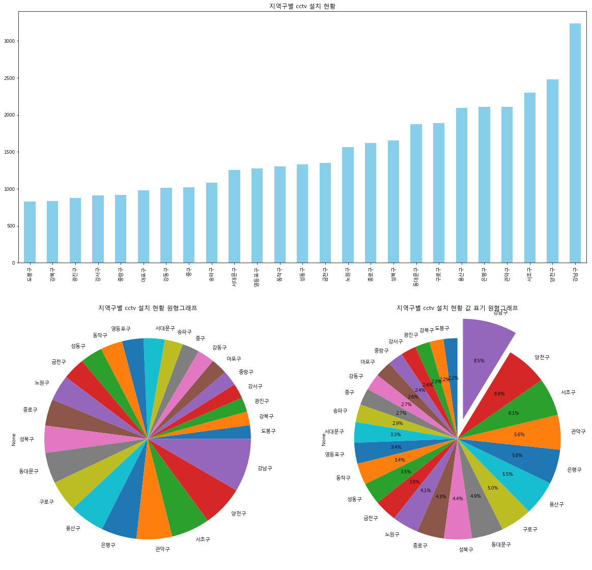

# 파이썬을 활용한 머신러닝 11일차(공공데이터 문제)

공공데이터포털을 통해 데이터 다운

https://www.data.go.kr/dataset/15017291/fileData.do


## 1. 노후화된 건물


```python
import platform # 굳이 필요없는 import

import numpy as np
import pandas as pd
import matplotlib.pyplot as plt

from matplotlib import font_manager, rc
font_name = font_manager.FontProperties(fname="c:/Windows/Fonts/malgun.ttf").get_name()
rc('font', family=font_name)

%matplotlib inline # inline을 해줘야 그래프가 그림으로 바로 표현이 가능하다. 만약 하지 않으면 객체 형식으로 보여지게 됨
plt.rcParams["figure.figsize"] = [12,6]
```

In [2]:

```python
df = pd.read_csv('data/public_old_buildings_20171016.csv', encoding='EUC-KR')
df.head(10)
```

Out[2]:

|      | 시설물명                     | 시설물구분 | 시설물소재지                  | 준공일자 |
| ---- | ---------------------------- | ---------- | ----------------------------- | -------- |
| 0    | 부암1동 동부교육청 입구 옹벽 | 옹벽       | 부산광역시 부산진구 부암동    | 19860510 |
| 1    | 전포천본류 복개구조물        | 교량       | 부산광역시 부산진구 부전2동   | 19801231 |
| 2    | 부전천본류 복개구조물        | 교량       | 부산광역시 부산진구 부전2동   | 19791231 |
| 3    | 사당천복개구조물             | 교량       | 서울특별시 서초구 방배동      | 19801231 |
| 4    | 반포천복개구조물             | 교량       | 서울특별시 서초구 서초동      | 19820929 |
| 5    | 두구교(구)                   | 교량       | 부산광역시 금정구 두구동      | 19660725 |
| 6    | 진해1부두                    | 항만       | 경상남도 창원시 진해구 행암동 | 19700929 |
| 7    | 호형정수장                   | 상하수도   | 전라남도 고흥군 고흥읍        | 19820101 |
| 8    | 금사정수장                   | 상하수도   | 전라남도 고흥군 포두면        | 19790101 |
| 9    | 신호정수장                   | 상하수도   | 전라남도 고흥군 도화면        | 19850101 |

In [3]:

```python
df.info()
```


```python
<class 'pandas.core.frame.DataFrame'>
RangeIndex: 3243 entries, 0 to 3242
Data columns (total 4 columns):
시설물명      3243 non-null object
시설물구분     3243 non-null object
시설물소재지    3243 non-null object
준공일자      3243 non-null int64
dtypes: int64(1), object(3)
memory usage: 101.4+ KB
```


#### # 준공일자 기준으로 정렬 

In [4]:

```python
df.sort_values(by='준공일자', ascending=1).tail(10)
```

Out[4]:

|      | 시설물명       | 시설물구분 | 시설물소재지                 | 준공일자 |
| ---- | -------------- | ---------- | ---------------------------- | -------- |
| 1978 | 송촌정수장     | 상하수도   | 대전광역시 대덕구 송촌동     | 19870930 |
| 1858 | 비전2배수지    | 상하수도   | 경기도 평택시 매봉산4길      | 19871001 |
| 2167 | 염포배수지     | 상하수도   | 울산광역시 북구 염포동       | 19871001 |
| 2169 | 전하배수지     | 상하수도   | 울산광역시 동구 봉수로       | 19871001 |
| 2165 | 무거배수지     | 상하수도   | 울산광역시 남구 무거동       | 19871001 |
| 2168 | 성남배수지     | 상하수도   | 울산광역시 중구 북부순환도로 | 19871001 |
| 1561 | 강진읍 상수도  | 상하수도   | 전라남도 강진군 강진읍       | 19871002 |
| 1838 | 팔마주경기장   | 건축물     | 전라남도 순천시 팔마로       | 19871002 |
| 2224 | 광주종합체육관 | 건축물     | 광주광역시 서구 화정동       | 19871005 |
| 270  | 순지교         | 교량       | 전라남도 장흥군 장흥읍       | 19871015 |

In [5]:

```python
df.columns
```

Out[5]:

```python
Index(['시설물명', '시설물구분', '시설물소재지', '준공일자'], dtype='object')
```

In [6]:

```python
type(df['준공일자'][0])
```

Out[6]:

```python
numpy.int64
```

In [7]:

```python
from datetime import datetime
```


#### # 문자열인 준공일자를 Date 객체로 변환 

In [8]:

```python
df['준공일자'] = pd.to_datetime(df['준공일자'], format='%Y%m%d') 
df.head(10)
```

Out[8]:

|      | 시설물명                     | 시설물구분 | 시설물소재지                  | 준공일자   |
| ---- | ---------------------------- | ---------- | ----------------------------- | ---------- |
| 0    | 부암1동 동부교육청 입구 옹벽 | 옹벽       | 부산광역시 부산진구 부암동    | 1986-05-10 |
| 1    | 전포천본류 복개구조물        | 교량       | 부산광역시 부산진구 부전2동   | 1980-12-31 |
| 2    | 부전천본류 복개구조물        | 교량       | 부산광역시 부산진구 부전2동   | 1979-12-31 |
| 3    | 사당천복개구조물             | 교량       | 서울특별시 서초구 방배동      | 1980-12-31 |
| 4    | 반포천복개구조물             | 교량       | 서울특별시 서초구 서초동      | 1982-09-29 |
| 5    | 두구교(구)                   | 교량       | 부산광역시 금정구 두구동      | 1966-07-25 |
| 6    | 진해1부두                    | 항만       | 경상남도 창원시 진해구 행암동 | 1970-09-29 |
| 7    | 호형정수장                   | 상하수도   | 전라남도 고흥군 고흥읍        | 1982-01-01 |
| 8    | 금사정수장                   | 상하수도   | 전라남도 고흥군 포두면        | 1979-01-01 |
| 9    | 신호정수장                   | 상하수도   | 전라남도 고흥군 도화면        | 1985-01-01 |


#### # 준공일자 칼럼을 인덱스로 지정 

In [9]:

```python
df.set_index('준공일자', inplace=True) # inplace=True으로 해야 해당하는 값이 제대로 이동함
df.head(10)
```

Out[9]:

|            | 시설물명                     | 시설물구분 | 시설물소재지                  |
| ---------- | ---------------------------- | ---------- | ----------------------------- |
| 준공일자   |                              |            |                               |
| 1986-05-10 | 부암1동 동부교육청 입구 옹벽 | 옹벽       | 부산광역시 부산진구 부암동    |
| 1980-12-31 | 전포천본류 복개구조물        | 교량       | 부산광역시 부산진구 부전2동   |
| 1979-12-31 | 부전천본류 복개구조물        | 교량       | 부산광역시 부산진구 부전2동   |
| 1980-12-31 | 사당천복개구조물             | 교량       | 서울특별시 서초구 방배동      |
| 1982-09-29 | 반포천복개구조물             | 교량       | 서울특별시 서초구 서초동      |
| 1966-07-25 | 두구교(구)                   | 교량       | 부산광역시 금정구 두구동      |
| 1970-09-29 | 진해1부두                    | 항만       | 경상남도 창원시 진해구 행암동 |
| 1982-01-01 | 호형정수장                   | 상하수도   | 전라남도 고흥군 고흥읍        |
| 1979-01-01 | 금사정수장                   | 상하수도   | 전라남도 고흥군 포두면        |
| 1985-01-01 | 신호정수장                   | 상하수도   | 전라남도 고흥군 도화면        |

In [10]:

```python
df.info()
```

- DatetimeIndex로 형이 바뀌었음

```python
<class 'pandas.core.frame.DataFrame'>
DatetimeIndex: 3243 entries, 1986-05-10 to 1979-08-20
Data columns (total 3 columns):
시설물명      3243 non-null object
시설물구분     3243 non-null object
시설물소재지    3243 non-null object
dtypes: object(3)
memory usage: 101.3+ KB
```


#### # 준공일자 인덱스로부터 준공년 컬럼 추가 

In [11]:

```python
df.index.year # df의 index는 준공일자이고, datetimeindex형이다. 이는 .year 메소드가 가능하게 된다.
```

Out[11]:

```python
Int64Index([1986, 1980, 1979, 1980, 1982, 1966, 1970, 1982, 1979, 1985,
            ...
            1985, 1979, 1987, 1984, 1984, 1984, 1984, 1982, 1986, 1979],
           dtype='int64', name='준공일자', length=3243)
```

In [12]:

```python
df['준공년'] = df.index.year
df.head(10)
```

Out[12]:

|            | 시설물명                     | 시설물구분 | 시설물소재지                  | 준공년 |
| ---------- | ---------------------------- | ---------- | ----------------------------- | ------ |
| 준공일자   |                              |            |                               |        |
| 1986-05-10 | 부암1동 동부교육청 입구 옹벽 | 옹벽       | 부산광역시 부산진구 부암동    | 1986   |
| 1980-12-31 | 전포천본류 복개구조물        | 교량       | 부산광역시 부산진구 부전2동   | 1980   |
| 1979-12-31 | 부전천본류 복개구조물        | 교량       | 부산광역시 부산진구 부전2동   | 1979   |
| 1980-12-31 | 사당천복개구조물             | 교량       | 서울특별시 서초구 방배동      | 1980   |
| 1982-09-29 | 반포천복개구조물             | 교량       | 서울특별시 서초구 서초동      | 1982   |
| 1966-07-25 | 두구교(구)                   | 교량       | 부산광역시 금정구 두구동      | 1966   |
| 1970-09-29 | 진해1부두                    | 항만       | 경상남도 창원시 진해구 행암동 | 1970   |
| 1982-01-01 | 호형정수장                   | 상하수도   | 전라남도 고흥군 고흥읍        | 1982   |
| 1979-01-01 | 금사정수장                   | 상하수도   | 전라남도 고흥군 포두면        | 1979   |
| 1985-01-01 | 신호정수장                   | 상하수도   | 전라남도 고흥군 도화면        | 1985   |


#### # 연도별 준공건수 

In [13]:

```python
df_year = df['준공년'].value_counts()
df_year.head(10)
```

Out[13]:

```python
1985    338
1984    269
1986    233
1983    196
1980    188
1987    167
1982    130
1981    128
1979    128
1977     92
Name: 준공년, dtype: int64
```

In [14]:

```python
df_year.index
```

Out[14]:

```python
Int64Index([1985, 1984, 1986, 1983, 1980, 1987, 1982, 1981, 1979, 1977, 1970,
            1978, 1973, 1975, 1974, 1976, 1969, 1971, 1972, 1963, 1965, 1961,
            1964, 1968, 1955, 1962, 1966, 1945, 1967, 1959, 1960, 1958, 1940,
            1939, 1942, 1938, 1930, 1934, 1937, 1954, 1932, 1957, 1936, 1931,
            1935, 1900, 1944, 1926, 1956, 1914, 1922, 1924, 1949, 1953, 1947,
            1906, 1925, 1943, 1950, 1946, 1929, 1921, 1933, 1923, 1928, 1920,
            1912, 1905, 1941, 1952, 1918, 1951, 1911, 1919, 1915, 1948, 1927],
           dtype='int64')
```

In [15]:

```python
plt.rcParams["figure.figsize"] = [20,12]
```

```python
df_year.plot(kind='bar')
```

Out[16]:

```python
<matplotlib.axes._subplots.AxesSubplot at 0x2a72f247b38>
```


![img](data:image/png;base64,iVBORw0KGgoAAAANSUhEUgAABIUAAAK7CAYAAABs7D9KAAAABHNCSVQICAgIfAhkiAAAAAlwSFlz%0AAAALEgAACxIB0t1+/AAAADl0RVh0U29mdHdhcmUAbWF0cGxvdGxpYiB2ZXJzaW9uIDIuMS4wLCBo%0AdHRwOi8vbWF0cGxvdGxpYi5vcmcvpW3flQAAIABJREFUeJzs3X+w5Xdd3/HX29z8GsVmkRtQ6rCW%0AwVDMWKVbGNCQwAjaLIw10tFaR7RoMK1WtKLr9AciM51t4mCqQiFa2xlLoQItIqsohh8uBCmLthBF%0AdNSVwRG9BklAYmq6n/5xz9rjze69537PuXt39/14zOzsved8f3zOOd/7PTfPfM53a4wRAAAAAHr5%0AjP0eAAAAAADnnigEAAAA0JAoBAAAANCQKAQAAADQkCgEAAAA0JAoBAAAANCQKAQAAADQkCgEAAAA%0A0JAoBAAAANDQ2n7u/BGPeMQ4ePDgfg4BAAAA4KLy/ve//0/HGOs7LbevUejgwYM5ceLEfg4BAAAA%0A4KJSVX+wyHI+PgYAAADQkCgEAAAA0JAoBAAAANCQKAQAAADQ0I4Xmq6qy5K8IcnDklSSb0jybUlu%0ASvLxJPeOMb56tuxLkzxttt2bxxi/sUfjBgAAAGAJi/zrYw8m+boxxqer6huTPG92+/eNMd5yeqGq%0Aui7JI8cY11fVtUluS3LjykcMAAAAwNJ2/PjYGOPUGOPTs28fl+SDZ1n0WUleM1vn7iQPX8kIAQAA%0AAFi5ha4pVFUvqqrfSXIoyduSfCLJD1XV8ap6/myxq5NszK32YFU9ZPtVdXNVnaiqExsbG1vvBgAA%0AAOAcWCgKjTFuG2M8LsmPJ3n5GOP2McaTknxVkm+qqscmuTfJgbnVTo0xTp1hW3eMMQ6NMQ6tr6+v%0A4CEAAAAAsFs7RqGqelhV1ezbjyT5rKo6fS2i+5P8+ezr40meO1vnCUk+uuKxAgAAALAii1xo+vFJ%0Abq+qB7IZgb4jyW1V9cQklyZ57Rjjd6vq95PcWFXHk3wyyQv2atAAAAAALGfHKDTGeF+SL9ty83ef%0AYblTSW5Z0bgAAAAA2EMLXVMIAAAAgIuLKAQAAADQkCgEAAAA0JAoBAAAANCQKAQAAADQkCgEAAAA%0A0JAoBAAAANCQKAQAAADQkCgEAAAA0JAoBAAAANCQKAQAAADQkCgEAAAA0JAoBAAAANCQKAQAAADQ%0AkCgEAAAA0JAoBAAAANCQKAQAAADQ0Np+D+C0g0eObXv/yaOHz9FIAAAAAC5+ZgoBAAAANCQKAQAA%0AADQkCgEAAAA0JAoBAAAANCQKAQAAADQkCgEAAAA0JAoBAAAANCQKAQAAADQkCgEAAAA0JAoBAAAA%0ANCQKAQAAADQkCgEAAAA0JAoBAAAANCQKAQAAADQkCgEAAAA0JAoBAAAANCQKAQAAADQkCgEAAAA0%0AJAoBAAAANCQKAQAAADQkCgEAAAA0JAoBAAAANCQKAQAAADQkCgEAAAA0JAoBAAAANCQKAQAAADQk%0ACgEAAAA0JAoBAAAANCQKAQAAADQkCgEAAAA0JAoBAAAANCQKAQAAADQkCgEAAAA0JAoBAAAANCQK%0AAQAAADQkCgEAAAA0JAoBAAAANCQKAQAAADQkCgEAAAA0JAoBAAAANCQKAQAAADQkCgEAAAA0JAoB%0AAAAANCQKAQAAADQkCgEAAAA0JAoBAAAANCQKAQAAADQkCgEAAAA0JAoBAAAANCQKAQAAADQkCgEA%0AAAA0JAoBAAAANCQKAQAAADQkCgEAAAA0JAoBAAAANCQKAQAAADQkCgEAAAA0JAoBAAAANCQKAQAA%0AADQkCgEAAAA0JAoBAAAANCQKAQAAADQkCgEAAAA0JAoBAAAANCQKAQAAADQkCgEAAAA0tLbTAlV1%0AWZI3JHlYkkryDUk+K8krklyR5K4xxotmy740ydNm2715jPEbezRuAAAAAJawYxRK8mCSrxtjfLqq%0AvjHJ85Jcl+T5Y4yTVfW6qnpyksuSPHKMcX1VXZvktiQ37tnIAQAAAJhsx4+PjTFOjTE+Pfv2cUk+%0AmOSKMcbJ2W1vSPKUJM9K8prZOncnefjKRwsAAADASix0TaGqelFV/U6SQ0l+Lck9c3ffk+RAkquT%0AbMzd/mBVPWT7VXVzVZ2oqhMbGxtb7wYAAADgHFgoCo0xbhtjPC7Jjyd5WZKr5u4+kM0YdO/s69NO%0AjTFOnWFbd4wxDo0xDq2vr08fOQAAAACT7RiFquphVVWzbz+S5JIkl1fVo2e33ZTkziTHkzx3ts4T%0Aknx09cMFAAAAYBUWudD045PcXlUPJLk/yXckeUSS189ue9MY40NV9eEkN1bV8SSfTPKCvRo0AAAA%0AAMvZMQqNMd6X5Mu23Pz72by49Pxyp5LcsrqhAQAAALBXFrqmEAAAAAAXF1EIAAAAoCFRCAAAAKAh%0AUQgAAACgIVEIAAAAoCFRCAAAAKAhUQgAAACgIVEIAAAAoCFRCAAAAKAhUQgAAACgIVEIAAAAoCFR%0ACAAAAKAhUQgAAACgIVEIAAAAoCFRCAAAAKAhUQgAAACgIVEIAAAAoCFRCAAAAKAhUQgAAACgIVEI%0AAAAAoCFRCAAAAKAhUQgAAACgIVEIAAAAoCFRCAAAAKAhUQgAAACgIVEIAAAAoCFRCAAAAKAhUQgA%0AAACgIVEIAAAAoCFRCAAAAKAhUQgAAACgIVEIAAAAoCFRCAAAAKAhUQgAAACgIVEIAAAAoCFRCAAA%0AAKAhUQgAAACgIVEIAAAAoCFRCAAAAKAhUQgAAACgIVEIAAAAoCFRCAAAAKAhUQgAAACgIVEIAAAA%0AoCFRCAAAAKAhUQgAAACgIVEIAAAAoCFRCAAAAKAhUQgAAACgIVEIAAAAoCFRCAAAAKAhUQgAAACg%0AobX9HsAqHDxy7Kz3nTx6+ByOBAAAAODCYKYQAAAAQEOiEAAAAEBDohAAAABAQ6IQAAAAQEOiEAAA%0AAEBDohAAAABAQ6IQAAAAQEOiEAAAAEBDohAAAABAQ6IQAAAAQEOiEAAAAEBDohAAAABAQ6IQAAAA%0AQEOiEAAAAEBDohAAAABAQ6IQAAAAQEOiEAAAAEBDohAAAABAQ6IQAAAAQEOiEAAAAEBDohAAAABA%0AQ6IQAAAAQEOiEAAAAEBDohAAAABAQ6IQAAAAQEOiEAAAAEBDohAAAABAQ6IQAAAAQEOiEAAAAEBD%0AohAAAABAQ6IQAAAAQEM7RqGqurKq7qiqt1XV+6rq2VX1zVX121X1jtmfK2fL3lJVv1JV762q6/d+%0A+AAAAABMsbbAMpcl+eExxm9X1VVJ3prk5UleNsZ45emFquoxSZ6T5PokVyf5uSRPWv2QAQAAAFjW%0AjlFojHFvkntn3/5lkvvOsuhXJHndGGMk+eOq+nhVXTXG+MRqhgoAAADAqix8TaGqqiS3JXlxkk8l%0A+baqendV/cBskauTbMytck+SA2fYzs1VdaKqTmxsbGy9GwAAAIBzYKEoVFWfkeRHk/zSGONdY4zX%0AjzH+bpKnJ/niqnpGNmcTzUegA/nrkShJMsa4Y4xxaIxxaH19fflHAAAAAMCuLXKh6UuT/ESSN48x%0A3ji7bS1Jxhj/J5sxqJIcT/K1s/uvTrI2xvjUHo0bAAAAgCUscqHp707ylUkeO/uo2EeS3F1Vz05y%0ASZJ3jjHuTJKq+vWquivJ/UleuEdjBgAAAGBJi1xo+tYkt57hrofcNsZ4SZKXrGBcAAAAAOyhhS80%0ADQAAAMDFQxQCAAAAaEgUAgAAAGhIFAIAAABoSBQCAAAAaEgUAgAAAGhIFAIAAABoSBQCAAAAaEgU%0AAgAAAGhIFAIAAABoSBQCAAAAaEgUAgAAAGhIFAIAAABoSBQCAAAAaEgUAgAAAGhIFAIAAABoSBQC%0AAAAAaEgUAgAAAGhIFAIAAABoSBQCAAAAaEgUAgAAAGhIFAIAAABoSBQCAAAAaEgUAgAAAGhIFAIA%0AAABoSBQCAAAAaGhtvwewnw4eObbt/SePHj5HIwEAAAA4t8wUAgAAAGhIFAIAAABoSBQCAAAAaEgU%0AAgAAAGhIFAIAAABoSBQCAAAAaEgUAgAAAGhIFAIAAABoSBQCAAAAaEgUAgAAAGhIFAIAAABoSBQC%0AAAAAaEgUAgAAAGhIFAIAAABoSBQCAAAAaEgUAgAAAGhIFAIAAABoSBQCAAAAaEgUAgAAAGhIFAIA%0AAABoSBQCAAAAaEgUAgAAAGhIFAIAAABoSBQCAAAAaEgUAgAAAGhIFAIAAABoSBQCAAAAaEgUAgAA%0AAGhIFAIAAABoSBQCAAAAaEgUAgAAAGhIFAIAAABoSBQCAAAAaEgUAgAAAGhIFAIAAABoSBQCAAAA%0AaEgUAgAAAGhIFAIAAABoSBQCAAAAaEgUAgAAAGhIFAIAAABoSBQCAAAAaEgUAgAAAGhIFAIAAABo%0ASBQCAAAAaEgUAgAAAGhIFAIAAABoSBQCAAAAaEgUAgAAAGhIFAIAAABoSBQCAAAAaEgUAgAAAGhI%0AFAIAAABoSBQCAAAAaEgUAgAAAGhIFAIAAABoSBQCAAAAaGjHKFRVV1bVHVX1tqp6X1U9u6oeVVVv%0ArqrjVfWfq+rS2bK3VNWvVNV7q+r6vR8+AAAAAFOsLbDMZUl+eIzx21V1VZK3JvlAkn87xrirqm5L%0AclNV/WqS5yS5PsnVSX4uyZP2aNwAAAAALGHHKDTGuDfJvbNv/zLJfUmuGWPcNbvtDUm+PslnJXnd%0AGGMk+eOq+nhVXTXG+MQejBsAAACAJSx8TaGqqiS3JXnxlvXuSXIgm7ODNs5w+9bt3FxVJ6rqxMbG%0Axta7AQAAADgHFopCVfUZSX40yS+NMd6VpObuPpDNGHRv/noEOn37XzPGuGOMcWiMcWh9fX3ywAEA%0AAACYbpELTV+a5CeSvHmM8cbZzX9YVU+cff21SX45yfHZ16mqq5OsjTE+tfohAwAAALCsRS40/d1J%0AvjLJY6vqB5J8JMn3J/mpqjqV5H1JfnGMMarq16vqriT3J3nhXg0aAAAAgOUscqHpW5Pceoa7HvJP%0Azo8xXpLkJSsYFwAAAAB7aOELTQMAAABw8RCFAAAAABpa5JpCnMHBI8fOet/Jo4fP4UgAAAAAds9M%0AIQAAAICGRCEAAACAhkQhAAAAgIZEIQAAAICGRCEAAACAhkQhAAAAgIZEIQAAAICGRCEAAACAhkQh%0AAAAAgIZEIQAAAICGRCEAAACAhkQhAAAAgIZEIQAAAICGRCEAAACAhtb2ewDdHDxybNv7Tx49fI5G%0AAgAAAHRmphAAAABAQ6IQAAAAQEOiEAAAAEBDohAAAABAQ6IQAAAAQEOiEAAAAEBDohAAAABAQ6IQ%0AAAAAQEOiEAAAAEBDohAAAABAQ6IQAAAAQEOiEAAAAEBDohAAAABAQ6IQAAAAQEOiEAAAAEBDohAA%0AAABAQ6IQAAAAQEOiEAAAAEBDohAAAABAQ6IQAAAAQEOiEAAAAEBDohAAAABAQ6IQAAAAQEOiEAAA%0AAEBDohAAAABAQ6IQAAAAQEOiEAAAAEBDohAAAABAQ6IQAAAAQEOiEAAAAEBDohAAAABAQ6IQAAAA%0AQEOiEAAAAEBDohAAAABAQ6IQAAAAQEOiEAAAAEBDohAAAABAQ6IQAAAAQENr+z0AFnfwyLGz3nfy%0A6OFzOBIAAADgQmemEAAAAEBDohAAAABAQ6IQAAAAQEOiEAAAAEBDohAAAABAQ6IQAAAAQEOiEAAA%0AAEBDohAAAABAQ6IQAAAAQEOiEAAAAEBDohAAAABAQ6IQAAAAQEOiEAAAAEBDohAAAABAQ6IQAAAA%0AQEOiEAAAAEBDohAAAABAQ6IQAAAAQEOiEAAAAEBDohAAAABAQ6IQAAAAQEOiEAAAAEBDohAAAABA%0AQ6IQAAAAQEOiEAAAAEBDohAAAABAQ7uKQlV1yV4NBAAAAIBzZ8coVFVXVdWPVNUHkzxzdtsPVtUH%0AquodVfWzc8u+tKreWVXvrqov2sNxAwAAALCEtQWWOZXklUnu3XL7940x3nL6m6q6LskjxxjXV9W1%0ASW5LcuPKRgoAAADAyuwYhcYY9yW5r6p2WvRZSV4zW+fuqnr48sMDAAAAYC9MvdD0J5L8UFUdr6rn%0Az267OsnG3DIPVtVDtl9VN1fViao6sbGxsfVuAAAAAM6BSVFojHH7GONJSb4qyTdV1WOz+fGyA3OL%0AnRpjnDrDuneMMQ6NMQ6tr69PGjQAAAAAy5kUharq9MfO7k/y57Ovjyd57uz+JyT56NKjAwAAAGBP%0A7HhNoap6VJLXJjmY5KaquiXJ71XVE5NcmuS1Y4zfrarfT3JjVR1P8skkL9i7YQMAAACwjEUuNP2x%0AJDcssNypJLesYEwAAAAA7LGpF5oGAAAA4AImCgEAAAA0JAoBAAAANCQKAQAAADQkCgEAAAA0JAoB%0AAAAANCQKAQAAADQkCgEAAAA0JAoBAAAANCQKAQAAADQkCgEAAAA0JAoBAAAANCQKAQAAADQkCgEA%0AAAA0JAoBAAAANCQKAQAAADQkCgEAAAA0JAoBAAAANCQKAQAAADQkCgEAAAA0JAoBAAAANCQKAQAA%0AADQkCgEAAAA0JAoBAAAANCQKAQAAADQkCgEAAAA0JAoBAAAANCQKAQAAADQkCgEAAAA0JAoBAAAA%0ANCQKAQAAADQkCgEAAAA0tLbfA2DvHTxybNv7Tx49fI5GAgAAAJwvzBQCAAAAaEgUAgAAAGjIx8fY%0A1nYfPdvuY2c+sgYAAADnNzOFAAAAABoShQAAAAAaEoUAAAAAGhKFAAAAABoShQAAAAAaEoUAAAAA%0AGhKFAAAAABoShQAAAAAaEoUAAAAAGhKFAAAAABoShQAAAAAaEoUAAAAAGhKFAAAAABoShQAAAAAa%0AEoUAAAAAGhKFAAAAABoShQAAAAAaEoUAAAAAGhKFAAAAABoShQAAAAAaEoUAAAAAGhKFAAAAABoS%0AhQAAAAAaEoUAAAAAGhKFAAAAABoShQAAAAAaEoUAAAAAGhKFAAAAABoShQAAAAAaEoUAAAAAGhKF%0AAAAAABoShQAAAAAaEoUAAAAAGhKFAAAAABoShQAAAAAaEoUAAAAAGhKFAAAAABoShQAAAAAaEoUA%0AAAAAGhKFAAAAABoShQAAAAAaEoUAAAAAGhKFAAAAABoShQAAAAAaEoUAAAAAGhKFAAAAABoShQAA%0AAAAa2lUUqqpL9mogAAAAAJw7O0ahqrqqqn6kqj6Y5Jmz266pqjur6t1Vddvcsi+tqnfObv+iPRw3%0AAAAAAEtYW2CZU0lemeTeudtuT/L8McbJqnpdVT05yWVJHjnGuL6qrk1yW5IbVz5iAAAAAJa2YxQa%0AY9yX5L6qSpJU1VqSK8YYJ2eLvCHJU5J8TpLXzNa5u6oevhcDBgAAAGB5Uy40vZ7knrnv70lyIMnV%0ASTbmbn+wqh6y/aq6uapOVNWJjY2NrXcDAAAAcA5MiUKfSHLV3PcHshmD7p19fdqpMcaprSuPMe4Y%0AYxwaYxxaX1+fsHsAAAAAlrXrKDTGuD/J5VX16NlNNyW5M8nxJM9Nkqp6QpKPrmqQAAAAAKzWjtcU%0AqqpHJXltkoNJbqqqW5J8T5LXV9UDSd40xvhQVX04yY1VdTzJJ5O8YO+GDQAAAMAyFrnQ9MeS3HCG%0Au56yZblTSW5ZzbAAAAAA2EtTrikEAAAAwAVOFAIAAABoSBQCAAAAaEgUAgAAAGhIFAIAAABoSBQC%0AAAAAaEgUAgAAAGhIFAIAAABoSBQCAAAAaGhtvwcAWx08cuys9508evgcjgQAAAAuXmYKAQAAADRk%0AphAXje1mGCXbzzIyOwkAAIBuzBQCAAAAaEgUAgAAAGhIFAIAAABoSBQCAAAAaEgUAgAAAGhIFAIA%0AAABoSBQCAAAAaEgUAgAAAGhIFAIAAABoSBQCAAAAaEgUAgAAAGhIFAIAAABoSBQCAAAAaEgUAgAA%0AAGhIFAIAAABoSBQCAAAAaEgUAgAAAGhIFAIAAABoSBQCAAAAaEgUAgAAAGhIFAIAAABoSBQCAAAA%0AaEgUAgAAAGhIFAIAAABoSBQCAAAAaGhtvwcAF7KDR45te//Jo4fP0UgAAABgd8wUAgAAAGjITCHY%0AJ9vNMjLDCAAAgL1mphAAAABAQ6IQAAAAQEOiEAAAAEBDohAAAABAQ6IQAAAAQEOiEAAAAEBDohAA%0AAABAQ6IQAAAAQEOiEAAAAEBDohAAAABAQ2v7PQBgdw4eObbt/SePHj5HIwEAAOBCZqYQAAAAQENm%0ACkEj280yMsMIAACgFzOFAAAAABoShQAAAAAaEoUAAAAAGhKFAAAAABoShQAAAAAaEoUAAAAAGhKF%0AAAAAABoShQAAAAAaEoUAAAAAGhKFAAAAABoShQAAAAAaEoUAAAAAGhKFAAAAABoShQAAAAAaEoUA%0AAAAAGhKFAAAAABoShQAAAAAaEoUAAAAAGhKFAAAAABpa2+8BAOe/g0eObXv/yaOHz9FIAAAAWBUz%0AhQAAAAAaMlMI2FPbzTIywwgAAGD/mCkEAAAA0JAoBAAAANCQKAQAAADQkCgEAAAA0JAoBAAAANCQ%0AKAQAAADQkCgEAAAA0JAoBAAAANCQKAQAAADQ0NoyK1fVfUl+bfbtv0/ym0lekeSKJHeNMV603PAA%0AAAAA2AtLRaEkvznGuOH0N1X1C0meP8Y4WVWvq6onjzHeu+Q+AAAAAFixlX18rKrWklwxxjg5u+kN%0ASZ6yqu0DAAAAsDrLRqEDVfWuqvpvSR6Z5J65++5JcmDrClV1c1WdqKoTGxsbS+4eAAAAgCmWikJj%0AjGvGGF+e5NVJbk9y1dzdB5I8pPqMMe4YYxwaYxxaX19fZvcAAAAATDQ5ClXVJXPf/kmSv0hyeVU9%0AenbbTUnuXGJsAAAAAOyRZS40fU1V/WSSB5Lcn+Tbs/kRstdX1QNJ3jTG+NAKxggAAADAik2OQmOM%0A30zy1C03fyQuLg0AAABw3lvZvz4GAAAAwIVDFAIAAABoSBQCAAAAaEgUAgAAAGhIFAIAAABoSBQC%0AAAAAaEgUAgAAAGhIFAIAAABoSBQCAAAAaGhtvwcAcCYHjxzb9v6TRw+fo5EAAABcnMwUAgAAAGjI%0ATCHgorPdLCMzjAAAADaZKQQAAADQkCgEAAAA0JAoBAAAANCQawoBzPgXzwAAgE7MFAIAAABoSBQC%0AAAAAaEgUAgAAAGhIFAIAAABoSBQCAAAAaEgUAgAAAGhIFAIAAABoSBQCAAAAaEgUAgAAAGhIFAIA%0AAABoaG2/BwBwMTh45NhZ7zt59PCk9ZZZd7v1AAAAEjOFAAAAAFoyUwigGbOTAACAxEwhAAAAgJbM%0AFAJgz5mdBAAA5x8zhQAAAAAaEoUAAAAAGvLxMQAuSst8ZA0AADowUwgAAACgITOFAGALF7cGAKAD%0AM4UAAAAAGjJTCABWxHWMAAC4kJgpBAAAANCQKAQAAADQkCgEAAAA0JAoBAAAANCQKAQAAADQkCgE%0AAAAA0JB/kh4AzgPb/XP22/1T9lPXAwAAM4UAAAAAGhKFAAAAABoShQAAAAAaEoUAAAAAGhKFAAAA%0AABryr48BQFP+5TIAgN7MFAIAAABoSBQCAAAAaMjHxwCAXfGxMwCAi4OZQgAAAAANmSkEAJwzZhkB%0AAJw/zBQCAAAAaEgUAgAAAGhIFAIAAABoyDWFAIDz3jLXIpq6rusfAQAXOzOFAAAAABoyUwgAYMX2%0AY3aSmU0AwG6ZKQQAAADQkJlCAACNmWEEAH2JQgAATOIi3gBwYfPxMQAAAICGzBQCAOCCYZYRAKyO%0AmUIAAAAADYlCAAAAAA2JQgAAAAANuaYQAAAXvWWuReRfWQPgYmWmEAAAAEBDohAAAABAQ6IQAAAA%0AQEOuKQQAAOeZ/biOkWsgAfRjphAAAABAQ2YKAQAAk5mdBHDhEoUAAIALihAFsBo+PgYAAADQkJlC%0AAAAAO9iP2Uld9gnsHzOFAAAAABoyUwgAAIB9Y4YR7B8zhQAAAAAaMlMIAACAC9KFdO2kLvvkwrLy%0AmUJV9dKqemdVvbuqvmjV2wcAAABgeSudKVRV1yV55Bjj+qq6NsltSW5c5T4AAACA89NezGpaZl37%0A3N6qZwo9K8lrkmSMcXeSh694+wAAAACsQI0xVrexqlcl+bFZEEpVvSvJ08YYp+aWuTnJzbNvr0ny%0A4bNs7hFJ/nTiUKaua5/2uV/7vJDGap/2aZ/2aZ/2aZ/2aZ/2aZ/2aZ/n9z4fM8ZY33ELY4yV/Uly%0Aa5Lr5r7/lSW2deJcr2uf9rlf+7yQxmqf9mmf9mmf9mmf9mmf9mmf9mmfF+4+5/+s+uNjx5M8N0mq%0A6glJPrri7QMAAACwAqv+J+mPJbmxqo4n+WSSF6x4+wAAAACswEqj0Ni8dtAtK9rcHfuwrn3a537t%0A80Iaq33ap33ap33ap33ap33ap33ap31euPv8Kyu90DQAAAAAF4ZVX1MIAAAAgAuAKAQAAADQkCgE%0AAAAA0NB5GYWq6guq6gsmrvvPFlzuwNzXX1NV/7KqnjNxn3+rqp6w4LJ/r6r+eVW9uKr+aVVds+B6%0Az6uqyyeM7dKqem5VPX3L7Tfsdltz6371AsvcUFUvqqofqKp/VFWfueC2Jz3O2bpTn9uqqi+pqitn%0A3z97tv5CY57bzsLHwRnWnXTML3q8z5adfMxPfT232d62x9Aqj9upr8sy56G5bez4s7Jl+d28nqs6%0Abhd+nFNflyWPvcu3fH/D1v2fZb3J55K5/Uw5h53T81BVXVJV/7CqXlZV/6mqbq2qZy2yz9n6u36c%0AVXWgqr63qr6lqi6bu/3rF1h38nE79bk9w3YW/T1hqWNo4j4nn/umjneZn89ttrnbc9+uzrerOBaq%0A6t/sYtm/Pfv78qr6nqr6iar6zvnj/yzrrfJ3zYV/v53683mGbS30HM2O22+uqpdX1atm55PH7HZ/%0As20t9J49e+0/b+I+Jr0uU9+P5pZ/VFVdOvv6aVV144LrTX1fmXrcruz1nNvmrv5F6kWPg9myU5/X%0AK6vqH5w+jmbPza1V9agd1pv8vrvMOX7L8rs6Z55lG9u+Jku+H01+rz/L9nb1nrLbdWtF/52z6Osy%0A9dibLTv53Lftds+HC01X1f8YY3zN7OtvSfK8JJ9K8pYxxo/vsO57kowkNbvpYJKTScYY46nbrHd8%0AjHFdVd2a5IokP5/khiRXjDFrGUOEAAAQIElEQVReuMM+X5jknyT5gySvSvIdSe5N8p4xxu3brPfv%0AZuP770nuSXIgyU1J3rvderN1Tyb5UJIPJHnFGOMPtlt+br2fSfLhbD4/j0nyrWOMB6rqbWOMZyyy%0AjTNsc9t1q+pHknxOkjcneXqSv8jm437FGOOtO2z7ZKY9zmWe25+afXl1kp9N8rlJ/izJl48xvm6b%0A9SYdB7N1Jx3zU4/32bqTjvllXs9ttrnTMTT5uF3i53PyeWibbe70OJd5Pacet8ucbye9Lkueb/9q%0A21X1/Un+TjZfz3vGGP9qm/VOZsK5ZLbupGN+n85DP5VkY8s+vzZJxhhH9uhxviXJ67J5HPz9JN82%0Axvj4gj+fUx/nMs/t1N8TTmb6MTR1n8uc+yaNd5mfz222udM5YZnz0KRjoap+L8nHstz75x3ZfH2O%0AZfM5euoY45sWWG/KuW/qMbTMz+ek56iq/kuS38vmueQZSR6W5POT/OIY49U77HPqe/ZvJXn/7NtX%0AjjGOb7efLetO/X1o0vvRbPlbk3xpkgezeex+eZI/SfJ/tztXL3num3rcTn49t9nmTueEqcfBpOd1%0Atu4bk/zabP1fz+ax/mdJvn2McXib9ZZ53536e9R+/I66zPvRpPf6qWNdZt0l/7t16n/PTTr2ZutO%0APvdta4yx73+SvG3u63cmuTKbs5jetcC6L03yvXPf/4cF9/nu0/vbcvvbF1j3xOzvz03yh0muPNO2%0AzrDe8Z0e/zbrvn3291OSvDqbb/hfscB675j7+tokr01y+U6Pc/b835nkri1/3pPkEzus+64t378p%0Am2+6Z3z8K3qcyzy375j9/dgkr5+7/Zf34jjYOq7dHPNTj/fZspOO+amv55LH0KTjdpnXZYnXZJnH%0AuczrOfW4XeZ8O+l1mXrsbV0myfEka6e/XmS97PJcMpY75vfjPHTG4zrJnXv4OOdfk0dn8xfjAwu+%0AnlMf5zLP7dTfE5Y5hqbu8x1zX+/23DdpvFN/PrPcuW+Z89CkYyHJdyZ5WZLLdvOazJZ9z1meo532%0Aucy5b6njdvb1bn8+Jz1HZ3h8Pz97Pd+9wLpT37PfPvv7byY5OjsWvzWbYWevjvn553bh96PZMr86%0A+/uzk/zR3Lo77XOZc9/U43bS6zlb5u6J54Spx8Gk53X+eZj9nPzXudv38n33HXNf7+b3qGV+R536%0Amkwa6/y62cV7fZZ7T9mv/26d+rpMOvbmj+1MOPdt9+d8+fjY51TVs6rqK7P5gO4fY5zKZvXd1hjj%0AXyf5UFX9dFWtZ/P/qizif1bVNye5q6qemCRVdW3+//8d2c6fzfb9R0lOjjHuX3CfD1TV58/fUFWf%0Am80Dbydjts/3jDH+cZLvSvL0qtqpDv7lX21gjLuzefD8xyRr2+5s8/n/eJJnjDGeOvfnKdksmtt5%0AYG463OOTXDrG+Iss9txOfZzLPLdVVQeTfHWSS6rqM2tzuuPDd1hv6nGQTDzmlzjek+nH/KTXc8lj%0AaNJxOzP1dZn6mkx+nEu+nlOP28nn20x/XZY5335eVd1cm9OcrxxjnB7nqR3Wm3ouSaafw/bjPHRf%0AVT15y4a+NMklC+xz6uO8v2ZT9ccYf5jkhUl+Mski062nPs7Jz+0SP2eTj6El9rnMuW/qeCf9fC55%0Ajl/mPDTpWBhj/FiSn07y6tr8+M1uzrdvqqofTPILtfkxiKrNj6g8sMN6k899SxxDk38+l3iOPlVV%0AX5IkVfWMJKdfz0XWn/qeffp4/+jYnJ1xOJvP6y8usO7U12Xq+1GSfHI23vuS/Nbcujudq5d5X5l6%0A3E56PWfL/O8kXzXhnDD1OJj6vCbJqM2PQn3P7OtHz37W/sYO6y3zvjv1HL/M76hTX5Nl3o92/V6/%0A5O/T+/XfrVPfy6Yee8ly575ttrpEUVrVnyQvnvvzXbPbLknysl1s4/OyWTB/bsHlK8m3Z7MGfizJ%0A/8rm9LYvXGDdb0jymbOvHzH7+7OzOYVru/W+MJu1/c4kP5PkrdmsiocW2Ofbz3L75Tus98wkX7Ll%0AtuuS/PkC+3xOksef4fbv32G9L07yy9kstG87/Zwm+Rd7+DivWeK5fXKSN2bzF+hHzbbzgeT/tXe2%0AoZaVVRz//28OWE0zQeZNDS01cpRgLJwoLT+UGk4vWPRFoaSgosgixpI+lNW3kooytBdoqtFJk6ac%0AlHzBmbyTUAZGYPRidK0+FL2YZGiQs/rw7CO7M+ee/ey19t7P2XP+f9jcc/c96/zWWs96nr3vPs/e%0ADy7tow66qPm29b5BzT+QU/MAXhJoT28NRerW2z/dbeKNM9ieG9XtZT3G6WqXGbXXZrx9e217S83f%0AKxvsDmywf+5YEql5xMb4Hc72XEX6h28NwI+r7WYAp/YY50sBnDW1bxuAB3uM053b2me0PU9w11CA%0AGRn7XP7O6J9Zx4bK1jvGR8ahUC0gXRy5HulWmKx2rOxeB+AmpGn79wO4FsBqX7kN1JC7f3pzhPSN%0A9Y3VWHLDJC9oOI+avAe+Y3bjN+ot2iXrmATn8ah632smcdb2bQHw8Z7r3VO3kfY8D8Bps3LXUx24%0A8lq97zQAnwdwCdItcnurmOfOsMT/H3cPVTa5x13veVRkzPS2SeR45D3Wu8+nvbaI/Z/jahdv7VW2%0A7rFv3rYQzxTqSiRXALzazA6W9mWeSD4NwHMBPGJmTVfrJzbHmdnf+vWsvEg+x8z+HrCf5Paflq7y%0AHrWq6v18MztQ2hcpLrVnnkieYhnPSik5ZnrG+A7ZLzCz9YGZWW3SESs0xrfpZ13V0FB9e1nOEyaq%0AauF4AP/w9DOSZ5jZr7r3rHuVOj6QfLGZ/dphN9iYEGWSpBX4Z6itv12c35Y4PkiLpxL9U5qvReib%0AC3H7GMnzSH6P5LtJHk/yTpIPkLwk0/b71VTO4wB8tLJ9c4PdqyrmuyLMNraTOAG8E2mq6f5cJoAz%0ANmA2xRnNbWtbkr8n+WGSTbcDzNLPPLYTJoCtZvbnNgdMr7+ROLtgmtnhNieIAeau6ud2kveRXCN5%0ATzVVti9mJLcTf8+e8nd7pt10nHPtGphzc1S3Q/q26VMtcutlvqn2+gSS36i25weY3tzmxHlhfQNw%0Abe31PF2+ga85TFeOJnEifev0XQB3D8Cczs8XM/Mz4VxFcifTShhfJ3kzG1aZCbRJhHkCyauQvvV+%0AFMB1OXbTTKTnIbwt03aTx9eKWV/tZBXA5ZntuVF+Tm5iAjh36nNya8jVJhHbIHMbyduQvqW/CcAd%0AJPeQPKnBbrpuP9OibneS/CnJu0i+orZ/d4PddL/endMm06of70nua2BeXPP1lbX9c32dZTu5IJQR%0AZ2RMqOfoxMDY14a5jeRtJO8D8COSBzNrKJJbl7+T/JjZk0gznL6cW0MzmFnHhy5rKNc2MJaU8LVu%0Alz0eNHxmU79+qmZJ3ptbs5VtqPaq163OF+d8ZlOcgzO7tsux9fbNytZd83PVx/SjthvSdKmTAVwJ%0AYB/SA/GejrwH9rpsxeyVeRDAxUhTcb8G4OwWteCyFbNX5lr18y4Ap1SvV5H5oLkCcbr8DcY5Jmb9%0AoXh7kabbvhzADxY0zj8hTbGdTM+9v/r5sR6ZrhwVYrryU9keAHAZgKsB7Ee64HImGm5T6YF5VgbT%0AZbeB7UWZcbryE2zPRWF6c5tbQ5E413Dk7VFn9txXfoL0rIdnAvgSgDdO4uipTVYAXDhjuwjAz1v6%0A+oYcXyO2wdyWGPu8NRTJrfdYFjlme5klasg7lnTpa26/9tpF+rWrZkvUXjDOQZlBXyO2XR6Psmt+%0A3pbzoKgh9F8z+wPJ7yDdI/sIAJA5z3dy24rZH/Owmd0O4HamB3ZdQfJUALvN7Ns92YrZI5PkVqSH%0Apv0RAMzsL6weZLmIcTr9DcU5ImZdJ5nZfgBgegBgX8yIr+cC+DTS6hWHSD7PzD7Ro6/TapOjEkxv%0AflD5d0PF+Y2Z/XCBmW67GbZ3DMGsqVU/GxuzQHs+aWYPTn3WL0luabCL1O1jZvZo9fp9JL9A8nG0%0Ae1h1dpuY2WGS1wC4BTjiYadNcc7y9YlMX722oTGhpqHGPm8NRXLbRY7aHrO9zBI15B0TuvY1p1+7%0A7IL92luzwMC1F4xzUGbE12CcXR+Pcmt+Qy3KRaFfVFOeVpFuqfoIgMcBPNajrZj9MZ/qGJbu138v%0AyWcjLZfXJK+tmP0xdwHYA+B3AL5F8k6kWTz39MiMxOn1NxLnmJgvY5oyT6TZfxPlrGQyeJxm9jDJ%0ASwFcTfJ85N/2HMmtN0eDMwP5AYB/kTzW0u22X1lkZsCuFNNbQ2NjlsjtvSSvR/oW+a9Isb4Vadnl%0ADRWs24dInm5mD1W/fwDAVwGc3mAXGW/vBrDXzH5b38m0Yk0fvrptg7ktMfa5agiB3Ab8dddQgDl4%0ADcE/JpTwNcL09mtvzRapPfjjLMH02rltCx2P5ssC04y62pAafjuAZ1W/7wRwBdLzYXqxFbNX5q5A%0ALbhsxezd9hikKZwfAvB+AOcsapxBf112Y2PO+JwVANsWNc7aZ1wA4Mah89MmRyWYgfxsmrFvM9qt%0A6DUIM+JrCaa3PcfGLJVbpNV0PgngOqRlkl8PpMVTMu3b1u2xqM6FavuOQcaqU542qd63FcDmGfub%0AVo5y+9pFnG1zG8lRhOmpoa7qIJqjtvlpyyxRQ4GxpISvEaarX1fvCY17Q9ZeJM6hmcE2CcfZtk26%0AGoemt4VZfay6onYOUlDrAG41s3/3aSummGK2Yu5AWmZxSGYkztb+dhDnmJhjy+2Y6nZsfUVMMcfI%0ALDH2LUtul4WpGjoKmGPytQOmzi/EDNlupEVZfexzAN4B4GGkBxvvALCH5AV92YopppitmesFmJE4%0AW/nbUZxjYo4tt2Oq2xLMZRmHxBSz5Ni3LLldFuZ6Aeay5HYQ5ph87Yi5XoC5LLk9qpmNikwz6moD%0AcGjq91uRpkat9WUrpphiiimmmGKKKaaYYoop5jiZY/JVTDFLMpu2hZgpBOA/JE8EAKaVhjZZetBY%0AzhJZXlsxxRRTTDHFFFNMMcUUU0wxx8kck69iilmSOVeLsvrYBwF8k+QzADwB4D3V/n092ooppphi%0AiimmmGKKKaaYYoo5TuaYfBVTzJLM+YpMM+p7A7BvaFsxxRRTTDHFFFNMMcUUU0wxx8kck69iilmS%0AOdmKzxQiuQLgtbP+BOCFfdiKKaaYYooppphiiimmmGKKOU7mmHwVU8ySzBwVvyhkZodJXgPgFuCI%0Ae+G29GErpphiiimmmGKKKaaYYoop5jiZY/JVTDFLMrMUmWbU1QbgswBeNGP/gb5sxRRTTDHFFFNM%0AMcUUU0wxxRwnc0y+iilmSWbj50aMu9oAbAWwecb+1b5sxRRTTDHFFFNMMcUUU0wxxRwnc0y+iilm%0ASWbTxupDJEmSJEmSJEmSJEmSpCXSSmkHJEmSJEmSJEmSJEmSpOGli0KSJEmSJEmSJEmSJElLKF0U%0AkiRJkiRJkiRJkiRJWkLpopAkSZIkSZIkSZIkSdISSheFJEmSJEmSJEmSJEmSllD/AwFf/SzN4wwk%0AAAAAAElFTkSuQmCC)


#### # 연도별로 정렬

```python
df_year = df_year.sort_index()
df_year.head(10)
```

Out[17]:

```
1900    11
1905     2
1906     5
1911     1
1912     2
1914     7
1915     1
1918     1
1919     1
1920     2
Name: 준공년, dtype: int64
```

In [18]:

```python
df_year.plot(kind='bar')
```

Out[18]:

```
<matplotlib.axes._subplots.AxesSubplot at 0x2a72f768940>
```


![img](data:image/png;base64,iVBORw0KGgoAAAANSUhEUgAABIUAAAK7CAYAAABs7D9KAAAABHNCSVQICAgIfAhkiAAAAAlwSFlz%0AAAALEgAACxIB0t1+/AAAADl0RVh0U29mdHdhcmUAbWF0cGxvdGxpYiB2ZXJzaW9uIDIuMS4wLCBo%0AdHRwOi8vbWF0cGxvdGxpYi5vcmcvpW3flQAAIABJREFUeJzs3X+w5Xdd3/HXm9yEZBCbRTZBqcNq%0ABoOQtkq3MCAhQBVpFsYa6GjRES0aTKsVreg6/YHITGebOJAqWozWdsYiKNAisopiUnCTIGWRFqKI%0AjroyOKLXIAlITE330z/OWbnc7N5z9pxz792778dj5g73nvP9ns/nnvO9X7LP+znfW2OMAAAAANDL%0AQ3Z7AgAAAADsPFEIAAAAoCFRCAAAAKAhUQgAAACgIVEIAAAAoCFRCAAAAKAhUQgAAACgIVEIAAAA%0AoCFRCAAAAKChtd0c/JGPfOQ4cODAbk4BAAAA4Lzyvve978/HGPtnbberUejAgQM5fvz4bk4BAAAA%0A4LxSVX80z3bePgYAAADQkCgEAAAA0JAoBAAAANCQKAQAAADQ0MwLTVfVRUnenOThSSrJC5N8W5Lr%0Aknw8yT1jjK+ZbvvKJE+fPu71Y4zf2qZ5AwAAALCEef762ANJvm6M8emq+sYkL5re/n1jjLef2qiq%0Ark5y+Rjjmqq6KslNSa5d+YwBAAAAWNrMt4+NMU6OMT49/fKxST54hk2fneT1033uSvKIlcwQAAAA%0AgJWb65pCVfWyqvq9JAeT3JbkE0l+qKqOVdWLp5tdlmR9w24PVNWDHr+qrq+q41V1fH19ffPdAAAA%0AAOyAuaLQGOOmMcZjk7wmyY+NMW4eYzwpyXOSfFNVXZHkniT7Nux2coxx8jSPdcsY4+AY4+D+/ftX%0A8C0AAAAAcLZmRqGqenhV1fTLjyT5nKo6dS2i+5L85fTzY0leMN3n8Uk+uuK5AgAAALAi81xo+nFJ%0Abq6q+zOJQN+R5KaqemKSC5O8YYzx+1X1h0murapjST6Z5CXbNWkAAAAAljMzCo0x3pvkKzbd/N2n%0A2e5kkhtWNC8AAAAAttFc1xQCAAAA4PwiCgEAAAA0JAoBAAAANCQKAQAAADQkCgEAAAA0JAoBAAAA%0ANCQKAQAAADQkCgEAAAA0JAoBAAAANCQKAQAAADQkCgEAAAA0JAoBAAAANCQKAQAAADQkCgEAAAA0%0AJAoBAAAANCQKAQAAADQkCgEAAAA0tLbbEwAAAADYSw4cPnrG+04cObSDM1mOlUIAAAAADYlCAAAA%0AAA2JQgAAAAANiUIAAAAADYlCAAAAAA2JQgAAAAANiUIAAAAADYlCAAAAAA2JQgAAAAANiUIAAAAA%0ADYlCAAAAAA2JQgAAAAANiUIAAAAADYlCAAAAAA2JQgAAAAANiUIAAAAADYlCAAAAAA2JQgAAAAAN%0AiUIAAAAADYlCAAAAAA2JQgAAAAANiUIAAAAADYlCAAAAAA2JQgAAAAANiUIAAAAADYlCAAAAAA2J%0AQgAAAAANiUIAAAAADYlCAAAAAA2JQgAAAAANiUIAAAAADYlCAAAAAA2JQgAAAAANiUIAAAAADYlC%0AAAAAAA2JQgAAAAANiUIAAAAADYlCAAAAAA2JQgAAAAANiUIAAAAADYlCAAAAAA2JQgAAAAANiUIA%0AAAAADYlCAAAAAA2JQgAAAAANiUIAAAAADYlCAAAAAA2JQgAAAAANiUIAAAAADYlCAAAAAA2JQgAA%0AAAANiUIAAAAADYlCAAAAAA2JQgAAAAANiUIAAAAADYlCAAAAAA2JQgAAAAANiUIAAAAADYlCAAAA%0AAA2JQgAAAAANiUIAAAAADYlCAAAAAA2JQgAAAAANiUIAAAAADYlCAAAAAA2JQgAAAAANrc3aoKou%0ASvLmJA9PUklemORzkvx4kouT3DnGeNl021cmefr0ca8fY/zWNs0bAAAAgCXMjEJJHkjydWOMT1fV%0ANyZ5UZKrk7x4jHGiqt5YVU9OclGSy8cY11TVVUluSnLtts0cAAAAgIXNfPvYGOPkGOPT0y8fm+SD%0ASS4eY5yY3vbmJE9J8uwkr5/uc1eSR6x8tgAAAACsxFzXFKqql1XV7yU5mOQ3k9y94e67k+xLclmS%0A9Q23P1BVD3r8qrq+qo5X1fH19fXNdwMAAACwA+aKQmOMm8YYj03ymiSvSnLphrv3ZRKD7pl+fsrJ%0AMcbJ0zzWLWOMg2OMg/v371985gAAAAAsbGYUqqqHV1VNv/xIkguSPLSqHj297boktyY5luQF030e%0An+Sjq58uAAAAAKswz4WmH5fk5qq6P8l9Sb4jySOTvGl621vHGB+qqg8nubaqjiX5ZJKXbNekAQAA%0AAFjOzCg0xnhvkq/YdPMfZnJx6Y3bnUxyw+qmBgAAAMB2meuaQgAAAACcX0QhAAAAgIZEIQAAAICG%0ARCEAAACAhkQhAAAAgIZEIQAAAICGRCEAAACAhkQhAAAAgIZEIQAAAICGRCEAAACAhkQhAAAAgIZE%0AIQAAAICGRCEAAACAhkQhAAAAgIZEIQAAAICGRCEAAACAhkQhAAAAgIZEIQAAAICGRCEAAACAhkQh%0AAAAAgIZEIQAAAICGRCEAAACAhkQhAAAAgIZEIQAAAICGRCEAAACAhkQhAAAAgIZEIQAAAICGRCEA%0AAACAhkQhAAAAgIZEIQAAAICGRCEAAACAhkQhAAAAgIZEIQAAAICGRCEAAACAhkQhAAAAgIZEIQAA%0AAICGRCEAAACAhkQhAAAAgIZEIQAAAICGRCEAAACAhkQhAAAAgIZEIQAAAICGRCEAAACAhkQhAAAA%0AgIZEIQAAAICGRCEAAACAhkQhAAAAgIZEIQAAAICGRCEAAACAhkQhAAAAgIZEIQAAAICGRCEAAACA%0AhtZ2ewIAAAAAO+3A4aNb3n/iyKEdmsnusVIIAAAAoCFRCAAAAKAhUQgAAACgIVEIAAAAoCFRCAAA%0AAKAhUQgAAACgIVEIAAAAoCFRCAAAAKAhUQgAAACgIVEIAAAAoCFRCAAAAKAhUQgAAACgIVEIAAAA%0AoCFRCAAAAKAhUQgAAACgIVEIAAAAoCFRCAAAAKAhUQgAAACgIVEIAAAAoCFRCAAAAKAhUQgAAACg%0AIVEIAAAAoCFRCAAAAKAhUQgAAACgIVEIAAAAoCFRCAAAAKAhUQgAAACgIVEIAAAAoCFRCAAAAKAh%0AUQgAAACgIVEIAAAAoKGZUaiqLqmqW6rqtqp6b1U9t6q+uap+t6reOf24ZLrtDVX161X1nqq6Zvun%0ADwAAAMAi1ubY5qIkPzzG+N2qujTJO5L8WJJXjTFee2qjqnpMkucluSbJZUl+McmTVj9lAAAAAJY1%0AMwqNMe5Jcs/0y79Ocu8ZNv3KJG8cY4wkf1pVH6+qS8cYn1jNVAEAAABYlbmvKVRVleSmJC9P8qkk%0A31ZVd1TVD0w3uSzJ+oZd7k6y7zSPc31VHa+q4+vr65vvBgAAAGAHzBWFquohSX4kya+OMW4fY7xp%0AjPH3kzwzyd+tqmdlsppoYwTal8+OREmSMcYtY4yDY4yD+/fvX/47AAAAAOCszXOh6QuT/GSSt40x%0A3jK9bS1Jxhj/N5MYVEmOJXn+9P7LkqyNMT61TfMGAAAAYAnzXGj6u5N8dZIrpm8V+0iSu6rquUku%0ASPKuMcatSVJV76+qO5Pcl+Sl2zRnAAAAAJY0z4Wmb0xy42nuetBtY4xXJHnFCuYFAAAAwDaa+0LT%0AAAAAAJw/RCEAAACAhkQhAAAAgIZEIQAAAICGRCEAAACAhkQhAAAAgIZEIQAAAICGRCEAAACAhkQh%0AAAAAgIZEIQAAAICGRCEAAACAhkQhAAAAgIZEIQAAAICGRCEAAACAhkQhAAAAgIZEIQAAAICGRCEA%0AAACAhkQhAAAAgIZEIQAAAICGRCEAAACAhkQhAAAAgIZEIQAAAICGRCEAAACAhkQhAAAAgIZEIQAA%0AAICGRCEAAACAhtZ2ewIAAAAAHRw4fHTL+08cObRDM5mwUggAAACgIVEIAAAAoCFRCAAAAKAhUQgA%0AAACgIVEIAAAAoCFRCAAAAKAhUQgAAACgIVEIAAAAoCFRCAAAAKAhUQgAAACgIVEIAAAAoCFRCAAA%0AAKAhUQgAAACgIVEIAAAAoCFRCAAAAKAhUQgAAACgIVEIAAAAoCFRCAAAAKAhUQgAAACgIVEIAAAA%0AoCFRCAAAAKAhUQgAAACgIVEIAAAAoCFRCAAAAKAhUQgAAACgIVEIAAAAoCFRCAAAAKAhUQgAAACg%0AIVEIAAAAoCFRCAAAAKAhUQgAAACgIVEIAAAAoCFRCAAAAKAhUQgAAACgIVEIAAAAoCFRCAAAAKAh%0AUQgAAACgIVEIAAAAoCFRCAAAAKAhUQgAAACgIVEIAAAAoCFRCAAAAKAhUQgAAACgIVEIAAAAoCFR%0ACAAAAKAhUQgAAACgIVEIAAAAoCFRCAAAAKAhUQgAAACgIVEIAAAAoCFRCAAAAKAhUQgAAACgIVEI%0AAAAAoCFRCAAAAKAhUQgAAACgIVEIAAAAoCFRCAAAAKChmVGoqi6pqluq6raqem9VPbeqHlVVb6uq%0AY1X1X6vqwum2N1TVr1fVe6rqmu2fPgAAAACLWJtjm4uS/PAY43er6tIk70jygST/foxxZ1XdlOS6%0AqvqNJM9Lck2Sy5L8YpInbdO8AQAAAFjCzCg0xrgnyT3TL/86yb1Jrhxj3Dm97c1Jvj7J5yR54xhj%0AJPnTqvp4VV06xvjENswbAAAAgCXMfU2hqqokNyV5+ab97k6yL5PVQeunuX3z41xfVcer6vj6+vrm%0AuwEAAADYAXNFoap6SJIfSfKrY4zbk9SGu/dlEoPuyWdHoFO3f5Yxxi1jjINjjIP79+9feOIAAAAA%0ALG6eC01fmOQnk7xtjPGW6c1/XFVPnH7+/CS/luTY9PNU1WVJ1sYYn1r9lAEAAABY1jwXmv7uJF+d%0A5Iqq+oEkH0ny/Ul+uqpOJnlvkl8ZY4yqen9V3ZnkviQv3a5JAwAAALCceS40fWOSG09z14P+5PwY%0A4xVJXrGCeQEAAACwjea+0DQAAAAA5w9RCAAAAKChea4pBAAAAHBOOnD46BnvO3Hk0A7OZO+xUggA%0AAACgIVEIAAAAoCFRCAAAAKAhUQgAAACgIVEIAAAAoCFRCAAAAKAhUQgAAACgIVEIAAAAoCFRCAAA%0AAKAhUQgAAACgIVEIAAAAoCFRCAAAAKAhUQgAAACgIVEIAAAAoKG13Z4AAAAAcG45cPjoGe87ceTQ%0ADs6E7WSlEAAAAEBDohAAAABAQ6IQAAAAQEOiEAAAAEBDohAAAABAQ6IQAAAAQEOiEAAAAEBDohAA%0AAABAQ6IQAAAAQEOiEAAAAEBDohAAAABAQ6IQAAAAQEOiEAAAAEBDohAAAABAQ6IQAAAAQEOiEAAA%0AAEBDohAAAABAQ6IQAAAAQEOiEAAAAEBDohAAAABAQ6IQAAAAQEOiEAAAAEBDohAAAABAQ6IQAAAA%0AQEOiEAAAAEBDohAAAABAQ6IQAAAAQEOiEAAAAEBDohAAAABAQ6IQAAAAQEOiEAAAAEBDohAAAABA%0AQ6IQAAAAQEOiEAAAAEBDohAAAABAQ6IQAAAAQEOiEAAAAEBDohAAAABAQ2u7PQEAAAAAtnbg8NEz%0A3nfiyKGFHtNKIQAAAICGRCEAAACAhkQhAAAAgIZEIQAAAICGRCEAAACAhkQhAAAAgIZEIQAAAICG%0ARCEAAACAhkQhAAAAgIZEIQAAAICGRCEAAACAhkQhAAAAgIZEIQAAAICGRCEAAACAhkQhAAAAgIZE%0AIQAAAICGRCEAAACAhkQhAAAAgIZEIQAAAICGRCEAAACAhkQhAAAAgIZEIQAAAICGRCEAAACAhkQh%0AAAAAgIZEIQAAAICGRCEAAACAhs4qClXVBds1EQAAAAB2zswoVFWXVtWrq+qDSb5qetsPVtUHquqd%0AVfULG7Z9ZVW9q6ruqKonbOO8AQAAAFjC2hzbnEzy2iT3bLr9+8YYbz/1RVVdneTyMcY1VXVVkpuS%0AXLuymQIAAACwMjOj0Bjj3iT3VtWsTZ+d5PXTfe6qqkcsPz0AAAAAtsOiF5r+RJIfqqpjVfXi6W2X%0AJVnfsM0DVfWgx6+q66vqeFUdX19f33w3AAAAADtgoSg0xrh5jPGkJM9J8k1VdUUmby/bt2Gzk2OM%0Ak6fZ95YxxsExxsH9+/cvNGkAAAAAlrNQFKqqU287uy/JX04/P5bkBdP7H5/ko0vPDgAAAIBtMfOa%0AQlX1qCRvSHIgyXVVdUOSP6iqJya5MMkbxhi/X1V/mOTaqjqW5JNJXrJ90wYAAABgGfNcaPpjSZ4x%0Ax3Ynk9ywgjkBAAAAsM0WvdA0AAAAAHuYKAQAAADQkCgEAAAA0JAoBAAAANCQKAQAAADQkCgEAAAA%0A0JAoBAAAANCQKAQAAADQkCgEAAAA0JAoBAAAANCQKAQAAADQkCgEAAAA0JAoBAAAANCQKAQAAADQ%0AkCgEAAAA0JAoBAAAANCQKAQAAADQkCgEAAAA0JAoBAAAANCQKAQAAADQkCgEAAAA0JAoBAAAANCQ%0AKAQAAADQkCgEAAAA0JAoBAAAANCQKAQAAADQkCgEAAAA0JAoBAAAANCQKAQAAADQkCgEAAAA0JAo%0ABAAAANCQKAQAAADQ0NpuTwAAAADo7cDho1vef+LIoR2aSS9WCgEAAAA0JAoBAAAANOTtYwAAAHAe%0A2uotWdv1dqzdGJPFWSkEAAAA0JAoBAAAANCQKAQAAADQkCgEAAAA0JAoBAAAANCQKAQAAADQkCgE%0AAAAA0JAoBAAAANCQKAQAAADQkCgEAAAA0JAoBAAAANCQKAQAAADQkCgEAAAA0JAoBAAAANCQKAQA%0AAADQkCgEAAAA0JAoBAAAANCQKAQAAADQkCgEAAAA0JAoBAAAANCQKAQAAADQkCgEAAAA0JAoBAAA%0AANCQKAQAAADQkCgEAAAA0JAoBAAAANCQKAQAAADQkCgEAAAA0JAoBAAAANCQKAQAAADQkCgEAAAA%0A0JAoBAAAANCQKAQAAADQkCgEAAAA0JAoBAAAANCQKAQAAADQkCgEAAAA0JAoBAAAANCQKAQAAADQ%0AkCgEAAAA0JAoBAAAANCQKAQAAADQkCgEAAAA0JAoBAAAANCQKAQAAADQkCgEAAAA0JAoBAAAANDQ%0AWUWhqrpguyYCAAAAwM6ZGYWq6tKqenVVfTDJV01vu7Kqbq2qO6rqpg3bvrKq3jW9/QnbOG8AAAAA%0AlrA2xzYnk7w2yT0bbrs5yYvHGCeq6o1V9eQkFyW5fIxxTVVdleSmJNeufMYAAAAALG1mFBpj3Jvk%0A3qpKklTVWpKLxxgnppu8OclTknxektdP97mrqh6xHRMGAAAAYHmLXGh6f5K7N3x9d5J9SS5Lsr7h%0A9geq6kGPX1XXV9Xxqjq+vr6++W4AAAAAdsAiUegTSS7d8PW+TGLQPdPPTzk5xji5eecxxi1jjINj%0AjIP79+9fYHgAAAAAlnXWUWiMcV+Sh1bVo6c3XZfk1iTHkrwgSarq8Uk+uqpJAgAAALBaM68pVFWP%0ASvKGJAeSXFdVNyT5niRvqqr7k7x1jPGhqvpwkmur6liSTyZ5yfZNGwAAAIBlzHOh6Y8lecZp7nrK%0Apu1OJrlhNdMCAAAAYDstck0hAAAAAPY4UQgAAACgIVEIAAAAoCFRCAAAAKAhUQgAAACgIVEIAAAA%0AoCFRCAAAAKAhUQgAAACgIVEIAAAAoKG13Z4AAAAAnO8OHD56xvtOHDm0gzOBz7BSCAAAAKAhK4UA%0AAADOM1alnF+8nmwXK4UAAAAAGhKFAAAAABoShQAAAAAaEoUAAAAAGhKFAAAAABoShQAAAAAaEoUA%0AAAAAGhKFAAAAABoShQAAAAAaEoUAAAAAGhKFAAAAABoShQAAAAAaEoUAAAAAGhKFAAAAABoShQAA%0AAAAaEoUAAAAAGhKFAAAAABoShQAAAAAaEoUAAAAAGhKFAAAAABoShQAAAAAaEoUAAAAAGhKFAAAA%0AABoShQAAAAAaEoUAAAAAGlrb7QkAAADQ14HDR89434kjh3ZwJtCPlUIAAAAADVkpBAAAQCtWJ8GE%0AlUIAAAAADYlCAAAAAA2JQgAAAAANiUIAAAAADYlCAAAAAA2JQgAAAAANiUIAAAAADYlCAAAAAA2J%0AQgAAAAANiUIAAAAADa3t9gQAAABgEQcOHz3jfSeOHNrBmcDeZKUQAAAAQENWCgEAAMCcrE7ifGKl%0AEAAAAEBDohAAAABAQ6IQAAAAQEOiEAAAAEBDohAAAABAQ6IQAAAAQEOiEAAAAEBDohAAAABAQ6IQ%0AAAAAQEOiEAAAAEBDohAAAABAQ6IQAAAAQEOiEAAAAEBDohAAAABAQ6IQAAAAQEOiEAAAAEBDohAA%0AAABAQ6IQAAAAQEOiEAAAAEBDa7s9AQAAAB7swOGjZ7zvxJFDOzgT4HxlpRAAAABAQ1YKAQAAkMTq%0AJOjGSiEAAACAhkQhAAAAgIZEIQAAAICGRCEAAACAhkQhAAAAgIZEIQAAAICGRCEAAACAhkQhAAAA%0AgIZEIQAAAICG1pbZuaruTfKb0y//Y5LfTvLjSS5OcucY42XLTQ8AAACA7bBUFEry22OMZ5z6oqp+%0AOcmLxxgnquqNVfXkMcZ7lhwDAAAAgBVb2dvHqmotycVjjBPTm96c5CmrenwAAAAAVmfZKLSvqm6v%0Aqp9LcnmSuzfcd3eSfZt3qKrrq+p4VR1fX19fcngAAAAAFrFUFBpjXDnGeFqS1yW5OcmlG+7el+RB%0A1WeMccsY4+AY4+D+/fuXGR4AAACABS0charqgg1f/lmSv0ry0Kp69PS265LcusTcAAAAANgmy1xo%0A+sqq+qkk9ye5L8m3Z/IWsjdV1f1J3jrG+NAK5ggAAADAii0chcYYv53kqZtu/khcXBoAAADgnLey%0Avz4GAAAAwN4hCgEAAAA0JAoBAAAANCQKAQAAADQkCgEAAAA0JAoBAAAANCQKAQAAADQkCgEAAAA0%0AJAoBAAAANLS22xMAAABg7ztw+OgZ7ztx5NAOzgSYl5VCAAAAAA1ZKQQAACzM6hCAvctKIQAAAICG%0ARCEAAACAhkQhAAAAgIZcUwgAANhTXMcIYDWsFAIAAABoSBQCAAAAaEgUAgAAAGhIFAIAAABoSBQC%0AAAAAaEgUAgAAAGhIFAIAAABoSBQCAAAAaEgUAgAAAGhIFAIAAABoaG23JwAAAKzGgcNHz3jfiSOH%0AdnAm89lr811Ul+8T2HusFAIAAABoyEohAAB2lFUT5yavC0A/VgoBAAAANGSlEABwVqwmAPYy5zCA%0Az7BSCAAAAKAhUQgAAACgIW8fAwAAmMHbzoDzkZVCAAAAAA1ZKQQAANvAyhIAznVWCgEAAAA0ZKUQ%0AAACcY6wyAmAnWCkEAAAA0JAoBAAAANCQKAQAAADQkCgEAAAA0JAoBAAAANCQKAQAAADQkD9JDwCb%0A+FPQwEbOCQCcr6wUAgAAAGhIFAIAAABoSBQCAAAAaEgUAgAAAGhIFAIAAABoyF8fA+C8tNVfC0r8%0AxSAAALBSCAAAAKAhUQgAAACgIW8fA4BzwFZvd/NWNwAAtoOVQgAAAAANWSkEwDnNChoAANgeVgoB%0AAAAANCQKAQAAADQkCgEAAAA05JpCwHmnyzVo9tL3udVck3NvvgAA0IGVQgAAAAANWSkEsAJ7adUO%0AwKrspXPfXporAOwUK4UAAAAAGrJSCIC5+U07AACcP0QhgKkuF0Pu8n0CAABb8/YxAAAAgIbOmZVC%0AfnMNAAAAsHOsFAIAAABoSBQCAAAAaEgUAgAAAGjonLmmELD9/DlxYCPnBPYixy0ArI6VQgAAAAAN%0AiUIAAAAADYlCAAAAAA25ptAe4j3022c3nluvJwAAALvJSiEAAACAhqwUAgA4jS4rOrt8nwDAg7WO%0AQlv9R1DiP4QA4FwhXAAArJ63jwEAAAA01HqlEOeXLiu/fJ8T58v3Ccvaayto9tp8F9Xl+wQA9jYr%0AhQAAAAAaslIIYBdZEQUAAOwWK4UAAAAAGjovVgrtpfftWxUwm9fz/LKXXk9YlnMCu8n5FgA4Wytf%0AKVRVr6yqd1XVHVX1hFU/PgAAAADLW+lKoaq6OsnlY4xrquqqJDcluXaVY5wr9tJv45b5zfWi36ff%0Alp9fvJ7AXna+/H/2uTZXAGDvW/VKoWcneX2SjDHuSvKIFT8+AAAAACtQY4zVPVjVTyT50WkQSlXd%0AnuTpY4yTG7a5Psn10y+vTPLhMzzcI5P8+YJTWXRfYxpzt8bcS3M1pjGNaUxjGtOYxjSmMY1pTGOe%0A22M+Zoyxf+YjjDFW9pHkxiRXb/j615d4rOM7va8xjblbY+6luRrTmMY0pjGNaUxjGtOYxjSmMffu%0AmBs/Vv32sWNJXpAkVfX4JB9d8eMDAAAAsAKr/pP0R5NcW1XHknwyyUtW/PgAAAAArMBKo9CYXDvo%0AhhU93C27sK8xjblbY+6luRrTmMY0pjGNaUxjGtOYxjSmMffumH9jpReaBgAAAGBvWPU1hQAAAADY%0AA0QhAAAAgIZEIQAAAICGzpkoVFX/oKr+ZVW9vKr+eVVdueDjfFFVfdEc2+3b8PnXVtW/rqrnLTLm%0Ahsf5mhn3X1hVL6iqZ266/RkLjPUvznaf6X5zPT/TbauqvqyqLpl+/dzpa/OwOfZ9RlW9rKp+oKr+%0A6Tz7TPe7oKr+SVW9qqr+S1XdWFXPnmffMzzezL+AV1X7qup7q+pbquqiDbd//Rz7PqqqLpx+/vSq%0AunbBef67Obd76Kavn7H5eNpi3y899RhV9T1V9ZNV9Z0bv+cz7PfyqvqCecY4zb6XVNU/PrX/dLwb%0Aq+pRM/a7sKq+uap+rKp+YnocPeYsxl3J+WT6WFv+XG+Y79I/21X1xVX1+LOc4ql9d+KcsNB5s6pe%0AtPnYPYv5OQ/N3td5aOt9nYfObiznoQfvu+Pnoem+jqH593MMnX7fVsfQosfPdN+5jqFFj5/p9gsd%0AQ8scP9PtF/3voZUdP9PH28l/KzuGzsI5caHpqvoPSQ4k+e9J7k6yL8l1Sd4zxrh5xr7/Y4zxtdPP%0AvyXJi5J8Ksnbxxiv2WK/Y2OMq6vqxiQXJ/mlJM9IcvEY46ULfh+3jTGetcX9P5/kw0kqyWOSfOsY%0A4/5Z+033fXeSMd03mTxfJ5LI4ciBAAANEUlEQVSMMcZTt9hvoednuv1PTz+9LMkvJPn8JH+R5Glj%0AjK/bYr9XJ/m8JG9L8swkfzWd74+PMd4xx5jr+exj4fmZfKOHt9r3DI83z3P79iRvzOS5/UdJvm2M%0A8fE5Xs8bk3x5kgem831akj9L8v9mzbWq/iDJx3L2r+ffzKmqvj/J30tyT5K7xxj/ZsaYp475WzI5%0ADo9mcsw/dYzxTVvs9ztJ3jf98rVjjGNbjbNp37ck+c1Mnqf3Z/I9/kWSbx9jHNpiv/+W5A8yOYae%0AleThSb4wya+MMV43Y8yFzydneLx5jqGFfrar6qVJ/lmSP0ryE0m+I5PX891znPt245yw0Hmzqk4k%0A+VCSD2RyHvijrcbZtK/zkPOQ85Dz0MZ9u5yHHEOOIcfQjGNo0eNnuu+O/xty0WNo0eNnuu9Cx9Cq%0Aj5/pY27nv5UdQ8sYY+z6R5JjZ7j9tjn2vW3D5+9KckkmK6Bun7HfHaf22XT7/5yx30OS3Jrkzk0f%0A707yiRn7vnPD51cleUOSh84ac7r9K5N874av/9Ocz+1Cz8/G+Sa5IsmbNtz+azP2u33T12/N5IA/%0A7eu8adt3neH2W2e8Jnct8ppsfs2TPDqTk9++OY6F35j+7+cm+ZMka/McQ9NtvjPJq5JcdJav58a5%0AHtsw5jzP7btP9xzP+jk7NWaSv53kyPT4/9ZMTlxzHX/T5/Vnz+IY2jzHX5q+znfMMeZZn0+W+bme%0A7v/ODZ/P/bOd5Pj0fz8/yR8nueR03/8Z9t2Nc8Ki581Tx9BTkrwuk/jxlXPO953T/3UeOv1+zkOz%0Ax3Qe2no/56E5n9vs7HnIMeQYcgzNOIYWPX6WOYYWPX6WOYYWPX6WOYYWOX6WPYYWPX4cQ/Odh7b6%0AOFfePnZ/VX3hxhuq6vMzOWBn+byqenZVfXUm/3F43xjjZCa/Nd3K/6qqb05yZ1U9cTrmVflMJTyt%0A6WN/PMmzxhhP3fDxlEx+A7mVv97wOHdl8h+2/znJ2oz9Msb4t0k+VFU/U1X7Myma81j0+UkmqxUP%0AJPmaJBdU1cNqsmzxETP2u78+s0z/cUkuHGP8VWY8t1P3VtWTN03iy5NccKYdpt/P/0nynAVekyS5%0Ar6ZvvRhj/HGSlyb5qSSzllZ+crrPvUl+Z4xx6jk941w3zPlHk/xMktfVZCnmvK/nF1TV9TV5O8ol%0AG8Y8Oce+b62qH0zyyzVZdlo1eZvJ/bOmO53zR8dk5cGhTF7LX5ljzFGTJZ/fM/380dPj92/N2O9T%0AVfVlSVJVz0py6rid53k66/PJkj/XyeI/238x3edPkpwYY9w3x1inxtmNc8JC58185hh69xjjG5J8%0AV5JnVtU8qz2ch7bmPDSb89DWnIdm243zkGNoa46h2c77Y2iJ4yfZ4X9DnprydN5newwtevwkix9D%0AC/37fLf+rRzH0NwrqE//qEtWpVV8JPmSTH4Dd2uSn0/yjkxq28E59n35ho/vmt52QZJXzdivknx7%0AJrX0Y0n+dybL8b5kjjGfl+Rxp7n9+2fs91VJvmzTbVcn+cuzeK6+IJNq+otzbr/Q8zPd7klJ3jI9%0A2B41fY0+kOQbZuz3d5L8WiZV+LZTz2mSfzXHmJdn8g+hY0lunz7Gzyf54hn7PS3JFae5/UVzjPnE%0AJE/YdNuXJvmtGfv9wyQP23Tb5yZ5+Vm8ng9L8tpM3o4wz/Yv2vDx/A2v58vm3P85SX4uk7dhvDfJ%0Aa5JcPmOfmb+F2GLfK5LcnORrM3nrxeunr+mWRTuT1QA/O932dafmmOSFc4y50Plk0Z/r6TYL/Wwn%0AeeGpYyjJIzccQ689i+d4J88Jm8+b788c582c4TcfSR46x5i7fR66Y/rhPLTh+4nz0KwxnYe23t55%0AyDF0Lh1Dc/0bYMlj6Mm7cAxd2eUYOtvjZ5lj6P+3d76hlpR1HP9+by24ublB1von1grFP2GshIlZ%0A+iYVNIuC3iiEWFQkmcSW0oswfWdSUIn9e7HVkv0RFt0S/+FurgiZYARKqdFavShMRVJcIffXi2eu%0AHK73npkzM895zsz5fODhzp3L93yeGebOmfOc588610+je1CXa2jK9dPk/ei9ba4hdft8PvfPygO/%0AhmZph2h1DdWVhZhTaBXbb1AaK/lcRNR9a9in17FIJ6IG2yuSzouIfaXrAv1g++SI+EvpeoyJ6n7y%0ANqWuqodK1ycni35PsH10RPyndD3aYvudEXGwRe6EaDnWu222o/OUiPjznJ0lzu3cnNyHFoeh3ocm%0ArqHn5/lsXAKuoTwsy31o0a8fSbL91oh4tnQ9ZmEJ70HnRsT+0nXZiFz3oYUYPmb7VNu/VfpW9peS%0A7ra92/bxTbO2H7L9gO39TbKTOUm/a5qrec0988hFxOHVG968nH1km+RsX2T7Ydv32j57Yv+uGXIf%0AmNg/Ndcl26dztUEos/PiJTm3x9q+Vqk3wguSbrH9K9esGrSaq87TZqdVp2pzNdnt83Aqjbf+VMHj%0ArMtumrez43FeMFkkfXdie5bc95rkumR7dn6zgLPEuZ2H82OSFBGvKn0j+APbP7H9jia5avvYKlOb%0A65JdkzuurVOph93lBY5zV8PsOT0625zbWZ07q83TleYYu8/2/U5DWWtzts9wejY+0CRXk92RI7c2%0Aq9RD/IYZj3NHB+fabN05unyD4+xybtseZxPn32x/VdLWiPhX0wah1ZztJkOTesn2kZv8fLSIda14%0AZN7ODsf5QaeFGj6tNDx8r+1HbX+8adb252y/3fY9TbJtcxPZ21s6b3caEn+0pK9VuU9kPM4PVbnP%0Aznqckk7Z4Dhr6zuVLt2M+ipKjUFru82fJuk3ubIdciuSLlinXCjpj33nlslZ5X+vNM/DkZJulvTR%0AmNJVbkrukia5LtkROEuc23k490m6TNJ1kvYqNQ69RzXdQTfInVaX65Lt2XlhAWepc5vb+U+l4Uar%0AXYL/UP38eo4czlE6JyefvFWpK/1Zqn/GaJXDOUrngernvZJOqLa3qf79s1UO5yid+yVdpDQs5ceS%0AzqjLdMmVcA6prgN0PiRpu6SvSNqjtPjFZjWbQL5VFmc+Z11pMmnTPHg1Ih6b3BERj9s+KmO2VS4i%0ADtu+SdJt0usmg9ow2za3TM6KFyPihWr7Stvfsf2y6if9Wi93qEGuS3YMzhLnNrdTUS0XbfuJiLir%0A2t6cK7cgzrsLOMd6bs+RdKPSCh8P2j4mIr6RMYdzfM5Jjo+IvVLza75jDuc4nIdtb1WasPQfkhQR%0A/3Y1IX2GHM4ROiPiTkl3Ok0wfJXtd0vaFRG/yJAr4RxSXYfm/F9E/N32r5XmEXpekuwmcyG3zuLM%0A55zKojQKPWD7+0rfojyj1OL1SaXlfXNluzjvk3RrRDw5udNpdZMcuWVyPmX7xIh4qvr9S5J+JOnE%0ATDmc43P+1/YRkbpJ/3Bif91qhm1zOEfmjIinbV8q6Trb56nhUOu2OZzjc0p6n9PwdCs9X6xSd/21%0AzeEcn3OnpN2S/irpZ7bvUfq2//5MOZzjc772KTHSfHFfsP0WSZ/JlCvhHFJdh+b8k9O0DduUho5d%0AI+llSS82cLbN4sznnE506GbUZ1FateV6SbcoLT/3ESlNhJ0r2yG3VdKWdfbXrZ7SKrdkziMkvXnN%0AvjeqZlWbtjmco3RuWmffFtWvttEqh3N8zjWZ8yX9fJZMlxzO8TknXmNF0qnzyuEcvrN637tE0pcl%0AfVHSmTlzOMfllLSz5bXdKlfCOaS6DtBpSTtUPY9LuljSVUpzVGXJ4sznrCsLs/pY1Yvk/UrLuB2U%0AdEdEvJQz24PzTKUb9azOmXM4ceLEiRMnTpw4l85Z4vkW57ico/5fGVJdceIs6ZzGoqw+9m1JVygd%0A1HalG99u2+fnyvbkfLqlc6YcTpw4ceLEiRMnzqV0HmzpnCmHc9TO0f6vDKmuOHGWdNbSpZtRX0XS%0Ag2t+v0Np+MiBXFmcOHHixIkTJ06cOHHixDlM55DqihNnSWddWYieQpJesX2cJDnNir4p0uSgTabR%0AbpvFiRMnTpw4ceLEiRMnTpzDdA6prjhxlnROZVFWH7ta0k9tv0nSIUmfr/bvyZjFiRMnTpw4ceLE%0AiRMnTpzDdA6prjhxlnROp0s3o9xF0p55Z3HixIkTJ06cOHHixIkT5zCdQ6orTpwlnauleE8h2yuS%0APrzenyS9K0cWJ06cOHHixIkTJ06cOHEO0zmkuuLEWdLZhOKNQhFx2PZNkm6TXjcW7qgcWZw4ceLE%0AiRMnTpw4ceLEOUznkOqKE2dJZyO6dDPqq0j6lqST1tm/L1cWJ06cOHHixIkTJ06cOHEO0zmkuuLE%0AWdJZ+7pdwn0VSVslbVln/7ZcWZw4ceLEiRMnTpw4ceLEOUznkOqKE2dJZ11x9SIAAAAAAAAAALBE%0ArJSuAAAAAAAAAAAAzB8ahQAAAAAAAAAAlhAahQAAAAAAAAAAlhAahQAAAAAAAAAAlhAahQAAAAAA%0AAAAAlpD/A5Me/Swp+J+VAAAAAElFTkSuQmCC)

In [19]:

```python
df.head()
```

Out[19]:

|            | 시설물명                     | 시설물구분 | 시설물소재지                | 준공년 |
| ---------- | ---------------------------- | ---------- | --------------------------- | ------ |
| 준공일자   |                              |            |                             |        |
| 1986-05-10 | 부암1동 동부교육청 입구 옹벽 | 옹벽       | 부산광역시 부산진구 부암동  | 1986   |
| 1980-12-31 | 전포천본류 복개구조물        | 교량       | 부산광역시 부산진구 부전2동 | 1980   |
| 1979-12-31 | 부전천본류 복개구조물        | 교량       | 부산광역시 부산진구 부전2동 | 1979   |
| 1980-12-31 | 사당천복개구조물             | 교량       | 서울특별시 서초구 방배동    | 1980   |
| 1982-09-29 | 반포천복개구조물             | 교량       | 서울특별시 서초구 서초동    | 1982   |

In [20]:

```python
df['시설물소재지'].values[100] # 100번째 값을 가져옴
```

Out[20]:

```
'경기도 가평군 외서면'
```

In [21]:

```python
tmp = '부산광역시 부산진구 부암동'
```

In [22]:

```python
tmp.find(' ')
```

Out[22]:

```
5
```

In [23]:

```python
tmp2 = tmp[0:(tmp.find(' '))]
```

In [24]:

```python
tmp2
```

Out[24]:

```
'부산광역시'
```

In [25]:

```python
len(df)
```

Out[25]:

```
3243
```

In [26]:

```python
df['시설물소재지'].values[1][0:5]
```

Out[26]:

```
'부산광역시'
```

In [27]:

```python
tmp3 = df['시설물소재지'].values[1].find(' ')
```

In [28]:

```python
df['시설물소재지'].values[1][0:tmp3]
```

Out[28]:

```
'부산광역시'
```

In [29]:

```python
df['state'] = ' '
df.head(5)
```

Out[29]:

|            | 시설물명                     | 시설물구분 | 시설물소재지                | 준공년 | state |
| ---------- | ---------------------------- | ---------- | --------------------------- | ------ | ----- |
| 준공일자   |                              |            |                             |        |       |
| 1986-05-10 | 부암1동 동부교육청 입구 옹벽 | 옹벽       | 부산광역시 부산진구 부암동  | 1986   |       |
| 1980-12-31 | 전포천본류 복개구조물        | 교량       | 부산광역시 부산진구 부전2동 | 1980   |       |
| 1979-12-31 | 부전천본류 복개구조물        | 교량       | 부산광역시 부산진구 부전2동 | 1979   |       |
| 1980-12-31 | 사당천복개구조물             | 교량       | 서울특별시 서초구 방배동    | 1980   |       |
| 1982-09-29 | 반포천복개구조물             | 교량       | 서울특별시 서초구 서초동    | 1982   |       |


#### # 시설물소재지를 시/도별로 구분하는 state 컬럼 추가 

In [30]:

```python
for n in np.arange(len(df)):
    endN = df['시설물소재지'].values[n].find(' ')
    df['state'].values[n] = df['시설물소재지'].values[n][0:endN]
```

In [31]:

```python
df.head(10)
```

Out[31]:

|            | 시설물명                     | 시설물구분 | 시설물소재지                  | 준공년 | state      |
| ---------- | ---------------------------- | ---------- | ----------------------------- | ------ | ---------- |
| 준공일자   |                              |            |                               |        |            |
| 1986-05-10 | 부암1동 동부교육청 입구 옹벽 | 옹벽       | 부산광역시 부산진구 부암동    | 1986   | 부산광역시 |
| 1980-12-31 | 전포천본류 복개구조물        | 교량       | 부산광역시 부산진구 부전2동   | 1980   | 부산광역시 |
| 1979-12-31 | 부전천본류 복개구조물        | 교량       | 부산광역시 부산진구 부전2동   | 1979   | 부산광역시 |
| 1980-12-31 | 사당천복개구조물             | 교량       | 서울특별시 서초구 방배동      | 1980   | 서울특별시 |
| 1982-09-29 | 반포천복개구조물             | 교량       | 서울특별시 서초구 서초동      | 1982   | 서울특별시 |
| 1966-07-25 | 두구교(구)                   | 교량       | 부산광역시 금정구 두구동      | 1966   | 부산광역시 |
| 1970-09-29 | 진해1부두                    | 항만       | 경상남도 창원시 진해구 행암동 | 1970   | 경상남도   |
| 1982-01-01 | 호형정수장                   | 상하수도   | 전라남도 고흥군 고흥읍        | 1982   | 전라남도   |
| 1979-01-01 | 금사정수장                   | 상하수도   | 전라남도 고흥군 포두면        | 1979   | 전라남도   |
| 1985-01-01 | 신호정수장                   | 상하수도   | 전라남도 고흥군 도화면        | 1985   | 전라남도   |


#### # 제대로 잘 잘렸는지, unique()를 통해서 확인한다. 

In [32]:

```python
df['state'].unique()
```

Out[32]:

```python
array(['부산광역시', '서울특별시', '경상남도', '전라남도', '대구광역시', '전라북도', '인천광역시', '충청북도',
       '강원도', '제주특별자치도', '경기도', '충청남도', '광주광역시', '경상북도', '대전광역시',
       '세종특별자치시', '울산광역시'], dtype=object)
```


#### # 시/도별 준공건수 

In [33]:

```python
df_state = df['state'].value_counts()
df_state
```

Out[33]:

```python
서울특별시      609
경상북도       454
경상남도       369
강원도        244
경기도        213
전라남도       210
충청북도       204
충청남도       203
전라북도       187
부산광역시      160
대구광역시      105
광주광역시       92
대전광역시       59
인천광역시       55
울산광역시       53
세종특별자치시     14
제주특별자치도     12
Name: state, dtype: int64
```

In [34]:

- 원그래프로 표현

```python
plt.rcParams["figure.figsize"] = [15,15]
df_state.plot(kind='pie')
plt.show()
```

In [35]:

```python
plt.rcParams["figure.figsize"] = [12,6]
df_state.plot(kind='barh')
plt.show()
```


![img](data:image/png;base64,iVBORw0KGgoAAAANSUhEUgAAAvwAAAFoCAYAAAArRy9HAAAABHNCSVQICAgIfAhkiAAAAAlwSFlz%0AAAALEgAACxIB0t1+/AAAADl0RVh0U29mdHdhcmUAbWF0cGxvdGxpYiB2ZXJzaW9uIDIuMS4wLCBo%0AdHRwOi8vbWF0cGxvdGxpYi5vcmcvpW3flQAAIABJREFUeJzs3Xu4XWV59/vvjyABsQEPGAJqgxw9%0AIIgLbZWtYAOCh25UECkR6AuN4AleEDaIp61cGA4i9UVtU7VsesAT1FqjkYS3kYsitSvU16CgUpsK%0AUSQtyDEcAvf+Y44lg8laWSuLlcy5Zr+f65rXGuMe93jG86y/7vnMZ4yRqkKSJEnSYNqs1x2QJEmS%0AtPFY8EuSJEkDzIJfkiRJGmAW/JIkSdIAs+CXJEmSBpgFvyRJkjTALPglSZKkAWbBL0mSJA0wC35J%0AkiRpgFnwS5IkSQNs8153YNA861nPqrlz5/a6G5IkSRpwK1as+M+q2m68PAv+KTZ37lyGh4d73Q1J%0AkiQNuCT/MZE8l/RIkiRJA8yCX5IkSRpgLumZYitX38XcMxZv0DmrFr5hI/VGkiRJ/91NuuBPsgew%0AGtinqr6b5A3AaWOkX1hV32idexqwTVfOg1X18VbOC4F1VfXTZv/Qqvp6kv2B/arq7HH698aq+uYo%0A8VcCP66q3zT72wPPqSoX3kuSJGngTKjgT/JnXaELgYuAE4B3AN+tqsXA4ib/EjrF+vFjNPk64Niu%0A2KNd+y8HHgB+2uy/J8nvAc8Dftzq22eAGa3z/quqzgJOBr7ZytuuyTsWuDTJzcC9wC7APGC4lXv1%0AKP1ZU1WHjzEeSZIkqS9NdIb/DGA/YIhOoX/vaElJtgI+DNwKPJzkw8B5VfVAV+qOwOe7YjcC/7Mr%0AtiDJvGZ7Z+Cwph97t3I+AAT4WnO8u1Af8W5gW2BfYEvgDmDJGGN5qKrmjRKXJEmSppUJFfxV9Zsk%0A0JkhfwqwB7BFOyfJecBLgc9U1deb2DzgkiSrquqMVvrddAp0utrYoqoeaoUuA/6u2b4cWAjsAHy/%0A1be70unc744s0xljDB9trvFZ4M+q6ofN/n7j/gMkSZKkaWpD1vDvBbwI2B3YH/idruMfrar724Gq%0AWgYsawrytj+m6wtD45HW9krgcOD9zf7VVfWhkTX8Xee9FHhOkhdU1Y1NbLMkFwPXVtXftnL3oTPL%0A/8NRRzkJSRYACwBmzBr33QeSJEnSJjPRNfwzgFfSuUn351V1TXtmPMmBwFmtun4zOstsHmnlLAQe%0ABs4c51rnVdWVVbUiyW3Am1vH3tNsLuk67TTgSDrLiY5sYo8CHwQebJ1/ELACOCrJFVV15xjduDPJ%0AcmB2M47bmvghVbW2O7mqFgGLAGbO2bXWNz5JkiRpU5roDP/7gb8EfgRckOSo9sGqWgosHdlPMh/Y%0AvKouGaWtqzagf2uBm7tiLwIOprnJNsm7gBuaJ/jskuTDVfWxpl+/XeKTZB869yK8EdgN+FKS9412%0A0ZGbc8cZhyRJktT3xi34kzwXeHZVndvsfwN4wWQvmGQWcMUoh3auqp26Ys/lsSU9I7YB/r5pa3aT%0A8wGAqrogyXuSPG65UfMLxZ8ARzbLjn6Q5N3NOO5s5R0InNU6dXYnnGNbsYVV1f0LgyRJktSXxi34%0Aq+oW4NTW/pcAnrgsf2Kq6m46j8F8nCTLRkl/OrB8rGfuV9Wv6VoiVFUXd/evqh4BTuzKuxm4ub00%0AqfuXCkmSJGm6ezJv2l3fi6p+zeOfjT9ZvwHmtR7NOWJFVZ062gm9tueO2zDsm3MlSZLUJ1LVH/eY%0AJtm6qu7rdT+erKGhoRoe9qW9kiRJ2riSrKiqofHyNtsUnZmIQSj2JUmSpH7TNwW/JEmSpKlnwS9J%0AkiQNMAt+SZIkaYBZ8EuSJEkDzIJfkiRJGmAW/JIkSdIAs+CXJEmSBtiTedOuRrFy9V3MPWPxpM5d%0A5Rt6JUmSNMUmXfAn2QNYDexTVd9N8gbgtDHSL6yqb7TOPQ3Ypivnwar6eCvnhcC6qvpps39oVX09%0Ayf7AflV19jj9e2NVfXOU+CuBH1fVb5r97YHnVNV6X4+bZAdg+6q6fn15kiRJUj+ZcMGf5CXAHlX1%0AlSZ0EXAC8A7gu1W1GFicZAbwd03OW6pq3SjNvQ44tiv2aNf+y4EHgJ82++9J8nvA84Aft/r1GWBG%0A67z/qqqzgJOBb7bytmvyjgUuTXIzcC+wCzAPeFzBn+S8qjq9FdoN2A+w4JckSdK0sSEz/M8Anj/W%0AwSRPAf4v4CTgL5vw15NcROcLwcOt9B2Bz3c1cSPwP7tiC5LMa7Z3Bg6jU3Tv3cr5ABDga83x7i8O%0AI94NbAvsC2wJ3AEsoVP0j2avMeKSJEnStLEhBf/TgK2bmfLZwBZdx98DPEhnxv8ldGbTj2o++wDn%0AtXLvplOgP06SLarqoVboMh77teByYCGwA/D9kYSquitJgN8dWaYzmqr6aHONzwJ/VlU/bPb3G+OU%0AvZNsVlVjfYFo93sBsABgxqztxkuXJEmSNpkNKfj3Al4I7A7sD/zOyIEkzwH+vdl9LfAaOgX/04Ff%0ANjnPq6pfNDl/zBO/MAA80tpeCRwOvL/Zv7qqPjSyhr/rvJcCz0nygqq6sYltluRi4Nqq+ttW7j50%0AZvl/ONZAk+xL55eCA4HvjJU3oqoWAYsAZs7ZtcbLlyRJkjaVCRX8zbr8VwGrgJ9V1TVdM+Mz6CyT%0AGfHPzd92bEaSPwDOHOda51XVlVW1IsltwJtbx97TbC7pOu004Ejgw81f6BTsH6Tzq8PI+QcBK4Cj%0AklxRVXeO0Y3TgUOAc5Msr6oHx8iTJEmS+tpEZ/jfT2dd/krggiRHtw9W1X8A/9HcVHsWj83ePwyc%0AU1XXNvv/Dly1Af1bC9zcFXsRcDDNTbZJ3gXc0DzBZ5ckH66qjzX9+u0SnyT7AGcAb6RzA+6Xkryv%0A+4JJzgGWVNUPknwSuKx7vJIkSdJ0MW7Bn+S5wLOr6txm/9vAHmOkfxo4uKruaHKfQWdJzL6t9mYB%0AV4xy7s5VtVNX7Lk8tqRnxDbA3zdtzW5yPgBQVRckeU+S32mf0PxC8SfAkVV1P/CDJO8GXgDc2cqb%0AC9xSVV9o2rsyyWZ0bvaVJEmSpp1xC/6qugU4tbX/twCd+2SfYC2wV5Lrmv2XNLF2e3fTeQzm4yRZ%0ANkp7TweWj/XM/ar6NV1LhKrq4u7+VdUjwIldeTcDN7eXJlXVKuBzXXlLmvZ2Ga0P3fbccRuGfYGW%0AJEmS+sSTedPuaC+qejudx1+e1Oz/mMfW1E/Gb4B5rUdzjlhRVaeOdoIkSZKkx6SqPx4qk2Trqrqv%0A1/14soaGhmp4eL0v7ZUkSZKetCQrqmpovLzNNkVnJmIQin1JkiSp3/RNwS9JkiRp6lnwS5IkSQPM%0Agl+SJEkaYBb8kiRJ0gCz4JckSZIGmAW/JEmSNMCezIu3NIqVq+9i7hmLe92NjWaVbxGWJEmaVno2%0Aw5/kOUnOSXJF8/lEkueOkrd11/4XJ9j+AaOce2ySS5NckOSZTeyIJEdNoL0dkuwzkWtLkiRJ/aKX%0AS3q+BPwDcHjzWQx8ZZS8L3ftP6+9k+SUJMtan9ubQ8cAT2/lzQd2aeKXAtckWQZ8CHhK90WTnNcV%0A2g14/QTHJkmSJPWFXi7pqeb6I1860sR+K8m2wLbrbaTqwiSfBXaqqhubIn40hwLHVVUBP0xyA3Ai%0AcDCj/x/2mvBIJEmSpD7Vyxn+I4CDgMuaz0F0Zvrb/hB4bpLnt2KbJflokqFWbHvg1GZ7dSt+WZLj%0Amu17gS1bx7YEHl5P//ZO4k3NkiRJmtY2+Qx/kr14fGF/08gh4MQkAJcDv2nyXg1cnOS4qrodeJTO%0AcqDbkuwODAGzgd2TvBNYkWTkztIjq+rWZvvTwEeSnA28Ati5uc72wAVdfdy3uc6BwHcmMKYFwAKA%0AGbO2m+B/QpIkSdr4erGk50fAv7X2j2j68Tet2BzgM8CxVXV7kvcBH03yboCqugkgydOAXwG3AtcB%0ADwJrgTXAm+gU7TTnXJ/kXDpLeNYAL6mqdUn2B2Z09fF04BDg3CTLq+rB9Q2oqhYBiwBmztm11pcr%0ASZIkbUqbvOCvqnXAvUn+DtiqdejNwIuq6rnAz5K8EdgHuL2q/h14F0DzC8BIW7cCtyZ5HXAmnV8J%0ARlxUVb/suvwxdH4xADipaWsWcP5IQpJzgCVV9YMkn6SzLOjoJzlsSZIkqSd6edPuUmCLrtgOIxtV%0A9WiShcC8dkJVPW4/yVOBjwMHVNV9rdhVSa6pqnta536suxPN03u2brbnArdU1Rea/CubdfzrvXFY%0AkiRJ6le9LPgPA7pnzkd7LOd4HqIzs/+yJP9C50k/L6VzQ/IDG9JQVa0CPtcVWwKQZJeJtLHnjtsw%0A7MupJEmS1Cd6WfDfBXy+O5jkvVX1s2b3/yRZPsq5Z1bV96CzRCjJW+k8YvOU5vhNwBFVtb6n8IxY%0AxRPX8EuSJEkDIZ3H0muqDA0N1fDwcK+7IUmSpAGXZEVVDY2X53PmJUmSpAFmwS9JkiQNMAt+SZIk%0AaYBZ8EuSJEkDzIJfkiRJGmAW/JIkSdIAs+CXJEmSBlgvX7w1kFauvou5ZyzudTc2ulW+TViSJGla%0A6NkMf5Idk5yYZH6SmU1sKMnJXXn/X9f+m5IcNoH2D0iydVfs2CSXJrkgyTOb2BFJjppAezsk2Wci%0AY5MkSZL6RU8K/iTPB/4G+AXwFOCKJDOALYFtm5y/TPJ14OAkX28+zwa2Bp7WauuUJMtan9ubQ8cA%0AT2/lzQd2aeKXAtckWQZ8qOlDdx/P6wrtBrx+CoYvSZIkbTK9WtJzPPCBqroWIMlzgVcBj44kVNUf%0AN8eWV9WhI/Ekj2uoqi5M8llgp6q6sSniR3MocFxVFfDDJDcAJwIHM/r/Ya/JDk6SJEnqF71a0jMT%0AuKe1fw+wRXdSsyTnJUlekeT/bmb8Tx2lve1b8dWt+GVJjmu276XzC8KILYGH19PHvZN4U7MkSZKm%0AtV4VtF8FPppkdpIXA28EvjdK3gXACcDZwHAz0//JkYNJdm/W378F2D3JO4EVSUbuKD2yqr7QbH8a%0A+EizFv/NwM7A5cAZ3RdNsi+dXxsOnMhgkixIMpxk+JH775rIKZIkSdIm0ZMlPVV1XZKLgU8AdwPH%0AVtV9I8t1kmwJ/BWwrKq+kmQF8JdNQd92H/Ar4FbgOuBBYC2wBngTj18idH2Sc+ks4VkDvKSq1iXZ%0AH5jR1e7pwCHAuc2SogfHGc8iYBHAzDm71gb9MyRJkqSNqJeP5bwTOKuqftV9oKoeSHIq8LQkz6+q%0AfwMOAkjyilbercCtSV4HnAm0F/hfVFW/7Gr6GODVzfZJzReMWcD5IwlJzgGWVNUPknySzrKgo5/k%0AWCVJkqSe6GXB/0bgGjoz9ABU1TVNjKr6RZITgP8Eft7K+VK7kSRPBT4OHFBV97ViVyW5pqruaZ37%0Ase5ONE/v2brZngvcMrIMqKqubNbxbzsF45UkSZI2uUG4KfUhOjP7L0uyVbMc6KV0xvbAhjRUVauq%0A6nNdsSXNLwmSJEnStNPLGf7/oHPjbnf8B1U18vKtW4GTm5n+tu9U1fkAzTr8t9J5xOYpzfGbgCOq%0Aan1P4Rmxiieu4Z+0PXfchmHfQitJkqQ+kc5j6TVVhoaGanh4uNfdkCRJ0oBLsqKqhsbLG4QlPZIk%0ASZLGYMEvSZIkDTALfkmSJGmAWfBLkiRJA8yCX5IkSRpgFvySJEnSALPglyRJkgZYL1+8NZBWrr6L%0AuWcs7nU3NrlVvmxMkiSpL/XFDH+SPZJsneSAZn+3Jjby2bmJvzbJaybQ3gFJtu6KHZvk0iQXJHlm%0AEzsiyVETaG+HJPtMbnSSJElS72zyGf4k7wJe2OzeXVUfAC4CjgeOAf4ReAfwFOAw4GvAncC5wPOA%0Ada22TgFe32r+JVX17KadnwH3NXnzgV2a+J7ANUlWA9sDF4zSx/Oq6vRWaDdgP+D6JzN2SZIkaVPr%0AxZKePwTmN9uPjpZQVR9KMoNOgX4msEuS/YBdgRtbeRcm+SywU1XdmGTZGNc8FDiuqgr4YZIbgBOB%0Agxn9f7DXJMYlSZIk9Z2eLOmpqv9sPnesJ+0w4BbgaGBn4Peav922B05ttle34pclOa7ZvhfYsnVs%0AS+Dh9Vx77yR9sdxJkiRJejL6pajdHfjgyE6SnYCjgNfQ+UVgbVVdACxp5ezerL9/C7B7kncCK5KM%0A3D16ZFV9odn+NPCRZi3+m+l8cbgcOKO7I0n2pfPLw4ET7XySBUmGkww/cv9dEx60JEmStLH1S8G/%0ACvg8QJJnAJ8D/qSq1tJZ/vPGJFt1nXMf8CtgBfD/AMPAMuD7wAO0lgtV1fV07gE4mM49AC+pqnnA%0Ae+j8itB2OnAIcEqSmRPpfFUtqqqhqhqa8dRtJjpmSZIkaaPryWM5k+xN58vGU4EfAw8CtwE0y3wO%0ATvLKJJtX1WrgtOa837ZRVbcCtyZ5HZ11/mld4qKq+mXXZY8BXt1sn9S0NQs4v9Wvc4AlVfWDJJ+k%0Asyzo6KkZtSRJkrTp9aLg/wKd5TIP0Vlbf/MYeQfRmbH/7br8qrqknZDkqcDHgQOq6r5W7Kok11TV%0APa1zP9Z9gebpPVs323OBW0aWAVXVlc06/m0nM0hJkiSpH2zygr+qvtoda8/cb6CH6MzsvyzJvwAF%0AvJTOrwcPbGC/VtFZStSOLWn6t8tkOyhJkiT1Ur+8aXd4lNjPgY+O8mXgW1V1IUBVrUvyVjqP2Dyl%0AOX4TcERVre8pPCNWATMm1eMx7LnjNgz71llJkiT1iXQeTa+pMjQ0VMPDo31/kSRJkqZOkhVVNTRe%0AXr88pUeSJEnSRmDBL0mSJA0wC35JkiRpgFnwS5IkSQPMgl+SJEkaYBb8kiRJ0gCz4JckSZIGWL+8%0AeGtgrFx9F3PPWNzrbvy3tsoXn0mSJP1WXxX8SQ4Avl9V9yV5A3DaGKkXVtU3JtpWK3Ys8FrgduAT%0AVfVfSY4ANq+qvxmnvR2A7avq+omPSJIkSeqtnhT8SU4BXt8KvaSqng0cA/wMuK+qFgOLm/xLgHVV%0Adfxk2mry5gO7NPE9gWuSrAa2By4Ypd3zqur0Vmg3YD/Agl+SJEnTRk8K/qq6MMlngZ2q6sYky0bL%0AS7IV8GHgVuDhJB8GzquqBza0LeBQ4LiqKuCHSW4ATgQOZvT/w16THqAkSZLUJ3p50+72wKnN9upW%0A/LIkxyU5D/gG8M9V9cGq+n+Ba4FLkizckLaa7XuBLVvHtgQeXk//9k7iTc2SJEma1jb5DH+S3YEh%0AYDawe5J3AiuaNfsAR1bVrUmeWlX3t8+tqmXAsiTZkLaa7U8DH0lyNvAKYGfgckZZ0pNkX+BR4EDg%0AOxMY0wJgAcCMWdtN/J8hSZIkbWS9WNJzH/ArOst0rgMeBNYCa4A3AY8mORA4q6nrofNLRIBHRgLN%0ALP8N47U1kl9V1yc5l84SnjV01vqvS7I/MKOrj6cDhwDnJlleVQ+ub0BVtQhYBDBzzq61Af8LSZIk%0AaaPa5AV/M+N+a5LXAWfSKeRHXFRVvwR+CSwdCTY33G5eVZeM0uR4bbUdA7y62T6p+UIxCzi/da1z%0AgCVV9YMkn6SzLOjoDR+pJEmS1Hu9ekrPU4GPAweMPDaziV2V5JqqumdjtFVVHxvl/PnA1s32XOCW%0AqvpCk39ls45/20kNVJIkSeqxXt2U+hCd2fiXJdkqyZbAS5v+PLDeMzdiW1W1qqo+1xVb0roPQJIk%0ASZpWevVYznVJ3krnsZinNOGbgCOqarQn5/yaJ66zn2xb3VaN1fZk7LnjNgz7pldJkiT1iXQeS6+p%0AMjQ0VMPDw73uhiRJkgZckhVVNTRens+ZlyRJkgaYBb8kSZI0wCz4JUmSpAFmwS9JkiQNMAt+SZIk%0AaYBZ8EuSJEkDzIJfkiRJGmB9UfAn2SPJ1kkOmKL2DkiydVfs2CSXJrkgyTOb2BFJjppAezsk2Wcq%0A+iZJkiRtSpv8TbtJ3gW8sNm9u6o+AFwEHA8cA/xjk/d14Gldp+8F7DDyBt0kpwCvbx1/SVU9u2nn%0AZ8B9Td58YJcmvidwTZLVwPbABaP08byqOr0V2g3YD7h+vPGtXH0Xc89YPF6a+swq344sSZIG1CYv%0A+IE/BOY324+OlVRVh3bHkiwG1rVyLkzyWWCnqroxybIxmjsUOK46rxX+YZIbgBOBgxn9f7DXhEYi%0ASZIk9bmeLOmpqv9sPndM4tzqCm0PnNpsr27FL0tyXLN9L7Bl69iWwMPruczeSfpiuZMkSZL0ZPRi%0Ahn80uwMfnEDeIyMbSXYHhoDZwO5J3gmsSDKyNuPIqrq12f408JEkZwOvAHYGLmeUJT1J9qXzy8OB%0AwHcmPSJJkiSpD/RLwb8K+DzwniQHAme1jj0HuB+4AyDJcmAhcAPwK+BW4DrgQWAtsAZ4E63lQlV1%0AfZJz6SzhWUNnrf+6JPsDM7r6cjpwCHBukuVV9eB4nU+yAFgAMGPWdhswbEmSJGnj6knBn2RvOsuJ%0Angr8mE6xfhtAVS0FlrZyTwZuqqolozR1a5LXAWcCacUvqqpfduUeA7y62T4pCcAs4PzWtc4BllTV%0AD5J8ks6yoKPHG09VLQIWAcycs2v3kiNJkiSpZ3pR8H+BznKZh+isrb95sg0leSrwceCAqrqvFbsq%0AyTVVdc9IblV9bJTz5wNbN9tzgVuq6gtN/pXNOv5tJ9s/SZIkqdc2ecFfVV/tjjWz7ZPxEJ2Z/Zcl%0A+ReggJfS+fXggQ3s1yrgc12xJU3/dplsByVJkqRe6pc1/MOTOalZh/9WOo/YPKUJ3wQcMfKs/nGs%0A4olr+CVJkqSBkSc+5bK/JHka8PBEbp7tB0NDQzU8PKnvL5IkSdKEJVlRVUPj5fXLDP+YqureXvdB%0AkiRJmq58uZQkSZI0wCz4JUmSpAFmwS9JkiQNMAt+SZIkaYBZ8EuSJEkDzIJfkiRJGmAW/JIkSdIA%0As+CXJEmSBljfv3hrulm5+i7mnrG4192QRrVq4Rt63QVJkrSJ9WyGP8mhE4xt3bX/xQm2f8Ao5x6b%0A5NIkFyR5ZhM7IslRE2hvhyT7TOTakiRJUr/o5ZKeEyYY+3LX/vPaO0lOSbKs9bm9OXQM8PRW3nxg%0AlyZ+KXBNkmXAh4CndF80yXldod2A169nPJIkSVLf6eWSnhc3BXfbi9o7SbYFtl1fI1V1YZLPAjtV%0A1Y2jtDniUOC4qirgh0luAE4EDmb0/8NeExmEJEmS1M96OcN/C7Cw6/OLrpw/BJ6b5Pmt2GZJPppk%0AqBXbHji12V7dil+W5Lhm+15gy9axLYGH19O/vZN4U7MkSZKmtV4WtKcD67o+p40cTLITcDjwauBP%0Akzy7OfQo8CXg5iS7N+vv3wLsnuSdwIokI3cmHllVX2i2Pw18pFmL/2ZgZ+By4IzujiXZt7nOgRMZ%0ASJIFSYaTDD9y/10T/w9IkiRJG9kmX9KT5EDgrPUch866/TcBx1bV7UneB3w0ybsBquqmJvdpwK+A%0AW4HrgAeBtcCa5vxHR9qtquuTnEtnCc8a4CVVtS7J/sCMrm6cDhwCnJtkeVU9uL4xVdUiYBHAzDm7%0A1gT+DZIkSdImsckL/qpaCiwd2W9upt28qi5p5yX5c2Af4Paq+nfgXU283datwK1JXgecCaTVxEVV%0A9cuuyx9D5xcDgJOatmYB57euew6wpKp+kOSTdJYFHT3pAUuSJEk91LfP4a+qR5MsBOZ1xR+3n+Sp%0AwMeBA6rqvlbsqiTXVNU9rXM/1n2d5gvH1s32XOCWkWVAVXVls45/vTcOS5IkSf2qbwv+DfAQnZn9%0AlyX5F6CAl9K5P+GBDWmoqlYBn+uKLQFIsstE2thzx20Y9uVGkiRJ6hP9UPD/M2PfPPx/kiwfJX5m%0AVX0PoFmH/1Y6j9g8pTl+E3BEVa3vKTwjVvHENfySJEnSQEjnsfSaKkNDQzU8PNzrbkiSJGnAJVlR%0AVUPj5fmceUmSJGmAWfBLkiRJA8yCX5IkSRpgFvySJEnSALPglyRJkgaYBb8kSZI0wCz4JUmSpAHW%0ADy/eGigrV9/F3DMW97obUl9Y5VunJUnqub6e4U+yW5I9Wp+dm/hrk7xmnHPfOErslFFiJ09djyVJ%0AkqT+0u8z/O8AngIcBnwNuBM4F3gesA4gyYnA7q1zFlfVUuBk4Jtd7R2dZIuu2NuAi9qBJFcDj3bl%0Aramqwyc/FEmSJGnT6+uCv6o+lGQGcAxwJrBLkv2AXYEbm7QvATOb7VcCrwCWjtHkvcCSrtgho+Q9%0AVFXznkzfJUmSpH7Q1wV/4zDgFuBo4NfAi4GdaQr+qrpzJDHJHeO0tRVwQVds6ynrqSRJktRn+rrg%0AT7ITcBTwGuCvgU9X1QVJjm3l/AWdQh46xfvixw7lZOAG4EfAXsBZY1znYGBlVa2eZD8XAAsAZsza%0AbjJNSJIkSRtF3xb8SZ4BfA44pqrWJpkPfCzJ97tSdxpj+U0B1wG3j3LstcAMxl76c2eS5cBsIMBt%0ATfyQqlr7hAtVLQIWAcycs2utd2CSJEnSJtS3BX9V3QEcnOSVSTZvZt9PA0gy0TauG9lOsg74arM7%0AUsi/DFhbVYd0nXd4c858YPOquuTJjUaSJEnqjb4t+FsOApYBv11u01WAr0nyVzz2VJ0Af9vdSFWt%0AAfbvjidZ0to+kMcv+5ndCT+2hAhYWFXdN/5KkiRJfWk6FPzrVVVHjhZP8v5JtLWUsZf5SJIkSdPO%0AdCj4fw58dJRlPN+qqgunoP2/mII2fmvPHbdh2LeLSpIkqU/0fcFfVZcCl07ivAk9R7+qLt/gTkmS%0AJEnTxGa97oAkSZKkjceCX5IkSRpgFvySJEnSALPglyRJkgaYBb8kSZI0wCz4JUmSpAFmwS9JkiQN%0AsL5/Dv+IJG8CZlbV18Y4/sWq+h+t/dcCW1TVkmZ/T+Dmqlrbdd6Hq+pjU9XPlavvYu4Zi6eqOem/%0AvVW+yE6SpCelrwv+JPsDH2x2d+qEckKz/4mquirJV4BnAC9Nsqw5dhTwbGDLVnPvBhYCq7ou8+pR%0Arns18GhXeE1VHT7JoUiSJEk90dcFf1Utb4rvNwF/AjwMXAL8Q1U92uS8DSDJtcDrq+qhZn+il0mS%0A44FrquqmJvbQRN/UK0mSJPUeUmsjAAAZPElEQVSzvl7Dn+RM4G+BZwKHAm8Ffge4LMnZrbxdgT2A%0AP0qye5LlwIfHaDNJZiZ5VpLZTXgVcM9GG4gkSZLUI307w5/k+cCvmg/A/Nbhbzc5uwAFfAHYDzgb%0A2AKYBxzG45f0/AT4IrAOeBC4G/g6UFW1DEmSJGkA9W3BD9wP3Nra/wNgBnBlK3YfcCbwtqq6Lclh%0AwDuBHYHfADNHEqvqU8Cnui+S5OmjXPvO5leC2UCA25r4Id03/TZtLAAWAMyYtd0EhydJkiRtfKmq%0AXvdhvZK8CjgLmNWE7gHOrqp/auU8FbgAeAGdGfzNgZXA6VX1QCvvKjq/CLTtWVWzGUWS+cDmVXXJ%0ARPs7c86uNeeYiyaaLmkcPqVHkqTRJVlRVUPj5fXzDP+IP6Uzs74GIMmzgO8kGarHvq2cCvxrVb1r%0A5KQk7wXeC5zfauvhqjq43XiSJa3tA+l8uRgxuxPOsa3YwpFHfUqSJEn9bjoU/PcBL05yXbP/IuC+%0AevxPE/8BvCrJt4BfA3OAfYBvbciFqmopsPTJd1mSJEnqD9Oh4H87nWfon9Ts/xg4sp1QVZcmuRc4%0AB3gWsAb4WlV9s6utH7We1T/ikanvsiRJktQf+n4N/3QzNDRUw8PDve6GJEmSBtxE1/D39XP4JUmS%0AJD05FvySJEnSALPglyRJkgaYBb8kSZI0wCz4JUmSpAFmwS9JkiQNMAt+SZIkaYBZ8EuSJEkDbDq8%0AaXdaWbn6LuaesbjX3ZAGyqqFb+h1FyRJmramzQx/kjclOWw9x7/Ytf/aJAd3xU4Z5byTp66XkiRJ%0AUn/p6xn+JPsDH2x2d+qEckKz/4mquirJV4BnAC9Nsqw5dhTwbGDLriaPTrJFV+xtwEVd170aeLQr%0Ab01VHT7pwUiSJEk90NcFf1Utb4rvNwF/AjwMXAL8Q1U92uS8DSDJtcDrq+qhZn+0Ju8FlnTFDhkl%0A76GqmjcVY5AkSZJ6qa8L/iRnAnsBVwKH0pl1/yPgsiQ/q6oPNnm7AnsAf5Tke8Cf05nhP6+rya2A%0AC7piW2+8EUiSJEm91bcFf5LnA79qPgDzW4e/3eTsAhTwBWA/4GxgC2AecBjNkp4kc+h8cThrjGsd%0ADKysqtWT7OsCYAHAjFnbTaYJSZIkaaPo24IfuB+4tbX/B8AMOrP9I+4DzgTeVlW3NTf1vhPYEfgN%0AMHOMtl/btLV0jON3JlkOzAYC3NbED6mqtd3JVbUIWAQwc86uNe7IJEmSpE2kbwv+qroNuC3Jq+jM%0AzM9qDu0JnF1V/9Tsvy/JU5N8FngBsI7OjbgrgdObtn6VZB3w1eackUL+ZcDaqnrcOv6Rm3OTzAc2%0Ar6pLNs4oJUmSpI2rbwv+lj+lM7O+BiDJs4DvJBmqqpHZ9FOBf62qd42clOS9wHuB8wGa8/fvbjzJ%0Aktb2gTx+2c/sTjjHtmILq6r7xl9JkiSpL02Hgv8+4MVJrmv2XwTc1yr2Af4DeFWSbwG/BuYA+wDf%0A2pALVdVSxl7mI0mSJE0706HgfzvwbuCkZv/HwJHthKq6NMm9wDnAs4A1wNeq6psTaP8vprCv7Lnj%0ANgz7VlBJkiT1ib4v+KvqVzz28q315V0BXDGJ9i+fTL8kSZKk6WCzXndAkiRJ0sZjwS9JkiQNMAt+%0ASZIkaYBZ8EuSJEkDzIJfkiRJGmAW/JIkSdIAs+CXJEmSBljfP4d/ulm5+i7mnrG4192Q/ltY5Uvu%0AJEkaV1/P8CfZLckerc/OTfy1SV4zzrlv7NrfM8lWo+R9eGp7LUmSJPWPfp/hfwfwFOAw4GvAncC5%0AwPOAdQBJTgR2b52zuKqWAicD32zF3w0sBFZ1XePV3RdNcjXwaFd4TVUdPtmBSJIkSb3Q1wV/VX0o%0AyQzgGOBMYJck+wG7Ajc2aV8CZjbbrwReASzdgMskyfHANVV1UxN7qKrmPekBSJIkST3W1wV/4zDg%0AFuBo4NfAi4GdaQr+qrpzJDHJHeM1liTAFsDvADOa8CrgnqnstCRJktQP+rrgT7ITcBTwGuCvgU9X%0A1QVJjm3l/AUwsjZ/a2DxY4dyMnBDVS0DfgJ8kc5SoAeBu4GvA9UcfzL9XAAsAJgxa7sn05QkSZI0%0Apfq24E/yDOBzwDFVtTbJfOBjSb7flbrTGMtvCrgOuB2gqj4FfGqU6zx9lHPvTLIcmA0EuK2JH1JV%0Aa59woapFwCKAmXN2rQkMT5IkSdok+rbgr6o7gIOTvDLJ5lW1GjgNoLMqZ0JtXNfeT3IVnS8CbXvS%0AFOut8w5v8ucDm1fVJZMZgyRJktRrfVvwtxwELANWjwS6CvA1Sf6Kx56qE+Bvx2jr4ao6uB1IsqS1%0AfSBwVuvw7E74sSVEwMKqWoIkSZI0DUyHgn+9qurI0eJJ3j+JtpayYU/4kSRJkvradCj4fw58dJRl%0APN+qqgs3sK0fJem+QfeRSfdsFHvuuA3Dvv1TkiRJfaLvC/6quhS4dBLnPeFG3qo6dUo6JUmSJE0T%0Am/W6A5IkSZI2Hgt+SZIkaYBZ8EuSJEkDzIJfkiRJGmAW/JIkSdIAs+CXJEmSBpgFvyRJkjTALPgl%0ASZKkAdb3L96aiCQ7ADu0QndU1c+TvADYq6q+tJ5zdwY2r6qfTEVfVq6+i7lnLJ6KpiRtgFW+4VqS%0ApFENRMEPzAVe2WzvBtwPnAw8E9gDIMkRwEtb59xcVZ8H9gW2BH5b8Ce5Gni06xprqurwjdF5SZIk%0AaWMZiIK/qq4FrgVIcjHwvSTLgW2Av2/SrgT+qdn+XeDdwOfHaPKhqpq30TosSZIkbSIDtYY/yTxg%0ATlV9uar2B947cqyq7qyqW6vqVuBFwD/2qJuSJEnSJjMQM/xJAhwPHAS8I8nuwJ/z+Bn+kdytgf8B%0ATNkMfpIFwAKAGbO2m6pmJUmSpCdt2hf8SWYAXwWuBt5eVY/QWY+/f5LfBw5o5W4OfA74cFXdu55m%0A72yWBM0GAtzWxA+pqrXdyVW1CFgEMHPOrvWkByVJkiRNkWlf8DcF/luamfvPNLP7D9MZ2w3A6QBJ%0Angd8Criiqq4cp83Dm3Pm03mCzyUbbwSSJEnSxjPtC/6WM4HvVdUJI4EkJ9B5Ws9C4CQ6M/s/GquB%0AJAcCZ7VCszvhHNuKLayqJVPZcUmSJGljGaSC/xfAUJKlwO3AHODlwDKAqjp1vAaqaimwdGN2UpIk%0ASdqUBqbgr6pFSQ6nM5v/TGANneU739iU/dhzx20Y9gVAkiRJ6hMDU/ADVNVX6dzAuyHnjPkWXkmS%0AJGm6G6jn8EuSJEl6PAt+SZIkaYBZ8EuSJEkDzIJfkiRJGmAW/JIkSdIAs+CXJEmSBpgFvyRJkjTA%0ALPglSZKkATZQL97qluT4qvp8az/A3sBWwPVV9UCSHYDnVdV1U3HNlavvYu4Zi6eiKUnTzCrfsi1J%0A6kMDMcOf5BNJljWfnyQ5vjl0WCtnC+AK4NXArsDfJdkJeD5wcFd7VydZ3vXZoDf4SpIkSf1gIGb4%0Aq+rMke0kXwK+M0rabsAtVfWnTd4DwEHAj0bJfaiq5m2MvkqSJEmb0kAU/COSvAX4RVXd0opdA1wI%0AfB3YPMmngHuAFwHvBPboRV8lSZKkTWEgCv4kmwEnAc8FTmsfq6r9kswAdgc+C2wDzAL+Efh94P5N%0A21tJkiRp05n2BX+SbYG/Af6yqj7VdfjfRtKANwMPAdsDuwBfBu4do9k7kywHZjfn3tbED6mqtaP0%0AYQGwAGDGrO0mPRZJkiRpqk37gr+qfgO8IcnLk3wLmEGnSJ8BXNzkrAPOSfIcYC4wD7gB+ATwdGBp%0AV5uHAySZD2xeVZeM04dFwCKAmXN2rakamyRJkvRkTfuCv+Vi4A1VtQYgyZbAd5L8U1Xd3uQsBM4D%0AvllVK4E3JtmPzhcAkhwInNVqc3YnnGNbsYVVtWTjDkWSJEmaGoNU8P8GeEWSfwQeofO8/S154rKd%0A26tqZIkOVXUNcE2zvZSu2X5JkiRpOhukgv/twLuAP6Yzrp8CR1ZV+6bcG4C/7rx/63Gur6rTp6IT%0Ae+64DcO+fEeSJEl9YmAK/qq6Azh7nJyFdJb1SJIkSf8tDMSbdiVJkiSNzoJfkiRJGmAW/JIkSdIA%0As+CXJEmSBpgFvyRJkjTALPglSZKkAWbBL0mSJA0wC35JkiRpgPX1i7eS7ADs0ArdUVU/T/ICYK+q%0A+lIr95Cq+nZr/xNVdWZrf0/g5qpa23WND1fVx6aqzytX38XcMxZPVXOSpGlolW9cl9RH+rrgB+YC%0Ar2y2dwPuB04GngnsMZKUZAbwPuDbrXP37Wrr3XTesruqK/7q7osmuRp4tCu8pqoO36DeS5IkST3W%0A1wV/VV0LXAuQ5GLge0mWA9sAf99KfSHwwiSbVVV3oT6eJDkeuKaqbmpiD1XVvCfXe0mSJKn3psUa%0A/iTzgDlV9eWq2h94b1fKWcB3gZNasRlJlif5w662kmRmkmclmd2EVwH3bJzeS5IkSb3T1zP8SQIc%0ADxwEvCPJ7sCf08zwJ5kJnE9ndv7iJOcn+QTwAeCRrln6nwBfBNYBDwJ3A18HqqqWbbJBSZIkSZtQ%0A3xb8zbr8rwJXA2+vqkfoFO37J/l94ACawr+qrgKoqtOS7FFVlWRlu72q+hTwqVGu8/RRLn9ns3Ro%0ANhDgtiZ+SPdNv00bC4AFADNmbTeZ4UqSJEkbRd8W/E2B/5YkWwOfaWb3H6bT5xuA06vqAeCq5gvA%0Ah4Ci88PA5sD/6m4zyVVNTtuewKKuax/e5M8HNq+qS8bp66KRNmbO2bW7fUmSJKln+rbgbzkT+F5V%0AnTASSHICnaf1LGxCFwMHVdV/Nce3Av53ku9W1d2tth6uqoPbjSdZ0to+kM79ACNmd8I5thVbWFVL%0AkCRJkqaB6VDw/wIYSrIUuB2YA7wcaK+7vwN4VTOD/wgwRGcpzv0bcqGqWgosnYpOS5IkSf2g7wv+%0AqlqU5HA6s/nPBNYAV1TVN1ppRwAnAPOBGcBNwOFVta6ruR8l6b5B95GN03NJkiSp91LlkvOpNDQ0%0AVMPDw73uhiRJkgZckhVVNTRe3rR4Dr8kSZKkybHglyRJkgaYBb8kSZI0wCz4JUmSpAFmwS9JkiQN%0AMAt+SZIkaYBZ8EuSJEkDzIJfkiRJGmB9/6bd6Wbl6ruYe8biXndDkqSBtmrhG3rdBWna6OsZ/iQ7%0AJBlqfZ7fxF+Q5O1duYd07X9ilPZOGSV28lT3W5IkSeoX/T7DPxd4ZbO9G3A/cDLwTGCPkaQkM4D3%0AAd9unbvvKO0dnWSLrtjbgIvagSRXA4925a2pqsM3sP+SJElST/V1wV9V1wLXAiS5GPhekuXANsDf%0At1JfCLwwyWZV1V2ot90LLOmKHTJK3kNVNW/SHZckSZL6RF8X/COSzAPmVNWXgS8n2Q9oF+RnAd8F%0ATgI+1cRmNF8OLqyqbzSxrYALuprfeqN1XJIkSeqxvi74kwQ4HjgIeEeS3YE/p5nhTzITOB+4pqou%0ATnJ+s3b/A8AjI7P0SeYAe9H5YjDadQ4GVlbV6kn2cwGwAGDGrO0m04QkSZK0UfRtwd+sy/8qcDXw%0A9qp6BPgJsH+S3wcOoCn8q+oqgKo6LckeVVVJVq6n+dcCM4ClYxy/s/l1YDYQ4LYmfkhVre1OrqpF%0AwCKAmXN2rQ0bqSRJkrTx9G3B3xT4b0myNfCZZnb/YTp9vgE4vaoeAK5qvgB8CCg6PwxsDvyvVlu/%0ASrKOzhcIeKyQfxmwtqoet45/5ObcJPOBzavqko03UkmSJGnj6duCv+VM4HtVdcJIIMkJdJ7Ws7AJ%0AXQwcVFX/1RzfCvjfSb5bVXcDVNUaYP/uxpMsaW0fyOOX/czuhHNsK7awqrpv/JUkSZL60nQo+H8B%0ADCVZCtwOzAFeDixr5dwBvCrJVcAjwBCdGfz7N+RCVbWUsZf5SJIkSdNOqvp/yXmSw4E30Xn+/hrg%0AitaTd0jyDOAEYG86a/NvAv6sqm6ZQNtvrarLp6qvQ0NDNTw8PFXNSZIkSaNKsqKqhsbLmw4z/FTV%0AV3ls/f1ox+8Azplk21NW7EuSJEn9ZrNed0CSJEnSxmPBL0mSJA0wC35JkiRpgFnwS5IkSQPMgl+S%0AJEkaYBb8kiRJ0gCz4JckSZIG2LR4Dv90snL1Xcw9Y3GvuyFJkqSNbNXCN/S6CxPSVwV/kh2A7avq%0A+mb/OcC7gD2alJ8An+1+g26S04Btupp7sKo+3sp5IbCuqn7a7B9aVV9Psj+wX1WdvSF9kyRJkqaD%0Anhb8Sc6rqtNbod2A/YCRovpLwGnAh5r93we+0vxtex1wbFfs0a79lwMPAD9t9t+T5PeA5wE/nkTf%0AJEmSpL7X6xn+vcY5XnT6OHKvQZpYtx2Bz3fFbgT+Z1dsQZJ5zfbOwGF0ivi9J9E3SZIkqe/1uuDf%0AO8lmdIrvFwEv7jp+BHAicFKzfyNw+Cjt3A18rTuYZIuqeqgVugz4u2b7cmAhsAPw/bH6VlXdvxRI%0AkiRJ00bPCv4k+wKPAAcCq5q+zAAeSbIXjy/sbxo5DTgxCcDlVfWvTfyPgS1Gucwjre2VTZvvb/av%0ArqoPjazhH6VvjzZ9+84ExrIAWAAwY9Z246VLkiRJm0wvZ/hPAw4Gzgf+sKp+kuQ/6RTfPwL+rZV7%0ABJ2+/k0r9kCSPwDOXN9FmrX4V1bViiS3AW9uHXtPs7mk67TTgUOAc5Msr6oH13eNqloELAKYOWfX%0A0ZYcSZIkST3Rk4I/yTnAt6vqh0kuAC5LcszI8apaB9yb5O+ArVqnvhl4UVU9t9m/qvlM1Frg5q7Y%0Ai+h88Rhu9W1JVf0gySebvh29AdeQJEmS+sYmL/iTzAVuqaq/BKiqpems0Xn6KOlLeeJSnR262psF%0AXDHKuTtX1U5dsefy2JKeEdsAf9/Vty80fbuyucdg2/UOSpIkSepTm7zgr6pVwOe6YlcCJHl+V/ph%0AQPfs+le6zr0bmNeVQ5Jlo1z+6cDysZ65P0bfljTt7TLaOZIkSVI/6/VTesZzF0983CZJ3ltVP5tE%0Ae78B5rUezTliRdX/397dhNhV3nEc//6MTRu0mKSaCFnEIhKx7aZMLS4kIpgaiRajoAtBUEQFF2qp%0AxU1bKLoZ8QVdSCylOw0aEI1I1YgaE99GBZVK7CaKWfRFzYsaxZC/i3tGJ8EakWHOM+d+P6s5z5zh%0APtzf/M/9n3Ofc2/97vtM8HC/WHEcU/PkW9ckSZI0fKka5j2mSY6pqk/m+nEnJiZqampqrh9WkiRJ%0AYybJq1U1caT9jjrSDvNVH82+JEmS1JrBNvySJEmSbPglSZKkQRvsGv6+JNkH7Oh7HvpWxwP/63sS%0A+lZm1DbzaZ8Ztc+M2jZf8llZVSccaafWP6VnPtrxXW6eUH+STJlR28yobebTPjNqnxm1bWj5uKRH%0AkiRJGjAbfkmSJGnAbPhn34a+J6AjMqP2mVHbzKd9ZtQ+M2rboPLxpl1JkiRpwLzCr0FLsqDvOUiS%0AJPXJhn8WJflLkmeTbEvys77nM66SLE5yR5I3gXO6sVVJtnTZTM7Y18x6kGRRkg1Jnk7ySpJ1SU5M%0AsjnJ1iR/T/KDbt9rkzyX5KUkq/ue+7hIsjDJo0me6WpkhXXUniQrk+xKcq411J4ke7saeibJhdZQ%0Ae5Kc3tXHtiQ3DTUjP5ZzliQ5E1heVauT/ByYBM7reVrj6iBwL7BnxtidwJVVtTPJg0l+DSzEzPqy%0AELitqt5Jshh4EngDuLWqtncH2fVJXgTOB1YDy4BHgdP7mvSYOQBcUlWfJrkMuBw4E+uoGUmOZvR8%0Ab+qGbsEaas0/q+qs6Y0kj2MNNaM7Kf4j8Nuq+qgbG2RGNvyzZw1wP0BVvZVkac/zGVtVtRfYmwT4%0A6kXxR1W1s9tlE3AG8BPMrBdVtYevT8i+APYCq6pqeze2CbgUOBZ4sEY3G/07yYdJFlfV7jmf9Jip%0AqoPAp93mKcAUcI511JQ/A/cAZ3fb1lDDfC1q0lrgXeD+rvm/mYFm5JKe2bMM+O+M7QNJfH7bcALw%0AwYztD4AlmFnvMjormwT+xKHHo/+X0fS45kCS3yf5FzABvIZ11Iwka4DPq+q5GcPWUHuWJHk+yUZg%0AOdZQa04BlgLrgCuBjQw0I6/wz549HHoQPdhdIVP/dgOLZ2wvYVS4izCz3nQHy7uAJ6rq+Uy/JTMy%0AndHhdTU9rjlQVZPAZJK1wO1YRy25AtiX5F5GJ2S/An464/fWUAOqahVAkgsYLS21htpygNFr0AFg%0AZ5IP+eZ6mfcZzauzk8ZtBS4GSHIa8H6/09G0qtoP/DDJim5oPbAFM+tN99bpfcDmqnq4G96V5Jfd%0AzxcBTzHK6KLub5YBR1fVx3M933GU5MczTsLeAxZgHTWjqi6tqquq6hpgM3A3sM0aakcO/ZS4/wCf%0AYQ215gVGy3pIshzYBywcYkZe4Z89jwHnJdnK6B/m6p7nM7aSnAg8AJzE6Ka1a4EbgYeSfA48UlVv%0AJ9mBmfXlBuA3wMlJbmbUUP4B+FuSg8ArwD+qqpK8nmQ7sB+4vrcZj59TgTu7mtkPXAccj3XUMmuo%0ALauS/BWYrqFrGC3rsYYaUVUvJ9mRZBujq/03MroYPriM/OItSZIkacBc0iNJkiQNmA2/JEmSNGA2%0A/JIkSdKA2fBLkiRJA2bDL0mSJA2YDb8kSZI0YDb8kiRJ0oDZ8EuSJEkD9iVqTYk5ziUeBQAAAABJ%0ARU5ErkJggg==)


#### # 내림차순 정렬 

In [36]:

```python
df_state.sort_values(ascending=False).head(5)
```

Out[36]:

```python
서울특별시    609
경상북도     454
경상남도     369
강원도      244
경기도      213
Name: state, dtype: int64
```


#### # 오름차순 정렬 

In [37]:

```python
df_state.sort_values(ascending=True).head(5)
```

Out[37]:

```python
제주특별자치도    12
세종특별자치시    14
울산광역시      53
인천광역시      55
대전광역시      59
Name: state, dtype: int64
```


#### # 30년이상 노후화된 공공시설물 현황 

In [38]:

| 1번째 자리(211)  | 2               |
| ---------------- | --------------- |
| 3번째 자리 (223) | 4번째 자리(224) |

https://kr.mathworks.com/help/matlab/ref/subplot.html 위치는 이거 참고

```python
plt.figure(figsize=(20,20)) # w정사각형 프레임

plt.subplot(211) # 2행 1열
plt.title('노후공공시설물 설립년도별 현황')
df_year.plot(kind='bar')

plt.subplot(223) # 2행 2열의 3번째자리
plt.title("시도별 노후공공시설 현황")
df_state.plot(kind='pie')

plt.subplot(224) # 이행 2열의 4번째 자리
plt.title("시도별 노후공공시설 순위 TOP10")
df_state.sort_values(ascending=False).head(10).plot(kind='barh', color='y')

plt.show()
```


## 2. 범죄 발생지역


```python
import platform

from pandas import Series, DataFrame
import pandas as pd
import numpy as np
import matplotlib.pyplot as plt

from matplotlib import font_manager, rc
font_name = font_manager.FontProperties(fname="C:/Windows/Fonts/malgun.ttf").get_name()
rc('font', family=font_name)

%matplotlib inline
plt.rcParams["figure.figsize"] = [12,6]
```

In [2]:

```python
df = pd.read_csv('data/public_2016_crime_st.csv', encoding='EUC-KR')
df.head()
```

Out[2]:

|      | 범죄대분류 | 범죄중분류 | 계    | 서울  | 부산 | 대구 | 인천 | 광주 | 대전 | 울산 | ...  | 경남 밀양 | 경남 사천 | 경남 양산 | 경남 진주 | 경남 창원 | 경남 통영 | 제주 서귀포 | 제주 제주 | 기타도시 | 도시이외 |
| ---- | ---------- | ---------- | ----- | ----- | ---- | ---- | ---- | ---- | ---- | ---- | ---- | --------- | --------- | --------- | --------- | --------- | --------- | ----------- | --------- | -------- | -------- |
| 0    | 강력범죄   | 살인기수   | 356   | 46    | 29   | 17   | 20   | 9    | 16   | 7    | ...  | 2         | -         | 3         | 2         | 3         | -         | -           | 4         | 2        | 51       |
| 1    | 강력범죄   | 살인미수등 | 558   | 100   | 43   | 12   | 28   | 8    | 9    | 15   | ...  | -         | 3         | 1         | 3         | 15        | 3         | 1           | 11        | 2        | 49       |
| 2    | 강력범죄   | 강도       | 1,149 | 260   | 137  | 51   | 88   | 47   | 35   | 33   | ...  | 4         | 1         | 7         | 6         | 26        | 1         | 1           | 24        | 1        | 46       |
| 3    | 강력범죄   | 강간       | 5,155 | 1,129 | 314  | 197  | 347  | 170  | 171  | 112  | ...  | 8         | 5         | 31        | 32        | 68        | 15        | 16          | 68        | 11       | 366      |
| 4    | 강력범죄   | 유사강간   | 583   | 123   | 28   | 37   | 47   | 21   | 14   | 16   | ...  | -         | 2         | 4         | 1         | 7         | 1         | 3           | 13        | -        | 33       |

5 rows × 90 columns

In [3]:

```python
df['범죄대분류']
```

Out[3]:

```
0       강력범죄
1       강력범죄
2       강력범죄
3       강력범죄
4       강력범죄
5       강력범죄
6       강력범죄
7       강력범죄
8       절도범죄
9       폭력범죄
10      폭력범죄
11      폭력범죄
12      폭력범죄
13      폭력범죄
14      폭력범죄
15      폭력범죄
16      폭력범죄
17      지능범죄
18      지능범죄
19      지능범죄
20      지능범죄
21      지능범죄
22      지능범죄
23      지능범죄
24      지능범죄
25      지능범죄
26      풍속범죄
27      풍속범죄
28    특별경제범죄
29      마약범죄
30      보건범죄
31      환경범죄
32      교통범죄
33      노동범죄
34      안보범죄
35      선거범죄
36      병역범죄
37      기타범죄
Name: 범죄대분류, dtype: object
```

In [4]:

```python
df['범죄중분류']
```

Out[4]:

```
0             살인기수
1            살인미수등
2               강도
3               강간
4             유사강간
5             강제추행
6     기타 강간  강제추행등
7               방화
8             절도범죄
9               상해
10              폭행
11          체포  감금
12              협박
13          약취  유인
14           폭력행위등
15              공갈
16              손괴
17            직무유기
18            직권남용
19             증수뢰
20              통화
21          문서  인장
22          유가증권인지
23              사기
24              횡령
25              배임
26           성풍속범죄
27            도박범죄
28          특별경제범죄
29            마약범죄
30            보건범죄
31            환경범죄
32            교통범죄
33            노동범죄
34            안보범죄
35            선거범죄
36            병역범죄
37            기타범죄
Name: 범죄중분류, dtype: object
```


#### # 범죄중분류 별 건수 

```python
df['범죄중분류'].values

array(['살인기수', '살인미수등', '강도', '강간', '유사강간', '강제추행', '기타 강간  강제추행등', '방화',
       '절도범죄', '상해', '폭행', '체포  감금', '협박', '약취  유인', '폭력행위등', '공갈', '손괴',
       '직무유기', '직권남용', '증수뢰', '통화', '문서  인장', '유가증권인지', '사기', '횡령', '배임',
       '성풍속범죄', '도박범죄', '특별경제범죄', '마약범죄', '보건범죄', '환경범죄', '교통범죄', '노동범죄',
       '안보범죄', '선거범죄', '병역범죄', '기타범죄'], dtype=object)
```


In [5]:

```python
df_index = pd.Series(df['계'].values, index=df['범죄중분류'].values)
df_index
```

Out[5]:

```python
살인기수                356
살인미수등               558
강도                1,149
강간                5,155
유사강간                583
강제추행             16,054
기타 강간  강제추행등        408
방화                1,502
절도범죄            203,037
상해               50,028
폭행              165,803
체포  감금            1,318
협박               15,870
약취  유인              201
폭력행위등            13,302
공갈                3,745
손괴               59,127
직무유기                531
직권남용                437
증수뢰                 260
통화                1,811
문서  인장           13,295
유가증권인지              219
사기              241,613
횡령               50,053
배임                4,358
성풍속범죄            12,719
도박범죄             13,446
특별경제범죄           65,025
마약범죄              7,329
보건범죄             14,662
환경범죄              4,349
교통범죄            600,401
노동범죄              2,457
안보범죄                 81
선거범죄              1,018
병역범죄             16,651
기타범죄            260,539
dtype: object # object 타입인 것을 확인! 숫자값이 아님
```

In [6]:

```python
df_index.values
```

Out[6]:

- 다시 확인 해도 숫자값이 아님!

```python
array(['356', '558', '1,149', '5,155', '583', '16,054', '408', '1,502',
       '203,037', '50,028', '165,803', '1,318', '15,870', '201', '13,302',
       '3,745', '59,127', '531', '437', '260', '1,811', '13,295', '219',
       '241,613', '50,053', '4,358', '12,719', '13,446', '65,025',
       '7,329', '14,662', '4,349', '600,401', '2,457', '81', '1,018',
       '16,651', '260,539'], dtype=object)
```


> [Note]
>
> - 값안에 콤마(,)가 있다는 의미는 숫자가 아니라 문자란 말이다.
> - 따라서 그대로 하면 연산이 안된다. 변환이 필요하다.


In [7]:

```python
df_index.values[2]
```

Out[7]:

```python
'1,149'
```

In [8]:

```python
int(df_index.values[2].replace(',', ''))
```

Out[8]:

```
1149
```


#### # 문자열을 정수형으로 변환 

In [9]:

```python
for n in np.arange(len(df_index)):
    df_index.values[n] = int(df_index.values[n].replace(',', ''))
```

In [10]:

```python
df_index.values
```

Out[10]:

```python
array([356, 558, 1149, 5155, 583, 16054, 408, 1502, 203037, 50028, 165803,
       1318, 15870, 201, 13302, 3745, 59127, 531, 437, 260, 1811, 13295,
       219, 241613, 50053, 4358, 12719, 13446, 65025, 7329, 14662, 4349,
       600401, 2457, 81, 1018, 16651, 260539], dtype=object)
```

In [11]:

```python
df_index.plot(kind='bar')
```

Out[11]:

```python
<matplotlib.axes._subplots.AxesSubplot at 0x1fceea22be0>
```


![img](data:image/png;base64,iVBORw0KGgoAAAANSUhEUgAAAtcAAAHDCAYAAADvITZNAAAABHNCSVQICAgIfAhkiAAAAAlwSFlz%0AAAALEgAACxIB0t1+/AAAADl0RVh0U29mdHdhcmUAbWF0cGxvdGxpYiB2ZXJzaW9uIDIuMS4wLCBo%0AdHRwOi8vbWF0cGxvdGxpYi5vcmcvpW3flQAAIABJREFUeJzs3XmYJFWV/vH3pZsGFAZaaUBxwVEG%0AFRWXVsQF0FFHUUZFxH1wUEFcWVxAXEAEGVtFZUSGn44oIiAgjAjKpoMtCtIMKijiONIiCtiyb7J0%0An98f52ZXVnZVZmTmra6s4vt5nnqqMiri5o1cIk7cuPceR4QAAAAADG+N6a4AAAAAMFsQXAMAAACV%0AEFwDAAAAlRBcAwAAAJUQXAMAAACVEFwDAAAAlRBcAwAAAJUQXAMAAACVEFwDAAAAlcyd7goMY8MN%0AN4zNNttsuqsBAACAWe6SSy75a0Qs6LXejA6uN9tsMy1ZsmS6qwEAAIBZzvYfmqxHtxAAAACgEoJr%0AAAAAoBKCawAAAKASgmsAAACgEoJrAAAAoBKCawAAAKASgmsAAACgEoJrAAAAoBKCawAAAKASgmsA%0AAACgEoJrAAAAoJJGwbXtZ9j+ke0LbH/A9ha2zyuPF7Wtd7Dt88vyLcuyodcFAAAAZoK5vVawvaak%0Aj0p6eUTcVJZ9T9JbImKp7ZNsby1pnqSNI2I720+QtEjSDpI+N8y6EXHRFOw3AAAAUF3P4FrSSyT9%0AQdLxJdDeX9LaEbG0/P8USdtIerCk4yUpIi63/SDbcyusS3ANAACAGaFJcL25pAdJepmkh0n6oaRL%0A2v5/g6THSdpI0rK25fdJ2rj8f5h1x7G9u6TdJekRj3hEg+oDAADMLJvtd0bX/y897KWrqSboV5M+%0A1/dJOjsi7iutyjdKmt/2//nKQPmWjuUryrobDLnuOBFxdEQsjIiFCxYsaFB9AAAAYPVoElz/VNk1%0ARLY3lnSbpHm2Ny3/30nSeZIWS9q5rPd4SddExF2S1hpyXQAAAGBG6NktJCJ+ZvtK2xcoW7H3UQbl%0AJ9u+W9J3IuIK21dK2sH2YmUAvkcpYp9h1q24rwAAAMCUatLnWhHxEUkf6Vi8Tcc6KyTtOcG2Fw+z%0ALgAAADBTkEQGAAAAqITgGgAAAKiE4BoAAACohOAaAAAAqITgGgAAAKiE4BoAAACohOAaAAAAqITg%0AGgAAAKiE4BoAAACohOAaAAAAqITgGgAAAKiE4BoAAACohOAaAAAAqITgGgAAAKiE4BoAAACohOAa%0AAAAAqITgGgAAAKiE4BoAAACohOAaAAAAqITgGgAAAKiE4BoAAACohOAaAAAAqITgGgAAAKiE4BoA%0AAACohOAaAAAAqITgGgAAAKiE4BoAAACohOAaAAAAqITgGgAAAKiE4BoAAACohOAaAAAAqITgGgAA%0AAKiE4BoAAACohOAaAAAAqITgGgAAAKiE4BoAAACohOAaAAAAqITgGgAAAKiE4BoAAACohOAaAAAA%0AqITgGgAAAKiE4BoAAACohOAaAAAAqITgGgAAAKikUXBt+1bb/11+Xml7C9vn2b7A9qK29Q62fX5Z%0AvmVZNvS6AAAAwEwwt+F6v46I7VsPbH9P0lsiYqntk2xvLWmepI0jYjvbT5C0SNIOkj43zLoRcVG1%0AvQUAAACmUNPgeiXbcyWtHRFLy6JTJG0j6cGSjpekiLjc9oMqrUtwDQAAgBmhaZ/r+bZ/bPtESRtL%0AuqHtfzdImi9pI0nL2pbfV2ndcWzvbnuJ7SXLli3r/DcAAAAwbRoF1xGxRUQ8R9Jxyq4bG7T9e74y%0AUL5F44PhFZJurLBuZ12OjoiFEbFwwYIFTaoPAAAArBY9g2vbc9oe/kXS3yStZXvTsmwnSedJWixp%0A57LN4yVdExF3VVgXAAAAmBGa9LnewvaXJd0t6S5Jb1d24TjZ9t2SvhMRV9i+UtIOthdLuk3SHmX7%0AfYZZt9J+AgAAAFOuZ3AdEb+W9KyOxVcrBxu2r7dC0p4TbH/xMOsCAAAAMwVJZAAAAIBKCK4BAACA%0ASgiuAQAAgEoIrgEAAIBKCK4BAACASgiuAQAAgEoIrgEAAIBKCK4BAACASgiuAQAAgEoIrgEAAIBK%0ACK4BAACASgiuAQAAgEoIrgEAAIBKCK4BAACASgiuAQAAgEoIrgEAAIBKCK4BAACASgiuAQAAgEoI%0ArgEAAIBKCK4BAACASgiuAQAAgEoIrgEAAIBKCK4BAACASgiuAQAAgEoIrgEAAIBKCK4BAACASgiu%0AAQAAgEoIrgEAAIBKCK4BAACASgiuAQAAgEoIrgEAAIBKCK4BAACASgiuAQAAgEoIrgEAAIBKCK4B%0AAACASgiuAQAAgEoIrgEAAIBKCK4BAACASgiuAQAAgEoIrgEAAIBKCK4BAACASgiuAQAAgEoIrgEA%0AAIBKGgXXth9p+0+2X2x7E9vftb3Y9jG21yzr7Gn7R7Yvsr1dWTb0ugAAAMBM0TO4tj1X0iJJp5RF%0Ah0g6NCKeK2mZpJ1sP1LSjpK2k/TPZf2h1x1+9wAAAIDVp0nL9YGS/l3SjeXxFhHxk/L3KZK2kfQC%0ASSdFul7SjbY3qLAuAAAAMGN0Da5tv0jS3RHxo0m2uUHSfEkbKVubO5cPu+5Eddrd9hLbS5YtWzbR%0AKgAAAMC0mNvj/7tJus32UZIWSnq6pEe1/X++MlC+ReOD4dZyD7nuKiLiaElHS9LChQujR/0BAACA%0A1aZry3VEvDYi3hYRb5f0XUlHSLrA9lPLKq+SdK6kxeVv2d5I0tyIuF3Sn4ZcFwAAAJgxerVcT+SD%0Akv7T9gpJF0s6KyLC9qW2fyLpLkl71Vh38N0CAAAAVj9HzNyeFQsXLowlS5ZMdzUAAACq2my/M7r+%0Af+lhL11NNUGL7UsiYmGv9UgiAwAAAFRCcA0AAABUQnANAAAAVEJwDQAAAFRCcA0AAABUQnANAAAA%0AVEJwDQAAAFRCcA0AAABUQnANAAAAVEJwDQAAAFRCcA0AAABUQnANAAAAVEJwDQAAAFRCcA0AAABU%0AQnANAAAAVEJwDQAAAFRCcA0AAABUQnANAAAAVEJwDQAAAFRCcA0AAABUQnANAAAAVEJwDQAAAFRC%0AcA0AAABUQnANAAAAVEJwDQAAAFRCcA0AAABUQnANAAAAVEJwDQAAAFRCcA0AAABUQnANAAAAVEJw%0ADQAAAFRCcA0AAABUQnANAAAAVEJwDQAAAFRCcA0AAABUQnANAAAAVEJwDQAAAFRCcA0AAABUQnAN%0AAAAAVEJwDQAAAFRCcA0AAABUQnANAAAAVEJwDQAAAFRCcA0AAABU0jO4tj3P9um2/9v2+bY3tb2F%0A7fNsX2B7Udu6B5d1LrC9ZVk29LoAAADATDC3wTr3SXpNRNxp+42SdpX0XElviYiltk+yvbWkeZI2%0AjojtbD9B0iJJO0j63DDrRsRF1fcaAAAAmAI9W64jYkVE3Fkebi7pMklrR8TSsuwUSdtIepGk48s2%0Al0t6kO25FdYFAAAAZoRGfa5tv9/2/0paKOl/JN3Q9u8bJM2XtJGkZW3L75O0cYV1O+uyu+0ltpcs%0AW7as898AAADAtGkUXEfEoojYXNK/S/qspA3a/j1fGSjfovHB8ApJN1ZYt7MuR0fEwohYuGDBgibV%0ABwAAAFaLJgMa17Pt8vBqSXMkrWV707JsJ0nnSVosaeeyzeMlXRMRd1VYFwAAAJgRmgxofKykz9m+%0AW9Jdkt4laUNJJ5dl34mIK2xfKWkH24sl3SZpj7L9PsOsW2k/AQAAgCnXM7iOiIslPbtj8VXqGGwY%0AESsk7TnJ9gOvCwAAAMwUJJEBAAAAKiG4BgAAACohuAYAAAAqIbgGAAAAKiG4BgAAACohuAYAAAAq%0AIbgGAAAAKiG4BgAAACohuAYAAAAqIbgGAAAAKiG4BgAAACohuAYAAAAqIbgGAAAAKiG4BgAAACoh%0AuAYAAAAqIbgGAAAAKpk73RUAAAAAVqfN9juj5zpLD3vpQGXTcg0AAABUQnANAAAAVEJwDQAAAFRC%0AcA0AAABUQnANAAAAVEJwDQAAAFRCcA0AAABUQnANAAAAVEISGQAAJjGViSYAzE60XAMAAACVEFwD%0AAAAAlRBcAwAAAJUQXAMAAACVEFwDAAAAlRBcAwAAAJUQXAMAAACVEFwDAAAAlRBcAwAAAJUQXAMA%0AAACVEFwDAAAAlRBcAwAAAJUQXAMAAACVEFwDAAAAlRBcAwAAAJUQXAMAAACVEFwDAAAAlRBcAwAA%0AAJX0DK5tr2P7aNs/sH2x7ZfZ3sT2d20vtn2M7TXLunva/pHti2xvV5YNvS4AAAAwE8xtsM48SZ+O%0AiN/a3kDSOZJ+KenQiPiJ7UWSdrJ9oaQdJW0naSNJp0t6hqRDhllX0okV9xdYxWb7ndFznaWHvXQ1%0A1AQAAMx0PVuuI+KWiPhteXivpFslbRERPynLTpG0jaQXSDop0vWSbizB+LDrAgAAADNC4z7Xti1p%0AkaSPdWx3g6T5yhboZRMsH3bdznrsbnuJ7SXLli3r/DcAAAAwbRoF17bXkPQFSWdHxI8lue3f85WB%0A8i0aHwy3lg+77jgRcXRELIyIhQsWLGhSfQAAAGC1aDKgcU1J/0/SdyPitLL4T7afWv5+laRzJS0u%0Af8v2RpLmRsTtFdYFAAAAZoQmAxr3lvRPkh5te39JV0v6oKT/tL1C0sWSzoqIsH2p7Z9IukvSXmX7%0Aodats5sAAADA1OsZXEfEpyR9aoJ/bTfBugdJOqhj2f8Nuy4AAAAwE5BEBgAAAKiE4BoAAACohOAa%0AAAAAqITgGgAAAKiE4BoAAACohOAaAAAAqITgGgAAAKiE4BoAAACohOAaAAAAqITgGgAAAKiE4BoA%0AAACohOAaAAAAqITgGgAAAKhk7nRXAMCYzfY7o+c6Sw976WqoCQAAGAQt1wAAAEAlBNcAAABAJQTX%0AAAAAQCUE1wAAAEAlBNcAAABAJQTXAAAAQCUE1wAAAEAlBNcAAABAJQTXAAAAQCUE1wAAAEAlBNcA%0AAABAJQTXAAAAQCUE1wAAAEAlBNcAAABAJQTXAAAAQCUE1wAAAEAlBNcAAABAJQTXAAAAQCUE1wAA%0AAEAlBNcAAABAJQTXAAAAQCUE1wAAAEAlBNcAAABAJQTXAAAAQCUE1wAAAEAlBNcAAABAJQTXAAAA%0AQCUE1wAAAEAlBNcAAABAJX0F17bnTFVFAAAAgJmuZ3BtewPbh9u+TNILy7ItbJ9n+wLbi9rWPdj2%0A+WX5lrXWBQAAAGaCuQ3WWSHpKEm3tC37nKS3RMRS2yfZ3lrSPEkbR8R2tp8gaZGkHYZdNyIuqra3%0AAAAAwBTqGVxHxK2SbrUtSbI9V9LaEbG0rHKKpG0kPVjS8WWby20/qNK6BNcAAACYEQYZ0LhA0g1t%0Aj2+QNF/SRpKWtS2/T9LGFdYdx/butpfYXrJs2bLOfwMAAADTZpDg+mZJG7Q9nq8MlG/R+GB4haQb%0AK6w7TkQcHRELI2LhggULBqg+AAAAMDX6Dq4j4i5Ja9netCzaSdJ5khZL2lmSbD9e0jWV1gUAAABm%0AhJ59rm1vIukESZtJ2sn2npL2kXSy7bslfScirrB9paQdbC+WdJukPUoRQ61bbU8BAACAKdZkQON1%0Akraf4F/bdKy3QtKeE2x/8TDrAgAAADMFGRoBAACASgiuAQAAgEoIrgEAAIBKCK4BAACASgiuAQAA%0AgEoIrgEAAIBKCK4BAACASgiuAQAAgEoIrgEAAIBKCK4BAACASgiuAQAAgEoIrgEAAIBKCK4BAACA%0ASuZOdwUAAMD902b7ndFznaWHvXQ11ASoh5ZrAAAAoBKCawAAAKASuoUAQJ963crmNjYA3H/Rcg0A%0AAABUQnANAAAAVEJwDQAAAFRCn2ugAqaTAtAN/fSB+w9argEAAIBKCK4BAACASgiuAQAAgEoIrgEA%0AAIBKCK4BAACASgiuAQAAgEoIrgEAAIBKCK4BAACASgiuAQAAgEoIrgEAAIBKCK4BAACASgiuAQAA%0AgEoIrgEAAIBKCK4BAACASgiuAQAAgEoIrgEAAIBKCK4BAACASuZOdwUws2y23xk911l62EtXQ00w%0A1XivAQCjZiacmwiuAYy8mXAwRT2836NvNr5Hs3GfMD0IrgEAuB8hiASmFn2uAQAAgEoIrgEAAIBK%0ARq5biO2DJW2rrNvuEfGraa4SAAAYYXR1wSgZqeDa9nMlbRwR29l+gqRFknaY5mpNu14HDQ4YQDOc%0AgDGT8fmdGXifMFLBtaQXSTpekiLictsPmub6AAAaIqgARgvfyenhiJjuOqxk+z8kHRERl5fHP5a0%0AbUSsaFtnd0m7l4dbSLqyR7EbSvprherVKGeU6lKrHOoyteWMUl1qlUNdpracUapLrXKoy9SWM0p1%0AqVUOdZnacu6vdXlkRCzoWVJEjMyPpE9Jem7b4x9VKHNJpboNXc4o1WU27tMo1YV9oi7s0+zcp1Gq%0AC/tEXdin0apL62fUZgtZLGlnSbL9eEnXTG91AAAAgOZGrc/1GZJ2sL1Y0m2S9pjm+gAAAACNjVRw%0AHdm3es/KxR49QuWMUl1qlUNdpracUapLrXKoy9SWM0p1qVUOdZnackapLrXKoS5TWw516WKkBjQC%0AAAAAM9mo9bkGAAAAZiyCawAAAKASgmsAAACgEoJrTCvbW9veabrrMVvZftF01wEYhO2XT3cdAGAQ%0Asz64tv2CIbffyPbfV6zPQMGO7X+s9PxVyhni+Xds+/tfJa0taV3ba9je2/abp61ys9N+w2xse33b%0AWw6x/Xttf3Sin7Z1PttnmUN9J21vaXvDQbcfdbbXsb3VCNTjebY3HqKI93aUt77tkZrhCgAmMmsP%0AVLYPlHSYpA9IOnfAMizpcZIeKen3tteItlTsfZa1VkTcrQx2zh6giF0lnddR5lMi4tLVVU55Tbcu%0AD0OSy++dJX1J0u2S3hsR93Up5t2STi9/v0nSgaWcD0q6V9JTbN8eESc33J9W3Z4n6dcRcX2f2z1N%0A0svKfkwqIj7epYyXStqrffXWv8YXEZNeWFV6bWX7O2XbFe3Pb3uppF+XZfdGxD93K6fNxpL+UdKv%0AGq7f6cfKC6hunty0sErfyX+UdKEmSHNr+/ER8esuz/80SS/t9QTdPi9tZf2DpGc2KOvrvdbp8CBJ%0Ar5L0iyYr19on2w+U9OC2Rc+XNMf2Wh3lXN2ljJdIeo/ys3+37TMlXS7pAknvK+XtEhFdE4zVem1r%0AlGN7a+Vnrt2tkr6o3NebI+JrvZ6jlkrHvKHLqFlODaO2T7PxfZqN7/dkZm1wLWnLiPhbORk3Zvuk%0AiHh1eXieMviT7adKOsr2fZKaHNxPjIjXtC36nvJk07g+to+RtNHYQ59Zto+I2EHSZ0qZq6WciDiw%0ArcyzW8FiaYU8SdICSW+VdFS36kzy93aSXlLq+UlJXYPrGify4hpNfvH1aEn/12N7RcQZygRIrbo9%0AW9JWEXFkr23byjiwbftBX1tJWiciXthW1g/Kn/9b3mvZ/mGv+tg+VtImYw/9MuX3YWdJN5Xlv4iI%0A9/fYr0vKd/DZkuZJ+mlE3NXr+TvqUus7+WlJWyk/dzvaDkk/kLSjpAdGxJMlfU5St7tL16jj4rRN%0A66Koqfsk3d3H+hMqrcMnKI/n75Z0S1n+JEn/rzzHayLi2kmK6LZPW0j6vfLCt5enKS+Y21+H1jGw%0A/YJx98kKiIjvKY+VKvuwRkSssH2WMkBdqMyFcECPulR5bSuV8yflxcHrJT1VeZFwd/k9R9Lmtm+L%0AiG/3Ksj2AVo1GDhXUvsd2qsi4vguxQx9zKtURrVyKgVKI7VPlcoZpbpUK2fE3u9Jn3zW/SgP8P9S%0A/j6nz23Pafv7h5K2Vbb2Hi/poZKeI+ngBuX8sOPxD9p/V9rPH67Ocsrremb5+Z/y+98kfVd54lxf%0A0td7lHH2JK/vWWXZHEmnNajLtsrA4ejyu/2ntezohvv1Kklrlb8Pk7R2+fsMlbnge2z/amVA0Hpt%0A/lvST9senynpw1P92na+vh2fu3M6lw34Wen3+zSv7MOHla3750jadKI6NnnOYb6Tk5R9gDKAPLvp%0A/knaTNI2ykDv8ZI2Le/RKYO+rsP8SDpI0vbKFuvrlXfGDpZ0XKnbdpI+3qOM9SU9QtLDyuNnld9f%0AbC1rWJeHSHraBMs/J2l+wzKObfv7EEn/IOmM8ngtSSc3LGedCZbNkfSoaXqf9pX0/bbHrUaOh0r6%0ASsMytpvg52GSLpH0LOVF7NkNyhnqmFerjIp12bjs+0Q//9L6eybt02x8n2br+z3Rz6xqubb9eEmv%0AlbRxROzRtvxf2la7LiK6dcuY7Epog4j4s+0b1NEXsGE5Dyn12GSilSdi+zHKk/f3I+KePuo6JeVE%0AxLG2b1QGjnMlrRsRv7d9VkSE7dsk/V2TsiYqvrRwbijpxgZ1+ZHt/5X00Ii4pP1/tj8n6aCIuGni%0ArVextaRzyuu0fkT8rSy/W9K6km7rUZeTJJ1k+/UR8U3b8yQ9StmCNNHrPVEZU/na9s329pKeMb6K%0AsUgNPyttXq0Mho4p5Z6rDDL26aOMKt9J24+UtFFEXNyg7G7eKanV+v7A8vNBSSv67aZi+y2Snqe8%0AaDg+Iu4coD5PkHRoRNxt+xJJb5P0dkl/FxF/Kq/Pu3qUsZ/y2PRkSU+R9GZJP1F+Bx7QR10eKulp%0AzkHKT5F0QUQcImlNSetp7K5HN5tKku09JN0REb8tdxlUyunaNarNZ2zvFxG3lvLWkPTvyhPnVU13%0AqMZ7ZPv1kq6VtJPtV5bnX6N8t6/X+Ltwk4qI80t589uPb7ZvjYiflL+b3D0Z6phXsYwq5UTE9baf%0AI+m75XtwmKQDI+9ef0jSy6JETTNlnyqWM0p1qVLOCL7fq5hVwbWyn+lEt2bva1u2fMjn8ATlNxHl%0Aufs5mW+lvA2/t+2PR0TP2/lTXI6Ut35vU97SvMH2yZLuKgHlfEk39NjetndRvobtA2rPl/R+5Yn1%0Auw3rUuNErlKXfZS3bN9g+zWSNlC2CK2t5l+wV9j+sbLl/BJJT7X9rohoentp2Ne2m36DyKvLNodL%0A2lvSpyUtUv+f/fUk/aHt8V8krV+6Mmyhwb9P7ZqW8Uzl+ytJ+0bE/w7xnJ9uBW0rK2Hfo/y89BN8%0APUbSkZK2lHSu7Y9GRL9jRNr3vXUM7LbOZN6nfJ8laZ7tZym7I601+SZtT5DB69rKVvC/i4gdbB9t%0Ae77y2Ner733Lk2z/XtK5EdHqQhK2N1Letbhk8k3HV6nU6wHKLiXvknRERDQ9vrTUeI8+pDzG/Vh5%0A3m0fkDtfpStPL7Y3Ud6R+Ev5Dn0sIhZ3rNbku17jmFfruFmrnBqB0qjt02x8n2bj+72KWRVcR8Rv%0AJH3M9q62d40ySCQivlmh+Ftsb6ocSHXFANtfFxHH2X5rn9sdq+xm8DXbd0TEzwZ47irllKD4n5Qt%0AdR9WDjT6vLLf0r7Kk8T3exTzGZWWKeWJvNUP81PKk9+SaNb3sNaJvOXPytv860u6WXlBdpsaBBbO%0AAUvPUV4svEvSO0qr88OVgWnPVtpKr600+QXFI2yfrXy9l/UqJCJ+rxwweHNEnG/75ta/GtSh3Xck%0AHWf7JuWgzI8pWw83kfTcss5X+iyzZZDv5H8ou918uXwXhwrsbZ+ofG+svDu05gDFLI2In9j+pqQj%0AbS+I7n1mO10m6Zm2f6H8DB8j6SJJt5bX5++Vg1m7iY7fa0l6ofICdl7DejxX0keUg0X/WJZdJ+lr%0AkjZXXnQ28UvlAMv32t47Ig5XfidOVV6cvalhOVJ+/h6u7DLzpgEC65Zh36NrlcG1lHc91pP0M9u7%0Alfo1bfD4kKQPRcRFttdUjsdYrMHuwAx8zKtcRq1yagVKo7RPtcoZpbrUKmfU3u9xZlVw3RIRX7P9%0AbeVBvV9/bQtC2gOKT0k6TdI9ylvdvcxpK0caC2j6PghGxJ22d5V0SmmlPU7SOpL+1n3L6uX8WNnH%0A7yZl/8y/KFvpvqgMIn9Xukh0q8O4ANH2MyTdFhHLlcFkU7VO5C0nKAdRHhERbyh1e7GafUf+ogyG%0At1HOArBAOQhsQzX/gg/92kpSjB9EK5XPX0Q8tmE9Ji26vbzGG2W3jd2UgzHnKVt8Lyr/bjSbhep9%0AJ0uV4lrb75X0WeVdkjslXV+e4+cNy2kVtvL1dg4cntPP9h1l3VFeqxNt/zwiml4wfFHZ/3yuclDw%0ALcpuHYdJOkXZkvPaHmW03te5treVNC8iDrL9YTW8YCgXYbcr7xA8z/bDlHeU/lk5SLnpa+PIQa+H%0A2d7X9otKV75nN9y+3csj4hZnl6D3Obs7vb/hLeNVDPEetTxT2WXsj8r+5AdJuqXVbaqBh6rM3BMR%0A99pu3SVpdTvs507QMMe8mmXULKdGoDRq+zQb36fZ+H6PMyuD6+Ji2+v3u1FEvL79se3tyvL/sf2M%0ApgfliNhukn/1E5xcqwwcWoHxZyW9JSL6TbpSpZwSKP1F0reVfUx3lbRXeU36mqu4rcyBWuInOZE/%0AWdLL1d+JXMoBYH+LiHts/7ftB0XEjcoW8J7vV0RcJemq0hL6eUn/r9yK/puy/2uT/an+2haHDLKR%0As5/pzpLm2/6e8kJByte3L+X16TW7Q7ftq3wnlRdfd5Vtf2f7Gkm/iog/qr/W0B9o4gvSUP/B9aWS%0A7lhZQMRy23sr+5C/r0kBEfEXtU31VlqrHRGXqcE0csX3Sj1OU164/qgsX67+zxP3KQcwfkLSv5V+%0AxcvVMK9CRDyv7eHhylbeQdyg0g0wIv4g6d2ldetTyi5oTQ39Hkn6qvIOQ+uY+/MYm5q1H6dK+rTt%0AzygvXFpdkw5sW+cTDcoZ6phXsYya5UjDB0qjtk+z8X2aje/3qmKI0ZAz4UfS84fcfiMNMbpc0is6%0AHr9gmHIkrVfpdRmoHOUt+HlDPO/myoFy437K/x4t6eF9lPU0SXsou2QcI+k5Zfkhkp5S4TXaUDno%0AqOn62ykHUgz6fCtfW+VtrccNWf+B6zKVP5JeNOT2Q30n28p5ao3vU2t/lH1y54zA67uOpCdVKutZ%0AykHDTddfUzkYt/V42/J7O+Vg0ml9bUpdBn7PlXcA1prm+v+zpCOUXdDWrFx2X8e8qSpjkHKU3Zha%0Ax8+3SXpQ+fuoYY8X07VPs/G6W0mfAAAgAElEQVR9ur+83y4FoQvbL4j+B7C0tv1RRGzb9nhDSbfH%0AWOf71V3OKyLitH626VFe65Zt0/VfpwywrWwtbCVfOF/ZirOmpH0i4pcNylpTeftn24g4s235dpKu%0AiGzRW61s/yAint/2eF1Jd0aPGSRsPzMiLix/76jsM/vGiBi41bqzLn1u+1qNH3QlSVcqWwQeXR7/%0AISKOa1jeylk0hqnXMMqdrDnKloo7bR8q6ajoPRf6ZOXtHxGfnOA9f0hMPqd0rzL7+j51bPsPyi5W%0AAz13R1kDH/PK9utGxO22vxURu/Sx3XuVt3hXEWXOWtufjYh+ZpupxvYXlNNq3tpz5bFtnq/sB9rp%0AFOWc6mtExCmVqogO5Vx5Y69jMGaHUXm/Z1W3EFfOeOYBszy23VIPSXc4k7b8Xyljb0lr2X5dRCxd%0AHeV02Ed567f1HH0F6bZfFhHftb2D8pZkvxknr9DYAKm/SVqqnJv3bcpge0NlkomeJ8+IuFfSvbb3%0AUs4Z27JEDfuRO6f76pwG6wJJT2+r51XRZfBSCdKertIvufTdvUzZfeCAsuzVEfGnLlX5uO1XK2+d%0Av0fSG3Izf1t5WzwkHdnrwsg55de/dtTlBGVr/qUa64P9km7lKPt1XqscdPo+Zd/Q1nN/oNSxNZdy%0At/o8qGy3hu1vRibWse2VfUMbXHjUyop4qrKP3lzbV7aV/yxl94PblclWVsncOEGdHqyc01la9fbh%0AcWqQlKmtrPbp+wbN4CrlHZylyvdtIIMe88q2Zyi7SiyUtJsycHTpsnWi8rP9xug+e06VjJ61gnSP%0AZV9ttULNUY5ZkdoS40SX7KvKLnmdiWjmSHqF8nOy3PZ9EfFfXXcq67O9sstYZ6tYa2B4qz67dSmj%0AxjFv6DJqltNNk+9zzbqMUjmjVJea5XSzut/vycyq4Fr1snK1DJTlMSK+oglmQLB9jnJGiKcos4x9%0AcHWUUzlI30c5CKyV2bHffkn3qbQeKoOzUJ58HhwRf3XOSvHIXoXYPlhjF1JrlNfk98rWoAOVA0pf%0AG9nft5v/Uc7j25pyTspp6A5TztJh5QwXk37BIuJDk9Tx+8qT59OV8w5/pNsulXVfpZw9oGXdaMu4%0A2EvkzDirzI5T3t9WhsZzGpRzme3NlbO3nG/7Z1HSgtu+JSIuaPi9eIekz0XEt21/3fZXy/IzVAIB%0A21+LiBO7lDFRBsGHleX9cES8ceWDvCiy8gLoRcouSu9UXkj08iHlQEJp4kCnd2UqXHiUcj6inKKu%0ANfXcfspZJD6u/i6opAGPecUDys/GHcv3UF6MLVd+HvadrICokNGzqBKkR0f21Rbb6yhnKbq+QRk/%0Atr27pC9L2iIirrC9r7IbUeuYcLCknsG1pJ9J+l+NBdJHKV/fVnAt9f78DX3Mq1RGtXIqBUojtU+V%0AyhmlulQrZ8Te7wnNquA6yvRhNcqy/SZJpw+x/W7KrIPtrZUrIic8v1Q9AuKa5dQK0tu220jShhFx%0AVb/n4Ii43DlTydeVJ4WNlIOL2luGes5FHhETBqql9ewFkp6k3KcP9Cjn4rLdzVESNJTHt0d/SRna%0A63CIcv+Wl0DlZ8rgokdV4lRJpzrnyu6c9aOf599FmfWw/Qo+Jvm7mz0lHeycb/tvHhvs0Y8na2xA%0A5gXKLkHRCvSbKAHM9bafqOyKcqvto2NsDuTGRUkruxOto7ER5XMiZ5T4sfIiaFKlDnsq746s4Zx9%0ApzMxVNPXt8aFhyLi4Lb6bSTpuRFxiu1d+rmgGvaYN0F5reRdWyjv5CxXZlvsts085aDeC5V3Eva3%0A/eYed31WUTFIn6iOcyT9p/I7/r0eq7c8XRlMP9A5kPYW5axC1yrf640alrOl8qKpFVw/WRm0t45R%0AoexSNukFYo1jXq3jZsXjb41GkpHap9n4Ps3G93sysyq4lla20j5PA2bTcp0sj1IGdS+wfbWk/SMi%0AlAkepIYBZM1yhg3Sba8naRdli+HxygCj9b/21+YXETHpFGvl5LmWclDOb5RT5+0t6Rrbj1Z2C/lN%0Ag/15hFadXuxrykDpzqYXHs5uFG+T9JgSgDwxIgYNluTsorJmRFxpu/196tUC2f4lDmULf9P5hTsd%0AopxD98KIOGKC8puycuaBA5TzBH9MzbKTTmbgPnC2j1DO9LFlabUYZrDIS5UXL0+U9IW2skK9Z7Ro%0A7cPc8vd9Q9Rl6AuPCSxXdjfo7MM7aR0rHvMmqkvn8/f6HNbI6FktSJ+g3O2Ux5UvRkSjwNr2QuXF%0A3CYRsaPtC0q9WllXXerYUwkImtyB6FafoY95tY6btcqpESiN2j7NxvdpNr7fk2k0NdIM08qmtYYy%0Am9YL+ty+W5bH5W0/vfwxcgqxi5SZ7aRMj/xgSdsrb9c2UaucD0haZPuwtg9dP0H6CmVXjlZw3/7Z%0AaX9tegVQb1We/B8u6WeRiX82UE5hd4JyCq8mc1TfqnxNnq68WzFfGfj3E9C2ulG8UplG9YXKFjap%0Av4D6xbbPtH2VpCdHRKu1fA1nUpvnq8H8ybZfZft4ZYvWMAOcromcluhu2+8oy9r3p2egbXuRMvh7%0AcERcGRE/lbSFs3/yRs67D01cquxyIWUr4u+yeJ9t+5zy+3U96rKBpHvK6/oelWnzbL++7adri2i7%0AiDgtIl6nsVbaNZxTJ26tnK+827a/ioh3KFOOr4gc0Flj4GytwTetgK3f565xzBsnxga7Xqm8k/RE%0ASb/tsdl6yjEYLSszetretgS3TS4UW0H6JyLic8oL+Em7o3Rj+9O2z7W9TNmf/gOlu0hTm2v8vLtr%0AK7u+Xai8yHu1MtV8k7rMbfve/Mr2ReXvS5yDkHuqccyrUUbNcsox4IeSNi+vz3UTPd3qqMsolTNK%0AdalZzii935OZdS3XxdIYMJtWVM7yGBGn2n5kCUYOVA68u0m9kzrULuePEfF6269UBunv01iQvrV6%0ABOkRcYcy095blCeEf1OZw7mf1yYijrS9QHlb/aPONMcXRcSvbG+jDFiaBMU3Szrf9isk/VSZ2VDK%0A7gsbKgdV9ZxxpFWcxrdeShlANkrKEBHfdw4c3FLSh2zvGRFfUvajPEc5326Tbh5nK++4fKtt2cC3%0ApSLiaNufd2aKXO7say9lv81e277f9uGS1rO9lbJ/2xXKQWJHKC8AmsxkcqSkk5x9TI8tdxUiug8A%0A67S2xtJD36qxvrTtyU2aNBT8seNx633/lHJe57uVfd6b+IQya+B7lN035ijHIoQaprLW2IXHacoL%0Aj+NULjw01of2q02PXZIUOV9rK5BrdEFV8Zh3o/JOwLoam5s6lBfLJyjfozf0KKNWRs/1JP2h7fHK%0AIF3ZTaVxspWIWDmXte3nSjrI9kkRcULD7Y93zhgy3/bblRfav1X2l259hxq1zEfEfcopyGT7ncr5%0Asi9wDrzsJ6/DUMe8imVUKScivlmOb5+MiD091g2q30BpZPapYjmjVJcq5Yzg+72K2RpcS8qA0ANm%0A04rhsjxK0sVtf39e0ukR8TJlIDsd5UiqEqQ7Im60fW1plR3kKm+pcr+uUraMLi51u2+AsqLj52Bl%0An9Xb1CCgtf045cDIRzv7KrcGY31cY8Fbz6QM5YLgMkmvKwHt8yLih8ogv4kDIuK2UqfDNfal7hWM%0ATKQ9eP435dSGg95KPkA5Y8jdkt5XLmoai4iblH3g2/U7QPg62092TlH4cmUK891aQWAf5ew6UT0i%0A4jzbW0dmCW1a1l+cfWel/E4sV/+362tceKgE063PrTV2XF+j7YKq552TYY95ETHRhYkjk/Q822Xn%0AepRRI6OnVC9I76zfYkmLbS+y/cDI8SxN/FU5CHYH5ewj74iIe5RzVQ9qosCgpxrHvFrHzVrlFEMF%0ASqO2T7PxfZqN7/ek5fc41s045UU6KyJuaVv2cEnvbW+BaFjW/soT4MnRx4wNk5S1fnudVnc5tg+N%0AMquFbWssSO+3nB0i4kznlFA3Szo8xmdUWy1Ka+phyr7AtyhbM/fo5wKqlPNEZTKRlfoN2iYoc56k%0A9SNiWc+VJy9jLUmPKq2KQ7G9Qb9Bcdnu0dF92rRB69P3HMrOmTXeKOmS0lL3JWWAMvABrHyGfhtD%0ADnQbZH+6lPXDfr9Ptp+gnOWk5crSFWKQ5692zCvlPScifjxsOQM+96M0FqSf3Bak1yr/7yMH0Q+y%0A7UBzodueq+zOFMruP61p/tZWXoj07K5S45hX67hZsZxWoPRa5UXTARGxVWlEagVK10Vb/9wprMvI%0AlDNKdalczsi835OWP9uC66lg+/kR8YPprkdNFYP9YRLsPFSZVvhL0ZHiGujG9mMi4nfTXY/aagbq%0AQ9Th6ZIWRFtiJmCUTXWghNEyE97vWd0tpJZZGFi/VplQY2iDBAK2T46InZVzb/9Wq05lNhI8RLY8%0ATK3ZGFgXq32QuccSQz1U0j8qBwkftrrrgelhezNJd0WDObsn2HZ9SQ+LiF/Vrlc/IuIyjQ1Im7Vs%0AbxsRPxpi+7WVc63308WqV5mr/Tw5Fe936zhYq7xZFVy7QlYu249RJpPoaoDBPqPkWcq+1n0l3LG9%0ArXKmhslud1hSRO/5hx9Ufr9A0pfUcH7t1cX2WhFxt4bLlodKnFkDW2MMWrNahPLi7EvKPrXvHbDP%0A/qjp+zPnnB97su/kFyLi57aPiYg3T7JOKzHU85SDElvlbqMc53GnpNcN0o1hulR4TWY922soZ1G5%0AVtJ1Gj9LS1MbKy/IBgquJzintCfDWfm4wTlFtneMiNM7/+6jLjspB+OuIiK+bnv/iPhkg3Jeoxw0%0A2+4e5eDVvSRdHQ0Hw7aVuW5E3K7soz9QcO2cEWk95aDtX3h8ZthhND5muXIW7cperzwOVjGrgmvV%0Aycq1hsbPQjDjuU4KXyknbv+DJj9pSc0Gq9n225SJTu714PO0V2H7xIhoH/z4PeX0edNbMUiSIuLA%0A1t+2z259Tm1/VJmJcIGyb+1R01LBAdk+VTlFmyU9PCKeoME+cwe2/T1HeQz8F+Wg4Vaf/Uf2qMs8%0A5Tz2r1QmlrKk/cvfWyn7dH94gLpNlwPb/h7oNbkf2Fp54STlMfnbGgsuz+zWb9/2sRq742jbL1Nm%0AUd1ZOUBeypwH7+9Rh1rnFEl6t8am12z/u6n2KSffppzlpj3Yf6GknsG1cuDtNcqZc95Tfr9TOSvR%0AFZJe6JyPuWsg50yI9l7loPjdlDML2fbDJJ2ojFXe2G1cjO3/ioiXl4ffVfZRtnPu9S/ZvkfSqyPi%0Az712yvZXJD1UOQ3pZcqZvV6m/o5ZnVm03618ffpN1PY6rRqn/VHZcNeaOeyqMgB5sjJeojLbU3n+%0ABR4bAC6NxUUD5R2YVcF1VMjKFRG/Ve+5WGeUqJDCt9hUOQ91KF/f9ZTTzLUfgJZI+uhEG5fbzscp%0Abzv/vaRHt/2vffqxb6zmK9fJsqMxIGEEODMHtubC3rAcAC9TTn14sHJg1xGaYcG1pA1agxed85sP%0AarkyULxPOWXi05UBzrUR8beyTq/g5WRJiyJiRdvF7ryIuMn2heqdYXTUDPua3B+8W9LuyoRekrRu%0AgwYWSVJEvGmi5WXMQD+z3Qx1TinPuYEysdly263EPstt76Oc27zVBeKXEbHfZOVExMr082U/Ou9O%0AN5268TeljFvL4OtbI+JC24dExF7l+HWQereSPqD8bNyxfA/l93G5Mstrt/nbHzBJ/d+vTKb1OGVW%0A2klf35aIeIu0ctD1DrZb3WX7mXd7XBZt26+IiG912WQyy5UX/4cp9+uDys/z+zUWrHed/SkyCdQq%0AiaCcCfPmRcQNA9RrpVkVXLtSVi7b75G0o8bfqpKkvaa7b1ktHiCFb2TWwfcovxyPlfSKiDiklPe4%0A6DFTR7k6fp5z8vf/VH4ZDi//62v6sco6Dw4PcU7nM5J9we9vIuJY2zcq5zOfqwwCfm/7rIgI24Mk%0AThkFMdHf7iPjabGrMinTtcqETPcqu3P007DQmRiqs34z7S5OjddkViqtlnspj/1PVU5NeHKfZWyv%0A8d0nIyIWqc8LlmHPKaWMmzXJNJi2X9K05bF0WXiSpO9rgsYoNdw35yw171bOuiNlMCzlhZ4k/Vl5%0At60vbceFLZSNC8sl9Uqe1V7nTTQ2Pe0DIqcTvVXjZxpqolXmQOdJ2y+W9BBl4qSBurhExLfK3e/v%0AK1/XXSPifNu39dNl1/YbJX07chrU1sxGWymTER4zSN1aZluGxlpZuTaXtHNEvKj8vFB58Olnkv6R%0A5cxydrqyhbhRYN1mb+Vtl+sk/dD2Jra/ocy+1lRExLHKq+ZRFMoD1/29ZWuUPE15O/LLkj5Sujrd%0AVS6oFyhbu2aLfjKetvxnRBykbIF6lrJF8r2lFaaXUB4731P64bYC6XtLq2DPzJUjapjXZDZbobH3%0AuJ/PWLurlRlyX1t+71KWD3IRNvQ5xendtk+z/SXbrS4//RzDN1d2vfiaso/0oFpdE7a1fZLGkhm1%0AGjM3UtvYhj60t8R2Nvw1ERoL8NsNGgcOep78p/Kc+0ra3jlVcl+cU7Nuqhxz8w1JDy3Hrn5trbGu%0AxLuV33coL8iHMqtarlUxK5dmWWBl+9PK/uZbKfs8vTgiBjlhWtnqMUd5W/6vkg6OiCv7KOOv5feF%0AtrfW6L3W10XEcbbfOt0VqckzdPYT59z1/6Q8YX1YGeh9XtK5ygP0fGULxqww5GDpe5RZLC9SHt8X%0A2P47dT/uuYx9OFmZ5KSVnOEQSWcp++X2lVF2xAzymsxaEfE/kt7gzGC8m6TNBijj95J+b/vm0mLY%0Amkd/kGN5jXPK/hrLhLuxMovmO9X/e/x95Uxany7B2unKRF5Wfy20V0bEZ22/QNLXnTN0/bZ0cVuo%0ATHLUl3JOeoWkK5Ut7MvVXxfW6ySdomxVv9OZKfmxkn7db11a5Q1xnjw1Ir7inK/6P2x/oM94ZD9J%0Arymzhqi8Lq1j16BWNiqowri72RZcT0lWrmLUAsC+xJApfDtcUn7frWwR2lL5hW9al1Yrx+nK96nn%0AYIopNqf0+ZbyC9ZK/jIj33Pbr4qIU9oevyMijtQ0zH5i+yj1bhk5LrpM9q8cqLydss/sI5QXzXdK%0A+qKy1et3EXFShequbjfZ/o7yM/eISmWukHRDCXgeqgyQQ90vPhaV3/8taftSH0UmXRkoE+ygbD9F%0ADTJdRsShfRQ7yGtyf/Bl5UVTq5V2mIuNQVpS2w11TlEm3Gp9Jq62faLyTlffx/CICEn7lovNJRob%0AgHfQAGWd65zq8N3KhoD9JV3efnzu4kZl/+F1lQ2HUu7P0ZJOUB5Xe2Xwvan0jbbG7u6FMutua8aw%0AXSbZdhzbxyhbi7co58tWF6uBz5MRcYXtXSV9w/arI+LWhptu3AqsiwvVf4bcldWY4PfQF96zKriO%0Aeqlzf6OcTaNzeqBpyTRWWwyewrdlcfkSnFGu7t9ne1GDkeGd9WgFsW/s8/mriojtJvnXTG3Z2qP0%0Aa5+jPADurOz/Nx37c+gEz7uNsv90S9cuHeV7/RfleIoPKvvT7lVOgp+tWNfVKiZOFz6IryqzlEoZ%0ASM4r5f9Z0r82qMeZ5fe1ko63/b8a7LZ1DddJuqD8/RxlADFIv8yhXpP7iQuUd3TvVZ7fegVqK9l+%0Ai/K4Mr8MInxw+dfLJ9+qq2HPKXd39NHeXtJn1N8x7yqNb7H8qKQ9I+KAPsqQsrFo5fEtIr5s+5SI%0A+IKkjzQtZJLjgyPij5KebdvlGNitjPZZsFTu4jsiLra9dfQxFV9MPm1lv+eV69XWPSUiltk+WNkY%0A2rQb7w9sf1zZMLCO8o7mpyQ9rM+6/EbSt0qsZ9vnKL8LX+6znFXMygyNpQ/PWjF7E00MrdVFwAOm%0A8C2jfE9re/ywiLimwXbrKG/jdxUNpgaaah6BbHmDKAeIbyinE1xX0vyIeL7tH0TE86ehPntGxJfK%0AbdqzJB0WmUSonzIeqbwN2dfc7DNNjc+c7TUj4t5adZoutl8uaU5EfNv2A5Wf457HmEnKmhWvyVTw%0AEElkJimvSvezpueUsu6GygaE9ZXdJf4j2mb/GKIO8yLinkH3ybaVdwdO7CeQ7VLecyLix0PUZy1l%0AEplfVnyfqpwnbT8gIu7svebK9d8g6RWSbpN0RERcOmwdapqtwfUOymmuVum7aPvxETFoH6MZzW2T%0Axg8baNn+UURs2/Z4Q0m3x9g0V5Ntt72y5bHXFfdu3f5fi3Nw56Ydiy9TDqa5JSLOsL1XdJnzddS4%0AbS7o8vgK5fys+0XE46ehPt9S3p34L0kvk3RCRLx6ddcDM4szoZclLVVOtXbUoCdxZ0r3y3odn+6P%0ASleZOaVFdJhy1oqIu6frIr6jLrtGxXTY/eyT7fYuXnOVXTveUR5fW8Y3NMq0aPshytb0+5QXQDf1%0AW5+O8lY2pg1Rxj9KOj8GSNpl+581eaKeb5Z1Vsv51lOc0GZWdQtxDtrbSuU2he03K28pvlDSOhHx%0ADOWcmpNO++YKWR5HjXNk7WmS1rD9zdL/1uWqutW/sudVddutwJB0h3O+zv9TDizbW9Jatl8XEUu7%0AFHO5sm9nN31NnTikOcqD19uVI4+tnDnhBuUB8QzlQIkZE1xPYNpmPynfp8cq+/cdFBHLba9t+wNt%0Aq50bOchqsjIm6od7Vfn9qPL7yob9GEeG7acp55pt9zvl3LQPLY+X9jq41ypn1ETE72y/UBmcfKaf%0AwNqTp3Sf9jti0832MyPiwvL3jspjw9rKJBz9lDN08i1PQTbDYjvbx/bbWuw6iVI+ovH9dq9tW3ao%0A8mLxw+oSh7Q5U9KlynPUeuXO74591qfdl5XvkYYoY1dlMqZx/aNtPz0iLu6x7ZrlZytld44LJ1in%0A5/nWOcj9MR2Lr1MmFTtI0h8j4vAedelMaFPVrAquo23QXovtjymnYDqitahHMTWyPI6ad0j6XLm9%0A+nVnamApA0dLCttfi4gTuxVS+mav0j+7dEP4J0lPkbSnuqczXyGp1Xr0MOXI6Vb3ktYBabXd+o+I%0AH0iS7RdHprhdRzno5DSNBSwzre+1bf+rMqhYV9M7+8lvlLftrlZOvbhY+f5e0rZOr9vRrX64r1EG%0ASftKulk5KOeQss5fJ950pP1ZUudAzhuVg7BbSR1uVm+1yhkJtv9NefJ9svIEOMjMRrMupXtFH7f9%0ASuVx7d0qgYztxyrn9r1H0usbdMmokXyrVjbDVhbiljUkneU+sxBHnUQpb7P9mog4sXW32PaDJb2q%0AreGp6Tnl5onu4npsPFi/2p+3cRltFx0tJ7Ze2xibR/wQ9bhgaDWAlPdrg3JeWrvjjlKT1+bXyoGv%0Alyg/N+9TTo7wGeX3/tm23xARx3Wpy7iENrXNquC6ne0nKIOLfie1HzrL4wh6ssYGfl2gnM+z/UvR%0AmHPA6FkxPjHPinI78FJ1D6wVETeWW11HK6eAmlcOQgslPT8iPtVvnYZheydly8KJtp+qsWxlM92p%0Aytlz7tRYQoTV3nIdEWfZfmtE7Gb7q+Vux70RcV4fZVwr6VrbT5b0963bqbYd3WcZGWkRca3tBRHx%0AS0lyTkv1J+X3qfF+1SpnVETEymNI6c7xEdtn9nub37MvpXstVrYOvkZjKeCtvPv4r8qZKd6pfK26%0AGTr5VlTKZhiTZCEewlCJUiS9xvafJH3C9jJlOvXNJyi/aT3kTE+/tvK9elKf9Vmp7E9fUwu2Ljp6%0AFd1HNf4g6fpyTH+bxiey6fnaRMTltn+rnF7zptZxzvZmEfEdZ1bZTyszQk9e4bwb/zxJP5R0fD99%0AvnuZbUlkJK0coPEJDTDisxyQT1eONn6SpO/Y7uyTO5MNO6jiA5IW2T6sXIS0lzlHPVKOFv+gvLC7%0AUjk6/LPKL9gXhqzbINZT3p76nfLK+9PTUIfajoyImyPihnJh2EovO10t8KeW319UTrHV93GnnBBu%0AkvQKZ7KILTRDp0rs0Go1nKcc+b6mBtuvWuWMlIi4uHQ9+Afbe/TcYEwrpfunO7oGzCv9Vi+UtNrH%0AH4yIiIiTIgcVX12WbS9pm8jZNn6u7MrVd7nqs/uZ7UeV4//Q2Qxtv932mRP8DJOsbJB92kh5fnur%0AsiX3fI1PVjJYRSJ2iogdIuIlyi4rg7qv/PR1fLD9Ktun2/4v22+fqIpNyyp3oh4u6UD1aJCbpC4v%0AUA5mPEPZ3fUqZ3KoVh1uUIOJE5RdS45UnpPOLeVWMatarp0Ttb9L0qMlPT0i7mgLAJtqZXk8ppTZ%0ASlQxY/pYT+BS5Zf8NGWL/HHKhr+zpZXTDH41Io5vUNYfI+L15bbiIuXtmNZtr63Lc/XSOvGtr7ya%0A/6ykfSOmbXTtEcpW9OdExO1tn5kH2t528s1GU0Sc2vH4qPLnIROsPuVaA1UiYokklZacfr1P0nnK%0AuYnvUKbPnQ0eYPvZyovWT0bEDf0fsqqWM5Ii4gCPZd1raraldK9lov1uDyD7SbbWbpDuZ+3ZDHfR%0A2LSsg2Qz3FLZ1ac1BaPKBVmTIGsyg+zToeU5b4ycaeTPyhhi6RD1kO0jJK2lfG96pT2fTLQNHGy8%0AT7a3VHaTfEUZN/NRl3EN/Ty5c7Dnfygv3u6RtHU5525UljX67JXxF+faPjwi9rZ9vPK73ppK8WHK%0AfAhNLI2InziTKh1Z7gI2iYW6mlXBdUScYPtUZYf/o2y/Ttmn5g5Jfy3B5CXdylDdLI+j4khJJ9ne%0AV9KxEXFn3lHv3v+sm4g41fYjS7eKA5UDL25S80xur46IW5xTA+0i6XTb+0Z/WblqeY9yYOYXbH9Q%0A0jnKfTlBmXzoq122nTH6GRBWk+0dI+L0zr/7dL1y7thWn/yhWoFGyKbKBoF1NJZifJDjS61yRo7L%0AlGER8Yfea6/USul+gu3FGnstWindt9LMTOlehXMg4S4aS160WNI6th+vDHZ/06CYWsm3amYzHKqB%0AxhUSpUTEW0sc8te2FtZ/kXSY7c8o75g0Pc+1f4cPVQaQVsO7LrbnKu/Et/qdP6G9qg3rIOWsGt+I%0AiNad6WOUx5u+guuIuLJQPH0AAAwnSURBVFplcLrtF0s61vY7JP2dxhL99XO+bU/8EpJ+Znt/Za+D%0AvvJ3lMbY3ZRdRH8eY3OmD2RWBdeSFDkP7snORAhHxNjE569vWMRUZnmcFuU2aOftjkFPvO2jgT8v%0A6fQymrqfTG7fVTlolffrWNvflfReZaC+Oi2XdF9ELHVmivpyjE3ef0SX7UaSV53qsPU+j0uINNEg%0AmSn0buUBvvPvQWyjbOH4qbK/3Uz3u4h4XenmckwJen7aa6MpLGcUjcssanuTiLiuxzazPaX7sL6j%0A/B625oIOZdeiryovXnsmlInKybdiuGyGkxbbZx3ePMm/Btmng5Sf3W9FxHW250RE0yQpLa0p/Fpj%0AT7Iy9j0Trz5e5HR5k2Uu7GefLlPOFNYa4PkiSZfZ3lnZlSfU5yxfEfF95zitY0pXl1813bZ8TrZW%0AdhfbRWNjBw6Q9GZJX2vYmHSpsvG1VafltvdWxiKrTJDRj1k5z3WL7U07Bt413e5RGsvyeHKMZXmc%0ANVxv4vf122/DzXS2142I26e7HoOy/QDlLcmJvtitLkAe5HsxQF02UM5P3Okc5cmzlTX1lxGxX4+y%0AXq88EO5UFh0fAyQ/GjW2D42ID5W/t5W0/iAt+7XKmW4lGH6A8rP6qIh4rHPmhue1rTNuHvdJytkh%0AIs50Dp7eXjmzwCdjBJJTTTfbz4iIn5W/WzMirRUR365UfuNzS3l/NouIn7YtOyUGyF5q+z3Ku9ad%0ADQt7RUTjwG2Ssvs6X7rM+d2x7KnRZcrRqaxPjTJs76Oc1vhe5d2GvjIydym37xjC9qOVGVzbHRcD%0AzL09VWZ1cD0Mk+Vxytn+TkTMltk5RoIz8cYRGrsN+FjllFatwFqSlkTERycuYfWwfU5EvHDAbddW%0ABl5D3bbD6GkPpFufEXckuxjks+OcjejyIInMKkqAOycGzH5Zm9uSnQEz1azrFlLREyVtoJxFYhzf%0Aj7M8DsuZFGIbZbC3le2PKucxPl55y/bqiJgNM3ZMi3Ix+BLbj42I3zgTKbyptGhvHhG/6FVGTWVw%0A6LuU02Jeq0x9/gf1N/q+M+nFz5S3OgmuZ5+Y4O9NSr/MP0ROuTZIi9DmysRD9/vg2vYbNdbXuuU6%0A2ydJ+rikqyJiOmZuktQsoRkw6giuO7hClkd09RuNZXb6fvl9h3LGkP+S9Ez3mPwdjXxIOYjmGGdq%0A+q9oevqQ76+cFuk1kjaWdJDtd6q//n4ft/1q5WCe9yj7g9o572tr+qUjI+K0LmVg5rpbOdNCa8Dc%0AIP1fn6ic4/+GSnWayS5TZmM8XDm3tZTjiw5XTm32TGem3aFnTOjF9gFa9WLp+5JeLEkRcajtRbW6%0AIACry/9v7+5D7i7rOI5/PrqmSZJGRQ8LElSYDzgibaVBmZtlhdHowTAhxcDUlgUxk0VlTQIjC/Kh%0AB2KrtLKyRVTuloVijSwQCso/msX6p+VWzVrNsn3647pOnq17ux/Ob7/rPud+v+DmnPM753B/YffO%0A+Z7fua7vh+b6IOkm5RGHkOQPmiZm1/ZJKXHFD2kWw98xPdvLVBrZ0+uu6VNVGtz3Ze4pd104KcmG%0Aen2H7W+o7Fify9lHq0T2rlGZjTrwjPkuLcFY+WuSHwzdnvFvx08l9g2WRx0l6Ww/lWw3q8S+STT4%0A9sr2niT3uybkuQRw3GP7pypjVo94c62SiHxl/V3vVjnJslLlG4a3qUzIeGkPdQCdork+DM8z5RGH%0AZ3u7yqa2jw+t8xtsRJjt8HdMb6/KiLHdKmMn96iMlnqt2owee8L28qH10a9SiaidywfUpMzuvsf2%0AgypvuphMu1xS+awyq1aS4jIfdzClacZNS+k+sW8S3VYvN9VvkwZj1napp9fg2txfqDIK8PX19hkq%0AkyMmZqM8Fp+JTGjsgkdIecSMHlVJY7zDJf5UKpNZpPKGurNJVRMgyV+S3CtpZ50NfGs9O/d327fN%0A9Pwj4CMqS0HurU3TtiSPzfGM83AjHs2iucJ4SvLW1BS6JINZvk6yI8mq+nOo0WIHsP0W29fbfuXM%0Aj16Upmx/WdJ3kjymA1+DZxvAMRLbF0s6W2US0Gm2PypOZmEC0FwfxPbb69mxbZKuSbJXLAPpWuqG%0A0DWSbqhrgrfVZQwbJN3ZtLrJcEA8bUpKY+8TQpLsqg3ThbVp2jzzs/6fS/TuXSpRyKPMvcX4mW+y%0A6CtUzoCurh/uTu+wprFl+022p1TmEu9I8vV6189dQrRuUj9LQpRkc/2gvVXl/WDpdA/roxagSzTX%0AB6kvNK9RGWR/u0te/VxTHnF4lqQ6FmudpBslrVc5W7IxydbDPBezUD8UHnxsPrHjC8UWSVdLGh4X%0AxofeRWDEeb4PJlkv6V2SNrhExC9qSb5bG9rnSzquTmySyiboPSopvn2nuQ5CfobZ9ofE/3OMIeZc%0AH4btsyRdl0OnNmEeBmPihm5flaTFkgWMgWlCL34h6VKVJqCXr68xfmx/WtKNSf5cbx8v6W5Jl/F3%0A85S6Yf+hJD9s8LtPkfQSlc2Md0o6WWXJ4D6Vzcsnqmxo7XWEKDAqmusZeJ4pjwCODNvHqEwheWTG%0AB2PRqpv0NiX529CxFSrN9fvbVbaw2D5aJURmVpHaHf/u5ZLOGTr0q65SDIGWaK4BABPP9uokW2wv%0AWUgxyThQF9HeQGusuQYATCTbw+9x6ySJxnphsr2k/nt9sHUtwKhorgEAE8X2s2w/IOmBGp1eD9u2%0Ajzqo6UYjtm+w/Tzbn1JJlD1z6L5HbW+pP09vVyUwd7zAAAAmzXsk3ZLkPJU470FzNgiX+b5twoja%0AO1bS0ZJOm+a+7UlW159/9lwXMBISGgEAk2aFSpS2JP1E0ikq8/UvalcSpsGmL0wkzlwDACbZ/tYF%0AAFhcaK4BAJPmYUmr6/VzJf1WZc31FttT9fKSduVhyKHOXnNWG2OLZSFoxvbnklzdug4AE+dWSXfb%0A/oBK2NA/bCfJ6pmeiF49LmmjpBdKulLStqH7SGbE2GLONXple62kZ6q8cL5Z0rcH9yX5mO3PJFnb%0Aqj4Ak8n2j5O8unUdODzbU0lW2T5+OAAIGCecuUbf7pd0TL3+o2nuP3OaYwAwqk+0LgCzcpMk0Vhj%0AnHHmGguK7a1Jzm9dBwAAwHywoRG9sn2x7Z/ZvoYgBwAAMGlobtC3JZI+Kelfkr5l++jG9QAAAHSG%0ANddoYV+Sz9v+naRbJF1r+3pJSyW9uGllAAAAI6C5RjNJpmyfb/scSVMqMbjTbXIEAAAYC2xoRK9s%0AnyBpf5LH6+1nSzo3yea2lQEAAIyO5hoAAADoCBsa0Yzt77WuAQAAoEusuUavbK+S9HKVhMazbH9Y%0A0h8l3aUS8rAjyc0NSwQAAJg3loWgV7ZfJOkFBx3eK2mtpM2SVkr6TZKv9V0bAADAqGiusSDYvi/J%0ABbafK+nmJJe1rgkAAGCuWHON3tnebvt228uGDj9ZL3dLOrFBWQAAACOjuUYLj0r6rKQ7bK+ox5bW%0Ay2WSdjapCgAAYERsaEQLSfJr22skfcX2VZK21ZTGMyR9qW15AAAA88OZa7RgSUqyT9I6STdKWi/p%0AT5I2JtnasDYAAIB548w1Wrh2cCXJdtu/TLJfnLEGAABjjmkhAAAAQEdYFgIAAAB0hOYaAAAA6AjN%0ANQAAANARmms0ZfsNrWsAAADoCs01WntH6wIAAAC6wrQQ9Mr26yS9V1JU5l0/R2W+9f8eohIyc1GD%0A8gAAAEZCc40FwfbxkpYm2d26FgAAgPliWQh6Z/tS28fV6+fVw2dJemO7qgAAAEZHc40WXibp2Hr9%0A8nq5V9IJbcoBAADoBs01WnO9/Lekp7UsBAAAYFQ012gl01z6EI8FAAAYC0taF4BF6RFJ37QdSbY9%0ApdJcf7FtWQAAAKNhWggAAADQEZaFAAAAAB1hWQh6ZftUSStnelySTT2UAwAA0Cmaa/TtSUlPtC4C%0AAADgSGDNNQAAANAR1lyjd7avsP3Venlc63oAAAC6QnONFk6WdKvK3999ti9oXA8AAEAnaK7Ryu+T%0AfEHSKknvtH1J64IAAABGRXONppLslXS5pDW2l7euBwAAYBQ012jhYUl7BzeS/EfSdZKuaFYRAABA%0AB5gWAgAAAHSEM9cAAABAR2iuAQAAgI7QXAMAAAAdobkGAAAAOkJzDQAAAHSE5hoAAADoyH8BZ3pq%0A4xQIM90AAAAASUVORK5CYII=)

In [12]:

```python
plt.rcParams["figure.figsize"] = [14,10]
```


#### # 범죄대분류 별 건수 

In [13]:

```python
df_crime = pd.Series(df['계'].values, index=df['범죄대분류'].values)
df_crime
```

Out[13]:

```
강력범죄         356
강력범죄         558
강력범죄        1149
강력범죄        5155
강력범죄         583
강력범죄       16054
강력범죄         408
강력범죄        1502
절도범죄      203037
폭력범죄       50028
폭력범죄      165803
폭력범죄        1318
폭력범죄       15870
폭력범죄         201
폭력범죄       13302
폭력범죄        3745
폭력범죄       59127
지능범죄         531
지능범죄         437
지능범죄         260
지능범죄        1811
지능범죄       13295
지능범죄         219
지능범죄      241613
지능범죄       50053
지능범죄        4358
풍속범죄       12719
풍속범죄       13446
특별경제범죄     65025
마약범죄        7329
보건범죄       14662
환경범죄        4349
교통범죄      600401
노동범죄        2457
안보범죄          81
선거범죄        1018
병역범죄       16651
기타범죄      260539
dtype: object
```

In [14]:

```python
def get_crime_cnt(d_frame):
    crime_cnt = {}
    for idx in range(len(d_frame.index)):
        # print(idx, d_frame.index[idx], d_frame[idx], end="  \t =>")
        # print(idx, crime_cnt)

        crime = d_frame.index[idx] # ex) 강력범죄
        count  = d_frame[idx] # ex) 356

        if crime_cnt.get(crime):
            crime_cnt[crime] += count
        else:
            crime_cnt[crime] = count
    
    return crime_cnt
    
crime_dict = get_crime_cnt(df_crime)
crime_dict
```

Out[14]:

```python
{'강력범죄': 25765,
 '교통범죄': 600401,
 '기타범죄': 260539,
 '노동범죄': 2457,
 '마약범죄': 7329,
 '병역범죄': 16651,
 '보건범죄': 14662,
 '선거범죄': 1018,
 '안보범죄': 81,
 '절도범죄': 203037,
 '지능범죄': 312577,
 '특별경제범죄': 65025,
 '폭력범죄': 309394,
 '풍속범죄': 26165,
 '환경범죄': 4349}
```

In [15]:

```python
crime_stat = Series(crime_dict)
crime_stat.name = "범죄발생수"
crime_stat
```

Out[15]:

```python
강력범죄       25765
교통범죄      600401
기타범죄      260539
노동범죄        2457
마약범죄        7329
병역범죄       16651
보건범죄       14662
선거범죄        1018
안보범죄          81
절도범죄      203037
지능범죄      312577
특별경제범죄     65025
폭력범죄      309394
풍속범죄       26165
환경범죄        4349
Name: 범죄발생수, dtype: int64
```

In [16]:

```python
plt.rcParams["figure.figsize"] = [15,15]
# crime_stat.plot(kind='pie');
crime_stat.plot(kind='pie', title='2016년 범죄발생 현황');
```

#### # Seaborn을 사용한 데이터 시각화 

> - Matplotlib을 기반으로 다양한 색상 테마와 통계용 챠트 등의 기능을 추가한 시각화 패키지
> - <http://seaborn.pydata.org/index.html>

In [17]:

```python
import seaborn as sns
sns.set()

font_name = font_manager.FontProperties(fname="C:/Windows/Fonts/malgun.ttf").get_name()
rc('font', family=font_name)
```

In [18]:

```python
# df_index.sort_values().head(10)
df_index.sort_values(ascending=False).head(10)
```

Out[18]:

```
교통범죄      600401
기타범죄      260539
사기        241613
절도범죄      203037
폭행        165803
특별경제범죄     65025
손괴         59127
횡령         50053
상해         50028
병역범죄       16651
dtype: object
```

In [19]:

```python
plt.rcParams["figure.figsize"] = [15, 5]
df_index.plot(kind='bar', title='2016년 범죄발생 현황 (중분류)');
```


In [20]:

```python
plt.rcParams["figure.figsize"] = [15,10]
# df_index.plot(kind='barh', title='2016년 범죄발생 현황 (중분류)');
df_index.sort_values(ascending=True).tail(15).plot(kind='barh', title='2016년 범죄발생 현황 (중분류)');
```


In [21]:

```python
plt.rcParams["figure.figsize"] = [15,15]
crime_stat.plot(kind='pie', title='2016년 범죄발생 현황 (대분류)', label='범죄유형별 발생수', legend=True, table=True);
```


## 3. cctv 직접 해결 문제

- 문제 데이터 누락으로 임의 데이터로 변경함


### 문제

### Datasets 다운 : data/public_2017_seoul_cctv_st.csv

> - 과제1 : 서울시 구별 경찰서수와 CCTV설치수 조사
> - 과제2 : 경찰서관할별 CCTV (설치대수) 조사
> - 과제3 : 과제1,2를 하나의 그래프로 나타내보자.
> - 과제4 : 경찰서수가 가장 많은구, CCTV가 가장 많이 설치된구를 파이차트로 나타내보자
> - 과제5 : 모든 그래프를 1Page Report로 나타내보자


- ```python
  import platform # 굳이 필요없는 import
  
  import numpy as np
  import pandas as pd
  import matplotlib.pyplot as plt
  
  from matplotlib import font_manager, rc
  font_name = font_manager.FontProperties(fname="c:/Windows/Fonts/malgun.ttf").get_name()
  rc('font', family=font_name)
  
  %matplotlib inline # inline을 해줘야 그래프가 그림으로 바로 표현이 가능하다. 만약 하지 않으면 객체 형식으로 보여지게 됨
  plt.rcParams["figure.figsize"] = [12,6]
  ```

- ```python
  df = pd.read_csv('../data/cctv/cctv.csv')
  df.head(10)
  
  	기관명	소계	방범용	도시공원, 놀이터	어린이 보호	쓰레기 무단투기	기타
  0	강남구	3238	2076	261	443	0	458
  1	강동구	1010	537	84	125	27	237
  2	강북구	831	469	86	108	85	83
  3	강서구	911	623	51	182	28	27
  4	관악구	2109	1083	161	195	57	613
  5	광진구	878	376	51	208	72	171
  6	구로구	1884	823	294	415	29	323
  7	금천구	1348	676	119	188	32	333
  8	노원구	1566	753	192	205	115	301
  9	도봉구	825	260	89	89	47	340
  ```

- ```python
  df_index = pd.Series(df['소계'].values, index=df['기관명'].values)
  
  강남구     3238
  강동구     1010
  강북구      831
  강서구      911
  관악구     2109
  광진구      878
  구로구     1884
  금천구     1348
  노원구     1566
  도봉구      825
  동대문구    1870
  동작구     1302
  마포구      980
  서대문구    1254
  서초구     2297
  성동구     1327
  성북구     1651
  송파구     1081
  양천구     2482
  영등포구    1277
  용산구     2096
  은평구     2108
  종로구     1619
  중구      1023
  중랑구      916
  dtype: int64
  ```

- ```python
  df_index = df_index.sort_values()
  
  도봉구      825
  강북구      831
  광진구      878
  강서구      911
  중랑구      916
  마포구      980
  강동구     1010
  중구      1023
  송파구     1081
  서대문구    1254
  영등포구    1277
  동작구     1302
  성동구     1327
  금천구     1348
  노원구     1566
  종로구     1619
  성북구     1651
  동대문구    1870
  구로구     1884
  용산구     2096
  은평구     2108
  관악구     2109
  서초구     2297
  양천구     2482
  강남구     3238
  dtype: int64
  ```

- ```python
  plt.figure(figsize=(20,20))
  
  plt.subplot(211) 
  plt.title('지역구별 cctv 설치 현황')
  df_index.plot(kind='bar', color='skyblue')
  
  plt.subplot(223) 
  plt.title("지역구별 cctv 설치 현황 원형그래프")
  df_index.plot(kind='pie')
  
  plt.subplot(224)
  plt.title("지역구별 cctv 설치 현황 값 표기 원형그래프")
  df_index.plot(kind='pie', explode = (0, 0, 0, 0, 0, 0, 0, 0, 0, 0,0,0,0,0,0,0,0,0,0,0,0,0,0,0,0.2), autopct="%1.1f%%", startangle=90)
  
  plt.show()
  ```

  - 

