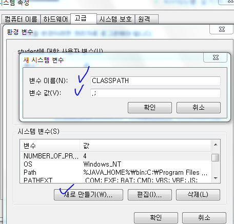

# 파이썬을 활용한 머신러닝 15일차(자연어처리(NLP), konlpy설치방법★)

#### 

## 1. 설치 및 환경구축

> 설치 목록
>
> - JDK (Java SE Downloads)
> - JAVA_HOME 설정
> - NLP Package 설치 
>   \- JPype 설치 
>   \- KoNLPy 설치 
>   \- Word Cloud 설치


### (1) konlpy(한글 자연어 처리 라이브러리) 설치

#### 1) 설치 및 오류

- ! pip install konlpy로 설치
  - 높은 확률로 설치가 안됨!
  - 이를 위해서는 안내되어 있는대로 링크 연결
    - 높은 확률로 연결된 링크가 안될 수 있음 ㅋㅋ
- 위 설치 오류를 해결하기 위해 https://www.microsoft.com/ko-kr/download/confirmation.aspx?id=48159 으로 연결하여 다운로드
  - 다운로드 후 설치
  - 만약에 설치가 안된다면, 윈도우 업데이트 후 설치해볼 것
  - jupyter가 켜져있다면 종료 후 재시작
- 그래도 안됨
- https://www.scivision.co/python-windows-visual-c++-14-required/ 에 접속 
  - 사실 이방법은 안해도 될 것 같긴한데 설명은 한다. (너무 많은 용량을 필요로 함)
  - Microsoft [Build Tools for Visual Studio 2017](https://visualstudio.microsoft.com/thank-you-downloading-visual-studio/?sku=BuildTools&rel=15). 를 설치
  - 실행 후 상단 3개 항목 설치(엄청난 용량임)


#### 2) 따로 내가 찾아낸 방법

- ! pip install konlpy시 오류가 `.whl is not supported wheel on this platform`라는 문제가 생김
  - konlpy를 설치하기 위해서는 JPype wheel이 설치되어야하는데(이미 설치되어 있을 수 있음) 해당 버전이 안맞는 문제가 생기는듯
- 문제를 해결하는 방법은 http://redcarrot.tistory.com/213 를 참고함
- whl 문제를 해결하기 위한 방법을 찾아가자
  - http://konlpy.org/ko/v0.5.0/install/ => 4번의 Jpype 링크를 따라간다
    - https://www.lfd.uci.edu/~gohlke/pythonlibs/#jpype
  - [JPype1‑0.6.3‑cp36‑cp36m‑win_amd64.whl](javascript:;) 를 다운받는다.
    - cp36은 Python의 3.6version을 의미하고 win amd64는 윈도우 64bit 를 의미한다.
    - 만약 Python 버전이나 윈도우 버전이 다르다면 그거에 맞게 다운
    - ★ 특히, Anaconda는 3.6version을 사용하고 있으므로 Anaconda에 맞는 파이썬 버전을 사용할 것! 3.7버전보다는 3.6버전 추천!
    - 추가) conda install -c conda-forge jpype1 이라는 명령어로도 가능하다고는 함(해보진 않음)
  - Anaconda prompt 를 실행해서 다운 받은 파일을 실행시킨다
    - pip install Jpype1-0.6.3~~~amd64.whl
  - 설치가 완료되면 ! pip install konlpy 으로 설치한다.
  - 설치완료!
  - pip list로 확인해보면 konlpy, JPype 모두 설치되어 있는 것을 확인할 수 있다.
- ★★ 1) 에 있는 `위 설치 오류를 해결하기 위해 https://www.microsoft.com/ko-kr/download/confirmation.aspx?id=48159 으로 연결하여 다운로드` 는 꼭 해야한다!


#### 3) JAVA 설치

- 위의 konlpy 설치가 완료되었다면 JAVA 설치하면 됨. 환경변수 JAVA_HOME까지 등록해주기!
- PATH도 등록해주긔
- CLASSPATH 라는 것도 등록해줄것임
  - 


## 2. konlpy 사용해보기


```python
! pip install konlpy
```

```
Requirement already satisfied: konlpy in c:\python\anaconda3-52\lib\site-packages (0.5.1)
Requirement already satisfied: JPype1>=0.5.7 in c:\python\anaconda3-52\lib\site-packages (from konlpy) (0.6.3)
```


```python
from konlpy.tag import Kkma
kkma = Kkma()
```

```python
kkma.sentences('한국어 분석을 시작합니다 재미있어요~~') # 문장별 분석
```


```
['한국어 분석을 시작합니다', '재미있어요~~']
```


```python
kkma.nouns('한국어 분석을 시작합니다 재미있어요~~')
```


```
['한국어', '분석']
```


```python
kkma.pos('한국어 분석을 시작합니다 재미있어요~~')
```


```
[('한국어', 'NNG'),
 ('분석', 'NNG'),
 ('을', 'JKO'),
 ('시작하', 'VV'),
 ('ㅂ니다', 'EFN'),
 ('재미있', 'VA'),
 ('어요', 'EFN'),
 ('~~', 'SW')]
```


```python
from konlpy.tag import Hannanum # kkma보다 조금 더 정확성이 있음
hannanum = Hannanum()
```

```python
hannanum.nouns('한국어 분석을 시작합니다 재미있어요~~')
```


```
['한국어', '분석', '시작']
```


```python
hannanum.morphs('한국어 분석을 시작합니다 재미있어요~~')
```


```
['한국어', '분석', '을', '시작', '하', 'ㅂ니다', '재미있', '어요', '~~']
```


```python
hannanum.pos('한국어 분석을 시작합니다 재미있어요~~')
```


```
[('한국어', 'N'),
 ('분석', 'N'),
 ('을', 'J'),
 ('시작', 'N'),
 ('하', 'X'),
 ('ㅂ니다', 'E'),
 ('재미있', 'P'),
 ('어요', 'E'),
 ('~~', 'S')]
```


```python
from konlpy.tag import Twitter
t = Twitter()
```

```
C:\Python\Anaconda3-52\lib\site-packages\konlpy\tag\_okt.py:16: UserWarning: "Twitter" has changed to "Okt" since KoNLPy v0.4.5.
  warn('"Twitter" has changed to "Okt" since KoNLPy v0.4.5.')
```


```python
t.nouns('한국어 분석을 시작합니다 재미있어요~~')
```


```
['한국어', '분석', '시작']
```


```python
t.morphs('한국어 분석을 시작합니다 재미있어요~~')
```


```
['한국어', '분석', '을', '시작', '합니다', '재미있어요', '~~']
```


```python
t.pos('한국어 분석을 시작합니다 재미있어요~~')
```


```
[('한국어', 'Noun'),
 ('분석', 'Noun'),
 ('을', 'Josa'),
 ('시작', 'Noun'),
 ('합니다', 'Verb'),
 ('재미있어요', 'Adjective'),
 ('~~', 'Punctuation')]
```


```python
t.pos('동해물과 백두산이 마르고 닳도록 하느님이 보우하사 우리나라 만세 무궁화 삼천리 화려 강산 대한사람 대한으로 길이 보전하세')
```


```
[('동', 'Modifier'),
 ('해물', 'Noun'),
 ('과', 'Josa'),
 ('백두산', 'Noun'),
 ('이', 'Josa'),
 ('마르고', 'Noun'),
 ('닳도록', 'Verb'),
 ('하느님', 'Noun'),
 ('이', 'Josa'),
 ('보우', 'Noun'),
 ('하사', 'Noun'),
 ('우리나라', 'Noun'),
 ('만세', 'Noun'),
 ('무궁화', 'Noun'),
 ('삼천리', 'Noun'),
 ('화려', 'Noun'),
 ('강산', 'Noun'),
 ('대한', 'Noun'),
 ('사람', 'Noun'),
 ('대한', 'Noun'),
 ('으로', 'Josa'),
 ('길이', 'Noun'),
 ('보전', 'Noun'),
 ('하세', 'Verb')]
```


```python
hannanum.pos('동해물과 백두산이 마르고 닳도록 하느님이 보우하사 우리나라 만세 무궁화 삼천리 화려 강산 대한사람 대한으로 길이 보전하세')
```


```
[('동해물', 'N'),
 ('과', 'J'),
 ('백두산', 'N'),
 ('이', 'J'),
 ('마르', 'P'),
 ('고', 'E'),
 ('닳', 'P'),
 ('도록', 'E'),
 ('하느님', 'N'),
 ('이', 'J'),
 ('보우하사', 'N'),
 ('우리나라', 'N'),
 ('만세', 'N'),
 ('무궁화', 'N'),
 ('삼천리', 'N'),
 ('화', 'N'),
 ('이', 'J'),
 ('려', 'E'),
 ('강산', 'N'),
 ('대한사람', 'N'),
 ('대한', 'N'),
 ('으로', 'J'),
 ('길', 'N'),
 ('이', 'J'),
 ('보전하세', 'N')]
```


```python
from konlpy.corpus import kolaw # 헌법을 다운받을 수 있음
from konlpy.utils import concordance  # 단어가 일치하는 것을 찾아줌
```

```python
constitution = kolaw.open('constitution.txt').read()
```

```python
print(constitution)
```

```
대한민국헌법

유구한 역사와 전통에 빛나는 우리 대한국민은 3·1운동으로 건립된 대한민국임시정부의 법통과 불의에 항거한 4·19민주이념을 계승하고, 조국의 민주개혁과 평화적 통일의 사명에 입각하여 정의·인도와 동포애로써 민족의 단결을 공고히 하고, 모든 사회적 폐습과 불의를 타파하며, 자율과 조화를 바탕으로 자유민주적 기본질서를 더욱 확고히 하여 정치·경제·사회·문화의 모든 영역에 있어서 각인의 기회를 균등히 하고, 능력을 최고도로 발휘하게 하며, 자유와 권리에 따르는 책임과 의무를 완수하게 하여, 안으로는 국민생활의 균등한 향상을 기하고 밖으로는 항구적인 세계평화와 인류공영에 이바지함으로써 우리들과 우리들의 자손의 안전과 자유와 행복을 영원히 확보할 것을 다짐하면서 1948년 7월 12일에 제정되고 8차에 걸쳐 개정된 헌법을 이제 국회의 의결을 거쳐 국민투표에 의하여 개정한다.

       제1장 총강
  제1조 ① 대한민국은 민주공화국이다.
②대한민국의 주권은 국민에게 있고, 모든 권력은 국민으로부터 나온다.
  제2조 ① 대한민국의 국민이 되는 요건은 법률로 정한다.
②국가는 법률이 정하는 바에 의하여 재외국민을 보호할 의무를 진다.
  제3조 대한민국의 영토는 한반도와 그 부속도서로 한다.
  제4조 대한민국은 통일을 지향하며, 자유민주적 기본질서에 입각한 평화적 통일 정책을 수립하고 이를 추진한다.
  제5조 ① 대한민국은 국제평화의 유지에 노력하고 침략적 전쟁을 부인한다.
②국군은 국가의 안전보장과 국토방위의 신성한 의무를 수행함을 사명으로 하며, 그 정치적 중립성은 준수된다.
  제6조 ① 헌법에 의하여 체결·공포된 조약과 일반적으로 승인된 국제법규는 국내법과 같은 효력을 가진다.
②외국인은 국제법과 조약이 정하는 바에 의하여 그 지위가 보장된다.
  제7조 ① 공무원은 국민전체에 대한 봉사자이며, 국민에 대하여 책임을 진다.
②공무원의 신분과 정치적 중립성은 법률이 정하는 바에 의하여 보장된다.
  제8조 ① 정당의 설립은 자유이며, 복수정당제는 보장된다.
②정당은 그 목적·조직과 활동이 민주적이어야 하며, 국민의 정치적 의사형성에 참여하는데 필요한 조직을 가져야 한다.
③정당은 법률이 정하는 바에 의하여 국가의 보호를 받으며, 국가는 법률이 정하는 바에 의하여 정당운영에 필요한 자금을 보조할 수 있다.
④정당의 목적이나 활동이 민주적 기본질서에 위배될 때에는 정부는 헌법재판소에 그 해산을 제소할 수 있고, 정당은 헌법재판소의 심판에 의하여 해산된다.
  제9조 국가는 전통문화의 계승·발전과 민족문화의 창달에 노력하여야 한다.

       제2장 국민의 권리와 의무
  제10조 모든 국민은 인간으로서의 존엄과 가치를 가지며, 행복을 추구할 권리를 가진다. 국가는 개인이 가지는 불가침의 기본적 인권을 확인하고 이를 보장할 의무를 진다.
  제11조 ① 모든 국민은 법 앞에 평등하다. 누구든지 성별·종교 또는 사회적 신분에 의하여 정치적·경제적·사회적·문화적 생활의 모든 영역에 있어서 차별을 받지 아니한다.
②사회적 특수계급의 제도는 인정되지 아니하며, 어떠한 형태로도 이를 창설할 수 없다.
③훈장등의 영전은 이를 받은 자에게만 효력이 있고, 어떠한 특권도 이에 따르지 아니한다.
  제12조 ① 모든 국민은 신체의 자유를 가진다. 누구든지 법률에 의하지 아니하고는 체포·구속·압수·수색 또는 심문을 받지 아니하며, 법률과 적법한 절차에 의하지 아니하고는 처벌·보안처분 또는 강제노역을 받지 아니한다.
②모든 국민은 고문을 받지 아니하며, 형사상 자기에게 불리한 진술을 강요당하지 아니한다.
③체포·구속·압수 또는 수색을 할 때에는 적법한 절차에 따라 검사의 신청에 의하여 법관이 발부한 영장을 제시하여야 한다. 다만, 현행범인인 경우와 장기 3년 이상의 형에 해당하는 죄를 범하고 도피 또는 증거인멸의 염려가 있을 때에는 사후에 영장을 청구할 수 있다.
④누구든지 체포 또는 구속을 당한 때에는 즉시 변호인의 조력을 받을 권리를 가진다. 다만, 형사피고인이 스스로 변호인을 구할 수 없을 때에는 법률이 정하는 바에 의하여 국가가 변호인을 붙인다.
⑤누구든지 체포 또는 구속의 이유와 변호인의 조력을 받을 권리가 있음을 고지받지 아니하고는 체포 또는 구속을 당하지 아니한다. 체포 또는 구속을 당한 자의 가족등 법률이 정하는 자에게는 그 이유와 일시·장소가 지체없이 통지되어야 한다.
⑥누구든지 체포 또는 구속을 당한 때에는 적부의 심사를 법원에 청구할 권리를 가진다.
⑦피고인의 자백이 고문·폭행·협박·구속의 부당한 장기화 또는 기망 기타의 방법에 의하여 자의로 진술된 것이 아니라고 인정될 때 또는 정식재판에 있어서 피고인의 자백이 그에게 불리한 유일한 증거일 때에는 이를 유죄의 증거로 삼거나 이를 이유로 처벌할 수 없다.
  제13조 ① 모든 국민은 행위시의 법률에 의하여 범죄를 구성하지 아니하는 행위로 소추되지 아니하며, 동일한 범죄에 대하여 거듭 처벌받지 아니한다.
②모든 국민은 소급입법에 의하여 참정권의 제한을 받거나 재산권을 박탈당하지 아니한다.
③모든 국민은 자기의 행위가 아닌 친족의 행위로 인하여 불이익한 처우를 받지 아니한다.
  제14조 모든 국민은 거주·이전의 자유를 가진다.
  제15조 모든 국민은 직업선택의 자유를 가진다.
  제16조 모든 국민은 주거의 자유를 침해받지 아니한다. 주거에 대한 압수나 수색을 할 때에는 검사의 신청에 의하여 법관이 발부한 영장을 제시하여야 한다.
  제17조 모든 국민은 사생활의 비밀과 자유를 침해받지 아니한다.
  제18조 모든 국민은 통신의 비밀을 침해받지 아니한다.
  제19조 모든 국민은 양심의 자유를 가진다.
  제20조 ① 모든 국민은 종교의 자유를 가진다.
②국교는 인정되지 아니하며, 종교와 정치는 분리된다.
  제21조 ① 모든 국민은 언론·출판의 자유와 집회·결사의 자유를 가진다.
②언론·출판에 대한 허가나 검열과 집회·결사에 대한 허가는 인정되지 아니한다.
③통신·방송의 시설기준과 신문의 기능을 보장하기 위하여 필요한 사항은 법률로 정한다.
④언론·출판은 타인의 명예나 권리 또는 공중도덕이나 사회윤리를 침해하여서는 아니된다. 언론·출판이 타인의 명예나 권리를 침해한 때에는 피해자는 이에 대한 피해의 배상을 청구할 수 있다.
  제22조 ① 모든 국민은 학문과 예술의 자유를 가진다.
②저작자·발명가·과학기술자와 예술가의 권리는 법률로써 보호한다.
  제23조 ① 모든 국민의 재산권은 보장된다. 그 내용과 한계는 법률로 정한다.
②재산권의 행사는 공공복리에 적합하도록 하여야 한다.
③공공필요에 의한 재산권의 수용·사용 또는 제한 및 그에 대한 보상은 법률로써 하되, 정당한 보상을 지급하여야 한다.
  제24조 모든 국민은 법률이 정하는 바에 의하여 선거권을 가진다.
  제25조 모든 국민은 법률이 정하는 바에 의하여 공무담임권을 가진다.
  제26조 ① 모든 국민은 법률이 정하는 바에 의하여 국가기관에 문서로 청원할 권리를 가진다.
②국가는 청원에 대하여 심사할 의무를 진다.
  제27조 ① 모든 국민은 헌법과 법률이 정한 법관에 의하여 법률에 의한 재판을 받을 권리를 가진다.
②군인 또는 군무원이 아닌 국민은 대한민국의 영역안에서는 중대한 군사상 기밀·초병·초소·유독음식물공급·포로·군용물에 관한 죄중 법률이 정한 경우와 비상계엄이 선포된 경우를 제외하고는 군사법원의 재판을 받지 아니한다.
③모든 국민은 신속한 재판을 받을 권리를 가진다. 형사피고인은 상당한 이유가 없는 한 지체없이 공개재판을 받을 권리를 가진다.
④형사피고인은 유죄의 판결이 확정될 때까지는 무죄로 추정된다.
⑤형사피해자는 법률이 정하는 바에 의하여 당해 사건의 재판절차에서 진술할 수 있다.
  제28조 형사피의자 또는 형사피고인으로서 구금되었던 자가 법률이 정하는 불기소처분을 받거나 무죄판결을 받은 때에는 법률이 정하는 바에 의하여 국가에 정당한 보상을 청구할 수 있다.
  제29조 ① 공무원의 직무상 불법행위로 손해를 받은 국민은 법률이 정하는 바에 의하여 국가 또는 공공단체에 정당한 배상을 청구할 수 있다. 이 경우 공무원 자신의 책임은 면제되지 아니한다.
②군인·군무원·경찰공무원 기타 법률이 정하는 자가 전투·훈련등 직무집행과 관련하여 받은 손해에 대하여는 법률이 정하는 보상외에 국가 또는 공공단체에 공무원의 직무상 불법행위로 인한 배상은 청구할 수 없다.
  제30조 타인의 범죄행위로 인하여 생명·신체에 대한 피해를 받은 국민은 법률이 정하는 바에 의하여 국가로부터 구조를 받을 수 있다.
  제31조 ① 모든 국민은 능력에 따라 균등하게 교육을 받을 권리를 가진다.
②모든 국민은 그 보호하는 자녀에게 적어도 초등교육과 법률이 정하는 교육을 받게 할 의무를 진다.
③의무교육은 무상으로 한다.
④교육의 자주성·전문성·정치적 중립성 및 대학의 자율성은 법률이 정하는 바에 의하여 보장된다.
⑤국가는 평생교육을 진흥하여야 한다.
⑥학교교육 및 평생교육을 포함한 교육제도와 그 운영, 교육재정 및 교원의 지위에 관한 기본적인 사항은 법률로 정한다.
  제32조 ① 모든 국민은 근로의 권리를 가진다. 국가는 사회적·경제적 방법으로 근로자의 고용의 증진과 적정임금의 보장에 노력하여야 하며, 법률이 정하는 바에 의하여 최저임금제를 시행하여야 한다.
②모든 국민은 근로의 의무를 진다. 국가는 근로의 의무의 내용과 조건을 민주주의원칙에 따라 법률로 정한다.
③근로조건의 기준은 인간의 존엄성을 보장하도록 법률로 정한다.
④여자의 근로는 특별한 보호를 받으며, 고용·임금 및 근로조건에 있어서 부당한 차별을 받지 아니한다.
⑤연소자의 근로는 특별한 보호를 받는다.
⑥국가유공자·상이군경 및 전몰군경의 유가족은 법률이 정하는 바에 의하여 우선적으로 근로의 기회를 부여받는다.
  제33조 ① 근로자는 근로조건의 향상을 위하여 자주적인 단결권·단체교섭권 및 단체행동권을 가진다.
②공무원인 근로자는 법률이 정하는 자에 한하여 단결권·단체교섭권 및 단체행동권을 가진다.
③법률이 정하는 주요방위산업체에 종사하는 근로자의 단체행동권은 법률이 정하는 바에 의하여 이를 제한하거나 인정하지 아니할 수 있다.
  제34조 ① 모든 국민은 인간다운 생활을 할 권리를 가진다.
②국가는 사회보장·사회복지의 증진에 노력할 의무를 진다.
③국가는 여자의 복지와 권익의 향상을 위하여 노력하여야 한다.
④국가는 노인과 청소년의 복지향상을 위한 정책을 실시할 의무를 진다.
⑤신체장애자 및 질병·노령 기타의 사유로 생활능력이 없는 국민은 법률이 정하는 바에 의하여 국가의 보호를 받는다.
⑥국가는 재해를 예방하고 그 위험으로부터 국민을 보호하기 위하여 노력하여야 한다.
  제35조 ① 모든 국민은 건강하고 쾌적한 환경에서 생활할 권리를 가지며, 국가와 국민은 환경보전을 위하여 노력하여야 한다.
②환경권의 내용과 행사에 관하여는 법률로 정한다.
③국가는 주택개발정책등을 통하여 모든 국민이 쾌적한 주거생활을 할 수 있도록 노력하여야 한다.
  제36조 ① 혼인과 가족생활은 개인의 존엄과 양성의 평등을 기초로 성립되고 유지되어야 하며, 국가는 이를 보장한다.
②국가는 모성의 보호를 위하여 노력하여야 한다.
③모든 국민은 보건에 관하여 국가의 보호를 받는다.
  제37조 ① 국민의 자유와 권리는 헌법에 열거되지 아니한 이유로 경시되지 아니한다.
②국민의 모든 자유와 권리는 국가안전보장·질서유지 또는 공공복리를 위하여 필요한 경우에 한하여 법률로써 제한할 수 있으며, 제한하는 경우에도 자유와 권리의 본질적인 내용을 침해할 수 없다.
  제38조 모든 국민은 법률이 정하는 바에 의하여 납세의 의무를 진다.
  제39조 ① 모든 국민은 법률이 정하는 바에 의하여 국방의 의무를 진다.
②누구든지 병역의무의 이행으로 인하여 불이익한 처우를 받지 아니한다.

       제3장 국회
  제40조 입법권은 국회에 속한다.
  제41조 ① 국회는 국민의 보통·평등·직접·비밀선거에 의하여 선출된 국회의원으로 구성한다.
②국회의원의 수는 법률로 정하되, 200인 이상으로 한다.
③국회의원의 선거구와 비례대표제 기타 선거에 관한 사항은 법률로 정한다.
  제42조 국회의원의 임기는 4년으로 한다.
  제43조 국회의원은 법률이 정하는 직을 겸할 수 없다.
  제44조 ① 국회의원은 현행범인인 경우를 제외하고는 회기중 국회의 동의없이 체포 또는 구금되지 아니한다.
②국회의원이 회기전에 체포 또는 구금된 때에는 현행범인이 아닌 한 국회의 요구가 있으면 회기중 석방된다.
  제45조 국회의원은 국회에서 직무상 행한 발언과 표결에 관하여 국회외에서 책임을 지지 아니한다.
  제46조 ① 국회의원은 청렴의 의무가 있다.
②국회의원은 국가이익을 우선하여 양심에 따라 직무를 행한다.
③국회의원은 그 지위를 남용하여 국가·공공단체 또는 기업체와의 계약이나 그 처분에 의하여 재산상의 권리·이익 또는 직위를 취득하거나 타인을 위하여 그 취득을 알선할 수 없다.
  제47조 ① 국회의 정기회는 법률이 정하는 바에 의하여 매년 1회 집회되며, 국회의 임시회는 대통령 또는 국회재적의원 4분의 1 이상의 요구에 의하여 집회된다.
②정기회의 회기는 100일을, 임시회의 회기는 30일을 초과할 수 없다.
③대통령이 임시회의 집회를 요구할 때에는 기간과 집회요구의 이유를 명시하여야 한다.
  제48조 국회는 의장 1인과 부의장 2인을 선출한다.
  제49조 국회는 헌법 또는 법률에 특별한 규정이 없는 한 재적의원 과반수의 출석과 출석의원 과반수의 찬성으로 의결한다. 가부동수인 때에는 부결된 것으로 본다.
  제50조 ① 국회의 회의는 공개한다. 다만, 출석의원 과반수의 찬성이 있거나 의장이 국가의 안전보장을 위하여 필요하다고 인정할 때에는 공개하지 아니할 수 있다.
②공개하지 아니한 회의내용의 공표에 관하여는 법률이 정하는 바에 의한다.
  제51조 국회에 제출된 법률안 기타의 의안은 회기중에 의결되지 못한 이유로 폐기되지 아니한다. 다만, 국회의원의 임기가 만료된 때에는 그러하지 아니하다.
  제52조 국회의원과 정부는 법률안을 제출할 수 있다.
  제53조 ① 국회에서 의결된 법률안은 정부에 이송되어 15일 이내에 대통령이 공포한다.
②법률안에 이의가 있을 때에는 대통령은 제1항의 기간내에 이의서를 붙여 국회로 환부하고, 그 재의를 요구할 수 있다. 국회의 폐회중에도 또한 같다.
③대통령은 법률안의 일부에 대하여 또는 법률안을 수정하여 재의를 요구할 수 없다.
④재의의 요구가 있을 때에는 국회는 재의에 붙이고, 재적의원과반수의 출석과 출석의원 3분의 2 이상의 찬성으로 전과 같은 의결을 하면 그 법률안은 법률로서 확정된다.
⑤대통령이 제1항의 기간내에 공포나 재의의 요구를 하지 아니한 때에도 그 법률안은 법률로서 확정된다.
⑥대통령은 제4항과 제5항의 규정에 의하여 확정된 법률을 지체없이 공포하여야 한다. 제5항에 의하여 법률이 확정된 후 또는 제4항에 의한 확정법률이 정부에 이송된 후 5일 이내에 대통령이 공포하지 아니할 때에는 국회의장이 이를 공포한다.
⑦법률은 특별한 규정이 없는 한 공포한 날로부터 20일을 경과함으로써 효력을 발생한다.
  제54조 ① 국회는 국가의 예산안을 심의·확정한다.
②정부는 회계연도마다 예산안을 편성하여 회계연도 개시 90일전까지 국회에 제출하고, 국회는 회계연도 개시 30일전까지 이를 의결하여야 한다.
③새로운 회계연도가 개시될 때까지 예산안이 의결되지 못한 때에는 정부는 국회에서 예산안이 의결될 때까지 다음의 목적을 위한 경비는 전년도 예산에 준하여 집행할 수 있다.
1. 헌법이나 법률에 의하여 설치된 기관 또는 시설의 유지·운영
2. 법률상 지출의무의 이행
3. 이미 예산으로 승인된 사업의 계속
  제55조 ① 한 회계연도를 넘어 계속하여 지출할 필요가 있을 때에는 정부는 연한을 정하여 계속비로서 국회의 의결을 얻어야 한다.
②예비비는 총액으로 국회의 의결을 얻어야 한다. 예비비의 지출은 차기국회의 승인을 얻어야 한다.
  제56조 정부는 예산에 변경을 가할 필요가 있을 때에는 추가경정예산안을 편성하여 국회에 제출할 수 있다.
  제57조 국회는 정부의 동의없이 정부가 제출한 지출예산 각항의 금액을 증가하거나 새 비목을 설치할 수 없다.
  제58조 국채를 모집하거나 예산외에 국가의 부담이 될 계약을 체결하려 할 때에는 정부는 미리 국회의 의결을 얻어야 한다.
  제59조 조세의 종목과 세율은 법률로 정한다.
  제60조 ① 국회는 상호원조 또는 안전보장에 관한 조약, 중요한 국제조직에 관한 조약, 우호통상항해조약, 주권의 제약에 관한 조약, 강화조약, 국가나 국민에게 중대한 재정적 부담을 지우는 조약 또는 입법사항에 관한 조약의 체결·비준에 대한 동의권을 가진다.
②국회는 선전포고, 국군의 외국에의 파견 또는 외국군대의 대한민국 영역안에서의 주류에 대한 동의권을 가진다.
  제61조 ① 국회는 국정을 감사하거나 특정한 국정사안에 대하여 조사할 수 있으며, 이에 필요한 서류의 제출 또는 증인의 출석과 증언이나 의견의 진술을 요구할 수 있다.
②국정감사 및 조사에 관한 절차 기타 필요한 사항은 법률로 정한다.
  제62조 ① 국무총리·국무위원 또는 정부위원은 국회나 그 위원회에 출석하여 국정처리상황을 보고하거나 의견을 진술하고 질문에 응답할 수 있다.
②국회나 그 위원회의 요구가 있을 때에는 국무총리·국무위원 또는 정부위원은 출석·답변하여야 하며, 국무총리 또는 국무위원이 출석요구를 받은 때에는 국무위원 또는 정부위원으로 하여금 출석·답변하게 할 수 있다.
  제63조 ① 국회는 국무총리 또는 국무위원의 해임을 대통령에게 건의할 수 있다.
②제1항의 해임건의는 국회재적의원 3분의 1 이상의 발의에 의하여 국회재적의원 과반수의 찬성이 있어야 한다.
  제64조 ① 국회는 법률에 저촉되지 아니하는 범위안에서 의사와 내부규율에 관한 규칙을 제정할 수 있다.
②국회는 의원의 자격을 심사하며, 의원을 징계할 수 있다.
③의원을 제명하려면 국회재적의원 3분의 2 이상의 찬성이 있어야 한다.
④제2항과 제3항의 처분에 대하여는 법원에 제소할 수 없다.
  제65조 ① 대통령·국무총리·국무위원·행정각부의 장·헌법재판소 재판관·법관·중앙선거관리위원회 위원·감사원장·감사위원 기타 법률이 정한 공무원이 그 직무집행에 있어서 헌법이나 법률을 위배한 때에는 국회는 탄핵의 소추를 의결할 수 있다.
②제1항의 탄핵소추는 국회재적의원 3분의 1 이상의 발의가 있어야 하며, 그 의결은 국회재적의원 과반수의 찬성이 있어야 한다. 다만, 대통령에 대한 탄핵소추는 국회재적의원 과반수의 발의와 국회재적의원 3분의 2 이상의 찬성이 있어야 한다.
③탄핵소추의 의결을 받은 자는 탄핵심판이 있을 때까지 그 권한행사가 정지된다.
④탄핵결정은 공직으로부터 파면함에 그친다. 그러나, 이에 의하여 민사상이나 형사상의 책임이 면제되지는 아니한다.

       제4장 정부
       제1절 대통령
  제66조 ① 대통령은 국가의 원수이며, 외국에 대하여 국가를 대표한다.
②대통령은 국가의 독립·영토의 보전·국가의 계속성과 헌법을 수호할 책무를 진다.
③대통령은 조국의 평화적 통일을 위한 성실한 의무를 진다.
④행정권은 대통령을 수반으로 하는 정부에 속한다.
  제67조 ① 대통령은 국민의 보통·평등·직접·비밀선거에 의하여 선출한다.
②제1항의 선거에 있어서 최고득표자가 2인 이상인 때에는 국회의 재적의원 과반수가 출석한 공개회의에서 다수표를 얻은 자를 당선자로 한다.
③대통령후보자가 1인일 때에는 그 득표수가 선거권자 총수의 3분의 1 이상이 아니면 대통령으로 당선될 수 없다.
④대통령으로 선거될 수 있는 자는 국회의원의 피선거권이 있고 선거일 현재 40세에 달하여야 한다.
⑤대통령의 선거에 관한 사항은 법률로 정한다.
  제68조 ① 대통령의 임기가 만료되는 때에는 임기만료 70일 내지 40일전에 후임자를 선거한다.
②대통령이 궐위된 때 또는 대통령 당선자가 사망하거나 판결 기타의 사유로 그 자격을 상실한 때에는 60일 이내에 후임자를 선거한다.
  제69조 대통령은 취임에 즈음하여 다음의 선서를 한다.
"나는 헌법을 준수하고 국가를 보위하며 조국의 평화적 통일과 국민의 자유와 복리의 증진 및 민족문화의 창달에 노력하여 대통령으로서의 직책을 성실히 수행할 것을 국민 앞에 엄숙히 선서합니다."
  제70조 대통령의 임기는 5년으로 하며, 중임할 수 없다.
  제71조 대통령이 궐위되거나 사고로 인하여 직무를 수행할 수 없을 때에는 국무총리, 법률이 정한 국무위원의 순서로 그 권한을 대행한다.
  제72조 대통령은 필요하다고 인정할 때에는 외교·국방·통일 기타 국가안위에 관한 중요정책을 국민투표에 붙일 수 있다.
  제73조 대통령은 조약을 체결·비준하고, 외교사절을 신임·접수 또는 파견하며, 선전포고와 강화를 한다.
  제74조 ① 대통령은 헌법과 법률이 정하는 바에 의하여 국군을 통수한다.
②국군의 조직과 편성은 법률로 정한다.
  제75조 대통령은 법률에서 구체적으로 범위를 정하여 위임받은 사항과 법률을 집행하기 위하여 필요한 사항에 관하여 대통령령을 발할 수 있다.
  제76조 ① 대통령은 내우·외환·천재·지변 또는 중대한 재정·경제상의 위기에 있어서 국가의 안전보장 또는 공공의 안녕질서를 유지하기 위하여 긴급한 조치가 필요하고 국회의 집회를 기다릴 여유가 없을 때에 한하여 최소한으로 필요한 재정·경제상의 처분을 하거나 이에 관하여 법률의 효력을 가지는 명령을 발할 수 있다.
②대통령은 국가의 안위에 관계되는 중대한 교전상태에 있어서 국가를 보위하기 위하여 긴급한 조치가 필요하고 국회의 집회가 불가능한 때에 한하여 법률의 효력을 가지는 명령을 발할 수 있다.
③대통령은 제1항과 제2항의 처분 또는 명령을 한 때에는 지체없이 국회에 보고하여 그 승인을 얻어야 한다.
④제3항의 승인을 얻지 못한 때에는 그 처분 또는 명령은 그때부터 효력을 상실한다. 이 경우 그 명령에 의하여 개정 또는 폐지되었던 법률은 그 명령이 승인을 얻지 못한 때부터 당연히 효력을 회복한다.
⑤대통령은 제3항과 제4항의 사유를 지체없이 공포하여야 한다.
  제77조 ① 대통령은 전시·사변 또는 이에 준하는 국가비상사태에 있어서 병력으로써 군사상의 필요에 응하거나 공공의 안녕질서를 유지할 필요가 있을 때에는 법률이 정하는 바에 의하여 계엄을 선포할 수 있다.
②계엄은 비상계엄과 경비계엄으로 한다.
③비상계엄이 선포된 때에는 법률이 정하는 바에 의하여 영장제도, 언론·출판·집회·결사의 자유, 정부나 법원의 권한에 관하여 특별한 조치를 할 수 있다.
④계엄을 선포한 때에는 대통령은 지체없이 국회에 통고하여야 한다.
⑤국회가 재적의원 과반수의 찬성으로 계엄의 해제를 요구한 때에는 대통령은 이를 해제하여야 한다.
  제78조 대통령은 헌법과 법률이 정하는 바에 의하여 공무원을 임면한다.
  제79조 ① 대통령은 법률이 정하는 바에 의하여 사면·감형 또는 복권을 명할 수 있다.
②일반사면을 명하려면 국회의 동의를 얻어야 한다.
③사면·감형 및 복권에 관한 사항은 법률로 정한다.
  제80조 대통령은 법률이 정하는 바에 의하여 훈장 기타의 영전을 수여한다.
  제81조 대통령은 국회에 출석하여 발언하거나 서한으로 의견을 표시할 수 있다.
  제82조 대통령의 국법상 행위는 문서로써 하며, 이 문서에는 국무총리와 관계 국무위원이 부서한다. 군사에 관한 것도 또한 같다.
  제83조 대통령은 국무총리·국무위원·행정각부의 장 기타 법률이 정하는 공사의 직을 겸할 수 없다.
  제84조 대통령은 내란 또는 외환의 죄를 범한 경우를 제외하고는 재직중 형사상의 소추를 받지 아니한다.
  제85조 전직대통령의 신분과 예우에 관하여는 법률로 정한다.
       제2절 행정부
       제1관 국무총리와 국무위원
  제86조 ① 국무총리는 국회의 동의를 얻어 대통령이 임명한다.
②국무총리는 대통령을 보좌하며, 행정에 관하여 대통령의 명을 받아 행정각부를 통할한다.
③군인은 현역을 면한 후가 아니면 국무총리로 임명될 수 없다.
  제87조 ① 국무위원은 국무총리의 제청으로 대통령이 임명한다.
②국무위원은 국정에 관하여 대통령을 보좌하며, 국무회의의 구성원으로서 국정을 심의한다.
③국무총리는 국무위원의 해임을 대통령에게 건의할 수 있다.
④군인은 현역을 면한 후가 아니면 국무위원으로 임명될 수 없다.
       제2관 국무회의
  제88조 ① 국무회의는 정부의 권한에 속하는 중요한 정책을 심의한다.
②국무회의는 대통령·국무총리와 15인 이상 30인 이하의 국무위원으로 구성한다.
③대통령은 국무회의의 의장이 되고, 국무총리는 부의장이 된다.
  제89조 다음 사항은 국무회의의 심의를 거쳐야 한다.
1. 국정의 기본계획과 정부의 일반정책
2. 선전·강화 기타 중요한 대외정책
3. 헌법개정안·국민투표안·조약안·법률안 및 대통령령안
4. 예산안·결산·국유재산처분의 기본계획·국가의 부담이 될 계약 기타 재정에 관한 중요사항
5. 대통령의 긴급명령·긴급재정경제처분 및 명령 또는 계엄과 그 해제
6. 군사에 관한 중요사항
7. 국회의 임시회 집회의 요구
8. 영전수여
9. 사면·감형과 복권
10. 행정각부간의 권한의 획정
11. 정부안의 권한의 위임 또는 배정에 관한 기본계획
12. 국정처리상황의 평가·분석
13. 행정각부의 중요한 정책의 수립과 조정
14. 정당해산의 제소
15. 정부에 제출 또는 회부된 정부의 정책에 관계되는 청원의 심사
16. 검찰총장·합동참모의장·각군참모총장·국립대학교총장·대사 기타 법률이 정한 공무원과 국영기업체관리자의 임명
17. 기타 대통령·국무총리 또는 국무위원이 제출한 사항
  제90조 ① 국정의 중요한 사항에 관한 대통령의 자문에 응하기 위하여 국가원로로 구성되는 국가원로자문회의를 둘 수 있다.
②국가원로자문회의의 의장은 직전대통령이 된다. 다만, 직전대통령이 없을 때에는 대통령이 지명한다.
③국가원로자문회의의 조직·직무범위 기타 필요한 사항은 법률로 정한다.
  제91조 ① 국가안전보장에 관련되는 대외정책·군사정책과 국내정책의 수립에 관하여 국무회의의 심의에 앞서 대통령의 자문에 응하기 위하여 국가안전보장회의를 둔다.
②국가안전보장회의는 대통령이 주재한다.
③국가안전보장회의의 조직·직무범위 기타 필요한 사항은 법률로 정한다.
  제92조 ① 평화통일정책의 수립에 관한 대통령의 자문에 응하기 위하여 민주평화통일자문회의를 둘 수 있다.
②민주평화통일자문회의의 조직·직무범위 기타 필요한 사항은 법률로 정한다.
  제93조 ① 국민경제의 발전을 위한 중요정책의 수립에 관하여 대통령의 자문에 응하기 위하여 국민경제자문회의를 둘 수 있다.
②국민경제자문회의의 조직·직무범위 기타 필요한 사항은 법률로 정한다.
       제3관 행정각부
  제94조 행정각부의 장은 국무위원 중에서 국무총리의 제청으로 대통령이 임명한다.
  제95조 국무총리 또는 행정각부의 장은 소관사무에 관하여 법률이나 대통령령의 위임 또는 직권으로 총리령 또는 부령을 발할 수 있다.
  제96조 행정각부의 설치·조직과 직무범위는 법률로 정한다.
       제4관 감사원
  제97조 국가의 세입·세출의 결산, 국가 및 법률이 정한 단체의 회계검사와 행정기관 및 공무원의 직무에 관한 감찰을 하기 위하여 대통령 소속하에 감사원을 둔다.
  제98조 ① 감사원은 원장을 포함한 5인 이상 11인 이하의 감사위원으로 구성한다.
②원장은 국회의 동의를 얻어 대통령이 임명하고, 그 임기는 4년으로 하며, 1차에 한하여 중임할 수 있다.
③감사위원은 원장의 제청으로 대통령이 임명하고, 그 임기는 4년으로 하며, 1차에 한하여 중임할 수 있다.
  제99조 감사원은 세입·세출의 결산을 매년 검사하여 대통령과 차년도국회에 그 결과를 보고하여야 한다.
  제100조 감사원의 조직·직무범위·감사위원의 자격·감사대상공무원의 범위 기타 필요한 사항은 법률로 정한다.

       제5장 법원
  제101조 ① 사법권은 법관으로 구성된 법원에 속한다.
②법원은 최고법원인 대법원과 각급법원으로 조직된다.
③법관의 자격은 법률로 정한다.
  제102조 ① 대법원에 부를 둘 수 있다.
②대법원에 대법관을 둔다. 다만, 법률이 정하는 바에 의하여 대법관이 아닌 법관을 둘 수 있다.
③대법원과 각급법원의 조직은 법률로 정한다.
  제103조 법관은 헌법과 법률에 의하여 그 양심에 따라 독립하여 심판한다.
  제104조 ① 대법원장은 국회의 동의를 얻어 대통령이 임명한다.
②대법관은 대법원장의 제청으로 국회의 동의를 얻어 대통령이 임명한다.
③대법원장과 대법관이 아닌 법관은 대법관회의의 동의를 얻어 대법원장이 임명한다.
  제105조 ① 대법원장의 임기는 6년으로 하며, 중임할 수 없다.
②대법관의 임기는 6년으로 하며, 법률이 정하는 바에 의하여 연임할 수 있다.
③대법원장과 대법관이 아닌 법관의 임기는 10년으로 하며, 법률이 정하는 바에 의하여 연임할 수 있다.
④법관의 정년은 법률로 정한다.
  제106조 ① 법관은 탄핵 또는 금고 이상의 형의 선고에 의하지 아니하고는 파면되지 아니하며, 징계처분에 의하지 아니하고는 정직·감봉 기타 불리한 처분을 받지 아니한다.
②법관이 중대한 심신상의 장해로 직무를 수행할 수 없을 때에는 법률이 정하는 바에 의하여 퇴직하게 할 수 있다.
  제107조 ① 법률이 헌법에 위반되는 여부가 재판의 전제가 된 경우에는 법원은 헌법재판소에 제청하여 그 심판에 의하여 재판한다.
②명령·규칙 또는 처분이 헌법이나 법률에 위반되는 여부가 재판의 전제가 된 경우에는 대법원은 이를 최종적으로 심사할 권한을 가진다.
③재판의 전심절차로서 행정심판을 할 수 있다. 행정심판의 절차는 법률로 정하되, 사법절차가 준용되어야 한다.
  제108조 대법원은 법률에 저촉되지 아니하는 범위안에서 소송에 관한 절차, 법원의 내부규율과 사무처리에 관한 규칙을 제정할 수 있다.
  제109조 재판의 심리와 판결은 공개한다. 다만, 심리는 국가의 안전보장 또는 안녕질서를 방해하거나 선량한 풍속을 해할 염려가 있을 때에는 법원의 결정으로 공개하지 아니할 수 있다.
  제110조 ① 군사재판을 관할하기 위하여 특별법원으로서 군사법원을 둘 수 있다.
②군사법원의 상고심은 대법원에서 관할한다.
③군사법원의 조직·권한 및 재판관의 자격은 법률로 정한다.
④비상계엄하의 군사재판은 군인·군무원의 범죄나 군사에 관한 간첩죄의 경우와 초병·초소·유독음식물공급·포로에 관한 죄중 법률이 정한 경우에 한하여 단심으로 할 수 있다. 다만, 사형을 선고한 경우에는 그러하지 아니하다.

       제6장 헌법재판소
  제111조 ① 헌법재판소는 다음 사항을 관장한다.
1. 법원의 제청에 의한 법률의 위헌여부 심판
2. 탄핵의 심판
3. 정당의 해산 심판
4. 국가기관 상호간, 국가기관과 지방자치단체간 및 지방자치단체 상호간의 권한쟁의에 관한 심판
5. 법률이 정하는 헌법소원에 관한 심판
②헌법재판소는 법관의 자격을 가진 9인의 재판관으로 구성하며, 재판관은 대통령이 임명한다.
③제2항의 재판관중 3인은 국회에서 선출하는 자를, 3인은 대법원장이 지명하는 자를 임명한다.
④헌법재판소의 장은 국회의 동의를 얻어 재판관중에서 대통령이 임명한다.
  제112조 ① 헌법재판소 재판관의 임기는 6년으로 하며, 법률이 정하는 바에 의하여 연임할 수 있다.
②헌법재판소 재판관은 정당에 가입하거나 정치에 관여할 수 없다.
③헌법재판소 재판관은 탄핵 또는 금고 이상의 형의 선고에 의하지 아니하고는 파면되지 아니한다.
  제113조 ① 헌법재판소에서 법률의 위헌결정, 탄핵의 결정, 정당해산의 결정 또는 헌법소원에 관한 인용결정을 할 때에는 재판관 6인 이상의 찬성이 있어야 한다.
②헌법재판소는 법률에 저촉되지 아니하는 범위안에서 심판에 관한 절차, 내부규율과 사무처리에 관한 규칙을 제정할 수 있다.
③헌법재판소의 조직과 운영 기타 필요한 사항은 법률로 정한다.

       제7장 선거관리
  제114조 ① 선거와 국민투표의 공정한 관리 및 정당에 관한 사무를 처리하기 위하여 선거관리위원회를 둔다.
②중앙선거관리위원회는 대통령이 임명하는 3인, 국회에서 선출하는 3인과 대법원장이 지명하는 3인의 위원으로 구성한다. 위원장은 위원중에서 호선한다.
③위원의 임기는 6년으로 한다.
④위원은 정당에 가입하거나 정치에 관여할 수 없다.
⑤위원은 탄핵 또는 금고 이상의 형의 선고에 의하지 아니하고는 파면되지 아니한다.
⑥중앙선거관리위원회는 법령의 범위안에서 선거관리·국민투표관리 또는 정당사무에 관한 규칙을 제정할 수 있으며, 법률에 저촉되지 아니하는 범위안에서 내부규율에 관한 규칙을 제정할 수 있다.
⑦각급 선거관리위원회의 조직·직무범위 기타 필요한 사항은 법률로 정한다.
  제115조 ① 각급 선거관리위원회는 선거인명부의 작성등 선거사무와 국민투표사무에 관하여 관계 행정기관에 필요한 지시를 할 수 있다.
②제1항의 지시를 받은 당해 행정기관은 이에 응하여야 한다.
  제116조 ① 선거운동은 각급 선거관리위원회의 관리하에 법률이 정하는 범위안에서 하되, 균등한 기회가 보장되어야 한다.
②선거에 관한 경비는 법률이 정하는 경우를 제외하고는 정당 또는 후보자에게 부담시킬 수 없다.

       제8장 지방자치
  제117조 ① 지방자치단체는 주민의 복리에 관한 사무를 처리하고 재산을 관리하며, 법령의 범위안에서 자치에 관한 규정을 제정할 수 있다.
②지방자치단체의 종류는 법률로 정한다.
  제118조 ① 지방자치단체에 의회를 둔다.
②지방의회의 조직·권한·의원선거와 지방자치단체의 장의 선임방법 기타 지방자치단체의 조직과 운영에 관한 사항은 법률로 정한다.

       제9장 경제
  제119조 ① 대한민국의 경제질서는 개인과 기업의 경제상의 자유와 창의를 존중함을 기본으로 한다.
②국가는 균형있는 국민경제의 성장 및 안정과 적정한 소득의 분배를 유지하고, 시장의 지배와 경제력의 남용을 방지하며, 경제주체간의 조화를 통한 경제의 민주화를 위하여 경제에 관한 규제와 조정을 할 수 있다.
  제120조 ① 광물 기타 중요한 지하자원·수산자원·수력과 경제상 이용할 수 있는 자연력은 법률이 정하는 바에 의하여 일정한 기간 그 채취·개발 또는 이용을 특허할 수 있다.
②국토와 자원은 국가의 보호를 받으며, 국가는 그 균형있는 개발과 이용을 위하여 필요한 계획을 수립한다.
  제121조 ① 국가는 농지에 관하여 경자유전의 원칙이 달성될 수 있도록 노력하여야 하며, 농지의 소작제도는 금지된다.
②농업생산성의 제고와 농지의 합리적인 이용을 위하거나 불가피한 사정으로 발생하는 농지의 임대차와 위탁경영은 법률이 정하는 바에 의하여 인정된다.
  제122조 국가는 국민 모두의 생산 및 생활의 기반이 되는 국토의 효율적이고 균형있는 이용·개발과 보전을 위하여 법률이 정하는 바에 의하여 그에 관한 필요한 제한과 의무를 과할 수 있다.
  제123조 ① 국가는 농업 및 어업을 보호·육성하기 위하여 농·어촌종합개발과 그 지원등 필요한 계획을 수립·시행하여야 한다.
②국가는 지역간의 균형있는 발전을 위하여 지역경제를 육성할 의무를 진다.
③국가는 중소기업을 보호·육성하여야 한다.
④국가는 농수산물의 수급균형과 유통구조의 개선에 노력하여 가격안정을 도모함으로써 농·어민의 이익을 보호한다.
⑤국가는 농·어민과 중소기업의 자조조직을 육성하여야 하며, 그 자율적 활동과 발전을 보장한다.
  제124조 국가는 건전한 소비행위를 계도하고 생산품의 품질향상을 촉구하기 위한 소비자보호운동을 법률이 정하는 바에 의하여 보장한다.
  제125조 국가는 대외무역을 육성하며, 이를 규제·조정할 수 있다.
  제126조 국방상 또는 국민경제상 긴절한 필요로 인하여 법률이 정하는 경우를 제외하고는, 사영기업을 국유 또는 공유로 이전하거나 그 경영을 통제 또는 관리할 수 없다.
  제127조 ① 국가는 과학기술의 혁신과 정보 및 인력의 개발을 통하여 국민경제의 발전에 노력하여야 한다.
②국가는 국가표준제도를 확립한다.
③대통령은 제1항의 목적을 달성하기 위하여 필요한 자문기구를 둘 수 있다.
       제10장 헌법개정
  제128조 ① 헌법개정은 국회재적의원 과반수 또는 대통령의 발의로 제안된다.
②대통령의 임기연장 또는 중임변경을 위한 헌법개정은 그 헌법개정 제안 당시의 대통령에 대하여는 효력이 없다.
  제129조 제안된 헌법개정안은 대통령이 20일 이상의 기간 이를 공고하여야 한다.
  제130조 ① 국회는 헌법개정안이 공고된 날로부터 60일 이내에 의결하여야 하며, 국회의 의결은 재적의원 3분의 2 이상의 찬성을 얻어야 한다.
②헌법개정안은 국회가 의결한 후 30일 이내에 국민투표에 붙여 국회의원선거권자 과반수의 투표와 투표자 과반수의 찬성을 얻어야 한다.
③헌법개정안이 제2항의 찬성을 얻은 때에는 헌법개정은 확정되며, 대통령은 즉시 이를 공포하여야 한다.

 펼침  부칙 <헌법 제10호, 1987.10.29.>  부칙보기

제1조 이 헌법은 1988년 2월 25일부터 시행한다. 다만, 이 헌법을 시행하기 위하여 필요한 법률의 제정·개정과 이 헌법에 의한 대통령 및 국회의원의 선거 기타 이 헌법시행에 관한 준비는 이 헌법시행 전에 할 수 있다.
제2조 ①이 헌법에 의한 최초의 대통령선거는 이 헌법시행일 40일 전까지 실시한다.
②이 헌법에 의한 최초의 대통령의 임기는 이 헌법시행일로부터 개시한다.
제3조 ①이 헌법에 의한 최초의 국회의원선거는 이 헌법공포일로부터 6월 이내에 실시하며, 이 헌법에 의하여 선출된 최초의 국회의원의 임기는 국회의원선거후 이 헌법에 의한 국회의 최초의 집회일로부터 개시한다.
②이 헌법공포 당시의 국회의원의 임기는 제1항에 의한 국회의 최초의 집회일 전일까지로 한다.
제4조 ①이 헌법시행 당시의 공무원과 정부가 임명한 기업체의 임원은 이 헌법에 의하여 임명된 것으로 본다. 다만, 이 헌법에 의하여 선임방법이나 임명권자가 변경된 공무원과 대법원장 및 감사원장은 이 헌법에 의하여 후임자가 선임될 때까지 그 직무를 행하며, 이 경우 전임자인 공무원의 임기는 후임자가 선임되는 전일까지로 한다.
②이 헌법시행 당시의 대법원장과 대법원판사가 아닌 법관은 제1항 단서의 규정에 불구하고 이 헌법에 의하여 임명된 것으로 본다.
③이 헌법중 공무원의 임기 또는 중임제한에 관한 규정은 이 헌법에 의하여 그 공무원이 최초로 선출 또는 임명된 때로부터 적용한다.
제5조 이 헌법시행 당시의 법령과 조약은 이 헌법에 위배되지 아니하는 한 그 효력을 지속한다.
제6조 이 헌법시행 당시에 이 헌법에 의하여 새로 설치될 기관의 권한에 속하는 직무를 행하고 있는 기관은 이 헌법에 의하여 새로운 기관이 설치될 때까지 존속하며 그 직무를 행한다.

```

​    

```python
concordance(u'민주', constitution, show=False) # 민주라는 단어가 어디있는지 확인
# 몇 번째 줄에 있는지 보여줌
```


```
[13, 16, 35, 99, 136, 219, 251, 1026, 2850, 2854, 3649]

```


```python
concordance(u'민주', constitution, show=True) # show = True로 바꾸면 내용도 함께 보여줌
```

```
13	법통과 불의에 항거한 4·19민주이념을 계승하고, 조국의
16	4·19민주이념을 계승하고, 조국의 민주개혁과 평화적 통일의
35	자율과 조화를 바탕으로 자유민주적 기본질서를 더욱
99	제1조 ① 대한민국은 민주공화국이다. ②대한민국의 주권은
136	대한민국은 통일을 지향하며, 자유민주적 기본질서에 입각한
219	그 목적·조직과 활동이 민주적이어야 하며, 국민의
251	④정당의 목적이나 활동이 민주적 기본질서에 위배될
1026	의무의 내용과 조건을 민주주의원칙에 따라 법률로
2850	자문에 응하기 위하여 민주평화통일자문회의를 둘 수
2854	둘 수 있다. ②민주평화통일자문회의의 조직·직무범위 기타
3649	조화를 통한 경제의 민주화를 위하여 경제에

```


```
[13, 16, 35, 99, 136, 219, 251, 1026, 2850, 2854, 3649]

```


```python
# 다시 꼬꼬마 사용해보기
```

```python
from konlpy.tag import Kkma
from konlpy.utils import pprint
```

```python
kkma = Kkma()
```

```python
text = u'네, 안녕하세요. 반갑습니다.'
```

```python
text_s = pprint(kkma.sentences(text)) 
# pprint 모듈은 인터프리터가 읽을 수 있는 방식으로 내장 객체나 사용자 정의 객체를 인쇄하는 것을 보다 정교하게 제어할 수 있게 합니다. 
# 결과가 한 줄보다 길면 "예쁜 프린터"가 줄 바꿈과 들여쓰기를 추가하여 데이터 구조를 보다 명확하게 나타냅니다:
text_s
```

```
['네, 안녕하세요.', '반갑습니다.']

```


```python
type(text_s)
```


```
NoneType

```


```python
text_s = kkma.sentences(text)
text_s
```


```
['네, 안녕하세요.', '반갑습니다.']

```


```python
type(text_s), text_s[0], text_s[-1]

```


```
(list, '네, 안녕하세요.', '반갑습니다.')

```


```python
kkma.tagset
```


```
{'EC': '연결 어미',
 'ECD': '의존적 연결 어미',
 'ECE': '대등 연결 어미',
 'ECS': '보조적 연결 어미',
 'EF': '종결 어미',
 'EFA': '청유형 종결 어미',
 'EFI': '감탄형 종결 어미',
 'EFN': '평서형 종결 어미',
 'EFO': '명령형 종결 어미',
 'EFQ': '의문형 종결 어미',
 'EFR': '존칭형 종결 어미',
 'EP': '선어말 어미',
 'EPH': '존칭 선어말 어미',
 'EPP': '공손 선어말 어미',
 'EPT': '시제 선어말 어미',
 'ET': '전성 어미',
 'ETD': '관형형 전성 어미',
 'ETN': '명사형 전성 어미',
 'IC': '감탄사',
 'JC': '접속 조사',
 'JK': '조사',
 'JKC': '보격 조사',
 'JKG': '관형격 조사',
 'JKI': '호격 조사',
 'JKM': '부사격 조사',
 'JKO': '목적격 조사',
 'JKQ': '인용격 조사',
 'JKS': '주격 조사',
 'JX': '보조사',
 'MA': '부사',
 'MAC': '접속 부사',
 'MAG': '일반 부사',
 'MD': '관형사',
 'MDN': '수 관형사',
 'MDT': '일반 관형사',
 'NN': '명사',
 'NNB': '일반 의존 명사',
 'NNG': '보통명사',
 'NNM': '단위 의존 명사',
 'NNP': '고유명사',
 'NP': '대명사',
 'NR': '수사',
 'OH': '한자',
 'OL': '외국어',
 'ON': '숫자',
 'SE': '줄임표',
 'SF': '마침표, 물음표, 느낌표',
 'SO': '붙임표(물결,숨김,빠짐)',
 'SP': '쉼표,가운뎃점,콜론,빗금',
 'SS': '따옴표,괄호표,줄표',
 'SW': '기타기호 (논리수학기호,화폐기호)',
 'UN': '명사추정범주',
 'VA': '형용사',
 'VC': '지정사',
 'VCN': "부정 지정사, 형용사 '아니다'",
 'VCP': "긍정 지정사, 서술격 조사 '이다'",
 'VV': '동사',
 'VX': '보조 용언',
 'VXA': '보조 형용사',
 'VXV': '보조 동사',
 'XP': '접두사',
 'XPN': '체언 접두사',
 'XPV': '용언 접두사',
 'XR': '어근',
 'XSA': '형용사 파생 접미사',
 'XSN': '명사파생 접미사',
 'XSV': '동사 파생 접미사'}

```


```python
text = '자연어처리는 재미있습니다. 그러나 한국어 분석은 쉽지않습니다.'
```

```python
# 명사 추출기, Noun extractor
text_nouns = kkma.nouns(text)
text_nouns
```


```
['자연어', '자연어처리', '처리', '한국어', '분석']

```


```python
# 형태소 해석, Parse phrase to morphemes
text_morphs = kkma.morphs(text)
text_morphs
```


```
['자연어',
 '처리',
 '는',
 '재미있',
 '습니다',
 '.',
 '그러',
 '나',
 '한국어',
 '분석',
 '은',
 '쉽',
 '지',
 '않',
 '습니다',
 '.']

```


```python
# 문장 검색, Sentence detection.
text_sentences = kkma.sentences(text)
text_sentences
```


```
['자연어처리는 재미있습니다.', '그러나 한국어 분석은 쉽지 않습니다.']

```


```python
len(text_sentences)
```


```
2

```


```python
# POS태그
pos_tagger = kkma.pos(text)
pos_tagger
```


```
[('자연어', 'NNG'),
 ('처리', 'NNG'),
 ('는', 'JX'),
 ('재미있', 'VA'),
 ('습니다', 'EFN'),
 ('.', 'SF'),
 ('그러', 'VV'),
 ('나', 'ECE'),
 ('한국어', 'NNG'),
 ('분석', 'NNG'),
 ('은', 'JX'),
 ('쉽', 'VA'),
 ('지', 'ECD'),
 ('않', 'VXV'),
 ('습니다', 'EFN'),
 ('.', 'SF')]

```


```python
pos_tagger_f = kkma.pos(text, flatten=False)
pos_tagger_f
```


```
[[('자연어', 'NNG'), ('처리', 'NNG'), ('는', 'JX')],
 [('재미있', 'VA'), ('습니다', 'EFN'), ('.', 'SF')],
 [('그러', 'VV'), ('나', 'ECE')],
 [('한국어', 'NNG')],
 [('분석', 'NNG'), ('은', 'JX')],
 [('쉽', 'VA'), ('지', 'ECD')],
 [('않', 'VXV'), ('습니다', 'EFN'), ('.', 'SF')]]

```


```python
len(pos_tagger), type(pos_tagger), type(pos_tagger[0])
```


```
(16, list, tuple)

```


```python
len(pos_tagger_f), type(pos_tagger_f), type(pos_tagger_f)
```


```
(7, list, list)

```


```python
text = '''
하늘아래 땅이있고 그위에 내가있으니
어디인들 이내몸 둘곳이야 없으리
하루해가 저문다고 울터이냐 그리도 내가 작더냐
별이 지는 저 산넘어 내 그리 쉬어 가리라
바람아 불어라 이내몸을 날려 주려마
하늘아 구름아 내몸 실어 떠나 가련다

해가지고 달이뜨고 그안에 내가숨쉬니
어디인들 이내몸 갈곳이야 없으리
작은것을 사랑하며 살터이다 친구를 사랑하리라
말이없는 저들녘에 내님을 그려보련다
바람아 불어라 이내몸을 날려주려마
하늘아 구름아 내몸실어 떠나가련다
바람아 불어라 이내몸을 날려주려마
하늘아 구름아 내몸실어 떠나가련다
'''
```

```python
text_sentences = kkma.sentences(text)
text_sentences
```


```
['하늘 아래 땅이 있고 그 위에 내가 있으니 어디인들 이내 몸 둘 곳이야 없으리',
 '하루해가 저문다고 울 터이냐',
 '그리도 내가 작더냐',
 '별이 지는 저 산 넘어 내 그리 쉬어 가리라 바람 아 불어라',
 '이내 몸을 날려 주려 마 하늘 아 구름 아 내 몸 실어 떠나 가련 다 해 가지고 달이 뜨고 그 안에 내가 숨쉬니 어디인들 이내 몸 갈 곳이야 없으리',
 '작은 것을 사랑하며 살 터이다',
 '친구를 사랑하리라',
 '말이 없는 저 들녘에 내 님을 그려 보련 다 바람 아 불어라',
 '이내 몸을 날려 주려 마 하늘 아 구름 아 내 몸 실어 떠나가련',
 '다 바람 아 불어라',
 '이내 몸을 날려 주려 마 하늘 아 구름 아 내 몸 실어 떠나가련',
 '다']

```


```python
len(text_sentences)
```


```
12

```


```python
# 헌법을 보통명사 단어만 추출해보자
```

```python
constitution  = kolaw.open('constitution.txt').read() # 헌법을 다시 읽어옴
```

```python
pos_const = kkma.pos(constitution)
```

```python
len(pos_const)
```


```
10053

```


```python
# 보통명사만 추출
pos_const_NNG = [ word[0] for word in pos_const if word[1]=='NNG']
len(pos_const_NNG)
```


```
3433

```


```python
pos_const_NNG.sort()
pos_const_NNG[:10], pos_const_NNG[-10:]
```


```
(['가격', '가부', '가입', '가입', '가족', '가족', '가치', '각급', '각급', '각급'],
 ['후보자', '후보자', '후임자', '후임자', '후임자', '후임자', '훈련', '훈장', '훈장', '히'])

```


```python
# 모든 명사 추출
NN_list = [ 'NN', 'NNB', 'NNG', 'NNM', 'NNP', 'NP' ]
pos_const_NN = [ word[0] for word in pos_const if word[1] in NN_list]
len(pos_const_NN)
```


```
3883

```


```python
pos_const_NN.sort()
pos_const_NN[:10], pos_const_NN[-10:]
```


```
(['가격', '가부', '가입', '가입', '가족', '가족', '가치', '각급', '각급', '각급'],
 ['후보자', '후보자', '후임자', '후임자', '후임자', '후임자', '훈련', '훈장', '훈장', '히'])

```


```python
len(set(pos_const_NN)) # 중복된 값 제거해보면 938개이다
```


```
938

```


```python
def getNounCnt(pos_list):
    noun_cnt = {}
    
    for noun in pos_list:
        if noun_cnt.get(noun):
            noun_cnt[noun] += 1
        else:
            noun_cnt[noun] = 1
    
    return noun_cnt
```

```python
noun_dict = getNounCnt(pos_const_NN)
len(noun_dict), noun_dict
```


```
(938,
 {'가격': 1,
  '가부': 1,
  '가입': 2,
  '가족': 2,
  '가치': 1,
  '각급': 3,
  '각부': 9,
  '각인': 1,
  '간': 4,
  '간의': 2,
  '간첩죄': 1,
  '감봉': 1,
  '감사': 7,
  '감사원': 5,
  '감사원장': 2,
  '감찰': 1,
  '감형': 3,
  '강': 1,
  '강요': 1,
  '강제': 1,
  '강화': 3,
  '개발': 6,
  '개선': 1,
  '개시': 5,
  '개인': 3,
  '개정': 9,
  '개정안': 5,
  '개혁': 1,
  '거주': 1,
  '건강': 1,
  '건립': 1,
  '건의': 3,
  '건전': 1,
  '검사': 4,
  '검열': 1,
  '검찰': 1,
  '것': 7,
  '결': 1,
  '결과': 1,
  '결사': 3,
  '결산': 3,
  '결정': 6,
  '경과': 1,
  '경비': 3,
  '경시': 1,
  '경영': 2,
  '경우': 17,
  '경자': 1,
  '경정': 1,
  '경제': 18,
  '경제력': 1,
  '경제적': 2,
  '경찰': 1,
  '계급': 1,
  '계도': 1,
  '계속': 3,
  '계속성': 1,
  '계승': 2,
  '계약': 3,
  '계엄': 8,
  '계획': 5,
  '고문': 2,
  '고용': 2,
  '고지': 1,
  '공개': 7,
  '공고': 2,
  '공공': 8,
  '공급': 2,
  '공무': 1,
  '공무원': 17,
  '공사': 1,
  '공영': 1,
  '공유': 1,
  '공정': 1,
  '공중': 1,
  '공직': 1,
  '공포': 11,
  '공표': 1,
  '공화국': 1,
  '과반': 1,
  '과반수': 10,
  '과학': 2,
  '관': 5,
  '관계': 4,
  '관련': 2,
  '관리': 13,
  '관리자': 1,
  '관여': 2,
  '관은': 1,
  '관의': 2,
  '관이': 1,
  '관장': 1,
  '관중': 2,
  '관할': 2,
  '광물': 1,
  '교섭권': 2,
  '교원': 1,
  '교육': 10,
  '교전': 1,
  '구금': 3,
  '구성': 8,
  '구성원': 1,
  '구속': 8,
  '구조': 2,
  '구체적': 1,
  '국': 21,
  '국가': 73,
  '국교': 1,
  '국군': 2,
  '국내': 2,
  '국립대': 1,
  '국무': 30,
  '국무총리': 13,
  '국민': 69,
  '국방': 2,
  '국방상': 1,
  '국법': 1,
  '국유': 2,
  '국정': 7,
  '국제': 3,
  '국제법': 1,
  '국채': 1,
  '국토': 3,
  '국회': 55,
  '국회의원': 18,
  '군': 3,
  '군경': 2,
  '군대': 1,
  '군무원': 3,
  '군사': 10,
  '군용물': 1,
  '군은': 1,
  '군의': 1,
  '군인': 5,
  '권력': 1,
  '권리': 21,
  '권익': 1,
  '권한': 11,
  '궐': 2,
  '규율': 4,
  '규정': 6,
  '규제': 2,
  '규칙': 6,
  '균등': 4,
  '균형': 5,
  '그': 3,
  '그때': 1,
  '근로': 9,
  '근로자': 4,
  '금고': 3,
  '금액': 1,
  '금지': 1,
  '급': 2,
  '기간': 5,
  '기관': 10,
  '기구': 1,
  '기능': 1,
  '기망': 1,
  '기밀': 1,
  '기반': 1,
  '기본': 8,
  '기본적': 1,
  '기술': 1,
  '기술자': 1,
  '기업': 2,
  '기업체': 2,
  '기준': 2,
  '기초': 1,
  '기타': 26,
  '기회': 4,
  '긴급': 4,
  '나': 2,
  '날': 2,
  '남용': 2,
  '납세': 1,
  '내': 2,
  '내란': 1,
  '내부': 4,
  '내용': 5,
  '내우': 1,
  '년': 12,
  '노력': 13,
  '노령': 1,
  '노역': 1,
  '노인과': 1,
  '농': 3,
  '농수산물': 1,
  '농업': 2,
  '농지': 4,
  '누구': 6,
  '능력': 3,
  '다수': 1,
  '다음': 4,
  '다짐': 1,
  '단결': 1,
  '단결권': 2,
  '단서': 1,
  '단심': 1,
  '단체': 16,
  '달성': 2,
  '담임': 1,
  '답변': 2,
  '당': 1,
  '당선': 2,
  '당선자': 1,
  '당시': 6,
  '당해': 1,
  '대': 1,
  '대법관': 7,
  '대법원': 9,
  '대법원장': 9,
  '대사': 1,
  '대상': 1,
  '대외': 3,
  '대통령': 84,
  '대통령령': 3,
  '대표': 1,
  '대표제': 1,
  '대학': 1,
  '대한민국': 11,
  '대행': 1,
  '도덕': 1,
  '도로': 1,
  '도모': 1,
  '도피': 1,
  '독립': 2,
  '동수': 1,
  '동의': 9,
  '동의권': 2,
  '동일': 1,
  '동포애': 1,
  '득표수': 1,
  '득표자': 1,
  '등': 6,
  '때': 55,
  '만료': 3,
  '면제': 2,
  '명': 1,
  '명령': 9,
  '명부': 1,
  '명시': 1,
  '명예': 2,
  '모두': 1,
  '모든': 21,
  '모성': 1,
  '모집': 1,
  '목적': 4,
  '무상': 1,
  '무역': 1,
  '무죄': 2,
  '문서': 3,
  '문화': 3,
  '문화적': 1,
  '민': 1,
  '민족': 3,
  '민주': 6,
  '민주적': 4,
  '민주화': 1,
  '바': 37,
  '바탕': 1,
  '박탈': 1,
  '밖': 1,
  '발명가': 1,
  '발부': 2,
  '발생': 2,
  '발언': 2,
  '발의': 4,
  '발전': 5,
  '발휘': 1,
  '방법': 4,
  '방송': 1,
  '방위': 2,
  '방지': 1,
  '방해': 1,
  '배상': 3,
  '배정': 1,
  '범위': 16,
  '범인': 3,
  '범죄': 4,
  '법': 6,
  '법과': 1,
  '법관': 11,
  '법규': 1,
  '법령': 3,
  '법률': 121,
  '법률안': 7,
  '법원': 17,
  '법통': 1,
  '변경': 3,
  '변호인': 4,
  '병력': 1,
  '병역': 1,
  '보건': 1,
  '보기': 1,
  '보상': 4,
  '보안': 1,
  '보위': 2,
  '보장': 24,
  '보전': 3,
  '보조': 1,
  '보좌': 2,
  '보통': 2,
  '보호': 15,
  '복': 1,
  '복권': 3,
  '복리': 4,
  '복수': 1,
  '복지': 2,
  '본질적': 1,
  '봉사자': 1,
  '부': 1,
  '부결': 1,
  '부담': 4,
  '부당': 2,
  '부령': 1,
  '부서': 1,
  '부속': 1,
  '부의': 1,
  '부의장': 1,
  '부인': 1,
  '부칙': 2,
  '분': 8,
  '분리': 1,
  '분배': 1,
  '분석': 1,
  '불': 2,
  '불가능': 1,
  '불가침': 1,
  '불기소': 1,
  '불리': 3,
  '불법': 2,
  '불의': 2,
  '비례': 1,
  '비목': 1,
  '비밀': 4,
  '비상': 2,
  '비상계엄': 2,
  '비상사태': 1,
  '비준': 2,
  '사': 1,
  '사건': 1,
  '사고': 1,
  '사망': 1,
  '사면': 3,
  '사명': 2,
  '사무': 8,
  '사법': 1,
  '사법권': 1,
  '사변': 1,
  '사상': 6,
  '사생활': 1,
  '사안': 1,
  '사업': 1,
  '사영': 1,
  '사용': 1,
  '사유': 3,
  '사절': 1,
  '사정': 1,
  '사항': 23,
  '사형': 1,
  '사회': 4,
  '사회적': 5,
  '사후': 1,
  '산상': 1,
  '산업체': 1,
  '상고심': 1,
  '상당': 1,
  '상실': 2,
  '상의': 4,
  '상이': 1,
  '상태': 1,
  '상호': 3,
  '상황': 2,
  '새': 1,
  '생명': 1,
  '생산': 1,
  '생산성': 1,
  '생산품': 1,
  '생활': 8,
  '서': 1,
  '서류': 1,
  '서한': 1,
  '석방': 1,
  '선거': 26,
  '선거구': 1,
  '선거권': 4,
  '선거인': 1,
  '선거일': 1,
  '선고': 4,
  '선량': 1,
  '선서': 2,
  '선임': 4,
  '선전': 3,
  '선출': 7,
  '선택': 1,
  '선포': 4,
  '설립': 1,
  '설치': 5,
  '성립': 1,
  '성별': 1,
  '성실': 1,
  '성장': 1,
  '세': 1,
  '세계': 1,
  '세율': 1,
  '세입': 2,
  '세출': 2,
  '소': 1,
  '소관': 1,
  '소급': 1,
  '소득': 1,
  '소비': 1,
  '소비자': 1,
  '소송': 1,
  '소원': 2,
  '소작': 1,
  '소추': 5,
  '손해': 2,
  '수': 88,
  '수가': 1,
  '수급': 1,
  '수력': 1,
  '수립': 7,
  '수반': 1,
  '수산': 1,
  '수색': 3,
  '수여': 2,
  '수용': 1,
  '수의': 1,
  '수정': 1,
  '수행': 4,
  '수호': 1,
  '순서': 1,
  '승인': 6,
  '시설': 2,
  '시장': 1,
  '시행': 12,
  '신문': 1,
  '신분': 3,
  '신성': 1,
  '신속': 1,
  '신임': 1,
  '신청': 2,
  '신체': 3,
  '실시': 3,
  '심리': 2,
  '심문': 1,
  '심사': 5,
  '심신': 1,
  '심의': 5,
  '심판': 12,
  '안': 15,
  '안녕': 3,
  '안위': 1,
  '안이': 1,
  '안전': 11,
  '안정': 2,
  '알선': 1,
  '압수': 3,
  '앞': 2,
  '양성': 1,
  '양심': 3,
  '어민': 2,
  '어업': 1,
  '어촌': 1,
  '언론': 5,
  '업체': 1,
  '여부': 3,
  '여유': 1,
  '여자': 2,
  '역사': 1,
  '연도': 5,
  '연소자': 1,
  '연임': 3,
  '연장': 1,
  '연한': 1,
  '열거': 1,
  '염려': 2,
  '영기': 1,
  '영역': 4,
  '영장': 4,
  '영전': 3,
  '영토': 2,
  '예방': 1,
  '예비비': 2,
  '예산': 5,
  '예산안': 5,
  '예산외': 1,
  '예술': 1,
  '예술가': 1,
  '예우': 1,
  '완수': 1,
  '외': 2,
  '외교': 2,
  '외국': 3,
  '외국인': 1,
  '외환': 2,
  '요건': 1,
  '요구': 13,
  '우리': 3,
  '우선': 1,
  '우선적': 1,
  '우호': 1,
  '운동': 3,
  '운영': 5,
  '원로': 4,
  '원수': 1,
  '원의': 1,
  '원인': 1,
  '원장': 3,
  '원조': 1,
  '원칙': 2,
  '월': 3,
  '위': 4,
  '위기': 1,
  '위반': 2,
  '위배': 3,
  '위원': 31,
  '위원장': 1,
  '위원회': 7,
  '위임': 3,
  '위탁': 1,
  '위헌': 2,
  '위험': 1,
  '유가족': 1,
  '유공자': 1,
  '유구': 1,
  '유일': 1,
  '유전': 1,
  '유죄': 2,
  '유지': 7,
  '유통': 1,
  '육성': 5,
  '윤리': 1,
  '음식물': 2,
  '응답': 1,
  '의견': 3,
  '의결': 16,
  '의무': 20,
  '의사': 2,
  '의안': 1,
  '의원': 23,
  '의장': 6,
  '의회': 2,
  '이': 12,
  '이내': 6,
  '이념': 1,
  '이바지': 1,
  '이상': 18,
  '이송': 2,
  '이용': 5,
  '이유': 7,
  '이의': 2,
  '이익': 5,
  '이전': 2,
  '이제': 1,
  '이하': 2,
  '이행': 2,
  '인': 9,
  '인간': 3,
  '인과': 2,
  '인권': 1,
  '인도': 1,
  '인력': 1,
  '인류': 1,
  '인멸': 1,
  '인용': 1,
  '인은': 2,
  '인의': 2,
  '인정': 8,
  '일': 19,
  '일로': 3,
  '일반': 2,
  '일반적': 1,
  '일부': 1,
  '일시': 1,
  '일정': 1,
  '임금': 2,
  '임금제': 1,
  '임기': 18,
  '임대차': 1,
  '임면': 1,
  '임명': 19,
  '임명권': 1,
  '임시': 3,
  '임시회': 2,
  '임원': 1,
  '입각': 2,
  '입법': 2,
  '입법권': 1,
  '있음': 1,
  '자': 9,
  '자가': 3,
  '자격': 6,
  '자금': 1,
  '자기': 2,
  '자녀': 1,
  '자로': 1,
  '자문': 12,
  '자백': 2,
  '자손': 1,
  '자신': 1,
  '자연력': 1,
  '자원': 3,
  '자유': 21,
  '자율': 2,
  '자율성': 1,
  '자의': 2,
  '자조': 1,
  '자주성': 1,
  '자주적': 1,
  '자치': 9,
  '작성': 1,
  '장': 15,
  '장기': 1,
  '장기화': 1,
  '장소': 1,
  '장애자': 1,
  '장의': 2,
  '장해': 1,
  '재산': 2,
  '재산권': 4,
  '재외': 1,
  '재의': 5,
  '재적': 14,
  '재정': 5,
  '재정적': 1,
  '재직': 1,
  '재판': 15,
  '재판관': 8,
  '재판소': 14,
  '재해': 1,
  '쟁의': 1,
  '저': 155,
  '저작자': 1,
  '저촉': 4,
  '적법': 2,
  '적부': 1,
  '적용': 1,
  '적인': 2,
  '적정': 2,
  '적합': 1,
  '전': 6,
  '전과': 1,
  '전년도': 1,
  '전몰': 1,
  '전문': 1,
  '전시': 1,
  '전심': 1,
  '전일': 2,
  '전임자': 1,
  '전쟁': 1,
  '전제': 2,
  '전직': 1,
  '전체': 1,
  '전통': 1,
  '전통문화': 1,
  '전투': 1,
  '절': 3,
  '절차': 9,
  '접수': 1,
  '정': 5,
  '정기': 1,
  '정년': 1,
  '정당': 14,
  '정당제': 1,
  '정보': 1,
  '정부': 23,
  '정부안': 1,
  '정식': 1,
  '정의': 2,
  '정지': 1,
  '정직': 1,
  '정책': 14,
  '정치': 4,
  '정치적': 5,
  '정한': 1,
  '제': 20,
  '제고': 1,
  '제도': 5,
  '제명': 1,
  '제소': 3,
  '제시': 2,
  '제안': 3,
  '제약': 1,
  '제외': 5,
  '제정': 8,
  '제청': 6,
  '제출': 8,
  '제한': 7,
  '조': 58,
  '조건': 4,
  '조국': 3,
  '조력': 2,
  '조사': 2,
  '조세': 1,
  '조약': 11,
  '조약안': 1,
  '조정': 3,
  '조직': 18,
  '조치': 3,
  '조화': 2,
  '존속': 1,
  '존엄': 2,
  '존엄성': 1,
  '존중': 1,
  '종교': 3,
  '종류': 1,
  '종목': 1,
  '종사': 1,
  '종합': 1,
  '죄': 4,
  '주거': 3,
  '주권': 2,
  '주류': 1,
  '주민': 1,
  '주요': 1,
  '주의': 1,
  '주재': 1,
  '주체': 1,
  '주택': 1,
  '준비': 1,
  '준수': 2,
  '준용': 1,
  '중': 10,
  '중대': 5,
  '중립성': 3,
  '중소기업': 2,
  '중앙': 3,
  '중요': 10,
  '중임': 6,
  '즈음': 1,
  '즉시': 1,
  '증가': 1,
  '증거': 3,
  '증언': 1,
  '증인': 1,
  '증진': 3,
  '지급': 1,
  '지명': 3,
  '지방': 9,
  '지배': 1,
  '지변': 1,
  '지속': 1,
  '지시': 2,
  '지역': 2,
  '지원': 1,
  '지위': 3,
  '지지': 1,
  '지체': 6,
  '지출': 4,
  '지하': 1,
  '지향': 2,
  '직': 2,
  '직권': 1,
  '직무': 19,
  '직업': 1,
  '직위': 1,
  '직전': 2,
  '직접': 2,
  '직책': 1,
  '진술': 5,
  '진흥': 1,
  '질문': 1,
  '질병': 1,
  '질서': 8,
  '집행': 4,
  '집회': 12,
  '징계': 2,
  '차': 3,
  '차기': 1,
  '차년': 1,
  '차별': 2,
  '찬성': 12,
  '참모': 2,
  '참여': 1,
  '참정권': 1,
  '창달': 2,
  '창설': 1,
  '창의': 1,
  '채취': 1,
  '책무': 1,
  '책임': 5,
  '처리': 6,
  '처벌': 3,
  '처분': 12,
  '처우': 2,
  '천재': 1,
  '청구': 6,
  '청렴': 1,
  '청소년': 1,
  '청원': 3,
  '체결': 4,
  '체포': 9,
  '초과': 1,
  '초등': 1,
  '초병': 2,
  '초소': 2,
  '촉구': 1,
  '총리': 6,
  '총리령': 1,
  '총수': 1,
  '총액': 1,
  '총장': 3,
  '최고': 3,
  '최소한': 1,
  '최저': 1,
  '최종적': 1,
  '최초': 7,
  '추': 1,
  '추가': 1,
  '추구': 1,
  '추정': 1,
  '추진': 1,
  '출석': 12,
  '출판': 5,
  '취득': 2,
  '취임': 1,
  '친족': 1,
  '침': 1,
  '침략': 1,
  '침해': 6,
  '타인': 4,
  '타파': 1,
  '탄핵': 11,
  '통고': 1,
  '통상': 1,
  '통수': 1,
  '통신': 2,
  '통일': 9,
  '통제': 1,
  '통지': 1,
  '통할': 1,
  '퇴직': 1,
  '투표': 8,
  '투표자': 1,
  '특권': 1,
  '특별': 6,
  '특수': 1,
  '특정': 1,
  '특허': 1,
  '파견': 2,
  '파면': 1,
  '판결': 4,
  '판사': 1,
  '편성': 3,
  '평가': 1,
  '평등': 4,
  '평생': 2,
  '평화': 5,
  '평화적': 4,
  '폐기': 1,
  '폐습': 1,
  '폐지': 1,
  '폐회': 1,
  '포고': 2,
  '포로': 2,
  '포함': 2,
  '폭행': 1,
  '표': 1,
  '표결': 1,
  '표시': 1,
  '표준': 1,
  '품질': 1,
  '풍속': 1,
  '피': 1,
  '피고인': 6,
  '피의자': 1,
  '피해': 2,
  '피해자': 2,
  '필요': 31,
  '하다': 2,
  '하의': 1,
  '학교': 2,
  '학문': 1,
  '한': 6,
  '한계': 1,
  '한반도': 1,
  '합동': 1,
  '합리': 1,
  '항': 22,
  '항거': 1,
  '항구적': 1,
  '항의': 1,
  '항해': 1,
  '해당': 1,
  '해산': 5,
  '해임': 3,
  '해제': 3,
  '행': 1,
  '행동권': 3,
  '행복': 2,
  '행사': 3,
  '행위': 8,
  '행위시': 1,
  '행정': 15,
  '행정권': 1,
  '행정부': 1,
  '향상': 4,
  '허': 1,
  '허가': 1,
  '헌법': 69,
  '혁신': 1,
  '현역': 2,
  '현재': 1,
  '현행': 3,
  '협박': 1,
  '형': 4,
  '형사': 6,
  '형성': 1,
  '형의': 3,
  '형태': 1,
  '호': 1,
  '호선': 1,
  '혼인': 1,
  '확립': 1,
  '확보': 1,
  '확인': 1,
  '확정': 8,
  '환경': 2,
  '환경권': 1,
  '환부': 1,
  '활동': 3,
  '회': 1,
  '회계': 6,
  '회기': 6,
  '회복': 1,
  '회부': 1,
  '회의': 42,
  '획정': 1,
  '효력': 9,
  '효율적': 1,
  '후': 6,
  '후보자': 2,
  '후임자': 4,
  '훈련': 1,
  '훈장': 2,
  '히': 1})

```


```python
from collections import Counter
```

```python
counter = Counter(pos_const)
counter.most_common(10)
```


```
[(('의', 'JKG'), 532),
 (('.', 'SF'), 359),
 (('하', 'XSV'), 350),
 (('에', 'JKM'), 328),
 (('ㄴ다', 'EFN'), 243),
 (('ㄴ', 'ETD'), 234),
 (('을', 'JKO'), 211),
 (('은', 'JX'), 182),
 (('는', 'JX'), 180),
 (('저', 'NP'), 155)]

```


```python
counter = Counter(noun_dict)
counter.most_common(10)
```


```
[('저', 155),
 ('법률', 121),
 ('수', 88),
 ('대통령', 84),
 ('국가', 73),
 ('국민', 69),
 ('헌법', 69),
 ('조', 58),
 ('국회', 55),
 ('때', 55)]

```


```python
from konlpy.tag import Hannanum
```

```python
hannanum = Hannanum()
```

```python
hannanum.tagset
```


```
{'E': '어미',
 'EC': '연결 어미',
 'EF': '종결 어미',
 'EP': '선어말어미',
 'ET': '전성 어미',
 'F': '외국어',
 'I': '독립언',
 'II': '감탄사',
 'J': '관계언',
 'JC': '격조사',
 'JP': '서술격 조사',
 'JX': '보조사',
 'M': '수식언',
 'MA': '부사',
 'MM': '관형사',
 'N': '체언',
 'NB': '의존명사',
 'NC': '보통명사',
 'NN': '수사',
 'NP': '대명사',
 'NQ': '고유명사',
 'P': '용언',
 'PA': '형용사',
 'PV': '동사',
 'PX': '보조 용언',
 'S': '기호',
 'X': '접사',
 'XP': '접두사',
 'XS': '접미사'}

```


```python
text = '자연어처리는 재미있습니다. 그러나 한국어 분석은 쉽지않습니다.'
```

```python
# 명사 추출기, Noun extractor
text_nouns = hannanum.nouns(text)
text_nouns
```


```
['자연어처리', '한국어', '분석']

```


```python
# 형태소 해석, Parse phrase to morphemes
text_morphs = hannanum.morphs(text)
text_morphs
```


```
['자연어처리',
 '는',
 '재미있',
 '습니다',
 '.',
 '그러나',
 '한국어',
 '분석',
 '은',
 '쉽',
 '지',
 '않',
 '습니다',
 '.']

```


```python
# 구문 분석, Phrase analyzer
text_analyze = hannanum.analyze(text)
text_analyze 
```


```
[[[('자연어처리', 'ncpa'), ('는', 'jxc')],
  [('자연어', 'ncn'), ('처리', 'ncpa'), ('는', 'jxc')]],
 [[('재미있', 'pvg'), ('습니다', 'ef')],
  [('재미', 'ncn'), ('있', 'xsmn'), ('습니다', 'ef')]],
 [[('.', 'sf')], [('.', 'sy')]],
 [],
 [[('그러나', 'maj')]],
 [[('한국어', 'ncn')]],
 [[('분석', 'ncpa'), ('은', 'jxc')], [('분석', 'ncpa'), ('은', 'ncn')]],
 [[('쉽', 'paa'), ('지', 'ecx'), ('않', 'px'), ('습니다', 'ef')]],
 [[('.', 'sf')], [('.', 'sy')]]]

```


```python
# POS tagger
text_pos = hannanum.pos(text)
text_pos
```


```
[('자연어처리', 'N'),
 ('는', 'J'),
 ('재미있', 'P'),
 ('습니다', 'E'),
 ('.', 'S'),
 ('그러나', 'M'),
 ('한국어', 'N'),
 ('분석', 'N'),
 ('은', 'J'),
 ('쉽', 'P'),
 ('지', 'E'),
 ('않', 'P'),
 ('습니다', 'E'),
 ('.', 'S')]

```


```python
text_pos_f = hannanum.pos(text, flatten=False)
text_pos_f
```


```
[[[('자연어처리', 'N'), ('는', 'J')]],
 [[('재미있', 'P'), ('습니다', 'E')]],
 [[('.', 'S')]],
 [],
 [[('그러나', 'M')]],
 [[('한국어', 'N')]],
 [[('분석', 'N'), ('은', 'J')]],
 [[('쉽', 'P'), ('지', 'E'), ('않', 'P'), ('습니다', 'E')]],
 [[('.', 'S')]]]

```


