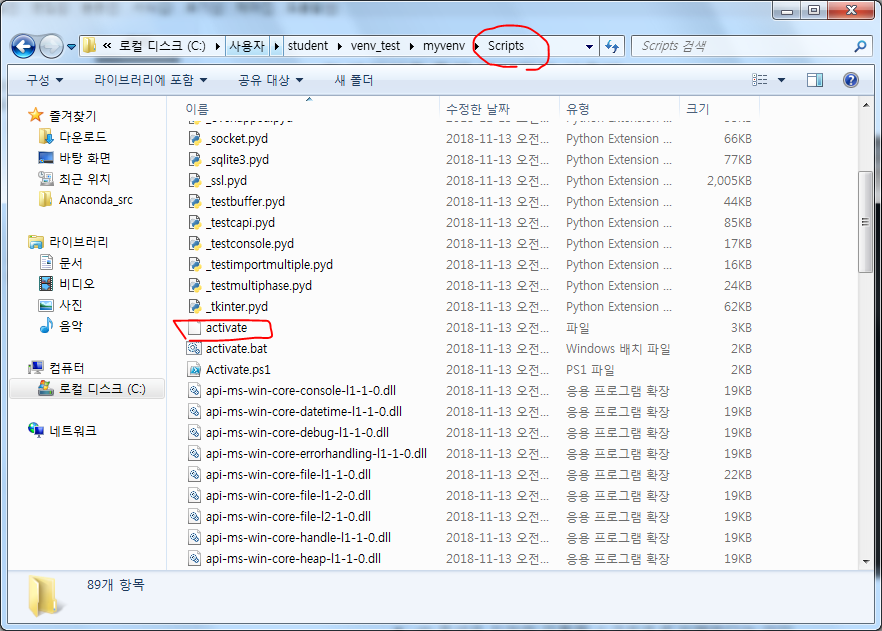

# 파이썬을 활용한 머신러닝 18일차(wget, 가상환경, 웹페이지 encoding, xml 분석, sqlite, 모듈화)


## 1. wget 설치 및 활용

### (1) wget이란?

- GNU Wget은 HTTP 통신 또는 FTP 통신을 사용해 서버에서 파일 또는 콘텐츠를 다운로드할 때 사용하는 소프트웨어(다운로더)


### (2) wget 설치

- https://eternallybored.org/misc/wget/ 에 접속
- [wget-1.19.4-win64.zip](https://eternallybored.org/misc/wget/releases/wget-1.19.4-win64.zip), [wget.exe](https://eternallybored.org/misc/wget/1.19.4/64/wget.exe) 최신버전 다운
- C:\Utils 에 다운받은 파일 압출 풀기
- 환경변수 지정(cmd에서 C:\Utils\wget-1.19.4-win64까지 들어가서 wget.exe를 실행시키기 번거로우므로)
  - 시스템 변수 - Path에 경로 C:\Utils\wget-1.19.4-win64 붙여넣기
  - ...C:\Program Files\dotnet\;C:\Utils\wget-1.19.4-win64;
- cmd를 켜고 wget --version 을 켜보면 잘 실행된다.


### (3) wget 활용

#### 1) wikibook 홈페이지의 파일 다운받아보기

- Anaconda Prompt 실행
- Anaconda_srd\download 폴더 생성
- download 폴더로 이동
- wget http://wikibook.co.kr/wikibook.png 실행
  - png파일이 다운받아짐
- wget http://wikibook.co.kr/ 하면 index.html 다운받아짐
- wget http://wikibook.co.kr/ -O wiki_home.html
  - -O를 사용하면 내가 원하는 파일명으로 적용하여 다운받아짐
  - 즉, index.html -> wiki_home.html 으로 이름 변경하여 다운
  - 만약 html파일을 키면은 css와 javascript, 사진 등이 적용이 안되서 원본과 다르게 보임
  - 일일히 html 내부에 http://wikibook.co.kr/ 을 앞에 붙여줘야함


## 2. 파이썬으로 시작하는 크롤링/스크레이핑

### (1) 가상환경

#### 1) 가상환경(venv)이란

- 최근 프로그래밍 언어는 가상 환경(Virtual Environment)이라고 하는, 런타임과 라이브러리를 환경에 따라 구분할 수 있는 기능을 제공
- 1대의 컴퓨터에서 2개의 서로 다른 프로그램 A와 B를 작성해야 한다고 하자. 2개의 프로그램은 X라는 라이브러리를 사용하지만 프로그램 A에는 라이브러리 X의 1.x 버전을, 프로그램 B에서는 라이브러리 X의 2.x 버전을 사용하게 되면 동작하지 않게 된다.
  - 파이썬은 하나의 환경에 같은 라이브러리의 여러 버전을 설치할 수 없다.
  - 이를 해결하기 위해 프로그램 A 전용 가상 환경에 X의 버전 1.x를 설치하고, 프로그램 B 전용 가상 환경에 X의 버전 2.x를 설치하면 서로 간섭 없이 개발가능

- 
  - (base)와 같이 ()안에 있는 것이 나만의 가상환경이라고 생각하면 된다.


#### 2) 파이썬을 통해 가상환경 사용법

- cmd를 통해 가상환경 만들어보기
- 
  - python -m venv myvenv으로 가상 환경을 생성한다.
    - -m 옵션은 지정한 모듈을 스크립트로 실행한다는 의미
    - 스크립트(Script)는 게임 프로그램(Program)에서 간단한 프로그래밍(Programming)을 위해 프로그램 언어(Program Language) 외의 간단한 언어로 작성한 명령어(Instruction)를 의미한다. 주로 보조적인 프로그래밍을 위해 사용한다.
    - 스크립트는 컴퓨터 프로세서나 컴파일러가 아닌 다른 프로그램에 의해 번역되고 수행되는 명령문의 집합
  - myvenv라는 디렉터리가 생성됨! 이제 이 이름이 가상 환경의 이름이 된다.

- 
  - 가상환경은 만들어진 myvenv 디렉토리 - 생성된 Scripts 디렉토리 - activate 파일을 통해 실행된다.
  - cmd창에서 이 위치로 이동해서 activate를 실행하자
  - 사용을 그만하고 싶다면 deactivate.bat 을 실행하자
- 이런 가상환경에서 python의 경로를 확인하면 myvenv/Scripts 디렉토리 내에서 실행하고 있음을 알 수 있다.

- 이렇게 새로운 가상환경에서는 파이썬 초기상태가 되므로 설치하고 싶은 모든 라이브러리를 다시 설치해야한다.
  - 

- 만약 가상환경 자체가 필요없어지면 해당 디렉터리를 아예 제거해버리면 된다.
- 만약에 일일히 설치하기 귀찮다고 하면 리눅스 명령어의 조합으로 실행시킬 수 있다.
  - pip freeze >> list.txt
  - cat list.txt
    - 설치된 pip library 목록이 txt 파일로 저장됨
  - pip install | cat list.txt ?? 암튼 이런방식으로 설치(놓침)


## 3. 웹페이지 추출하기

### (1) 문자 encoding 방식 이해하기

- 어렵게 생각할 것 없다. 웹페이지를 읽는데 utf-8인지, asci2인지, euc-kr 타입인지 정확하게 명시를 하지 않고 인코딩을 하면 깨져서 나온다. 이것을 어떻게 인코딩 타입을 맞추는지 살펴볼 것이다.
  - 1) HTTP 헤더에서 인코딩 방식 추출 에서는 HTTP 헤더에 지정되어 있는 인코딩 방식을 추출하는 함수를 사용해서 불러올것임
  - 2) meta를 참고해서 추출하기
    - 각 html에는 meta data를 주로 명시해주는거 알지?
    - 그 중 < meta charset="utf-8" > 를 파싱해서 utf-8을 가져와서 인코딩을 해주는 것임!


#### 1) HTTP 헤더에서 인코딩 방식 추출

#### encoding 방식을 직접 지정해서 추출하기

> **HTTP 헤더에서 인코딩 방식 추출**
>
> - text/html
> - text/html; charset=UTF-8
> - text/html; charset=EUC-KR

cf. 연관함수 : HTTPMessage.info().get_content_charset()


In [2]:

```python
import sys
from urllib.request import urlopen
```

In [3]:

- info().get_content_charset를 사용하면 인코딩 방식을 자동으로 찾게한다. 만약에 찾지못하면 failobj="utf-8"으로 따로 지정한다.

```python
f = urlopen('http://www.hanbit.co.kr/store/books/full_book_list.html')

# HTTP 헤더를 기반으로 인코딩 방식을 추출합니다
# (명시돼 있지 않을 경우 utf-8을 사용하게 합니다).
encoding = f.info().get_content_charset(failobj="utf-8")

# 인코딩 방식을 표준 오류에 출력합니다.
print('encoding:', encoding, file=sys.stderr)
```


```python
encoding: utf-8
```

In [4]:

```python
# 추출한 인코딩 방식으로 디코딩합니다.
text = f.read().decode(encoding)
# 웹 페이지의 내용을 표준 출력에 출력합니다.
text
#### 아래를 보면 한글이 아주 잘 출력된다!
```

Out[4]:

```python
'<!DOCTYPE html>\r\n<html lang="ko">\r\n<head>\r\n<!--[if lte IE 8]>\r\n<script>\r\n  location.replace(\'/support/explorer_upgrade.html\');\r\n</script>\r\n<![endif]-->\r\n<!-- Google Tag Manager -->\r\n<script>(function(w,d,s,l,i){w[l]=w[l]||[];w[l].push({\'gtm.start\':\r\nnew Date().getTime(),event:\'gtm.js\'});var f=d.getElementsByTa

...

</div>\r\n    <!-- //한빛 정보 -->\r\n  </div>\r\n  \r\n  <div class="copyright">&copy;1993-2018 Hanbit Publishing Network, Inc. All rights reserved.</div>\r\n</footer>\r\n<!-- //푸터 -->\r\n<div class="foot_download_btn"><a href="/support/supplement_list.html">자료실</a></div>\r\n\r\n<!-- 공통 JS 호출 -->\r\n<script type="text/javascript" src="/js/common.js"></script>\r\n<!-- //공통 JS 호출 -->\r\n\r\n</body>\r\n</html>\r\n'
```


#### 2) meta를 참고해서 추출하기

> **meta 태그에서 인코딩 방식 추출** 
> Content-Type 헤더의 값고 실제 사용되고 있는 인코딩 형식이 다를 수 있다. 
> 디코딩 처리때 **UnicodeDecodeError가 발생** 한다면 이러한 처리를 모방해서 구현하면 해결할 수 있다.
>
> - < meta charset="utf-8" >
> - < meta http-equiv="Content-Type" content="text/html; charset="EUC-KR" >

cf. 연관함수 : HTTPMessage.info().get_content_charset()


In [5]:

```python
import re
import sys
from urllib.request import urlopen
```

In [6]:

- 그냥 읽으면 byte형식으로 읽게된다. 아래 out[6]을 보면 byte 형식으로 표현된 것을 알 수 있다.

```python
f = urlopen('http://www.hanbit.co.kr/store/books/full_book_list.html')
# bytes 자료형의 응답 본문을 일단 변수에 저장합니다.
bytes_content = f.read()  

type(bytes_content), bytes_content[:2**10]
```

Out[6]:

```python
(bytes,
 b'<!DOCTYPE html>\r\n<html lang="ko">\r\n<head>\r\n<!--[if lte IE 8]>\r\n<script>\r\n  location.replace(\'/support/explorer_upgrade.html\');\r\n</script>\r\n<![endif]-->\r\n<!-- Google Tag Manager -->\r\n<script>(function(w,d,s,l,i){w[l]=w[l]||[];w[l].push({\'gtm.start\':\r\nnew Date().getTime(),event:\'gtm.js\'});var f=d.getElementsByTagName(s)[0],\r\nj=d.createElement(s),dl=l!=\'dataLayer\'?\'&l=\'+l:\'\';j.async=true;j.src=\r\n\'https://www.googletagmanager.com/gtm.js?id=\'+i+dl;f.parentNode.insertBefore(j,f);\r\n})(window,document,\'script\',\'dataLayer\',\'GTM-W9D5PM3\');</script>\r\n<!-- End Google Tag Manager -->\r\n<meta charset="utf-8"/>\r\n<title>\xed\x95\x9c\xeb\xb9\x9b\xec\xb6\x9c\xed\x8c\x90\xeb\x84\xa4\xed\x8a\xb8\xec\x9b\x8c\xed\x81\xac</title>\r\n<link rel="shortcut icon" href="http://www.hanbit.co.kr/images/common/hanbit.ico"> \r\n<meta http-equiv="X-UA-Compatible" content="IE=Edge" />\r\n<meta property="og:type" content="website"/>\r\n<meta property="og:title" content="\xed\x95\x9c\xeb\xb9\x9b\xec\xb6\x9c\xed\x8c\x90\xeb\x84\xa4\xed\x8a\xb8\xec\x9b\x8c\xed\x81\xac"/>\r\n<meta property="og:description" content="\xec\xb6\x9c\xed\x8c\x90\xec\x82\xac, IT\xec\xa0\x84\xeb\xac\xb8\xec\x84\x9c, \xeb\x8c\x80\xed\x95\x99\xea\xb5\x90\xec\x9e\xac, \xea\xb2\xbd\xec\xa0\x9c\xea\xb2\xbd\xec\x98\x81, \xec\x96\xb4\xeb\xa6\xb0\xec\x9d\xb4/\xec\x9c\xa0\xec\x95\x84, MAKE, \xec\x8b\xa4\xec\x9a\xa9/\xec\x97\xac')
```

In [7]:

- 우선 바꿔서 앞부분만 아스키코드로 바꿔서 meta data를 명시해둔 것을 찾는다.

```python
# charset은 HTML의 앞부분에 적혀 있는 경우가 많으므로
# 응답 본문의 앞부분 1024바이트를 ASCII 문자로 디코딩해 둡니다.
# ASCII 범위 이위의 문자는 U+FFFD(REPLACEMENT CHARACTER)로 변환되어 예외가 발생하지 않습니다.
scanned_text = bytes_content[:2**10].decode('ascii', errors='replace')

type(scanned_text), scanned_text
```

Out[7]:

```python
(str,
 '<!DOCTYPE html>\r\n<html lang="ko">\r\n<head>\r\n<!--[if lte IE 8]>\r\n<script>\r\n  location.replace(\'/support/explorer_upgrade.html\');\r\n</script>\r\n<![endif]-->\r\n<!-- Google Tag Manager -->\r\n<script>(function(w,d,s,l,i){w[l]=w[l]||[];w[l].push({\'gtm.start\':\r\nnew Date().getTime(),event:\'gtm.js\'});var f=d.getElementsByTagName(s)[0],\r\nj=d.createElement(s),dl=l!=\'dataLayer\'?\'&l=\'+l:\'\';j.async=true;j.src=\r\n\'https://www.googletagmanager.com/gtm.js?id=\'+i+dl;f.parentNode.insertBefore(j,f);\r\n})(window,document,\'script\',\'dataLayer\',\'GTM-W9D5PM3\');</script>\r\n<!-- End Google Tag Manager -->\r\n<meta charset="utf-8"/>\r\n<title>������������������������</title>\r\n<link rel="shortcut icon" href="http://www.hanbit.co.kr/images/common/hanbit.ico"> \r\n<meta http-equiv="X-UA-Compatible" content="IE=Edge" />\r\n<meta property="og:type" content="website"/>\r\n<meta property="og:title" content="������������������������"/>\r\n<meta property="og:description" content="���������, IT���������, ������������, ������������, ���������/������, MAKE, ������/���')
```

In [8]:

당연히 utf-8으로 바꿔서 meta data를 명시해둔 것을 찾을 수도 있다.

```python
scanned_text = bytes_content[:2**10].decode('utf-8', errors='replace')

type(scanned_text), scanned_text
```

Out[8]:

```python
(str,
 '<!DOCTYPE html>\r\n<html lang="ko">\r\n<head>\r\n<!--[if lte IE 8]>\r\n<script>\r\n  location.replace(\'/support/explorer_upgrade.html\');\r\n</script>\r\n<![endif]-->\r\n<!-- Google Tag Manager -->\r\n<script>(function(w,d,s,l,i){w[l]=w[l]||[];w[l].push({\'gtm.start\':\r\nnew Date().getTime(),event:\'gtm.js\'});var f=d.getElementsByTagName(s)[0],\r\nj=d.createElement(s),dl=l!=\'dataLayer\'?\'&l=\'+l:\'\';j.async=true;j.src=\r\n\'https://www.googletagmanager.com/gtm.js?id=\'+i+dl;f.parentNode.insertBefore(j,f);\r\n})(window,document,\'script\',\'dataLayer\',\'GTM-W9D5PM3\');</script>\r\n<!-- End Google Tag Manager -->\r\n<meta charset="utf-8"/>\r\n<title>한빛출판네트워크</title>\r\n<link rel="shortcut icon" href="http://www.hanbit.co.kr/images/common/hanbit.ico"> \r\n<meta http-equiv="X-UA-Compatible" content="IE=Edge" />\r\n<meta property="og:type" content="website"/>\r\n<meta property="og:title" content="한빛출판네트워크"/>\r\n<meta property="og:description" content="출판사, IT전문서, 대학교재, 경제경영, 어린이/유아, MAKE, 실용/여')
```

In [9]:

- 정규표현식을 사용해서 찾은 값을 추출한다.

```python
# 디코딩한 문자열에서 정규 표현식으로 charset 값을 추출합니다.
match = re.search(r'charset=["\']?([\w-]+)', scanned_text)
if match:
    encoding = match.group(1)
else:
    # charset이 명시돼 있지 않으면 UTF-8을 사용합니다.
    encoding = 'utf-8'

# 추출한 인코딩을 표준 오류에 출력합니다.
print('encoding:', encoding, file=sys.stderr)
```


```python
encoding: utf-8
```

In [10]:

```python
# 추출한 인코딩으로 다시 디코딩합니다.
text = bytes_content.decode(encoding)

# 응답 본문을 표준 출력에 출력합니다.
print(text[:2**10])
```


```python
<!DOCTYPE html>
<html lang="ko">
<head>
<!--[if lte IE 8]>
<script>
  location.replace('/support/explorer_upgrade.html');
</script>
<![endif]-->
<!-- Google Tag Manager -->
<script>(function(w,d,s,l,i){w[l]=w[l]||[];w[l].push({'gtm.start':
new Date().getTime(),event:'gtm.js'});var f=d.getElementsByTagName(s)[0],
j=d.createElement(s),dl=l!='dataLayer'?'&l='+l:'';j.async=true;j.src=
'https://www.googletagmanager.com/gtm.js?id='+i+dl;f.parentNode.insertBefore(j,f);
})(window,document,'script','dataLayer','GTM-W9D5PM3');</script>
<!-- End Google Tag Manager -->
<meta charset="utf-8"/>
<title>한빛출판네트워크</title>
<link rel="shortcut icon" href="http://www.hanbit.co.kr/images/common/hanbit.ico"> 
<meta http-equiv="X-UA-Compatible" content="IE=Edge" />
<meta property="og:type" content="website"/>
<meta property="og:title" content="한빛출판네트워크"/>
<meta property="og:description" content="출판사, IT전문서, 대학교재, 경제경영, 어린이/유아, MAKE, 실용/여행, 전자책, 인터넷 강의"/>
<meta property="og:image" content="http://www.hanbit.co.k
```


### (2) 웹페이지에서 데이터 추출

#### 1) 정규표현식 사용

c2-11_scrape_re

> 정규표현식으로 스크레이핑


In [11]:

```python
! wget http://www.hanbit.co.kr/store/books/full_book_list.html
```


```python
--2018-11-12 23:10:41--  http://www.hanbit.co.kr/store/books/full_book_list.html
Resolving www.hanbit.co.kr (www.hanbit.co.kr)... 218.38.58.195
Connecting to www.hanbit.co.kr (www.hanbit.co.kr)|218.38.58.195|:80... connected.
HTTP request sent, awaiting response... 200 OK
Length: unspecified [text/html]
Saving to: 'full_book_list.html'

     0K .......... .......... .......... .......... .....      64.6K=0.7s

2018-11-12 23:10:42 (64.6 KB/s) - 'full_book_list.html' saved [46441]
```

In [12]:

```python
! dir *.html
```


```python
 C 드라이브의 볼륨에는 이름이 없습니다.
 볼륨 일련 번호: 3CBD-1374

 C:\Users\user\Dropbox\sect_tech\src_anaconda\P1810_IITP_Multicampus\tb10-web-crawling 디렉터리

2018-11-12  오후 11:10            46,441 full_book_list.html
               1개 파일              46,441 바이트
               0개 디렉터리  24,773,201,920 바이트 남음
```

In [13]:

```python
# ! mkdir data
make_dir('data')
```

Out[13]:

```python
'data 디렉토리를 생성하였습니다!'
```

In [14]:

```python
! dir data
```


```python
 C 드라이브의 볼륨에는 이름이 없습니다.
 볼륨 일련 번호: 3CBD-1374

 C:\Users\user\Dropbox\sect_tech\src_anaconda\P1810_IITP_Multicampus\tb10-web-crawling\data 디렉터리

2018-11-12  오후 11:10    <DIR>          .
2018-11-12  오후 11:10    <DIR>          ..
               0개 파일                   0 바이트
               2개 디렉터리  24,773,185,536 바이트 남음
```

In [15]:

```python
! ren full_book_list.html dp.html
! move dp.html data
```


```python
        1개 파일을 이동했습니다.
```

In [16]:

```python
! dir data\*.html
```


```python
 C 드라이브의 볼륨에는 이름이 없습니다.
 볼륨 일련 번호: 3CBD-1374

 C:\Users\user\Dropbox\sect_tech\src_anaconda\P1810_IITP_Multicampus\tb10-web-crawling\data 디렉터리

2018-11-12  오후 11:10            46,441 dp.html
               1개 파일              46,441 바이트
               0개 디렉터리  24,773,185,536 바이트 남음
```

In [17]:

```python
import re
from html import unescape

# 이전 절에서 다운로드한 파일을 열고 html이라는 변수에 저장합니다.
with open('./data/dp.html', encoding='utf-8') as f:
    html = f.read()

# re.findall()을 사용해 도서 하나에 해당하는 HTML을 추출합니다.
print('check')
for partial_html in re.findall(r'<td class="left"><a.*?</td>', html, re.DOTALL):
    # 도서의 URL을 추출합니다.
    url = re.search(r'<a href="(.*?)">', partial_html).group(1)
    url = 'http://www.hanbit.co.kr' + url
    # 태그를 제거해서 도서의 제목을 추출합니다.
    title = re.sub(r'<.*?>', '', partial_html)
    title = unescape(title)
    print('url:', url)
    print('title:', title)
    print('---')
```


```python
check
url: http://www.hanbit.co.kr/store/books/look.php?p_code=B6994299591
title: 재미있고 빠른 한글 2권 : 기본 자음과 쌍자음
---
url: http://www.hanbit.co.kr/store/books/look.php?p_code=B8463831992
title: 재미있고 빠른 한글 4권 : 복잡한 모음
---
url: http://www.hanbit.co.kr/store/books/look.php?p_code=B3283906872
title: IT CookBook, 시스템 해킹과 보안(3판)

...

url: http://www.hanbit.co.kr/store/books/look.php?p_code=B5821607640
title: 만들면서 배우는 워드프레스(개정판)
---
url: http://www.hanbit.co.kr/store/books/look.php?p_code=B3633028491
title: 처음 배우는 암호화
---
url: http://www.hanbit.co.kr/store/books/look.php?p_code=B9631702376
title: MATLAB으로 배우는 공학 수치해석(개정판)
```


#### 2-1) xml 파일 다운받기

- xml형식은 json형식처럼 데이터를 구분해서 분류해놓은 것임
- <http://www.weather.go.kr/weather/forecast/mid-term-rss3.jsp?stnId=109>를 들어가서 보면 <data> 태그 안에 xml형식으로 각 태그에 값을 지정해놓음

In [18]:

```python
! wget http://www.weather.go.kr/weather/forecast/mid-term-rss3.jsp?stnId=109
```


```python
--2018-11-12 23:10:42--  http://www.weather.go.kr/weather/forecast/mid-term-rss3.jsp?stnId=109
Resolving www.weather.go.kr (www.weather.go.kr)... 121.78.77.90
Connecting to www.weather.go.kr (www.weather.go.kr)|121.78.77.90|:80... connected.
HTTP request sent, awaiting response... 200 OK
Length: 96044 (94K) [text/xml]
Saving to: 'mid-term-rss3.jsp@stnId=109'

     0K .......... .......... .......... .......... .......... 53% 2.09M 0s
    50K .......... .......... .......... .......... ...       100% 4.62M=0.03s

2018-11-12 23:10:42 (2.81 MB/s) - 'mid-term-rss3.jsp@stnId=109' saved [96044/96044]
```

In [19]:

```python
! dir
```


```python
 C 드라이브의 볼륨에는 이름이 없습니다.
 볼륨 일련 번호: 3CBD-1374

 C:\Users\user\Dropbox\sect_tech\src_anaconda\P1810_IITP_Multicampus\tb10-web-crawling 디렉터리

2018-11-12  오후 11:10    <DIR>          .
2018-11-12  오후 11:10    <DIR>          ..
2018-11-12  오후 09:37    <DIR>          .ipynb_checkpoints
2018-11-12  오후 11:10    <DIR>          data
2018-11-12  오전 01:30    <DIR>          download
2018-11-12  오후 11:10            96,044 mid-term-rss3.jsp@stnId=109
2018-11-12  오후 02:51             4,669 packages.txt
2018-11-12  오후 10:45           196,995 WCS01_Wget_크롤링.ipynb
2018-10-24  오전 01:24             4,477 WCS02_크롤링과_스크랩핑_ver2.1.ipynb
2018-10-31  오후 05:08           215,348 WCS02_크롤링과_스크랩핑_ver2.2.ipynb
2018-11-12  오후 11:10           161,469 WCS02_크롤링과_스크랩핑_ver2.4.ipynb
2018-11-12  오후 10:25            10,925 _readme.txt
               7개 파일             689,927 바이트
               5개 디렉터리  24,773,103,616 바이트 남음
```


------

```python
wget
wget --help 
wget link -O file.ext
```


In [21]:

```python
# rss 데이터 저장
! wget rss.xml http://www.weather.go.kr/weather/forecast/mid-term-rss3.jsp?stnId=109 -O ./data/rss.xml
```


```python
--2018-11-12 23:10:42--  http://rss.xml/
Resolving rss.xml (rss.xml)... failed: 알려진 호스트가 없습니다. .
wget: unable to resolve host address 'rss.xml'
--2018-11-12 23:10:42--  http://www.weather.go.kr/weather/forecast/mid-term-rss3.jsp?stnId=109
Resolving www.weather.go.kr (www.weather.go.kr)... 121.78.77.90
Connecting to www.weather.go.kr (www.weather.go.kr)|121.78.77.90|:80... connected.
HTTP request sent, awaiting response... 200 OK
Length: 96044 (94K) [text/xml]
Saving to: './data/rss.xml'

     0K .......... .......... .......... .......... .......... 53% 1.74M 0s
    50K .......... .......... .......... .......... ...       100% 2.13M=0.05s

2018-11-12 23:10:43 (1.90 MB/s) - './data/rss.xml' saved [96044/96044]

FINISHED --2018-11-12 23:10:43--
Total wall clock time: 0.2s
Downloaded: 1 files, 94K in 0.05s (1.90 MB/s)
```

In [22]:

```python
! dir data\*.xml
```


```python
 C 드라이브의 볼륨에는 이름이 없습니다.
 볼륨 일련 번호: 3CBD-1374

 C:\Users\user\Dropbox\sect_tech\src_anaconda\P1810_IITP_Multicampus\tb10-web-crawling\data 디렉터리

2018-11-12  오후 11:10            96,044 rss.xml
               1개 파일              96,044 바이트
               0개 디렉터리  24,773,005,312 바이트 남음
```


#### 2-2) xml 파일 다운받기

c2-13_scrape_rss

> ElementTree 모듈을 사용해 RSS 파싱


In [23]:

```python
# ElementTree 모듈을 읽어 들입니다.
from xml.etree import ElementTree

# parse() 함수로 파일을 읽어 들이고 ElementTree 객체를 만듭니다.
tree = ElementTree.parse('./data/rss.xml')

# getroot() 메서드로 XML의 루트 요소를 추출합니다.
root = tree.getroot()
```

In [24]:

```python
msg = " - tree : {} \n - root : {}".format(tree, root)
print(msg)
```


```python
 - tree : <xml.etree.ElementTree.ElementTree object at 0x00000203DF1DDCC0> 
 - root : <Element 'rss' at 0x00000203DF1E13B8>
```

In [25]:

```python
find_data = root.findall('channel/item/description/body/location/data')
len(find_data), find_data[0]
```

Out[25]:

```python
(455, <Element 'data' at 0x00000203DF238598>)
```

In [26]:

```python
# findall() 메서드로 요소 목록을 추출합니다.
# 태그를 찾습니다(자세한 내용은 RSS를 열어 참고해주세요).
for item in root.findall('channel/item/description/body/location/data'):
    # find() 메서드로 요소를 찾고 text 속성으로 값을 추출합니다.
    tm_ef = item.find('tmEf').text
    tmn   = item.find('tmn').text
    tmx   = item.find('tmx').text
    wf    = item.find('wf').text
    print(tm_ef, tmn, tmx, wf) # 출력합니다.
```


```python
2018-11-15 00:00 4 14 구름조금
2018-11-15 12:00 4 14 구름조금
2018-11-16 00:00 4 14 구름조금
2018-11-16 12:00 4 14 구름조금
2018-11-17 00:00 4 12 구름많음
2018-11-17 12:00 4 12 구름많음
2018-11-18 00:00 3 10 구름많음
2018-11-18 12:00 3 10 구름많음
2018-11-19 00:00 0 9 구름조금
2018-11-19 12:00 0 9 구름조금
2018-11-20 00:00 0 9 구름조금

...

2018-11-19 12:00 0 9 구름조금
2018-11-20 00:00 -2 8 구름조금
2018-11-21 00:00 -2 8 구름많음
2018-11-22 00:00 -4 8 구름조금
```


## 4. 데이터 저장

- TEXT파일로 저장 : CSV/TSV 형식, JSON 형식
- DataBase에 저장 : SQLite3, MySQL, Oracle, MongoDB


### (1) save_csv_join

> CSV(Comma-Seperated Values) 형식으로 저장
>
> - str.join() 메소드 사용
> - (venb) $ python OOO.py > OOO.csv


In [27]:

```python
# 첫 번째 줄에 헤더를 작성합니다.
print('rank,city,population')  
```


```python
rank,city,population
```

In [28]:

```python
# join() 메서드의 매개변수로 전달한 list는 str이어야 하므로 주의해 주세요.
print(','.join(['1', '상하이', '24150000']))
print(','.join(['2', '카라치', '23500000']))
print(','.join(['3', '베이징', '21516000']))
print(','.join(['4', '텐진', '14722100']))
print(','.join(['5', '이스탄불', '14160467']))
```


```python
1,상하이,24150000
2,카라치,23500000
3,베이징,21516000
4,텐진,14722100
5,이스탄불,14160467
```


### (2) save_csv

> CSV(Comma-Seperated Values) 형식으로 저장

- 기존 우리가 배웠던 `population.to_csv('data/starbucks.csv', sep=',', encoding='UTF-8')`를 사용하는 것이 더 편하긴 함!


In [29]:

```python
import csv

# 파일을 엽니다. newline=''으로 줄바꿈 코드의 자동 변환을 제어합니다.
csv_file = './data/top_cities_1.csv'

with open(csv_file, 'w', newline='') as f:
    # csv.writer는 파일 객체를 매개변수로 지정합니다.
    writer = csv.writer(f)  
    # 첫 번째 줄에는 헤더를 작성합니다.
    writer.writerow(['rank', 'city', 'population'])  
    # writerows()에 리스트를 전달하면 여러 개의 값을 출력합니다.
    writer.writerows([
        [1, '상하이', 24150000],
        [2, '카라치', 23500000],
        [3, '베이징', 21516000],
        [4, '텐진', 14722100],
        [5, '이스탄불', 14160467],
    ])
```

In [30]:

```python
# 확인
with open(csv_file, 'r') as f:
    data = f.read()

print(data)
```


```python
rank,city,population
1,상하이,24150000
2,카라치,23500000
3,베이징,21516000
4,텐진,14722100
5,이스탄불,14160467
```


### (3) save_csv_dict

> 딕셔너리 형식으로 저장


In [31]:

```python
import csv

csv_file = './data/top_cities_2.csv'
with open(csv_file, 'w', newline='') as f:
    # 첫 번째 매개변수에 파일 객체
    # 두 번째 매개변수에 필드 이름 리스트를 지정합니다.
    writer = csv.DictWriter(f, ['rank', 'city', 'population'])
      # 첫 번째 줄에 헤더를 입력합니다.
    writer.writeheader()
    # writerows()로 여러 개의 데이터를 딕셔너리 형태로 작성합니다.
    writer.writerows([
        {'rank': 1,  'city': '상하이',   'population': 24150000},
        {'rank': 2,  'city': '카라치',   'population': 23500000},
        {'rank': 3,  'city': '베이징',   'population': 21516000},
        {'rank': 4,  'city': '텐진',     'population': 14722100},
        {'rank': 5,  'city': '이스탄불', 'population': 14160467},
    ])
```

In [32]:

```python
# 확인
with open(csv_file, 'r') as f:
    data = f.readlines()
    
for idx in range(len(data)):    
    print(data[idx], end='')
    if idx==0:
        print('-'*20)
    
```


```python
rank,city,population
--------------------
1,상하이,24150000
2,카라치,23500000
3,베이징,21516000
4,텐진,14722100
5,이스탄불,14160467
```


### (4) ★★save_json

> JSON 형식으로 저장


In [33]:

```python
import json

cities = [
    {'rank': 1,  'city': '상하이',   'population': 24150000},
    {'rank': 2,  'city': '카라치',   'population': 23500000},
    {'rank': 3,  'city': '베이징',   'population': 21516000},
    {'rank': 4,  'city': '텐진',     'population': 14722100},
    {'rank': 5,  'city': '이스탄불', 'population': 14160467},
]

print(json.dumps(cities))
```


```python
[{"rank": 1, "city": "\uc0c1\ud558\uc774", "population": 24150000}, {"rank": 2, "city": "\uce74\ub77c\uce58", "population": 23500000}, {"rank": 3, "city": "\ubca0\uc774\uc9d5", "population": 21516000}, {"rank": 4, "city": "\ud150\uc9c4", "population": 14722100}, {"rank": 5, "city": "\uc774\uc2a4\ud0c4\ubd88", "population": 14160467}]
```

In [34]:

```python
print(json.dumps(cities, ensure_ascii=False, indent=4))
```


```python
[
    {
        "rank": 1,
        "city": "상하이",
        "population": 24150000
    },
    {
        "rank": 2,
        "city": "카라치",
        "population": 23500000
    },
    {
        "rank": 3,
        "city": "베이징",
        "population": 21516000
    },
    {
        "rank": 4,
        "city": "텐진",
        "population": 14722100
    },
    {
        "rank": 5,
        "city": "이스탄불",
        "population": 14160467
    }
]
```


### (5) ★★save_sqlite3

> 데이터베이스(SQLite3)에 저장
>
> - SQLite3 는 파일기반의 간단한 관계형 데이터베이스
> - SQL 구문을 사용해 데이터를 읽고 쓰기


```python
import sqlite3

# top_cities.db 파일을 열고 연결을 변수에 저장합니다.
conn = sqlite3.connect('./database/top_cities.db')

# 커서를 추출합니다.
c = conn.cursor()

# execute() 메서드로 SQL 구문을 실행합니다.
# 스크립트를 여러 번 사용해도 같은 결과를 출력할 수 있게 cities 테이블이 존재하는 경우 제거합니다.
c.execute('DROP TABLE IF EXISTS cities')

# cities 테이블을 생성합니다.
c.execute('''
    CREATE TABLE cities (
        rank integer,
        city text,
        population integer
    )
''')

# execute() 메서드의 두 번째 매개변수에는 파라미터를 지정할 수 있습니다.
# SQL 내부에서 파라미터로 변경할 부분(플레이스홀더)은 ?로 지정합니다.
c.execute('INSERT INTO cities VALUES (?, ?, ?)', (1, '상하이', 24150000))

# 파라미터가 딕셔너리일 때는 플레이스홀더를 :<이름> 형태로 지정합니다.
c.execute('INSERT INTO cities VALUES (:rank, :city, :population)',
          {'rank': 2, 'city': '카라치', 'population': 23500000})

# executemany() 메서드를 사용하면 여러 개의 파라미터를 리스트로 지정해서
# 여러 개(현재 예제에서는 3개)의 SQL 구문을 실행할 수 있습니다.
c.executemany('INSERT INTO cities VALUES (:rank, :city, :population)', [
    {'rank': 3,  'city': '베이징',   'population': 21516000},
    {'rank': 4,  'city': '텐진',     'population': 14722100},
    {'rank': 5,  'city': '이스탄불', 'population': 14160467},
])

# 변경사항을 커밋(저장)합니다.
conn.commit()

# 저장한 데이터를 추출합니다.
c.execute('SELECT * FROM cities')

# 쿼리의 결과는 fetchall() 메서드로 추출할 수 있습니다.
for row in c.fetchall():
    # 추출한 데이터를 출력합니다.
    print(row)

# 연결을 닫습니다.
conn.close()
```

------

In [35]:

```python
# ! mkdir database
make_dir('database')
```

Out[35]:

```python
'database 디렉토리를 생성하였습니다!'
```

In [36]:

```python
import sqlite3

# top_cities.db 파일을 열고 연결을 변수에 저장합니다.
db_path = './database/top_cities.db'
conn = sqlite3.connect(db_path)

# 커서를 추출합니다.
c = conn.cursor()

# execute() 메서드로 SQL 구문을 실행합니다.
# 스크립트를 여러 번 사용해도 같은 결과를 출력할 수 있게 cities 테이블이 존재하는 경우 제거합니다.
c.execute('DROP TABLE IF EXISTS cities')

# cities 테이블을 생성합니다.
c.execute('''
    CREATE TABLE cities (
        rank integer,
        city text,
        population integer
    )
''')
```

Out[36]:

```python
<sqlite3.Cursor at 0x203df1f86c0>
```

In [37]:

```python
# execute() 메서드의 두 번째 매개변수에는 파라미터를 지정할 수 있습니다.
# SQL 내부에서 파라미터로 변경할 부분(플레이스홀더)은 ?로 지정합니다.
c.execute('INSERT INTO cities VALUES (?, ?, ?)', (1, '상하이', 24150000))
```

Out[37]:

```python
<sqlite3.Cursor at 0x203df1f86c0>
```

In [38]:

```python
# 파라미터가 딕셔너리일 때는 플레이스홀더를 :<이름> 형태로 지정합니다.
c.execute('INSERT INTO cities VALUES (:rank, :city, :population)',
          {'rank': 2, 'city': '카라치', 'population': 23500000}) 
```

Out[38]:

```python
<sqlite3.Cursor at 0x203df1f86c0>
```

In [39]:

```python
# executemany() 메서드를 사용하면 여러 개의 파라미터를 리스트로 지정해서
# 여러 개(현재 예제에서는 3개)의 SQL 구문을 실행할 수 있습니다.
c.executemany('INSERT INTO cities VALUES (:rank, :city, :population)', [
    {'rank': 3, 'city': '베이징', 'population': 21516000},
    {'rank': 4, 'city': '텐진', 'population': 14722100},
    {'rank': 5, 'city': '이스탄불', 'population': 14160467},
])
```

Out[39]:

```python
<sqlite3.Cursor at 0x203df1f86c0>
```

In [40]:

```python
# 변경사항을 커밋(저장)합니다.
conn.commit()
```

In [41]:

```python
# 저장한 데이터를 추출합니다.
c.execute('SELECT * FROM cities')

# 쿼리의 결과는 fetchall() 메서드로 추출할 수 있습니다.
for row in c.fetchall():
    # 추출한 데이터를 출력합니다.
    print(row)

# 연결을 닫습니다.
conn.close()
```


```python
(1, '상하이', 24150000)
(2, '카라치', 23500000)
(3, '베이징', 21516000)
(4, '텐진', 14722100)
(5, '이스탄불', 14160467)
```


  c2-19_python_scraper

> 파이썬으로 스크레이핑하는 프로세스
>
> - 웹 페이지를 추출
> - 스크레이핑
> - 데이터를 저장


### (6) ★★main( ) 함수에서 차례대로 호출(넘나 아름다운 코드들임 + 모듈화)

- 책에 있는 내용을 가져온것임. 단, fetch, scrape 같은 경우는 앞서 배웠었던 beautiful soup 같은 것을 사용하는 것이 더 효율적일 것임! (그래도 코드가 이쁘니 한번 읽어보게)


- fetch(url) : 매개변수로 url을 받고 지정한 URL의 웹 페이지를 추출
- scrape(html) : 매개변수로 html을 받고, 정규표현식을 사용해 HTML에서 도서 정보를 추출
- save(db_path, books) : 매개변수로 books라는 도서 목록을 받고, SQLite 데이터베이스에 저장


```python
# python_scraper.py 

import re
import sqlite3
from urllib.request import urlopen
from html import unescape

def main():
    """
    메인 처리입니다.
    fetch(), scrape(), save() 함수를 호출합니다.
    """

    url = 'http://www.hanbit.co.kr/store/books/full_book_list.html'
    db_path = './database/books.db'

    html = fetch(url)
    books = scrape(html)
    save(db_path, books)


def fetch(url):
    """
    매개변수로 전달받을 url을 기반으로 웹 페이지를 추출합니다.
    웹 페이지의 인코딩 형식은 Content-Type 헤더를 기반으로 알아냅니다.
    반환값: str 자료형의 HTML
    """
    f = urlopen(url)

    # HTTP 헤더를 기반으로 인코딩 형식을 추출합니다.
    encoding = f.info().get_content_charset(failobj="utf-8")

    # 추출한 인코딩 형식을 기반으로 문자열을 디코딩합니다.
    html = f.read().decode(encoding)
    return html


def scrape(html):
    """
    매개변수 html로 받은 HTML을 기반으로 정규 표현식을 사용해 도서 정보를 추출합니다.
    반환값: 도서(dict) 리스트
    """
    books = []

    # re.findall()을 사용해 도서 하나에 해당하는 HTML을 추출합니다.
    for partial_html in re.findall(r'<td class="left"><a.*?</td>', html, re.DOTALL):
        # 도서의 URL을 추출합니다.
        url = re.search(r'<a href="(.*?)">', partial_html).group(1)
        url = 'http://www.hanbit.co.kr' + url

        # 태그를 제거해서 도서의 제목을 추출합니다.
        title = re.sub(r'<.*?>', '', partial_html)
        title = unescape(title)
        books.append({'url': url, 'title': title})

    return books


def save(db_path, books):
    """
    매개변수 books로 전달된 도서 목록을 SQLite 데이터베이스에 저장합니다.
    데이터베이스의 경로는 매개변수 dp_path로 지정합니다.
    반환값: None(없음)
    """
    # 데이터베이스를 열고 연결을 확립합니다.
    conn = sqlite3.connect(db_path)

    # 커서를 추출합니다.
    c = conn.cursor()

    # execute() 메서드로 SQL을 실행합니다.
    # 스크립트를 여러 번 실행할 수 있으므로 기존의 books 테이블을 제거합니다.
    c.execute('DROP TABLE IF EXISTS books')

    # books 테이블을 생성합니다.
    c.execute('''
        CREATE TABLE books (
            title text,
            url text
        )
    ''')

    # executemany() 메서드를 사용하면 매개변수로 리스트를 지정할 수 있습니다.
    c.executemany('INSERT INTO books VALUES (:title, :url)', books)

    # 변경사항을 커밋(저장)합니다.
    conn.commit()

    # 연결을 종료합니다.
    conn.close()


# python 명령어로 실행한 경우 main() 함수를 호출합니다.
# 이는 모듈로써 다른 파일에서 읽어 들였을 때 main() 함수가 호출되지 않게 하는 것입니다.
# 파이썬 프로그램의 일반적인 작성 방식입니다.
if __name__ == '__main__':
    main()
```


------

In [42]:

```python
# ! mkdir modules
make_dir('modules')
```

Out[42]:

```python
'modules 디렉토리를 생성하였습니다!'
```

In [43]:

```python
%%writefile  ./modules/python_scraper.py 

import re
import sqlite3
from urllib.request import urlopen
from html import unescape

def main():
    """
    메인 처리입니다.
    fetch(), scrape(), save() 함수를 호출합니다.
    """
    
    url = 'http://www.hanbit.co.kr/store/books/full_book_list.html'
    db_path = './database/books.db'
    
    html = fetch(url)
    books = scrape(html)
    save(db_path, books)


def fetch(url):
    """
    매개변수로 전달받을 url을 기반으로 웹 페이지를 추출합니다.
    웹 페이지의 인코딩 형식은 Content-Type 헤더를 기반으로 알아냅니다.
    반환값: str 자료형의 HTML
    """
    f = urlopen(url)
    # HTTP 헤더를 기반으로 인코딩 형식을 추출합니다.
    encoding = f.info().get_content_charset(failobj="utf-8")
    # 추출한 인코딩 형식을 기반으로 문자열을 디코딩합니다.
    html = f.read().decode(encoding)
    return html


def scrape(html):
    """
    매개변수 html로 받은 HTML을 기반으로 정규 표현식을 사용해 도서 정보를 추출합니다.
    반환값: 도서(dict) 리스트
    """
    books = []
    # re.findall()을 사용해 도서 하나에 해당하는 HTML을 추출합니다.
    for partial_html in re.findall(r'<td class="left"><a.*?</td>', html, re.DOTALL):
        # 도서의 URL을 추출합니다.
        url = re.search(r'<a href="(.*?)">', partial_html).group(1)
        url = 'http://www.hanbit.co.kr' + url
        # 태그를 제거해서 도서의 제목을 추출합니다.
        title = re.sub(r'<.*?>', '', partial_html)
        title = unescape(title)
        books.append({'url': url, 'title': title})
    
    return books


def save(db_path, books):
    """
    매개변수 books로 전달된 도서 목록을 SQLite 데이터베이스에 저장합니다.
    데이터베이스의 경로는 매개변수 dp_path로 지정합니다.
    반환값: None(없음)
    """
    # 데이터베이스를 열고 연결을 확립합니다.
    conn = sqlite3.connect(db_path)
    
    # 커서를 추출합니다.
    c = conn.cursor()
    
    # execute() 메서드로 SQL을 실행합니다.
    # 스크립트를 여러 번 실행할 수 있으므로 기존의 books 테이블을 제거합니다.
    c.execute('DROP TABLE IF EXISTS books')
    
    # books 테이블을 생성합니다.
    c.execute('''
        CREATE TABLE books (
            title text,
            url text
        )
    ''')
    
    # executemany() 메서드를 사용하면 매개변수로 리스트를 지정할 수 있습니다.
    c.executemany('INSERT INTO books VALUES (:title, :url)', books)
    
    # 변경사항을 커밋(저장)합니다.
    conn.commit()
    
    # 연결을 종료합니다.
    conn.close()

# python 명령어로 실행한 경우 main() 함수를 호출합니다.
# 이는 모듈로써 다른 파일에서 읽어 들였을 때 main() 함수가 호출되지 않게 하는 것입니다.
# 파이썬 프로그램의 일반적인 작성 방식입니다.
if __name__ == '__main__':
    main()
    
```


```python
Writing ./modules/python_scraper.py
```

In [44]:

```python
! dir/w modules\*.py
```


```python
 C 드라이브의 볼륨에는 이름이 없습니다.
 볼륨 일련 번호: 3CBD-1374

 C:\Users\user\Dropbox\sect_tech\src_anaconda\P1810_IITP_Multicampus\tb10-web-crawling\modules 디렉터리

python_scraper.py   
               1개 파일               3,155 바이트
               0개 디렉터리  24,772,972,544 바이트 남음
```

In [45]:

```python
# 파이썬 실행1
% run modules/python_scraper.py 
```

In [46]:

```python
# # 파이썬 실행2
! python modules/python_scraper.py 
```

In [47]:

```python
! dir database
```


```python
 C 드라이브의 볼륨에는 이름이 없습니다.
 볼륨 일련 번호: 3CBD-1374

 C:\Users\user\Dropbox\sect_tech\src_anaconda\P1810_IITP_Multicampus\tb10-web-crawling\database 디렉터리

2018-11-12  오후 11:10    <DIR>          .
2018-11-12  오후 11:10    <DIR>          ..
2018-11-12  오후 11:10            16,384 books.db
2018-11-12  오후 11:10             8,192 top_cities.db
               2개 파일              24,576 바이트
               2개 디렉터리  24,772,952,064 바이트 남음
```

In [48]:

```python
# ! sqlite3 ./database/books.db
```