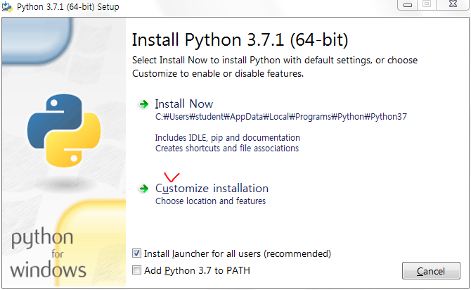
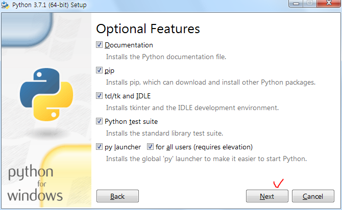
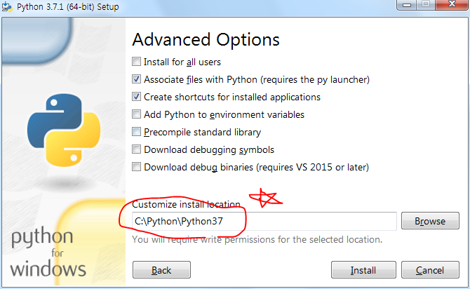

# 파이썬을 활용한 머신러닝 1일차

## 1. 파이썬 설치

### (1) 다운

- Download [Windows x86-64 executable installer](https://www.python.org/ftp/python/3.7.1/python-3.7.1-amd64.exe)

### (2) 설치

- 1. 
  2. 
  3. 

## 2. 파이참 설치

### (1) 다운

https://www.jetbrains.com/pycharm/

### (2) 설치

- 64비트만 체크하고 설치

## 3. 깃허브 연동

https://blog.naver.com/norankoj/221286289683

이 블로그가 가장 괜찮은듯

