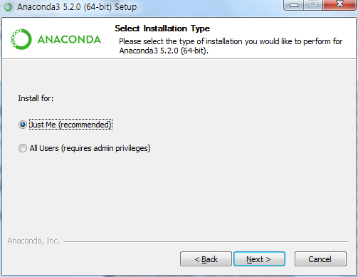
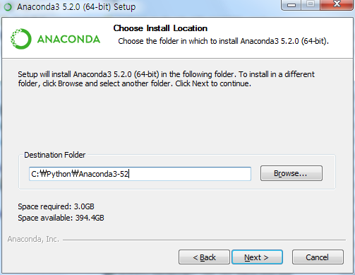
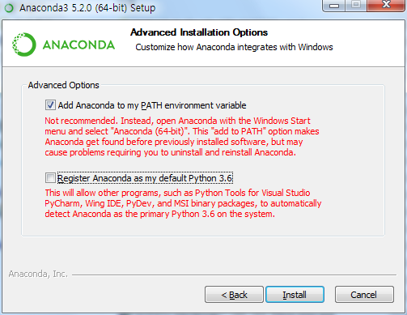
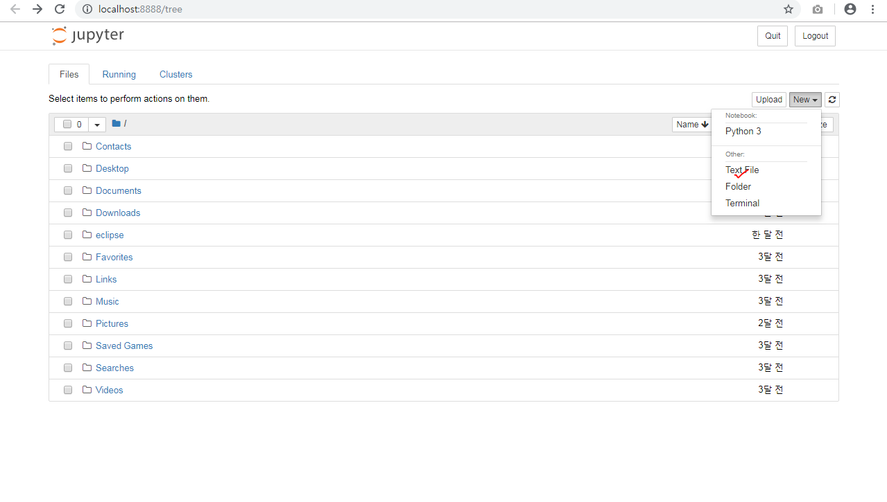

# 파이썬을 활용한 머신러닝 5일차(아나콘다)

## 1. 아나콘다 설치

### (1) 다운

- https://repo.continuum.io/archive/

- `[Anaconda3-5.2.0-Windows-x86_64.exe](https://repo.continuum.io/archive/Anaconda3-5.2.0- Windows-x86_64.exe)` 다운

### (2) 설치

- 
  - just me로 바꾼다.
- 
  - 파일 경로를 수정해준다.
- 
  - 레지스트리에 정보를 건드리지 않고, 사용자 PATH만 관리할 수 있게
  - 버전 관리에 좋다.

## 2. Jupyter 사용해보기

### (1) 사용해보기

#### 1) 폴더 생성

- Jupyter를 실행하면 자동으로 웹서버로 넘어간다.

  - localhost:8888이다.

- 파일을 넣을 폴더를 생성해보자

  - 
  - 

#### 2) 파이썬 실행

- Jupyter에서 파이썬을 사용해보자
- ctrl + enter, shift + enter로 해당 셀을 실행시킨다
- markdown을 중간에 삽입할 수 있다.
- %를 붙이면 cmd 명령어를 사용할 수 있다.
  - % pwd는 나의 파일 위치
  - % ls

