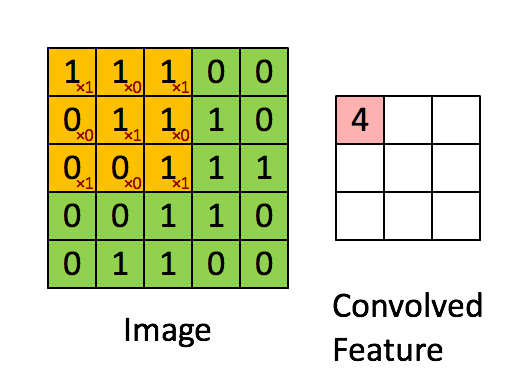

# ★★★★★ CNN

## ★★★ 참고 사이트

- 아래 참고 사이트를 통해 학습하면 좋다!

http://bcho.tistory.com/1149

http://coderkoo.tistory.com/13





Convolution -> RELU -> Convolution -> RELU -> POOL -> Convolution -> RELU -> Convolution -> RELU -> POOL -> Convolution -> RELU -> Convolution -> RELU -> POOL -> Fully Connected(SoftMax)

Convolution은 3x3과 같이 마스크를 끼우는 것

RELU 분석

POOL 데이터를 줄이는 역할


step1 : convolution => max pooling => flattening => full connected


★

https://medium.com/@jongdae.lim/%EA%B8%B0%EA%B3%84-%ED%95%99%EC%8A%B5-machine-learning-%EC%9D%80-%EC%A6%90%EA%B2%81%EB%8B%A4-part-4-63ed781eee3c


## 6-1 MNIST CNN

https://htmlpreview.github.io/?https://github.com/bigpycraft/iitp18-multicampus/blob/master/section-E/html/BDA-ML621-MNIST_CNN.html

IN

```python
import time
import os

def chk_processting_time(start_time, end_time):
    process_time = end_time - start_time
    p_time = int(process_time)
    p_min = p_time // 60
    p_sec = p_time %  60
    print('처리시간 : {p_min}분 {p_sec}초 경과되었습니다.'.format(
            p_min = p_min, 
            p_sec = p_sec
        ))
    return process_time

# Lab 11 MNIST and Convolutional Neural Network
import tensorflow as tf
import random
import matplotlib.pyplot as plt

from tensorflow.examples.tutorials.mnist import input_data

tf.set_random_seed(777)  # reproducibility

mnist = input_data.read_data_sets("data/MNIST_data/", one_hot=True)
# Check out https://www.tensorflow.org/get_started/mnist/beginners for
# more information about the mnist dataset
```


### Convolution Layer1

IN

```python
'''
Convolution Layer1
'''
# hyper parameters
learning_rate = 0.001
training_epochs = 15
batch_size = 100

# input place holders
X = tf.placeholder(tf.float32, [None, 784]) 
## [None, 784]는 'shape = [None, 784]'으로 행렬의 차원을 의미한다.가로는 none, 세로는 28x28이므로 784이다.
X_img = tf.reshape(X, [-1, 28, 28, 1])   # img 28x28x1 (black/white) 
## -1은 갯수를 모를 때, 맨마지막 1은 블랙화이트이고 색상이 있다면 RGB값이므로 3이된다.
## [-1, 28, 28, 1] 은 총 4차원을 의미한다. reshape[2,2] 라면 2x2의 행렬을 만드는 것이니깐!!
## -1은 사진의 갯수를 의미한다. 특히, -1은 갯수를 모를때, 사진이 몇개오는지는 모르겠을 때.
## 6-0 MNIST CNN Basic을 보면 좀 더 이해할 수 있다.
### 최종적으로 이해하기 쉽게 본다면, -1을 제외한 28, 28, 1을 보면된다. 가로 28, 세로 28, 높이 1인 크기이고, 만약에 RGB값이면 높이가 3이다. 이것이 기본이고, 이 크기에 사진 갯수만큼 올리는 것.
Y = tf.placeholder(tf.float32, [None, 10])
## 열이 10인 이유는 0~9가까지의 숫자를 맞추는 것이므로

# L1 ImgIn shape=(?, 28, 28, 1) ## (?,28,28,1) == (갯수를 몰라, 28x28, blackwhite)
W1 = tf.Variable(tf.random_normal([3, 3, 1, 32], stddev=0.01)) ## 3x3 크기로 컨벤션. Black/White를 32개로 만듬
### 최종적으로 이해하기 쉽게 본다면, 32을 제외한 3,3,1을 보면된다. 가로 3, 세로 3, 높이 1인 크기이고, Black/White라면 높이는 1, RGB라면 높이는 3이다. 이게 기본이고, 이 크기에 맞게 컨벤션 32개를 만든 것
print('W1 (tf.random_normal) \t: ', W1)
#    Conv     -> (?, 28, 28, 32)
#    Pool     -> (?, 14, 14, 32)

L1 = tf.nn.conv2d(X_img, W1, strides=[1, 1, 1, 1], padding='SAME')
### 6-0 MNIST CNN Basic을 보면 더 이해가 된다. strides는 4차원이다. [1,2,2,1]을 살펴본다면, 값이 한개인 것이 두개가 있고, 값이 두개인 것이 2개가 있다. 최종적으로 큰 것이 한개가 있다.
## stride가 [ , 1, 1, ]이라면 3x3 컨벤션이 한칸씩 오른쪽, 아래로 움직이는 것
# padding이 SAME이면 픽셀 컨벤션의 3x3에서 벗어난 NONE값이 있는 곳을 0으로 변환해서 계산
print('tf.nn.conv2d \t: ', L1)
L1 = tf.nn.relu(L1)
print('tf.nn.relu \t: ', L1)
L1 = tf.nn.max_pool(L1, ksize=[1, 2, 2, 1],
                    strides=[1, 2, 2, 1], padding='SAME')
## ksize는 max_pool의 컨벤션 크기라고 생각해도 된다. stride는 움직이는 것이다.
## 컨벤션과 다르게 pool은 겹치지 않으면서 이어나간다. 컨벤션이 1,1로 움직였으므로 생긴 크기가 28이라면 pool은 겹치지 않게 이어나갔으므로 1/2가 된다. 조금 어려워도 겹친상태 겹치지 않은 상태를 생각해보면 된다.
print('tf.nn.max_pool \t: ', L1)
# '''
# Tensor("Conv2D:0", shape=(?, 28, 28, 32), dtype=float32) # 28x28이 32개
# Tensor("Relu:0", shape=(?, 28, 28, 32), dtype=float32) # 28x28이 32개의 크기가 줄어듦
# Tensor("MaxPool:0", shape=(?, 14, 14, 32), dtype=float32) # pool을 통해 반으로 줄어듦
# '''
```


OUT

```python
W1 (tf.random_normal) 	:  <tf.Variable 'Variable:0' shape=(3, 3, 1, 32) dtype=float32_ref>
tf.nn.conv2d 	:  Tensor("Conv2D:0", shape=(?, 28, 28, 32), dtype=float32)
tf.nn.relu 	:  Tensor("Relu:0", shape=(?, 28, 28, 32), dtype=float32)
tf.nn.max_pool 	:  Tensor("MaxPool:0", shape=(?, 14, 14, 32), dtype=float32)
```


### Convolution Layer2

IN : 

```python
'''
Convolution Layer2
'''
# L2 ImgIn shape=(?, 14, 14, 32)
W2 = tf.Variable(tf.random_normal([3, 3, 32, 64], stddev=0.01)) 
## 3x3 32개를 64개로 늘리겠다. convolution layer1에서 32개를 만들었으므로.
print('W2 (tf.random_normal) \t: ', W2)
#    Conv      ->(?, 14, 14, 64)
#    Pool      ->(?, 7, 7, 64)
L2 = tf.nn.conv2d(L1, W2, strides=[1, 1, 1, 1], padding='SAME')
print('tf.nn.conv2d \t:', L2)
L2 = tf.nn.relu(L2)
print('tf.nn.relu \t:', L2)
L2 = tf.nn.max_pool(L2, ksize=[1, 2, 2, 1],
                    strides=[1, 2, 2, 1], padding='SAME')
print('tf.nn.max_pool \t:', L2)
L2_flat = tf.reshape(L2, [-1, 7 * 7 * 64])
## L2_flat은 4차원이었던 shape를 2차원으로 줄이는 것이다.
### 최종적으로 이해하기 쉽게 본다면, 7x7x64의 크기인 한 줄이 총 ?(==-1)개의 사진만큼 있는 것이다.
print('tf.reshape \t:', L2_flat)
# '''
# Tensor("Conv2D_1:0", shape=(?, 14, 14, 64), dtype=float32)
# Tensor("Relu_1:0", shape=(?, 14, 14, 64), dtype=float32)
# Tensor("MaxPool_1:0", shape=(?, 7, 7, 64), dtype=float32)
# Tensor("Reshape_1:0", shape=(?, 3136), dtype=float32)
```

OUT

```python
W2 (tf.random_normal) 	:  <tf.Variable 'Variable_1:0' shape=(3, 3, 32, 64) dtype=float32_ref>
tf.nn.conv2d 	: Tensor("Conv2D_1:0", shape=(?, 14, 14, 64), dtype=float32)
tf.nn.relu 	: Tensor("Relu_1:0", shape=(?, 14, 14, 64), dtype=float32)
tf.nn.max_pool 	: Tensor("MaxPool_1:0", shape=(?, 7, 7, 64), dtype=float32)
tf.reshape 	: Tensor("Reshape_1:0", shape=(?, 3136), dtype=float32)
```


### Fully Connected (FC, Dense) layer

In :

```python
'''
Fully Connected (FC, Dense) Layer
'''
# Final FC 7x7x64 inputs -> 10 outputs
W3 = tf.get_variable("W3", shape=[7 * 7 * 64, 10],
                     initializer=tf.contrib.layers.xavier_initializer())
## W3라는 변수를 만든다. 이름은 W3이고, 모양은 7x7x64이며 최종 10개의 output을 만든다. initilizer는 xavier를 사용한다.
print('W3 (xavier_initializer) \t: ', W3)

b = tf.Variable(tf.random_normal([10])) ## 임의의 수 10개를 만든다. ([1], 0, 10) 으로 하면 0에서 10사이에서 임의의 수 1개를 만든다.
logits = tf.matmul(L2_flat, W3) + b
## logits는 y=aX1 + bX2 + ... + c를 의미한다고 보면된다.
## matmul은 matrix multiple으로 행렬 곱을 의미한다.
## 1-4. Multi-Variable linear regression을 참고하면 이해할 수 있다.

# define cost/loss & optimizer
cost = tf.reduce_mean(tf.nn.softmax_cross_entropy_with_logits(
    logits=logits, labels=Y))
optimizer = tf.train.AdamOptimizer(learning_rate=learning_rate).minimize(cost)

print('cost :', cost)
print('optimizer :\n', optimizer)
```

- .Variable 는 언제나 새로운 객체를 만들어 낸다. 이미 같은 이름의 객체가 있다면 _1, _2 등을 붙여서 유니크(uniqu)하게 만든다.

  .get_variable는 이미 존재하는 객체를 매개변수로 받을 수도 있다. (변수는 같은 객체를 가리키게 된다.) 그런데, 해당 객체가 없다면 새로운 객체로 만들어 낸다.

  **[출처]** [[Tensorflow\] Variable과 get_variable의 차이](https://blog.naver.com/pkk1113/221131889339)|**작성자** [대박](https://blog.naver.com/pkk1113)

- logits = tf.matmul(L2_flat, W3) + b

  - matmul?

out :

```python
W3 (xavier_initializer) 	:  Tensor("W3/read:0", shape=(3136, 10), dtype=float32)
cost : Tensor("Mean:0", shape=(), dtype=float32)
optimizer :
 name: "Adam"
op: "NoOp"
input: "^Adam/update_Variable/ApplyAdam"
input: "^Adam/update_Variable_1/ApplyAdam"
input: "^Adam/update_W3/ApplyAdam"
input: "^Adam/update_Variable_2/ApplyAdam"
input: "^Adam/Assign"
input: "^Adam/Assign_1"
```


### Training

IN

```python
# initialize
sess = tf.Session() ## 세션 생성
sess.run(tf.global_variables_initializer()) # 세션 내 변수를 초기화

# train my model
print('Learning started. It takes sometime.')
time1 = time.time()
for epoch in range(training_epochs): ## training_epochs는 위에서 15로 정의했다.
    avg_cost = 0
    total_batch = int(mnist.train.num_examples / batch_size) 
    ## batch_size는 샘플을 한 번에 몇 개씩 처리할지를 정하는 부분. 너무 크면 학습 속도가 느려지고, 너무 작으면 각 실행 값의 편차가 생겨서 결과값이 불안정해진다.

    for i in range(total_batch):
        batch_xs, batch_ys = mnist.train.next_batch(batch_size)
        feed_dict = {X: batch_xs, Y: batch_ys}
        c, _ = sess.run([cost, optimizer], feed_dict=feed_dict)
        avg_cost += c / total_batch

    print('Epoch:', '%04d' % (epoch + 1), 'cost =', '{:.9f}'.format(avg_cost))

print('Learning Finished!')
time2 = time.time()

chk_processting_time(time1, time2)
```

OUT

```python
Learning started. It takes sometime.
Epoch: 0001 cost = 0.358514333
Epoch: 0002 cost = 0.098277139
Epoch: 0003 cost = 0.070610365
Epoch: 0004 cost = 0.057040289
Epoch: 0005 cost = 0.047120309
Epoch: 0006 cost = 0.041251445
Epoch: 0007 cost = 0.036282639
Epoch: 0008 cost = 0.032006412
Epoch: 0009 cost = 0.027889032
Epoch: 0010 cost = 0.024118069
Epoch: 0011 cost = 0.021238505
Epoch: 0012 cost = 0.020259268
Epoch: 0013 cost = 0.016682331
Epoch: 0014 cost = 0.013662303
Epoch: 0015 cost = 0.013655864
Learning Finished!

처리시간 : 13분 52초 경과되었습니다.
832.6799268722534
```


### Evaluation

IN

```python
# Test model and check accuracy
correct_prediction = tf.equal(tf.argmax(logits, 1), tf.argmax(Y, 1))
accuracy = tf.reduce_mean(tf.cast(correct_prediction, tf.float32))
print('Accuracy:', sess.run(accuracy, feed_dict={
      X: mnist.test.images, Y: mnist.test.labels}))

# Get one and predict
r = random.randint(0, mnist.test.num_examples - 1)
print("Label: ", sess.run(tf.argmax(mnist.test.labels[r:r + 1], 1)))
print("Prediction: ", sess.run(
    tf.argmax(logits, 1), feed_dict={X: mnist.test.images[r:r + 1]}))

plt.imshow(mnist.test.images[r:r + 1].
          reshape(28, 28), cmap='Greys', interpolation='nearest')
plt.show()
```

OUT

```python
Accuracy: 0.9874
Label:  [3]
Prediction:  [3]
```


  