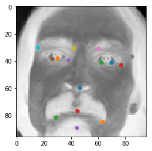
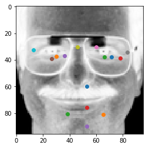

# Kaggle - Facial Keypoints Detection(JSH)

IN

```python
import time
import os

def chk_processting_time(start_time, end_time):
    process_time = end_time - start_time
    p_time = int(process_time)
    p_min = p_time // 60
    p_sec = p_time %  60
    print('처리시간 : {p_min}분 {p_sec}초 경과되었습니다.'.format(
            p_min = p_min, 
            p_sec = p_sec
        ))
    return process_time

# Lab 11 MNIST and Convolutional Neural Network
import tensorflow as tf
import random
import matplotlib.pyplot as plt
```

    C:\Python\Anaconda3-52\lib\site-packages\h5py\__init__.py:36: FutureWarning: Conversion of the second argument of issubdtype from `float` to `np.floating` is deprecated. In future, it will be treated as `np.float64 == np.dtype(float).type`.
      from ._conv import register_converters as _register_converters


## 데이터 전처리

- 이 함수들에서 살펴봐야하는 것들은 makingResultList, makingImagesList, makingBatch 함수들이다.
  - 특히 makingBatch 함수는 Training 섹션에서 사용되므로 batch_xs, batch_ys가 어떻게 생긴 유형인지 살펴보는 것이 중요하다.

IN


```python
import pandas as pd
import numpy as np
from PIL import Image

def makingResultsList(trainingData) :
    # makingBatch를 위해 사용되어야 한다. 
    # resultsList는 최종 눈, 코, 입 등의 x,y 좌표값을 담은 리스트로 반환된다.
    resultsList = []
    for i in range(len(trainingData.iloc[:, 0])) :
        resultsList.append(np.array(trainingData.iloc[i][:30]))
    return resultsList

def makingImagesList(trainingData) :
    imagesList = []
    for i in range(len(trainingData.iloc[:, 0])) :
        imagesList.append(np.array(trainingData.iloc[i][30].split(" "), dtype=np.uint8))
    return imagesList

def resize96(trainingData):  # 전체 행의 image column을 96x96 행렬로 변환하여 resize_images에 입력
    imagesList = []
    for i in range(len(trainingData.iloc[:, 0])):  # len(a.iloc([:, 0]) 은 행의 갯수를 추출하기 위해 만듬
        imagesList.append(np.array(trainingData.iloc[i][30].split(" "), dtype=np.uint8).reshape(96, 96))
        # dtype를 uint8로 지정해줘야 그림이 출력됨
    return imagesList

def showImage(imagesList, row):
    # 원하는 행의 사진을 출력합니다.
    # imagesList.append(np.array(trainingData.iloc[i][30].split(" "), dtype=np.uint8).reshape(96, 96)) 에서
    # dtype를 uint8로 지정해줘야 그림이 출력됨
    return Image.fromarray(imagesList[row])


def makingBatch(imagesList, resultsList, count, batch_size) :
    batch_xs = np.array(imagesList[count*batch_size:(count+1)*batch_size])
    batch_ys = np.array(resultsList[count*batch_size:(count+1)*batch_size])
    return batch_xs, batch_ys


if __name__ == "__main__":
    trainingData = pd.read_csv("training.csv")
    trainingData.dropna(inplace=True)
    # trainingData.info()

    imagesList = []
    imagesList = makingImagesList(trainingData)
    resultsList = []
    resultsList = makingResultsList(trainingData)
```


## Convolution Layer1

IN


```python
'''
Convolution Layer1
'''
# hyper parameters
learning_rate = 0.001
training_epochs = 100
batch_size = 20

# input place holders
# 96 * 96 = 9216
# 데이터를 집어넣을 X 변수에는 9216크기의 Image 값을 넣는다.
# None은 Image 갯수가 몇개인지 정확하게 모를 경우 None을 의미한다.
X = tf.placeholder(tf.float32, [None, 9216]) 

# [many images, 96x96, black&white]
## 작성한 CNN 설명을 반드시 참고하자. 간단히 설명하면 4차원의 배열을 만든다.
X_img = tf.reshape(X, [-1, 96, 96, 1])

# eyes XY, noseXY, .. colums' counts are 30
# 우리가 산출해야하는 값은 눈, 코, 입 등의 X, Y 값이므로 30개이다.
Y = tf.placeholder(tf.float32, [None, 30])

# declare first Convolution Frame. [3x3, black/white, 32 nodes(conventions)]
# ★★ 첫번째 Convolution Layer의 Frame을 만들어준다. 3x3크기이고, black/white, 32개의 노드이다.
W1 = tf.Variable(tf.random_normal([3, 3, 1, 32], stddev=0.01))
print('W1 (tf.random_normal) \t: ', W1)

# declare first Convolution. per moving 1pixel to right&down
# Conv -> (?, 96, 96, 32)
# 3x3의 convolution이 좌우상하 1칸씩 이동하게 된다.
L1 = tf.nn.conv2d(X_img, W1, strides=[1, 1, 1, 1], padding='SAME')
print('tf.nn.conv2d \t: ', L1)

# First Relu
## Relu를 할지 다른 최적화 함수를 쓸지는 고민해볼 문제이다.
## Relu를 한번만 적용할지 2번이상 적용할지 또한 고민해볼 문제이다.
L1 = tf.nn.relu(L1)
print('tf.nn.relu \t: ', L1)

# First Pool
# Pool -> (?, 48, 48, 32)
L1 = tf.nn.max_pool(L1, ksize=[1, 2, 2, 1],strides=[1, 2, 2, 1], padding='SAME')
print('tf.nn.max_pool \t: ', L1)
```

OUT

```python
W1 (tf.random_normal) 	:  <tf.Variable 'Variable:0' shape=(3, 3, 1, 32) dtype=float32_ref>
tf.nn.conv2d 	:  Tensor("Conv2D:0", shape=(?, 96, 96, 32), dtype=float32)
tf.nn.relu 	:  Tensor("Relu:0", shape=(?, 96, 96, 32), dtype=float32)
tf.nn.max_pool 	:  Tensor("MaxPool:0", shape=(?, 48, 48, 32), dtype=float32)
```

### 고찰

- learning_rate = 0.001
  training_epochs = 100
  batch_size = 20
  - 위와 같은 변수들은 cost값을 조정하는데 필요한 값들이다. 이 값들을 적절히 조절하면 cost값에 변화를 주기 때문에 경험적, 반복적으로 시도를 해봐야한다.
- W1 = tf.Variable(tf.random_normal([3, 3, 1, 32], stddev=0.01))
  - Convolution Layer Frame 역시 3x3을 할지 또는 4x4개를 할지. 노드는 32개를 만들지 64개를 만들지 cost값에 영향을 준다.
- Relu, Pool 역시 같다.


## Convolution Layer2

IN


```python
'''
Convolution Layer2
'''
# tf.nn.max_pool 	:  Tensor("MaxPool_1:0", shape=(?, 48, 48, 32), dtype=float32)
# declare second Convolution Frame. [3x3, 32 black/white base nodes, 64 nodes(conventions)]
# increase 32nodes to 64nodes
W2 = tf.Variable(tf.random_normal([3, 3, 32, 64], stddev=0.01)) 
print('W2 (tf.random_normal) \t: ', W2)

# declare second Convolution. per moving 1pixel to right&down
#    Conv      ->(?, 48, 48, 64)
L2 = tf.nn.conv2d(L1, W2, strides=[1, 1, 1, 1], padding='SAME')
print('tf.nn.conv2d \t:', L2)

# Second Relu
L2 = tf.nn.relu(L2)
print('tf.nn.relu \t:', L2)

# Second Pool
#    Pool      ->(?, 24, 24, 64)
L2 = tf.nn.max_pool(L2, ksize=[1, 2, 2, 1], strides=[1, 2, 2, 1], padding='SAME')
print('tf.nn.max_pool \t:', L2)


'''
Making 4demension to 2demension
'''
## 최종적으로 model을 training 하기 위해서는 2차원으로 행렬을 조정해야한다!
L2_flat = tf.reshape(L2, [-1, 24 * 24 * 64])
print('tf.reshape \t:', L2_flat)
```

OUT

```python
W2 (tf.random_normal) 	:  <tf.Variable 'Variable_1:0' shape=(3, 3, 32, 64) dtype=float32_ref>
tf.nn.conv2d 	: Tensor("Conv2D_1:0", shape=(?, 48, 48, 64), dtype=float32)
tf.nn.relu 	: Tensor("Relu_1:0", shape=(?, 48, 48, 64), dtype=float32)
tf.nn.max_pool 	: Tensor("MaxPool_1:0", shape=(?, 24, 24, 64), dtype=float32)
tf.reshape 	: Tensor("Reshape_1:0", shape=(?, 36864), dtype=float32)
```

### 고찰

- tf.nn.conv2d 	: Tensor("Conv2D_1:0", shape=(?, 48, 48, 64), dtype=float32)
  tf.nn.relu 	: Tensor("Relu_1:0", shape=(?, 48, 48, 64), dtype=float32)
  tf.nn.max_pool 	: Tensor("MaxPool_1:0", shape=(?, 24, 24, 64), dtype=float32)
  tf.reshape 	: Tensor("Reshape_1:0", shape=(?, 36864), dtype=float32)
  - 배열 크기가 어떤 식으로 생성이 되었는지 이렇게 print하여 정확한 값을 넣어줘야한다.
  - 2번째 Convolution Layer, Relu, pool 등 어떻게 조정할
- 최종 model을 training하기 위해서는 flattening 을 실행해야한다. 


## Fully Connected Layer & Saver

- 앞에서 만들어진 layers를 바탕으로 최종적으로 Output을 내기 위한 Layer이다.

IN


```python
'''
Fully Connected (FC, Dense) Layer
'''

# ★모델 저장용★학습에 직접적으로 사용하지 않고 학습 횟수에 따라 단순히 증가시킬 변수를 만듭니다.
global_step = tf.Variable(0, trainable=False, name='global_step')

# Final FC 24x24x64 inputs -> 10 outputs
#reuse=tf.AUTO_REUSE
W6 = tf.get_variable("W6", shape=[24 * 24 * 64, 30], initializer=tf.contrib.layers.xavier_initializer())
print('W6 (xavier_initializer) \t: ', W6)

b = tf.Variable(tf.random_normal([30])) ## 임의의 수 10개를 만든다. ([1], 0, 10) 으로 하면 0에서 10사이에서 임의의 수 1개를 만든다.

# logits = AX1 + BX2 + CX3 + ... + ?X30 + b
logits = tf.matmul(L2_flat, W6) + b
```

OUT

```python
W6 (xavier_initializer) 	:  <tf.Variable 'W6:0' shape=(36864, 30) dtype=float32_ref>
```


- 모델을 저장하기위해 optimizer를 train_op로 최종적으로 변환시킨다.
  - 모델 저장은 중요하니깐 꼭 기억할 것

IN

```python
# define cost/loss & optimizer
# cost = tf.reduce_mean(tf.nn.softmax_cross_entropy_with_logits(logits=logits, labels=Y))
cost = tf.reduce_mean(tf.square(logits-Y))
# optimizer = tf.train.AdamOptimizer(learning_rate=learning_rate).minimize(cost)

# ★모델 저장용★
optimizer = tf.train.AdamOptimizer(learning_rate=learning_rate)
# ★모델 저장용★ global_step로 넘겨준 변수를, 학습용 변수들을 최적화 할 때 마다 학습 횟수를 하나씩 증가시킵니다.
train_op = optimizer.minimize(cost, global_step=global_step)

print('cost :', cost)
print('optimizer :\n', optimizer)
print('train_op :\n', train_op)
```

OUT

```python
cost : Tensor("Mean:0", shape=(), dtype=float32)
optimizer :
 <tensorflow.python.training.adam.AdamOptimizer object at 0x000000000C020B00>
train_op :
 name: "Adam"
op: "AssignAdd"
input: "global_step"
input: "Adam/value"
attr {
  key: "T"
  value {
    type: DT_INT32
  }
}
attr {
  key: "_class"
  value {
    list {
      s: "loc:@global_step"
    }
  }
}
attr {
  key: "use_locking"
  value {
    b: false
  }
}
```


​    

## Training

IN


```python
'''
Training
'''
# initialize
sess = tf.Session() ## 세션 생성

# ★모델 저장용★
# 모델을 저장하고 불러오는 API를 초기화합니다.
# global_variables() 함수를 통해 앞서 정의하였던 변수들을 저장하거나 불러올 변수들로 설정합니다.
saver = tf.train.Saver(tf.global_variables())
chkpoint = tf.train.get_checkpoint_state('./models')
if chkpoint and tf.train.checkpoint_exists(chkpoint.model_checkpoint_path):
    saver.restore(sess, chkpoint.model_checkpoint_path)
else:
    sess.run(tf.global_variables_initializer()) # 세션 내 변수를 초기화

# train my model
print('Learning started. It takes sometime.')
time1 = time.time()
for epoch in range(training_epochs): ## training_epochs는 위에서 15로 정의했다.
    avg_cost = 0
#     total_batch = int(mnist.train.num_examples / batch_size)
    total_batch = int(len(trainingData.iloc[:,0]) / batch_size) 
    ## batch_size는 샘플을 한 번에 몇 개씩 처리할지를 정하는 부분. 너무 크면 학습 속도가 느려지고, 너무 작으면 각 실행 값의 편차가 생겨서 결과값이 불안정해진다.

    for i in range(total_batch):
        batch_xs, batch_ys = makingBatch(imagesList, resultsList, i, batch_size)
        feed_dict = {X: batch_xs, Y: batch_ys}
        # ★모델 저장용★ optimizer를 train_op로 변경해준다.
        # c, _ = sess.run([cost, optimizer], feed_dict=feed_dict)
        c, _ = sess.run([cost, train_op], feed_dict=feed_dict)
        avg_cost += c / total_batch    

    print('Epoch:', '%04d' % (epoch + 1), 'cost =', '{:.9f}'.format(avg_cost))
    print('Step: %d, ' % sess.run(global_step))
    if (float(avg_cost) <= 7) :
        break    

print('Learning Finished!')
time2 = time.time()

chk_processting_time(time1, time2)


# ★모델 저장용★최적화가 끝난 뒤, 변수를 저장합니다.
saver.save(sess, './models/test.model', global_step=global_step)
```

OUT

```python
INFO:tensorflow:Restoring parameters from ./models\test.model-81641
Learning started. It takes sometime.
Epoch: 0001 cost = 6.321144123
Step: 81748, 
Learning Finished!
처리시간 : 0분 41초 경과되었습니다.
```

```python
'./models/test.model-81748'
```


## Training Data Test Model

IN


```python
# Test model and check accuracy
correct_prediction = tf.equal(tf.argmax(logits, 1), tf.argmax(Y, 1))
accuracy = tf.reduce_mean(tf.cast(correct_prediction, tf.float32))

r = 0

prediction = sess.run(logits, feed_dict={X: np.array(imagesList[r:r + 1])})
print(prediction)
plt.scatter(prediction[0][0], prediction[0][1])
plt.scatter(prediction[0][2], prediction[0][3])
plt.scatter(prediction[0][4], prediction[0][5])
plt.scatter(prediction[0][6], prediction[0][7])
plt.scatter(prediction[0][8], prediction[0][9])
plt.scatter(prediction[0][10], prediction[0][11])
plt.scatter(prediction[0][12], prediction[0][13])
plt.scatter(prediction[0][14], prediction[0][15])
plt.scatter(prediction[0][16], prediction[0][17])
plt.scatter(prediction[0][18], prediction[0][19])
plt.scatter(prediction[0][20], prediction[0][21])
plt.scatter(prediction[0][22], prediction[0][23])
plt.scatter(prediction[0][24], prediction[0][25])
plt.scatter(prediction[0][26], prediction[0][27])
plt.scatter(prediction[0][28], prediction[0][29])
plt.imshow(np.array(imagesList[r:r + 1]).reshape(96, 96), cmap='Greys', interpolation='nearest')
```

OUT

```python
[[69.56515  40.784157 29.970728 37.68249  62.26595  40.950493 76.92408
  42.51515  37.895206 38.886272 26.065838 38.054775 59.92734  30.481411
  84.82022  36.312706 42.13128  30.033926 15.530828 29.975307 46.347218
  59.231323 63.31977  84.50111  28.915134 81.50171  44.56363  76.7281
  44.255947 88.89664 ]]
```

    <matplotlib.image.AxesImage at 0x1c250e80>





## Test Data Test Model

### Test Data 전처리

- 위에서는 Training Data를 위한 함수를 만들었었다. Test Data는 Feature값이 다르므로 다시 조금 수정해서 함수를 구현하였다.

IN


```python
def makingImagesList(trainingData) :
    imagesList = []
    for i in range(len(trainingData.iloc[:, 0])) :
        imagesList.append(np.array(trainingData.iloc[i][1].split(" "), dtype=np.uint8))
    return imagesList

trainingData2 = pd.read_csv("test.csv")
imagesList2 = []
imagesList2 = makingImagesList(trainingData2)
```


```python
# Test model and check accuracy
correct_prediction = tf.equal(tf.argmax(logits, 1), tf.argmax(Y, 1))
accuracy = tf.reduce_mean(tf.cast(correct_prediction, tf.float32))
print('Accuracy:', sess.run(accuracy, feed_dict={X: np.array(imagesList[0:100]), Y: np.array(resultsList[0:100])}))

r = 330

prediction = sess.run(logits, feed_dict={X: np.array(imagesList2[r:r + 1])})
print(prediction)
plt.scatter(prediction[0][0], prediction[0][1])
plt.scatter(prediction[0][2], prediction[0][3])
plt.scatter(prediction[0][4], prediction[0][5])
plt.scatter(prediction[0][6], prediction[0][7])
plt.scatter(prediction[0][8], prediction[0][9])
plt.scatter(prediction[0][10], prediction[0][11])
plt.scatter(prediction[0][12], prediction[0][13])
plt.scatter(prediction[0][14], prediction[0][15])
plt.scatter(prediction[0][16], prediction[0][17])
plt.scatter(prediction[0][18], prediction[0][19])
plt.scatter(prediction[0][20], prediction[0][21])
plt.scatter(prediction[0][22], prediction[0][23])
plt.scatter(prediction[0][24], prediction[0][25])
plt.scatter(prediction[0][26], prediction[0][27])
plt.scatter(prediction[0][28], prediction[0][29])
plt.imshow(np.array(imagesList2[r:r + 1]).reshape(96, 96), cmap='Greys', interpolation='nearest')

```

OUT

    Accuracy: 0.94
    [[71.56294  37.805923 29.97168  37.1111   66.1521   37.883324 78.28202
      38.61184  36.258648 37.026104 26.456486 39.176826 59.979107 30.092823
      83.531075 34.24575  46.044067 30.310787 12.783207 32.277187 52.925056
      59.841713 65.427864 81.08659  38.358692 80.37673  52.93183  75.80861
      53.16575  89.64239 ]]

    <matplotlib.image.AxesImage at 0x1c545630>





## Kaggle 제출을 위한 데이터 처리


```python
predictionsList = []

for i in range(len(imagesList2)) :
    prediction = sess.run(logits, feed_dict={X: np.array(imagesList2[i:i+1])})
    predictionsList.append(prediction)

predictionsList
```


```python
look_id = pd.read_csv('./IdLookupTable.csv')
```


```python
look_id.info()
```


```python
look_id.drop('Location', axis=1, inplace=True)
```


```python
look_id.info()
```


```python
ind = np.array(trainingData.columns[:-1])
value = np.array(range(0,30))
maps = pd.Series(value, ind)
```


```python
look_id['location_id'] = look_id.FeatureName.map(maps)
```


```python
df = look_id.copy()

location = pd.DataFrame({'Location':[]})
for i in range(1,1784):
    ind = df[df.ImageId==i].location_id
    location = location.append(pd.DataFrame(predictionsList[i-1][0][list(ind)],columns=['Location']), ignore_index=True)
```


```python
look_id['Location']=location
```


```python
look_id[['RowId','Location']].to_csv('Predict.csv',index=False)
```

## Kaggle 제출을 위한 API 설치 및 제출


```python
#### pip install은 하나씩 실행하기를 권장한다.
!pip install kaggle
!pip show kaggle

#### Kaggle API가 설치된 위치를 확인한 후 다운로드 한 kaggle.json 파일을 이동시킨다
#### kaggle.json은 kaggle 홈페이지 접속 후 My Account - Token 을 다운 받으면 된다.
#### 참고로 kaggle.json 이동해야할 위치는 (C:\Users\student\.kaggle)이다.
!kaggle config path

#### Submission
! kaggle competitions submit -c facial-keypoints-detection -f Predict.csv -m'submission
```
